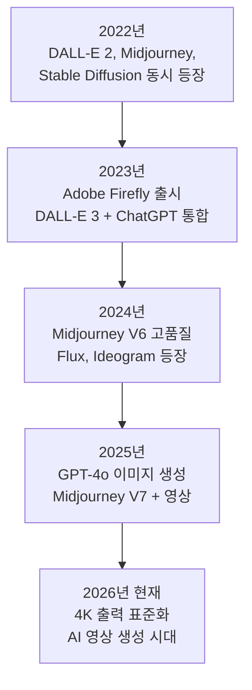
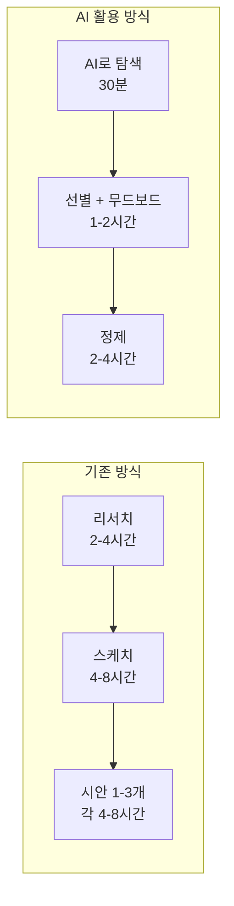
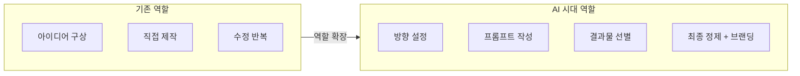

# 생성형 AI가 바꾸는 디자인 워크플로우

> 텍스트 한 줄이 이미지가 되는 시대, 디자이너의 역할은 어떻게 달라질까?

## 개요

이 세션에서는 AI 이미지 생성이 무엇이고, 디자인 실무를 어떻게 바꾸고 있는지 알아봅니다. 어렵고 복잡한 기술 이야기가 아니라, "내가 이걸 왜 배워야 하지?"에 대한 답을 찾는 시간입니다.

**선수 지식**: 없음 — 이 코스의 첫 번째 세션입니다!

**학습 목표**:
- AI 이미지 생성이 뭔지 한 문장으로 설명할 수 있다
- 2022년부터 지금까지 어떤 도구들이 등장했는지 흐름을 안다
- 기존 디자인 작업 방식과 AI 활용 방식의 차이를 비교할 수 있다
- 왜 디자이너가 AI 도구를 배워야 하는지 자신의 말로 설명할 수 있다

## 왜 알아야 할까?

2026년 현재, 디자인 업계에서 AI 도구를 쓰지 않는 사람을 찾기가 더 어려워졌습니다. 옆자리 디자이너가 프롬프트 한 줄로 10개 시안을 뽑아내는 동안, 하나하나 손으로 만들고 있다면 생산성 격차는 벌어질 수밖에 없어요.

하지만 걱정하지 마세요. AI 도구는 "디자이너를 대체하는 것"이 아니라 "디자이너의 손을 빠르게 해주는 것"입니다. 이 세션이 그 첫걸음이에요.

## 핵심 내용

### 1. AI 이미지 생성이란?

**한 줄 요약**: 텍스트로 원하는 이미지를 설명하면, AI가 그에 맞는 새로운 이미지를 만들어주는 기술입니다.

카페에서 바리스타에게 "따뜻하고, 달콤하고, 시나몬 향이 나는, 크림이 올라간 음료"라고 주문하면 바리스타가 한 잔을 만들어주죠? AI 이미지 생성도 똑같아요. 여러분이 텍스트(이걸 **프롬프트**라고 부릅니다)로 원하는 이미지를 설명하면, AI가 그 설명에 맞는 이미지를 만들어줍니다.

예를 들어 이렇게요:

> **프롬프트 예시**
> "석양이 지는 바닷가에 앉아 있는 고양이, 수채화 스타일, 따뜻한 색감"

중요한 건, AI가 인터넷에서 기존 이미지를 "찾아서 보여주는" 게 아니라는 점이에요. 학습한 패턴을 바탕으로 **세상에 없던 새로운 이미지**를 만들어냅니다. 마치 수천 점의 그림을 공부한 화가가 자기만의 새 그림을 그리는 것과 비슷하죠.

### 2. 2022~2026, AI 이미지 도구의 등장과 발전

어느 날 갑자기 나타난 기술이 아닙니다. 2022년을 기점으로 폭발적으로 발전했어요.

**지금 주요 플랫폼을 한눈에 정리하면:**

| 플랫폼 | 한 줄 특징 | 잘하는 것 |
|--------|-----------|----------|
| **ChatGPT** | 대화하면서 이미지 생성·수정 | 글자가 들어간 이미지, 수정 편리 |
| **Midjourney** | 예술적 퀄리티 최고 | 분위기 있는 아트워크, 영상 |
| **Gemini** | 무료, 빠름 | 빠른 아이디어 스케치 |
| **Adobe Firefly** | 포토샵·일러스트레이터 연동 | 기존 디자인에 AI 편집 추가 |
| **Flux** | 사진처럼 사실적 | 포토리얼리즘 |
| **Ideogram** | 이미지 속 글자 정확 | 로고, 포스터, 타이포그래피 |
| **Leonardo AI** | 캐릭터 일관성 | 같은 캐릭터 여러 장면 |

### 3. 기존 워크플로우 vs. AI 워크플로우

AI가 실제 디자인 작업을 어떻게 바꾸는지, 비교해보면 확 느껴집니다.

**기존 방식:**
1. 클라이언트 브리프 수령
2. 레퍼런스 리서치 (2~4시간)
3. 무드보드 제작 (3~5시간)
4. 러프 스케치 (4~8시간)
5. 시안 제작 — 1~3개, 각 4~8시간
6. 피드백 → 수정 반복
7. 최종 완성

**AI 활용 방식:**
1. 클라이언트 브리프 수령
2. AI로 다양한 방향 탐색 — 30분~1시간, **10~50개 시안**
3. 마음에 드는 방향 골라서 무드보드 구성 (1~2시간)
4. AI 결과물 기반으로 정제 + 디테일 작업 (2~4시간)
5. 피드백 → AI로 빠른 수정 (30분~1시간/회)
6. 최종 완성 + 후처리

**체감 차이:**
- 아이디어 탐색 속도 **3~5배** 향상
- 스톡 이미지·커스텀 일러스트 비용 **60~80%** 절감
- 시안 수 **10배** 이상 확대 가능

### 4. 디자이너가 AI를 배워야 하는 진짜 이유

"AI가 디자이너를 대체하나요?"라는 질문을 많이 받습니다.

결론부터 말하면: **AI를 잘 쓰는 디자이너가, AI를 안 쓰는 디자이너를 대체합니다.**

AI는 "버튼 하나로 완벽한 디자인"을 만들어주는 마법이 아니에요. 좋은 결과를 얻으려면 **무엇을 요청해야 하는지 아는 사람**이 필요합니다. 프롬프트에 "시네마틱 조명", "황금비 구도", "보색 대비" 같은 표현을 자연스럽게 쓸 수 있는 사람 — 그게 바로 디자이너예요.

| 디자이너의 기존 강점 | AI 시대에 이렇게 쓰인다 |
|---|---|
| 색채 감각, 구도 이해 | 프롬프트에 정확한 시각 표현을 담을 수 있다 |
| 클라이언트와의 소통 | AI 결과물을 브리프에 맞게 골라낼 수 있다 |
| 브랜드 일관성 감각 | 여러 AI 결과물에 통일된 톤 적용 가능 |
| 디테일 감각 | AI 결과물의 이상한 부분을 바로 잡아낸다 |
| 트렌드 파악 | 시대에 맞는 비주얼 방향을 잡을 수 있다 |

**핵심**: AI가 "만드는 능력"을 보조해주는 거지, "판단하는 능력"은 여전히 디자이너의 몫입니다.

## 실습: 직접 해보기

### 활동 1: 내 워크플로우 자가 진단

현재 자신의 디자인 작업 과정을 아래 표에 적어보세요.

| 작업 단계 | 지금 걸리는 시간 | 가장 힘든 점 | AI가 도울 수 있을까? |
|----------|---------------|-------------|------------------|
| 아이디어 구상 | | | |
| 레퍼런스 리서치 | | | |
| 무드보드 제작 | | | |
| 시안 제작 | | | |
| 수정·반복 | | | |
| 최종 완성 | | | |

"가장 시간이 오래 걸리는 작업"과 "가장 반복적인 작업"에 동그라미 치세요. 이 두 가지가 AI가 가장 먼저 도울 수 있는 영역입니다.

### 활동 2: AI 활용 시나리오 생각하기

아래 세 가지 상황에서 AI를 어떻게 쓸 수 있을지 생각해보세요:

1. **소셜 미디어 에이전시**: 매주 20개 브랜드의 인스타그램 비주얼을 만들어야 합니다
2. **프리랜서 일러스트레이터**: 동화책 20장면을 같은 캐릭터 스타일로 그려야 합니다
3. **인하우스 디자이너**: 신제품 키비주얼 시안 10개를 이틀 안에 만들어야 합니다

> 💡 **힌트**: 셋 중 하나는 Midjourney의 캐릭터 참조 기능으로 크게 시간을 줄일 수 있고, 다른 하나는 ChatGPT의 대화형 수정이 유리합니다. 어떤 게 어떤 것일까요?

## 팁과 주의사항

> 🔥 **실무 팁**: AI를 처음 배울 때 가장 흔한 실수는 "완벽한 결과물"을 한 번에 기대하는 거예요. 프로들은 AI를 **아이디어 탐색 도구**로 먼저 씁니다. 50개 생성해서 3개 추리고, 그 3개를 다듬는 방식이죠. AI는 "완성품 생성기"가 아니라 "브레인스토밍 파트너"로 접근하세요.

> ⚠️ **흔한 오해**: "AI가 인터넷에서 이미지를 짜깁기한다?" — 아닙니다. AI는 학습한 패턴을 바탕으로 완전히 새로운 이미지를 만들어냅니다. 기존 이미지를 복사하거나 잘라붙이는 게 아니에요.

## 핵심 정리

| 개념 | 설명 |
|------|------|
| AI 이미지 생성 | 텍스트(프롬프트)로 원하는 이미지를 설명하면 AI가 새로운 이미지를 만들어주는 기술 |
| 프롬프트 | AI에게 원하는 이미지를 설명하는 텍스트. 이 코스에서 가장 많이 다루게 될 핵심 |
| AI 워크플로우 | 아이디어 탐색 → 선별 → 정제 순으로 AI를 디자인 과정에 끼워넣는 방식 |
| 디자이너의 역할 변화 | 직접 만드는 사람 → AI 결과물의 방향을 잡고 골라내는 사람으로 확장 |

## 다음 세션 미리보기

AI 이미지 생성의 큰 그림을 살펴봤으니, 다음 세션에서는 실제로 쓸 수 있는 주요 플랫폼들을 나란히 놓고 비교합니다. ChatGPT, Gemini, Midjourney — 같은 프롬프트를 넣으면 얼마나 다른 결과가 나오는지, 어떤 상황에 어떤 도구를 써야 하는지 구체적으로 알아볼게요.
