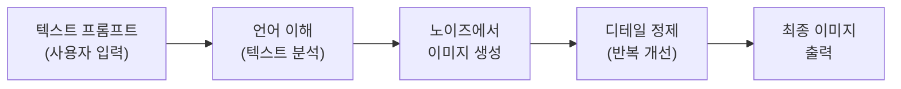
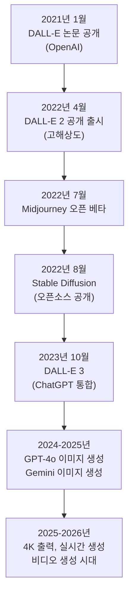
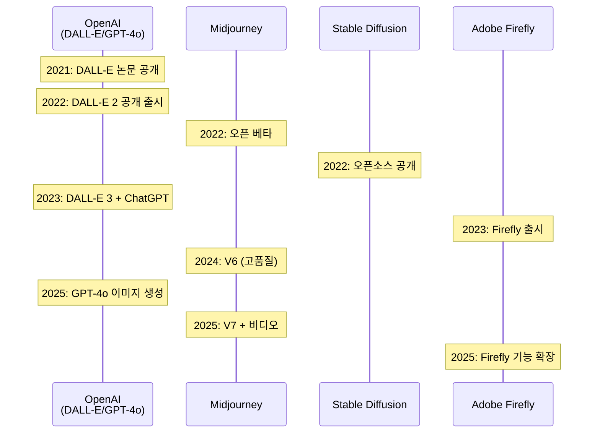
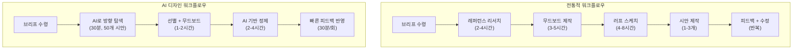
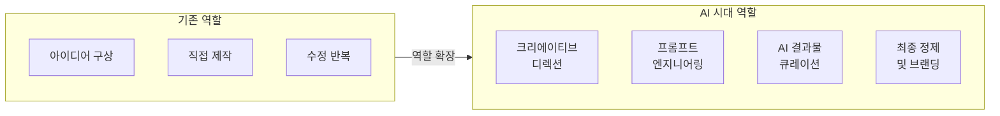

# 생성형 AI가 바꾸는 디자인 워크플로우

> 텍스트 한 줄이 이미지가 되는 시대, 디자이너의 역할은 어떻게 달라질까?

## 개요

이 섹션에서는 AI 이미지 생성 기술이 어떻게 탄생했고, 디자인 산업을 어떤 방향으로 변화시키고 있는지 살펴봅니다. 코딩 없이도 텍스트만으로 이미지를 만들어내는 이 기술이 왜 디자이너에게 "위협"이 아닌 "도구"인지, 그리고 이 도구를 어떻게 활용해야 하는지를 이해하는 것이 이 섹션의 핵심입니다.

**선수 지식**: 없음 — 이 코스의 첫 번째 섹션입니다!
**학습 목표**:
- AI 이미지 생성 기술(텍스트→이미지 변환)의 기본 원리를 비유로 이해한다
- 2021년부터 현재까지 AI 이미지 생성 기술의 발전 흐름을 설명할 수 있다
- 전통적 디자인 워크플로우와 AI 디자인 워크플로우의 차이를 비교할 수 있다
- 디자이너가 AI 도구를 학습해야 하는 이유를 자신의 언어로 설명할 수 있다

## 왜 알아야 할까?

업계 보고서에 따르면 2025년 기준, 전 세계 인구의 약 16.3%—6명 중 1명—이 생성형 AI 도구를 사용하고 있습니다. 디자인 업계에서 생성형 AI 도구의 도입률은 전년 대비 45% 증가했고, 주요 설문 조사 결과 디자이너들은 평균 1.2개에서 3.4개의 AI 도구를 동시에 활용하는 시대로 접어들었습니다.

이건 먼 미래의 이야기가 아닙니다. 지금 이 순간, 옆자리 디자이너가 프롬프트 한 줄로 10개의 시안을 뽑아내고 있을 수도 있어요. AI 도구를 모른다고 해서 당장 일자리를 잃진 않겠지만, 알고 있는 디자이너와의 생산성 격차는 점점 벌어지고 있죠.

이 섹션은 그 격차를 줄이는 첫걸음입니다. "AI가 뭔지"부터 "내 워크플로우에 어떻게 끼워 넣을지"까지, 비주얼 크리에이터의 시선으로 풀어보겠습니다.

## 핵심 개념

### 개념 1: 텍스트가 이미지가 되는 마법 — txt2img의 원리

> 💡 **비유**: 상상해보세요. 카페에서 바리스타에게 "따뜻하고, 달콤하고, 시나몬 향이 나는, 크림이 올라간 음료"라고 말하면, 바리스타가 그 설명을 해석해서 한 잔의 음료를 만들어줍니다. AI 이미지 생성도 똑같아요. 여러분이 텍스트(프롬프트)로 원하는 이미지를 설명하면, AI가 그 설명을 해석해서 이미지를 "만들어"줍니다.

txt2img(텍스트 투 이미지)는 말 그대로 텍스트를 이미지로 변환하는 기술입니다. 사용자가 "석양이 지는 바닷가에 서 있는 고양이, 수채화 스타일"이라고 입력하면, AI가 수십억 장의 이미지-텍스트 쌍에서 학습한 패턴을 바탕으로 새로운 이미지를 생성합니다.

여기서 중요한 건, AI가 인터넷에서 기존 이미지를 "찾아서 보여주는" 것이 아니라는 점이에요. 마치 화가가 수천 점의 그림을 본 뒤 자기만의 새로운 그림을 그리는 것처럼, AI도 학습한 패턴을 조합해서 **세상에 없던 새로운 이미지**를 만들어냅니다.

> 📊 **그림 1**: txt2img의 기본 처리 흐름

핵심 기술인 **디퓨전 모델(Diffusion Model)**을 아주 간단히 설명하면 이렇습니다. 깨끗한 사진에 노이즈(잡음)를 조금씩 더해서 완전히 흐릿하게 만드는 과정을 학습한 뒤, 그 과정을 **거꾸로** 돌리는 거예요. 완전한 노이즈에서 시작해서, 텍스트 설명에 맞게 조금씩 노이즈를 제거하면서 선명한 이미지를 만들어갑니다.

> 💡 **비유**: 조각가를 떠올려보세요. 대리석 덩어리(노이즈)에서 불필요한 부분을 조금씩 깎아내면(노이즈 제거) 아름다운 조각상(이미지)이 나타나는 것처럼, 디퓨전 모델도 노이즈 덩어리에서 이미지를 "깎아"냅니다. 이때 "어떤 모양으로 깎을지"를 알려주는 것이 바로 여러분의 프롬프트입니다.

### 개념 2: 2021-2026, AI 이미지 생성의 대폭발

어떤 기술이든 하루아침에 나타나진 않죠. AI 이미지 생성도 수십 년간의 연구가 쌓여서 만들어진 결과입니다. 하지만 2021년을 기점으로 그 발전 속도가 눈에 띄게 빨라졌어요.

> 📊 **그림 2**: AI 이미지 생성 기술의 주요 이정표

**2021년** — OpenAI가 DALL-E를 논문으로 발표하면서 "텍스트로 이미지를 만든다"는 개념이 대중에게 처음 알려졌습니다. 120억 개의 파라미터를 가진 이 모델은 "아보카도 모양의 안락의자" 같은 초현실적 요청도 이미지로 구현해냈죠. 다만 이 시점에서 DALL-E는 연구 논문과 제한된 데모로 공개되었을 뿐, 일반 사용자가 직접 쓸 수 있는 제품은 아니었습니다.

**2022년** — 진짜 폭발이 일어난 해입니다. DALL-E 2가 4월에 공개 출시되면서 비로소 일반 사용자도 OpenAI의 이미지 생성 기술을 직접 체험할 수 있게 되었어요. 이어서 Midjourney 오픈 베타(7월), Stable Diffusion 공개(8월)가 연달아 출시되면서, 누구나 AI로 이미지를 만들 수 있는 시대가 열렸습니다. 특히 Stable Diffusion은 오픈소스로 공개되어 전 세계 개발자와 아티스트 커뮤니티에 거대한 생태계를 만들어냈어요.

**2023-2024년** — AI 이미지의 품질이 실제 사진과 구별하기 어려운 수준에 도달했습니다. DALL-E 3가 ChatGPT에 통합되면서 대화형 이미지 생성이 가능해졌고, 각 플랫폼마다 고유한 강점을 가진 경쟁 구도가 형성되었습니다.

**2025-2026년** — 4K 해상도 출력이 표준이 되었고, 이미지 속 텍스트 렌더링이 신뢰할 수 있는 수준에 이르렀습니다. Midjourney V7의 출시, GPT-4o의 네이티브 이미지 생성, Gemini의 이미지 기능 등 주요 플랫폼 모두가 품질 경쟁에 돌입한 상태입니다.

> 📊 **그림 3**: 주요 AI 이미지 생성 플랫폼의 발전 흐름

### 개념 3: 전통적 워크플로우 vs. AI 디자인 워크플로우

그렇다면 AI가 실제 디자인 작업을 어떻게 바꾸고 있을까요? 기존 워크플로우와 비교해보면 변화가 선명하게 보입니다.

> 💡 **비유**: 전통적 디자인 워크플로우가 "수동 변속기 자동차"라면, AI 디자인 워크플로우는 "자동 변속기 + 내비게이션이 달린 자동차"와 같습니다. 운전(디자인)은 여전히 사람이 하지만, 기어 변속(반복 작업)은 자동으로, 길 찾기(아이디어 탐색)는 내비가 도와주는 거죠. 운전 실력이 좋은 사람이 좋은 도구를 쓰면 더 빠르고 멋지게 목적지에 도착할 수 있습니다.

**전통적 디자인 워크플로우:**
1. 클라이언트 브리프 수령
2. 레퍼런스 리서치 (2-4시간)
3. 무드보드(Moodboard) 제작 (3-5시간)
4. 러프 스케치 (4-8시간)
5. 시안 제작 (1-3개, 각 4-8시간)
6. 클라이언트 피드백 → 수정 (반복)
7. 최종 디자인 완성

**AI 디자인 워크플로우:**
1. 클라이언트 브리프 수령
2. AI로 다양한 방향 탐색 (30분-1시간, 10-50개 시안)
3. 유망한 방향 선별 + 무드보드 구성 (1-2시간)
4. AI 생성물 기반 정제 및 디테일 작업 (2-4시간)
5. 클라이언트 피드백 → AI로 빠른 수정 (반복, 각 30분-1시간)
6. 최종 디자인 완성 + 후처리

> 📊 **그림 4**: 전통 워크플로우 vs. AI 디자인 워크플로우 비교

현장에서 보고된 효율 차이는 인상적입니다. 업계 사례 보고서들에 따르면, 디자인 이터레이션과 프로토타이핑 속도가 **3-5배** 빨라지고, 스톡 이미지와 커스텀 일러스트 비용이 **60-80%** 절감되며, 아이디어 탐색 단계에서 **10배** 더 많은 크리에이티브 방향을 시도할 수 있다고 합니다.

### 개념 4: 디자이너는 왜 AI를 배워야 할까?

"AI가 디자이너를 대체할까?"라는 질문을 많이 받습니다. 결론부터 말하면, **AI를 잘 쓰는 디자이너가 AI를 안 쓰는 디자이너를 대체할 가능성이 훨씬 높습니다.**

왜 그럴까요? AI 이미지 생성 도구는 "버튼 하나로 완벽한 디자인"을 만들어주는 마법 지팡이가 아닙니다. 좋은 결과를 얻으려면 **무엇을 요청할지 아는 사람**, 즉 디자인 감각과 시각적 언어를 이해하는 사람이 필요합니다. 프롬프트에 "시네마틱 라이팅", "황금비 구도", "보색 대비" 같은 전문 용어를 자연스럽게 쓸 수 있는 사람이 바로 디자이너인 거죠.

> 📊 **그림 5**: 디자이너의 AI 활용 역할 변화

디자이너가 AI 시대에 갖는 강점을 정리하면:

| 디자이너의 강점 | AI 활용에서의 역할 |
|---|---|
| 색채 이론, 구도 감각 | 프롬프트에 정확한 시각 언어를 구사 |
| 클라이언트 커뮤니케이션 | AI 결과물을 브리프에 맞게 큐레이션 |
| 브랜드 일관성 이해 | 여러 AI 생성물에 통일된 스타일 적용 |
| 디테일 감각 | AI 결과물의 미세한 결함 포착 및 보정 |
| 트렌드 감각 | 시대에 맞는 비주얼 방향 설정 |

중요한 건 AI가 "만드는 능력"을 대체하는 것이지, "판단하는 능력"을 대체하는 것이 아니라는 점입니다. 어떤 이미지가 좋은 이미지인지, 브랜드에 맞는지, 타깃 고객에게 호소력이 있는지를 판단하는 건 여전히 디자이너의 몫이에요.

## 실습: 적용해보기

### 활동 1: 내 디자인 워크플로우 분석

아래 워크시트를 활용해서 현재 자신의 디자인 작업 과정을 분석해보세요.

**워크시트: 나의 디자인 워크플로우 자가 진단**

| 단계 | 현재 소요 시간 | 가장 힘든 점 | AI가 도울 수 있을까? |
|------|-------------|-------------|------------------|
| 아이디어 구상 | | | |
| 레퍼런스 리서치 | | | |
| 무드보드 제작 | | | |
| 시안 제작 | | | |
| 수정 및 반복 | | | |
| 최종 완성 | | | |

각 단계에서 "가장 시간이 오래 걸리는 작업"과 "가장 반복적인 작업"을 표시해보세요. 이 두 가지가 바로 AI가 가장 먼저 도울 수 있는 영역입니다.

### 활동 2: AI 활용 시나리오 상상하기

아래 3가지 시나리오를 읽고, AI를 어떻게 활용할 수 있을지 자유롭게 생각해보세요.

1. **소셜 미디어 에이전시**: 매주 20개 브랜드의 인스타그램 포스트 비주얼을 제작해야 합니다. 각 브랜드마다 고유한 톤앤매너가 있어요.
2. **프리랜서 일러스트레이터**: 동화책 프로젝트를 수주했는데, 20개 장면의 일러스트를 같은 캐릭터 스타일로 일관되게 그려야 합니다.
3. **인하우스 디자이너**: 신제품 런칭 캠페인용 키비주얼 시안 10개를 이틀 안에 만들어야 합니다.

### 토론 질문

- 세 시나리오 중 AI가 가장 큰 도움이 될 것 같은 건 어느 것인가요? 이유는?
- AI 결과물을 "그대로" 사용하는 것과 "시작점"으로 사용하는 것의 차이는 무엇일까요?
- 디자이너의 어떤 능력이 AI 시대에 더 중요해질까요?

## 더 깊이 알아보기

### DALL-E — 살바도르 달리와 월-E가 만나다

2021년 1월 5일, OpenAI는 블로그 포스트 하나로 세상을 놀라게 했습니다. "DALL-E"라는 이름의 AI 모델을 공개한 건데요, 이 이름이 재미있습니다. 초현실주의 화가 **살바도르 달리(Salvador Dalí)**와 픽사 애니메이션의 사랑스러운 로봇 **월-E(WALL-E)**의 이름을 합친 거예요. "예술적 초현실주의"와 "기술적 지능"을 동시에 표현한 작명이죠.

DALL-E의 전신은 2020년 6월에 발표된 "Image GPT"라는 프로젝트였습니다. 이 프로젝트는 텍스트를 처리하는 AI인 GPT의 구조를 이미지에 적용할 수 있다는 것을 보여줬어요. OpenAI 연구진은 여기서 한 발 더 나아가, GPT-3의 120억 개 파라미터를 텍스트-이미지 쌍으로 학습시켜 DALL-E를 만들었습니다.

다만 2021년의 DALL-E는 연구 논문과 제한된 데모 형태로 공개되었을 뿐, 일반인이 자유롭게 사용할 수 있는 서비스는 아니었습니다. 대중이 실제로 텍스트-이미지 생성을 체험할 수 있게 된 건 이듬해 2022년 4월 **DALL-E 2**가 출시되면서부터예요. DALL-E 2는 원본보다 훨씬 높은 해상도와 사실적인 이미지를 생성할 수 있었고, 대기자 명단(waitlist) 방식으로 점차 사용자를 확대해나갔습니다.

같은 날(2021년 1월), OpenAI는 CLIP(Contrastive Language-Image Pre-training)이라는 또 다른 모델도 발표했는데, 이 모델은 4억 장의 이미지-텍스트 쌍으로 학습하여 "이 이미지가 이 텍스트와 얼마나 잘 맞는지"를 판단합니다. DALL-E가 이미지를 만들면, CLIP이 "이 이미지가 프롬프트와 잘 맞나요?"를 평가하는 파트너 역할을 한 셈이죠.

### 디자인 교육의 새로운 도전

학술 영역에서도 이 변화를 주목하고 있습니다. Wiley 학술지에 게재된 연구에 따르면, 텍스트-이미지 생성 기술의 등장은 그래픽 디자인 교육의 근본적인 재고를 요구하고 있습니다. "도구 사용법"을 가르치는 것에서 "AI 결과물을 판단하고 방향을 설정하는 능력"을 가르치는 것으로 교육의 무게중심이 이동하고 있다는 분석입니다.

## 흔한 오해와 팁

> ⚠️ **흔한 오해**: "AI가 이미지를 생성한다"고 하면, 많은 분이 AI가 인터넷에서 기존 이미지를 "짜깁기"한다고 생각합니다. 사실 디퓨전 모델은 학습한 **패턴**을 바탕으로 완전히 새로운 이미지를 생성합니다. 기존 이미지를 복사하거나 잘라붙이는 것이 아닌, 노이즈에서부터 새 이미지를 "그려내는" 과정이에요.

> 💡 **알고 계셨나요?**: DALL-E라는 이름은 OpenAI 팀이 초현실주의 화가 살바도르 달리(Dalí)와 픽사의 로봇 캐릭터 월-E(WALL-E)를 합쳐 만든 말장난입니다. "예술 + 기술"이라는 AI 이미지 생성의 정체성을 이름 자체에 담은 거죠.

> 🔥 **실무 팁**: AI 이미지 생성 도구를 처음 배울 때 가장 흔한 실수는 "완벽한 결과물"을 한 번에 기대하는 것입니다. 프로 디자이너들은 AI를 **아이디어 탐색 도구**로 먼저 활용합니다. 50개를 생성해서 3개를 추리고, 그 3개를 기반으로 정제하는 방식이죠. AI는 "최종 결과물 생성기"가 아니라 "크리에이티브 브레인스토밍 파트너"로 접근하세요.

## 핵심 정리

| 개념 | 설명 |
|------|------|
| txt2img | 텍스트 프롬프트를 입력하면 AI가 새로운 이미지를 생성하는 기술 |
| 디퓨전 모델 | 노이즈에서 시작해 점진적으로 이미지를 만들어내는 AI 모델 구조 |
| 프롬프트 | AI에게 원하는 이미지를 설명하는 텍스트 지시문 |
| AI 디자인 워크플로우 | 아이디어 탐색→선별→정제 순으로 AI를 디자인 과정에 통합하는 방식 |
| 크리에이티브 디렉션 | AI 시대에 디자이너의 핵심 역할 — 무엇을, 왜, 어떤 방향으로 만들지 결정하는 능력 |
| DALL-E | 2021년 OpenAI가 논문으로 발표한 최초의 대중적 txt2img 모델 (공개 출시는 DALL-E 2, 2022년) |
| 디자이너의 역할 변화 | 직접 제작자에서 AI 결과물의 큐레이터이자 크리에이티브 디렉터로 확장 |

## 다음 섹션 미리보기

이 섹션에서 AI 이미지 생성의 큰 그림을 살펴봤다면, 다음 섹션 [02. 주요 플랫폼 비교 — ChatGPT vs Gemini vs Midjourney](01-ch1-ai-이미지-생성-개론/02-02-주요-플랫폼-비교-chatgpt-vs-gemini-vs-midjourney.md)에서는 실제로 여러분이 사용할 수 있는 세 가지 주요 플랫폼을 나란히 놓고 비교합니다. 각 플랫폼이 어떤 상황에서 빛을 발하는지, 무료와 유료 플랜의 차이는 무엇인지, 디자이너의 작업 유형에 따라 어떤 플랫폼을 선택해야 하는지를 구체적으로 알아볼 거예요.

## 참고 자료

- [Graphic Design Education in the Era of Text-to-Image Generation (Wiley)](https://onlinelibrary.wiley.com/doi/full/10.1111/jade.12558) - AI 이미지 생성이 그래픽 디자인 교육에 미치는 영향을 분석한 학술 논문
- [Revolutionizing Visuals: Generative AI in Modern Image Generation (ACM)](https://dl.acm.org/doi/10.1145/3689641) - 생성형 AI의 기술적 발전과 비주얼 콘텐츠 혁신을 다룬 논문
- [AI Tools for Designers in 2026: Supporting Creativity and Responsible Workflows (RGD)](https://rgd.ca/articles/2026-amplifying-creativity-with-ai-tools-for-designers-in-2026) - 2026년 디자이너를 위한 AI 도구와 책임 있는 워크플로우 가이드
- [AI Image Generation Complete Guide for Designers (Kittl)](https://www.kittl.com/blogs/ai-image-generation-guide-ais/) - 디자이너를 위한 AI 이미지 생성 종합 가이드
- [DALL-E: Creating Images from Text (OpenAI)](https://openai.com/index/dall-e/) - OpenAI의 DALL-E 공식 소개 페이지
- [How Generative AI Streamlined My Creative Process (Adobe Design)](https://adobe.design/stories/process/how-generative-ai-streamlined-my-creative-process) - Adobe 디자이너의 생성형 AI 워크플로우 경험 사례