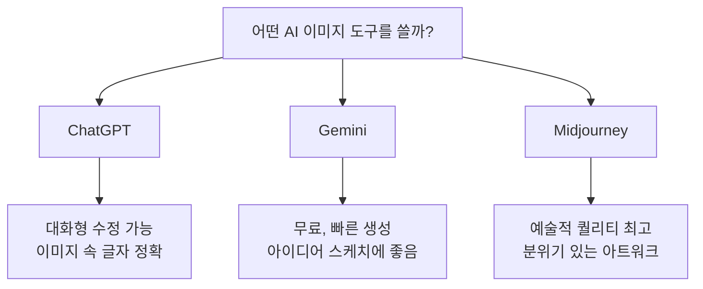
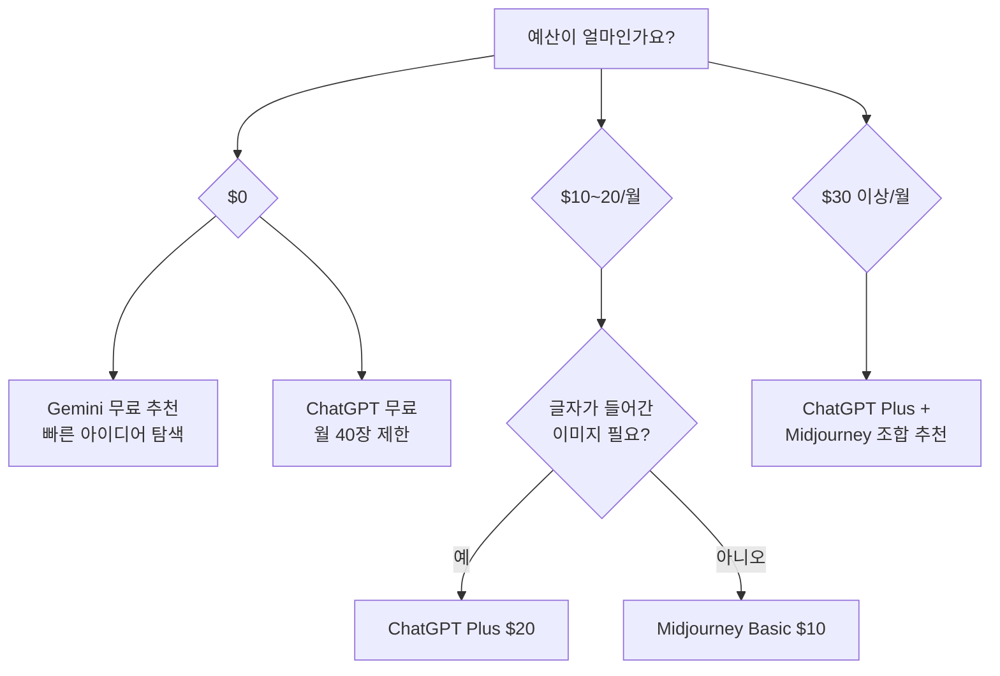
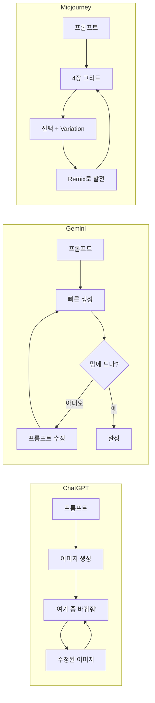

# 주요 플랫폼 비교 — ChatGPT vs Gemini vs Midjourney

> 같은 프롬프트를 넣어도 결과가 완전히 다릅니다. 각 도구의 성격을 알면 시간과 비용을 아낄 수 있어요.

## 개요

이번 세션에서는 디자이너들이 가장 많이 쓰는 세 플랫폼 — ChatGPT, Gemini, Midjourney — 을 같은 기준으로 비교합니다. 각각의 강점과 약점, 가격, 그리고 "같은 프롬프트를 넣었을 때 얼마나 다른 결과가 나오는지"를 직접 확인해볼 거예요.

**선수 지식**: AI 이미지 생성의 기본 개념, 프롬프트의 역할

**학습 목표**:
- 세 플랫폼의 성격 차이를 한 문장으로 설명할 수 있다
- 같은 프롬프트가 플랫폼마다 다른 결과를 내는 이유를 안다
- 프로젝트 상황에 따라 어떤 플랫폼을 쓸지 판단할 수 있다

## 왜 알아야 할까?

카페 메뉴판 이미지에 텍스트가 정확히 들어가야 한다면? 몽환적인 분위기의 컨셉 아트가 필요하다면? 무료로 빠르게 여러 스타일을 테스트하고 싶다면? — 각각 최적의 도구가 다릅니다.

"다 비슷하겠지" 하고 하나만 쓰면, 30분이면 될 작업에 3시간을 쓰게 됩니다.

## 핵심 내용

### 1. 세 플랫폼의 성격 — "세 명의 아티스트"

세 플랫폼을 사람에 비유하면 이해가 쉬워요:

- **ChatGPT** = 옆에 앉아서 대화하며 그려주는 **만능 어시스턴트**. "여기 글씨 좀 바꿔줘", "배경을 좀 더 따뜻하게" — 이런 말을 알아듣고 바로 수정해줍니다.
- **Gemini** = Google의 지식을 가진 **빠른 스케치 아티스트**. 무료로 빠르게 아이디어를 시각화해줍니다.
- **Midjourney** = 독자적 미학을 가진 **갤러리 전속 작가**. 대화는 잘 안 통하지만, 결과물의 예술적 완성도가 압도적이죠.

### 2. 같은 프롬프트, 다른 결과

아래 프롬프트를 세 플랫폼에 넣어보면 놀라울 정도로 다른 결과가 나옵니다.

> **테스트 프롬프트**
> "A cozy cafe interior, warm golden lighting, watercolor style, soft atmosphere"

**각 결과의 특징:**

| 기준 | ChatGPT | Gemini | Midjourney |
|------|---------|--------|------------|
| **프롬프트 반영도** | 매우 높음 — 지시 사항을 정확히 따름 | 보통 — 핵심은 잡지만 디테일 생략 가능 | 높음 — 자기 해석을 더해 완성 |
| **이미지 속 글자** | 업계 최고 — 영문 텍스트 깔끔 | 보통 | 약함 — 글자가 깨지는 경우 많음 |
| **분위기·미학** | 깔끔하고 정돈된 느낌 | 사실적, 자연스러운 느낌 | 압도적 — 영화 같은 분위기 |
| **생성 속도** | 10~30초 | 5~15초 (가장 빠름) | 30~60초 |
| **수정 편의성** | "배경 좀 더 어둡게 해줘" 가능 | 제한적 — 재생성이 나음 | 재생성 또는 Variation |

### 3. 가격 비교 — 예산에 맞는 선택

2026년 기준 가격 정리:

| 구분 | ChatGPT | Gemini | Midjourney |
|------|---------|--------|------------|
| **무료** | 월 40장 제한 | 무료 사용 가능 | 없음 |
| **기본 유료** | Plus $20/월 | Google One AI $20/월 | Basic $10/월 (~200장) |
| **프로** | Pro $200/월 | — | Standard $30/월 |
| **최상위** | — | — | Pro $60/월 |

### 4. 수정 방식의 차이 — 이게 실무에서 제일 중요

첫 생성보다 **수정 과정**이 실무에서는 더 중요해요. 초안보다 퇴고가 중요한 것처럼요.

**ChatGPT: 대화로 수정**
이전 이미지를 기억하면서 "배경을 좀 더 어둡게", "왼쪽 인물 표정을 밝게" 같은 자연어 수정이 됩니다. 이미지를 업로드해서 편집할 수도 있어요.

> **수정 프롬프트 예시 (ChatGPT)**
> 1차: "빈티지 스타일 꽃다발 일러스트, 크림색 배경"
> 2차: "좋은데, 장미를 더 크게 해주고 배경을 연한 핑크로 바꿔줘"
> 3차: "완벽해! 여기에 'Thank You'라는 글씨를 우아한 필기체로 넣어줘"

**Gemini: 빠른 재생성**
정밀한 부분 수정보다는 마음에 안 들면 빠르게 다시 생성하는 방식이 효율적이에요. 속도가 빠르니까요.

**Midjourney: Variation과 Remix**
4장 그리드에서 마음에 드는 걸 고르고, Variation(미세 변형)이나 Remix(프롬프트 수정 후 재생성)로 발전시킵니다.

> **Midjourney 워크플로우 예시**
> 1단계: 프롬프트 입력 → 4장 그리드 생성
> 2단계: V1~V4 중 마음에 드는 이미지 선택
> 3단계: Upscale(고해상도) 또는 Variation(변형)
> 4단계: 필요하면 Remix로 프롬프트 수정 후 재생성

### 5. 추가 플랫폼 — 알아두면 좋은 도구들

세 플랫폼 외에도 특정 상황에서 더 잘 맞는 도구들이 있어요:

| 플랫폼 | 특화 영역 | 이런 때 써보세요 |
|--------|----------|----------------|
| **Flux** | 사진 같은 사실적 이미지 | 제품 목업, 인물 사진 느낌이 필요할 때 |
| **Ideogram** | 이미지 속 텍스트 렌더링 | 포스터, 로고 시안, 타이포그래피 디자인 |
| **Leonardo AI** | 캐릭터 일관성 유지 | 같은 캐릭터가 여러 장면에 등장해야 할 때 |
| **Adobe Firefly** | 포토샵 연동 편집 | 기존 디자인에 AI 편집을 추가할 때 |

## 실습: 직접 비교해보기

### 활동 1: 같은 프롬프트, 세 플랫폼 비교

아래 프롬프트를 ChatGPT, Gemini, Midjourney에 각각 넣어보세요:

> "A minimalist product photo of a white ceramic mug on a wooden table, soft morning light, clean background"

각 결과를 비교하면서 아래 표를 채워보세요:

| 기준 | ChatGPT | Gemini | Midjourney |
|------|---------|--------|------------|
| 전체적인 느낌 | | | |
| 프롬프트 반영 정도 | | | |
| 가장 마음에 드는 점 | | | |
| 아쉬운 점 | | | |

### 활동 2: 플랫폼 선택 연습

아래 상황에서 어떤 플랫폼이 가장 적합할지 골라보세요:

| 상황 | 추천 플랫폼 | 이유 |
|------|-----------|------|
| 카페 메뉴판 — 메뉴 이름이 정확히 표시되어야 함 | ________ | ________ |
| 소설 표지 컨셉아트 — 몽환적이고 예술적인 분위기 | ________ | ________ |
| 발표 자료용 이미지 — 빠르게 5가지 버전 필요 | ________ | ________ |
| 예산 $0, 다양한 스타일 탐색 | ________ | ________ |

> 💡 **정답**: (1) ChatGPT — 텍스트 렌더링 최강, (2) Midjourney — 미학적 퀄리티, (3) Gemini — 무료 + 빠름, (4) Gemini — 무료

## 팁과 주의사항

> 🔥 **실무 팁**: 세 플랫폼을 **단계별로 조합**하면 효율이 극대화돼요. 아이디어 탐색은 Gemini(무료, 빠름) → 방향 잡히면 Midjourney(미학적 완성도) → 글자 삽입이나 마지막 수정은 ChatGPT(대화형 편집). 이 조합이 실무에서 가장 많이 쓰이는 패턴입니다.

> ⚠️ **흔한 오해**: "Midjourney가 무조건 최고" — 예술적 스타일에서는 맞지만, 텍스트가 들어간 디자인(포스터, 배너)에서는 ChatGPT가 훨씬 정확하고, 빠른 프로토타이핑에서는 Gemini가 더 효율적입니다.

> 💡 **Midjourney 팁**: V7부터 Draft Mode가 추가됐어요. 기존보다 10배 빠르게, 절반 비용으로 초안을 뽑을 수 있습니다. 아이디어 탐색은 Draft Mode, 최종 결과물은 일반 모드로 나눠 쓰세요.

## 핵심 정리

| 개념 | 설명 |
|------|------|
| **ChatGPT** | 대화하면서 수정 가능, 이미지 속 글자 정확. Plus $20/월 |
| **Gemini** | 무료 사용 가능, 빠른 생성 속도, 아이디어 탐색에 좋음 |
| **Midjourney** | 예술적 퀄리티 최고, V7 영상 생성 지원. $10/월부터 |
| **플랫폼 조합 전략** | 한 도구에 올인하지 말고, 상황에 맞게 조합해서 쓰기 |

## 다음 세션 미리보기

디자이너에게 매우 중요한 네 번째 도구가 남아있어요. 다음 세션에서는 포토샵·일러스트레이터와 직접 연동되는 **Adobe Firefly**를 다룹니다. 특히 상업 프로젝트에서 "이 이미지 저작권 괜찮아요?"라는 질문에 자신 있게 답할 수 있는 Firefly만의 차별점을 알아볼게요.
