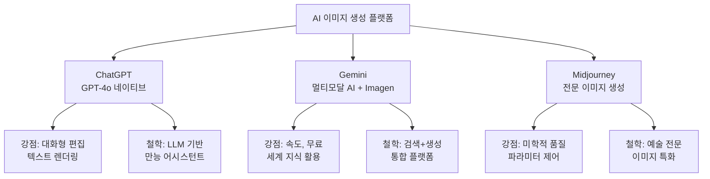
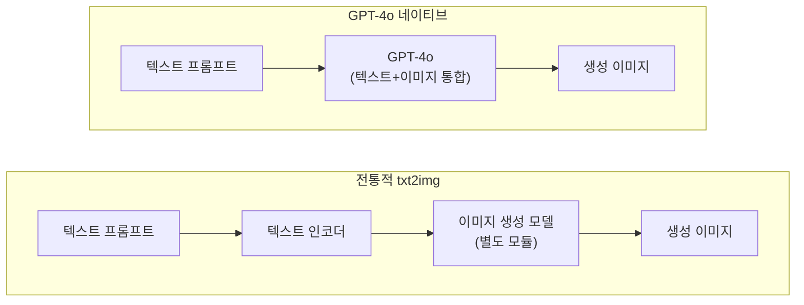
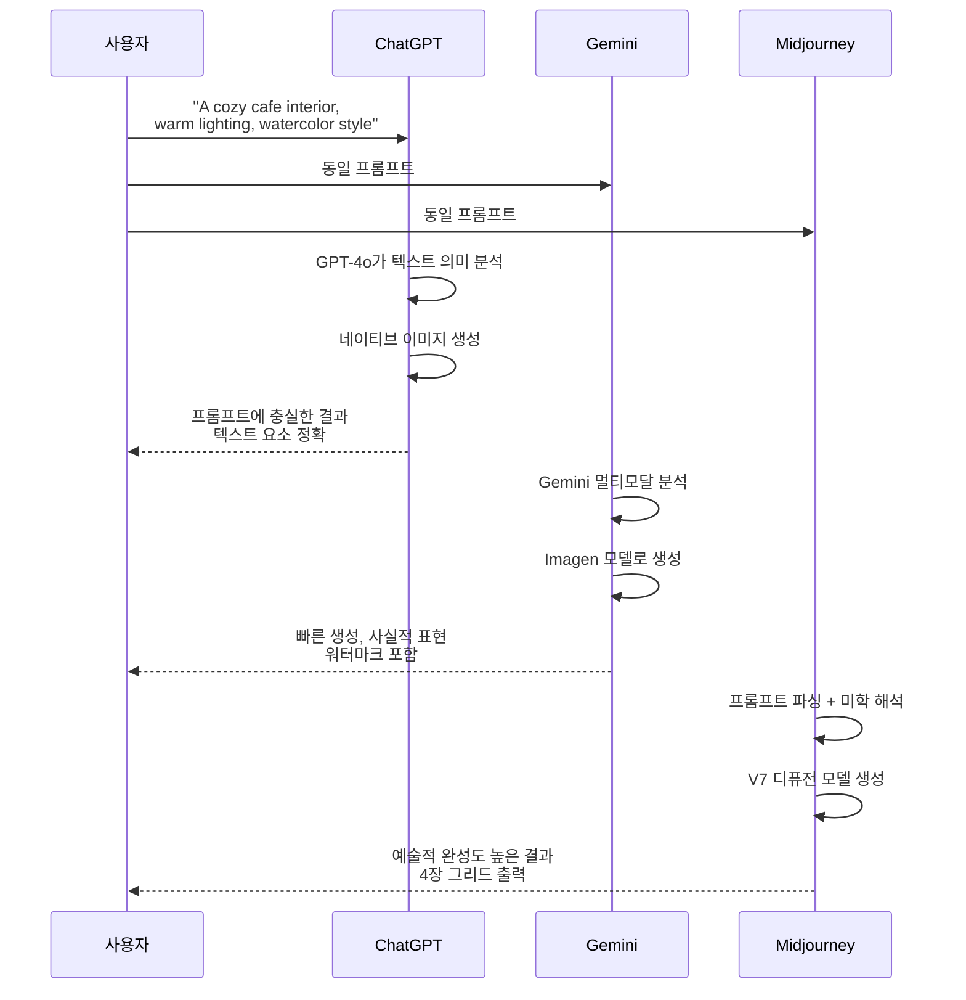
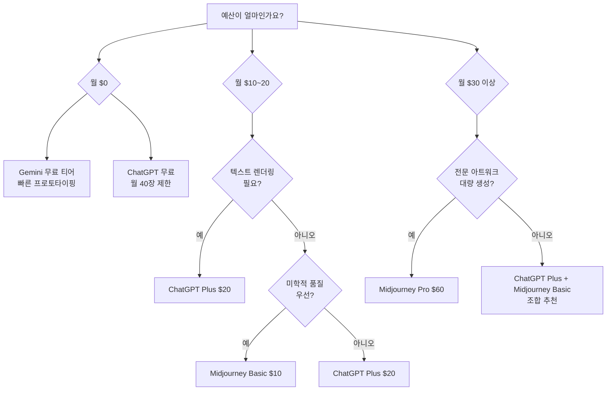
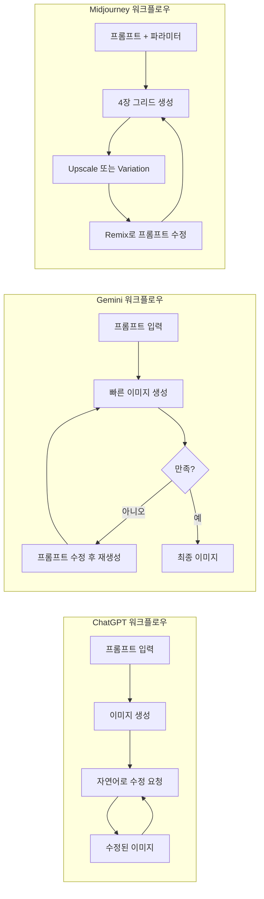

# 주요 플랫폼 비교 — ChatGPT vs Gemini vs Midjourney

> 세 가지 대표 AI 이미지 생성 플랫폼의 강점, 약점, 가격, 그리고 "같은 프롬프트, 다른 결과"를 분석합니다

## 개요

[이전 섹션](01-ch1-ai-이미지-생성-개론/01-01-생성형-ai가-바꾸는-디자인-워크플로우.md)에서 AI 이미지 생성의 기본 원리와 디자이너의 역할 변화를 살펴봤습니다. 이제 실제로 사용할 도구를 골라야 할 차례입니다. 이번 섹션에서는 2025-2026년 기준 가장 많이 쓰이는 세 플랫폼 — ChatGPT, Gemini, Midjourney — 을 같은 기준으로 비교합니다.

**선수 지식**: txt2img의 기본 개념, 프롬프트의 역할 ([01. 생성형 AI가 바꾸는 디자인 워크플로우](01-ch1-ai-이미지-생성-개론/01-01-생성형-ai가-바꾸는-디자인-워크플로우.md) 참조)

**학습 목표**:
- ChatGPT, Gemini, Midjourney 각 플랫폼의 핵심 특성과 차별점을 설명할 수 있다
- 동일한 프롬프트가 플랫폼마다 다른 결과를 내는 이유를 이해한다
- 생성 품질, 속도, 가격, 편집 기능을 기준으로 플랫폼을 비교할 수 있다
- 프로젝트 유형에 따라 적합한 플랫폼을 1차 선별할 수 있다

## 왜 알아야 할까?

여러분이 새 카페의 메뉴판을 디자인한다고 해보겠습니다. 텍스트가 정확히 들어간 이미지가 필요하다면? 아니면 몽환적인 분위기의 인테리어 컨셉 이미지가 필요하다면? 또는 빠르게 여러 스타일을 무료로 테스트하고 싶다면? — 각각 최적의 도구가 다릅니다.

"다 비슷하겠지"라고 생각하고 하나만 쓰다 보면, 30분이면 될 작업에 3시간을 쓰게 됩니다. 반대로 각 플랫폼의 강점을 정확히 알면, 마치 목공에서 톱·대패·끌을 용도에 맞게 쓰듯 효율이 극적으로 올라갑니다.

## 핵심 개념

### 개념 1: 세 플랫폼의 근본적 차이 — "성격이 다른 세 명의 아티스트"

> 💡 **비유**: 세 플랫폼을 세 명의 아티스트에 비유해 봅시다. **ChatGPT**는 옆에 앉아서 대화하며 그려주는 **만능 일러스트레이터**입니다. "여기 글씨 좀 바꿔줘", "배경을 좀 더 따뜻하게"라고 말하면 바로 수정해줍니다. **Gemini**는 Google의 방대한 지식을 갖춘 **빠른 스케치 아티스트**로, 무료로 빠르게 아이디어를 시각화해줍니다. **Midjourney**는 독자적 미학을 가진 **갤러리 전속 작가**입니다. 대화는 잘 안 통하지만, 결과물의 예술적 완성도가 압도적이죠.

앞서 살펴본 txt2img — 텍스트 프롬프트를 입력하면 이미지를 생성하는 기본 원리 — 는 세 플랫폼 모두에 공통되지만, 각각 이 원리를 구현하는 방식이 근본적으로 다릅니다. 특히 ChatGPT는 GPT-4o라는 대형 언어 모델(LLM) 안에 이미지 생성이 내장된 구조로, 기존의 txt2img가 "텍스트 → 별도 이미지 모델 → 이미지"라는 분리된 파이프라인이었다면, GPT-4o는 텍스트를 이해하는 모델이 **직접** 픽셀을 생성합니다. 이 구조 덕분에 프롬프트 해석력과 텍스트 렌더링이 뛰어나죠.

Gemini는 Google DeepMind의 멀티모달 AI로, 검색 엔진의 세계 지식과 Imagen 모델의 이미지 품질을 결합했습니다. Midjourney는 처음부터 "아름다운 이미지 생성"만을 위해 만들어진 전문 도구로, 미학적 완성도에 모든 역량을 집중합니다.

> 📊 **그림 1**: 세 플랫폼의 설계 철학 비교

> 📊 **그림 2**: txt2img 구현 방식의 차이 — 전통적 파이프라인 vs GPT-4o 네이티브

각 플랫폼의 기반 기술을 정리하면 이렇습니다:

| 구분 | ChatGPT | Gemini | Midjourney |
|------|---------|--------|------------|
| **기반 모델** | GPT-4o (LLM 내장) | Gemini + Imagen 3/4 | 자체 디퓨전 모델 V7 |
| **txt2img 구현** | LLM이 직접 이미지 생성 | 별도 Imagen 모델 호출 | 전용 디퓨전 모델 |
| **출시/최신 버전** | 2025년 3월 | 2025년 (Imagen 4) | V7 (2025년 4월) |
| **접근 방식** | 대화형 멀티모달 | 검색 + 생성 통합 | 이미지 전문 생성 |
| **인터페이스** | 채팅 | 채팅 | 웹앱 (구 Discord) |

### 개념 2: 생성 품질 비교 — "같은 주문, 다른 요리"

> 💡 **비유**: 세 셰프에게 "트러플 파스타"를 주문한다고 상상해보세요. 한 셰프는 레시피를 정확히 따라 만들고(ChatGPT), 다른 셰프는 빠르게 맛있는 버전을 내놓고(Gemini), 세 번째 셰프는 자기만의 해석을 더해 작품처럼 플레이팅합니다(Midjourney). 어떤 게 "최고"인지는 여러분이 원하는 게 뭔지에 달려 있죠.

동일한 프롬프트를 세 플랫폼에 넣으면 놀라울 정도로 다른 결과가 나옵니다. 여러 비교 테스트에서 확인된 각 플랫폼의 생성 품질 특성은 다음과 같습니다:

**ChatGPT (GPT-4o)**
- **프롬프트 충실도**: 매우 높음. 복잡한 지시사항도 정확히 반영
- **텍스트 렌더링**: 업계 최고 수준. 영문 텍스트를 이미지 안에 깨끗하게 삽입 가능
- **스타일**: 다양한 스타일 소화 가능하나, Midjourney만큼의 미학적 "와우" 팩터는 상대적으로 부족
- **약점**: 복잡한 장면에서 객체 10-20개 이상이면 정확도 저하, 비영어 텍스트는 오류 가능

**Gemini**
- **사실적 표현**: 실제 사진 같은 포토리얼리즘에 강점
- **속도**: 세 플랫폼 중 가장 빠른 생성 속도
- **세계 지식**: Google 검색 지식 기반으로 실존하는 장소, 물건의 정확한 묘사에 유리
- **약점**: 대화형 연속 편집이 ChatGPT보다 제한적, 생성 이미지에 워터마크 삽입

**Midjourney V7**
- **미학적 품질**: 압도적. "사진 같으면서도 예술적인" 고유한 톤
- **텍스처와 디테일**: 피부 질감, 직물 결, 빛의 반사 등 물리적 디테일이 가장 풍부
- **파라미터 제어**: `--ar`, `--stylize`, `--chaos` 등 세밀한 제어 가능
- **약점**: 텍스트 렌더링이 여전히 취약, 대화형 편집 불가

> 📊 **그림 3**: 동일 프롬프트 입력 시 플랫폼별 처리 흐름

### 개념 3: 가격과 접근성 — "예산에 맞는 도구 고르기"

> 💡 **비유**: 자동차를 고르는 것과 비슷합니다. Gemini는 무료로 탈 수 있는 시내버스(기본은 무료!), ChatGPT는 월정액 구독형 렌터카(월 $20부터), Midjourney는 프리미엄 카셰어링(월 $10부터, 하지만 무료 체험은 없음)이라고 할 수 있죠.

2025-2026년 기준 각 플랫폼의 가격 구조입니다:

| 구분 | ChatGPT | Gemini | Midjourney |
|------|---------|--------|------------|
| **무료 티어** | 월 40장 (1024x1024) | 무료 사용 가능 | 없음 |
| **기본 유료** | Plus $20/월 (무제한*) | Google One AI Premium $20/월 | Basic $10/월 (~200장) |
| **프로 티어** | Pro $200/월 | - | Standard $30/월 |
| **최고 티어** | - | - | Pro $60/월, Mega $120/월 |
| **API 가격** | $0.008~$0.024/장 | ~$0.03/장 | API 없음 |

*ChatGPT Plus는 공정 사용 정책(fair use) 적용

> 📊 **그림 4**: 예산별 추천 플랫폼 의사결정 트리

가격만 보면 Gemini가 압도적으로 유리하지만, 실무에서는 "무료인데 70점짜리" vs "유료인데 95점짜리" 사이의 선택이 됩니다. 클라이언트에게 보여줄 컨셉 이미지라면 Midjourney의 미학적 품질이 가격 이상의 가치를 할 수 있고, SNS용 빠른 이미지가 필요하다면 Gemini의 무료 + 빠른 속도가 훨씬 효율적입니다.

### 개념 4: 편집 기능과 워크플로우 — "수정이 쉬운가?"

> 💡 **비유**: 이미지를 처음 만드는 것보다 **수정하는 과정**이 실무에서는 더 중요합니다. 마치 글을 쓸 때 초안보다 퇴고가 중요하듯이요. 세 플랫폼의 편집 방식은 마치 — 실시간 화상 통화로 수정 지시하기(ChatGPT), 메모를 보내서 수정 요청하기(Gemini), 새로 주문서를 써서 보내기(Midjourney) — 정도의 차이가 있습니다.

**ChatGPT: 대화형 연속 편집의 강자**

ChatGPT의 가장 강력한 차별점은 **대화 맥락을 유지하면서 이미지를 점진적으로 수정**할 수 있다는 것입니다. "배경을 좀 더 어둡게 해줘", "왼쪽 인물의 표정을 밝게 바꿔줘"처럼 자연어로 수정을 요청하면, 이전 이미지를 기억하고 해당 부분만 수정합니다. 또한 사용자가 이미지를 업로드하면 그것을 기반으로 변환하거나 편집할 수 있어, 기존 디자인 에셋을 활용한 작업에 유리합니다.

**Gemini: 빠른 반복과 스타일 전환**

Gemini도 대화형 편집을 지원하지만, ChatGPT만큼의 정밀한 연속 수정은 아직 제한적입니다. 대신 생성 속도가 빨라서 "마음에 안 들면 다시 생성"하는 방식의 빠른 반복에 유리합니다. Google 생태계(Docs, Slides 등)와의 연동도 강점입니다.

**Midjourney: 파라미터 기반 정밀 제어**

Midjourney는 대화형 편집 대신, `--stylize`, `--chaos`, `--ar` 같은 **파라미터로 결과를 제어**하는 방식입니다. V7부터는 웹앱 에디터에서 인페인팅(부분 수정)과 아웃페인팅(확장)도 가능해졌지만, "이 부분을 자연어로 설명해서 바꿔줘" 방식과는 거리가 있습니다. 대신 Remix 모드를 통해 기존 결과의 프롬프트를 수정하여 변형할 수 있고, Variation 기능으로 미세한 차이의 후보를 빠르게 탐색할 수 있습니다.

> 📊 **그림 5**: 플랫폼별 이미지 수정 워크플로우 비교

## 실습: 적용해보기

### 활동 1: 플랫폼 선택 워크시트

아래 시나리오를 읽고, 어떤 플랫폼이 가장 적합한지 선택하고 그 이유를 적어보세요.

| 시나리오 | 추천 플랫폼 | 이유 |
|----------|------------|------|
| 인스타그램용 카페 메뉴판 이미지. 메뉴 이름이 정확히 표시되어야 함 | ____________ | ____________ |
| 소설 표지 컨셉아트. 몽환적이고 예술적인 분위기가 핵심 | ____________ | ____________ |
| 프레젠테이션용 다이어그램. 빠르게 5가지 버전을 만들어 비교하고 싶음 | ____________ | ____________ |
| 캐릭터 디자인. 같은 캐릭터를 여러 포즈와 배경에서 일관되게 생성해야 함 | ____________ | ____________ |
| 팀 브레인스토밍용 무드보드. 예산 $0, 다양한 스타일 탐색 필요 | ____________ | ____________ |

**정답 가이드**: (1) ChatGPT — 텍스트 렌더링 최강, (2) Midjourney — 미학적 품질 최고, (3) Gemini — 빠른 속도 + 무료, (4) Midjourney — `--cref` 파라미터로 캐릭터 일관성 유지, (5) Gemini — 무료 + 빠른 반복

### 활동 2: 비교 분석 토론

아래 질문에 대해 생각해보세요:

1. **"가장 좋은 AI 이미지 도구는 뭔가요?"라는 질문이 왜 잘못된 질문인지** 설명해보세요. 이 섹션에서 배운 내용을 근거로 들어주세요.

2. 여러분의 실제 작업 환경을 떠올려 보세요. **가장 자주 만드는 이미지 유형**은 무엇인가요? 그 유형에 가장 적합한 플랫폼은 어디일까요?

3. 예산이 월 $30라면, **한 플랫폼에 집중할 것인지 두 플랫폼을 조합할 것인지** 결정하고 그 이유를 적어보세요.

## 더 깊이 알아보기

### Midjourney의 탄생 — NASA 연구원에서 AI 아티스트로

Midjourney의 창업자 데이비드 홀츠(David Holz)는 원래 NASA 제트추진연구소(JPL)에서 일하던 연구원이었습니다. 그는 가상현실 스타트업 Leap Motion을 창업한 후, 2021년에 "인간의 상상력을 확장하는 도구"를 만들겠다는 비전으로 Midjourney를 시작했습니다. 흥미로운 점은, 홀츠가 처음부터 디스코드(Discord)를 인터페이스로 선택한 이유입니다. 그는 "사람들이 서로의 창작물을 보면서 영감을 주고받는 커뮤니티"를 만들고 싶었거든요. 실제로 디스코드의 공개 채널에서 다른 사용자들의 프롬프트와 결과물을 볼 수 있었던 것이 Midjourney 초기 성장의 핵심 동력이었습니다.

2025년에 와서야 Midjourney는 독립 웹앱(midjourney.com)을 본격 가동했고, 이제 디스코드 없이도 모든 기능을 사용할 수 있게 되었습니다. 하지만 여전히 커뮤니티 갤러리에서 다른 사용자의 작품과 프롬프트를 탐색할 수 있는 기능을 유지하고 있죠 — 창업자의 초기 비전이 그대로 살아있는 셈입니다.

### GPT-4o의 "네이티브" 이미지 생성이 혁신적인 이유

이전 섹션에서 살펴본 txt2img의 기본 원리를 떠올려 보세요 — 텍스트 프롬프트가 AI 모델을 거쳐 이미지로 변환되는 과정이었죠. 기존의 DALL-E나 Stable Diffusion 같은 도구들은 이 과정에서 텍스트를 이해하는 모듈과 이미지를 생성하는 모듈이 **분리**되어 있었습니다. ChatGPT의 이미지 생성이 특별한 이유는, 이 두 단계를 하나로 합쳤다는 데 있습니다 — **GPT-4o 모델 자체가 이미지를 생성**하는 것이죠. 이것은 2025년 3월에 도입된 접근법인데, 텍스트를 이해하는 모델이 직접 픽셀을 만들기 때문에 "포스터에 'Grand Opening'이라고 써줘"라는 요청에서 글씨가 정확하게 렌더링됩니다. 이전 세대 도구들은 텍스트와 이미지를 별도 모듈로 처리했기 때문에, 이미지 속 글씨가 읽을 수 없을 정도로 왜곡되는 문제가 악명 높았죠.

## 흔한 오해와 팁

> ⚠️ **흔한 오해**: "Midjourney가 무조건 최고의 이미지를 만든다"
> Midjourney의 미학적 품질은 확실히 뛰어나지만, 이것은 **예술적 스타일**에 한정된 이야기입니다. 텍스트가 포함된 디자인(포스터, 배너, 메뉴판)에서는 ChatGPT가 훨씬 정확하고, 빠른 프로토타이핑에서는 Gemini가 더 효율적입니다. "최고의 도구"는 **무엇을 만드느냐**에 따라 달라집니다.

> 💡 **알고 계셨나요?**: Midjourney V7은 완전히 새로운 아키텍처로 재설계되어, 이전 버전 대비 **불량 생성(bad generation)이 30-40% 감소**했습니다. 또한 Draft Mode라는 기능으로 기존 대비 10배 빠르게, 절반의 비용으로 초안을 생성할 수 있게 되었습니다. 빠른 아이디어 탐색에는 Draft Mode, 최종 결과물에는 일반 모드를 쓰는 것이 실무 팁입니다.

> 🔥 **실무 팁**: 세 플랫폼을 **단계별로 조합**하면 효율이 극대화됩니다. 아이디어 탐색은 Gemini(무료, 빠름)로 시작하고, 방향이 잡히면 Midjourney(미학적 완성도)로 최종 비주얼을 만들고, 텍스트 삽입이나 마지막 편집은 ChatGPT(텍스트 렌더링, 대화형 수정)로 마무리하는 워크플로우를 추천합니다.

## 핵심 정리

| 개념 | 설명 |
|------|------|
| **ChatGPT (GPT-4o)** | LLM 네이티브 이미지 생성. 텍스트 렌더링 최강, 대화형 편집 가능. Plus $20/월 |
| **Gemini** | Google 멀티모달 AI. 빠른 속도, 무료 사용 가능, 포토리얼리즘에 강점 |
| **Midjourney V7** | 전문 이미지 생성 도구. 미학적 품질 최고, 파라미터 기반 제어. $10/월부터 |
| **텍스트 렌더링** | ChatGPT > Gemini > Midjourney 순으로 정확 |
| **미학적 품질** | Midjourney > ChatGPT > Gemini 순으로 높음 |
| **편집 유연성** | ChatGPT(대화형) > Gemini(재생성) > Midjourney(파라미터) |
| **가성비** | 무료 탐색은 Gemini, 유료 실무는 용도별 선택 |
| **실무 전략** | 한 도구에 올인하지 말고, 프로젝트 단계별로 조합 활용 |

## 다음 섹션 미리보기

지금까지 ChatGPT, Gemini, Midjourney 세 플랫폼을 비교했는데, 디자이너에게 매우 중요한 네 번째 플레이어가 남아있습니다. 다음 섹션 [03. Adobe Firefly와 크리에이티브 생태계](01-ch1-ai-이미지-생성-개론/03-03-adobe-firefly와-크리에이티브-생태계.md)에서는 Photoshop, Illustrator 등 기존 디자인 도구와 깊이 통합된 Adobe Firefly의 독특한 포지션을 살펴보겠습니다. 특히 **상업적 사용에 안전한 학습 데이터**라는 Firefly만의 차별점이 실무에서 왜 중요한지 알아봅니다.

## 참고 자료

- [Introducing 4o Image Generation | OpenAI](https://openai.com/index/introducing-4o-image-generation/) - GPT-4o 네이티브 이미지 생성의 공식 소개. 텍스트 렌더링, 대화형 편집 등 핵심 기능을 확인할 수 있습니다
- [Gemini Image Generation Documentation | Google AI for Developers](https://ai.google.dev/gemini-api/docs/image-generation) - Gemini의 이미지 생성 기능, 지원 모델(Imagen 3/4), API 사용법에 대한 공식 가이드
- [Midjourney Official Documentation](https://docs.midjourney.com/hc/en-us) - V7 모델, 파라미터 목록, 비디오 생성 등 Midjourney의 전체 기능을 다루는 공식 문서
- [Comparing Midjourney Plans | Midjourney](https://docs.midjourney.com/hc/en-us/articles/27870484040333-Comparing-Midjourney-Plans) - Basic부터 Mega까지 Midjourney 구독 플랜의 상세 비교
- [I tested ChatGPT vs Midjourney V7 with 7 AI image prompts | Tom's Guide](https://www.tomsguide.com/ai/i-tested-chatgpt-vs-midjourney-v7-with-seven-prompts-it-wasnt-even-close) - 동일 프롬프트로 두 플랫폼을 비교한 실제 테스트 결과
- [AI Image Model Comparison 2025 | Medium](https://medium.com/@inchristiely/ai-image-model-comparison-2025-midjourney-vs-chatgpt-vs-flux-vs-imagen-vs-nano-banana-9db41af5ef7a) - 주요 AI 이미지 모델의 종합 비교 분석

---
### 🔗 Related Sessions
- [txt2img](01-ch1-ai-이미지-생성-개론/01-01-생성형-ai가-바꾸는-디자인-워크플로우.md) (prerequisite)
- [프롬프트](01-ch1-ai-이미지-생성-개론/01-01-생성형-ai가-바꾸는-디자인-워크플로우.md) (prerequisite)
- [디퓨전 모델](01-ch1-ai-이미지-생성-개론/01-01-생성형-ai가-바꾸는-디자인-워크플로우.md) (prerequisite)
