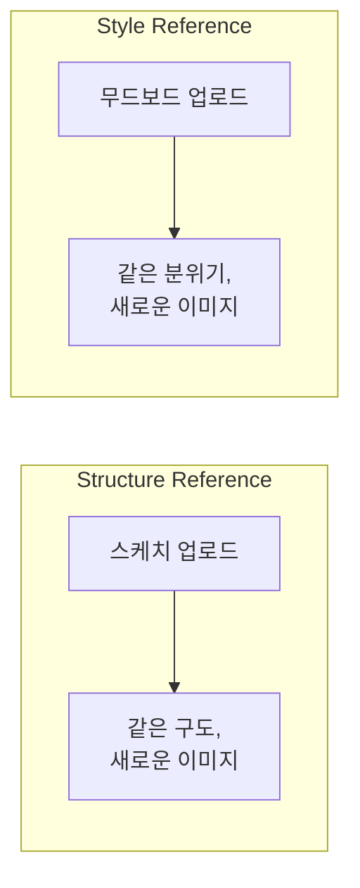
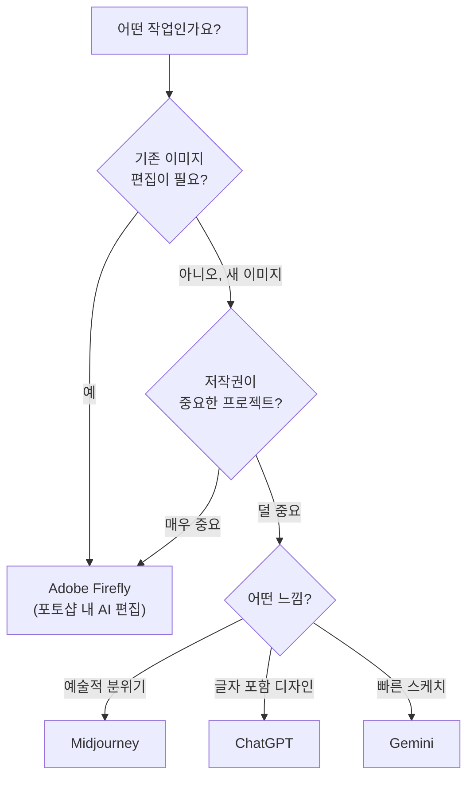

# Adobe Firefly — 포토샵 안에서 바로 쓰는 AI

> 작업하던 포토샵에서 바로 AI 편집. 그리고 상업 프로젝트에서 저작권 걱정 없이 쓸 수 있는 유일한 도구.

## 개요

앞 세션에서 ChatGPT, Gemini, Midjourney를 비교했는데요, 디자이너에게 매우 중요한 네 번째 도구가 있습니다. 바로 **Adobe Firefly**예요. 다른 도구들과 달리 Firefly는 포토샵·일러스트레이터 **안에서 바로** 쓸 수 있다는 게 가장 큰 차이점입니다.

**학습 목표**:
- Firefly가 뭔지, 왜 디자이너에게 특히 유용한지 안다
- 포토샵에서 Generative Fill, Generative Expand가 뭔지 안다
- "상업적으로 안전하다"는 게 실무에서 왜 중요한지 이해한다

## 왜 알아야 할까?

포토샵에서 작업하다가 배경을 확장하고 싶을 때, 일러스트레이터에서 아이콘이 필요할 때 — 다른 AI 도구로 이동해서 생성하고, 다운받아서, 다시 포토샵에 붙이고... 이 과정이 번거롭잖아요?

Firefly는 **작업 중인 앱 안에서 바로 AI가 작동**합니다. 그리고 클라이언트 프로젝트에서 "이 AI 이미지 저작권 괜찮아요?"라는 질문에 자신 있게 "네"라고 답할 수 있는 거의 유일한 도구이기도 해요.

## 핵심 내용

### 1. Firefly는 어디서 쓰나?

Firefly는 독립 웹사이트에서도 쓸 수 있고, 이미 쓰고 있는 Adobe 앱 안에서도 쓸 수 있어요.

| 사용 방법 | 설명 |
|----------|------|
| **firefly.adobe.com** | 웹브라우저에서 바로 이미지 생성 |
| **포토샵** | Generative Fill, Generative Expand 기능 |
| **일러스트레이터** | 텍스트로 편집 가능한 벡터 아이콘·패턴 생성 |
| **Adobe Express** | 소셜 미디어 포스트 빠르게 제작 |

### 2. 핵심 기능 — 이것만 알면 됩니다

**Generative Fill (생성형 채우기)**
포토샵에서 영역을 선택하고 → 원하는 걸 텍스트로 설명하면 → AI가 자연스럽게 채워줍니다.

> **실습 예시**
> 1. 포토샵에서 풍경 사진 열기
> 2. 올가미 도구로 하늘 부분 선택
> 3. "dramatic sunset sky with orange and purple clouds" 입력
> 4. AI가 자연스러운 석양 하늘로 채워줌

**Generative Expand (생성형 확장)**
세로 사진을 가로 배너로 바꿔야 할 때? 캔버스를 넓히면 AI가 주변에 어울리는 내용을 자연스럽게 채워줍니다.

**Style Reference (스타일 참조)**
참조 이미지의 색감·분위기·질감을 뽑아내서 새 이미지에 적용합니다. 브랜드 톤을 통일하고 싶을 때 특히 유용해요.

> **사용 예시**
> 1. 브랜드 무드보드 이미지를 Style Reference로 등록
> 2. 새로운 프롬프트 입력: "a modern office workspace, minimalist"
> 3. 결과물이 무드보드와 같은 색감·분위기로 생성됨

**Structure Reference (구조 참조)**
참조 이미지의 구도·레이아웃은 유지하면서 내용만 바꿉니다. 손으로 그린 스케치를 업로드하면 그 구도 그대로 완성된 이미지를 만들어줘요.

> 💡 **팁**: Structure Reference + Style Reference를 **동시에** 쓸 수도 있어요. 구도는 스케치로, 분위기는 브랜드 이미지로 — 이러면 시리즈 이미지를 만들 때 일관성과 다양성을 동시에 잡을 수 있습니다.

### 3. 상업적 안전성 — 클라이언트 작업에 왜 중요한가

다른 AI 도구들은 인터넷에서 긁어모은 이미지로 학습했어요. 그래서 "이 AI 이미지에 저작권 문제가 있나?"라는 질문에 확실한 답을 하기 어렵습니다.

Firefly는 다릅니다:
- **Adobe Stock의 정식 라이선스 이미지**로 학습
- **오픈 라이선스·퍼블릭 도메인 자료**만 사용
- 기업용 플랜에서는 **저작권 문제 발생 시 Adobe가 법적 책임**을 짐

| 플랫폼 | 학습 데이터 | 상업 사용 안전도 |
|--------|-----------|---------------|
| **Adobe Firefly** | 라이선스된 이미지만 | ★★★★★ |
| **ChatGPT** | 비공개 (웹 데이터 포함 추정) | ★★★☆☆ |
| **Midjourney** | 웹 스크래핑 포함 | ★★★☆☆ |
| **Gemini** | 비공개 | ★★★☆☆ |

> ⚠️ **주의**: "Firefly면 무조건 안전"이라고 생각하기 쉬운데, 법적 보호(IP 보상)는 **기업용 플랜에서만** 제공됩니다. 개인 플랜에서도 상업 사용은 허용되지만 수준이 다르다는 점 기억하세요.

### 4. 가격은?

이미 포토샵이나 Creative Cloud를 구독 중이라면 **추가 비용 없이** Firefly 기능을 쓸 수 있어요.

| 상황 | 추가 비용 |
|------|----------|
| CC All Apps 또는 포토샵 구독 중 | 무료 (월 크레딧 포함) |
| Adobe 구독 없음 | Firefly Standard $9.99/월 |
| 대량 사용 + 기업 | Firefly Premium $199.99/월 |

### 5. Firefly가 빛나는 상황 vs. 다른 도구가 나은 상황

| 이런 상황이면 | 추천 도구 |
|-------------|----------|
| 포토샵에서 배경 교체, 확장 | **Firefly** (Generative Fill/Expand) |
| 기업 클라이언트 상업 프로젝트 | **Firefly** (저작권 안전) |
| 벡터 아이콘·패턴 필요 | **Firefly** (Text to Vector) |
| 예술적 분위기의 아트워크 | **Midjourney** |
| 이미지에 정확한 글자 삽입 | **ChatGPT** |
| 빠르게 무료로 아이디어 탐색 | **Gemini** |

## 실습: 직접 해보기

### 활동 1: Firefly 기능 매칭

아래 작업에 가장 적합한 Firefly 기능을 골라보세요:

| 작업 | 적합한 기능 |
|------|-----------|
| 사진의 하늘을 석양으로 바꾸기 | ________ |
| 세로 사진을 가로 배너로 확장 | ________ |
| 브랜드 무드와 같은 분위기의 새 이미지 | ________ |
| 손그림 스케치를 완성된 이미지로 | ________ |

> 💡 **정답**: (1) Generative Fill, (2) Generative Expand, (3) Style Reference, (4) Structure Reference

### 활동 2: Generative Fill 실습

포토샵에서 아무 사진이나 열고 아래를 따라해보세요:

1. 올가미 도구로 바꾸고 싶은 영역 선택
2. Generative Fill 클릭
3. 아래 프롬프트 중 하나 입력:
   - "blooming cherry blossom trees" (벚꽃나무로 채우기)
   - "modern city skyline at night" (야경 도시로 채우기)
   - "empty, clean background" (깨끗한 배경으로 비우기)
4. 결과 3개 중 마음에 드는 것 선택

## 팁과 주의사항

> 🔥 **실무 팁**: Style Reference 하나를 프로젝트 시작 때 만들어두세요. 이후 수십 장의 이미지를 생성해도 브랜드 톤이 통일됩니다. "AI 시대의 브랜드 가이드라인"인 셈이에요.

> 🔥 **실무 팁**: 2025년부터 Firefly 안에서 Flux, GPT Image 같은 **다른 회사의 AI 모델**도 골라 쓸 수 있게 됐어요. 사실적인 인물 사진이 필요하면 Flux, 글자가 필요하면 GPT Image — 이렇게 Firefly 하나에서 여러 모델을 비교해보세요.

## 핵심 정리

| 개념 | 설명 |
|------|------|
| **Generative Fill** | 선택한 영역을 텍스트 설명대로 AI가 채워주는 기능 |
| **Generative Expand** | 캔버스를 넓히면 AI가 자연스럽게 확장해주는 기능 |
| **Style Reference** | 참조 이미지의 분위기·색감을 새 이미지에 적용 |
| **Structure Reference** | 참조 이미지의 구도·레이아웃을 유지하면서 새 이미지 생성 |
| **상업적 안전성** | 라이선스 데이터로만 학습 → 저작권 걱정 최소화 |

## 다음 세션 미리보기

이제 네 가지 주요 도구의 특성을 다 알았어요. 다음 세션에서는 각 플랫폼에 **실제로 가입하고 첫 이미지를 생성**하는 실습을 합니다. 이론에서 실전으로 넘어가는 단계예요.
