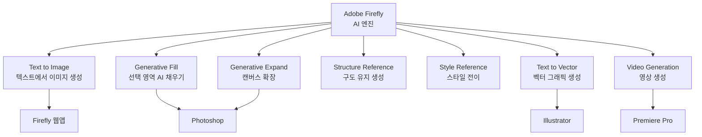
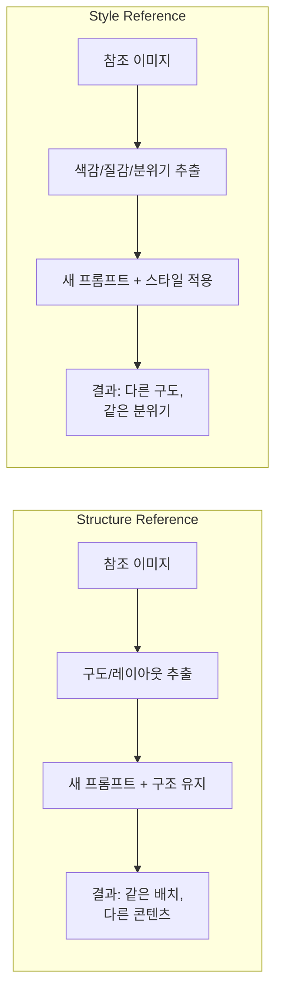
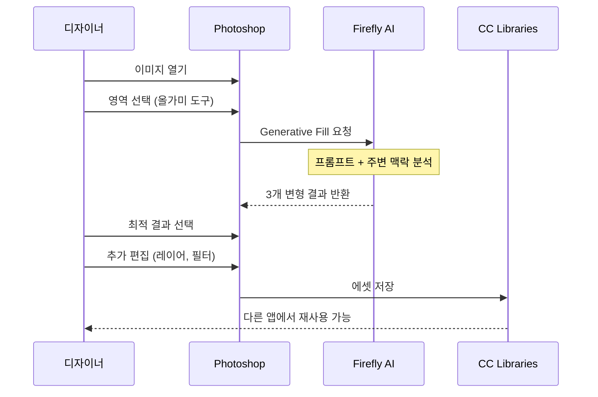
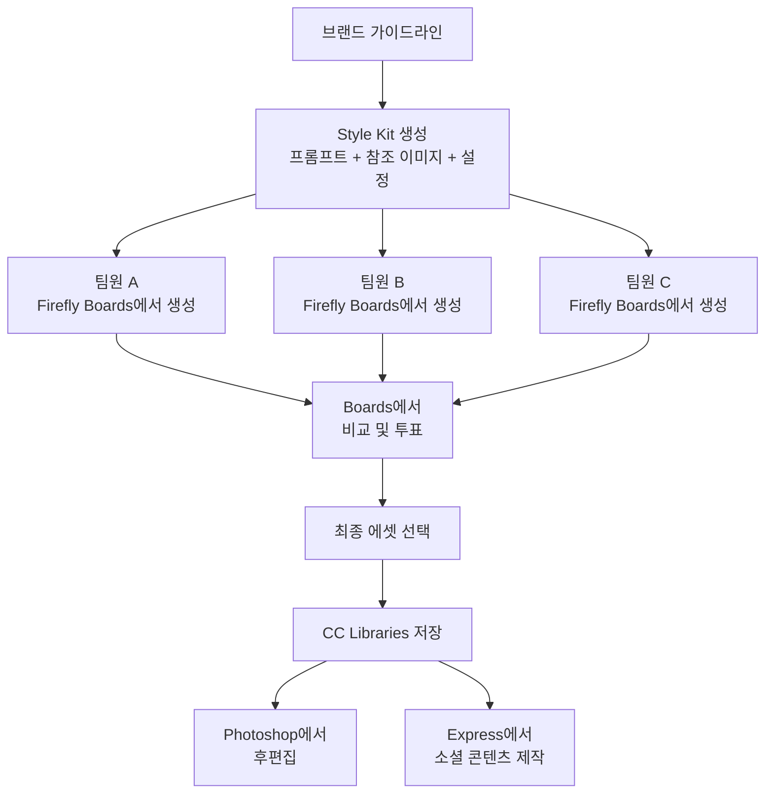
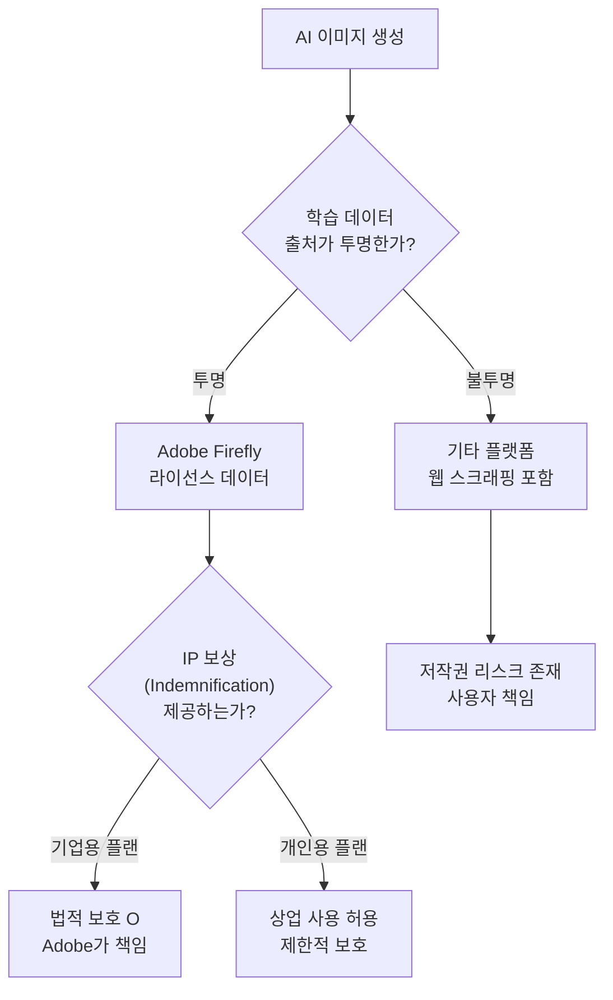
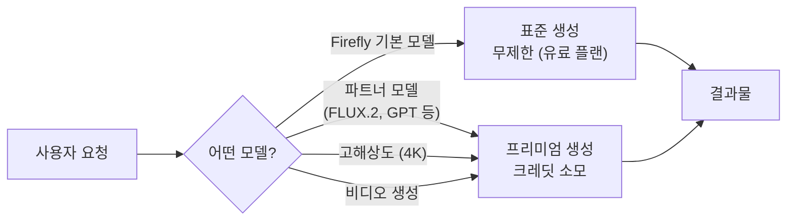
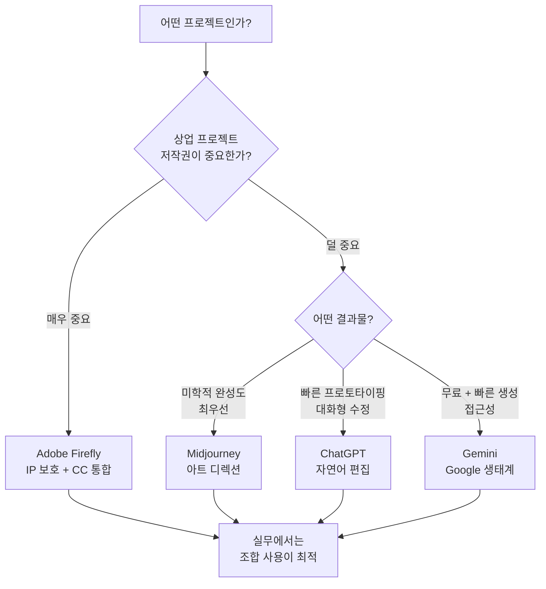

# Adobe Firefly와 크리에이티브 생태계

> Adobe의 AI 이미지 생성 도구 Firefly의 특성, Creative Cloud 통합 워크플로우, 그리고 상업적 안전성이라는 독보적 차별점을 탐구합니다.

## 개요

앞서 [주요 플랫폼 비교 — ChatGPT vs Gemini vs Midjourney](01-ch1-ai-이미지-생성-개론/02-02-주요-플랫폼-비교-chatgpt-vs-gemini-vs-midjourney.md)에서 세 가지 주요 플랫폼의 강점과 약점을 비교했습니다. 이번 섹션에서는 네 번째 핵심 플레이어인 **Adobe Firefly**를 깊이 살펴봅니다. Firefly는 단순한 이미지 생성 도구가 아니라, Photoshop·Illustrator·Express와 연동되는 **크리에이티브 생태계의 AI 허브**라는 점에서 다른 플랫폼과 근본적으로 다릅니다.

**선수 지식**: AI 이미지 생성의 기본 원리(txt2img), 주요 플랫폼별 특성 비교
**학습 목표**:
- Adobe Firefly의 핵심 기능(Text to Image, Generative Fill, Generative Expand, Structure/Style Reference)을 이해한다
- Firefly가 Photoshop·Illustrator 등 Creative Cloud 앱과 어떻게 통합되는지 파악한다
- '상업적 안전성(Commercially Safe)'의 의미와 실무적 중요성을 설명할 수 있다
- Firefly의 가격 체계와 크레딧 시스템을 이해한다
- Style Kit과 Boards를 활용한 팀 협업 워크플로우를 설계할 수 있다

## 왜 알아야 할까?

디자이너라면 Adobe 제품을 이미 사용하고 있을 가능성이 높습니다. Photoshop에서 작업하다가 배경을 확장하고 싶을 때, 일러스트레이터에서 벡터 패턴이 필요할 때 — 별도의 AI 도구로 이동하지 않고 **작업 중인 앱 안에서 바로 AI 기능을 쓸 수 있다면** 어떨까요?

더 중요한 문제가 있습니다. 클라이언트를 위한 상업 프로젝트에서 AI 생성 이미지를 사용할 때, "이 이미지의 학습 데이터에 저작권 문제가 없나요?"라는 질문에 자신 있게 답할 수 있어야 합니다. Firefly는 **라이선스된 콘텐츠로만 학습**되었다는 점에서, 상업적 사용에 대한 법적 리스크를 최소화하는 유일한 주류 플랫폼입니다.

## 핵심 개념

### 개념 1: Adobe Firefly란? — 크리에이티브 생태계의 AI 엔진

> 💡 **비유**: Firefly를 이해하는 가장 쉬운 방법은 자동차 엔진에 비유하는 것입니다. ChatGPT나 Midjourney가 **독립적인 전기 스쿠터**(그 자체로 완결된 이동 수단)라면, Firefly는 **자동차 안에 탑재된 엔진**입니다. 엔진 자체도 강력하지만, 진짜 가치는 차체(Photoshop), 내비게이션(Illustrator), 오디오 시스템(Premiere Pro)과 **함께 작동할 때** 발휘되죠.

Adobe Firefly는 2023년 3월에 베타로 출시된 Adobe의 생성형 AI 모델 패밀리입니다. 2026년 현재 **Firefly Image Model 5**(퍼블릭 베타)까지 발전했으며, 텍스트-투-이미지 생성뿐 아니라 이미지 편집, 벡터 생성, 영상 생성, 심지어 오디오 번역까지 영역을 확장했습니다.

Firefly의 핵심 기능을 정리하면 다음과 같습니다:

| 기능 | 설명 | 활용 예시 |
|------|------|-----------|
| **Text to Image** | 텍스트 프롬프트로 이미지 생성 | 컨셉 아트, 무드보드 소재 |
| **Generative Fill** | 선택 영역을 프롬프트 기반으로 채움 | 배경 교체, 오브젝트 추가/제거 |
| **Generative Expand** | 캔버스를 확장하며 자연스러운 콘텐츠 생성 | 종횡비 변경, 구도 확장 |
| **Structure Reference** | 참조 이미지의 구도/레이아웃 유지 | 스케치 기반 이미지 생성 |
| **Style Reference** | 참조 이미지의 스타일/분위기 적용 | 브랜드 톤 일관성 유지 |
| **Text to Vector** | 텍스트로 편집 가능한 벡터 생성 | 아이콘, 패턴, 일러스트 |

> 📊 **그림 1**: Adobe Firefly의 핵심 기능 구조

2026년 2월부터는 Adobe 자체 모델 외에도 **파트너 모델**도 Firefly 플랫폼 안에서 사용할 수 있게 되었습니다. 마치 하나의 앱스토어에서 여러 AI 엔진을 골라 쓰는 셈이죠.

| 파트너 모델 | 제공사 | 강점 | Firefly 내 활용 |
|------------|--------|------|----------------|
| **FLUX.2** | Black Forest Labs | 사실적 디테일, 인물 묘사 | Text to Image 대안 모델 |
| **GPT Image Generation** | OpenAI | 정확한 텍스트 렌더링, 지시 이행력 | Text to Image 대안 모델 |
| **Google Nano Banana Pro** | Google | 빠른 생성 속도, 다양한 스타일 | Text to Image 대안 모델 |
| **Runway Gen-4** | Runway | 영상 생성 특화, 카메라 제어 | Video Generation 파트너 |

각 파트너 모델은 Firefly 웹앱의 모델 선택 드롭다운에서 바로 전환할 수 있으며, 동일한 프롬프트로 여러 모델의 결과를 비교하는 것도 가능합니다. 단, 파트너 모델 사용 시에는 **프리미엄 크레딧**이 소모된다는 점을 기억하세요.

### 개념 2: Structure Reference와 Style Reference — 참조 기반 생성의 핵심

> 💡 **비유**: Structure Reference는 건물의 **설계도**와 같습니다. "이 배치와 구조를 유지하되, 외관은 완전히 새롭게"라는 주문이죠. Style Reference는 인테리어 **무드보드**입니다. "이런 분위기와 느낌으로, 하지만 구조는 자유롭게"라는 주문이에요.

Firefly의 참조 기반 생성 기능은 두 가지로 나뉩니다:

**Structure Reference** — 참조 이미지의 **구도, 레이아웃, 형태**를 유지하면서 새로운 이미지를 생성합니다. 예를 들어 손으로 그린 대략적인 스케치를 업로드하면, 그 구도를 따르는 완성된 이미지를 만들어줍니다. 포즈 가이드나 레이아웃 템플릿으로 활용하면 매우 효과적이죠.

**Style Reference** — 참조 이미지의 **색감, 질감, 분위기, 예술적 스타일**을 추출하여 새로운 이미지에 적용합니다. 브랜드의 비주얼 톤을 일관되게 유지하고 싶을 때 특히 강력합니다. 예를 들어 기존 브랜드 이미지 하나를 Style Reference로 등록하면, 이후 생성하는 모든 이미지가 동일한 색감과 분위기를 갖게 됩니다.

> ⚠️ **흔한 오해**: "Style Reference"라는 용어는 Midjourney에서도 사용됩니다(--sref 파라미터). 하지만 작동 방식이 다릅니다. **Midjourney의 --sref**는 참조 이미지의 전반적인 미학(색조, 구도, 분위기)을 학습하여 새 이미지에 녹여내는 방식이고, **Firefly의 Style Reference**는 참조 이미지에서 색상 팔레트, 톤, 조명 같은 스타일 속성을 분리 추출하여 적용하는 방식입니다. 같은 이름이지만, Firefly 쪽이 스타일 요소를 더 세밀하게 제어할 수 있고, Midjourney 쪽이 참조 이미지의 "감성"을 더 폭넓게 흡수하는 경향이 있습니다. 두 플랫폼을 오가며 작업할 때 이 차이를 인식하고 있으면 결과물의 일관성을 관리하기 훨씬 수월해집니다.

> 📊 **그림 2**: Structure Reference vs Style Reference 작동 비교

두 기능을 **동시에 사용**할 수도 있습니다. Structure Reference로 레이아웃을 잡고, Style Reference로 분위기를 입히면 — 구도와 스타일 모두 의도대로 제어된 이미지를 얻을 수 있죠. 이것은 브랜드 캠페인에서 여러 장의 시리즈 이미지를 만들 때 특히 유용합니다.

### 개념 3: Creative Cloud 통합 워크플로우 — 작업 흐름 안의 AI

> 💡 **비유**: 요리에 비유하면, 다른 AI 플랫폼은 "식재료 배달 서비스"입니다. 좋은 재료(이미지)를 받지만, 조리(편집)는 별도의 주방(Photoshop)에서 해야 하죠. Firefly는 **주방에 내장된 스마트 조리 기구**입니다. 요리 도중에 "여기에 허브를 추가해줘"라고 말하면 바로 처리되는 거예요.

Firefly의 진짜 경쟁력은 독립 실행이 아니라 **기존 작업 흐름 속 통합**에 있습니다. 디자이너가 매일 사용하는 도구 안에서 AI가 작동한다는 점이 핵심이죠.

**Photoshop 통합 사례:**
1. 이미지를 열고 올가미 도구로 영역을 선택합니다
2. "Generative Fill" 클릭 후 "add autumn leaves"라고 입력합니다
3. AI가 주변 맥락을 분석해 자연스럽게 채웁니다
4. 마음에 들지 않으면 프롬프트를 수정해 재생성합니다

2025년 9월부터는 Photoshop의 Generative Fill에서도 Adobe Firefly 모델뿐 아니라 **FLUX.2**, **Gemini** 등 파트너 모델을 선택할 수 있게 되었습니다. 작업의 성격에 따라 모델을 바꿔가며 최적의 결과를 얻을 수 있죠.

> 📊 **그림 3**: Firefly 통합 워크플로우 — 디자이너의 실제 작업 흐름

**Illustrator 통합:**
- **Text to Vector**: "minimalist cat icon, geometric style"과 같은 프롬프트로 편집 가능한 벡터 그래픽을 생성합니다
- 생성된 벡터는 일반 Illustrator 오브젝트처럼 패스 편집, 색상 변경, 크기 조절이 가능합니다
- 파트너 모델을 통한 벡터 생성도 지원됩니다

**Adobe Express 통합:**
- 비디자이너도 사용할 수 있는 간소화된 인터페이스에서 Firefly 기능을 제공합니다
- 소셜 미디어 포스트, 프레젠테이션 등을 AI로 빠르게 제작합니다

### 개념 4: Style Kit과 Firefly Boards — 팀 협업의 새로운 표준

**Style Kit**은 Firefly의 가장 실용적인 협업 기능 중 하나입니다. 브랜드의 시각적 정체성을 AI 생성 과정에 체계적으로 적용할 수 있게 해주거든요.

Style Kit에는 다음 요소를 저장할 수 있습니다:
- **자주 쓰는 프롬프트 세트**: 브랜드에 맞는 키워드 조합
- **Style Reference 이미지**: 브랜드 톤을 정의하는 참조 이미지
- **색상 팔레트 가이드**: 브랜드 컬러에 맞는 색감 설정
- **생성 파라미터 프리셋**: 종횡비, 스타일 강도 등 세부 설정

> 💡 **비유**: Style Kit은 일종의 **AI 시대의 브랜드 가이드라인**입니다. 기존 브랜드 가이드라인이 "이 폰트, 이 색상을 쓰세요"라고 사람에게 지시하는 문서라면, Style Kit은 "이 분위기, 이 톤으로 생성하세요"라고 AI에게 지시하는 문서인 셈이죠.

팀원 누구나 동일한 Style Kit을 적용하면 **브랜드 톤이 일관된 이미지**를 생성할 수 있습니다. 신입 디자이너가 들어와도, 복잡한 브랜드 가이드라인을 완벽히 숙지하지 않아도, Style Kit 하나면 브랜드에 맞는 AI 이미지를 바로 만들 수 있다는 뜻이에요.

**Firefly Boards**는 팀원들과 함께 AI 이미지를 생성하고, 비교하고, 선택하는 **협업형 아이디에이션 보드**입니다. 무드보드 작업에 특히 유용하며, 주요 기능은 다음과 같습니다:

- **실시간 공동 생성**: 여러 팀원이 동시에 프롬프트를 입력하고 결과를 공유
- **비교 & 투표**: 생성된 이미지들을 나란히 놓고 팀원 피드백 수집
- **버전 관리**: 아이디에이션 과정의 히스토리가 자동 저장
- **컬렉션 관리**: 최종 선택된 에셋을 CC Libraries로 바로 내보내기

> 📊 **그림 4**: Style Kit + Boards 협업 워크플로우

### 개념 5: 상업적 안전성 — Firefly만의 독보적 차별점

> 💡 **비유**: 식품에 비유하면, 대부분의 AI 이미지 생성 도구는 "원산지 불명의 식재료"로 만든 요리입니다. 맛은 좋을 수 있지만, 알레르기(저작권 소송)가 발생할 수 있죠. Firefly는 **유기농 인증을 받은 식재료**만 사용하는 레스토랑입니다. 모든 재료의 출처가 추적 가능하고, 안전성이 보증됩니다.

이것이 Firefly를 다른 모든 AI 이미지 생성 도구와 구분짓는 **가장 중요한 차별점**입니다.

**Firefly의 학습 데이터 구성:**
- **Adobe Stock의 라이선스된 이미지**: 정당한 대가를 지불한 콘텐츠
- **오픈 라이선스 콘텐츠**: Creative Commons 등 합법적으로 사용 가능한 자료
- **퍼블릭 도메인**: 저작권이 만료된 역사적 자료

이에 비해 다른 플랫폼들의 학습 데이터는 어떨까요?

| 플랫폼 | 학습 데이터 출처 | 상업적 안전성 |
|--------|----------------|--------------|
| **Adobe Firefly** | 라이선스된 Stock, 오픈 라이선스, 퍼블릭 도메인 | IP 보상(Indemnification) 제공 |
| **Midjourney** | 웹 스크래핑 포함 (출처 불명확) | 유료 플랜 상업 사용 허용, IP 보호 없음 |
| **ChatGPT (GPT-4o)** | 비공개 (웹 데이터 포함 추정) | 상업 사용 허용, IP 보호 제한적 |
| **Gemini (Imagen)** | 비공개 | 상업 사용 허용, IP 보호 제한적 |

> 📊 **그림 5**: 상업적 안전성 비교 — 학습 데이터에서 법적 보호까지

**IP 보상(Indemnification)이란?**

Adobe의 기업용 플랜(Creative Cloud for Enterprise, Firefly for Business)에서는 **IP Indemnification**을 제공합니다. 이는 Firefly로 생성한 콘텐츠에 대해 제3자가 저작권 침해를 주장할 경우, **Adobe가 법적 방어 비용과 손해배상을 부담**하겠다는 약속입니다. 이것은 상업 프로젝트에서 엄청난 안심을 제공하죠.

> ⚠️ **흔한 오해**: "Firefly로 만들면 무조건 상업적으로 안전하다"고 생각하기 쉽지만, IP 보상은 **기업용 플랜에서만** 제공됩니다. 개인 플랜에서도 상업 사용은 허용되지만, IP 보상까지 받으려면 기업용 라이선스가 필요합니다.

### 개념 6: 가격 체계와 크레딧 시스템

Firefly는 **크레딧(Credit) 기반** 과금 체계를 사용합니다. 이미지를 생성할 때마다 크레딧이 소모되며, 플랜에 따라 월간 할당량이 다릅니다.

| 플랜 | 월 가격 | 프리미엄 크레딧 | 주요 특징 |
|------|---------|----------------|-----------|
| **무료** | $0 | 제한적 | 기본 기능 체험, 워터마크 포함 |
| **Firefly Standard** | $9.99 | 2,000 | 표준 생성 무제한, 워터마크 없음 |
| **Firefly Pro** | $19.99 | 4,000 | 고급 모델 접근, 4K 업스케일 |
| **Firefly Premium** | $199.99 | 50,000 | 대량 생성, 기업용, API 접근 |

2026년 1월부터 3월까지는 프로모션으로 **프리미엄 크레딧 무제한 생성**이 제공되기도 했습니다. Adobe는 "표준 생성(Standard Generation)"과 "프리미엄 생성(Premium Generation)"을 구분하는데, 파트너 모델(FLUX.2, GPT Image 등)이나 고해상도 생성은 프리미엄 크레딧을 소모합니다.

> 📊 **그림 6**: Firefly 크레딧 소모 흐름

**Creative Cloud 사용자라면?**

이미 Photoshop이나 전체 Creative Cloud를 구독 중이라면, **추가 비용 없이 Firefly 기능을 사용**할 수 있습니다. Creative Cloud All Apps 플랜에는 월 1,000 프리미엄 크레딧이 포함되어 있으며, Photoshop 단일 앱 플랜에도 크레딧이 제공됩니다. 별도의 Firefly 구독은 Creative Cloud 없이 AI 생성 기능만 사용하고 싶을 때 필요합니다.

### 개념 7: 다른 플랫폼과의 포지셔닝 비교

[이전 섹션](01-ch1-ai-이미지-생성-개론/02-02-주요-플랫폼-비교-chatgpt-vs-gemini-vs-midjourney.md)에서 다룬 세 플랫폼에 Firefly를 추가해 전체 그림을 완성해 봅시다.

> 📊 **그림 7**: 네 플랫폼의 포지셔닝 맵 — 누구를 위한 도구인가

**Firefly가 특히 빛나는 시나리오:**
- **기업 브랜드 작업**: 저작권 이슈가 치명적인 대기업 프로젝트
- **기존 이미지 편집**: 사진 보정, 배경 교체 등 Photoshop 기반 작업
- **벡터 에셋 제작**: 아이콘, 패턴 등 Illustrator 기반 작업
- **팀 협업**: Style Kit + Firefly Boards를 활용한 일관된 아이디에이션

**Firefly가 상대적으로 약한 시나리오:**
- **순수 아트 디렉션**: 미학적 완성도에서는 Midjourney가 우위
- **텍스트 렌더링**: 정확한 텍스트 삽입은 ChatGPT GPT-4o가 강점
- **빠른 아이디어 검증**: 간단한 대화형 생성은 ChatGPT나 Gemini가 편리

## 실습: 적용해보기

### 활동 1: 플랫폼 선택 시뮬레이션

아래 각 시나리오에서 어떤 플랫폼(또는 조합)을 선택할지 결정하고, 그 이유를 적어보세요.

| 시나리오 | 당신의 선택 | 이유 |
|----------|-----------|------|
| 대형 화장품 브랜드의 광고 캠페인용 이미지 제작 | | |
| 개인 인스타그램에 올릴 판타지 아트 시리즈 | | |
| 기존 제품 사진에서 배경만 교체하는 작업 | | |
| 초등학교 교육 자료에 들어갈 귀여운 캐릭터 | | |
| 스타트업 앱의 UI 목업 빠르게 생성 | | |

### 활동 2: Firefly 기능 매칭

아래 작업에 가장 적합한 Firefly 기능을 연결해 보세요.

| 작업 | Firefly 기능 |
|------|-------------|
| 사진의 하늘 부분만 석양으로 바꾸기 | ( ) Text to Image / ( ) Generative Fill / ( ) Generative Expand |
| 세로 사진을 가로 배너로 확장하기 | ( ) Text to Image / ( ) Generative Fill / ( ) Generative Expand |
| 브랜드 무드보드용 이미지 초안 생성 | ( ) Text to Image / ( ) Generative Fill / ( ) Style Reference |
| 참조 이미지와 같은 분위기의 새 이미지 만들기 | ( ) Structure Reference / ( ) Style Reference / ( ) Generative Fill |
| 손으로 그린 스케치를 기반으로 완성된 이미지 만들기 | ( ) Structure Reference / ( ) Style Reference / ( ) Text to Vector |

### 활동 3: Style Kit 설계 워크시트

가상의 브랜드를 위한 Style Kit을 설계해 보세요.

| 항목 | 당신의 설계 |
|------|-----------|
| 브랜드 이름 | (예: "Green Table" — 친환경 식기 브랜드) |
| 핵심 프롬프트 키워드 3개 | |
| Style Reference 설명 (어떤 이미지를 참조로 쓸 것인지) | |
| 색상 톤 (warm / cool / neutral) | |
| 권장 종횡비 (SNS용 / 웹 배너용) | |
| 팀원에게 전달할 생성 규칙 1가지 | |

### 토론 질문

1. "상업적 안전성"이 개인 크리에이터에게도 중요할까요, 아니면 기업에게만 중요한 문제일까요?
2. Adobe가 파트너 모델(FLUX.2, GPT Image 등)을 Firefly 안에 통합한 전략적 이유는 무엇일까요?
3. 모든 AI 이미지 생성 도구가 Firefly처럼 라이선스된 데이터만 사용한다면, AI 아트의 품질이나 다양성에 어떤 영향이 있을까요?

## 더 깊이 알아보기

### Firefly의 탄생 스토리 — "안전한 AI"라는 도박

2022년, AI 이미지 생성의 세계는 폭발적으로 성장하고 있었습니다. Midjourney와 Stable Diffusion이 인터넷의 모든 이미지를 학습 데이터로 끌어모으며 놀라운 결과물을 만들어내고 있었죠. 이때 Adobe는 매우 다른 길을 선택했습니다.

Adobe의 AI 연구 팀은 "우리의 고객은 전문 크리에이터다. 이들에게 저작권 리스크가 있는 도구를 줄 수는 없다"라는 원칙을 세웠습니다. 이것은 쉬운 결정이 아니었어요. 라이선스된 데이터만으로는 학습 데이터의 양이 크게 줄어들고, 결과적으로 생성 품질이 경쟁사에 뒤처질 수 있었거든요.

2023년 3월, Adobe는 Firefly 베타를 공개했습니다. Adobe Stock의 수억 장 이미지, 오픈 라이선스 콘텐츠, 저작권 만료 자료만을 학습 데이터로 사용했다고 발표했죠. 업계에서는 "품질이 따라갈 수 있을까?"라는 의문이 컸습니다.

결과적으로 Adobe의 선택은 성공적이었습니다. 2025년에는 Firefly Image Model 4와 5를 통해 품질 격차를 크게 줄였고, **기업 시장에서 "저작권 걱정 없는 AI"라는 독보적 포지션**을 확보했습니다. 나아가 2025년 말에는 다른 회사의 모델까지 품으며 "AI 모델의 플랫폼"으로 진화했습니다.

> 💡 **알고 계셨나요?**: 2024년 Bloomberg 보도에 따르면, Firefly 학습 데이터의 약 5%가 Midjourney로 생성된 AI 이미지를 포함하고 있었다는 논란이 있었습니다. Adobe는 이 비율이 매우 작다고 해명했지만, "100% 안전"이라는 브랜딩에 흠집이 생긴 사건이었죠. 이 에피소드는 AI 학습 데이터의 투명성이 얼마나 복잡한 문제인지를 보여줍니다.

### 파트너 모델 전략 — "적을 품어라"

2025년 12월, Adobe는 놀라운 발표를 했습니다. 경쟁사의 AI 모델들을 Firefly 플랫폼 안에 통합하겠다는 것이었죠. Runway와는 비디오 AI 분야에서 다년 전략적 파트너십을 맺었고, Google, Black Forest Labs, OpenAI의 이미지 모델도 차례로 품었습니다.

왜 경쟁사 모델을 자기 플랫폼에 올렸을까요? Adobe의 전략은 명확합니다: **"최고의 AI가 뭐든 간에, 우리 생태계 안에서 쓰게 하자."** 디자이너가 FLUX.2의 사실적 디테일이 필요하면 Firefly에서 쓰고, GPT Image의 텍스트 렌더링이 필요해도 Firefly에서 쓰는 거죠. 결과적으로 크리에이터는 Adobe 생태계를 떠날 이유가 없어집니다.

이 전략은 마치 **쇼핑몰 운영자**와 같습니다. 직접 모든 가게를 운영하기보다, 최고의 브랜드들을 입점시켜서 고객이 몰 밖으로 나갈 이유를 없애는 거죠. 다만 파트너 모델로 생성한 이미지에는 Firefly 자체 모델과 동일한 수준의 IP 보상이 적용되지 않을 수 있다는 점은 주의해야 합니다.

## 흔한 오해와 팁

> ⚠️ **흔한 오해**: "Firefly는 Photoshop 안에서만 쓸 수 있다" — 아닙니다! firefly.adobe.com 웹 사이트에서 독립적으로 사용할 수 있고, 모바일 앱(iOS, Android)도 있습니다. Photoshop이나 Creative Cloud가 없어도 Firefly Standard 플랜($9.99/월)만으로 시작할 수 있습니다.

> 💡 **알고 계셨나요?**: Adobe는 Firefly 학습에 기여한 Adobe Stock 작가들에게 **보상 프로그램**을 운영합니다. Stock 작가의 이미지가 Firefly 학습에 사용되면, 그 기여에 대한 보상을 받을 수 있죠. AI 학습 데이터에 대한 공정한 보상 모델을 만들려는 시도입니다.

> 🔥 **실무 팁**: Firefly의 **Style Kit** 기능을 적극 활용하세요. 자주 쓰는 프롬프트, 스타일 설정, 참조 이미지를 하나의 키트로 저장해두면, 팀원 누구나 동일한 브랜드 톤의 이미지를 일관되게 생성할 수 있습니다. 프로젝트 시작 시 Style Kit부터 만들어두면 — 이후 수십, 수백 장의 이미지를 생성해도 브랜드 일관성이 유지됩니다. 브랜드 가이드라인을 AI 시대에 맞게 확장하는 가장 실용적인 방법이에요.

> 🔥 **실무 팁**: **Structure Reference + Style Reference 조합**을 마스터하세요. 구도는 Structure Reference로 잡고, 분위기는 Style Reference로 통일하면 — 시리즈 이미지를 만들 때 일관성과 다양성을 동시에 확보할 수 있습니다. 예를 들어 제품 카탈로그에서 모든 제품 사진의 레이아웃은 같되, 시즌별로 분위기만 바꾸는 식이죠.

## 핵심 정리

| 개념 | 설명 |
|------|------|
| **Adobe Firefly** | Adobe의 생성형 AI 모델 패밀리. 독립 웹앱 + Creative Cloud 통합으로 작동 |
| **상업적 안전성** | 라이선스된 데이터로만 학습. 기업용 플랜은 IP 보상(Indemnification) 제공 |
| **Creative Cloud 통합** | Photoshop(Generative Fill/Expand), Illustrator(Text to Vector) 등 앱 내 직접 사용 |
| **파트너 모델** | FLUX.2, GPT Image, Gemini, Runway Gen-4 등 타사 모델도 Firefly 플랫폼에서 사용 가능 |
| **크레딧 시스템** | 표준 생성(무제한) + 프리미엄 생성(크레딧 소모)의 이중 구조. CC 구독자에게 크레딧 포함 |
| **Structure Reference** | 참조 이미지의 구도/레이아웃을 유지하면서 새 이미지 생성 |
| **Style Reference** | 참조 이미지의 색감/분위기를 추출하여 적용. Midjourney --sref와 유사하나 작동 방식 상이 |
| **Style Kit** | 프롬프트, 참조 이미지, 설정을 키트로 저장하여 팀 전체가 브랜드 톤 일관성 유지 |
| **Firefly Boards** | 팀 협업형 AI 아이디에이션 보드. 실시간 공동 생성, 비교, 투표 기능 |

## 다음 섹션 미리보기

이제 네 가지 주요 플랫폼의 특성을 모두 파악했습니다. 다음 섹션 [플랫폼별 계정 설정과 인터페이스 탐색](01-ch1-ai-이미지-생성-개론/04-04-플랫폼별-계정-설정과-인터페이스-탐색.md)에서는 각 플랫폼에 실제로 가입하고, 인터페이스를 둘러보며, 첫 이미지를 생성하는 실습을 진행합니다. 이론에서 실전으로 넘어가는 단계이니, 각 플랫폼의 계정을 미리 준비해 두면 좋습니다.

## 참고 자료

- [Adobe Firefly 공식 사이트](https://www.adobe.com/products/firefly.html) - Firefly의 전체 기능과 최신 업데이트 확인
- [Adobe Firefly 도움말 및 튜토리얼](https://helpx.adobe.com/firefly/web.html) - 기능별 상세 사용법과 학습 자료
- [Adobe Firefly Features Overview](https://www.adobe.com/products/firefly/features.html) - 주요 기능별 상세 소개 페이지
- [Adobe Blog: Firefly 무제한 생성 발표 (2026.02)](https://blog.adobe.com/en/publish/2026/02/02/create-unlimited-generations-adobe-firefly-all-in-one-creative-ai-studio) - 2026년 무제한 생성 및 파트너 모델 통합 발표
- [Adobe Firefly 비즈니스용 — 상업적 안전성 설명](https://business.adobe.com/products/firefly-business/firefly-ai-approach.html) - 기업 고객을 위한 IP 보호 및 라이선싱 정책
- [Adobe Blog: Firefly AI 비디오 및 파트너 모델 (2025.12)](https://blog.adobe.com/en/publish/2025/12/16/adobe-firefly-improves-ai-video-creation-tools-new-models-unlimited-generations) - Runway 파트너십 및 멀티모델 전략 발표
- [Photoshop Generative Fill 공식 페이지](https://www.adobe.com/products/photoshop/generative-fill.html) - Generative Fill 기능의 상세 설명과 활용 예시

---
### 🔗 Related Sessions
- [txt2img](01-ch1-ai-이미지-생성-개론/01-01-생성형-ai가-바꾸는-디자인-워크플로우.md) (prerequisite)
- [프롬프트](01-ch1-ai-이미지-생성-개론/01-01-생성형-ai가-바꾸는-디자인-워크플로우.md) (prerequisite)
- [ai 워크플로우](01-ch1-ai-이미지-생성-개론/01-01-생성형-ai가-바꾸는-디자인-워크플로우.md) (prerequisite)
- [gpt-4o 네이티브 이미지 생성](01-ch1-ai-이미지-생성-개론/02-02-주요-플랫폼-비교-chatgpt-vs-gemini-vs-midjourney.md) (prerequisite)
- [midjourney v7](01-ch1-ai-이미지-생성-개론/02-02-주요-플랫폼-비교-chatgpt-vs-gemini-vs-midjourney.md) (prerequisite)
