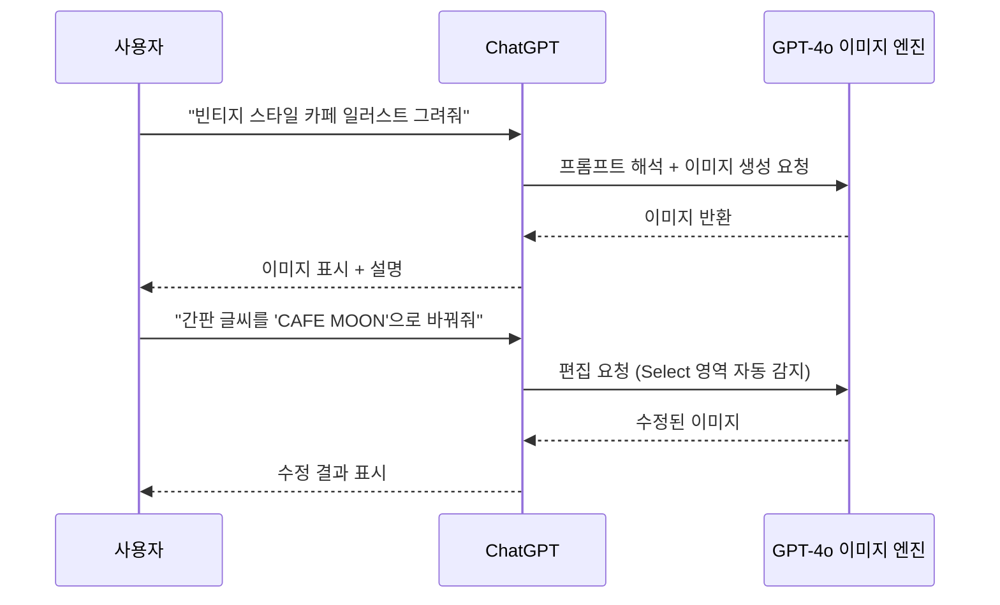
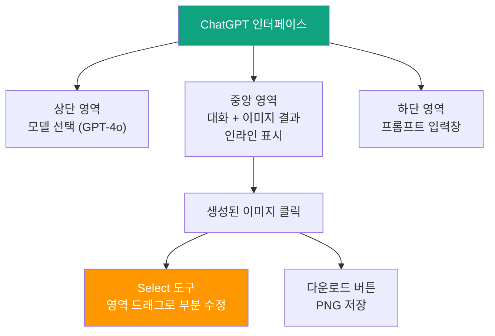
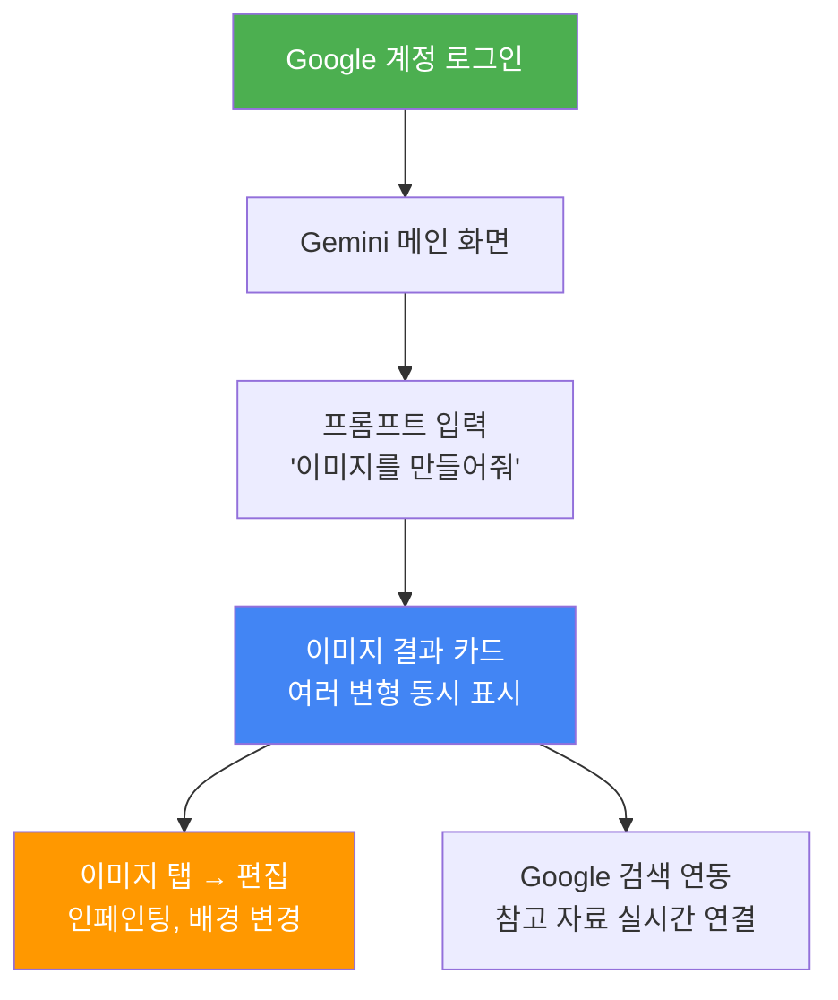
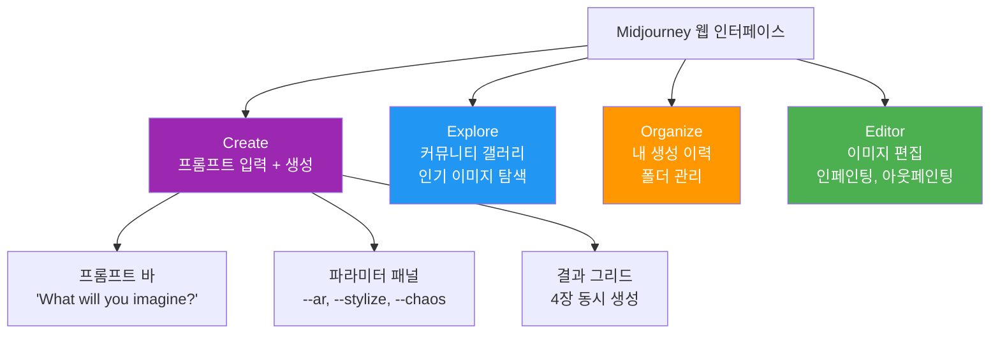
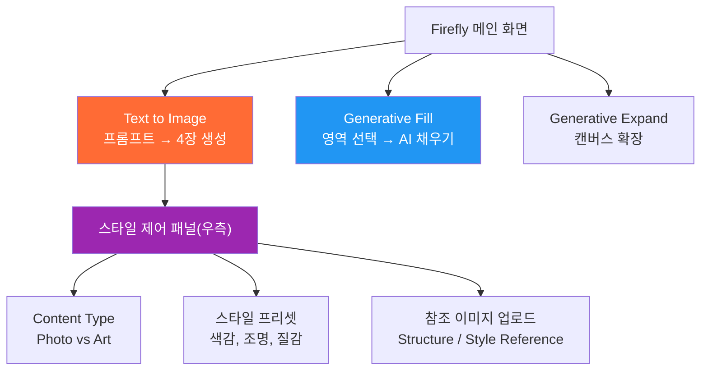
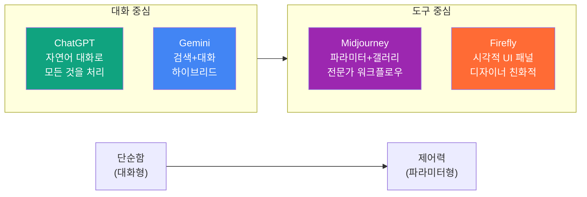

# 플랫폼별 계정 설정과 인터페이스 탐색

> 네 가지 AI 이미지 생성 플랫폼에 실제로 가입하고, 각 인터페이스의 핵심 영역을 파악하여 첫 이미지를 생성할 준비를 갖춘다.

## 개요

이 섹션에서는 앞서 비교했던 ChatGPT, Gemini, Midjourney, Adobe Firefly 네 플랫폼에 **직접 가입하고, 인터페이스를 탐색하며, 첫 이미지를 생성**하는 실전 과정을 다룹니다. 이론으로 아는 것과 실제로 손에 익히는 것은 완전히 다르거든요.

**선수 지식**: [주요 플랫폼 비교](01-ch1-ai-이미지-생성-개론/02-02-주요-플랫폼-비교-chatgpt-vs-gemini-vs-midjourney.md)에서 배운 각 플랫폼의 특성과 강점, [Adobe Firefly와 크리에이티브 생태계](01-ch1-ai-이미지-생성-개론/03-03-adobe-firefly와-크리에이티브-생태계.md)에서 배운 Firefly의 포지셔닝

**학습 목표**:
- 네 플랫폼의 계정을 생성하고 이미지 생성 기능이 활성화된 상태를 만들 수 있다
- 각 인터페이스의 핵심 영역(프롬프트 입력, 결과 갤러리, 편집 도구)의 위치를 파악한다
- 각 플랫폼에서 첫 이미지를 직접 생성하고 결과물의 차이를 체감한다

## 왜 알아야 할까?

여러분이 새 카메라를 샀다고 상상해보세요. 카메라의 스펙은 잘 알지만, 실제로 전원을 켜고 메뉴를 탐색하고 셔터 버튼을 눌러보지 않으면 아무런 의미가 없죠. AI 이미지 생성 도구도 마찬가지입니다.

실무에서 가장 많은 시간을 잡아먹는 것은 놀랍게도 **"도구 설정"**입니다. "Midjourney는 어디서 가입하지?", "ChatGPT 무료 계정으로 이미지가 되나?", "Firefly에서 첫 화면이 뭐지?" — 이런 질문에 막혀서 정작 창작에 들어가지 못하는 경우가 정말 많거든요.

이 섹션을 마치면 네 플랫폼 모두에 로그인된 상태에서 바로 프롬프트를 입력할 수 있는 **"제로 셋업 상태"**가 됩니다. 다음 챕터부터 시작되는 [프롬프트 구조 마스터](02-ch2-프롬프트-구조-마스터/01-01-프롬프트-해부학-6요소-프레임워크.md)에서 바로 실습할 수 있도록 준비하는 단계입니다.

## 핵심 개념

### 개념 1: 요금제 요약과 시작 전략

각 플랫폼의 요금 구조는 [주요 플랫폼 비교](01-ch1-ai-이미지-생성-개론/02-02-주요-플랫폼-비교-chatgpt-vs-gemini-vs-midjourney.md)와 [Adobe Firefly와 크리에이티브 생태계](01-ch1-ai-이미지-생성-개론/03-03-adobe-firefly와-크리에이티브-생태계.md)에서 이미 다뤘으니, 여기서는 **"지금 당장 시작하려면 어떤 선택이 최적인가"**만 빠르게 짚겠습니다.

| 플랫폼 | 무료 가능? | 추천 시작 | 핵심 제한 |
|--------|-----------|----------|----------|
| ChatGPT | O | 무료 → Plus($20) | 무료는 일일 생성 횟수 제한 |
| Gemini | O | 무료 | 일 100장, 인물 필터 엄격 |
| Midjourney | X | Basic($10) | 유료 전용, 3.3h Fast GPU |
| Firefly | O | 무료 → Standard($10) | 무료는 제한적 크레딧 |

> 💡 **비유**: 요금제 선택은 **헬스장 등록**과 비슷합니다. 처음부터 연간 회원권을 끊기보다, 일일 이용권(무료 체험)으로 여러 곳을 돌아본 후 가장 자주 가게 될 곳에 월 회원권을 끊는 게 현명하죠.

**추천 전략**: 무료로 시작하고 싶다면 ChatGPT 무료 + Gemini 무료 조합이 가장 효율적입니다. Midjourney는 유료 전용이지만, 미학적 품질이 월등하므로 디자이너라면 Basic($10/월)부터 시작해볼 가치가 충분합니다. 요금제별 상세 비교가 더 필요하다면 앞선 섹션들을 참고하세요.

---

### 개념 2: ChatGPT — 대화창이 곧 캔버스

> 💡 **비유**: ChatGPT의 이미지 생성은 **카카오톡으로 디자이너에게 의뢰하는 것**과 같습니다. 채팅창에 "이런 이미지 만들어줘"라고 말하면 바로 결과가 나오고, "여기 색상 바꿔줘"라고 추가 요청하면 대화 흐름 안에서 수정이 이뤄지죠.

**가입 과정:**

1. **chatgpt.com** 방문
2. **Sign up** 클릭 → Google, Microsoft, Apple 계정으로 간편 가입 가능
3. 가입 완료 후 자동으로 GPT-4o 모델이 기본 설정됨
4. 별도의 이미지 생성 "활성화" 절차 없음 — 바로 "고양이 일러스트 그려줘"라고 입력하면 동작

> 📊 **그림 1**: ChatGPT 이미지 생성 워크플로우

**인터페이스 핵심 영역:**

- **프롬프트 입력창**: 화면 하단의 텍스트 입력 영역. 자연어로 원하는 이미지를 설명
- **이미지 결과 영역**: 대화 흐름 안에 인라인으로 이미지가 표시됨
- **Select 도구**: 생성된 이미지를 클릭하면 우측 상단에 나타나는 선택 도구. 특정 영역을 드래그하여 부분 수정 가능
- **다운로드 버튼**: 이미지 하단의 다운로드 아이콘으로 PNG 파일 저장

> 📊 **그림 2**: ChatGPT 인터페이스 핵심 영역 구조

**첫 이미지 생성 실습**: 가입 직후 바로 "빈티지 스타일의 커피잔 일러스트를 그려줘"라고 입력해보세요. 몇 초 안에 이미지가 대화창에 나타납니다. 이어서 "배경을 파란색으로 바꿔줘"라고 요청하면 **대화 맥락을 유지한 채** 수정이 이뤄지는 것을 확인할 수 있습니다. 이 대화형 수정이야말로 ChatGPT만의 핵심 강점입니다.

> 🔥 **실무 팁**: ChatGPT에서 이미지를 생성할 때 "Create image" 도구를 명시적으로 선택할 필요가 없습니다. 그냥 자연어로 "그려줘", "만들어줘", "디자인해줘"라고 하면 자동으로 이미지 생성 모드가 활성화됩니다.

---

### 개념 3: Gemini — Google 계정 하나면 충분

> 💡 **비유**: Gemini는 **Google 검색창이 그림을 그리게 된 것**과 비슷합니다. Gmail을 쓰는 사람이라면 추가 가입 없이, 검색하듯 자연스럽게 이미지를 만들 수 있거든요.

**가입 과정:**

1. **gemini.google.com** 방문
2. 기존 Google 계정으로 로그인 (별도 가입 불필요)
3. 로그인 후 바로 이미지 생성 가능 — "Create image" 또는 한국어로 "이미지 만들어줘"

Gemini의 가장 큰 강점은 **진입 장벽이 제로**라는 점입니다. Google 계정만 있으면 무료로 하루 100장까지 생성할 수 있어서, 처음 AI 이미지 생성을 체험하기에 가장 좋은 플랫폼이죠.

> 📊 **그림 3**: Gemini 인터페이스 핵심 영역과 워크플로우

**인터페이스 핵심 영역:**

- **프롬프트 입력창**: 화면 중앙 하단의 텍스트 영역. "이미지를 만들어줘" 또는 영어로 직접 프롬프트 입력
- **이미지 결과 카드**: 대화 흐름 안에 카드 형태로 여러 변형이 한 번에 표시
- **편집 기능**: 생성된 이미지를 탭하면 편집 옵션이 나타남 (인페인팅, 배경 변경 등)
- **Google 검색 연동**: 이미지와 관련된 참고 자료를 실시간 웹 검색으로 연결

**첫 이미지 생성 실습**: 로그인 후 "수채화 스타일의 서울 남산타워 풍경을 그려줘"라고 입력해보세요. Gemini는 한 번에 **여러 변형**을 카드 형태로 보여주는데, 이 중 마음에 드는 것을 탭하면 상세 보기와 편집 옵션이 나타납니다. ChatGPT와 달리 한 번에 여러 선택지를 제공하는 점이 특징이에요.

**주의 사항**: Gemini의 이미지 생성은 특정 인물(유명인, 실존 인물)이나 폭력적/성적 콘텐츠에 대한 안전 필터가 상당히 엄격합니다. 디자인 작업에서는 큰 문제가 되지 않지만, 특정 스타일의 인물 이미지 생성에서 제한을 만날 수 있습니다.

---

### 개념 4: Midjourney — 웹 인터페이스의 강력한 제어력

> 💡 **비유**: Midjourney의 인터페이스는 **전문 사진 스튜디오의 조작 패널**과 같습니다. 처음에는 버튼이 많아 복잡해 보이지만, 각 파라미터(조명, 구도, 필름 종류)를 직접 제어할 수 있어서 전문가일수록 더 정밀한 결과를 만들어냅니다.

**가입 과정:**

1. **midjourney.com** 방문
2. **Sign In** 클릭 → Google 계정 또는 Discord 계정으로 로그인
3. 구독 플랜 선택 (무료 체험 없음 — Basic $10/월부터)
4. 결제 완료 후 웹 인터페이스에서 바로 이미지 생성 가능

> 📊 **그림 4**: Midjourney 웹 인터페이스 주요 영역

**인터페이스 핵심 영역:**

- **Create 탭**: 메인 작업 공간. 상단의 프롬프트 바에 텍스트를 입력하고 Enter를 누르면 4장의 이미지가 그리드로 생성됩니다
- **Explore 탭**: 다른 사용자들의 인기 이미지를 탐색할 수 있는 갤러리. 마음에 드는 이미지의 프롬프트를 확인하고 참고할 수 있어서 학습에 매우 유용합니다
- **Organize 탭**: 내가 생성한 모든 이미지의 히스토리. 폴더로 분류하고 관리할 수 있습니다
- **Editor 탭**: 생성된 이미지를 직접 편집할 수 있는 공간. 영역 선택 후 인페인팅, 아웃페인팅이 가능합니다

**첫 이미지 생성 실습**: Create 탭에서 "minimalist logo design, geometric shapes, blue and gold"을 입력하고 Enter를 눌러보세요. 약 30~60초 후 4장의 이미지가 그리드로 나타납니다. 마음에 드는 이미지에 마우스를 올리면 **U(Upscale)** 버튼과 **V(Variation)** 버튼이 보이는데 — U를 누르면 고해상도로 업스케일, V를 누르면 해당 이미지를 기반으로 새로운 변형을 생성합니다. 이 U/V 시스템이 Midjourney만의 핵심 워크플로우입니다.

**Discord vs 웹 인터페이스**: 2024년 이전에는 Discord 봇에 `/imagine` 명령어를 입력하는 방식이 유일한 사용법이었습니다. 지금은 웹 인터페이스가 훨씬 직관적이고 편리하므로, 새로 시작하는 분이라면 **웹 인터페이스를 기본으로** 사용하시길 추천합니다. Discord는 커뮤니티 소통용으로만 활용하면 됩니다.

> ⚠️ **흔한 오해**: "Midjourney는 아직 Discord에서만 쓸 수 있다"고 알고 계신 분이 많은데, 2024년부터 **웹 인터페이스**가 정식 출시되어 지금은 웹에서 더 편하게 사용할 수 있습니다. Discord는 여전히 지원되지만 필수가 아닙니다.

> 💡 **알고 계셨나요?**: Midjourney의 Explore 탭은 단순한 갤러리가 아닙니다. 인기 이미지의 프롬프트를 그대로 복사해서 자신만의 버전으로 변형할 수 있어서, **프롬프트 작성법을 배우는 최고의 교재**이기도 합니다. 다음 챕터 [프롬프트 해부학: 6요소 프레임워크](02-ch2-프롬프트-구조-마스터/01-01-프롬프트-해부학-6요소-프레임워크.md)에서 이 스킬을 본격적으로 다룹니다.

---

### 개념 5: Adobe Firefly — 크리에이티브 생태계와의 통합

> 💡 **비유**: Adobe Firefly는 **미술 재료 가게 안에 설치된 AI 화가**와 같습니다. 가게(Creative Cloud)에서 캔버스(Photoshop), 물감(Illustrator), 프레임(InDesign)을 사고, 그 안에서 바로 AI 화가에게 그림을 요청할 수 있는 구조이죠.

**가입 과정:**

1. **firefly.adobe.com** 방문
2. **Adobe ID로 로그인** (없으면 무료로 생성 가능)
3. 무료 플랜으로 제한적 기능 사용 가능, Standard($10/월)부터 본격 활용
4. 이미 Creative Cloud 구독 중이라면 Firefly 크레딧이 포함되어 있음

> 📊 **그림 5**: Adobe Firefly 인터페이스 핵심 영역과 기능 맵

**인터페이스 핵심 영역:**

- **Text to Image**: 메인 화면에서 바로 접근. 프롬프트를 입력하면 4장의 결과가 생성됩니다
- **스타일 제어 패널**: 우측에 위치하며, Content Type(사진/아트), 스타일 프리셋, 색상 톤, 조명 등을 슬라이더와 드롭다운으로 세밀하게 조정
- **Structure Reference**: 참조 이미지를 업로드하여 구조(구도, 배치)를 유지한 채 새로운 이미지를 생성
- **Style Reference**: 참조 이미지의 스타일(색감, 질감, 분위기)을 새 이미지에 적용
- **Generative Fill / Expand**: 이미지의 특정 영역을 선택하여 AI로 채우거나, 캔버스를 확장

**첫 이미지 생성 실습**: Text to Image에서 "modern office interior, natural lighting, minimalist furniture"를 입력해보세요. 결과가 나오면 우측 스타일 패널에서 **Content Type을 "Photo"에서 "Art"로 전환**해보세요. 같은 프롬프트인데 완전히 다른 느낌의 결과가 나오는 것을 확인할 수 있습니다. 이 스타일 제어 패널이야말로 Firefly만의 핵심 차별점이에요 — 다른 플랫폼은 프롬프트 텍스트로만 스타일을 제어하지만, Firefly는 **시각적 UI로 직관적으로** 조정할 수 있습니다.

**크레딧 시스템 간략 정리**: Firefly는 다른 플랫폼과 달리 **크레딧(Credit)** 기반이지만, 유료 플랜에서 기본 이미지 생성(Text to Image, Generative Fill)은 **무제한**입니다. 크레딧은 비디오 생성이나 파트너 모델 같은 프리미엄 기능에만 소모되므로, 이미지 작업 위주라면 크레딧 걱정이 거의 없습니다.

---

### 개념 6: 네 플랫폼의 인터페이스 철학 비교

네 플랫폼을 모두 탐색해보면, 각각이 **완전히 다른 인터페이스 철학**을 가지고 있다는 것을 느끼게 됩니다. 이 차이를 이해하면 상황에 맞는 플랫폼을 고르는 눈이 생깁니다.

> 📊 **그림 6**: 플랫폼별 인터페이스 철학 스펙트럼

| 관점 | ChatGPT | Gemini | Midjourney | Firefly |
|------|---------|--------|------------|---------|
| **인터랙션 방식** | 대화형 (채팅) | 대화형 (채팅) | 프롬프트 바 + 파라미터 | 프롬프트 + 시각적 패널 |
| **수정 방식** | 대화로 추가 요청 | 대화로 추가 요청 | V(변형) / Editor | 스타일 패널 조정 |
| **결과 표시** | 1장 인라인 | 여러 변형 카드 | 4장 그리드 | 4장 + 스타일 옵션 |
| **학습 곡선** | 매우 낮음 | 낮음 | 중간 (파라미터) | 중간 (패널 이해) |
| **가장 적합한 사용자** | AI 초보자, 빠른 실험 | Google 생태계 사용자 | 미학 중시 디자이너 | Adobe 사용자, 상업 디자인 |

## 실습: 적용해보기

### 활동 1: 4 플랫폼 셋업 + 첫 이미지 생성 체크리스트

아래 체크리스트를 따라 각 플랫폼에 순서대로 가입하고, **첫 이미지 생성까지 완료**하세요.

**ChatGPT 셋업:**
- [ ] chatgpt.com에 가입/로그인 완료
- [ ] 모델이 GPT-4o인지 확인 (화면 상단)
- [ ] 테스트 프롬프트 입력: "빈티지 스타일의 커피잔 일러스트를 그려줘"
- [ ] 생성된 이미지에서 Select 도구로 부분 수정 시도 (예: "배경을 노란색으로")
- [ ] 수정된 이미지 다운로드 완료

**Gemini 셋업:**
- [ ] gemini.google.com에 Google 계정으로 로그인
- [ ] 테스트 프롬프트 입력: "수채화 스타일의 서울 남산타워 풍경"
- [ ] 이미지 결과 카드에서 변형 여러 개 확인
- [ ] 마음에 드는 변형 탭하여 편집 옵션 확인

**Midjourney 셋업:**
- [ ] midjourney.com에 로그인 (Google 또는 Discord)
- [ ] 구독 플랜 선택 완료
- [ ] Create 탭에서 테스트 프롬프트: "minimalist logo design, geometric shapes, blue and gold"
- [ ] 결과 그리드에서 U(Upscale) 버튼과 V(Variation) 버튼 각각 1회 사용
- [ ] Explore 탭에서 인기 이미지 3개의 프롬프트 확인

**Adobe Firefly 셋업:**
- [ ] firefly.adobe.com에 Adobe ID로 로그인
- [ ] Text to Image에서 테스트 프롬프트: "modern office interior, natural lighting, minimalist furniture"
- [ ] 우측 스타일 패널에서 Content Type을 "Photo"와 "Art"로 각각 전환하여 차이 확인
- [ ] Style Reference에 아무 이미지나 업로드하여 결과 변화 확인

### 활동 2: 동일 프롬프트 비교 실험

네 플랫폼 모두에 **동일한 프롬프트**를 입력하고 결과를 비교해보세요. 이 활동이야말로 각 플랫폼의 성격 차이를 체감하는 가장 확실한 방법입니다.

**공통 프롬프트**: "A cozy bookshop interior with warm lighting, wooden shelves filled with colorful books, a cat sleeping on the counter, watercolor style"

각 플랫폼의 결과를 보며 아래 표를 채워보세요:

| 비교 항목 | ChatGPT | Gemini | Midjourney | Firefly |
|-----------|---------|--------|------------|---------|
| 전반적 품질 (1-5) | | | | |
| 프롬프트 충실도 | | | | |
| 고양이 표현 정확도 | | | | |
| 색감/분위기 | | | | |
| 생성 속도 (체감) | | | | |
| 텍스트 렌더링 정확도 | | | | |

이 비교 결과는 [실무 시나리오별 플랫폼 선택 가이드](01-ch1-ai-이미지-생성-개론/05-05-실무-시나리오별-플랫폼-선택-가이드.md)에서 더 심화된 판단 기준을 세울 때 기초 자료가 됩니다.

### 토론 질문

- 네 플랫폼 중 가입 과정이 가장 쉬웠던 곳과 가장 어려웠던 곳은 어디인가요? 그 이유는?
- 같은 프롬프트인데 플랫폼마다 결과가 다른 이유는 무엇일까요? 각 플랫폼의 어떤 특성이 반영된 걸까요?
- 인터페이스 중 가장 직관적이라고 느낀 플랫폼은? "대화형"과 "도구형" 중 어느 스타일이 자신에게 맞는지 분석해보세요.

## 더 깊이 알아보기

### Midjourney의 Discord 시대 — 왜 채팅 앱에서 시작했을까?

Midjourney의 창립자 데이비드 홀츠(David Holz)는 2022년 서비스를 출시할 때, 전용 웹사이트 대신 **Discord 봇**으로 배포하는 파격적인 결정을 내렸습니다. 당시 많은 사람들이 의아하게 생각했죠 — 왜 이미지 생성 도구를 게이머들의 채팅 앱에서 운영할까?

홀츠의 전략은 명확했습니다. Discord에는 이미 수백만 명의 활성 커뮤니티가 있었고, 사용자들이 서로의 생성 결과를 실시간으로 보며 영감을 주고받는 **"공개 갤러리" 효과**를 노린 것이었습니다. 다른 사람이 `/imagine` 명령어로 놀라운 이미지를 만드는 걸 옆에서 지켜보면, 자연스럽게 "나도 해볼래!"가 되거든요.

이 전략은 대성공이었습니다. Midjourney는 별도의 마케팅 비용 거의 없이 2023년에 연 매출 약 2억 달러를 달성했고, 2024년 웹 인터페이스를 정식 출시하면서 Discord를 넘어 더 넓은 사용자층으로 확장하고 있습니다. 채팅 앱에서 시작한 AI 아트 도구가 이제는 디자인 업계의 주류 도구가 된 것이죠.

### 무료 AI 이미지 생성의 역사

2022년 DALL-E 2가 처음 공개되었을 때는 **초대장(waitlist)**을 받아야만 사용할 수 있었습니다. 지금은 ChatGPT 무료 계정으로도 이미지를 생성할 수 있다는 사실이 놀랍지 않나요? Google의 Gemini 역시 무료로 하루 100장까지 생성 가능합니다. 불과 4년 만에 AI 이미지 생성은 "특권"에서 "누구나 쓰는 도구"로 변화했습니다. 이 빠른 민주화는 디자인 업계의 진입 장벽을 크게 낮추고 있습니다.

## 흔한 오해와 팁

> ⚠️ **흔한 오해**: "무료 플랜은 품질이 떨어진다." — 사실이 아닙니다. ChatGPT와 Gemini의 무료 플랜은 유료와 **동일한 AI 모델**을 사용합니다. 차이는 생성 횟수 제한과 일부 고급 기능(Stealth 모드, 우선 대기열 등)뿐이지, 이미지 품질 자체는 같습니다.

> 💡 **알고 계셨나요?**: Adobe Firefly의 Standard/Pro 플랜에서는 기본 이미지 생성(Text to Image, Generative Fill)이 **무제한**입니다. 크레딧은 비디오 생성이나 파트너 모델 같은 프리미엄 기능에만 소모되므로, 이미지 작업 위주라면 생각보다 크레딧 걱정이 적습니다.

> 🔥 **실무 팁**: 여러 플랫폼을 번갈아 쓸 때는 **프롬프트를 메모 앱에 저장해두세요**. 같은 프롬프트라도 플랫폼마다 해석이 다르기 때문에, 어떤 플랫폼에서 어떤 프롬프트가 잘 먹혔는지 기록을 남기면 나중에 큰 자산이 됩니다. 이 습관은 [나만의 프롬프트 템플릿 만들기](02-ch2-프롬프트-구조-마스터/06-06-나만의-프롬프트-템플릿-만들기.md)에서 체계화할 수 있습니다.

> 🔥 **실무 팁**: Midjourney에서 `Explore` 탭은 프롬프트 학습의 보물창고입니다. 마음에 드는 이미지를 클릭하면 해당 프롬프트와 파라미터(--ar, --stylize 등)를 모두 확인할 수 있으니, 가입 직후 30분 정도 탐색하는 것을 강력 추천합니다.

## 핵심 정리

| 개념 | 설명 |
|------|------|
| ChatGPT | chatgpt.com에서 간편 가입. 대화형 인터페이스로 생성+수정이 자연스럽게 이어짐 |
| Gemini | Google 계정만으로 즉시 사용. 여러 변형을 카드로 한 번에 제시 |
| Midjourney | midjourney.com에서 유료 구독 후 사용. Create/Explore/Organize/Editor 4탭 구조 |
| Firefly | Adobe ID로 로그인. 우측 스타일 제어 패널이 핵심 차별점 |
| U/V 시스템 | Midjourney 고유 워크플로우. Upscale(고해상도)과 Variation(변형 생성) |
| Select 도구 | ChatGPT에서 이미지의 특정 영역을 선택하여 부분 수정하는 기능 |
| Style Reference | Firefly에서 참조 이미지의 스타일을 새 이미지에 적용하는 기능 |
| Explore 탭 | Midjourney의 커뮤니티 갤러리. 프롬프트 학습에 최적 |

## 다음 섹션 미리보기

네 플랫폼에 모두 가입하고 인터페이스를 익혔으니, 다음 섹션 [실무 시나리오별 플랫폼 선택 가이드](01-ch1-ai-이미지-생성-개론/05-05-실무-시나리오별-플랫폼-선택-가이드.md)에서는 "로고 디자인에는 어떤 플랫폼?", "SNS 배너에는?", "제품 목업에는?" 같은 실전 시나리오별로 최적의 플랫폼을 선택하는 전략을 다룹니다. Ch1 전체를 마무리하는 종합 가이드가 될 것입니다.

## 참고 자료

- [Creating Images in ChatGPT — OpenAI Help Center](https://help.openai.com/en/articles/8932459-creating-images-in-chatgpt) - ChatGPT 이미지 생성 공식 가이드. 기능 설명과 사용법이 상세히 정리되어 있습니다
- [Getting Started Guide — Midjourney](https://docs.midjourney.com/hc/en-us/articles/33329261836941-Getting-Started-Guide) - Midjourney 공식 시작 가이드. 가입부터 첫 이미지 생성까지의 전체 과정을 안내합니다
- [Comparing Midjourney Plans — Midjourney](https://docs.midjourney.com/hc/en-us/articles/27870484040333-Comparing-Midjourney-Plans) - Midjourney 요금제별 기능 비교 공식 문서
- [Adobe Firefly Plans — Adobe](https://www.adobe.com/products/firefly/plans.html) - Firefly 요금제 비교 공식 페이지. 크레딧 구조와 플랜별 차이를 확인할 수 있습니다
- [Generate & Edit Images with Gemini Apps — Google Help](https://support.google.com/gemini/answer/14286560?hl=en) - Gemini 이미지 생성 공식 도움말. 사용 조건과 안전 정책 포함
- [A Complete Guide to ChatGPT Image Generation — Superhuman AI](https://www.superhuman.ai/c/a-complete-guide-to-chatgpt-image-generation-in-2025) - ChatGPT 이미지 생성의 실전 활용법과 팁을 정리한 종합 가이드

---
### 🔗 Related Sessions
- [txt2img](01-ch1-ai-이미지-생성-개론/01-01-생성형-ai가-바꾸는-디자인-워크플로우.md) (prerequisite)
- [gpt-4o 네이티브 이미지 생성](01-ch1-ai-이미지-생성-개론/02-02-주요-플랫폼-비교-chatgpt-vs-gemini-vs-midjourney.md) (prerequisite)
- [midjourney v7](01-ch1-ai-이미지-생성-개론/02-02-주요-플랫폼-비교-chatgpt-vs-gemini-vs-midjourney.md) (prerequisite)
- [imagen 3/4](01-ch1-ai-이미지-생성-개론/02-02-주요-플랫폼-비교-chatgpt-vs-gemini-vs-midjourney.md) (prerequisite)
- [adobe firefly](01-ch1-ai-이미지-생성-개론/03-03-adobe-firefly와-크리에이티브-생태계.md) (prerequisite)
