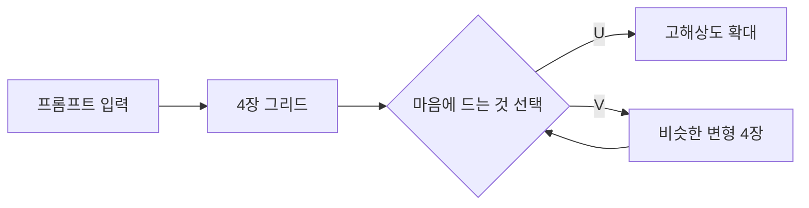

# 플랫폼별 가입과 첫 이미지 만들기

> 네 도구에 가입하고, 각각에서 첫 이미지를 직접 만들어보는 실습 세션입니다.

## 개요

이론은 충분합니다. 이제 직접 해볼 차례예요. ChatGPT, Gemini, Midjourney, Adobe Firefly — 네 플랫폼에 가입하고, 각각에서 첫 이미지를 만들어봅니다.

**학습 목표**:
- 네 플랫폼에 가입 완료하고 이미지 생성이 되는 상태를 만든다
- 각 도구의 화면 구성과 기본 사용법을 익힌다
- 같은 프롬프트를 넣었을 때 결과 차이를 직접 체감한다

## 시작 전략 — 어디부터?

| 플랫폼 | 무료? | 가입 난이도 | 추천 시작 |
|--------|------|-----------|----------|
| **ChatGPT** | 무료 (월 40장) | 매우 쉬움 | Google 계정으로 바로 |
| **Gemini** | 무료 (일 100장) | 매우 쉬움 | Google 계정만 있으면 끝 |
| **Midjourney** | 유료만 ($10/월~) | 보통 | 결제 필요 |
| **Firefly** | CC 구독자 무료 | 보통 | Adobe ID 필요 |

> 💡 **팁**: 처음이라면 ChatGPT 무료 + Gemini 무료 조합으로 시작하세요. 비용 없이 두 도구를 비교해볼 수 있어요.

## 플랫폼별 가입 + 첫 이미지 튜토리얼

### 1. ChatGPT — 대화창이 곧 캔버스

**가입 (1분)**
1. **chatgpt.com** 방문
2. Sign up → Google, Apple, Microsoft 계정으로 간편 가입
3. 가입 즉시 이미지 생성 가능 — 별도 설정 없음

**첫 이미지 만들기**

프롬프트 입력창에 그대로 입력해보세요:

> "빈티지 스타일의 커피잔 일러스트를 그려줘"

몇 초 안에 이미지가 대화창에 나타납니다.

**수정해보기 (이게 ChatGPT의 핵심!)**

이어서 이렇게 말해보세요:
> "배경을 연한 핑크색으로 바꿔줘"

ChatGPT가 이전 이미지를 **기억하면서** 배경만 바꿔줍니다. 다시:
> "커피잔에 'GOOD MORNING' 글씨를 넣어줘"

이미지 속에 글자가 깔끔하게 들어가는 걸 확인할 수 있어요. 이 **대화형 수정**이 ChatGPT만의 최대 강점입니다.

**화면 구성:**
- 하단: 프롬프트 입력창
- 중앙: 대화 + 이미지 결과
- 이미지 클릭 → Select 도구로 특정 영역만 수정 가능
- 이미지 하단 → 다운로드 버튼

### 2. Gemini — Google 계정만 있으면 끝

**가입 (30초)**
1. **gemini.google.com** 방문
2. Google 계정으로 로그인 — 끝!

**첫 이미지 만들기**

> "수채화 스타일의 서울 남산타워 풍경을 그려줘"

Gemini는 한 번에 **여러 변형**을 카드 형태로 보여줍니다. ChatGPT가 1장을 보여주는 것과 다르죠.

**화면 구성:**
- 하단: 프롬프트 입력창
- 중앙: 이미지 결과 카드 (여러 변형)
- 이미지 탭 → 편집 옵션

> ⚠️ **참고**: Gemini는 인물 이미지에 대한 안전 필터가 꽤 엄격해요. 특정 스타일의 인물 생성이 거부될 수 있지만, 디자인 작업에서는 크게 문제 없습니다.

### 3. Midjourney — 예술적 퀄리티의 끝판왕

**가입 (3분)**
1. **midjourney.com** 방문
2. Sign In → Google 또는 Discord 계정으로 로그인
3. 구독 플랜 선택 (Basic $10/월 추천)
4. 결제 완료 → 바로 사용 가능

> ⚠️ **참고**: 무료 체험이 없어요. 하지만 Basic $10/월이면 약 200장 생성 가능하니 시작하기에 충분합니다.

**첫 이미지 만들기**

Create 탭에서 입력:
> "minimalist logo design, geometric shapes, blue and gold"

약 30~60초 후 **4장의 이미지가 그리드**로 나타납니다.

**핵심 버튼 — U와 V**
마음에 드는 이미지에 마우스를 올리면:
- **U (Upscale)**: 고해상도로 확대
- **V (Variation)**: 비슷하지만 약간 다른 변형 생성

이 U/V 시스템이 Midjourney의 기본 워크플로우예요. "4장 중 고르고 → 발전시키고 → 또 고르고"를 반복합니다.

**화면 구성:**
- **Create**: 프롬프트 입력 + 이미지 생성
- **Explore**: 다른 사용자들의 인기 이미지 + 프롬프트 확인 (프롬프트 공부에 최고!)
- **Organize**: 내 이미지 히스토리
- **Editor**: 이미지 편집 (부분 수정, 확장)

> 💡 **강력 추천**: 가입 후 **Explore 탭에서 30분** 구경하세요. 다른 사람들이 어떤 프롬프트로 어떤 결과를 얻었는지 보는 것만으로도 엄청난 공부가 됩니다.

### 4. Adobe Firefly — 포토샵 유저라면 바로 시작

**가입 (2분)**
1. **firefly.adobe.com** 방문
2. Adobe ID로 로그인 (없으면 무료 생성)
3. Creative Cloud 구독 중이면 크레딧 이미 포함

**첫 이미지 만들기**

Text to Image에서 입력:
> "modern office interior, natural lighting, minimalist furniture"

4장의 결과가 나타납니다. 여기서 핵심은 **오른쪽 스타일 패널**이에요.

**스타일 패널 체험하기**
- Content Type을 **Photo → Art**로 바꿔보세요 — 같은 프롬프트인데 완전히 다른 느낌!
- 색감, 조명, 질감 등을 슬라이더로 직접 조절 가능
- Style Reference에 아무 이미지나 업로드하면 그 분위기로 새 이미지가 생성됨

다른 도구들은 프롬프트 텍스트로만 스타일을 조절하지만, Firefly는 **눈으로 보면서 슬라이더로** 조절할 수 있어서 디자이너에게 특히 직관적이에요.

## 실습: 4 플랫폼 비교 실험

### 활동 1: 가입 체크리스트

- [ ] ChatGPT 가입 + 첫 이미지 생성 완료
- [ ] Gemini 로그인 + 첫 이미지 생성 완료
- [ ] Midjourney 가입 + 결제 + 첫 이미지 생성 완료
- [ ] Firefly 로그인 + 첫 이미지 생성 완료

### 활동 2: 같은 프롬프트, 네 플랫폼 비교

아래 프롬프트를 네 플랫폼 모두에 넣어보세요:

> "A cozy bookshop interior with warm lighting, wooden shelves filled with colorful books, a cat sleeping on the counter, watercolor style"

결과를 비교하면서 표를 채워보세요:

| 비교 항목 | ChatGPT | Gemini | Midjourney | Firefly |
|-----------|---------|--------|------------|---------|
| 전반적 느낌 (1~5점) | | | | |
| 프롬프트 얼마나 잘 따랐나 | | | | |
| 고양이가 잘 그려졌나 | | | | |
| 색감·분위기 | | | | |
| 생성 속도 체감 | | | | |

> 💡 이 비교 결과를 저장해두세요. 다음 세션에서 "어떤 상황에 어떤 도구를 쓸지" 판단할 때 참고 자료가 됩니다.

## 팁과 주의사항

> 🔥 **실무 팁**: 여러 플랫폼을 번갈아 쓸 때 **프롬프트를 메모 앱에 기록**해두세요. 어떤 플랫폼에서 어떤 프롬프트가 잘 먹혔는지 기록을 쌓으면, 나중에 작업할 때 시간을 크게 아낄 수 있어요.

> ⚠️ **흔한 오해**: "무료 플랜은 품질이 떨어진다" — 아닙니다. ChatGPT, Gemini 무료 플랜은 유료와 **같은 AI**를 씁니다. 차이는 생성 횟수 제한뿐이에요.

> 💡 **Midjourney Explore 활용법**: 마음에 드는 이미지를 클릭하면 해당 프롬프트를 그대로 볼 수 있어요. 프롬프트 작성법을 배우는 최고의 방법이니 꼭 둘러보세요.

## 핵심 정리

| 플랫폼 | 가입 | 핵심 특징 |
|--------|------|----------|
| **ChatGPT** | chatgpt.com, 간편 가입 | 대화로 수정, 글자 정확 |
| **Gemini** | Google 계정으로 바로 | 무료, 빠름, 여러 변형 |
| **Midjourney** | midjourney.com, 유료 | 4장 그리드 → U/V 시스템, Explore 갤러리 |
| **Firefly** | Adobe ID | 스타일 패널 조절, 포토샵 연동 |

## 다음 세션 미리보기

네 도구를 다 써봤으니, 다음 세션에서는 **"이 프로젝트에는 어떤 도구를 쓸까?"**에 대한 판단 기준을 정리합니다. SNS 콘텐츠, 제품 목업, 프레젠테이션, 브랜딩 — 실무 상황별 최적의 도구 조합 전략을 배울 거예요.
