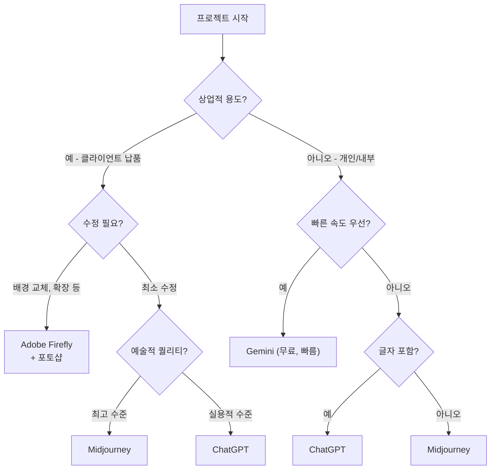
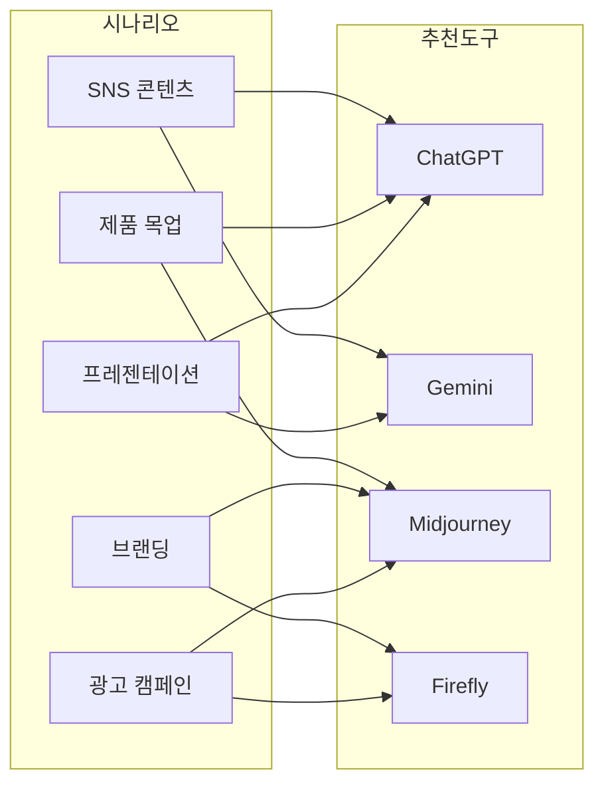
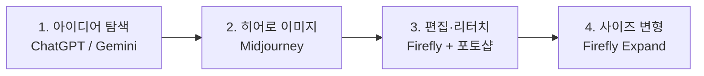
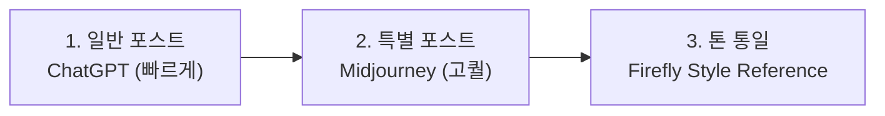
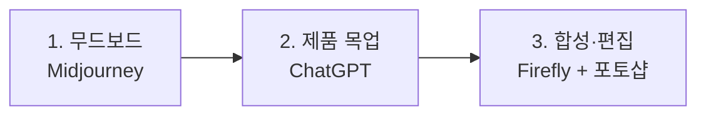
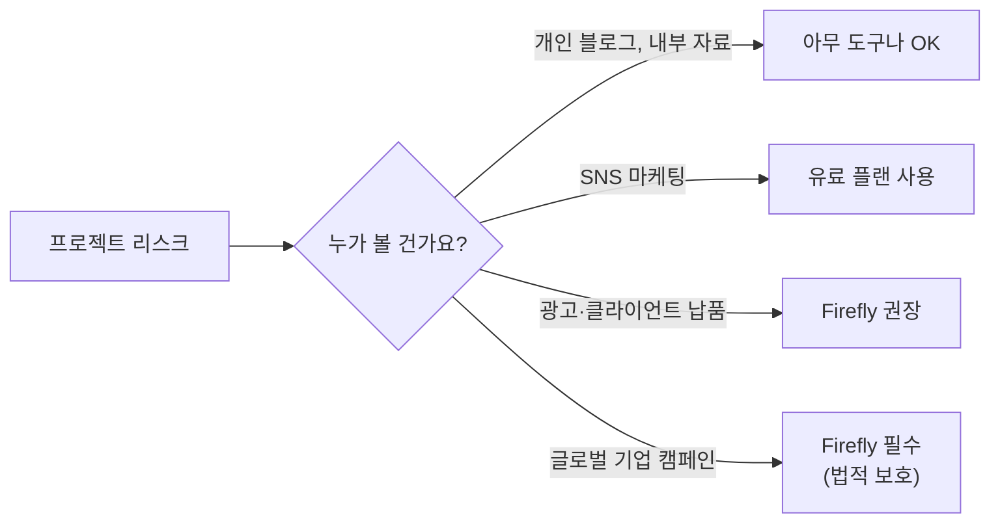

# 실무 시나리오별 — 어떤 도구를 쓸까?

> "인스타 이미지 10장 필요해요", "발표 자료 비주얼 만들어주세요" — 상황별 최적의 도구 조합 전략

## 개요

네 가지 도구를 다 써봤으니, 마지막 퍼즐을 맞출 차례입니다. **"이 프로젝트에는 뭘 써야 하지?"**에 자신 있게 답할 수 있는 판단 기준을 만들어볼게요.

**학습 목표**:
- 프로젝트 상황에 따라 최적의 도구를 선택할 수 있다
- 여러 도구를 단계별로 조합하는 워크플로우를 설계할 수 있다
- 예산과 저작권 같은 실무 제약을 고려할 수 있다

## 핵심 내용

### 1. 도구 선택의 5가지 기준

어떤 도구를 쓸지 결정할 때 이 다섯 가지만 따져보세요:

| 기준 | 질문 | 예시 |
|------|------|------|
| **품질** | 최종 결과물? 초안? | 인쇄용 포스터 vs 내부 브레인스토밍 |
| **속도·물량** | 빠르게 많이? 천천히 정교하게? | SNS 10장 vs 히어로 배너 1장 |
| **저작권** | 상업 프로젝트? 개인 사용? | 클라이언트 광고 vs 개인 블로그 |
| **수정 필요도** | 글자 삽입? 배경 교체? | 포스터 텍스트 vs 그냥 분위기 이미지 |
| **예산** | 무료? 유료? | 학생 프로젝트 vs 기업 캠페인 |

### 2. 실무 시나리오별 추천

**시나리오 1: SNS 콘텐츠 (인스타그램, 블로그 등)**

속도와 물량이 관건. 매주 여러 장 빠르게 만들어야 해요.

| 순위 | 도구 | 이유 |
|------|------|------|
| 1순위 | **ChatGPT** | 대화로 빠르게 수정, 카드뉴스 글자 삽입 |
| 2순위 | **Gemini** | 무료, 빠르게 시안 대량 생성 |
| 특별 포스트 | **Midjourney** | 피드의 "눈에 띄는" 이미지에 활용 |

> **프롬프트 예시 (ChatGPT)**
> "카페 프로모션 인스타그램 포스트, 따뜻한 톤, 라떼 아트 클로즈업, 'MORNING SPECIAL' 텍스트를 상단에 배치"

> **프롬프트 예시 (Midjourney)**
> "overhead shot of a cafe table with latte art and croissant, warm golden light, magazine style photography --ar 4:5 --stylize 200"

**시나리오 2: 제품 목업·컨셉 시각화**

"이런 느낌이에요"를 클라이언트에게 보여줄 때.

| 순위 | 도구 | 이유 |
|------|------|------|
| 1순위 | **ChatGPT** | 구체적인 장면 묘사를 자연어로 설명 |
| 2순위 | **Midjourney** | 사진 같은 제품 이미지, 조명·질감 표현 |
| 편집 | **Firefly** | 실제 제품 사진 배경 교체, 확장 |

> **프롬프트 예시 (ChatGPT)**
> "대리석 카운터 위에 놓인 미니멀한 스킨케어 병, 주변에 유칼립투스 잎, 자연광, 깨끗한 흰 배경"

> **프롬프트 예시 (Midjourney)**
> "skincare bottle on marble counter, eucalyptus leaves, natural window light, editorial product photography, clean minimal --ar 3:4"

**시나리오 3: 프레젠테이션 비주얼**

발표 자료에 넣을 개념 이미지, 분위기 사진.

| 순위 | 도구 | 이유 |
|------|------|------|
| 1순위 | **ChatGPT** | 비유적 이미지를 잘 이해, 수정 편리 |
| 2순위 | **Gemini** | 빠르게 여러 시안 비교 |
| 배경 이미지 | **Midjourney** | 임팩트 있는 전체 화면 슬라이드용 |

> **프롬프트 예시 (ChatGPT)**
> "팀워크를 상징하는 이미지, 여러 색상의 실이 하나로 모여 튼튼한 밧줄이 되는 모습, 미니멀 일러스트 스타일"

**시나리오 4: 브랜딩 에셋 (로고 컨셉, 무드보드)**

브랜드 아이덴티티와 직결. 품질과 저작권이 최우선.

| 순위 | 도구 | 이유 |
|------|------|------|
| 1순위 | **Firefly** | 저작권 안전, 스타일 참조로 톤 통일 |
| 2순위 | **Midjourney** | 무드보드 생성, 미학적 품질 최고 |
| 아이디어 | **ChatGPT** | 초기 방향 탐색, 빠른 스케치 |

> **프롬프트 예시 (Midjourney)**
> "brand moodboard for luxury skincare, soft pink and gold palette, marble textures, editorial photography style, elegant minimal --ar 16:9"

**시나리오 5: 광고 캠페인**

저작권 리스크가 가장 높은 영역.

| 순위 | 도구 | 이유 |
|------|------|------|
| 필수 | **Firefly** | 저작권 보호 (기업용 플랜은 법적 보호) |
| 히어로 이미지 | **Midjourney** | 미학적 완성도 |
| 카피 삽입 | **ChatGPT** | 광고 카피가 들어간 이미지 |

### 3. 여러 도구를 조합하는 워크플로우

실무에서는 하나의 도구로 끝나는 경우가 드물어요. **단계별로 가장 잘하는 도구를 연결**하면 훨씬 좋은 결과가 나옵니다.

**패턴 A: 브랜드 캠페인**

**패턴 B: SNS 대량 생산**

**패턴 C: 제품 프레젠테이션**

### 4. 예산별 전략

| 예산 | 추천 조합 |
|------|----------|
| **0원** | Gemini 무료 + ChatGPT 무료 |
| **$10~20/월** | ChatGPT Plus ($20) 또는 Midjourney Basic ($10) |
| **$30 이상/월** | ChatGPT Plus + Midjourney 조합 |
| **기업 예산** | 위 + Firefly (저작권 보호) |

> 💡 **팁**: 처음에는 무료로 다 써보고, "이 도구 한도가 매번 부족해"라고 느낄 때가 유료 전환 타이밍입니다.

### 5. 저작권 — 실무에서 꼭 알아야 할 것

| 플랫폼 | 상업 사용 | 핵심 조건 | 법적 보호 |
|--------|----------|----------|----------|
| ChatGPT | 무료/유료 모두 가능 | OpenAI 약관 준수 | 없음 |
| Gemini | 가능 | Google 약관 준수 | 없음 |
| Midjourney | **유료만** 가능 | 매출 $1M 이상은 Pro 필수 | 없음 |
| Firefly | 가능 | Adobe Stock 기반 | **기업 플랜은 법적 보호** |

## 실습: 직접 적용해보기

### 활동 1: 내 프로젝트에 매칭하기

최근에 했거나 곧 할 프로젝트 3개를 적고, 5가지 기준으로 도구를 선택해보세요:

| 항목 | 프로젝트 1 | 프로젝트 2 | 프로젝트 3 |
|------|-----------|-----------|-----------|
| 프로젝트명 | (예: 카페 SNS) | | |
| 품질 | (높음/중간/낮음) | | |
| 속도·물량 | | | |
| 저작권 중요도 | | | |
| 수정 필요도 | | | |
| 예산 | | | |
| **선택 도구** | | | |
| **이유** | | | |

### 활동 2: 케이스 스터디

**케이스 A: 대학 동아리 축제 홍보**
- 인스타 포스트 5장 + 포스터 1장
- 예산 0원, 다음 주까지
- 포스터에 텍스트 필요
- → 어떤 도구 조합을 쓰시겠어요?

**케이스 B: 뷰티 브랜드 인스타 리브랜딩**
- 3개월간 주 3회 포스팅 (총 36장)
- 무드보드 1세트, 대표 이미지 1장
- 월 $50, 광고에도 사용 예정
- → 어떤 도구 조합과 워크플로우를 설계하시겠어요?

> 💡 **힌트**: 가장 제약이 강한 조건 1~2가지를 먼저 찾으세요. 케이스 A에서는 "예산 0원", 케이스 B에서는 "광고 사용 (저작권)"이 핵심 제약입니다.

### 활동 3: 멀티 도구 워크플로우 설계

**시나리오**: 프리랜서 디자이너. 로컬 베이커리에서 요청:
- 인스타 피드용 이미지 8장
- 매장 포스터 1장 (텍스트 포함)
- 브랜드 무드보드 1세트
- 예산: 월 $20 이내

1. 각 산출물에 어떤 도구를 배정하시겠어요?
2. 작업 순서는?
3. $20으로 어떤 구독 조합을 선택하시겠어요?

## 팁과 주의사항

> 🔥 **실무 팁**: 클라이언트에게 시안을 보여줄 때, **2~3개 도구의 결과를 섞어서** 제시하세요. 도구마다 해석이 달라서 클라이언트가 원하는 방향을 더 정확히 파악할 수 있어요.

> 🔥 **실무 팁**: 같은 프롬프트라도 도구별로 **스타일을 조정**하세요. ChatGPT는 자연어 문장형("따뜻한 오후 빛이 드는 카페 테이블 위 라떼"), Midjourney는 키워드 나열형("cafe latte, warm light, wooden table --ar 4:5")이 더 잘 먹힙니다.

> ⚠️ **흔한 오해**: "비싼 도구가 항상 더 좋다" — 아닙니다. Gemini 무료로 만든 시안이 특정 프로젝트에서는 Midjourney Pro보다 더 적합할 수 있어요. 핵심은 가격이 아니라 **프로젝트와의 궁합**입니다.

## 핵심 정리

| 개념 | 설명 |
|------|------|
| **5가지 선택 기준** | 품질, 속도·물량, 저작권, 수정 필요도, 예산 |
| **ChatGPT 최적** | 글자 포함 이미지, 대화형 수정, 빠른 아이디어 탐색 |
| **Gemini 최적** | 무료 대량 시안, 빠른 프로토타이핑 |
| **Midjourney 최적** | 미학적 최고 퀄리티, 무드보드, 히어로 이미지 |
| **Firefly 최적** | 저작권 안전, 기존 이미지 편집, 사이즈 변형 |
| **멀티 도구 워크플로우** | 탐색 → 생성 → 편집 → 완성, 단계별 최적 도구 조합 |

## 다음 챕터 미리보기

Ch1에서 AI 이미지 생성의 기본과 도구 선택법을 모두 다뤘습니다. 다음 챕터 [Ch2. 프롬프트 구조 마스터](02-ch2-프롬프트-구조-마스터/01-01-프롬프트-해부학-6요소-프레임워크.md)에서는 좋은 이미지를 만드는 프롬프트의 구조를 해부하고, 주제·스타일·구도·조명·매체·분위기라는 핵심 요소를 하나씩 익힙니다.
