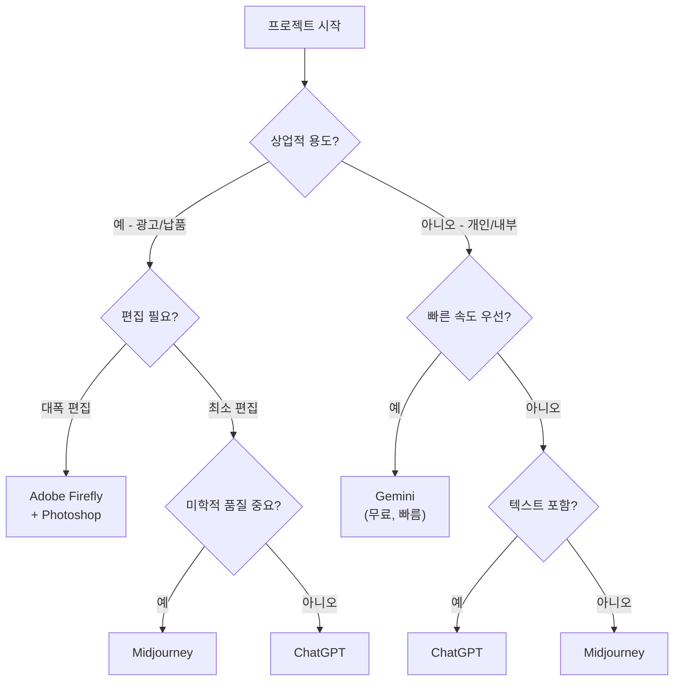
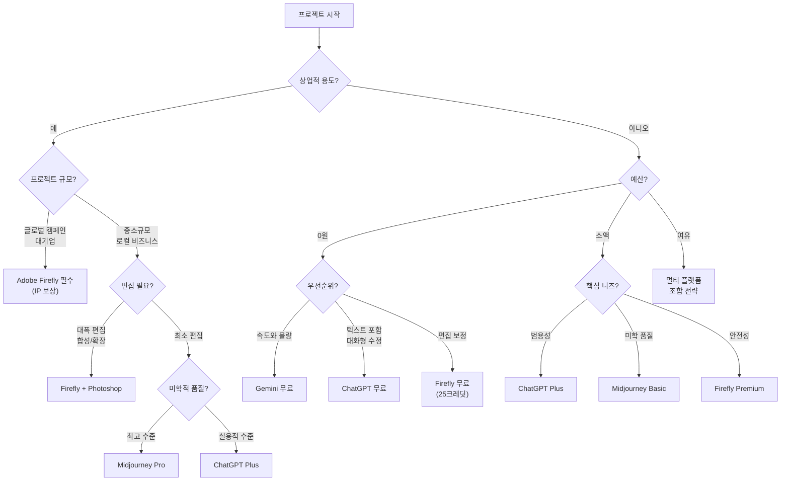
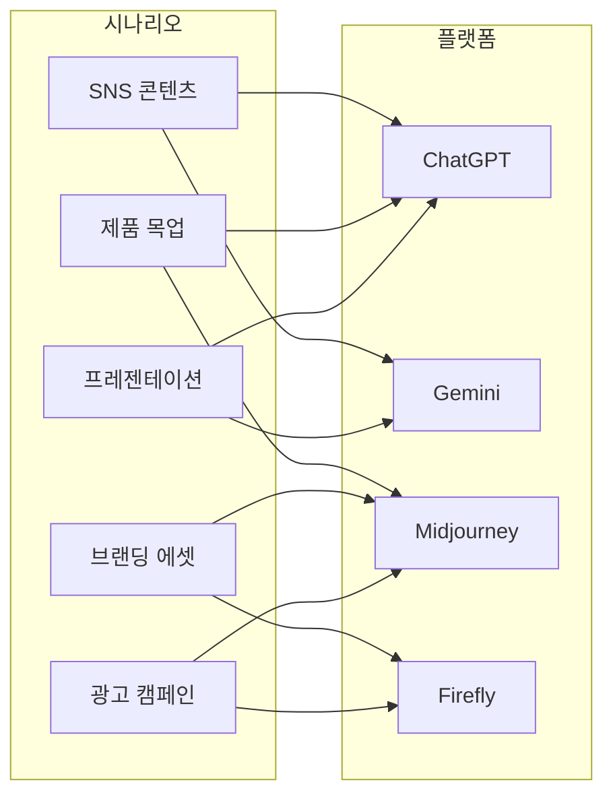
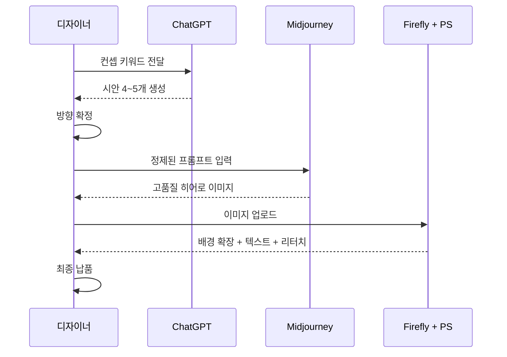
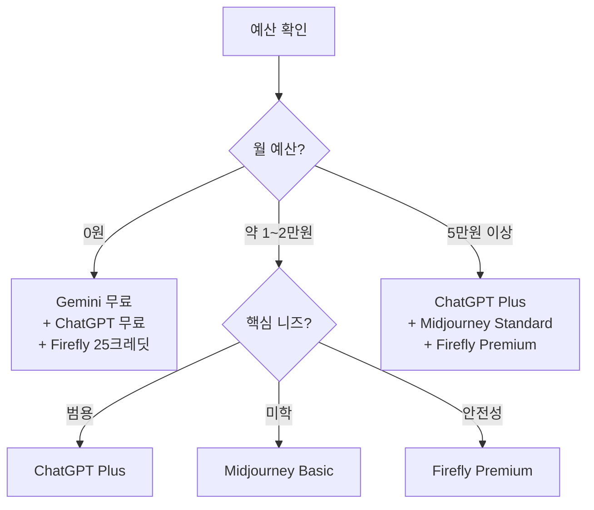
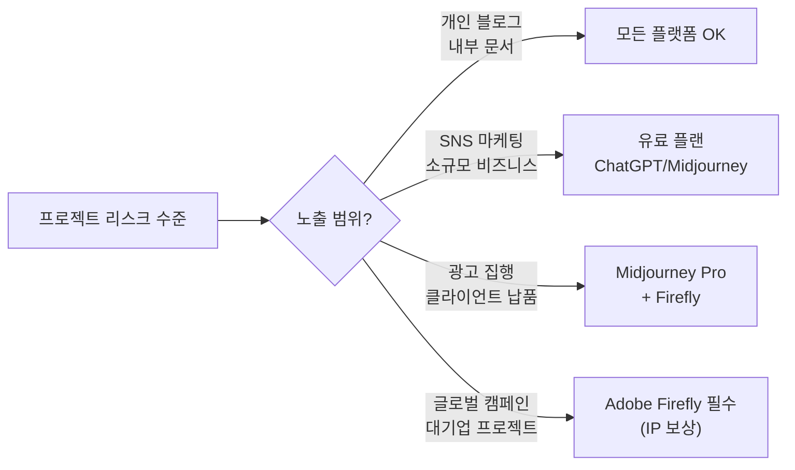

# 실무 시나리오별 플랫폼 선택 가이드

> SNS 콘텐츠, 제품 목업, 프레젠테이션 비주얼, 브랜딩 에셋 등 실무 상황별 최적 플랫폼 조합 전략

## 개요

이전 섹션까지 우리는 네 가지 AI 이미지 생성 플랫폼—ChatGPT, Gemini, Midjourney, Adobe Firefly—의 특성을 하나씩 살펴보고, 직접 계정을 만들어 인터페이스를 탐색해보았습니다. 이제 마지막 퍼즐 조각을 맞출 차례입니다. **"그래서 이 프로젝트에는 뭘 써야 하지?"**라는 질문에 자신 있게 답할 수 있는 의사결정 프레임워크를 만들어 보겠습니다.

**선수 지식**: [주요 플랫폼 비교](01-ch1-ai-이미지-생성-개론/02-02-주요-플랫폼-비교-chatgpt-vs-gemini-vs-midjourney.md)에서 배운 플랫폼별 강점과 [Adobe Firefly와 크리에이티브 생태계](01-ch1-ai-이미지-생성-개론/03-03-adobe-firefly와-크리에이티브-생태계.md)에서 배운 상업적 안전성 개념, [플랫폼별 계정 설정과 인터페이스 탐색](01-ch1-ai-이미지-생성-개론/04-04-플랫폼별-계정-설정과-인터페이스-탐색.md)에서 익힌 기본 인터페이스 사용법

**학습 목표**:
- 프로젝트 유형(SNS, 브랜딩, 목업, 프레젠테이션 등)에 따라 최적의 플랫폼을 선택할 수 있다
- 하나의 프로젝트에서 여러 플랫폼을 조합하는 멀티 플랫폼 워크플로우를 설계할 수 있다
- 예산, 일정, 상업적 안전성 등 실무 제약 조건을 플랫폼 선택에 반영할 수 있다

## 왜 알아야 할까?

실무에서 디자이너가 가장 많이 받는 요청을 생각해보세요. "인스타그램 피드용 이미지 10장 필요해요", "다음 주 발표에 넣을 비주얼 만들어주세요", "신제품 목업 빨리 만들어볼 수 있어요?" 이런 요청들은 모두 **목적이 다르고, 요구하는 품질과 속도가 다릅니다**.

네 가지 도구를 모두 가지고 있어도, 어떤 상황에 어떤 도구를 꺼내야 하는지 모르면 시간만 낭비하게 되죠. 마치 요리사가 칼을 여러 자루 가지고 있어도, 생선 손질에 빵칼을 쓰면 결과가 좋지 않은 것처럼요. AI 이미지 생성도 마찬가지입니다. **올바른 도구 선택이 작업 효율과 결과물 품질을 동시에 결정합니다.**

2026년 현재, AI 이미지 생성 도구의 경쟁이 치열해지면서 각 플랫폼의 특화 영역이 더욱 뚜렷해졌습니다. 하나의 플랫폼만으로 모든 실무 시나리오를 커버하기는 어렵고, **여러 플랫폼을 전략적으로 조합하는 능력**이 디자이너의 핵심 경쟁력이 되었습니다.

## 핵심 개념

### 개념 1: 플랫폼 선택 의사결정 프레임워크

> 💡 **비유**: 여행 가방 싸기를 떠올려보세요. 하와이 리조트 여행과 유럽 배낭여행에 같은 가방을 쌀 수는 없죠. 목적지(프로젝트 목표), 기간(일정), 예산, 그리고 현지 날씨(클라이언트 요구사항)에 따라 짐이 달라지듯, AI 플랫폼 선택도 프로젝트의 맥락에 따라 달라져야 합니다.

플랫폼 선택에서 고려해야 할 핵심 기준은 다섯 가지입니다.

| 기준 | 설명 | 예시 |
|------|------|------|
| **품질 요구 수준** | 최종 산출물인가, 초안/참고용인가 | 인쇄용 포스터 vs 내부 브레인스토밍 |
| **속도/물량** | 빠르게 많이 vs 천천히 정교하게 | SNS 캘린더 10장 vs 히어로 배너 1장 |
| **상업적 안전성** | 광고 집행, 클라이언트 납품 여부 | 개인 블로그 vs 글로벌 광고 캠페인 |
| **편집 필요도** | 생성 후 수정이 얼마나 필요한가 | 텍스트 삽입, 배경 교체, 부분 수정 |
| **예산** | 무료 범위 내 vs 유료 구독 가능 | 개인 프로젝트 vs 기업 프로젝트 |

> 📊 **그림 1**: 플랫폼 선택 의사결정 플로우 — 상업적 용도 경로

상업적 경로와 비상업적 경로를 나눈 다음에는, 각 분기에서 **세부 조건**을 따져야 합니다. 특히 상업적 프로젝트에서는 편집 필요도와 리스크 수준이 추가 분기 기준이 되죠. 아래 플로우차트에서 예산과 프로젝트 규모까지 고려한 전체 의사결정 경로를 확인해보세요.

> 📊 **그림 2**: 플랫폼 선택 의사결정 플로우 — 전체 경로 (예산 + 규모 포함)

이 플로우차트가 절대적인 규칙은 아닙니다. 하지만 처음 플랫폼을 선택할 때 출발점으로 삼기에 좋죠. 경험이 쌓이면 여러분만의 의사결정 기준이 생길 겁니다.

### 개념 2: 시나리오별 최적 플랫폼 매칭

> 💡 **비유**: 음식점에서 코스 요리를 주문하면, 전채부터 디저트까지 각각 다른 셰프가 가장 잘하는 요리를 담당하죠. 디자인 프로젝트도 마찬가지로, 각 단계에서 가장 잘하는 플랫폼에게 맡기는 것이 최고의 결과를 만듭니다.

실무에서 가장 자주 만나는 시나리오를 하나씩 살펴보겠습니다.

**시나리오 1: SNS 콘텐츠 제작 (인스타그램, 블로그 썸네일 등)**

SNS 콘텐츠는 **속도와 물량**이 관건입니다. 매주 3~5개의 새로운 비주얼이 필요하고, 트렌드에 맞춰 빠르게 대응해야 하죠.

- **1순위: ChatGPT** — 대화형으로 "이 느낌인데 색감만 바꿔줘"라고 하면 즉시 변형 가능. 텍스트가 들어간 카드뉴스에도 강합니다.
- **2순위: Gemini** — 무료 티어에서도 이미지 생성이 가능하고, 속도가 빨라 아이디어 시안을 대량으로 뽑아볼 때 유리합니다.
- **보조: Midjourney** — 브랜드 피드의 "히어로 이미지"처럼 특별히 눈에 띄어야 하는 포스트에 활용.

**시나리오 2: 제품 목업 및 컨셉 시각화**

신제품 기획 단계에서 "이런 느낌이에요"를 보여주는 비주얼이 필요할 때입니다.

- **1순위: ChatGPT** — "대리석 카운터 위에 미니멀한 스킨케어 병"처럼 구체적인 장면 묘사를 자연어로 설명하면 빠르게 시안을 볼 수 있습니다.
- **2순위: Midjourney** — 하이퍼리얼리즘 스타일의 제품 사진이 필요할 때. 조명과 질감 표현이 뛰어납니다.
- **보조: Adobe Firefly** — 실제 제품 사진이 있다면 Generative Fill로 배경을 교체하거나 장면을 확장하는 편집에 최적.

**시나리오 3: 프레젠테이션 비주얼**

발표 자료에 들어갈 개념 다이어그램, 비유 이미지, 분위기 사진 등이 필요합니다.

- **1순위: ChatGPT** — "양파 구조처럼 겹겹이 쌓인 보안 레이어"같은 비유적 이미지를 가장 잘 이해합니다. 대화형으로 수정하기도 편하죠.
- **2순위: Gemini** — 빠른 속도로 다양한 시안을 만들어 비교해볼 수 있습니다.
- **보조: Midjourney** — 키노트의 전체 화면 배경 이미지처럼 임팩트가 필요한 슬라이드용.

**시나리오 4: 브랜딩 에셋 (로고 컨셉, 패턴, 컬러 팔레트 영감)**

브랜드 아이덴티티와 직결되는 에셋은 **품질과 상업적 안전성**이 최우선입니다.

- **1순위: Adobe Firefly** — IP 보상(Indemnification)이 보장되어 상업 프로젝트에 법적으로 가장 안전합니다. 클라이언트 납품용에 필수.
- **2순위: Midjourney** — 비주얼 무드보드, 스타일 탐색 단계에서 미학적으로 가장 풍부한 결과를 제공합니다. Pro 이상 플랜의 Stealth Mode로 비공개 작업 가능.
- **보조: ChatGPT** — 로고 컨셉 초기 아이디에이션 단계에서 빠른 탐색용.

> 📊 **그림 3**: 실무 시나리오별 플랫폼 매칭 맵

> ⚠️ **흔한 오해**: "Midjourney가 가장 예쁘니까 모든 프로젝트에 Midjourney를 쓰면 되지 않나요?" 미학적 품질은 Midjourney가 뛰어나지만, 텍스트 포함 이미지에서는 ChatGPT가, 빠른 반복 작업에서는 Gemini가, 상업적 안전성에서는 Firefly가 더 낫습니다. **최고의 도구는 상황에 따라 달라집니다.**

### 개념 3: 멀티 플랫폼 워크플로우 설계

> 💡 **비유**: 영화 제작을 떠올려보세요. 각본가가 이야기를 쓰고, 촬영감독이 장면을 만들고, 편집자가 완성합니다. 한 사람이 다 하는 것보다 각 분야 전문가가 협업할 때 더 좋은 영화가 나오죠. AI 플랫폼도 마찬가지로, 각 단계에 맞는 도구를 연결하면 혼자서는 불가능한 품질을 만들 수 있습니다.

실무 프로젝트는 하나의 플랫폼으로 끝나는 경우가 드뭅니다. 대부분 **"탐색 → 생성 → 편집 → 완성"**의 단계를 거치는데, 각 단계에 최적화된 플랫폼이 다릅니다.

**워크플로우 패턴 A: 브랜드 캠페인 비주얼**

1. **아이디에이션** (ChatGPT / Gemini) → 다양한 컨셉 빠르게 탐색
2. **히어로 이미지 생성** (Midjourney) → 최종 비주얼 수준의 고품질 이미지
3. **편집 및 리터치** (Firefly + Photoshop) → 텍스트 오버레이, 배경 확장, 브랜드 가이드라인 적용
4. **사이즈 변형** (Firefly) → Generative Expand로 다양한 포맷(정사각형, 와이드, 세로형) 제작

> 📊 **그림 4**: 멀티 플랫폼 워크플로우 — 브랜드 캠페인

**워크플로우 패턴 B: SNS 콘텐츠 대량 생산**

1. **콘텐츠 캘린더 계획** → 주간/월간 주제 설정
2. **일반 포스트** (ChatGPT / Gemini) → 빠르게 생성, 텍스트 포함 카드뉴스
3. **특별 포스트** (Midjourney) → 브랜드 피드의 하이라이트 이미지
4. **일괄 후보정** (Firefly) → 톤 통일, 워터마크 제거, 포맷 조정

**워크플로우 패턴 C: 제품 컨셉 프레젠테이션**

1. **레퍼런스 수집** → 무드보드 키워드 정리
2. **무드보드 생성** (Midjourney) → 분위기와 스타일 방향 시각화
3. **제품 목업** (ChatGPT) → 구체적인 제품 장면 생성
4. **프레젠테이션 정리** (Firefly) → 기존 제품 사진과 AI 생성 이미지 블렌딩

### 개념 4: 예산과 제약 조건에 따른 전략

> 💡 **비유**: 자취를 시작하는 대학생과 새 집으로 이사하는 가정이 부엌을 꾸밀 때 전략이 다르죠. 대학생은 다용도 만능칼 하나로 시작하고, 가정은 용도별 칼 세트를 마련합니다. 예산에 맞는 도구 조합 전략이 필요합니다.

**제로 예산 전략 (무료만으로)**

| 플랫폼 | 무료 범위 | 활용법 |
|--------|----------|--------|
| ChatGPT | 무료 플랜 (제한적) | 아이디에이션, 텍스트 포함 이미지 |
| Gemini | 무료 이미지 생성 | 대량 시안 생성, 빠른 프로토타이핑 |
| Firefly | 월 25 크레딧 (무료) | 소량 편집 작업 |

**미니멀 예산 전략 (월 $10~20)**

하나의 유료 구독만 선택한다면?
- **초기 탐색 중이라면** → ChatGPT Plus ($20/mo): 가장 범용적, 텍스트+편집+생성 모두 가능
- **비주얼 품질이 최우선이라면** → Midjourney Basic ($10/mo): 미학적 품질 최고, 200회 생성
- **클라이언트 납품이 주 업무라면** → Firefly Premium ($10/mo): 상업적 안전성 보장

**프로 전략 (월 $50 이상)**

여러 플랫폼을 조합하여 워크플로우를 최적화합니다.

> 📊 **그림 5**: 예산별 플랫폼 조합 전략

> 🔥 **실무 팁**: 처음에는 무료 티어로 모든 플랫폼을 써보고, 가장 자주 쓰는 플랫폼 하나부터 유료로 전환하세요. "이 플랫폼 한도가 매번 부족해"라고 느낄 때가 구독할 타이밍입니다.

### 개념 5: 상업적 사용과 라이선스 전략

실무에서 AI 생성 이미지를 사용할 때, 반드시 신경 써야 할 부분이 라이선스입니다. 각 플랫폼의 상업적 사용 정책을 정리해보겠습니다.

| 플랫폼 | 상업적 사용 | 핵심 조건 | IP 보상 |
|--------|-----------|----------|---------|
| ChatGPT | 가능 (유/무료) | OpenAI 이용약관 준수 | 없음 |
| Gemini | 가능 (유/무료) | Google 이용약관 준수 | 없음 |
| Midjourney | 유료 플랜만 가능 | 매출 $1M 이상 기업은 Pro 필수 | 없음 |
| Adobe Firefly | 가능 | Adobe Stock 기반 학습 | **있음** |

여기서 눈여겨볼 것은 Adobe Firefly의 **IP Indemnification(IP 보상)**입니다. 만약 Firefly로 생성한 이미지가 저작권 분쟁에 휘말리면, Adobe가 법적 비용을 부담해준다는 뜻이죠. 글로벌 기업 프로젝트나 대형 광고 캠페인에서는 이 차이가 결정적입니다.

> 📊 **그림 6**: 프로젝트 리스크별 플랫폼 선택

## 실습: 적용해보기

### 활동 1: 나의 프로젝트에 매칭하기

아래 표에 여러분이 최근에 했거나 앞으로 하게 될 프로젝트를 3개 적고, 각각에 대해 의사결정 프레임워크를 적용해보세요.

| 항목 | 프로젝트 1 | 프로젝트 2 | 프로젝트 3 |
|------|-----------|-----------|-----------|
| 프로젝트명 | (예: 카페 SNS 운영) | | |
| 품질 요구 | (높음/중간/낮음) | | |
| 속도/물량 | (다량 빠르게/소량 정교하게) | | |
| 상업적 용도 | (예/아니오) | | |
| 편집 필요도 | (대폭/약간/거의 없음) | | |
| 예산 | (무료/소액/여유) | | |
| **선택 플랫폼** | | | |
| **이유** | | | |

### 활동 2: 케이스 스터디 워크시트 — 프레임워크 실전 적용

아래 4가지 실제 시나리오를 읽고, 5가지 의사결정 기준(품질, 속도/물량, 상업적 안전성, 편집 필요도, 예산)을 적용하여 플랫폼을 선택해보세요. 정답은 하나가 아닙니다 — **근거가 논리적이면 모두 좋은 답**입니다.

**케이스 A: 대학 동아리 축제 홍보**

상황: 대학 영화 동아리에서 가을 축제 단편영화 상영회를 홍보하려 합니다. 인스타그램 포스트 5장, 학교 게시판 포스터 1장이 필요합니다. 예산은 0원이고, 다음 주까지 완성해야 합니다.

| 기준 | 분석 | 여러분의 판단 |
|------|------|-------------|
| 품질 요구 | 포스터는 중간, SNS는 낮음~중간 | |
| 속도/물량 | 6장을 1주 내에 | |
| 상업적 안전성 | 비상업 (동아리 홍보) | |
| 편집 필요도 | 포스터에 텍스트 삽입 필요 | |
| 예산 | 0원 | |
| **선택 플랫폼** | | |
| **워크플로우** | | |

**케이스 B: 스타트업 투자 피칭 덱**

상황: 푸드테크 스타트업에서 시리즈 A 투자 유치를 위한 피칭 프레젠테이션을 준비 중입니다. 서비스 컨셉을 시각화할 이미지 3~4장과, "미래의 스마트 키친" 비전을 보여줄 히어로 이미지 1장이 필요합니다. ChatGPT Plus 구독 중이며, 추가 $10까지 가능합니다.

| 기준 | 분석 | 여러분의 판단 |
|------|------|-------------|
| 품질 요구 | 히어로는 높음, 컨셉 시각화는 중간 | |
| 속도/물량 | 4~5장, 2주 여유 | |
| 상업적 안전성 | 투자자 대상 (비공개 발표) | |
| 편집 필요도 | 슬라이드에 맞춘 크롭/리사이즈 | |
| 예산 | ChatGPT Plus 보유 + $10 | |
| **선택 플랫폼** | | |
| **워크플로우** | | |

**케이스 C: 뷰티 브랜드 인스타그램 리브랜딩**

상황: 국내 뷰티 브랜드가 인스타그램 피드를 새로운 비주얼 톤으로 리브랜딩하려 합니다. 3개월간 주 3회 포스팅(총 36장), 브랜드 무드보드 1세트, 프로필용 대표 이미지 1장이 필요합니다. 월 디자인 예산 $50, 이미지가 광고에도 사용될 예정입니다.

| 기준 | 분석 | 여러분의 판단 |
|------|------|-------------|
| 품질 요구 | 대표 이미지 높음, 일반 포스트 중간 | |
| 속도/물량 | 36장 + 무드보드 + 대표 이미지 | |
| 상업적 안전성 | 광고 집행 예정 — 높은 리스크 | |
| 편집 필요도 | 브랜드 톤 통일, 텍스트 오버레이 | |
| 예산 | 월 $50 | |
| **선택 플랫폼** | | |
| **워크플로우** | | |

**케이스 D: 글로벌 식음료 기업 패키지 컨셉**

상황: 다국적 식음료 기업의 신제품 패키지 디자인 초기 컨셉 탐색입니다. 최종 디자인은 별도 에이전시가 하지만, 초기 방향성을 보여줄 비주얼 컨셉 8~10장이 필요합니다. 기업 브랜드 가이드라인이 엄격하고, 법무팀이 AI 생성 이미지의 라이선스를 검토합니다. 예산 제한은 없습니다.

| 기준 | 분석 | 여러분의 판단 |
|------|------|-------------|
| 품질 요구 | 높음 (경영진 프레젠테이션용) | |
| 속도/물량 | 8~10장, 충분한 시간 | |
| 상업적 안전성 | 매우 높음 (글로벌 기업 법무 검토) | |
| 편집 필요도 | 브랜드 가이드라인 적용 필수 | |
| 예산 | 제한 없음 | |
| **선택 플랫폼** | | |
| **워크플로우** | | |

> 🔥 **실무 팁**: 각 케이스를 분석할 때, 먼저 5가지 기준 중 **가장 제약이 강한 1~2가지**를 찾으세요. 케이스 A에서는 "예산 0원"이, 케이스 D에서는 "상업적 안전성"이 가장 강한 제약입니다. 그 제약부터 풀면 나머지 선택은 자연스럽게 따라옵니다.

### 활동 3: 멀티 플랫폼 워크플로우 설계

다음 시나리오를 읽고, 어떤 워크플로우 패턴을 적용할지 설계해보세요.

**시나리오**: 당신은 프리랜서 디자이너입니다. 로컬 베이커리에서 다음을 요청했습니다.
- 인스타그램 피드용 이미지 8장 (다양한 빵 사진 스타일)
- 매장 앞 A프레임 보드용 포스터 1장 (텍스트 포함)
- 브랜드 무드보드 1세트
- 예산: 디자인 소프트웨어에 월 $20 이내

**질문**:
1. 각 산출물에 어떤 플랫폼을 배정하시겠습니까?
2. 작업 순서를 어떻게 잡으시겠습니까?
3. $20 예산으로 어떤 구독 조합을 선택하시겠습니까?

### 활동 4: 토론 — "하나만 골라야 한다면?"

만약 예산이 0원이고 오직 하나의 무료 플랫폼만 사용할 수 있다면, 어떤 플랫폼을 선택하시겠습니까? 아래 세 가지 입장에서 각각 근거를 정리해보세요.

- **ChatGPT 지지**: 가장 범용적이고 대화형 편집이 가능
- **Gemini 지지**: 완전 무료에 빠른 속도
- **Midjourney 비지지**: 무료 플랜이 없으므로 탈락 (하지만 유료로 전환한다면 어떤 시나리오에서 최우선이 되는가?)

## 더 깊이 알아보기

### AI 도구 조합의 역사 — 포토샵의 선례

사실 "여러 도구를 조합해서 최고의 결과를 만든다"는 개념은 AI 시대에 처음 등장한 게 아닙니다. 1990년대 디지털 디자인 초기에도 비슷한 일이 있었어요.

1990년 Adobe Photoshop 1.0이 출시되었을 때, 많은 디자이너가 "이 하나의 프로그램으로 모든 걸 할 수 있다"고 기대했습니다. 하지만 현실은 달랐죠. 벡터 작업은 Illustrator가, 레이아웃은 InDesign(당시 PageMaker)이, 사진 보정은 Photoshop이 더 뛰어났습니다. 결국 프로 디자이너들은 **세 가지 도구를 프로젝트 단계별로 조합**하는 워크플로우를 자연스럽게 발전시켰고, Adobe도 이를 인정하여 Creative Suite(현 Creative Cloud)라는 번들을 만들었습니다.

2026년의 AI 이미지 생성 도구도 같은 진화 경로를 따르고 있습니다. 각 플랫폼이 모든 것을 잘하려고 경쟁하지만, 결국 **특화 영역이 뚜렷해지고**, 전문가는 **여러 도구를 파이프라인으로 연결**하게 됩니다. 30년 전 Photoshop+Illustrator+PageMaker 조합이 그랬듯, ChatGPT+Midjourney+Firefly 조합이 오늘날의 표준 워크플로우가 되어가고 있는 셈이죠.

> 💡 **알고 계셨나요?**: 2025년 Adobe는 Firefly에 파트너 모델 통합을 시작했습니다. Google Imagen, Ideogram 등 외부 AI 모델을 Firefly 인터페이스 안에서 사용할 수 있게 한 것인데요, 이는 Adobe 스스로가 "하나의 도구로 모든 것을 해결하기 어렵다"는 점을 인정하고, 멀티 모델 워크플로우를 플랫폼 차원에서 지원하겠다는 전략적 판단입니다.

## 흔한 오해와 팁

> ⚠️ **흔한 오해**: "비싼 플랫폼이 항상 더 좋은 결과를 만든다." 가격과 결과물 품질이 반드시 비례하지는 않습니다. Gemini 무료 버전으로 만든 시안이 Midjourney Pro로 만든 이미지보다 특정 프로젝트에 더 적합할 수 있어요. 핵심은 가격이 아니라 **프로젝트와 플랫폼의 궁합**입니다.

> ⚠️ **흔한 오해**: "AI 생성 이미지는 상업적으로 자유롭게 쓸 수 있다." 대부분의 플랫폼이 상업적 사용을 허용하지만, 조건이 있습니다. Midjourney는 무료 체험 이미지의 상업적 사용을 금지하고, 연매출 $1M 이상 기업은 Pro/Mega 플랜이 필수입니다. 반드시 각 플랫폼의 최신 이용약관을 확인하세요.

> 💡 **알고 계셨나요?**: Midjourney V7의 Draft Mode는 일반 모드보다 10배 빠르고 비용은 절반입니다. 초기 아이디에이션 단계에서는 Draft Mode로 빠르게 탐색하고, 최종 버전만 일반 모드로 생성하면 시간과 크레딧을 크게 절약할 수 있습니다.

> 🔥 **실무 팁**: 클라이언트에게 시안을 보여줄 때, 한 플랫폼에서만 생성하지 말고 **2~3개 플랫폼의 결과를 섞어서 제시**하세요. 플랫폼마다 해석이 다르기 때문에 클라이언트가 원하는 방향을 더 정확히 파악할 수 있고, "AI 이미지는 다 비슷하다"는 편견도 깨뜨릴 수 있습니다.

> 🔥 **실무 팁**: 프롬프트를 여러 플랫폼에서 재사용할 때, 플랫폼별로 **프롬프트 스타일을 조정**하세요. ChatGPT는 자연어 문장형("따뜻한 오후 빛이 들어오는 카페 테이블 위의 라떼"), Midjourney는 키워드 나열형("cafe latte, warm afternoon light, wooden table, overhead shot --ar 4:5 --stylize 200")이 더 좋은 결과를 만듭니다. 이 내용은 [프롬프트 해부학 — 6요소 프레임워크](02-ch2-프롬프트-구조-마스터/01-01-프롬프트-해부학-6요소-프레임워크.md)에서 자세히 다룹니다.

## 핵심 정리

| 개념 | 설명 |
|------|------|
| 의사결정 프레임워크 | 품질, 속도, 상업적 안전성, 편집 필요도, 예산의 5가지 기준으로 플랫폼 선택 |
| ChatGPT 최적 시나리오 | 텍스트 포함 이미지, 대화형 반복 수정, 빠른 아이디에이션, 프레젠테이션 비주얼 |
| Gemini 최적 시나리오 | 무료 대량 시안, 빠른 프로토타이핑, Google 생태계 활용 |
| Midjourney 최적 시나리오 | 미학적 최고 품질, 무드보드, 히어로 이미지, 아트 디렉션 |
| Firefly 최적 시나리오 | 상업적 안전성 필수 프로젝트, 기존 이미지 편집, 포맷 변형 |
| 멀티 플랫폼 워크플로우 | 탐색→생성→편집→완성 단계별로 최적 플랫폼을 조합 |
| 예산 전략 | 무료 티어로 시작 → 가장 자주 쓰는 플랫폼부터 유료 전환 |
| 라이선스 전략 | 프로젝트 리스크에 따라 IP 보상 유무가 플랫폼 선택 좌우 |

## 다음 섹션 미리보기

Chapter 1에서 AI 이미지 생성의 기본 원리와 네 플랫폼의 특성, 그리고 실무에서의 선택 전략까지 모두 살펴보았습니다. 이제 본격적으로 **프롬프트 작성법**을 배울 차례입니다. 다음 챕터 [프롬프트 해부학 — 6요소 프레임워크](02-ch2-프롬프트-구조-마스터/01-01-프롬프트-해부학-6요소-프레임워크.md)에서는 좋은 이미지를 만드는 프롬프트의 구조를 해부하고, 주제·스타일·구도·조명·매체·분위기라는 6가지 요소를 체계적으로 배웁니다. 플랫폼을 선택하는 눈을 키웠다면, 이제는 플랫폼에게 **무엇을 어떻게 말할지**를 배울 차례입니다.

## 참고 자료

- [AI Image Generation Trends 2025: A New Era of Creativity](https://bulkimagegeneration.com/blog/en/tutorials/ai-image-generation-trends-2025-a-new-era-of-creativity) - 2025-2026 AI 이미지 생성 트렌드와 실무 활용 시나리오 분석
- [A Complete Guide to ChatGPT Image Generation in 2025](https://www.superhuman.ai/c/a-complete-guide-to-chatgpt-image-generation-in-2025) - ChatGPT 이미지 생성의 실무 활용법과 한계 정리
- [Best AI Image Generators in 2026: Complete Comparison Guide](https://wavespeed.ai/blog/posts/best-ai-image-generators-2026/) - 2026년 기준 주요 AI 이미지 생성 플랫폼의 품질, 가격, 기능 비교
- [Midjourney Commercial Use Rights: Complete 2026 Guide](https://terms.law/2026/01/15/midjourney-commercial-use-rights-complete-2026-guide/) - Midjourney 상업적 사용 권리와 라이선스 정책 상세 가이드
- [Adobe Firefly Review 2026: Unlimited AI Images](https://aitoolanalysis.com/adobe-firefly-review/) - Adobe Firefly 2026년 업데이트와 상업적 안전성 분석
- [Using Images & Videos Commercially — Midjourney Docs](https://docs.midjourney.com/hc/en-us/articles/27870375276557-Using-Images-Videos-Commercially) - Midjourney 공식 상업적 사용 정책

---
### 🔗 Related Sessions
- [midjourney v7](01-ch1-ai-이미지-생성-개론/02-02-주요-플랫폼-비교-chatgpt-vs-gemini-vs-midjourney.md) (prerequisite)
- [generative fill](06-ch6-이미지-편집-기법-img2img인페인팅아웃페인팅/02-02-인페인팅-기초-부분-수정의-기술.md) (prerequisite)
- [adobe firefly](01-ch1-ai-이미지-생성-개론/03-03-adobe-firefly와-크리에이티브-생태계.md) (prerequisite)
- [크레딧 시스템](01-ch1-ai-이미지-생성-개론/03-03-adobe-firefly와-크리에이티브-생태계.md) (prerequisite)
- [generative expand](01-ch1-ai-이미지-생성-개론/03-03-adobe-firefly와-크리에이티브-생태계.md) (prerequisite)
