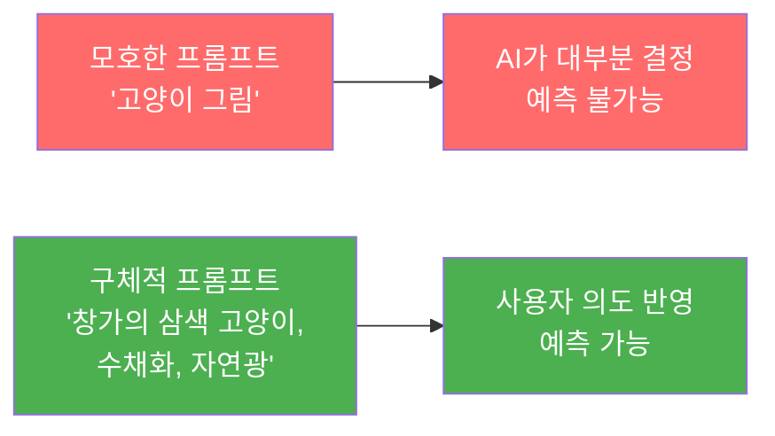
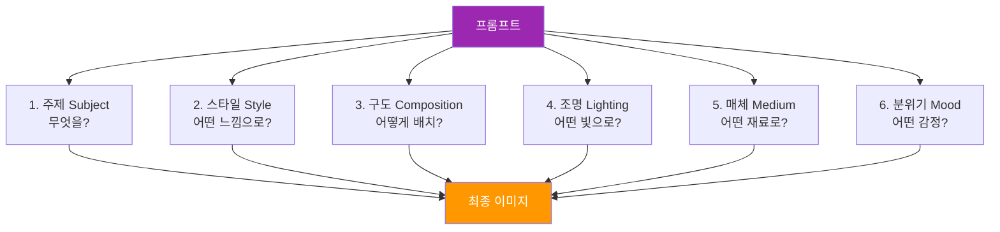
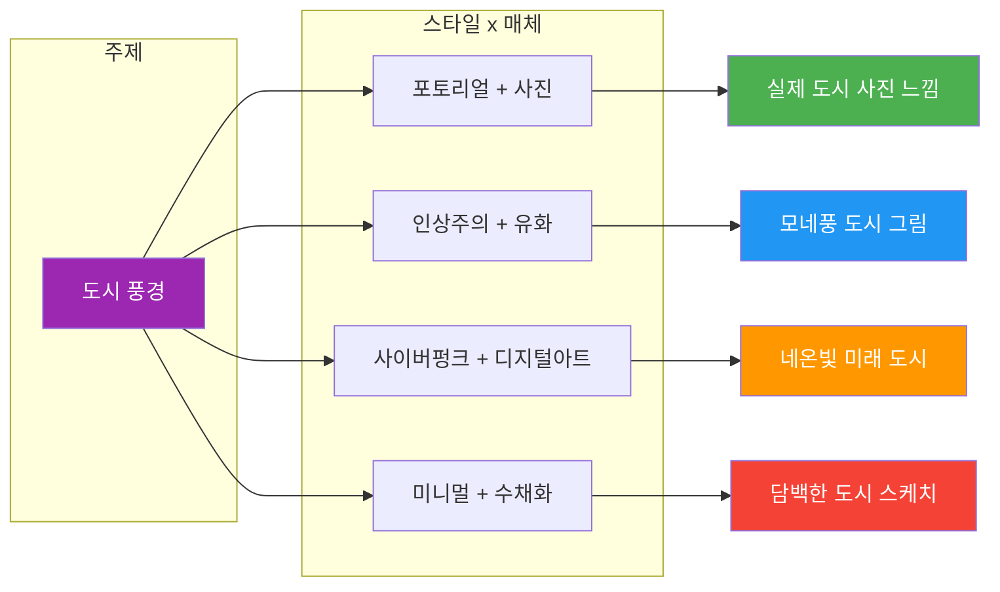
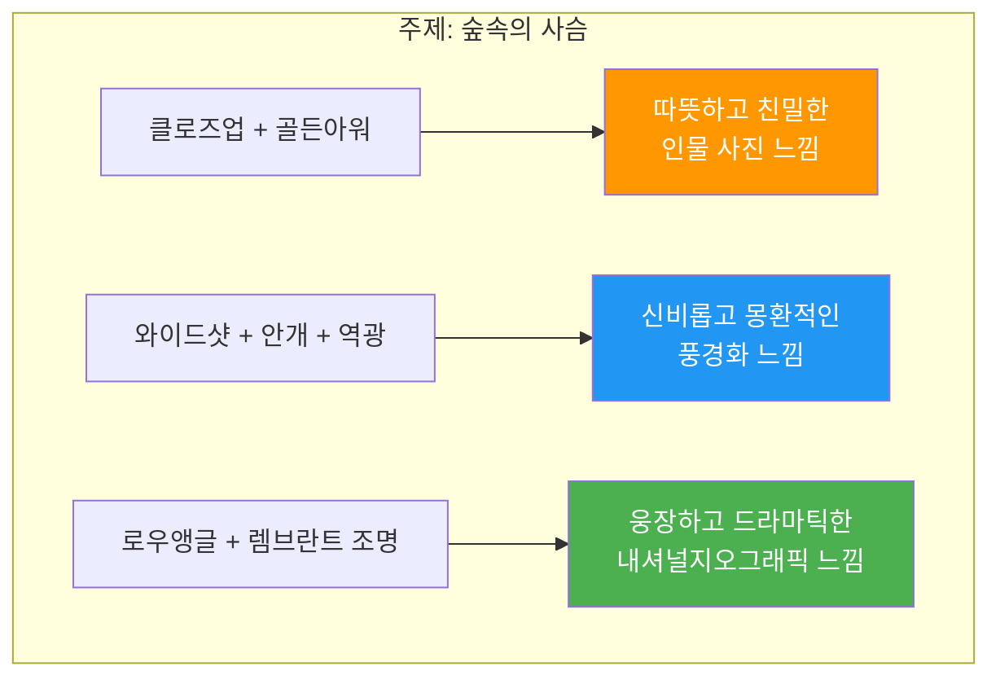
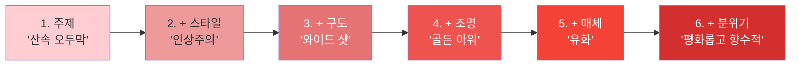

# 프롬프트 해부학 — 6요소 프레임워크

> AI에게 원하는 이미지를 정확히 설명하는 프롬프트의 6가지 구성 요소를 체계적으로 배운다

## 개요

이 섹션에서는 AI 이미지 생성의 핵심 도구인 **프롬프트(Prompt)**를 해부합니다. 마치 레시피에 재료 목록이 있듯이, 좋은 프롬프트에도 빠져서는 안 될 6가지 핵심 요소가 있거든요. 이 프레임워크를 이해하면, 막연히 "예쁜 그림 그려줘"가 아니라 **정확히 원하는 결과물**을 AI에게 주문할 수 있게 됩니다.

**선수 지식**: [Ch1에서 배운 생성형 AI의 기본 원리와 주요 플랫폼 특징](01-ch1-ai-이미지-생성-개론/01-01-생성형-ai가-바꾸는-디자인-워크플로우.md)을 알고 있으면 좋습니다.

**학습 목표**:
- 프롬프트를 구성하는 6가지 요소 — 주제(Subject), 스타일(Style), 구도(Composition), 조명(Lighting), 매체(Medium), 분위기(Mood) — 를 구분하고 설명할 수 있다
- 각 요소가 최종 이미지에 미치는 영향을 이해한다
- 6요소 프레임워크를 활용해 의도한 결과물에 가까운 프롬프트를 작성할 수 있다

## 왜 알아야 할까?

여러분이 카페에서 커피를 주문한다고 상상해보세요. "커피 한 잔 주세요"라고 하면 어떤 커피가 나올까요? 아메리카노일 수도, 라떼일 수도, 아이스일 수도 있죠. 하지만 "아이스 카페라떼, 샷 추가, 오트밀크로 부탁드려요"라고 하면? 정확히 원하는 음료를 받을 수 있습니다.

AI 이미지 생성도 똑같습니다. **"고양이 그려줘"**라는 프롬프트는 AI에게 "커피 한 잔 주세요"와 다를 바 없어요. 어떤 고양이인지, 어떤 분위기인지, 어디에 있는 고양이인지 — AI는 전부 랜덤하게 결정해버립니다.

프롬프트의 6요소 프레임워크를 익히면 이런 변화가 생깁니다:
- **시행착오 감소**: 원하는 결과를 처음부터 더 정확하게 얻을 수 있어요
- **소통 능력 향상**: AI에게 디자인 의도를 명확하게 전달할 수 있습니다
- **일관된 품질**: 체계적 프레임워크로 매번 안정적인 결과물을 뽑아낼 수 있죠

## 핵심 개념

### 개념 1: 프롬프트란 무엇인가?

> 💡 **비유**: 프롬프트는 **디자인 브리프(Design Brief)**입니다. 클라이언트가 디자이너에게 "이런 느낌으로 만들어주세요"라고 전달하는 요청서와 같아요. 브리프가 구체적일수록 결과물이 기대에 가까워지듯, 프롬프트도 마찬가지입니다.

프롬프트(Prompt)란 AI에게 원하는 이미지를 설명하는 **텍스트 지시문**입니다. 단순한 문장일 수도 있고, 여러 키워드와 설명이 조합된 구조화된 텍스트일 수도 있어요.

중요한 건, 프롬프트의 **구체성(Specificity)**이 결과물의 품질을 직접적으로 좌우한다는 점입니다. 아래 두 프롬프트의 차이를 보세요:

| 모호한 프롬프트 | 구체적인 프롬프트 |
|---|---|
| "고양이 그림" | "창가에 앉아 비 오는 거리를 내다보는 삼색 고양이, 수채화 스타일, 부드러운 자연광, 따뜻하고 아늑한 분위기" |
| AI가 결정할 것: 거의 전부 | AI가 결정할 것: 세부 디테일만 |

> 📊 **그림 1**: 프롬프트 구체성과 결과물 예측 가능성의 관계

플랫폼마다 프롬프트를 해석하는 방식이 조금 다르다는 점도 기억해두세요. [Ch1에서 비교한 것처럼](01-ch1-ai-이미지-생성-개론/02-02-주요-플랫폼-비교-chatgpt-vs-gemini-vs-midjourney.md), ChatGPT는 자연어 문장을 잘 이해하고, Midjourney는 키워드 중심의 간결한 프롬프트에 강합니다. 하지만 **6요소 프레임워크**는 어떤 플랫폼에서든 통용되는 보편적 구조예요.

### 개념 2: 6요소 프레임워크 전체 구조

> 💡 **비유**: 6요소 프레임워크는 **요리 레시피의 6대 항목**과 같습니다. 요리에 주재료, 양념, 조리법, 불 세기, 그릇, 플레이팅이 있듯이, 프롬프트에도 주제, 스타일, 구도, 조명, 매체, 분위기라는 6가지 재료가 있어요.

좋은 프롬프트는 다음 6가지 요소의 조합으로 구성됩니다:

| 요소 | 영문 | 역할 | 요리 비유 |
|------|------|------|-----------|
| **주제** | Subject | 무엇을 그릴 것인가 | 주재료 (닭고기, 파스타) |
| **스타일** | Style | 어떤 미학적 방향인가 | 양념 (한식, 이탈리안) |
| **구도** | Composition | 어떻게 배치할 것인가 | 플레이팅 (접시 위 배치) |
| **조명** | Lighting | 어떤 빛으로 비출 것인가 | 불 세기 (강불, 약불) |
| **매체** | Medium | 어떤 재료/도구로 표현할 것인가 | 조리 도구 (오븐, 프라이팬) |
| **분위기** | Mood | 어떤 감정을 전달할 것인가 | 최종 맛 (달콤한, 매콤한) |

> 📊 **그림 2**: 6요소 프레임워크의 구조와 흐름

이 6가지가 모두 필수는 아닙니다. 하지만 **요소를 많이 지정할수록 AI가 임의로 결정하는 영역이 줄어들고**, 여러분의 의도에 가까운 결과물이 나옵니다. 실제 작업에서는 프로젝트 성격에 따라 3~4개 요소만 활용하기도 하고, 6개 모두 꼼꼼하게 지정하기도 해요.

### 개념 3: 주제(Subject) — "무엇을 그릴 것인가"

> 💡 **비유**: 주제는 **영화의 주인공**이에요. 주인공이 누군지 모르면 영화 전체가 흐릿해지듯, 주제가 불명확하면 이미지도 초점을 잃습니다.

주제는 이미지의 **핵심 피사체**입니다. 사람, 동물, 사물, 풍경, 추상적 개념 등 무엇이든 될 수 있어요. 여기서 핵심은 **구체적으로 묘사**하는 것입니다.

**구체성 레벨 비교:**

| 레벨 | 프롬프트 예시 | 결과 예측도 |
|------|-------------|------------|
| 레벨 1 (추상적) | "여성" | 매우 낮음 |
| 레벨 2 (기본) | "젊은 여성이 카페에 앉아 있다" | 낮음 |
| 레벨 3 (구체적) | "곱슬머리의 20대 여성이 빈티지 카페에서 라떼를 들고 창밖을 바라보고 있다" | 높음 |
| 레벨 4 (상세) | "갈색 곱슬머리의 동양인 여성이 1960년대풍 파리 카페에서 라떼아트가 있는 잔을 양손으로 감싸 쥐고, 빗줄기가 흐르는 유리창 너머를 응시한다" | 매우 높음 |

> 🔥 **실무 팁**: 주제를 설명할 때는 **5W1H**(누가, 무엇을, 어디서, 언제, 왜, 어떻게)를 떠올려보세요. 모든 질문에 답할 필요는 없지만, 2~3개만 추가해도 결과물이 확 달라집니다.

### 개념 4: 스타일(Style)과 매체(Medium) — "어떤 느낌으로, 어떤 재료로"

> 💡 **비유**: 같은 풍경을 **사진작가**가 찍으면 포토리얼리즘이 되고, **모네**가 그리면 인상주의가 되며, **미야자키 하야오**가 그리면 지브리 애니메이션이 됩니다. 주제가 같아도 스타일과 매체에 따라 완전히 다른 작품이 탄생하는 거죠.

**스타일**은 미학적 방향성을 결정합니다. 어떤 예술 사조, 어떤 작가의 터치를 원하는지를 지정하는 거예요.

**자주 사용되는 스타일 키워드:**
- 포토리얼리스틱(Photorealistic) — 실제 사진처럼
- 인상주의(Impressionist) — 빛과 색의 인상을 포착
- 미니멀리스트(Minimalist) — 최소한의 요소로 표현
- 팝아트(Pop Art) — 강렬한 색감, 대중문화적
- 사이버펑크(Cyberpunk) — 네온, 미래도시, 디스토피아
- 지브리풍(Studio Ghibli style) — 따뜻하고 섬세한 애니메이션

**매체**는 표현 도구와 재료감을 지정합니다. 같은 스타일이라도 매체에 따라 질감이 완전히 달라져요.

**자주 사용되는 매체 키워드:**
- 수채화(Watercolor) — 투명하고 부드러운 번짐
- 유화(Oil painting) — 두껍고 풍부한 질감
- 디지털 아트(Digital art) — 깔끔하고 선명한 표현
- 연필 스케치(Pencil sketch) — 선의 강약으로 표현
- 3D 렌더(3D render) — 입체적이고 매끈한 질감
- 빈티지 포스터(Vintage poster) — 레트로한 인쇄 느낌

> 📊 **그림 3**: 스타일과 매체의 조합이 만드는 다양한 결과

> ⚠️ **흔한 오해**: "스타일과 매체는 같은 것 아닌가요?" — 아닙니다! **스타일은 미학적 방향**(인상주의, 미니멀 등)이고, **매체는 물리적 재료와 도구**(유화, 수채화, 디지털 등)입니다. 쉽게 구분하는 기준이 있어요: **"oil painting style"이라고 하면 유화'풍' 미학(스타일)**이고, **"oil on canvas"라고 하면 실제 캔버스 위 유화라는 재료(매체)**입니다. "인상주의 + 유화"와 "인상주의 + 수채화"는 같은 스타일이지만 전혀 다른 질감을 만들어냅니다. 이 둘의 경계가 때로 모호하게 느껴질 수 있는데, [다음 섹션](02-ch2-프롬프트-구조-마스터/02-02-주제와-스타일-무엇을-어떤-느낌으로.md)에서 매체 기반 스타일(Medium-based Style)을 다룰 때 이 구분을 더 명확하게 정리합니다.

### 개념 5: 구도(Composition)와 조명(Lighting) — "어떻게 배치하고, 어떤 빛으로"

> 💡 **비유**: 구도는 **무대 위 배우의 위치**이고, 조명은 **무대 조명**입니다. 같은 배우(주제)가 같은 의상(스타일)을 입어도, 무대 어디에 서느냐(구도)와 어떤 조명을 받느냐에 따라 관객이 느끼는 감정이 완전히 달라지죠.

**구도**는 이미지 안에서 요소들이 어떻게 배치되는지를 결정합니다. 사진이나 회화에서 사용하는 전통적인 구도 원칙이 AI 프롬프트에서도 그대로 통합니다.

**핵심 구도 키워드:**
- 클로즈업(Close-up) — 얼굴이나 디테일 강조
- 와이드 샷(Wide shot) — 전체 장면과 환경 포함
- 버즈아이 뷰(Bird's eye view) — 위에서 내려다보는 시점
- 로우 앵글(Low angle) — 아래에서 올려다보는 시점, 웅장함
- 삼분할 구도(Rule of thirds) — 화면을 9등분, 교차점에 주제 배치
- 대칭 구도(Symmetrical composition) — 좌우 균형, 안정감

**조명**은 사진작가들이 "빛이 곧 사진이다"라고 말할 정도로, 이미지의 분위기를 결정짓는 강력한 요소입니다.

**핵심 조명 키워드:**
- 골든 아워(Golden hour) — 해질녘의 따뜻한 황금빛
- 블루 아워(Blue hour) — 해 뜨기 직전/진 직후의 푸른빛
- 스튜디오 조명(Studio lighting) — 깔끔하고 전문적인 인물 조명
- 렘브란트 조명(Rembrandt lighting) — 얼굴 한쪽에 삼각형 빛, 드라마틱
- 역광(Backlight) — 피사체 뒤에서 비치는 빛, 실루엣 효과
- 네온 조명(Neon lighting) — 도시적이고 현대적인 색조명
- 자연광(Natural light) — 부드럽고 자연스러운 느낌

> 📊 **그림 4**: 구도와 조명이 같은 주제에 미치는 영향

### 개념 6: 분위기(Mood) — "어떤 감정을 전달할 것인가"

> 💡 **비유**: 분위기는 **영화의 OST**와 같습니다. 같은 장면이라도 밝은 음악이 깔리면 희망적으로, 어두운 음악이 깔리면 긴장감 있게 느껴지죠. 프롬프트의 분위기 키워드가 바로 이 배경음악 역할을 합니다.

분위기는 6요소 중 **가장 추상적이지만 가장 강력한** 요소입니다. 다른 5가지 요소가 이미지의 "외형"을 결정한다면, 분위기는 이미지를 본 사람이 **느끼는 감정**을 결정합니다.

**분위기 키워드 스펙트럼:**

| 따뜻한/긍정적 | 중립적/서사적 | 차가운/부정적 |
|---|---|---|
| 아늑한(Cozy) | 서사적(Epic) | 으스스한(Eerie) |
| 환희(Joyful) | 신비로운(Mysterious) | 우울한(Melancholic) |
| 낭만적(Romantic) | 고요한(Serene) | 황량한(Desolate) |
| 활기찬(Vibrant) | 향수적(Nostalgic) | 불안한(Ominous) |
| 몽환적(Dreamy) | 장엄한(Majestic) | 디스토피아적(Dystopian) |

분위기 키워드는 다른 요소들과 **시너지**를 만듭니다. "골든 아워 + 따뜻한 분위기"는 서로 강화하지만, "네온 조명 + 아늑한 분위기"는 서로 상충할 수 있어요. 물론 의도적 대비를 노린다면 그것도 하나의 전략이 됩니다.

### 개념 7: 6요소의 조합 — 프롬프트 완성하기

이제 6가지 요소를 실제로 조합해봅시다. 하나의 주제에 6요소를 하나씩 추가하면서 프롬프트가 어떻게 풍성해지는지 살펴보세요.

| 단계 | 추가 요소 | 프롬프트 |
|------|----------|----------|
| 1단계 | 주제만 | "산속 오두막" |
| 2단계 | + 스타일 | "산속 오두막, 인상주의 스타일" |
| 3단계 | + 구도 | "산속 오두막, 인상주의 스타일, 와이드 샷으로 산 전체가 보이게" |
| 4단계 | + 조명 | "산속 오두막, 인상주의 스타일, 와이드 샷, 골든 아워의 따뜻한 햇빛" |
| 5단계 | + 매체 | "산속 오두막, 인상주의 스타일, 와이드 샷, 골든 아워, 유화 텍스처" |
| 6단계 | + 분위기 | "산속 오두막, 인상주의 스타일, 와이드 샷, 골든 아워, 유화 텍스처, 평화롭고 향수적인 분위기" |

> 📊 **그림 5**: 요소 추가에 따른 프롬프트 완성도 변화

놀랍게도, 6가지 요소를 모두 넣은 프롬프트와 주제만 넣은 프롬프트의 결과는 **하늘과 땅 차이**입니다. 1단계에서 AI는 사실상 모든 것을 랜덤으로 결정하지만, 6단계에서는 여러분의 **크리에이티브 비전**이 거의 그대로 반영됩니다.

## 실습: 적용해보기

### 활동 1: 프롬프트 분해 워크시트

아래 프롬프트를 6요소로 분해해보세요:

**프롬프트**: *"A young woman reading a book in a sunlit greenhouse, surrounded by tropical plants, close-up portrait, soft natural window light, watercolor painting style, peaceful and contemplative mood"*

| 요소 | 이 프롬프트에서 해당하는 부분 |
|------|--------------------------|
| 주제(Subject) | ? |
| 스타일(Style) | ? |
| 구도(Composition) | ? |
| 조명(Lighting) | ? |
| 매체(Medium) | ? |
| 분위기(Mood) | ? |

정답 확인하기

| 요소 | 해당 부분 |
|------|----------|
| 주제 | 열대 식물에 둘러싸여 온실에서 책을 읽는 젊은 여성 |
| 스타일 | (매체와 통합되어 있음) |
| 구도 | 클로즈업 초상화(close-up portrait) |
| 조명 | 부드러운 자연 창문 빛(soft natural window light) |
| 매체 | 수채화(watercolor painting) |
| 분위기 | 평화롭고 사색적(peaceful and contemplative) |

### 활동 2: 같은 주제, 다른 분위기

아래 주제에 대해 **정반대 분위기**의 프롬프트 2개를 작성해보세요:

**주제**: 빈 교실

- **분위기 A** (밝고 희망적): 어떤 스타일, 구도, 조명, 매체, 분위기 키워드를 조합하시겠습니까?
- **분위기 B** (어둡고 불안한): 같은 질문에 대해 다른 조합을 만들어보세요.

### 활동 3: 요소별 영향력 토론

다음 질문에 대해 생각해보세요:

1. 6요소 중 결과물에 **가장 큰 영향**을 미치는 요소는 무엇이라고 생각하나요? 그 이유는?
2. **스타일과 분위기**가 서로 상충하면(예: "밝은 팝아트 + 우울한 분위기") AI는 어떻게 처리할까요?
3. **매체를 지정하지 않으면** AI는 기본적으로 어떤 매체를 선택하는 경향이 있을까요? 플랫폼별로 차이가 있을까요?

## 더 깊이 알아보기

### 프롬프트 엔지니어링의 탄생

"프롬프트 엔지니어링(Prompt Engineering)"이라는 용어가 대중화된 건 2022년 DALL-E 2와 Midjourney가 공개된 이후입니다. 하지만 사실, AI에게 정확한 지시를 내리는 기술의 역사는 훨씬 오래됐어요.

1960년대 초기 컴퓨터 프로그래밍에서도 **명확한 명령어**가 결과를 좌우했습니다. 프로그래머들은 컴퓨터가 이해할 수 있는 정확한 문법으로 지시를 내려야 했죠. AI 이미지 생성에서의 프롬프트 엔지니어링은 이 전통을 현대적으로 계승한 것입니다.

흥미로운 건, 초기 Midjourney 커뮤니티에서 사용자들이 **경험적으로** 프롬프트 구조를 발견해나갔다는 점이에요. 어떤 키워드를 넣으면 결과가 좋아지는지, 어떤 순서로 배치하면 효과적인지를 수천 번의 시행착오를 통해 알아냈습니다. 오늘날 우리가 사용하는 6요소 프레임워크는 이런 **집단적 실험**의 산물이라고 할 수 있어요.

### 왜 하필 이 6가지인가?

6요소 프레임워크의 뿌리는 **전통 미술 교육**에 있습니다. 미술 대학에서 작품을 분석할 때 사용하는 기본 범주가 바로 주제, 양식, 구도, 명암, 재료, 정서거든요. AI 이미지 생성 커뮤니티는 이 전통적 분석 틀을 프롬프트 작성에 자연스럽게 차용한 셈입니다. 수백 년 미술사의 지혜가 AI 시대에도 유효한 거죠.

## 흔한 오해와 팁

> ⚠️ **흔한 오해**: "프롬프트는 길수록 좋다" — 아닙니다! 핵심 키워드가 명확한 짧은 프롬프트가 장황하지만 모호한 긴 프롬프트보다 훨씬 좋은 결과를 만듭니다. 특히 Midjourney는 40~60단어 정도의 간결한 프롬프트에서 최고의 성능을 보여요. 중요한 건 길이가 아니라 **핵심 요소의 명확성**입니다.

> 💡 **알고 계셨나요?**: 프롬프트에서 단어의 **순서**도 결과에 영향을 미칩니다. 대부분의 AI 모델은 프롬프트 앞쪽에 있는 단어에 더 높은 가중치를 부여해요. 그래서 가장 중요한 요소(보통 주제)를 맨 앞에 놓는 것이 좋습니다.

> 🔥 **실무 팁**: 처음부터 6요소를 모두 채우려고 하지 마세요. 먼저 **주제 + 스타일**만으로 시작해서 결과를 확인하고, 한 번에 **하나씩 요소를 추가**하며 반복(iteration)하는 것이 더 효율적입니다. 이렇게 하면 각 요소가 어떤 영향을 주는지도 자연스럽게 파악할 수 있어요.

## 핵심 정리

| 개념 | 설명 |
|------|------|
| 프롬프트 | AI에게 원하는 이미지를 설명하는 텍스트 지시문 |
| 6요소 프레임워크 | 주제(Subject), 스타일(Style), 구도(Composition), 조명(Lighting), 매체(Medium), 분위기(Mood)의 체계적 조합 |
| 주제(Subject) | 이미지의 핵심 피사체 — 구체적일수록 좋다 |
| 스타일(Style) | 미학적 방향성 — 어떤 예술 사조나 느낌인가 |
| 구도(Composition) | 화면 내 요소 배치와 카메라 앵글 |
| 조명(Lighting) | 빛의 방향, 색온도, 강도 — 분위기를 결정짓는 핵심 |
| 매체(Medium) | 물리적 표현 도구와 재료감 — 질감과 텍스처를 결정 |
| 분위기(Mood) | 이미지가 전달하는 감정과 정서 |
| 스타일 vs 매체 | 스타일은 미학적 방향, 매체는 물리적 재료/도구. 예: oil painting style(스타일) vs oil on canvas(매체) |
| 구체성 원칙 | 요소를 많이, 구체적으로 지정할수록 의도에 가까운 결과 |
| 반복 전략 | 주제+스타일로 시작 → 한 요소씩 추가하며 개선 |

## 다음 섹션 미리보기

이제 6요소의 전체 구조를 이해했으니, 다음 섹션 [주제와 스타일 — 무엇을, 어떤 느낌으로](02-ch2-프롬프트-구조-마스터/02-02-주제와-스타일-무엇을-어떤-느낌으로.md)에서는 6요소 중 가장 기본이 되는 **주제**와 **스타일** 두 가지를 깊이 파고듭니다. 주제를 묘사하는 구체적 기법과, 다양한 스타일 키워드가 실제로 어떤 결과를 만들어내는지 풍부한 사례와 함께 살펴볼 거예요. 특히 매체 기반 스타일(Medium-based Style)과 매체(Medium) 자체의 구분도 명확하게 정리하니 기대해주세요.

## 참고 자료

- [How to Write AI Image Prompts Like a Pro (2026)](https://letsenhance.io/blog/article/ai-text-prompt-guide/) - 프롬프트 구성 요소와 자연어 작성법에 대한 포괄적 가이드
- [A Complete Guide to ChatGPT Image Generation (Superhuman AI)](https://www.superhuman.ai/c/a-complete-guide-to-chatgpt-image-generation-in-2025) - ChatGPT 이미지 생성의 프롬프트 공식과 반복 개선 기법
- [AI Image Prompts: Image Prompting Guide (LTX Studio)](https://ltx.studio/blog/ai-image-prompt-guide) - 플랫폼별 프롬프트 전략과 고급 기법 안내
- [How to Write Effective AI Image Prompts (Leonardo.Ai)](https://leonardo.ai/news/ai-image-prompts/) - 효과적인 프롬프트 작성을 위한 실전 예시와 팁