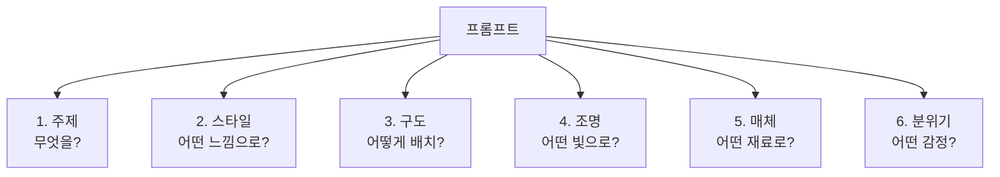

# 프롬프트 해부학 — 6요소 프레임워크

> 좋은 프롬프트에는 공식이 있습니다. 6가지 요소를 알면 원하는 이미지를 정확히 주문할 수 있어요.

## 개요

"고양이 그려줘"와 아래 프롬프트의 결과는 하늘과 땅 차이입니다:

```
창가에 앉아 비 오는 거리를 내다보는 삼색 고양이, 수채화 스타일, 부드러운 자연광, 따뜻하고 아늑한 분위기
```

이번 세션에서는 프롬프트를 구성하는 **6가지 핵심 요소**를 배워서, 매번 원하는 결과를 얻는 공식을 만들어봅니다.

**학습 목표**:
- 프롬프트의 6요소 — 주제, 스타일, 구도, 조명, 매체, 분위기 — 를 구분할 수 있다
- 각 요소를 추가할 때마다 결과물이 어떻게 달라지는지 체감한다
- 6요소를 조합해 의도한 이미지에 가까운 프롬프트를 작성할 수 있다

## 카페 주문처럼 구체적으로

카페에서 "커피 한 잔 주세요"라고 하면 아메리카노일 수도, 라떼일 수도 있죠. "아이스 카페라떼, 샷 추가, 오트밀크"라고 하면 정확히 원하는 음료를 받을 수 있습니다.

AI 이미지 생성도 똑같아요. 구체적으로 말할수록 원하는 결과에 가까워집니다.

**모호한 프롬프트:**
```
고양이 그림
```
→ AI가 거의 전부를 랜덤으로 결정

**구체적인 프롬프트:**
```
A calico cat sitting by a rain-streaked window, gazing at the street below, watercolor style, soft natural light, cozy warm atmosphere
```
→ AI가 세부 디테일만 결정


## 6요소 프레임워크 — 프롬프트의 레시피

좋은 프롬프트는 6가지 요소의 조합입니다. 요리 레시피에 주재료, 양념, 조리법이 있듯이요.

| 요소 | 영문 | 역할 | 요리 비유 |
|------|------|------|-----------|
| **주제** | Subject | 무엇을 그릴 것인가 | 주재료 |
| **스타일** | Style | 어떤 미학적 방향인가 | 양념 |
| **구도** | Composition | 어떻게 배치할 것인가 | 플레이팅 |
| **조명** | Lighting | 어떤 빛으로 비출 것인가 | 불 세기 |
| **매체** | Medium | 어떤 재료로 표현할 것인가 | 조리 도구 |
| **분위기** | Mood | 어떤 감정을 전달할 것인가 | 최종 맛 |



6가지가 모두 필수는 아니에요. 하지만 **요소를 많이 지정할수록 AI가 임의로 결정하는 영역이 줄어들고**, 여러분의 의도에 가까운 결과물이 나옵니다.

## 요소별 핵심 키워드와 프롬프트 예시

### 1. 주제 (Subject) — "무엇을 그릴 것인가"

이미지의 **주인공**이에요. 구체적일수록 좋습니다.

**Level 1 — 추상적:**
```
a woman
```

**Level 2 — 기본:**
```
a young woman sitting in a café
```

**Level 3 — 구체적:**
```
a curly-haired woman in her 20s holding a latte and gazing out the window of a vintage café
```

**Level 4 — 상세:**
```
a woman with brown curly hair in a 1960s Parisian café, cradling a latte art cup with both hands, staring through a rain-streaked glass window, a croissant on a ceramic plate beside her
```


> 💡 **팁**: 주제를 설명할 때 **누가, 무엇을, 어디서, 어떻게**를 떠올려보세요. 2~3개만 답해도 결과물이 확 달라집니다.

### 2. 스타일 (Style) — "어떤 느낌으로"

같은 풍경도 스타일에 따라 완전히 달라집니다. 자주 쓰는 스타일 키워드:

- `Photorealistic` — 실제 사진처럼
- `Impressionist` — 빛과 색의 인상
- `Minimalist` — 최소한의 요소
- `Pop Art` — 강렬한 색감
- `Cyberpunk` — 네온, 미래도시
- `Studio Ghibli style` — 따뜻한 애니메이션

**스타일 하나로 달라지는 결과 — 같은 주제, 다른 세계:**

```
a small bookshop on a quiet street corner, Impressionist painting style
```


```
a small bookshop on a quiet street corner, cyberpunk neon style
```


```
a small bookshop on a quiet street corner, Studio Ghibli animation style
```


### 3. 매체 (Medium) — "어떤 재료로"

- `Watercolor` — 투명하고 부드러운 번짐
- `Oil painting` — 두껍고 풍부한 질감
- `Digital art` — 깔끔하고 선명
- `Pencil sketch` — 선의 강약
- `3D render` — 입체적이고 매끈
- `Film photography` — 필름 그레인, 빈티지 색감

### 4. 구도 (Composition) — "어떻게 배치할 것인가"

- `Close-up` — 디테일 강조
- `Wide shot` — 전체 장면 포함
- `Bird's eye view` — 위에서 내려다보기
- `Low angle` — 아래에서 올려다보기, 웅장함
- `Rule of thirds` — 삼분할, 안정적 배치

### 5. 조명 (Lighting) — "어떤 빛으로"

- `Golden hour` — 해질녘 따뜻한 황금빛
- `Studio lighting` — 깔끔하고 전문적
- `Neon lighting` — 도시적 색조명
- `Natural light` — 부드럽고 자연스러운
- `Backlight` — 역광, 실루엣 효과

### 6. 분위기 (Mood) — "어떤 감정을"

| 따뜻한/긍정적 | 중립적/서사적 | 차가운/부정적 |
|---|---|---|
| Cozy, Joyful | Epic, Mysterious | Eerie, Melancholic |
| Romantic, Vibrant | Serene, Nostalgic | Desolate, Ominous |

## 6요소 조합 실습 — 한 단계씩 쌓아보기

하나의 주제에 요소를 하나씩 추가하면서 프롬프트가 어떻게 풍성해지는지 확인해보세요. 각 단계를 실제로 ChatGPT나 Gemini에 넣어보면 차이를 체감할 수 있어요.

**1단계 — 주제만:**
```
a cabin in the mountains
```


**2단계 — + 스타일:**
```
a cabin in the mountains, Impressionist style
```


**3단계 — + 구도:**
```
a cabin in the mountains, Impressionist style, wide shot showing the full mountain range
```


**4단계 — + 조명:**
```
a cabin in the mountains, Impressionist style, wide shot, golden hour warm sunlight
```


**5단계 — + 매체:**
```
a cabin in the mountains, Impressionist style, wide shot, golden hour, oil painting with visible brushstrokes
```


**6단계 — + 분위기 (완성!):**
```
a cabin in the mountains, Impressionist style, wide shot, golden hour, oil painting with visible brushstrokes, peaceful and nostalgic atmosphere
```


## 실습: 프롬프트 분해하기

### 활동 1: 6요소 분해 워크시트

아래 프롬프트를 6요소로 분해해보세요:

```
A young woman reading a book in a sunlit greenhouse, surrounded by tropical plants, close-up portrait, soft natural window light, watercolor painting style, peaceful and contemplative mood
```

| 요소 | 해당하는 부분 |
|------|-------------|
| 주제 | ? |
| 스타일 | ? |
| 구도 | ? |
| 조명 | ? |
| 매체 | ? |
| 분위기 | ? |

> 💡 **정답**: 주제=열대 식물에 둘러싸여 온실에서 책을 읽는 여성, 구도=close-up portrait, 조명=soft natural window light, 매체=watercolor painting, 분위기=peaceful and contemplative

### 활동 2: 같은 주제, 다른 분위기

**주제**: 빈 교실. 정반대 분위기 2개를 만들어보세요.

**밝고 희망적 버전:**
```
an empty classroom bathed in morning sunlight, cherry blossom petals drifting through an open window, watercolor style, soft warm lighting, hopeful and fresh atmosphere
```


**어둡고 불안한 버전:**
```
an empty classroom at night, single flickering fluorescent light, desks casting long shadows, film photography style, cold blue-green tones, eerie and abandoned atmosphere
```


### 활동 3: 나만의 6요소 프롬프트 만들기

아래 빈칸을 채워서 나만의 프롬프트를 완성해보세요:

```
[주제: _______________], [스타일: _______________], [구도: _______________], [조명: _______________], [매체: _______________], [분위기: _______________]
```

## 팁과 주의사항

> 🔥 **실무 팁**: 처음부터 6요소를 모두 채우려고 하지 마세요. 먼저 **주제 + 스타일**만으로 시작해서 결과를 확인하고, 한 번에 **하나씩 요소를 추가**하며 다듬는 것이 더 효율적입니다.

> ⚠️ **흔한 오해**: "프롬프트는 길수록 좋다" — 아닙니다! 핵심 키워드가 명확한 짧은 프롬프트가 장황하고 모호한 긴 프롬프트보다 좋은 결과를 만들어요.

> 💡 **프롬프트 순서도 중요해요**: 대부분의 AI는 프롬프트 앞쪽에 있는 단어에 더 높은 가중치를 줍니다. 가장 중요한 요소(보통 주제)를 맨 앞에 놓으세요.

## 핵심 정리

| 개념 | 설명 |
|------|------|
| **6요소 프레임워크** | 주제, 스타일, 구도, 조명, 매체, 분위기의 조합 |
| **주제** | 이미지의 주인공 — 구체적일수록 좋다 |
| **스타일** | 미학적 방향성 (인상주의, 미니멀 등) |
| **구도** | 카메라 앵글과 배치 |
| **조명** | 빛의 방향, 색온도, 분위기 |
| **매체** | 표현 재료 (수채화, 유화, 디지털 등) |
| **분위기** | 이미지가 전달하는 감정 |
| **구체성 원칙** | 요소를 많이, 구체적으로 지정할수록 의도에 가까운 결과 |

## 다음 세션 미리보기

6요소의 전체 구조를 이해했으니, 다음 세션에서는 6요소 중 가장 기본이 되는 **주제**와 **스타일** 두 가지를 깊이 파고듭니다. 주제를 묘사하는 구체적 기법과, 다양한 스타일 키워드가 실제로 어떤 결과를 만들어내는지 풍부한 예시와 함께 살펴볼게요.
