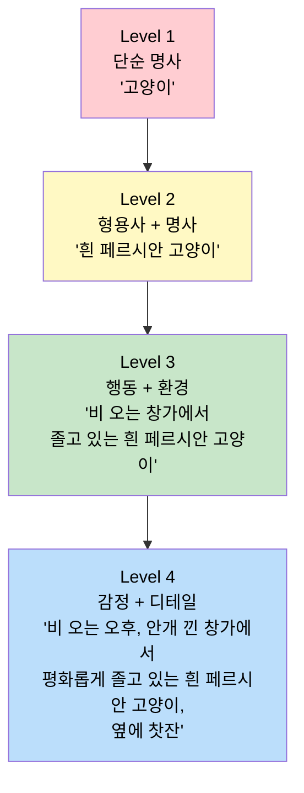
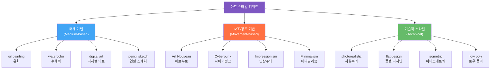
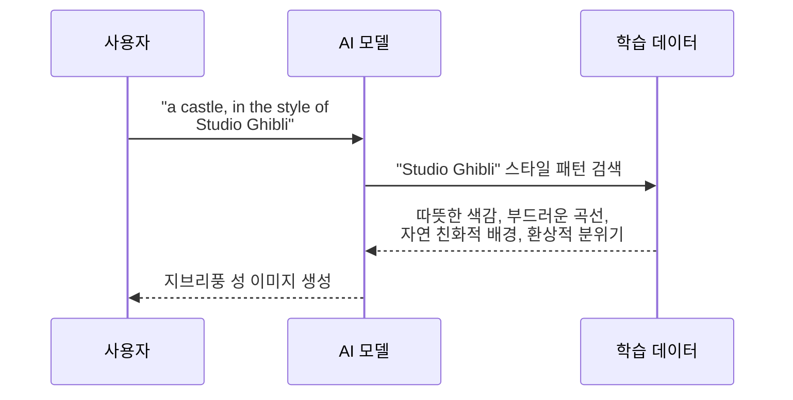
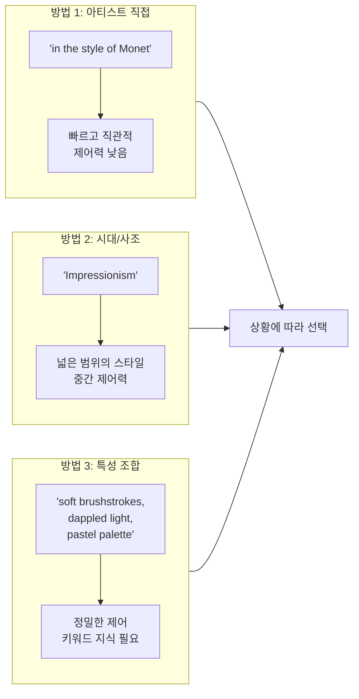
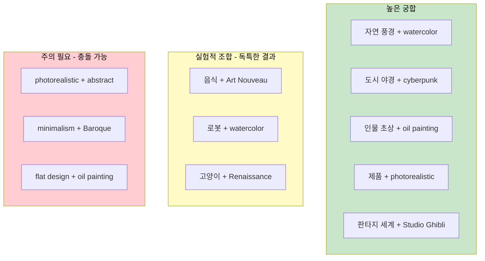

# 주제와 스타일 — 무엇을 어떤 느낌으로

> 프롬프트의 핵심 두 축, '무엇을 그릴 것인가'와 '어떤 느낌으로 그릴 것인가'를 마스터합니다.

## 개요

이 섹션에서는 [프롬프트 해부학 — 6요소 프레임워크](02-ch2-프롬프트-구조-마스터/01-01-프롬프트-해부학-6요소-프레임워크.md)에서 배운 6요소 중 가장 기본이 되는 두 가지 — **주제(Subject)**와 **스타일(Style)** — 을 깊이 파고듭니다. 주제를 얼마나 구체적으로 묘사하느냐에 따라 AI가 그려내는 이미지의 품질이 극적으로 달라지며, 스타일 키워드 하나가 같은 주제를 완전히 다른 세계로 변신시킵니다.

**선수 지식**: 6요소 프레임워크(주제, 스타일, 구도, 조명, 매체, 분위기)의 기본 개념
**학습 목표**:
- 주제 설명의 구체성 레벨(1단계~4단계)에 따른 결과물 차이를 이해한다
- 주요 아트 스타일 키워드를 활용하여 원하는 비주얼 톤을 만들 수 있다
- 아티스트·시대 레퍼런스를 프롬프트에 효과적으로 활용하는 방법을 익힌다
- 주제와 스타일을 조합하는 자신만의 전략을 수립한다

## 왜 알아야 할까?

"고양이 그려줘"라고 말했을 때, AI는 수천 가지 고양이 중 어떤 고양이를 그려야 할지 모릅니다. 턱시도 무늬 페르시안 고양이가 비 오는 창가에서 졸고 있는 모습? 아니면 우주복을 입은 만화풍 고양이? 주제의 **구체성**이야말로 "AI가 제 마음을 못 읽어요"라는 불만의 90%를 해결하는 열쇠입니다.

여기에 스타일을 더하면 차원이 달라집니다. 똑같은 "숲속의 성"이라도 수채화로 그리면 동화적 감성이, 사이버펑크로 그리면 미래 도시의 긴장감이 됩니다. 디자이너에게 주제와 스타일은 "무엇을(What)" 그리고 "어떻게(How)"에 해당하는, 프롬프트의 양 날개입니다.

## 핵심 개념

### 개념 1: 주제 구체성의 4단계 — 흐릿한 스케치에서 선명한 사진까지

> 💡 **비유**: 온라인 쇼핑몰에서 검색한다고 생각해보세요. 검색창에 "티셔츠"라고만 치면 수만 개의 결과가 쏟아지죠. 하지만 "네이비 린넨 오버핏 반팔 티셔츠"라고 검색하면? 원하는 제품이 바로 상단에 뜹니다. AI 이미지 생성도 똑같습니다. 구체적인 키워드를 넣을수록 AI는 여러분이 머릿속에 그린 바로 그 이미지에 가까운 결과를 내놓습니다.

주제를 묘사하는 구체성에는 4가지 레벨이 있습니다. 각 레벨이 올라갈수록 AI가 "추측"해야 하는 부분이 줄어들고, 여러분의 의도에 가까운 이미지가 나옵니다.

> 📊 **그림 1**: 주제 구체성 4단계 피라미드

**Level 1 — 단순 명사**: `a fox` → AI가 종, 색상, 환경, 포즈를 전부 임의로 결정합니다. 매번 다른 결과가 나오죠.

**Level 2 — 형용사 + 명사**: `a red fox with fluffy tail` → 외형이 구체화되지만, 여전히 어디서 무얼 하는지는 AI의 상상에 맡깁니다.

**Level 3 — 행동 + 환경**: `a red fox exploring a misty autumn forest at dawn` → 이제 장면이 보이기 시작합니다. 안개, 가을 숲, 새벽이라는 맥락이 분위기까지 결정해줍니다.

**Level 4 — 감정 + 디테일**: `a curious red fox cautiously exploring a misty autumn forest at dawn, golden light filtering through maple leaves, dewdrops on its whiskers` → 감정(호기심, 조심스러움)과 미세한 디테일(이슬, 단풍잎 사이 빛)까지 지정하면, 결과물은 거의 여러분이 머릿속에 그린 그 장면이 됩니다.

> ⚠️ **흔한 오해**: "길게 쓰면 무조건 좋다"는 착각이 있는데, 사실은 **의미 있는 정보의 밀도**가 중요합니다. "정말 정말 아주 매우 아름다운 고양이"처럼 감탄사만 나열하면 AI는 별로 도움을 받지 못합니다. 핵심은 시각적으로 구분 가능한 구체적 정보(색상, 질감, 위치, 행동, 감정)를 넣는 거예요.

#### 구체성 단계별 체크리스트

효과적인 주제 묘사를 위해 다음 요소들을 점검해보세요:

| 체크 항목 | 질문 | 예시 |
|-----------|------|------|
| **누구/무엇** | 주인공이 명확한가? | "여우" → "붉은여우" |
| **외형 특징** | 색상, 크기, 질감이 있는가? | "털이 풍성한", "반짝이는 비늘" |
| **행동/포즈** | 무엇을 하고 있는가? | "달리는", "웅크린", "올려다보는" |
| **환경/배경** | 어디에 있는가? | "안개 낀 숲속", "네온사인 골목" |
| **감정/분위기** | 어떤 느낌인가? | "호기심 가득한", "고독한" |
| **소품/디테일** | 장면을 풍부하게 하는 요소가 있는가? | "옆에 놓인 오래된 책", "떨어지는 꽃잎" |

### 개념 2: 아트 스타일 키워드 — 한 단어가 세계를 바꾼다

> 💡 **비유**: 같은 노래도 재즈 편곡과 록 편곡이 완전히 다른 분위기를 만들듯이, 같은 주제에 다른 스타일 키워드를 붙이면 전혀 다른 이미지가 탄생합니다. 스타일 키워드는 AI에게 건네는 "장르 지정"이에요.

아트 스타일 키워드는 크게 세 가지 카테고리로 나눌 수 있습니다.

> 📊 **그림 2**: 아트 스타일 키워드 분류 체계

#### 매체 기반(Medium-based) 스타일

매체 키워드는 "어떤 재료로 그린 것처럼" 보이게 할지를 결정합니다.

| 키워드 | 효과 | 어울리는 주제 |
|--------|------|--------------|
| `oil painting` | 두껍고 풍부한 질감, 클래식한 느낌 | 인물 초상, 풍경, 정물 |
| `watercolor` | 부드럽고 몽환적, 색이 번지는 느낌 | 자연, 꽃, 감성적 장면 |
| `pencil sketch` | 거칠고 원초적, 아이디어 스케치 느낌 | 컨셉 아트, 건축, 캐릭터 초안 |
| `digital art` | 선명하고 깨끗한 디지털 질감 | 게임 아트, 일러스트, UI |
| `3D render` | 입체감 있는 오브젝트 느낌 | 제품, 캐릭터, 건축 |

#### 사조/장르 기반(Movement-based) 스타일

미술사의 사조나 하위문화 장르를 참조하는 키워드입니다.

| 키워드 | 핵심 특징 | 대표 비주얼 |
|--------|----------|------------|
| `Impressionism` | 빛의 순간 포착, 부드러운 붓터치 | 모네의 수련처럼 빛이 일렁이는 풍경 |
| `Art Nouveau` | 유기적 곡선, 자연 모티프, 장식적 | 뮈샤의 포스터처럼 화려한 테두리 |
| `Cyberpunk` | 네온, 비 젖은 거리, 어둡고 미래적 | 블레이드 러너풍 도시 |
| `Surrealism` | 비현실적 조합, 꿈의 논리 | 달리의 녹아내리는 시계처럼 기이한 조합 |
| `Minimalism` | 단순한 형태, 여백의 미, 제한된 색상 | 깔끔한 라인과 넓은 여백 |
| `Vaporwave` | 레트로 색감, 80-90년대 디지털 노스탤지어 | 핑크-보라 그라데이션, 그리스 조각상 |

#### 기술적(Technical) 스타일

렌더링 방식이나 디자인 기법을 지정하는 키워드입니다.

| 키워드 | 효과 |
|--------|------|
| `photorealistic` | 실제 사진처럼 정밀한 묘사 |
| `flat design` | 그림자 없는 2D, 깔끔한 벡터 느낌 |
| `isometric` | 45도 각도의 3D 투시 |
| `low poly` | 적은 폴리곤의 기하학적 스타일 |
| `cel shading` | 만화/애니메이션 음영 |

> 🔥 **실무 팁**: 스타일 키워드를 **두 개 이상 조합**하면 독특한 결과를 얻을 수 있어요. 예를 들어 `watercolor cyberpunk`은 사이버펑크 세계를 수채화의 부드러움으로 표현하는 독특한 하이브리드 스타일을 만들어냅니다. 단, 서로 극단적으로 충돌하는 스타일(예: `photorealistic pencil sketch`)은 AI를 혼란시킬 수 있으니 주의하세요.

### 개념 3: 아티스트·시대 레퍼런스 — 거장의 눈 빌려오기

> 💡 **비유**: 요리사에게 "이탈리안 느낌으로 해주세요"라고 하면 올리브오일과 바질이 떠오르듯, AI에게 "모네 스타일로"라고 하면 부드러운 빛과 인상주의 붓터치가 떠오릅니다. 아티스트 이름은 수십 개의 스타일 키워드를 한 단어로 압축한 **스타일 압축 코드**입니다.

> 📊 **그림 3**: 아티스트 레퍼런스의 작동 원리

아티스트나 시대 레퍼런스를 활용하는 세 가지 방법이 있습니다:

**방법 1 — 아티스트 이름 직접 사용**: `in the style of Alphonse Mucha`, `inspired by Hayao Miyazaki`

이 방식은 해당 아티스트의 전체 비주얼 언어(색감, 구도, 질감, 주제 선호 등)를 한꺼번에 불러옵니다. AI의 학습 데이터에 해당 아티스트의 작품이 충분히 포함되어 있을수록 효과가 강합니다.

| 아티스트/스튜디오 | 불러오는 스타일 | 잘 어울리는 주제 |
|-----------------|---------------|----------------|
| Studio Ghibli | 따뜻한 색감, 자연 친화적, 동화적 | 풍경, 판타지, 일상 |
| Alphonse Mucha | 아르누보 장식, 우아한 여성상, 화려한 프레임 | 포스터, 인물, 브랜드 비주얼 |
| HR Giger | 바이오메카니컬, 어둡고 유기적 | SF, 호러, 컨셉 아트 |
| Moebius (Jean Giraud) | 선명한 라인, SF적 풍경, 독특한 색감 | SF, 어드벤처, 코믹 |

**방법 2 — 시대/사조 이름 사용**: `Renaissance painting`, `Edo period ukiyo-e`, `1950s retro illustration`

시대를 지정하면 그 시기의 전체적인 미학(기법, 색상 팔레트, 구도 규칙)이 반영됩니다. 특정 아티스트보다 넓은 범위의 스타일을 불러올 때 유용합니다.

**방법 3 — 특성 조합으로 간접 참조**: 아티스트 이름 대신 그 아티스트의 핵심 특성들을 키워드로 풀어쓰는 방법입니다.

예를 들어 "모네 스타일" 대신: `soft brushstrokes, dappled light, pastel color palette, atmospheric, en plein air painting` — 이렇게 쓰면 특정 아티스트에 의존하지 않으면서도 원하는 스타일을 정밀하게 제어할 수 있습니다.

> 📊 **그림 4**: 세 가지 레퍼런스 방법 비교

### 개념 4: 주제 × 스타일 조합 전략 — 시너지를 만드는 법

> 💡 **비유**: 요리에서 재료(주제)와 조리법(스타일)이 궁합이 맞아야 맛있는 음식이 나오듯, 프롬프트에서도 주제와 스타일의 궁합이 결과물의 완성도를 크게 좌우합니다.

모든 주제에 모든 스타일이 잘 어울리는 건 아닙니다. 효과적인 조합을 위한 핵심 원칙을 살펴보겠습니다.

> 📊 **그림 5**: 주제-스타일 궁합 매트릭스

**궁합이 좋은 조합의 원칙:**

1. **분위기 일치**: 주제의 감정과 스타일의 톤이 같은 방향을 가리키면 시너지가 납니다. 고요한 호수 풍경 + 수채화 = 평화로운 감성 극대화.

2. **의외성 활용**: 반대로, 일부러 주제와 스타일을 엇갈리게 하면 독창적인 결과가 나옵니다. 중세 기사 + vaporwave = 유니크한 레트로 판타지.

3. **목적 기반 선택**: 상업적 용도(제품 사진, 광고)에는 `photorealistic`이나 `commercial photography` 같은 전문적 스타일을, 개인 창작에는 실험적 조합을 선택하세요.

**플랫폼별 스타일 키워드 반응 차이:**

같은 스타일 키워드라도 플랫폼에 따라 반응이 다릅니다. [주요 플랫폼 비교](01-ch1-ai-이미지-생성-개론/02-02-주요-플랫폼-비교-chatgpt-vs-gemini-vs-midjourney.md)에서 살펴봤듯이:

- **ChatGPT (GPT-4o)**: 자연어 문장으로 스타일을 묘사하면 잘 반응합니다. "마치 비 온 뒤 수채화처럼 색이 번진 느낌"과 같은 서술이 효과적이에요.
- **Midjourney V7**: 짧고 강렬한 키워드 나열을 선호합니다. `oil painting, dramatic lighting, Renaissance` 같은 형태가 좋습니다. 또한 `--stylize` 파라미터로 AI의 미학적 해석 강도를 조절할 수 있죠.
- **Gemini**: 구체적이고 설명적인 문장이 효과적입니다. ChatGPT와 유사하게 대화형으로 스타일을 지정할 수 있어요.

> 💡 **알고 계셨나요?**: Midjourney V7에서는 프롬프트의 **앞부분에 쓴 키워드**에 더 높은 가중치가 부여됩니다. 따라서 가장 중요한 주제와 스타일 키워드를 프롬프트 앞쪽에 배치하는 것이 좋아요. "cyberpunk cityscape at night"과 "at night there is a cityscape that is cyberpunk"은 동일한 단어를 사용하지만 결과가 다를 수 있답니다.

## 실습: 적용해보기

### 워크시트 1: 구체성 레벨업 연습

하나의 주제를 잡고, 4단계로 점점 구체화해보세요.

| 단계 | 내 프롬프트 |
|------|-----------|
| Level 1 (명사) | 예: `a tree` → 내 주제: _____________ |
| Level 2 (형용사 + 명사) | 예: `a twisted old oak tree` → _____________ |
| Level 3 (행동 + 환경) | 예: `a twisted old oak tree standing alone on a foggy hilltop` → _____________ |
| Level 4 (감정 + 디테일) | 예: `a majestic twisted oak tree standing alone on a foggy hilltop at sunrise, roots gripping weathered rocks, golden light piercing through branches` → _____________ |

각 레벨에서 실제로 이미지를 생성해보고, 어느 레벨에서 가장 큰 변화가 있었는지 기록해보세요.

### 워크시트 2: 스타일 변환 비교

하나의 Level 3 이상 주제 프롬프트를 정하고, 아래 스타일을 각각 적용해 결과를 비교합니다.

**고정 주제 예시**: `a cozy café on a rainy evening with warm lights glowing through steamy windows`

| 적용 스타일 | 예상되는 느낌 | 실제 결과 메모 |
|------------|-------------|--------------|
| `watercolor` | 부드럽고 감성적 | |
| `cyberpunk neon` | 미래적, 차가우면서 화려 | |
| `Studio Ghibli style` | 따뜻하고 동화적 | |
| `photorealistic` | 현실적, 마치 사진 같은 | |
| `Impressionism` | 빛의 인상, 부드러운 붓터치 | |

### 토론 질문

1. 구체성 Level 3과 Level 4의 차이는 "양적 차이"인가요, "질적 차이"인가요? 실제 생성 결과에서 어떤 변화가 가장 인상적이었나요?
2. 같은 주제에 서로 반대되는 스타일(예: `minimalism` vs `Baroque`)을 적용하면 어떤 일이 일어나나요? 실험해보고 발견한 점을 공유해보세요.
3. 상업적 디자인 프로젝트에서 아티스트 이름을 직접 레퍼런스하는 것과 특성 키워드로 풀어쓰는 것 중 어느 접근이 더 적절할까요?

## 더 깊이 알아보기

### 프롬프트의 역사 — CLIP이 연 텍스트-이미지 연결의 시대

오늘날 우리가 텍스트 프롬프트로 이미지를 생성할 수 있는 건, 2021년 OpenAI가 발표한 **CLIP(Contrastive Language-Image Pre-training)** 모델 덕분입니다. CLIP은 인터넷에서 수억 장의 이미지와 그에 달린 텍스트 설명을 함께 학습하여, "텍스트가 묘사하는 것"과 "이미지에 담긴 것"을 같은 공간에서 이해하는 능력을 갖췄습니다.

이 기술이 나오기 전에는 AI에게 "수채화 스타일의 고양이"라고 말해도 "수채화"가 뭔지, "고양이"가 뭔지 따로따로 이해할 뿐 이 둘을 연결하지 못했어요. CLIP 이후에야 AI가 "수채화로 그린 고양이"라는 개념을 하나의 시각적 의미로 파악할 수 있게 된 거죠.

재미있는 건, CLIP이 학습한 텍스트-이미지 쌍의 품질이 프롬프트 작성 방식에 직접 영향을 미친다는 점입니다. 미술관 사이트에 "Monet, oil on canvas, 1872, Impression Sunrise"라고 적힌 캡션이 많았기 때문에, AI는 "Monet"이라는 단어만으로도 인상주의의 특징을 불러올 수 있는 거예요. 우리가 스타일 키워드로 사용하는 단어들이 효과적인 이유는, 결국 인류가 미술을 설명하기 위해 오랫동안 축적해온 어휘 체계 덕분인 셈입니다.

### 아트 스타일 이름의 재미있는 유래

**인상주의(Impressionism)**: 원래는 비평가가 모네의 작품 "인상, 해돋이(Impression, Soleil Levant)"를 조롱하며 붙인 이름이었습니다. "인상(impression)만 대충 그렸다"는 비아냥이었죠. 그 조롱이 미술사에서 가장 영향력 있는 사조의 이름이 될 줄은 아무도 몰랐습니다. AI 프롬프트에서 `Impressionism`을 쓸 때마다, 150년 전 한 비평가의 놀림이 되살아나는 셈이에요.

**사이버펑크(Cyberpunk)**: "사이버네틱스(cybernetics)"와 "펑크(punk)"의 합성어로, 1980년대 윌리엄 깁슨의 소설 *뉴로맨서*에서 대중화되었습니다. 높은 기술력(high tech)과 낮은 삶의 질(low life)의 대비가 핵심 미학이죠. 프롬프트에 `cyberpunk`을 넣으면 네온 불빛, 비에 젖은 거리, 홀로그램 광고판 같은 요소가 자동으로 따라오는 이유입니다.

## 흔한 오해와 팁

> ⚠️ **흔한 오해**: "스타일 키워드를 많이 넣을수록 좋다"고 생각하기 쉽지만, 3~4개 이상의 스타일 키워드를 동시에 넣으면 서로 경쟁하면서 결과물이 뒤죽박죽이 됩니다. 핵심 스타일 1~2개를 정하고, 나머지는 보조적인 키워드(분위기, 조명)로 보완하세요.

> 💡 **알고 계셨나요?**: Midjourney V7에서는 `--stylize` 파라미터 값에 따라 같은 스타일 키워드도 다르게 해석됩니다. `--stylize 50`이면 프롬프트에 충실하게, `--stylize 750`이면 AI가 미학적으로 자유롭게 해석합니다. 스타일 키워드의 효과를 극대화하려면 `--stylize` 값을 함께 실험해보세요.

> 🔥 **실무 팁**: 프롬프트 작성이 막막할 때는 **"역공학(reverse engineering)"** 접근을 추천합니다. 마음에 드는 이미지를 찾고, 그 이미지의 시각적 요소를 분해해보세요. "이건 수채화 느낌이고, 따뜻한 조명이고, 여백이 많은 미니멀 구도네" → 이 분석이 그대로 프롬프트가 됩니다. ChatGPT에 이미지를 업로드하고 "이 이미지를 생성하려면 어떤 프롬프트를 써야 할까?"라고 물어보는 것도 훌륭한 학습 방법이에요.

## 핵심 정리

| 개념 | 설명 |
|------|------|
| **구체성 4단계** | 명사 → 형용사+명사 → 행동+환경 → 감정+디테일. 단계가 올라갈수록 AI의 추측 영역이 줄어듦 |
| **의미 밀도** | 길이보다 시각적으로 구분 가능한 구체적 정보(색, 질감, 포즈, 환경)의 밀도가 중요 |
| **매체 기반 스타일** | oil painting, watercolor, pencil sketch 등 — "재료"를 바꾸는 키워드 |
| **사조/장르 스타일** | Impressionism, Cyberpunk, Art Nouveau 등 — "미학 체계"를 불러오는 키워드 |
| **기술적 스타일** | photorealistic, flat design, isometric 등 — "렌더링 방식"을 지정하는 키워드 |
| **아티스트 레퍼런스** | 이름 직접 사용, 시대 사용, 특성 풀어쓰기의 세 가지 방법 |
| **스타일 조합** | 1~2개 핵심 스타일 + 보조 키워드가 최적. 과도한 조합은 충돌 유발 |
| **플랫폼 차이** | ChatGPT는 자연어, Midjourney는 키워드 나열, 각 플랫폼에 맞는 표현 방식 사용 |

## 다음 섹션 미리보기

주제와 스타일로 "무엇을 어떤 느낌으로" 그릴지 정했다면, 다음은 **"어떤 프레임에 담을 것인가"**입니다. [구도와 앵글 — 시선을 이끄는 프레이밍](02-ch2-프롬프트-구조-마스터/03-03-구도와-앵글-시선을-이끄는-프레이밍.md)에서는 `wide shot`, `close-up`, `bird's eye view` 같은 구도 키워드가 이미지의 시선 흐름과 스토리텔링을 어떻게 바꾸는지 알아봅니다. 같은 주제, 같은 스타일이라도 카메라 앵글 하나로 완전히 다른 이야기가 만들어지는 마법을 경험하게 될 거예요.

## 참고 자료

- [How to Write AI Image Prompts Like a Pro (2026)](https://letsenhance.io/blog/article/ai-text-prompt-guide/) - 플랫폼별 프롬프트 전략과 구체성 레벨 비교를 상세히 다루는 종합 가이드
- [Midjourney Parameter List — 공식 문서](https://docs.midjourney.com/hc/en-us/articles/32859204029709-Parameter-List) - --stylize, --chaos 등 파라미터의 공식 설명과 효과 범위
- [Midjourney Prompt Basics — 공식 문서](https://docs.midjourney.com/hc/en-us/articles/32023408776205-Prompt-Basics) - Midjourney의 공식 프롬프트 작성 가이드라인
- [AI Art Styles Guide — Leonardo.ai](https://leonardo.ai/news/ai-art-styles/) - 다양한 아트 스타일 키워드의 시각적 효과를 비교 설명
- [Character Consistency in AI: Cohesive IP Design Guide 2025](https://www.lovart.ai/blog/ai-character-consistency) - 일관된 스타일 유지 전략과 레퍼런스 활용법

---
### 🔗 Related Sessions
- [프롬프트](01-ch1-ai-이미지-생성-개론/01-01-생성형-ai가-바꾸는-디자인-워크플로우.md) (prerequisite)
- [6요소 프레임워크](02-ch2-프롬프트-구조-마스터/01-01-프롬프트-해부학-6요소-프레임워크.md) (prerequisite)
- [주제(subject)](02-ch2-프롬프트-구조-마스터/01-01-프롬프트-해부학-6요소-프레임워크.md) (prerequisite)
- [스타일(style)](02-ch2-프롬프트-구조-마스터/01-01-프롬프트-해부학-6요소-프레임워크.md) (prerequisite)
