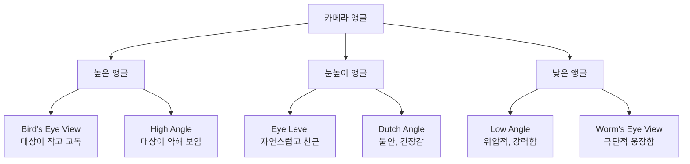
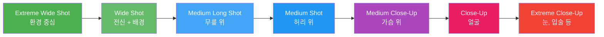
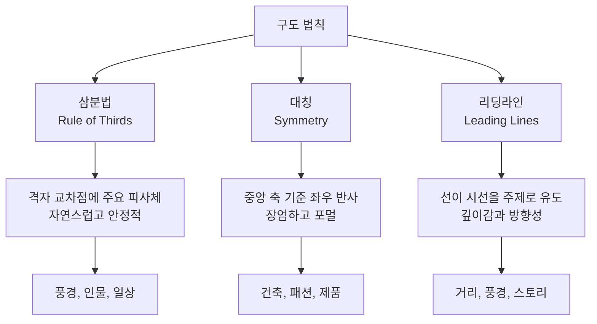
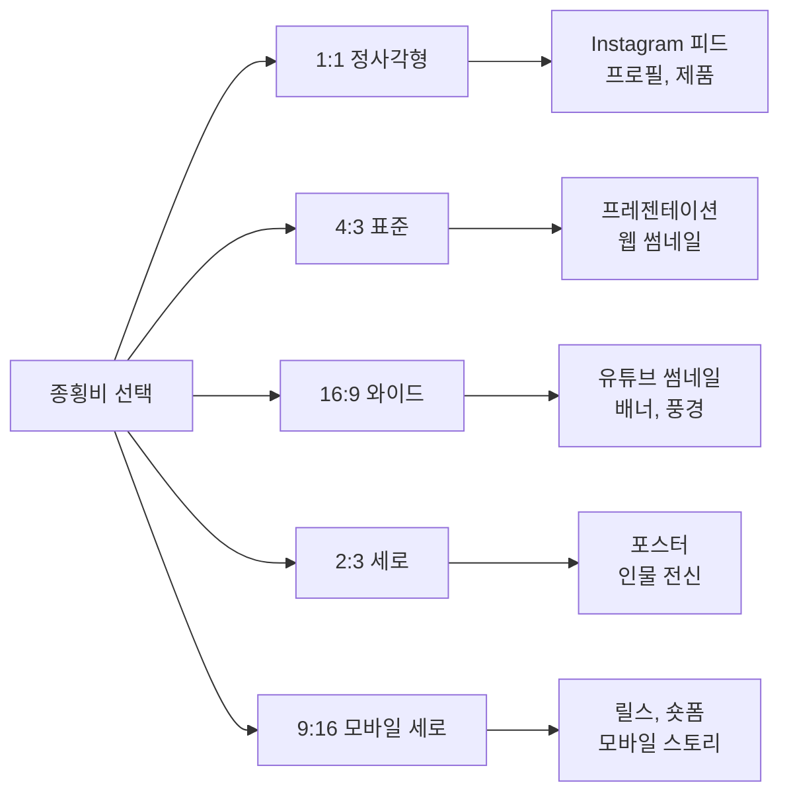
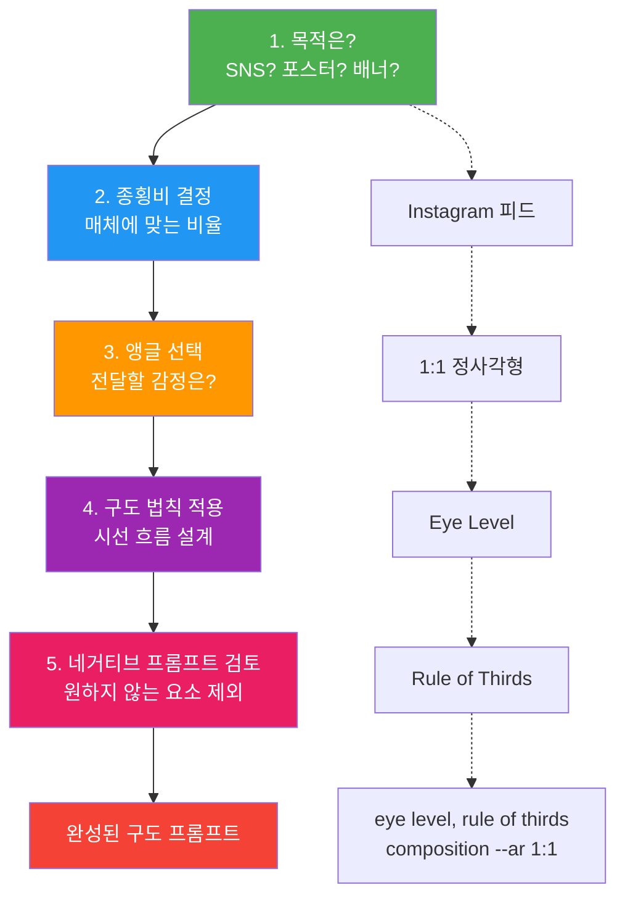
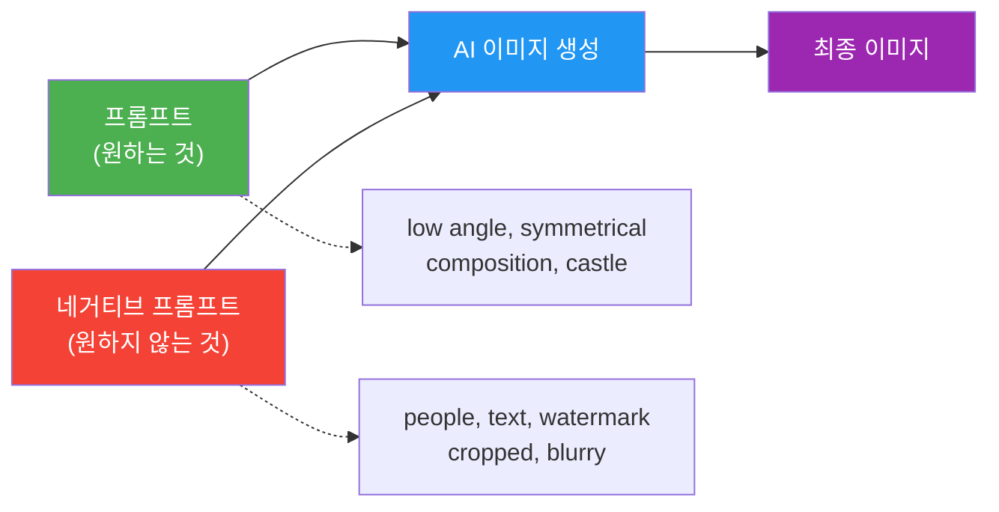

# 구도와 앵글 — 시선을 이끄는 프레이밍

> 카메라 앵글과 구도 키워드 하나로 같은 프롬프트가 완전히 다른 이미지가 되는 마법을 배웁니다.

## 개요

앞서 [01. 프롬프트 해부학 — 6요소 프레임워크](02-ch2-프롬프트-구조-마스터/01-01-프롬프트-해부학-6요소-프레임워크.md)에서 프롬프트의 6가지 구성 요소를 배웠고, [02. 주제와 스타일 — 무엇을 어떤 느낌으로](02-ch2-프롬프트-구조-마스터/02-02-주제와-스타일-무엇을-어떤-느낌으로.md)에서 **무엇을**(주제) **어떤 느낌으로**(스타일) 표현할지 익혔습니다. 이번 세션에서는 6요소 중 세 번째 축인 **구도(Composition)**를 집중 탐구합니다.

**선수 지식**: 6요소 프레임워크의 구조, 주제 구체성 레벨, 스타일 키워드 분류
**학습 목표**:
- 카메라 앵글 키워드(bird's eye view, low angle, close-up 등)의 효과를 설명할 수 있다
- 구도 법칙(삼분법, 대칭, 리딩라인)을 프롬프트에 적용하여 시선을 유도할 수 있다
- 종횡비(aspect ratio)가 구도와 분위기에 미치는 영향을 이해하고 적절히 선택할 수 있다
- 앵글 + 구도 법칙 + 종횡비를 조합한 프롬프트를 작성할 수 있다
- 네거티브 프롬프트로 원하지 않는 구도 요소를 제외하는 개념을 이해할 수 있다

## 왜 알아야 할까?

같은 주제, 같은 스타일이라도 **어디에서 바라보느냐**에 따라 이미지의 감정이 180도 달라집니다. 하늘에서 내려다보면 대상은 작고 고독해 보이고, 아래에서 올려다보면 웅장하고 강력해 보이죠. 영화감독이 한 장면을 촬영할 때 카메라 위치를 몇 시간이고 고민하는 이유가 바로 이겁니다.

AI 이미지 생성에서도 마찬가지입니다. "a castle on a cliff"라는 프롬프트에 `bird's eye view`를 붙이면 지도처럼 펼쳐진 풍경 속 작은 성이 되고, `low angle shot`을 붙이면 하늘을 찌르는 위압적인 성이 됩니다. 키워드 하나가 카메라맨의 역할을 대신하는 셈이죠.

디자이너라면 구도는 단순한 기술이 아니라 **메시지 전달의 핵심 도구**입니다. SNS 썸네일, 광고 배너, 프레젠테이션 슬라이드 — 각각의 매체에 최적화된 구도가 있고, 그 구도를 프롬프트 한 줄로 지정할 수 있다면 작업 효율이 비약적으로 올라갑니다.

## 핵심 개념

### 개념 1: 카메라 앵글 — AI에게 "어디서 찍어"라고 말하기

> 💡 **비유**: 카메라 앵글은 놀이공원의 관람차와 같습니다. 관람차 꼭대기에서 내려다보면 사람들이 개미처럼 보이고(bird's eye view), 관람차 아래에서 올려다보면 구조물이 거대하게 보이죠(low angle). 같은 놀이공원인데 보는 높이에 따라 완전히 다른 세계가 됩니다.

AI 이미지 생성에서 카메라 앵글 키워드는 가상의 카메라를 원하는 위치에 배치하는 지시문입니다. 대부분의 AI 플랫폼(ChatGPT, Gemini, Midjourney)은 사진과 영화에서 사용하는 표준 촬영 용어를 잘 이해합니다.

> 📊 **그림 1**: 카메라 앵글 키워드와 감정 효과

**주요 앵글 키워드와 효과:**

| 키워드 | 카메라 위치 | 감정 효과 | 추천 상황 |
|--------|-----------|----------|----------|
| `bird's eye view` | 하늘에서 수직 아래 | 전체 맥락, 고독, 패턴 | 풍경, 도시 계획, 패턴 아트 |
| `high angle shot` | 위에서 비스듬히 아래 | 약함, 귀여움, 관찰자 시점 | 음식 사진, 캐릭터 귀여움 표현 |
| `eye level` | 대상과 같은 높이 | 자연스러움, 친근함, 공감 | 인물 초상, 제품 사진 |
| `low angle shot` | 아래에서 위로 | 위압감, 권력, 웅장함 | 건축물, 영웅 포즈, 권위 |
| `worm's eye view` | 바닥에서 수직 위로 | 극단적 웅장함, 초현실 | 고층 빌딩, 드라마틱 씬 |
| `dutch angle` | 기울어진 카메라 | 불안, 긴장, 역동성 | 스릴러 장면, 액션 씬 |

**프롬프트 예시 비교 — 같은 주제, 다른 앵글:**

> "a lone samurai standing in a bamboo forest"

- `+ bird's eye view` → 대나무 숲 사이로 점처럼 보이는 사무라이, 고독한 분위기
- `+ eye level` → 사무라이와 눈을 마주치는 듯한 친근하고 극적인 구도
- `+ low angle shot` → 대나무를 뚫고 하늘을 배경으로 우뚝 선 영웅적 사무라이
- `+ dutch angle` → 기울어진 시점에서 긴장감 넘치는 전투 직전의 순간

> ⚠️ **흔한 오해**: "앵글 키워드는 사진 전공자만 아는 전문 용어다"라고 생각하기 쉽지만, AI는 일상적인 표현도 잘 이해합니다. `looking down from above`나 `shot from below`처럼 자연어로 써도 비슷한 효과를 얻을 수 있어요. 다만 `bird's eye view`처럼 정립된 용어가 더 일관된 결과를 만들어 줍니다.

### 개념 2: 샷 사이즈 — 대상을 얼마나 담을 것인가

> 💡 **비유**: 친구의 사진을 찍을 때를 생각해 보세요. 얼굴만 클로즈업하면 표정과 감정이 또렷해지고, 전신을 담으면 옷차림과 자세가 보이며, 뒤로 한참 물러나면 배경 속 작은 사람이 됩니다. 이것이 바로 샷 사이즈의 원리입니다.

샷 사이즈는 프레임 안에 대상을 **얼마나 크게 또는 작게** 담을지를 결정합니다. 앵글이 "어디서 찍느냐"의 문제라면, 샷 사이즈는 "얼마나 가까이 찍느냐"의 문제인 거죠.

> 📊 **그림 2**: 샷 사이즈 스펙트럼 — 넓음에서 좁음으로

**핵심 샷 사이즈 가이드:**

| 샷 사이즈 | 프레임 범위 | 강조 포인트 | 활용 예 |
|----------|-----------|-----------|--------|
| `extreme wide shot` | 대상이 배경의 일부 | 환경, 스케일, 고립감 | 영화 오프닝, 풍경 |
| `wide shot` / `full shot` | 대상 전신 + 배경 | 맥락, 상황 설명 | 패션, 공간 디자인 |
| `medium shot` | 허리 위 | 제스처, 상호작용 | 대화 장면, 프로필 |
| `close-up` | 얼굴 | 감정, 표정, 디테일 | 초상, 감정 표현 |
| `extreme close-up` | 눈, 입술, 손 등 | 질감, 극도의 디테일 | 뷰티, 감성 컷 |

> 🔥 **실무 팁**: SNS 콘텐츠를 만들 때 `close-up`과 `medium shot`이 가장 범용적입니다. Instagram 피드용 인물 사진이라면 `medium close-up portrait` 조합이 거의 실패하지 않는 안전한 선택이에요.

### 개념 3: 구도 법칙 — 시선을 설계하는 보이지 않는 격자

> 💡 **비유**: 마트에서 고객의 동선을 설계하는 것과 같습니다. 마트 입구에 과일을 놓고, 필수품인 우유를 가장 안쪽에 배치하여 고객이 매장 전체를 돌게 만들죠. 구도 법칙도 마찬가지로, 이미지 안에서 보는 사람의 **시선이 어디로 가는지를 설계**하는 것입니다.

사진과 미술에서 수백 년간 검증된 구도 법칙들이 있는데, 놀랍게도 AI도 이 법칙들을 프롬프트 키워드로 이해합니다.

> 📊 **그림 3**: 3대 구도 법칙의 시선 흐름 비교

**1. 삼분법(Rule of Thirds)**

화면을 가로 3등분, 세로 3등분하여 9개 영역으로 나눈 뒤, 격자선의 교차점(4개)에 주요 피사체를 배치하는 기법입니다. 정중앙 배치보다 시각적으로 더 자연스럽고 역동적인 느낌을 줍니다.

- **프롬프트 키워드**: `rule of thirds composition`, `subject placed on the left third`
- **효과**: 시선이 자연스럽게 피사체에 머물면서도 주변 배경을 함께 감상하게 됨
- **추천 상황**: 풍경 사진, 인물 사진, 제품 사진 등 거의 모든 장면에 유효

**2. 대칭 구도(Symmetry)**

중앙 축을 기준으로 좌우(또는 상하)가 거울처럼 반사되는 구도입니다. 인간은 본능적으로 대칭에서 안정감과 아름다움을 느낍니다.

- **프롬프트 키워드**: `symmetrical composition`, `perfect symmetry`, `centered composition`
- **효과**: 장엄함, 질서, 포멀한 분위기
- **추천 상황**: 건축 사진, 패션 에디토리얼, 제품 히어로 샷, 종교적/의식적 장면

**3. 리딩라인(Leading Lines)**

길, 강, 울타리, 건물 모서리 등 이미지 안의 선(line)이 보는 사람의 시선을 자연스럽게 주요 피사체로 이끄는 기법입니다.

- **프롬프트 키워드**: `leading lines`, `a winding path leading to`, `converging lines`
- **효과**: 깊이감(depth), 방향성, 스토리의 흐름
- **추천 상황**: 풍경, 도시 사진, 터널/복도, 스토리텔링 장면

**그 외 유용한 구도 키워드:**

| 키워드 | 설명 | 감정 효과 |
|--------|------|----------|
| `golden ratio` | 황금비 나선을 따르는 배치 | 자연스러운 우아함 |
| `negative space` | 빈 공간을 의도적으로 활용 | 미니멀, 고급스러움 |
| `diagonal composition` | 대각선 배치 | 역동성, 긴장감 |
| `framing` | 문, 창문 등으로 피사체를 감싸기 | 집중, 깊이감 |
| `foreground-background separation` | 전경과 배경의 명확한 분리 | 입체감, 레이어 |

### 개념 4: 종횡비(Aspect Ratio) — 캔버스의 모양이 구도를 바꾼다

> 💡 **비유**: 종이에 그림을 그릴 때 정사각형 종이와 긴 직사각형 종이에 같은 풍경을 그리면 전혀 다른 느낌이 되죠? 정사각형에는 주제가 꽉 차고, 가로로 긴 종이에는 파노라마처럼 넓은 풍경이 자연스럽습니다. AI도 종횡비에 따라 구도를 다르게 해석합니다.

종횡비는 이미지의 가로와 세로 비율을 의미합니다. 단순히 이미지를 자르는 것이 아니라, AI가 생성 과정에서 **종횡비에 맞는 구도를 능동적으로 재해석**한다는 점이 핵심입니다.

> 📊 **그림 4**: 종횡비별 용도와 구도 특성

**주요 종횡비 가이드:**

| 종횡비 | 특성 | 구도 효과 | 대표 매체 |
|--------|------|----------|----------|
| `--ar 1:1` | 정사각형 | 중앙 집중, 대칭에 유리 | Instagram 피드, 앨범 커버 |
| `--ar 4:3` | 약간 가로 | 자연스러운 프레이밍 | 웹 썸네일, 프레젠테이션 |
| `--ar 3:2` | 사진 표준 | 전통적 사진 느낌 | 인쇄물, 사진 프레임 |
| `--ar 16:9` | 와이드스크린 | 파노라마, 수평선 강조 | 유튜브, 배너, 시네마 |
| `--ar 2:3` | 세로 직사각형 | 인물 전신, 수직 요소 강조 | 포스터, Pinterest |
| `--ar 9:16` | 모바일 세로 | 수직 시선 흐름 | 릴스, TikTok, 스토리 |

> 💡 **알고 계셨나요?**: Midjourney에서 `--ar` 파라미터를 사용할 때 소수점은 사용할 수 없습니다. 예를 들어 `1.39:1` 대신 `139:100`으로 입력해야 합니다. 또한 최적의 결과를 위해 `1:2`에서 `2:1` 사이의 비율을 권장하고 있어요.

**종횡비와 앵글의 시너지:**

종횡비와 카메라 앵글을 함께 사용하면 훨씬 강력한 구도 제어가 가능합니다.

- `bird's eye view` + `--ar 1:1` → 정사각형 안에서 패턴처럼 펼쳐지는 위성 뷰
- `low angle shot` + `--ar 9:16` → 세로로 솟아오르는 건물이나 인물의 웅장함 극대화
- `wide shot` + `--ar 16:9` → 영화의 한 장면 같은 시네마틱 풍경
- `close-up portrait` + `--ar 2:3` → 포스터 느낌의 인물 클로즈업

### 개념 5: 앵글 + 구도 + 종횡비 조합 전략

> 💡 **비유**: 요리에서 식재료(주제), 조리법(스타일)을 정했다면, 이제 그릇(종횡비)을 고르고 플레이팅(구도)을 하고 테이블 세팅(앵글)을 하는 단계입니다. 이 세 가지가 조화를 이뤄야 완성된 한 접시가 됩니다.

구도 관련 키워드를 실전에서 조합할 때는 **목적 → 종횡비 → 앵글 → 구도 법칙** 순서로 결정하면 실패가 적습니다.

> 📊 **그림 5**: 구도 결정 워크플로우

**실전 조합 예시:**

| 목적 | 종횡비 | 앵글 | 구도 법칙 | 프롬프트 추가 키워드 |
|------|--------|------|----------|-------------------|
| 유튜브 썸네일 | 16:9 | Eye Level | 삼분법 | `eye level, rule of thirds --ar 16:9` |
| 영웅 포스터 | 2:3 | Low Angle | 중앙 대칭 | `low angle, centered symmetrical --ar 2:3` |
| 음식 사진 | 1:1 | High Angle | 네거티브 스페이스 | `high angle, negative space --ar 1:1` |
| 시네마틱 풍경 | 21:9 | Eye Level | 리딩라인 | `eye level, leading lines --ar 21:9` |
| 모바일 스토리 | 9:16 | Low Angle | 대각선 | `low angle, diagonal composition --ar 9:16` |

### 개념 6: 네거티브 프롬프트 — 원하지 않는 구도를 제외하기

> 💡 **비유**: 카페에서 주문할 때 "아이스 아메리카노 주세요"라고 원하는 것을 말하는 것이 일반 프롬프트라면, "시럽은 빼주세요"라고 원하지 않는 것을 명시하는 것이 네거티브 프롬프트(Negative Prompt)입니다. AI에게 "이건 넣지 마"라고 말하는 거죠.

지금까지 배운 앵글, 샷 사이즈, 구도 법칙은 모두 **"이것을 넣어줘"**라는 긍정적 지시였습니다. 하지만 실전에서는 **"이것만은 빼줘"**라고 말해야 할 때도 많습니다. 로우앵글로 건물을 촬영하고 싶은데 자꾸 사람이 등장한다거나, 대칭 구도를 원하는데 비뚤어진 요소가 끼어든다거나 하는 상황이죠.

이때 사용하는 것이 **네거티브 프롬프트(Negative Prompt)**입니다. 원하지 않는 구도 요소, 오브젝트, 스타일을 명시적으로 제외하는 기법입니다.

> 📊 **그림 6**: 프롬프트와 네거티브 프롬프트의 협업 구조

**구도 관련 네거티브 프롬프트 활용 예시:**

| 원하는 구도 | 자주 발생하는 문제 | 네거티브 프롬프트 |
|------------|------------------|-----------------|
| 대칭 구도 | 비대칭 요소 등장 | `asymmetrical, tilted, unbalanced` |
| 클로즈업 초상 | 몸통이 잘려 보임 | `full body, wide shot, cropped awkwardly` |
| 미니멀 네거티브 스페이스 | 배경이 복잡해짐 | `cluttered background, busy, crowded` |
| 깔끔한 제품 사진 | 텍스트나 워터마크 | `text, watermark, logo, signature` |

플랫폼마다 네거티브 프롬프트를 입력하는 방식이 다릅니다. 현재 단계에서는 개념만 이해해 두면 충분하고, 구체적인 플랫폼별 사용법은 이후 챕터에서 다룹니다. 특히 [Ch5. Midjourney 마스터](05-ch5-midjourney-마스터/01-01-midjourney-시작하기-가입부터-첫-이미지까지.md)에서 `--no` 파라미터를 활용해 원하지 않는 요소를 정밀하게 제거하는 실전 기법을 배우게 됩니다.

> 🔥 **실무 팁**: 네거티브 프롬프트는 구도뿐 아니라 품질 관리에도 유용합니다. `blurry, low quality, distorted, deformed`를 기본으로 깔아두면 전반적인 이미지 퀄리티가 올라가요. 자주 쓰는 네거티브 프롬프트 세트를 미리 만들어두면 작업 속도가 빨라집니다.

## 실습: 적용해보기

### 활동 1: 앵글 변환 실험

아래 기본 프롬프트에 서로 다른 앵글 키워드를 추가하여 결과를 비교해 보세요.

**기본 프롬프트**: "a vintage red telephone booth on a rainy London street, cinematic lighting"

1. `bird's eye view` 추가 → 결과 관찰: 어떤 감정이 느껴지나요?
2. `eye level` 추가 → 결과 관찰: 1번과 어떻게 다른가요?
3. `low angle shot` 추가 → 결과 관찰: 전화 부스의 존재감이 어떻게 변했나요?
4. `extreme close-up` 추가 → 결과 관찰: 무엇이 강조되나요?

각 결과물을 나란히 놓고 **가장 "비 오는 런던의 고독함"을 잘 전달하는 앵글**이 어떤 것인지 판단해 보세요.

### 활동 2: 구도 법칙 적용 워크시트

아래 시나리오에 맞는 구도 키워드를 선택하고, 완성된 프롬프트를 작성하세요.

| 시나리오 | 전달할 메시지 | 추천 구도 법칙 | 나의 프롬프트 |
|----------|-------------|--------------|-------------|
| 카페 인테리어 사진 | 아늑하고 따뜻한 공간 | ? | (직접 작성) |
| 스포츠 브랜드 광고 | 역동적이고 강인한 에너지 | ? | (직접 작성) |
| 명상 앱 배경 이미지 | 고요하고 평화로운 분위기 | ? | (직접 작성) |
| 여행 블로그 커버 | 탐험과 모험의 설렘 | ? | (직접 작성) |

### 활동 3: 매체별 종횡비 프롬프트 작성

하나의 주제를 정하고(예: "a futuristic city at sunset"), 아래 매체별로 종횡비와 구도를 바꿔가며 프롬프트를 작성해 보세요.

1. **Instagram 피드** (1:1) — 어떤 앵글과 구도가 정사각형에 가장 잘 맞나요?
2. **유튜브 썸네일** (16:9) — 수평으로 넓은 프레임을 활용하려면?
3. **TikTok/릴스** (9:16) — 세로로 긴 프레임에서 시선을 어떻게 유도하나요?
4. **영화 포스터** (2:3) — 인물과 배경의 배치를 어떻게 설계하나요?

### 활동 4: 네거티브 프롬프트로 구도 정리하기

아래 프롬프트를 실행했을 때 자주 나타나는 문제를 예상하고, 네거티브 프롬프트를 설계해 보세요.

| 프롬프트 | 원하는 결과 | 예상 문제 | 나의 네거티브 프롬프트 |
|----------|-----------|----------|---------------------|
| `symmetrical temple interior, golden hour` | 완벽한 좌우 대칭 | 비대칭 요소, 사람 등장 | (직접 작성) |
| `close-up of a cat's eye, macro photography` | 눈동자만 가득 찬 프레임 | 전체 얼굴 등장, 배경 복잡 | (직접 작성) |
| `minimalist product photo, white sneaker` | 깔끔한 배경의 제품샷 | 텍스트, 복잡한 배경 | (직접 작성) |

## 더 깊이 알아보기

### 삼분법의 기원 — 18세기 화가의 발견

삼분법(Rule of Thirds)은 1797년 영국의 화가이자 판화가인 **존 토머스 스미스(John Thomas Smith)**가 저서 *Remarks on Rural Scenery*에서 처음 명문화했습니다. 그는 풍경화에서 하늘과 땅의 비율을 1:2 또는 2:1로 나누면 더 역동적이고 자연스러운 구도가 된다고 주장했죠.

사실 이 원리의 뿌리는 훨씬 더 깊습니다. 고대 그리스의 **황금비(Golden Ratio, 약 1:1.618)**가 수학적 기초이고, 르네상스 화가들은 이를 무의식적으로 활용해왔습니다. 레오나르도 다빈치의 *최후의 만찬*에서 예수 그리스도가 정확히 삼분법 교차점에 위치하는 것은 우연이 아닙니다.

### 영화가 앵글에 부여한 문법

영화의 역사에서 카메라 앵글에 감정적 의미를 체계적으로 부여한 것은 **독일 표현주의 영화**(1920년대)가 시작이었습니다. 프리츠 랑(Fritz Lang) 감독의 *메트로폴리스*(1927)에서는 권력자를 로우앵글로, 노동자를 하이앵글로 촬영하여 계급의 차이를 시각적으로 표현했습니다.

이후 알프레드 히치콕은 *사이코*(1960)에서 더치 앵글을 활용해 관객의 불안감을 극대화했고, 이 "앵글 = 감정" 문법은 오늘날까지 영화, 광고, 게임, 그리고 AI 이미지 생성에서 그대로 통용됩니다.

## 흔한 오해와 팁

> ⚠️ **흔한 오해**: "구도 키워드를 여러 개 넣으면 더 좋은 구도가 나온다"고 생각하기 쉽습니다. 하지만 `rule of thirds, symmetrical composition, leading lines, golden ratio`를 동시에 넣으면 AI가 혼란에 빠져 어느 것도 제대로 반영하지 못합니다. **한 번에 하나의 구도 법칙**을 명확히 지정하는 것이 핵심입니다.

> ⚠️ **흔한 오해**: "네거티브 프롬프트는 고급 기능이라 초보자는 몰라도 된다"고 생각하는 분이 많은데요. 사실 네거티브 프롬프트야말로 초보자가 **가장 빨리 결과물 품질을 높일 수 있는 도구**입니다. `blurry, low quality, cropped` 세 단어만 추가해도 체감 품질이 확 달라지거든요.

> 💡 **알고 계셨나요?**: Midjourney에서 `--ar` 파라미터는 단순히 이미지를 잘라내는 게 아닙니다. AI가 생성 과정 자체에서 종횡비를 해석하여 구도를 능동적으로 재구성합니다. 같은 프롬프트라도 `--ar 1:1`과 `--ar 16:9`에서 AI가 배치하는 요소의 위치와 크기가 완전히 달라집니다.

> 🔥 **실무 팁**: 클라이언트에게 시안을 보여줄 때, 같은 프롬프트를 3가지 앵글로 생성하여 비교안으로 제시하면 전문성이 돋보입니다. 특히 `eye level` → `low angle` → `bird's eye view` 3종 세트는 거의 모든 주제에서 극적인 차이를 보여주는 만능 조합이에요.

## 핵심 정리

| 개념 | 설명 |
|------|------|
| 카메라 앵글 | 가상 카메라의 높이와 각도를 지정하여 대상의 감정적 인상을 제어 |
| 샷 사이즈 | 프레임 안에 대상을 얼마나 크게/작게 담을지 결정 (extreme wide ~ extreme close-up) |
| 삼분법 | 화면을 9등분하여 교차점에 피사체를 배치하는 가장 범용적인 구도 법칙 |
| 대칭 구도 | 중앙 축 기준 좌우 대칭으로 장엄함과 질서감 전달 |
| 리딩라인 | 이미지 내 선 요소로 시선을 주제로 유도하여 깊이감 부여 |
| 종횡비(--ar) | 캔버스 비율이 AI의 구도 해석을 변화시킴 — 매체에 맞는 선택이 중요 |
| 네거티브 프롬프트 | 원하지 않는 구도 요소나 오브젝트를 명시적으로 제외하는 기법 |
| 조합 전략 | 목적 → 종횡비 → 앵글 → 구도 법칙 → 네거티브 프롬프트 순서로 결정 |

## 다음 섹션 미리보기

구도와 앵글로 **어디서, 어떻게 프레이밍**할지를 배웠다면, 다음 세션 [04. 조명과 매체 — 빛과 질감으로 깊이 더하기](02-ch2-프롬프트-구조-마스터/04-04-조명과-매체-빛과-질감으로-깊이-더하기.md)에서는 6요소 중 **조명(Lighting)**과 **매체(Medium)** 키워드를 다룹니다. 같은 구도라도 빛의 방향과 질감이 바뀌면 분위기가 완전히 달라지거든요. 골든아워, 네온, 수채화, 유화 — 이런 키워드들이 이미지에 어떤 깊이를 더하는지 함께 탐구합니다.

## 참고 자료

- [Midjourney Aspect Ratio 공식 문서](https://docs.midjourney.com/hc/en-us/articles/31894244298125-Aspect-Ratio) - Midjourney에서 --ar 파라미터의 공식 사용법과 제한사항을 확인할 수 있는 필수 레퍼런스
- [How to Write AI Image Prompts Like a Pro (Let's Enhance)](https://letsenhance.io/blog/article/ai-text-prompt-guide/) - 구도, 앵글, 스타일 등 AI 이미지 프롬프트 작성의 종합 가이드
- [Master Guide to Camera Angles and Shot Types for AI Generation (MimicPC)](https://www.mimicpc.com/learn/master-guide-to-camera-angles-and-shot-types-for-AI-image-and-video-generation) - AI 이미지 생성을 위한 카메라 앵글과 샷 타입의 체계적 분류와 예시
- [42 Cinematic AI Prompts to Master Composition (Atlabs)](https://www.atlabs.ai/blog/42-cinematic-ai-composition-prompts-guide) - 삼분법, 리딩라인, 대칭 등 구도 법칙을 AI 프롬프트에 적용하는 실전 가이드
- [Simple Composition Tricks to Instantly Improve AI Images (Civitai)](https://civitai.com/articles/16602/simple-composition-tricks-to-instantly-improve-ai-images-with-prompts) - 구도 키워드만으로 AI 이미지 품질을 높이는 실용적인 팁 모음

---
### 🔗 Related Sessions
- [프롬프트](01-ch1-ai-이미지-생성-개론/01-01-생성형-ai가-바꾸는-디자인-워크플로우.md) (prerequisite)
- [6요소 프레임워크](02-ch2-프롬프트-구조-마스터/01-01-프롬프트-해부학-6요소-프레임워크.md) (prerequisite)
- [주제(subject)](02-ch2-프롬프트-구조-마스터/01-01-프롬프트-해부학-6요소-프레임워크.md) (prerequisite)
- [스타일(style)](02-ch2-프롬프트-구조-마스터/01-01-프롬프트-해부학-6요소-프레임워크.md) (prerequisite)
