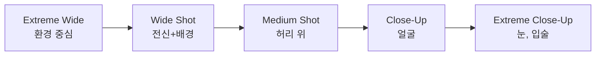
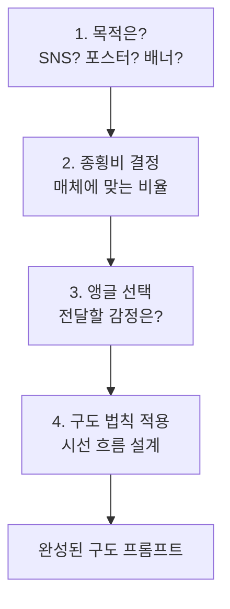

# 구도와 앵글 — 시선을 이끄는 프레이밍

> 같은 주제, 같은 스타일이라도 카메라 앵글 하나로 이미지의 감정이 180도 달라집니다.

## 개요

"a castle on a cliff"에 `bird's eye view`를 붙이면 지도처럼 펼쳐진 풍경 속 작은 성이 되고, `low angle shot`을 붙이면 하늘을 찌르는 위압적인 성이 됩니다. 키워드 하나가 카메라맨의 역할을 대신하는 거예요.

**학습 목표**:
- 카메라 앵글 키워드의 감정 효과를 이해한다
- 구도 법칙(삼분법, 대칭, 리딩라인)을 프롬프트에 적용한다
- 종횡비(aspect ratio)가 구도에 미치는 영향을 알고 적절히 선택한다

## 카메라 앵글 — "어디서 찍어"

| 키워드 | 카메라 위치 | 감정 효과 | 추천 상황 |
|--------|-----------|----------|----------|
| `bird's eye view` | 하늘에서 수직 아래 | 전체 맥락, 고독, 패턴 | 풍경, 도시, 패턴 아트 |
| `high angle shot` | 위에서 비스듬히 | 약함, 귀여움, 관찰자 | 음식 사진, 캐릭터 |
| `eye level` | 같은 높이 | 자연스러움, 친근함 | 인물 초상, 제품 사진 |
| `low angle shot` | 아래에서 위로 | 위압감, 웅장함 | 건축물, 영웅 포즈 |
| `worm's eye view` | 바닥에서 수직 위 | 극단적 웅장함 | 고층 빌딩, 드라마 |
| `dutch angle` | 기울어진 카메라 | 불안, 긴장, 역동 | 스릴러, 액션 |

### 같은 주제, 다른 앵글 — 직접 비교해보세요

```
a lone samurai standing in a bamboo forest, bird's eye view
```


```
a lone samurai standing in a bamboo forest, eye level shot
```


```
a lone samurai standing in a bamboo forest, low angle shot
```


```
a lone samurai standing in a bamboo forest, dutch angle, dramatic tension
```


### 앵글 활용 프롬프트 모음

**음식 사진 — 하이앵글이 제격:**
```
a beautifully plated pasta dish with fresh basil and parmesan, high angle overhead shot, rustic wooden table, natural window light
```


**건축물 — 로우앵글로 웅장하게:**
```
a Gothic cathedral with flying buttresses, low angle shot looking up, dramatic cloudy sky, architectural photography
```


**도시 패턴 — 버즈아이로 그래픽하게:**
```
a colorful neighborhood in Busan with rooftop gardens, bird's eye view, geometric patterns, vibrant colors
```


## 샷 사이즈 — 얼마나 가까이 찍을까



**샷 사이즈별 프롬프트 예시:**

```
a woman in a red dress walking through a golden wheat field, extreme wide shot, tiny figure in vast landscape
```


```
a woman in a red dress walking through a golden wheat field, medium shot, wind in her hair
```


```
a woman in a red dress, close-up portrait, golden wheat field bokeh background, warm sunlight on her face
```


```
a woman's eye reflecting a golden wheat field, extreme close-up, macro detail, golden hour light
```


> 🔥 **실무 팁**: SNS 콘텐츠에는 `close-up`과 `medium shot`이 가장 범용적이에요. Instagram 피드용이라면 `medium close-up portrait`이 거의 실패하지 않는 선택입니다.

## 구도 법칙

### 삼분법 (Rule of Thirds)

화면을 9등분, 교차점에 주요 피사체 배치. 가장 범용적인 법칙.

```
a lighthouse on a rocky coast at sunset, rule of thirds composition, lighthouse placed on the right third, dramatic sky on the left
```


### 대칭 구도 (Symmetry)

중앙 축 기준 좌우 대칭. 장엄함과 질서.

```
an ornate mosque interior with perfect symmetry, centered composition, geometric patterns, golden light streaming through windows
```


### 리딩라인 (Leading Lines)

길, 강, 건물 모서리 등으로 시선을 주제로 이끄는 기법.

```
a winding path through a lavender field leading to a small cottage, leading lines composition, soft afternoon light
```


### 기타 구도 키워드

```
a single red umbrella on an empty beach, negative space composition, minimalist, vast sky above
```


```
a cat seen through an arched doorway in a Mediterranean village, framing composition, blue and white walls
```


## 종횡비 (Aspect Ratio) — 캔버스 모양이 구도를 바꾼다

| 종횡비 | 특성 | 대표 매체 |
|--------|------|----------|
| `1:1` | 중앙 집중, 대칭에 유리 | Instagram 피드, 앨범 커버 |
| `4:3` | 자연스러운 프레이밍 | 웹 썸네일, 프레젠테이션 |
| `16:9` | 파노라마, 수평선 강조 | 유튜브, 배너 |
| `2:3` | 인물 전신, 수직 요소 | 포스터, Pinterest |
| `9:16` | 수직 시선 흐름 | 릴스, TikTok, 스토리 |

**종횡비 + 앵글 시너지 예시:**

```
a neon-lit Tokyo alley at night, low angle shot, 9:16 vertical composition, rain reflections, cyberpunk atmosphere
```


```
a vast desert landscape with sand dunes at golden hour, wide shot, 16:9 cinematic composition, leading lines
```


```
a coffee cup on a marble table, overhead shot, 1:1 square composition, minimalist, clean negative space
```


> 💡 **Midjourney 팁**: `--ar 16:9`처럼 파라미터로 종횡비를 지정해요. `1:2`에서 `2:1` 사이 비율이 최적입니다.

## 구도 결정 워크플로우



**실전 조합 예시:**

```
a superhero landing pose on a rooftop, low angle shot, centered symmetrical composition, dramatic storm clouds, 2:3 poster format
```


```
a flat lay of travel essentials — passport, camera, sunglasses, map, high angle overhead shot, 1:1 square, clean white background, negative space
```


```
a train track stretching into misty mountains, eye level, leading lines, 16:9 cinematic, moody atmosphere
```


## 실습: 직접 비교해보기

### 활동 1: 앵글 변환 실험

이 프롬프트에 4가지 앵글을 각각 추가해서 결과를 비교해보세요:

```
a vintage red telephone booth on a rainy London street, cinematic lighting
```

추가할 앵글: `bird's eye view` → `eye level` → `low angle shot` → `extreme close-up`

### 활동 2: 매체별 종횡비 프롬프트

하나의 주제로 3가지 매체 포맷을 만들어보세요:

```
a futuristic city at sunset, bird's eye view, 1:1 square, Instagram feed format
```

```
a futuristic city at sunset, wide shot, 16:9 cinematic, YouTube thumbnail format
```

```
a futuristic city at sunset, low angle, 9:16 vertical, TikTok/Reels format
```

## 팁과 주의사항

> ⚠️ 구도 키워드를 여러 개 동시에 넣지 마세요. `rule of thirds, symmetrical, leading lines`를 한꺼번에 넣으면 AI가 혼란에 빠져요. **한 번에 하나의 구도 법칙**을 지정하세요.

> 🔥 **실무 팁**: 클라이언트 시안에 같은 프롬프트를 `eye level` → `low angle` → `bird's eye view` 3종으로 제시하면 전문성이 돋보여요.

> 💡 자연어도 OK: `looking down from above`처럼 써도 비슷한 효과를 얻을 수 있어요. 다만 `bird's eye view` 같은 정립된 용어가 더 일관된 결과를 만듭니다.

## 핵심 정리

| 개념 | 설명 |
|------|------|
| **카메라 앵글** | 가상 카메라의 높이와 각도로 감정 제어 |
| **샷 사이즈** | 대상을 얼마나 크게/작게 담을지 결정 |
| **삼분법** | 9등분 교차점에 배치 — 가장 범용적 |
| **대칭 구도** | 좌우 대칭으로 장엄함과 질서 |
| **리딩라인** | 선 요소로 시선 유도, 깊이감 |
| **종횡비** | 캔버스 비율이 구도 해석을 변화시킴 |
| **조합 전략** | 목적 → 종횡비 → 앵글 → 구도 법칙 순서 |

## 다음 세션 미리보기

구도와 앵글로 프레이밍을 배웠다면, 다음은 **빛과 질감**입니다. 같은 구도라도 `golden hour`와 `neon lighting`으로 분위기가 완전히 달라지거든요. 조명과 매체 키워드를 마스터해봅시다.
