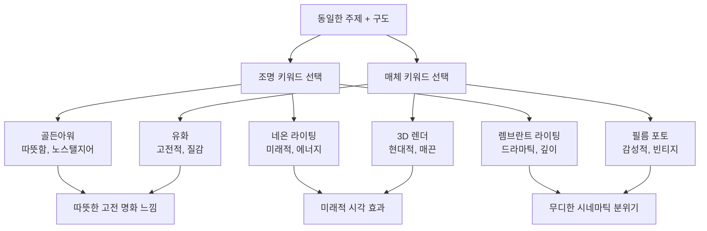
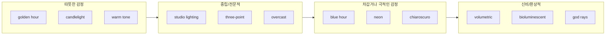
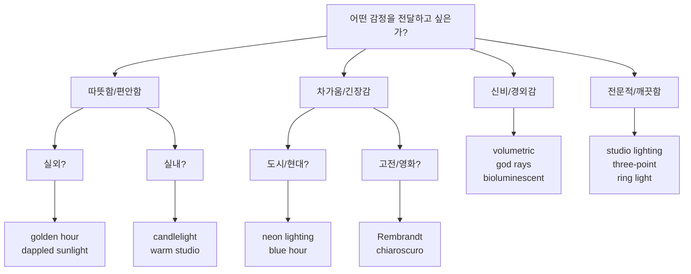
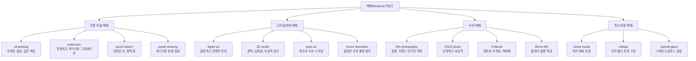
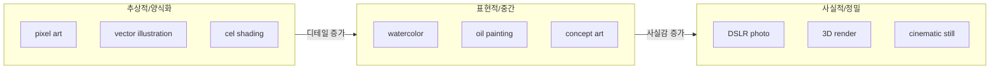
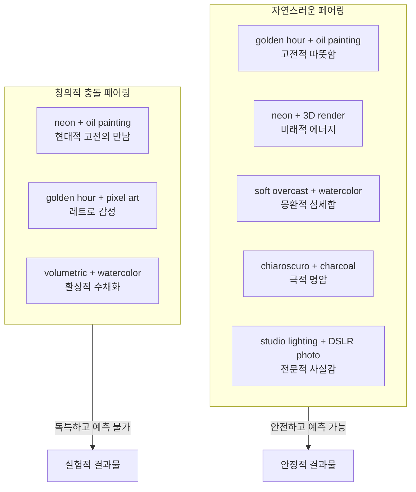
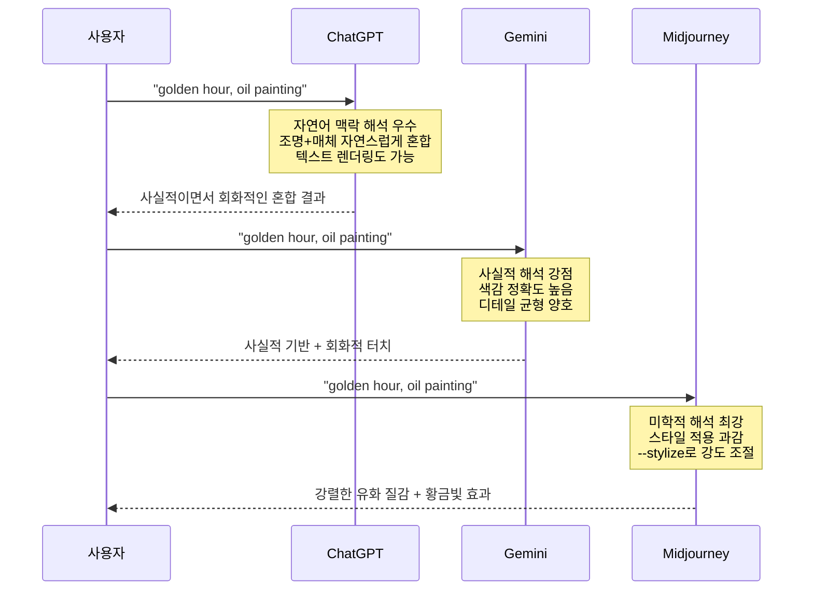

# 조명과 매체 — 빛과 질감으로 깊이 더하기

> 같은 주제, 같은 구도라도 조명과 매체 키워드 하나로 이미지의 분위기가 완전히 달라집니다.

## 개요

이 섹션에서는 프롬프트 6요소 프레임워크 중 네 번째와 다섯 번째 요소인 **조명(Lighting)**과 **매체(Medium)**를 깊이 있게 다룹니다. 앞서 [구도와 앵글](02-ch2-프롬프트-구조-마스터/03-03-구도와-앵글-시선을-이끄는-프레이밍.md)에서 시선을 설계하는 방법을 배웠다면, 이번에는 그 프레임 위에 빛과 질감을 입혀 이미지에 깊이와 감정을 불어넣는 방법을 익힙니다.

두 요소를 한 섹션에서 함께 다루는 이유가 있습니다. 조명과 매체는 실제 이미지 생성에서 **서로 떼어놓을 수 없는 관계**이기 때문이에요. 수채화의 빛 표현 방식과 유화의 빛 표현 방식은 완전히 다르고, 네온 조명이 3D 렌더 위에서 빛나는 방식과 유화 캔버스 위에서 빛나는 방식도 다릅니다. 두 요소를 함께 이해해야 진짜 "깊이 있는" 프롬프트를 쓸 수 있죠. 그래서 각 요소를 충분히 깊게 다루되, 마지막에는 **조합 전략**까지 완성하는 구성으로 진행합니다.

**선수 지식**: [6요소 프레임워크](02-ch2-프롬프트-구조-마스터/01-01-프롬프트-해부학-6요소-프레임워크.md)의 전체 구조, [주제와 스타일](02-ch2-프롬프트-구조-마스터/02-02-주제와-스타일-무엇을-어떤-느낌으로.md)의 구체성 원칙, [구도와 앵글](02-ch2-프롬프트-구조-마스터/03-03-구도와-앵글-시선을-이끄는-프레이밍.md)의 프레이밍 개념

**학습 목표**:
- 조명 키워드(골든아워, 렘브란트, 네온, 볼류메트릭 등)의 시각적 차이를 이해하고 의도에 맞게 선택할 수 있다
- 매체 키워드(유화, 디지털아트, 3D렌더, 필름포토 등)가 결과물의 질감과 느낌에 미치는 영향을 파악한다
- 조명과 매체를 조합하여 하나의 프롬프트에서 깊이와 분위기를 동시에 제어할 수 있다
- 플랫폼별(ChatGPT, Gemini, Midjourney) 조명·매체 키워드 반응 차이를 인지한다

## 왜 알아야 할까?

사진을 찍어본 적 있다면 아실 거예요. 같은 장소, 같은 인물이라도 해 질 무렵에 찍은 사진과 한낮 직사광선 아래에서 찍은 사진은 완전히 다른 느낌을 줍니다. 마찬가지로 연필 스케치와 유화 그림은 같은 풍경을 담아도 전혀 다른 감정을 전달하죠.

AI 이미지 생성에서도 정확히 같은 원리가 작동합니다. "고양이가 창가에 앉아 있다"라는 프롬프트에 `golden hour lighting`을 추가하면 따뜻하고 포근한 분위기가 되고, `neon lighting`을 추가하면 사이버펑크 느낌이 됩니다. `oil painting` 매체를 지정하면 고전적 질감이, `3D render`를 지정하면 현대적이고 매끈한 느낌이 나오죠.

조명과 매체는 이미지의 **감정적 깊이**를 만드는 핵심 도구입니다. 이 두 요소를 자유자재로 다룰 수 있으면, 같은 주제와 구도에서도 수십 가지 전혀 다른 분위기의 결과물을 만들어낼 수 있습니다.

> 📊 **그림 1**: 조명과 매체가 이미지 분위기에 미치는 영향

## 핵심 개념

### 개념 1: 조명 키워드의 세계 — 빛으로 감정 그리기

> 💡 **비유**: 조명 키워드는 무대 조명감독의 역할과 같습니다. 같은 배우가 같은 대사를 해도, 스포트라이트를 어떻게 비추느냐에 따라 관객이 느끼는 감정이 완전히 달라지죠. AI 이미지에서 조명 키워드는 바로 그 "감정의 스위치"입니다.

AI 이미지 생성에서 조명은 단순히 밝기를 조절하는 게 아닙니다. 조명은 **분위기, 깊이감, 시선 유도, 감정 톤**을 한 번에 결정하는 가장 강력한 단일 요소입니다. 주요 조명 키워드를 카테고리별로 살펴보겠습니다.

#### 자연광 계열

| 키워드 | 효과 | 대표 용도 | 프롬프트 예시 |
|--------|------|-----------|-------------|
| `golden hour lighting` | 따뜻한 오렌지-핑크 톤, 긴 그림자 | 인물, 풍경, 감성 콘텐츠 | "portrait of a woman, golden hour lighting, warm glow" |
| `blue hour lighting` | 차가운 파란 톤, 고요한 분위기 | 도시 풍경, 명상적 장면 | "Tokyo cityscape, blue hour lighting, reflections" |
| `overcast lighting` | 부드럽고 균일한 확산광 | 패션, 제품, 자연스러운 인물 | "fashion editorial, overcast diffused light" |
| `dappled sunlight` | 나뭇잎 사이로 비치는 얼룩진 빛 | 숲 속 장면, 동화적 분위기 | "girl reading in a forest, dappled sunlight through leaves" |
| `harsh midday sun` | 강한 대비, 짧은 그림자 | 사막, 여름, 강렬한 인상 | "desert highway, harsh midday sun, high contrast" |
| `sunrise lighting` | 분홍-보라 톤, 여명의 부드러움 | 새벽 풍경, 희망적 장면 | "mountain peak at sunrise, soft pink hues" |
| `moonlight` | 차갑고 은은한 푸른 빛 | 야경, 로맨틱/미스터리 장면 | "garden at night, moonlight casting soft shadows" |
| `twilight` | 어둠과 빛의 경계, 보라-남색 톤 | 판타지, 전환의 순간 | "old castle, twilight sky, fading light" |

#### 스튜디오/인공광 계열

| 키워드 | 효과 | 대표 용도 | 프롬프트 예시 |
|--------|------|-----------|-------------|
| `studio lighting` | 깨끗하고 전문적인 조명 | 제품 사진, 프로필 | "headshot portrait, clean studio lighting, white background" |
| `three-point lighting` | 입체감 있는 표준 조명 설정 | 인물, 영상 스틸 | "character portrait, three-point lighting setup" |
| `Rembrandt lighting` | 한쪽 눈 아래 삼각형 빛 | 드라마틱 인물, 고전적 분위기 | "elderly man portrait, Rembrandt lighting, dark background" |
| `neon lighting` | 선명한 색상의 인공광 | 사이버펑크, 도시 야경 | "rainy street, neon lighting, reflections on wet pavement" |
| `ring light` | 정면의 균일한 원형 조명 | 뷰티, SNS 셀피 스타일 | "beauty portrait, ring light, catch light in eyes" |
| `spotlight` | 한 곳에 집중된 강한 빛 | 무대, 극적 강조 | "dancer on stage, single spotlight, dark surroundings" |
| `candle light` | 따뜻하고 불안정한 작은 불꽃 빛 | 친밀한 장면, 중세 분위기 | "medieval tavern interior, candlelight, warm shadows" |
| `fluorescent lighting` | 차갑고 인공적인 백색광 | 병원, 사무실, 불안한 분위기 | "empty office corridor, fluorescent lighting, eerie mood" |

#### 분위기/특수 효과 계열

| 키워드 | 효과 | 대표 용도 | 프롬프트 예시 |
|--------|------|-----------|-------------|
| `volumetric lighting` | 안개/먼지 속 빛 기둥이 보이는 효과 | 판타지, 신비로운 장면 | "ancient cathedral interior, volumetric lighting, dust particles" |
| `backlighting` | 뒤에서 비추는 빛, 실루엣 효과 | 드라마틱 인물, 일몰 장면 | "silhouette of a lone warrior, backlighting, sunset" |
| `chiaroscuro` | 극단적 명암 대비 | 바로크풍, 미스터리 | "still life with fruit, chiaroscuro, deep shadows" |
| `rim lighting` | 피사체 윤곽을 따라 비치는 빛 | 제품, 인물 분리 강조 | "motorcycle, rim lighting, dark background" |
| `bioluminescent` | 생물 발광 효과 | 판타지, 해저 장면 | "underwater forest, bioluminescent plants, magical glow" |
| `god rays` / `crepuscular rays` | 구름 사이로 내려오는 빛줄기 | 종교적/영적 장면, 자연 경외 | "ancient ruins, god rays through broken ceiling" |
| `caustics` | 물이나 유리를 통과한 빛의 반사 패턴 | 수중 장면, 유리 오브제 | "swimming pool, caustic light patterns on the floor" |
| `silhouette lighting` | 완전 역광으로 형체만 보이는 효과 | 미니멀, 상징적 장면 | "couple holding hands, silhouette lighting, orange sky" |

> 📊 **그림 2**: 조명 키워드의 감정 스펙트럼

> ⚠️ **흔한 오해**: "조명 키워드는 밝기를 조절하는 것이다" — 아닙니다! 조명 키워드는 밝기보다는 **빛의 방향, 색온도, 대비, 분위기**를 결정합니다. `volumetric lighting`과 `studio lighting`은 둘 다 밝은 이미지를 만들 수 있지만, 전달하는 감정은 완전히 다릅니다.

#### 조명 선택 실전 가이드

어떤 조명 키워드를 선택해야 할지 막막할 때는 이렇게 접근하세요:

1. **전달하고 싶은 감정**을 먼저 정합니다 (따뜻함? 긴장감? 신비로움?)
2. **장면의 시간대**를 설정합니다 (낮? 밤? 실내?)
3. **참조할 매체**를 떠올립니다 (영화 한 장면? 명화? 패션 화보?)

예를 들어 "따뜻하고 향수를 불러일으키는 카페 장면"이라면 → `golden hour lighting, warm tones, soft shadows`가 자연스럽고, "긴장감 있는 탐정 느와르 장면"이라면 → `Rembrandt lighting, chiaroscuro, dramatic shadows`가 적합합니다.

> 📊 **그림 3**: 조명 선택 의사결정 트리

#### 조명 키워드 강도 조절 보조어

조명 키워드 하나만으로 부족할 때, 보조어를 추가해 강도와 뉘앙스를 미세 조정할 수 있습니다:

| 보조어 | 효과 | 예시 |
|--------|------|------|
| `soft` | 부드럽고 확산된 빛 | "soft golden hour lighting" |
| `harsh` / `hard` | 강한 대비, 날카로운 그림자 | "harsh Rembrandt lighting" |
| `dramatic` | 명암 대비 강조 | "dramatic backlighting" |
| `subtle` | 은은하고 절제된 빛 | "subtle rim lighting" |
| `diffused` | 균일하게 퍼진 빛 | "diffused studio lighting" |
| `cinematic` | 영화적 색보정 + 조명 | "cinematic volumetric lighting" |

### 개념 2: 매체 키워드 — 질감과 마감이 바뀐다

> 💡 **비유**: 매체 키워드는 화가에게 "어떤 재료로 그려주세요"라고 주문하는 것과 같습니다. 같은 풍경이라도 수채화로 그리면 몽환적이고, 유화로 그리면 깊이감이 느껴지고, 디지털 일러스트로 그리면 깔끔하고 현대적이죠. AI에게 매체를 지정하면 그 재료의 **질감, 색감, 디테일 수준**이 모두 반영됩니다.

매체(Medium) 키워드는 이미지의 "물리적 느낌"을 결정합니다. 크게 네 가지 카테고리로 나눌 수 있습니다.

> 📊 **그림 4**: 매체 키워드 분류 체계

#### 전통 미술 매체

| 키워드 | 시각적 특징 | 어울리는 주제 | 프롬프트 예시 |
|--------|------------|--------------|-------------|
| `oil painting` | 두꺼운 임파스토 질감, 깊고 풍부한 색감, 눈에 보이는 붓터치 | 인물화, 풍경, 정물, 고전적 장면 | "sunflower field, oil painting, visible brushstrokes, rich colors" |
| `watercolor` | 투명하고 부드러운 색 번짐, 섬세한 그라데이션, 종이 질감 | 꽃, 자연, 동화적 장면, 패션 일러스트 | "cherry blossom tree, watercolor, soft bleeding edges, paper texture" |
| `pencil sketch` | 선명한 선, 크로스해칭, 흑백 톤 | 초상, 건축, 컨셉 아트 초안 | "old man's face, detailed pencil sketch, crosshatching" |
| `charcoal drawing` | 거칠고 드라마틱한 톤, 깊은 검정 | 감정적 인물, 추상, 누드 | "ballet dancer in motion, charcoal drawing, expressive strokes" |
| `ink wash` / `sumi-e` | 동양화 특유의 번짐, 여백의 미 | 동양 풍경, 선비, 대나무 | "mountain landscape, ink wash painting, misty atmosphere" |
| `pastel drawing` | 분말 질감, 부드러운 색 전환, 몽환적 | 꽃, 아이, 부드러운 인물 | "sleeping cat, pastel drawing, soft powdery texture" |
| `fresco` | 벽화 질감, 약간 바랜 듯한 색감 | 신화, 종교적 장면, 고전 건축 | "Roman gods feasting, fresco style, aged wall texture" |
| `gouache` | 불투명 수채, 매트한 마감, 선명한 색면 | 일러스트, 포스터, 그림책 | "countryside village, gouache painting, flat vivid colors" |
| `acrylic painting` | 유화와 수채 중간, 빠른 건조 느낌, 선명한 색 | 현대 미술, 팝아트, 추상 | "abstract floral arrangement, acrylic painting, bold strokes" |

#### 디지털/현대 매체

| 키워드 | 시각적 특징 | 어울리는 주제 | 프롬프트 예시 |
|--------|------------|--------------|-------------|
| `digital art` / `digital illustration` | 깔끔한 마감, 선명한 색상, 레이어 느낌 | 범용 — 거의 모든 주제 | "fantasy warrior, digital illustration, vibrant colors" |
| `3D render` | 매끈한 표면, 사실적 반사와 그림자, 깊이감 | 제품, 건축, SF, 게임 캐릭터 | "futuristic sports car, 3D render, reflective surface, studio" |
| `concept art` | 분위기 위주의 빠른 채색, 약간의 미완성 느낌 | 영화/게임 세계관, 판타지 장면 | "alien planet landscape, concept art, atmospheric perspective" |
| `pixel art` | 도트 단위 그래픽, 레트로 게임 스타일 | 게임, 아이콘, 노스탤지어 콘텐츠 | "medieval knight, pixel art, 16-bit style, limited palette" |
| `vector illustration` | 수학적으로 깔끔한 선, 플랫 컬러 | 로고, 인포그래픽, UI 디자인 | "coffee shop scene, vector illustration, flat design, clean lines" |
| `isometric art` | 등각 투영 방식의 입체적 일러스트 | 게임 맵, 인포그래픽, 건축 | "tiny room interior, isometric art, detailed miniature" |
| `cel shading` / `toon shading` | 애니메이션 스타일의 윤곽선+플랫 색면 | 카툰, 게임 캐릭터, 웹툰 | "hero character, cel shading, bold outlines, anime style" |
| `matte painting` | 영화 배경용 초현실적 풍경 | SF/판타지 배경, 파노라마 | "floating islands in the sky, matte painting, epic scale" |

#### 사진 매체

| 키워드 | 시각적 특징 | 어울리는 주제 | 프롬프트 예시 |
|--------|------------|--------------|-------------|
| `photorealistic` / `DSLR photo` | 실물과 구분 어려운 사실성 | 제품, 인물, 건축 | "luxury watch on marble surface, DSLR photo, sharp focus" |
| `film photography` / `35mm film` | 필름 그레인, 약간 바랜 색감, 빈티지 톤 | 스트릿, 여행, 감성 콘텐츠 | "rainy street in Paris, 35mm film, natural grain, vintage tones" |
| `Polaroid photo` | 레트로 프레임, 색 바랜 효과 | 일상, 추억, 캐주얼 | "friends at the beach, Polaroid photo, faded warm colors" |
| `cinematic still` | 시네마틱 비율, 얕은 심도, 영화적 색보정 | 스토리텔링, 장면 연출 | "lone detective in alley, cinematic still, shallow depth of field" |
| `macro photography` | 극접사, 미세한 디테일 강조 | 곤충, 꽃, 질감, 보석 | "dewdrop on a spider web, macro photography, extreme detail" |
| `drone photography` / `aerial photo` | 높은 시점에서의 조감도 | 풍경, 도시, 자연 패턴 | "rice terraces from above, drone photography, geometric patterns" |
| `long exposure` | 시간의 흐름이 담긴 잔상 효과 | 야경, 폭포, 차량 궤적 | "highway at night, long exposure, light trails, smooth water" |
| `tilt-shift` | 미니어처처럼 보이는 선택 초점 | 도시, 건축, 장난감 같은 효과 | "city block from above, tilt-shift, miniature effect" |

> 💡 **알고 계셨나요?**: AI 모델이 `oil painting`이라는 키워드에 반응하는 이유는 학습 데이터에 수많은 유화 작품과 그 설명이 포함되어 있기 때문입니다. 흥미롭게도, AI는 "유화"의 물리적 속성(캔버스 질감, 물감의 두께, 빛의 반사)까지도 시각적으로 시뮬레이션합니다. 실제로 물감을 쌓는 게 아닌데도 임파스토(두꺼운 붓터치) 효과가 놀라울 정도로 사실적으로 표현되죠.

#### 매체 키워드 강도 조절 보조어

매체 키워드도 보조어를 통해 "얼마나 강하게" 적용할지 조절할 수 있습니다:

| 보조어 | 효과 | 예시 |
|--------|------|------|
| `highly detailed` | 매체 특유의 디테일 극대화 | "oil painting, highly detailed brushwork" |
| `loose` | 러프하고 자유로운 터치 | "loose watercolor, wet on wet technique" |
| `hyperrealistic` | 사진 매체의 사실감 극대화 | "hyperrealistic 3D render, 8K resolution" |
| `minimalist` | 매체의 최소한의 요소만 사용 | "minimalist pencil sketch, few lines" |
| `in the style of` | 특정 작가의 매체 해석을 참조 | "landscape in the style of Monet, oil painting" |
| `mixed with` | 두 매체의 의도적 혼합 | "watercolor mixed with ink drawing" |

> 📊 **그림 5**: 매체 키워드의 사실성-추상성 스펙트럼

### 개념 3: 조명 × 매체 조합 전략 — 시너지를 만드는 페어링

> 💡 **비유**: 조명과 매체를 조합하는 것은 요리에서 소스와 조리법을 맞추는 것과 같습니다. 스테이크(주제)를 그릴에 구울 것인지(매체) 결정하고, 그 위에 어떤 소스(조명)를 뿌릴지 선택하는 겁니다. 그릴 스테이크에 레드와인 소스는 환상적이지만, 초콜릿 소스를 뿌리면 이상하겠죠? 조명과 매체도 자연스러운 조합과 어색한 조합이 있습니다.

조명과 매체는 각각 독립적으로 작동하지만, 함께 쓸 때 시너지 또는 충돌이 발생합니다. 효과적인 조합 원칙을 알아보겠습니다.

> 📊 **그림 6**: 조명-매체 페어링 매트릭스

#### 자연스러운 페어링 (추천)

이 조합들은 현실 세계에서도 자연스럽게 연결되는 것들이라 AI도 높은 품질로 생성합니다:

| 조합 | 효과 | 활용 시나리오 |
|------|------|-------------|
| `golden hour` + `oil painting` | 따뜻하고 고전적인 풍경화 느낌 | 감성 콘텐츠, 앨범 커버 |
| `studio lighting` + `DSLR photo` | 깨끗하고 전문적인 제품 사진 | 이커머스, 브랜드 소재 |
| `neon lighting` + `3D render` | 미래적이고 에너지 넘치는 비주얼 | 게임, 테크 콘텐츠 |
| `soft overcast` + `watercolor` | 부드럽고 몽환적인 분위기 | 동화, 웨딩, 파스텔 콘텐츠 |
| `Rembrandt lighting` + `oil painting` | 고전 초상화풍 드라마틱 인물 | 프로필, 아트 포스터 |
| `volumetric lighting` + `concept art` | 판타지 세계관의 웅장한 장면 | 게임 아트, 영화 컨셉 |
| `moonlight` + `ink wash` | 동양적 정취의 야경 | 동양 판타지, 서정적 장면 |
| `candlelight` + `charcoal drawing` | 친밀하고 드라마틱한 인물 | 고전 문학 삽화, 인물 스터디 |
| `harsh midday sun` + `film photography` | 강렬하고 생생한 다큐멘터리 느낌 | 여행, 스트릿, 저널리즘 |
| `backlighting` + `cinematic still` | 영화적 실루엣과 드라마 | 영화 포스터, 스토리텔링 |

#### 창의적 충돌 페어링 (실험용)

일부러 어울리지 않는 조합을 사용하면 독특한 결과물을 얻을 수 있습니다:

- `neon lighting` + `oil painting` → 고전 회화에 사이버펑크 빛을 입힌 독특한 느낌
- `golden hour` + `pixel art` → 따뜻한 석양을 레트로 게임 그래픽으로
- `chiaroscuro` + `vector illustration` → 플랫 디자인에 극적인 명암 대비
- `bioluminescent` + `watercolor` → 발광하는 수채화 판타지
- `fluorescent lighting` + `fresco` → 고대 벽화가 현대 공간에 있는 듯한 이질감

> 🔥 **실무 팁**: 처음에는 자연스러운 페어링부터 시작하세요. AI 모델의 학습 데이터에 이런 조합이 많기 때문에 더 안정적이고 예측 가능한 결과가 나옵니다. 충분히 익숙해진 후에 창의적 충돌 페어링으로 실험하면 독창적인 결과물을 만들 수 있습니다.

### 개념 4: 플랫폼별 조명·매체 키워드 반응 차이

각 AI 플랫폼은 조명과 매체 키워드에 대해 조금씩 다르게 반응합니다. [플랫폼 비교](01-ch1-ai-이미지-생성-개론/02-02-주요-플랫폼-비교-chatgpt-vs-gemini-vs-midjourney.md)에서 기본적인 차이를 살펴봤었는데, 조명·매체 관점에서 더 구체적으로 비교해보겠습니다.

> 📊 **그림 7**: 플랫폼별 조명·매체 키워드 반응 비교

#### ChatGPT (GPT-4o)

- **강점**: 자연어 문장 속에 조명 설명을 녹여도 잘 이해합니다. "따뜻한 오후 햇살이 비치는"처럼 서술형으로 써도 골든아워 느낌을 만들어냅니다.
- **매체 반응**: `photorealistic`에 강하고, 회화 스타일도 꽤 잘 표현합니다. 텍스트가 포함된 이미지에서 특히 두드러집니다.
- **팁**: 조명과 매체를 키워드가 아닌 **문장형**으로 설명하면 더 자연스러운 결과를 얻을 수 있습니다.

#### Gemini

- **강점**: 색감의 정확도가 높고, 사실적 조명 해석이 뛰어납니다.
- **매체 반응**: 사진 매체 키워드에 특히 잘 반응하며, 전통 미술 매체도 안정적입니다.
- **팁**: 구체적인 색온도 표현(예: "따뜻한 3000K 톤")에도 잘 반응하는 편입니다.

#### Midjourney

- **강점**: 미학적 해석이 가장 과감하고 아름답습니다. 동일한 조명 키워드라도 가장 드라마틱한 결과를 만듭니다.
- **매체 반응**: 회화, 일러스트 매체에서 독보적입니다. `--stylize` 파라미터로 매체 해석 강도를 세밀하게 조절할 수 있습니다.
- **팁**: `--stylize` 값을 낮추면(50~100) 프롬프트의 조명·매체 지시에 더 충실하고, 높이면(500~1000) Midjourney의 미학적 해석이 더 많이 반영됩니다.

## 실습: 적용해보기

### 활동 1: 조명 키워드 감정 매핑

아래 감정/분위기에 가장 적합한 조명 키워드를 골라보세요. 정답은 하나가 아닙니다 — 자신의 해석이 중요합니다.

| 원하는 분위기 | 조명 키워드 (직접 선택) | 선택 이유 |
|--------------|----------------------|----------|
| 따뜻하고 포근한 카페 | (예: golden hour, warm candlelight) | |
| 긴장감 넘치는 스릴러 장면 | | |
| 꿈속 같은 환상적 숲 | | |
| 세련된 패션 화보 | | |
| 우울하고 고독한 도시 야경 | | |

### 활동 2: 매체 키워드 A/B 비교 프롬프트

동일한 주제에 매체만 바꿔서 프롬프트를 작성해보세요. 실제로 ChatGPT, Gemini, 또는 Midjourney에서 생성해 결과를 비교하면 가장 효과적입니다.

**기본 주제**: "오래된 등대가 있는 해안 절벽, 파도가 부서지는 장면, wide shot"

- 프롬프트 A: 위 주제 + `oil painting, golden hour lighting, warm tones`
- 프롬프트 B: 위 주제 + `3D render, volumetric lighting, dramatic atmosphere`
- 프롬프트 C: 위 주제 + `watercolor, soft overcast lighting, pastel palette`
- 프롬프트 D: 위 주제 + `film photography, blue hour, 35mm grain`

**비교 분석 포인트**:
- 색감의 온도와 채도는 어떻게 다른가?
- 디테일의 수준(붓터치, 질감, 선명도)이 어떻게 변화하는가?
- 전달되는 감정은 각각 어떤 단어로 설명할 수 있는가?

### 활동 3: 조명-매체 페어링 워크시트

아래 시나리오에 맞는 조명+매체 조합을 설계해보세요. 자연스러운 페어링과 창의적 충돌 페어링을 각각 하나씩 시도해보는 것을 추천합니다.

| 시나리오 | 자연스러운 조합 | 창의적 충돌 조합 | 예상되는 차이 |
|---------|---------------|-----------------|-------------|
| 중세 기사의 초상화 | (예: Rembrandt + oil painting) | (예: neon + oil painting) | |
| 미래 도시의 야경 | | | |
| 봄 꽃밭의 소녀 | | | |
| 폐허가 된 우주정거장 | | | |
| 일본 교토의 골목 | | | |

### 활동 4: 토론 질문

1. "사이버펑크 도시" 장면에 `watercolor` 매체를 조합하면 어떤 결과가 나올까요? 이런 "불일치 조합"이 오히려 독창적인 결과를 만들 수 있을까요?
2. 브랜드 제품 사진에 가장 적합한 조명+매체 조합은 무엇일까요? 고급 화장품 vs 캐주얼 스트릿웨어로 나눠 생각해보세요.
3. [구도와 앵글](02-ch2-프롬프트-구조-마스터/03-03-구도와-앵글-시선을-이끄는-프레이밍.md)에서 배운 "카메라 앵글"과 조명을 함께 조합할 때, `low angle` + `backlighting`은 어떤 효과를 만들까요?

## 더 깊이 알아보기

### 렘브란트 라이팅의 탄생 — 400년 전 화가가 만든 조명 기법

오늘날 사진, 영화, 심지어 AI 이미지에서까지 사용되는 "렘브란트 라이팅"은 17세기 네덜란드 화가 **렘브란트 판 레인(Rembrandt van Rijn, 1606~1669)**에서 유래했습니다.

렘브란트는 주로 실내에서 오일 램프나 촛불 아래에서 작업했는데, 이 제한적인 조명 조건을 오히려 예술적으로 승화시켰습니다. 그는 **키아로스쿠로(chiaroscuro)**, 즉 빛과 어둠의 극적인 대비를 마스터하여 인물의 한쪽 얼굴에 빛을 집중시키고, 반대편 뺨에 작은 삼각형 모양의 빛(이른바 "렘브란트 패치")이 생기게 하는 기법을 즐겨 사용했습니다.

이 기법에 공식적으로 "렘브란트 라이팅"이라는 이름이 붙은 건 훨씬 나중의 일입니다. 영화 감독 **세실 B. 드밀(Cecil B. DeMille)**이 1915년 영화 *The Warrens of Virginia*를 촬영하면서 휴대용 스포트라이트를 빌려 "자연에서 그림자가 생기는 곳에 그림자를 만들기 시작했다"고 한 것이 시초였습니다. 당시 제작사가 "배우 얼굴의 반만 보인다"고 우려하자, 드밀은 "이건 렘브란트 스타일의 조명"이라고 설명했고, 결국 이 기법이 영화와 사진의 표준 조명 기법으로 자리잡게 되었습니다.

놀랍게도 400년 전 촛불 아래에서 태어난 이 기법이, 2026년 AI 이미지 생성에서도 `Rembrandt lighting`이라는 단 두 단어로 정확하게 재현됩니다.

### 골든아워의 과학

사진작가들이 "매직 아워"라고도 부르는 골든아워는 해가 뜨거나 지기 직전 약 30분~1시간의 시간대입니다. 이 시간에 빛이 특별한 이유는 과학적으로 설명됩니다: 태양이 지평선에 가까울 때 빛이 대기를 통과하는 거리가 길어지면서 파란색 파장은 산란되고 따뜻한 오렌지-골드 파장만 도달하게 됩니다. 그래서 자연스럽게 따뜻한 색온도, 긴 그림자, 부드러운 확산광이 만들어지죠.

AI 모델은 학습 데이터에 포함된 수많은 골든아워 사진을 통해 이 물리적 현상을 학습했기 때문에, `golden hour`라는 키워드 하나로 이 모든 특성을 한 번에 적용할 수 있습니다.

## 흔한 오해와 팁

> ⚠️ **흔한 오해**: "조명 키워드를 여러 개 넣으면 더 좋은 결과가 나온다" — 사실 조명 키워드를 3개 이상 동시에 넣으면 AI가 혼란을 겪어 어정쩡한 결과가 나올 가능성이 높습니다. 조명 키워드는 **1~2개**가 가장 효과적입니다. 예를 들어 `golden hour, Rembrandt lighting, neon, volumetric`을 모두 넣으면 서로 모순되는 지시여서 결과가 탁해집니다.

> ⚠️ **흔한 오해**: "매체 키워드도 많이 넣을수록 좋다" — 마찬가지로 매체도 **1개가 원칙**입니다. `oil painting, watercolor, 3D render`를 동시에 넣으면 AI가 어떤 질감을 기준으로 삼아야 할지 혼란스러워합니다. 의도적 혼합을 원한다면 `mixed media` 또는 `oil painting mixed with watercolor`처럼 명시적으로 혼합을 지시하세요.

> 💡 **알고 계셨나요?**: `volumetric lighting`(볼류메트릭 라이팅)이라는 용어는 원래 3D 컴퓨터 그래픽스에서 온 개념입니다. 안개, 먼지, 연기 같은 입자가 공기 중에 있을 때 빛이 산란되어 "빛 기둥"이 보이는 현상을 시뮬레이션한 것이죠. 현실에서는 숲 속에서 나뭇잎 사이로 비치는 햇살 기둥(일명 "야곱의 사다리")이 대표적인 예입니다. AI 이미지에서 이 키워드를 쓰면 극적이고 신비로운 분위기가 즉시 만들어집니다.

> 🔥 **실무 팁**: **"매체 먼저, 조명 나중에"** 순서로 프롬프트를 구성하세요. 매체가 전체적인 질감과 스타일의 기반을 잡고, 조명이 그 위에 분위기를 얹는 구조입니다. 실제 프롬프트 공식으로 정리하면: `[주제] + [매체] + [조명] + [분위기 보조]` 순서가 가장 안정적입니다. 예시: "ancient temple ruins, oil painting, golden hour lighting, warm atmospheric haze"

> 🔥 **실무 팁**: Midjourney에서 매체 키워드의 강도를 조절하고 싶다면 `--stylize` 파라미터를 활용하세요. `--s 50`이면 프롬프트의 매체 지시에 충실하고, `--s 750`이면 Midjourney가 자체 미학을 더 강하게 반영합니다. 특정 매체 느낌을 정확하게 원한다면 낮은 stylize 값을 추천합니다.

## 핵심 정리

| 개념 | 설명 |
|------|------|
| 자연광 조명 키워드 | `golden hour`, `blue hour`, `overcast`, `dappled sunlight`, `moonlight`, `twilight` 등 — 시간대와 날씨 기반 분위기 |
| 스튜디오 조명 키워드 | `studio lighting`, `Rembrandt`, `ring light`, `three-point`, `spotlight`, `candlelight` 등 — 전문적이고 통제된 조명 |
| 특수 조명 키워드 | `volumetric`, `neon`, `chiaroscuro`, `backlighting`, `god rays`, `caustics` 등 — 드라마틱하고 분위기 있는 효과 |
| 조명 강도 보조어 | `soft`, `harsh`, `dramatic`, `subtle`, `diffused`, `cinematic` — 조명 느낌 미세 조정 |
| 전통 미술 매체 | `oil painting`, `watercolor`, `charcoal`, `pastel`, `ink wash`, `gouache`, `acrylic` 등 — 물리적 재료의 질감 재현 |
| 디지털/현대 매체 | `digital art`, `3D render`, `concept art`, `pixel art`, `cel shading`, `matte painting` 등 — 현대적 마감과 깔끔함 |
| 사진 매체 | `film photography`, `DSLR photo`, `cinematic still`, `macro`, `long exposure`, `tilt-shift` 등 — 카메라 기반 사실감과 톤 |
| 매체 강도 보조어 | `highly detailed`, `loose`, `hyperrealistic`, `minimalist`, `in the style of` — 매체 적용 강도 조절 |
| 자연스러운 페어링 | 현실에서 자연스럽게 연결되는 조합 (예: golden hour + oil painting) — 안정적 결과 |
| 창의적 충돌 페어링 | 의도적으로 어울리지 않는 조합 (예: neon + watercolor) — 독창적 결과 |
| 조명 키워드 개수 | 1~2개가 적정. 3개 이상은 혼란 유발 |
| 매체 키워드 개수 | 1개가 원칙. 혼합 시 명시적으로 지시 |
| 프롬프트 순서 | 주제 → 매체 → 조명 → 분위기 보조 순서가 가장 안정적 |

## 다음 섹션 미리보기

조명과 매체가 이미지의 시각적 깊이를 만드는 도구였다면, 다음 섹션 [분위기와 감정 키워드 전략](02-ch2-프롬프트-구조-마스터/05-05-분위기와-감정-키워드-전략.md)에서는 6요소 프레임워크의 마지막 퍼즐 조각인 **분위기(Mood)**를 다룹니다. 감정을 직접 키워드로 지정하는 방법, 색상 팔레트와 감정의 관계, 그리고 지금까지 배운 주제·스타일·구도·조명·매체를 분위기로 통합하는 전략을 배웁니다.

## 참고 자료

- [How to Write AI Image Prompts Like a Pro — Let's Enhance](https://letsenhance.io/blog/article/ai-text-prompt-guide/) - 조명과 매체 키워드를 포함한 프롬프트 작성 가이드, 구체적인 키워드 공식 제시
- [A Complete Guide to ChatGPT Image Generation — Superhuman AI](https://www.superhuman.ai/c/a-complete-guide-to-chatgpt-image-generation-in-2025) - ChatGPT 이미지 생성에서 조명·매체·스타일 지정 전략과 실전 예시
- [Stable Diffusion Lighting Guide 2026 — Filmora](https://filmora.wondershare.com/ai-prompt/stable-diffusion-lighting-prompts.html) - 골든아워, 렘브란트, 볼류메트릭 등 조명 키워드별 상세 효과 비교
- [AI Art Style Cheat Sheet: 100+ Copy-Paste Prompts — ZeroSkillAI](https://zeroskillai.com/ai-art-style-cheat-sheet/) - 매체·스타일 키워드 100개 이상을 분류한 치트시트
- [Rembrandt Lighting — Wikipedia](https://en.wikipedia.org/wiki/Rembrandt_lighting) - 렘브란트 라이팅의 역사, 정의, 활용법에 대한 종합 자료

---
### 🔗 Related Sessions
- [6요소 프레임워크](02-ch2-프롬프트-구조-마스터/01-01-프롬프트-해부학-6요소-프레임워크.md) (prerequisite)
- [주제(subject)](02-ch2-프롬프트-구조-마스터/01-01-프롬프트-해부학-6요소-프레임워크.md) (prerequisite)
- [스타일(style)](02-ch2-프롬프트-구조-마스터/01-01-프롬프트-해부학-6요소-프레임워크.md) (prerequisite)
- [구도(composition)](02-ch2-프롬프트-구조-마스터/01-01-프롬프트-해부학-6요소-프레임워크.md) (prerequisite)
- [카메라 앵글(camera angle)](02-ch2-프롬프트-구조-마스터/03-03-구도와-앵글-시선을-이끄는-프레이밍.md) (prerequisite)
- [종횡비(aspect ratio)](02-ch2-프롬프트-구조-마스터/03-03-구도와-앵글-시선을-이끄는-프레이밍.md) (prerequisite)
