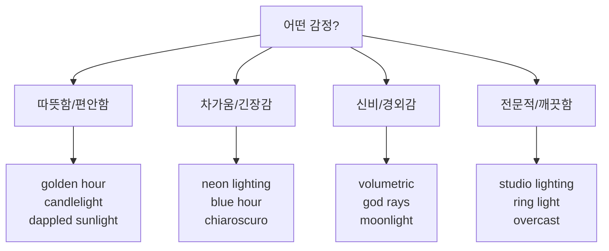

# 조명과 매체 — 빛과 질감으로 깊이 더하기

> 같은 주제, 같은 구도라도 조명과 매체 키워드 하나로 분위기가 완전히 달라집니다.

## 개요

"고양이가 창가에 앉아 있다"에 `golden hour lighting`을 넣으면 따뜻하고 포근해지고, `neon lighting`을 넣으면 사이버펑크가 됩니다. 이번 세션에서는 조명과 매체를 함께 다룹니다 — 수채화의 빛 표현과 유화의 빛 표현은 완전히 다르니까요.

**학습 목표**:
- 조명 키워드의 감정 효과를 이해하고 의도에 맞게 선택한다
- 매체 키워드가 질감과 느낌에 미치는 영향을 파악한다
- 조명과 매체를 조합하는 페어링 전략을 익힌다

## 조명 키워드 — 빛으로 감정 그리기

### 자연광 계열

**골든 아워 — 따뜻함, 노스탤지어:**
```
portrait of a young woman in a flower field, golden hour lighting, warm orange glow, long soft shadows, romantic atmosphere
```


**블루 아워 — 고요함, 신비:**
```
Tokyo cityscape at blue hour, cool blue-purple tones, city lights reflecting on wet streets, contemplative mood
```


**나뭇잎 사이 빛 — 동화적 분위기:**
```
a girl reading under a large tree, dappled sunlight filtering through leaves, soft warm patches of light, peaceful afternoon
```


**달빛 — 로맨틱, 미스터리:**
```
a secret garden at night, moonlight casting soft blue shadows, fireflies glowing, magical and serene
```


**흐린 날 — 부드럽고 균일:**
```
a fashion editorial portrait outdoors, overcast diffused lighting, even skin tones, no harsh shadows, elegant and clean
```


### 스튜디오/인공광 계열

**스튜디오 조명 — 깨끗하고 전문적:**
```
a luxury perfume bottle, clean studio lighting with soft key light, white background, commercial product photography, 8K sharp
```


**렘브란트 조명 — 드라마틱 인물:**
```
an elderly man with deep wrinkles, Rembrandt lighting, triangle of light on his cheek, dark moody background, oil painting feel
```


**네온 조명 — 사이버펑크, 도시:**
```
a woman leaning against a wall in a neon-lit alley, pink and blue neon reflections on her face, rain-soaked pavement, cyberpunk mood
```


**캔들라이트 — 친밀하고 따뜻한:**
```
a couple having dinner in a medieval tavern, candlelight illumination, warm flickering glow, intimate shadows, romantic atmosphere
```


### 특수 효과 계열

**볼류메트릭 라이팅 — 빛 기둥, 신비:**
```
ancient cathedral interior, volumetric lighting streaming through stained glass windows, dust particles floating in light beams, ethereal atmosphere
```


**역광/실루엣 — 드라마틱:**
```
a lone cowboy on horseback, backlighting from sunset, silhouette against orange sky, dramatic western scene
```


**갓 레이 — 경외감:**
```
ancient ruins in a jungle, god rays piercing through canopy, mist rising from the ground, lost civilization feel
```


### 조명 선택 가이드



### 조명 강도 보조어

```
soft golden hour lighting
```
→ 부드럽고 확산된 골든아워

```
dramatic Rembrandt lighting with deep shadows
```
→ 강한 대비의 렘브란트

```
cinematic volumetric lighting, atmospheric haze
```
→ 영화적 볼류메트릭

## 매체 키워드 — 질감과 마감이 바뀐다

### 전통 미술 매체

```
sunflower field stretching to the horizon, oil painting, visible thick brushstrokes, rich saturated colors, Van Gogh inspired
```


```
cherry blossom branch with falling petals, watercolor, soft bleeding edges, paper texture visible, delicate pastel tones
```


```
a detailed portrait of a jazz musician, charcoal drawing, dramatic contrast, expressive rough strokes
```


```
misty mountain landscape, ink wash painting (sumi-e style), minimal brushstrokes, vast empty space, meditative
```


### 디지털/현대 매체

```
a fantasy warrior princess with glowing sword, digital illustration, vibrant colors, clean sharp details, concept art quality
```


```
a futuristic sports car in a showroom, 3D render, metallic reflective surface, studio lighting, photorealistic quality
```


```
a medieval castle town, isometric pixel art, 16-bit retro game style, limited color palette, charming and detailed
```


### 사진 매체

```
a street photographer capturing a moment in Havana, 35mm film photography, natural grain, vintage warm tones, candid street style
```


```
a detective in a dark alley, cinematic still, shallow depth of field, anamorphic lens flare, film noir mood
```


```
a single dewdrop on a spider web, macro photography, extreme detail, morning light, bokeh background
```


## 조명 × 매체 페어링 전략

### 자연스러운 페어링 (안전한 선택)

```
an autumn vineyard at sunset, golden hour lighting, oil painting, warm rich colors, peaceful countryside
```


```
a sleek wireless headphone on marble, studio lighting with rim light, DSLR product photography, clean background, 8K
```


```
a cyberpunk street market, neon lighting, 3D render, reflective wet surfaces, futuristic atmosphere
```


```
a fairy tale forest clearing, soft overcast lighting, watercolor style, gentle pastel tones, dreamy and magical
```


### 창의적 충돌 페어링 (실험용)

의도적으로 어울리지 않는 조합 → 독특한 결과!

```
a Renaissance portrait of a noblewoman, neon lighting with pink and blue glow, oil painting on canvas, clash of classical and futuristic
```


```
a Japanese temple garden in spring, bioluminescent lighting, watercolor style, glowing plants, fantasy atmosphere
```


## 실습: 조명-매체 비교 실험

### 활동 1: 같은 주제, 4가지 조합

이 주제를 4가지 조명-매체 조합으로 생성해보세요:

```
an old lighthouse on a coastal cliff with crashing waves, wide shot
```

**A — 따뜻한 고전:**
```
an old lighthouse on a coastal cliff with crashing waves, wide shot, oil painting, golden hour lighting, warm atmospheric haze
```

**B — 미래적 드라마:**
```
an old lighthouse on a coastal cliff with crashing waves, wide shot, 3D render, volumetric lighting, dramatic storm clouds
```

**C — 몽환적 부드러움:**
```
an old lighthouse on a coastal cliff with crashing waves, wide shot, watercolor, soft overcast lighting, pastel muted tones
```

**D — 빈티지 감성:**
```
an old lighthouse on a coastal cliff with crashing waves, wide shot, 35mm film photography, blue hour, vintage grain
```

### 활동 2: 조명 감정 매핑

아래 분위기에 가장 적합한 조명+매체 조합을 골라 프롬프트를 만들어보세요:

- 따뜻하고 포근한 카페
- 긴장감 넘치는 스릴러
- 꿈속 같은 환상적 숲
- 세련된 패션 화보

## 팁과 주의사항

> ⚠️ **조명 키워드는 1~2개가 최적**: `golden hour, Rembrandt, neon, volumetric`을 모두 넣으면 서로 모순돼서 탁해져요.

> ⚠️ **매체는 1개 원칙**: 혼합하려면 `oil painting mixed with watercolor`처럼 명시적으로 지시하세요.

> 🔥 **프롬프트 순서**: `[주제] + [매체] + [조명] + [분위기]` 순서가 가장 안정적이에요.

## 핵심 정리

| 개념 | 설명 |
|------|------|
| **자연광** | golden hour, blue hour, overcast — 시간대 기반 |
| **인공광** | studio, Rembrandt, neon — 통제된 조명 |
| **특수 효과** | volumetric, chiaroscuro, backlighting — 드라마틱 |
| **전통 매체** | oil painting, watercolor, charcoal — 물리적 질감 |
| **디지털 매체** | digital art, 3D render, concept art — 현대적 |
| **사진 매체** | DSLR, 35mm film, cinematic still — 카메라 사실감 |
| **자연스러운 페어링** | golden hour + oil painting 같은 안정적 조합 |
| **창의적 충돌** | neon + oil painting 같은 실험적 조합 |

## 다음 세션 미리보기

조명과 매체로 시각적 깊이를 만들었다면, 다음은 6요소의 마지막 퍼즐 **분위기(Mood)**입니다. 색상 팔레트와 감정의 관계, 시간대·계절 키워드 전략까지 — 이미지에 영혼을 불어넣는 방법을 배워볼게요.
