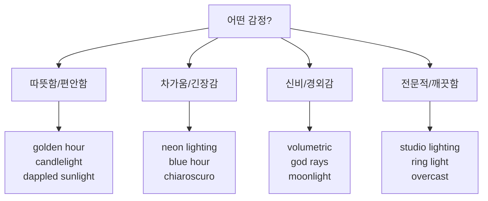

# 조명과 매체 — 빛과 질감으로 깊이 더하기

> 같은 주제, 같은 구도라도 조명과 매체 키워드 하나로 분위기가 완전히 달라집니다.

## 개요

같은 장소라도 해 질 무렵에 찍은 사진과 한낮 직사광선 아래에서 찍은 사진은 완전히 다른 느낌이죠. AI 이미지도 마찬가지. 이번 세션에서는 조명과 매체를 함께 다룹니다 — 수채화의 빛 표현과 유화의 빛 표현은 완전히 다르니까요.

**학습 목표**:
- 조명 키워드의 감정 효과를 이해하고 선택한다
- 매체 키워드가 질감에 미치는 영향을 파악한다
- 조명 × 매체 페어링 전략을 익힌다

## 조명 키워드 — 빛으로 감정 그리기

### 자연광 계열

**골든아워 인물:**
```
portrait of a young woman in a wheat field, golden hour lighting, warm orange glow, long soft shadows, wind in her hair, nostalgic and dreamy
```


**블루아워 도시:**
```
Tokyo cityscape reflected in a canal, blue hour lighting, deep blue and purple tones, city lights beginning to glow, serene and contemplative
```


**나뭇잎 사이 빛:**
```
girl reading a book under a large oak tree, dappled sunlight filtering through leaves, soft warm patches of light, watercolor style, peaceful afternoon
```


| 키워드 | 효과 | 추천 상황 |
|--------|------|----------|
| `golden hour lighting` | 따뜻한 오렌지-핑크, 긴 그림자 | 인물, 풍경, 감성 콘텐츠 |
| `blue hour lighting` | 차가운 파란 톤, 고요함 | 도시 풍경, 명상적 장면 |
| `overcast lighting` | 부드럽고 균일한 확산광 | 패션, 제품, 자연스러운 인물 |
| `dappled sunlight` | 나뭇잎 사이 얼룩진 빛 | 숲 속, 동화적 분위기 |
| `moonlight` | 차갑고 은은한 푸른 빛 | 야경, 미스터리 |

### 스튜디오/인공광 계열

**렘브란트 조명 초상화:**
```
elderly craftsman portrait, Rembrandt lighting, dramatic triangle of light on cheek, dark moody background, oil painting style, dignified and powerful
```


**네온 도시 야경:**
```
rainy city alley at night, neon lighting in pink and blue, wet pavement reflections, cyberpunk atmosphere, lone figure with umbrella, moody and electric
```


**촛불 중세 장면:**
```
medieval tavern interior, warm candlelight, flickering shadows on stone walls, wooden tables with goblets, intimate and atmospheric
```


| 키워드 | 효과 | 추천 상황 |
|--------|------|----------|
| `studio lighting` | 깨끗하고 전문적 | 제품, 프로필 사진 |
| `Rembrandt lighting` | 한쪽 얼굴 삼각형 빛, 드라마틱 | 인물 초상 |
| `neon lighting` | 선명한 색상 인공광 | 사이버펑크, 도시 야경 |
| `ring light` | 정면 균일 원형 조명 | 뷰티, SNS |
| `candlelight` | 따뜻하고 불안정한 불꽃 | 친밀한 장면, 중세 |

### 특수 효과 계열

**볼류메트릭 대성당:**
```
ancient gothic cathedral interior, volumetric lighting, sunbeams streaming through stained glass windows, dust particles dancing in light, ethereal and sacred atmosphere
```


**실루엣 역광:**
```
couple holding hands on a beach at sunset, silhouette lighting, orange and purple sky, backlit figures as dark outlines, romantic and cinematic
```


| 키워드 | 효과 | 추천 상황 |
|--------|------|----------|
| `volumetric lighting` | 안개 속 빛 기둥 | 판타지, 신비로운 장면 |
| `backlighting` | 뒤에서 비추는 빛, 실루엣 | 드라마틱 인물, 일몰 |
| `chiaroscuro` | 극단적 명암 대비 | 바로크풍, 미스터리 |
| `god rays` | 구름 사이 빛줄기 | 영적 장면, 자연 경외 |
| `silhouette lighting` | 완전 역광, 형체만 | 미니멀, 상징적 |

### 조명 선택 가이드



## 매체 키워드 — 질감과 마감이 바뀐다

### 전통 미술 매체

**유화풍 풍경:**
```
sunflower field stretching to the horizon, oil painting, thick impasto brushstrokes, rich saturated colors, golden afternoon light, Van Gogh inspired energy
```


**수채화풍 꽃:**
```
bouquet of wildflowers in a glass vase, watercolor painting, soft bleeding edges, transparent color layers, paper texture visible, delicate and ethereal
```


**동양화풍 산수:**
```
misty mountain landscape with pine trees and waterfall, ink wash painting, sumi-e style, generous white space, flowing black ink on rice paper, meditative calm
```


| 키워드 | 시각적 특징 | 어울리는 주제 |
|--------|------------|--------------|
| `oil painting` | 두꺼운 질감, 깊은 색감 | 인물화, 풍경, 정물 |
| `watercolor` | 투명하고 부드러운 번짐 | 꽃, 자연, 동화 |
| `pencil sketch` | 선명한 선, 크로스해칭 | 초상, 건축, 컨셉 |
| `charcoal drawing` | 거칠고 드라마틱 | 감정적 인물, 추상 |
| `ink wash` / `sumi-e` | 동양화 번짐, 여백 | 동양 풍경 |
| `gouache` | 불투명 수채, 매트 마감 | 일러스트, 포스터 |

### 디지털/현대 매체

**3D 렌더 제품:**
```
futuristic wireless earbuds floating in mid-air, 3D render, smooth reflective surface, gradient purple background, studio lighting, clean premium tech aesthetic
```


**픽셀아트 게임:**
```
cozy pixel art bedroom with a cat sleeping on the bed, 16-bit retro game style, warm lamplight, limited color palette, nostalgic and charming
```


| 키워드 | 시각적 특징 | 어울리는 주제 |
|--------|------------|--------------|
| `digital art` | 깔끔, 선명 | 거의 모든 주제 |
| `3D render` | 매끈, 사실적 반사 | 제품, 건축, SF |
| `concept art` | 분위기 위주, 미완성 느낌 | 영화/게임 세계관 |
| `pixel art` | 도트 그래픽, 레트로 | 게임, 노스탤지어 |
| `vector illustration` | 수학적으로 깔끔 | 로고, UI |

### 사진 매체

**35mm 필름 스트릿:**
```
woman walking through rain in Paris, 35mm film photography, natural grain texture, slightly faded vintage colors, shallow depth of field, candid street photography
```


**시네마틱 스틸:**
```
detective standing in a fog-filled alley, cinematic still, anamorphic lens flare, shallow depth of field, teal and orange color grading, noir atmosphere
```


| 키워드 | 시각적 특징 | 어울리는 주제 |
|--------|------------|--------------|
| `DSLR photo` | 사실성, 선명함 | 제품, 인물, 건축 |
| `35mm film` | 필름 그레인, 빈티지 | 스트릿, 여행 |
| `cinematic still` | 얕은 심도, 영화적 | 스토리텔링 |
| `macro photography` | 극접사, 미세 디테일 | 곤충, 꽃, 질감 |
| `long exposure` | 시간 잔상 | 야경, 폭포 |

## 조명 × 매체 페어링 전략

### 자연스러운 페어링 (안전한 선택)

**골든아워 + 유화:**
```
old stone bridge over a river at sunset, oil painting, golden hour lighting, warm rich tones, visible brushstrokes, impressionist landscape, nostalgic and timeless
```


**스튜디오 + DSLR:**
```
luxury leather handbag on white pedestal, DSLR product photography, three-point studio lighting with soft key light, sharp focus, clean white background, 8K detail
```


**네온 + 3D 렌더:**
```
futuristic motorcycle in a neon-lit garage, 3D render, neon pink and blue lighting, reflective chrome surfaces, cyberpunk aesthetic, sleek and powerful
```


| 조합 | 효과 | 활용 |
|------|------|------|
| `golden hour` + `oil painting` | 따뜻한 고전 명화 | 감성 콘텐츠, 앨범 커버 |
| `studio lighting` + `DSLR photo` | 깨끗한 전문 사진 | 이커머스, 브랜드 |
| `neon lighting` + `3D render` | 미래적 에너지 | 게임, 테크 |
| `soft overcast` + `watercolor` | 몽환적 섬세함 | 동화, 웨딩 |
| `Rembrandt` + `oil painting` | 고전 초상화 드라마 | 프로필, 아트 포스터 |
| `moonlight` + `ink wash` | 동양적 정취 야경 | 동양 판타지 |
| `backlighting` + `cinematic still` | 영화적 실루엣 | 영화 포스터 |

### 창의적 충돌 페어링 (실험용)

**네온 + 유화:**
```
Baroque still life with fruits and flowers, oil painting style, but illuminated by neon pink and cyan lighting, surreal contrast of classical and futuristic
```

")

**볼류메트릭 + 수채화:**
```
enchanted forest with glowing mushrooms, watercolor painting, volumetric light beams through canopy, bioluminescent glow, magical and dreamlike atmosphere
```

")

## 실습: 조명-매체 비교 실험

### 활동 1: 같은 주제, 4가지 조합

아래 기본 주제에 조명-매체 조합만 바꿔서 비교해보세요:

```
an old lighthouse on a rocky cliff, waves crashing below, wide shot
```

**A — 고전 느낌:**
```
an old lighthouse on a rocky cliff, waves crashing below, wide shot, oil painting, golden hour lighting, warm atmospheric haze
```


**B — SF 느낌:**
```
an old lighthouse on a rocky cliff, waves crashing below, wide shot, 3D render, volumetric lighting, dramatic storm clouds, epic and cinematic
```


**C — 동화 느낌:**
```
an old lighthouse on a rocky cliff, waves crashing below, wide shot, watercolor painting, soft overcast lighting, pastel muted palette, gentle and dreamy
```


**D — 빈티지 느낌:**
```
an old lighthouse on a rocky cliff, waves crashing below, wide shot, 35mm film photography, blue hour lighting, natural grain, melancholic and nostalgic
```


## 팁과 주의사항

> ⚠️ **조명 키워드는 1~2개가 최적**: 3개 이상 넣으면 서로 모순돼서 결과가 탁해집니다.

> ⚠️ **매체 키워드는 1개가 원칙**: 의도적 혼합은 `oil painting mixed with watercolor`처럼 명시적으로 지시하세요.

> 🔥 **프롬프트 순서 팁**: `[주제] + [매체] + [조명] + [분위기]` 순서가 가장 안정적이에요.

## 핵심 정리

| 개념 | 설명 |
|------|------|
| **자연광** | golden hour, blue hour, overcast 등 |
| **인공광** | studio, Rembrandt, neon, candlelight 등 |
| **특수 효과** | volumetric, chiaroscuro, backlighting 등 |
| **전통 매체** | oil painting, watercolor, charcoal 등 |
| **디지털 매체** | digital art, 3D render, pixel art 등 |
| **사진 매체** | DSLR, 35mm film, cinematic still 등 |
| **페어링** | 자연스러운 조합은 안정적, 충돌 조합은 실험적 |

## 다음 세션 미리보기

다음은 6요소의 마지막 퍼즐 **분위기(Mood)**입니다. 색상 팔레트, 시간대·계절 키워드로 이미지에 영혼을 불어넣는 방법을 배워볼게요.
