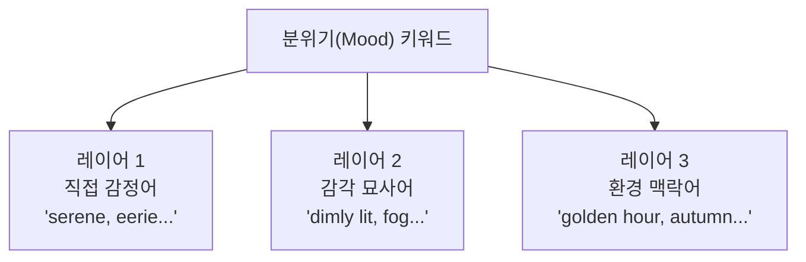

# 분위기와 감정 키워드 전략

> 프롬프트의 마지막 퍼즐 — 분위기 키워드로 이미지에 감정을 입히는 전략을 완성합니다.

## 개요

빈 카페 하나를 떠올려보세요. 분위기 키워드만 바꾸면 완전히 다른 공간이 됩니다:

**편안한 카페:**
```
empty café interior with wooden tables, cozy warm atmosphere, golden afternoon light streaming through windows, soft jazz vibe, inviting and comfortable
```


**으스스한 카페:**
```
empty abandoned café interior, eerie atmosphere, cold blue fluorescent light, dusty tables, broken window, unsettling and desolate
```


주제, 구도, 조명이 모두 같아도 **분위기 키워드 하나가 이미지의 감정을 뒤바꿉니다**.

**학습 목표**:
- 분위기 키워드의 3가지 레이어를 이해한다
- 색상 팔레트 키워드로 감정을 정밀하게 제어한다
- 시간대/계절/날씨 키워드로 분위기를 간접 설정한다

## 분위기 키워드의 3가지 레이어

### 레이어 1 — 직접 감정어

감정을 직접 명시하는 가장 직관적인 방식.

| 감정 계열 | 키워드 예시 |
|-----------|------------|
| 평화/안정 | serene, peaceful, tranquil, calm |
| 활기/에너지 | vibrant, energetic, dynamic, lively |
| 긴장/불안 | tense, ominous, unsettling, eerie |
| 슬픔/그리움 | melancholic, wistful, somber, nostalgic |
| 신비/경이 | mystical, ethereal, otherworldly, dreamlike |
| 따뜻함/친밀 | cozy, intimate, warm, inviting |

### 레이어 2 — 감각 묘사어 (더 정확!)

감정을 직접 말하지 않고, **물리적 상태를 묘사**해서 분위기를 유도합니다. 실제로 더 정확한 결과를 만들어내요.

**"mysterious" 대신:**
```
dimly lit corridor, long shadows stretching across the floor, fog slowly rolling in from an open door, faint blue light
```


**"joyful" 대신:**
```
bright sunlight flooding through open windows, colorful confetti floating in the air, golden warm tones everywhere, soft bokeh lights
```


**"lonely" 대신:**
```
a single figure walking on an empty road stretching to the horizon, overcast grey sky, muted desaturated colors, no other people in sight
```


### 레이어 3 — 환경 맥락어

시간대, 날씨, 계절로 분위기를 **간접 설정**하는 방식. 아래에서 자세히 다룹니다.



> 🔥 **실무 팁**: 최고의 결과는 **세 레이어를 조합**할 때 나와요:

```
old bookshop interior, nostalgic atmosphere, faded warm tones, soft film grain texture, late autumn afternoon light, dust particles floating in sunbeams
```


## 색상 팔레트 키워드 — 감정의 과학

AI에게 사용할 색의 범위를 지정하면 전체 이미지의 톤이 통일되면서 감정이 명확해져요.

### 난색 vs 한색 vs 중성색

**난색 — 따뜻하고 에너지 넘치는:**
```
bustling street market in Marrakech, warm orange and amber color palette, golden sunlight, terracotta walls, vibrant spices in bowls, lively and inviting
```


**한색 — 차갑고 고요한:**
```
abandoned lighthouse on a foggy coast, cool blue and teal color palette, overcast sky, dark grey rocks, desaturated tones, lonely and contemplative
```


**중성색 — 세련되고 안정적인:**
```
minimalist coffee shop interior, muted earth tones, beige and cream walls, natural wood furniture, soft diffused light, calm and sophisticated
```


### 채도와 명도 조절

| 속성 | 높을 때 | 낮을 때 | 키워드 |
|------|---------|---------|--------|
| 채도 | 활기차고 즐거운 | 차분하고 우울한 | `vibrant saturated` vs `desaturated, muted` |
| 명도 | 희망적이고 가벼운 | 무겁고 극적인 | `bright, high-key` vs `dark, low-key` |
| 대비 | 드라마틱하고 긴장감 | 부드럽고 꿈같은 | `high contrast` vs `soft, low contrast` |

### 색상 팔레트 지정 4가지 방법

**1. 직접 색상:**
```
portrait of a woman in a garden, in shades of deep blue and gold, elegant evening atmosphere
```

**2. 색온도:**
```
cozy reading nook by a window, warm color palette, soft amber and cream tones, inviting glow
```

**3. 영화 색보정:**
```
action hero walking through explosion aftermath, teal and orange color grading, cinematic blockbuster look, high contrast
```


**4. 참조 기반:**
```
quirky hotel lobby, color palette inspired by Wes Anderson films, pastel pink and lavender walls, symmetrical composition, whimsical and charming
```


## 시간대와 계절 — 자연이 만드는 분위기

시간대와 계절 키워드는 AI가 조명, 색감, 공기감까지 한꺼번에 추론하기 때문에 분위기를 가장 자연스럽게 설정해요.

### 시간대별 프롬프트

**새벽:**
```
fishing village harbor at dawn, first light of day, soft purple and pink sky, calm water reflections, quiet and hopeful atmosphere
```


**정오:**
```
Mediterranean courtyard at high noon, harsh midday sun, deep sharp shadows, whitewashed walls, vibrant bougainvillea, hot and intense
```


**블루아워:**
```
Parisian bridge over the Seine at blue hour, deep blue and purple twilight, street lamps just turning on, soft reflections, romantic and mysterious
```


### 계절별 프롬프트

**봄:**
```
Japanese garden path lined with cherry blossom trees in full bloom, spring morning, soft pastel pink petals falling, fresh green grass, gentle breeze, joyful and renewing
```


**가을:**
```
winding country road through New England forest, peak autumn foliage, amber burgundy and mustard leaves, soft golden light, vintage film photography, nostalgic and bittersweet
```


**겨울:**
```
lonely cabin in deep snow-covered forest, winter twilight, warm light glowing from windows, frost on trees, smoke from chimney, quiet and isolated
```


### 날씨 키워드

| 날씨 | 키워드 | 감정 효과 |
|------|--------|----------|
| 안개 | `foggy, misty, hazy` | 신비, 몽환 |
| 비 | `rainy, drizzle, rain-soaked` | 우울, 사색 |
| 눈 | `snowy, frost-covered` | 고요, 순수 |
| 폭풍 | `stormy, thunderous` | 갈등, 긴장 |

**비오는 날 + 네온:**
```
Tokyo side street on a rainy night, neon signs reflected in puddles, lone figure under a clear umbrella, rain-soaked pavement, melancholic yet beautiful cyberpunk mood
```


## 감정 → 물리 번역

추상적인 감정을 구체적 묘사로 변환하는 것이 핵심 스킬이에요.

| 원하는 감정 | 번역된 프롬프트 키워드 |
|------------|---------------------|
| "외로움" | `single figure, vast empty space, desaturated cool tones, overcast sky, long shadows` |
| "희망" | `warm golden light breaking through clouds, upward perspective, vibrant greens, sunrise` |
| "긴장감" | `low angle, deep shadows, high contrast, narrow corridor, red accent lighting` |
| "편안함" | `soft diffused light, warm earth tones, shallow depth of field, cozy interior elements` |

## 실습: 분위기 설계하기

### 활동 1: 동일 장면, 4가지 분위기

"도시 거리의 카페 테라스"로 4가지 분위기를 만들어보세요:

**로맨틱:**
```
outdoor café terrace on a Parisian street, golden hour warm light, soft pink and amber tones, string lights overhead, couple sharing wine, romantic and intimate
```


**스릴러:**
```
deserted café terrace at night, cold blue neon from a sign, deep shadows under awning, single empty chair, fog rolling in, tense and ominous
```


**노스탤지어:**
```
café terrace in autumn, 35mm film photography, faded warm vintage colors, fallen leaves on tables, late afternoon light, wistful and nostalgic
```


**미래적:**
```
café terrace in a futuristic city, holographic menu displays, neon lighting in cyan and magenta, sleek metallic furniture, cyberpunk style, vibrant and electric
```


### 활동 2: 프롬프트 강화

**원본** (분위기 없음):
```
A lighthouse on a cliff
```

**강화 버전** (3레이어 분위기 추가):
```
A weathered stone lighthouse on a dramatic cliff edge, during a stormy twilight with thunderclouds, crashing waves below, volumetric god rays breaking through clouds, oil painting style, awe-inspiring and majestic, deep blue and amber palette
```


## 팁과 주의사항

> ⚠️ **흔한 오해**: "mysterious" 한 단어로 충분? AI는 수천 가지로 해석해요. **3레이어 조합**이 정확한 결과를 만듭니다.

> 🔥 **실무 팁**: 색상 이름은 구체적으로! "blue"보다 `cerulean blue`, `steel blue`, `navy blue`가 훨씬 정확. `dusty rose and sage green` 같은 디자인 용어도 잘 먹혀요.

> 💡 **플랫폼별 차이**: ChatGPT/Gemini는 "마치 잊혀진 기억처럼 바랜 풍경" 같은 서술형이 강력. Midjourney는 `nostalgic, faded film, muted tones` 키워드 나열이 효과적.

## 핵심 정리

| 개념 | 설명 |
|------|------|
| **분위기 3레이어** | 직접 감정어 + 감각 묘사어 + 환경 맥락어 |
| **감각 묘사어 우선** | 추상적 감정어보다 물리적 묘사가 더 정확 |
| **색상 팔레트** | 색온도, 채도, 명도로 감정을 제어 |
| **시간대/계절/날씨** | 환경 키워드 하나로 조명+색감+공기감 한꺼번에 |
| **감정→물리 번역** | 핵심 스킬: 추상 감정을 시각 요소로 변환 |

## 다음 세션 미리보기

6요소를 하나씩 모두 배웠습니다! 다음 세션에서는 이 6가지를 하나의 **재사용 가능한 프롬프트 템플릿**으로 통합합니다. Ch2의 마무리예요.
