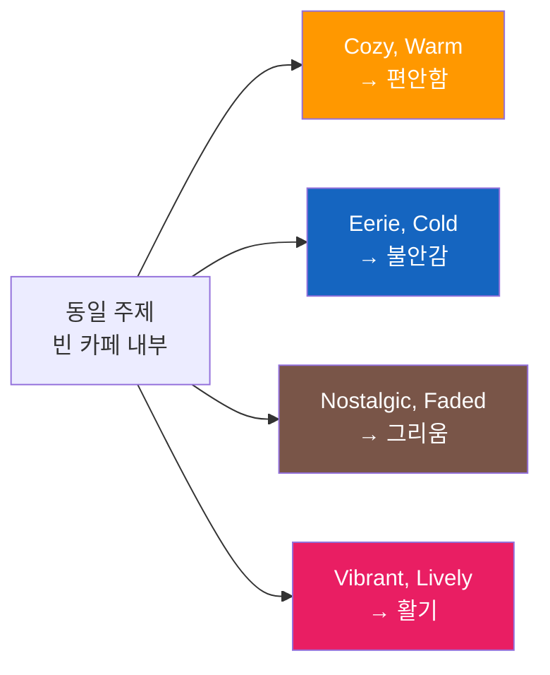
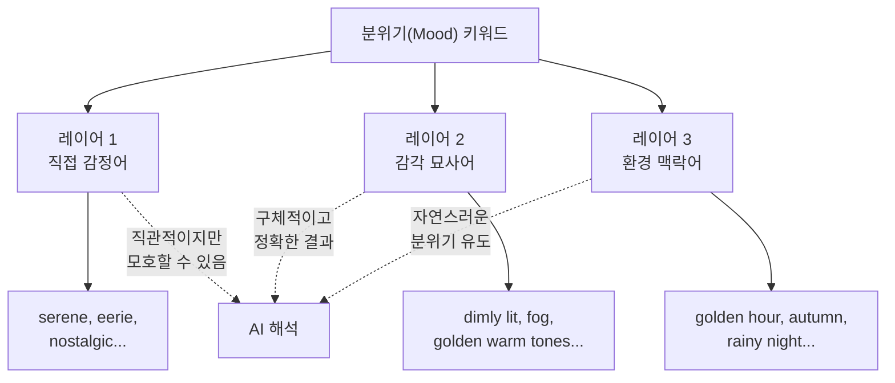
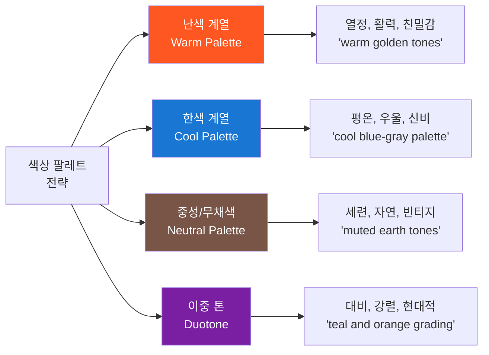
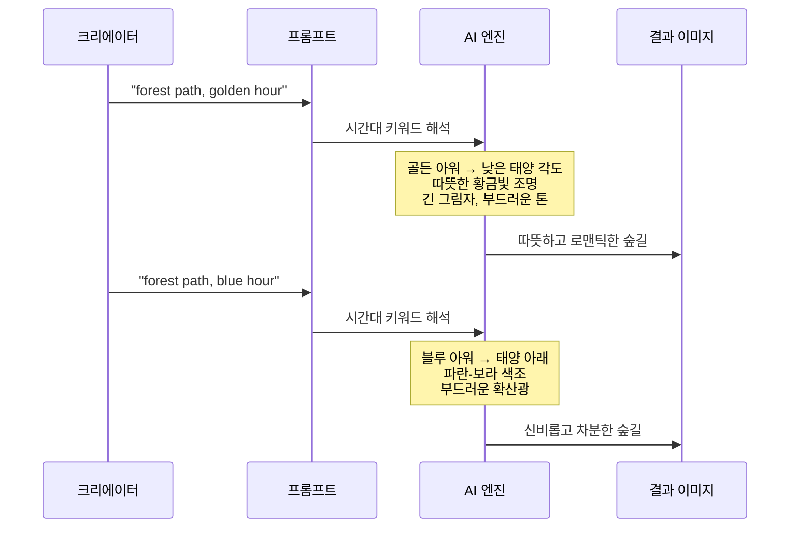
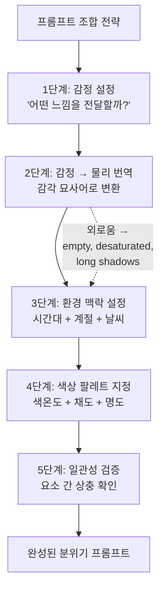

# 분위기와 감정 키워드 전략

> 프롬프트의 마지막 퍼즐 — 분위기(Mood) 키워드로 색감, 톤, 감정을 설계하고, 이미지에 영혼을 불어넣는 전략을 완성합니다.

## 개요

이 섹션에서는 프롬프트 6요소 프레임워크의 여섯 번째 요소, 즉 마지막 퍼즐 피스인 **분위기(Mood)**를 심화 학습합니다. 지금까지 주제, 스타일, 구도, 조명, 매체라는 다섯 가지 요소로 이미지의 "형태"를 잡아왔다면, 이번에는 이미지에 "감정"을 입히는 방법을 다룹니다.

**선수 지식**: [프롬프트 해부학 — 6요소 프레임워크](02-ch2-프롬프트-구조-마스터/01-01-프롬프트-해부학-6요소-프레임워크.md)에서 배운 6요소의 기본 구조, [주제와 스타일 키워드 설계](02-ch2-프롬프트-구조-마스터/02-02-주제와-스타일-키워드-설계.md)에서 다룬 핵심 주제 선정과 스타일 매칭, [구도와 앵글 키워드](02-ch2-프롬프트-구조-마스터/03-03-구도와-앵글-키워드-시선을-사로잡는-프레이밍.md)에서 배운 시선 유도 전략, 그리고 [조명과 매체](02-ch2-프롬프트-구조-마스터/04-04-조명과-매체-빛과-질감으로-깊이-더하기.md)에서 다룬 조명-매체 페어링 전략까지 — 이전 세션들(2.1~2.4)에서 쌓아온 다섯 가지 요소의 지식이 모두 이번 섹션의 토대가 됩니다.

**학습 목표**:
- 분위기 키워드가 이미지의 색감, 톤, 전체 느낌에 미치는 영향을 이해한다
- 감정 전달을 위한 형용사 조합 전략을 익힌다
- 색상 팔레트 키워드를 활용해 원하는 감정을 정밀하게 제어한다
- 시즌/시간대 키워드로 분위기를 간접 설정하는 방법을 배운다

## 왜 알아야 할까?

같은 피사체를 촬영해도 분위기에 따라 완전히 다른 이야기가 됩니다. 빈 카페 하나를 떠올려보세요. "cozy, warm afternoon light"라고 쓰면 커피향이 느껴지는 편안한 공간이 되고, "eerie, abandoned, cold blue tones"라고 쓰면 으스스한 폐건물이 됩니다. 주제, 구도, 조명이 모두 같아도 **분위기 키워드 하나가 이미지의 감정 전체를 뒤바꿉니다**.

디자이너에게 이 능력은 특히 중요합니다. 클라이언트가 "좀 더 따뜻한 느낌으로", "더 프로페셔널하게", "감성적으로"라고 요청할 때, 이를 구체적인 분위기 키워드로 변환할 수 있어야 하거든요. 분위기를 제어할 수 없다면 AI 이미지 생성은 결국 운에 맡기는 슬롯머신이 되고 맙니다.

> 📊 **그림 1**: 동일 주제에 분위기 키워드만 변경했을 때의 감정 변화

## 핵심 개념

### 개념 1: 분위기 키워드의 3가지 레이어

> 💡 **비유**: 분위기 키워드는 영화 음악과 같습니다. 공포 영화에서 같은 복도 장면도 밝은 피아노 선율이 깔리면 희망적으로, 불협화음이 깔리면 소름 끼치게 느껴지죠. 프롬프트의 분위기 키워드가 바로 이미지의 "배경 음악" 역할을 합니다.

분위기 키워드는 세 가지 레이어로 나눌 수 있습니다. 각 레이어는 서로 다른 방식으로 AI의 이미지 생성에 영향을 미칩니다.

**레이어 1 — 직접 감정어 (Direct Emotion)**

감정을 직접 명시하는 방식입니다. 가장 직관적이지만, AI가 해석하는 방식이 모호할 수 있습니다.

| 감정 계열 | 키워드 예시 |
|-----------|------------|
| 평화/안정 | serene, peaceful, tranquil, calm, zen |
| 활기/에너지 | vibrant, energetic, dynamic, lively, exuberant |
| 긴장/불안 | tense, ominous, unsettling, foreboding, eerie |
| 슬픔/그리움 | melancholic, wistful, somber, bittersweet, nostalgic |
| 신비/경이 | mystical, ethereal, otherworldly, dreamlike, surreal |
| 따뜻함/친밀 | cozy, intimate, warm, heartfelt, inviting |

**레이어 2 — 감각 묘사어 (Sensory Description)**

감정을 직접 말하지 않고, 물리적 상태를 묘사해서 분위기를 유도하는 방식입니다. 이 방법이 실제로 더 정확한 결과를 만들어냅니다.

- "mysterious" 대신 → "dimly lit, with long shadows and fog rolling in"
- "joyful" 대신 → "bright sunlight, colorful confetti in the air, golden warm tones"
- "lonely" 대신 → "a single figure on an empty road, overcast sky, muted colors"

**레이어 3 — 환경 맥락어 (Environmental Context)**

시간대, 날씨, 계절 같은 환경 요소로 분위기를 간접 설정합니다. 이 레이어는 다음 소제목에서 자세히 다룹니다.

> 📊 **그림 2**: 분위기 키워드의 3가지 레이어 구조

> 🔥 **실무 팁**: 최고의 결과는 세 레이어를 조합할 때 나옵니다. 예를 들어 "nostalgic (감정) + faded warm tones, soft grain (감각) + late autumn afternoon (환경)" 처럼 레이어를 쌓으면 AI가 훨씬 일관된 분위기를 만들어냅니다.

---

### 개념 2: 색상 팔레트 키워드 — 감정의 과학

> 💡 **비유**: 색상 팔레트를 지정하는 것은 화가에게 "이 물감들만 써서 그려주세요"라고 팔레트를 건네주는 것과 같습니다. AI에게 사용할 색의 범위를 한정해주면, 전체 이미지의 톤이 통일되면서 감정이 명확해집니다.

색상은 감정과 직결됩니다. 이건 단순한 느낌이 아니라, 색채 심리학에서 수십 년간 연구해온 과학적 사실이에요.

**난색(Warm Colors)과 한색(Cool Colors)의 감정 효과**

| 색온도 | 대표 색상 | 감정 효과 | 프롬프트 예시 |
|--------|----------|----------|-------------|
| 난색 | 빨강, 주황, 노랑 | 에너지, 열정, 따뜻함, 긴박감 | "warm orange and amber palette" |
| 한색 | 파랑, 보라, 청록 | 평온, 신뢰, 차가움, 외로움 | "cool blue and teal tones" |
| 중성색 | 회색, 베이지, 갈색 | 안정, 자연스러움, 세련됨 | "muted earth tones, desaturated" |

**프롬프트에서 색상 팔레트를 지정하는 4가지 방법**

1. **직접 색상 지정**: "in shades of deep blue and gold"
2. **색온도 지정**: "warm color palette", "cool muted tones"
3. **영화/사진 색보정 용어**: "teal and orange color grading", "cross-processed colors"
4. **참조 기반**: "color palette inspired by Wes Anderson films", "Studio Ghibli color scheme"

> 📊 **그림 3**: 색상 팔레트 유형과 감정 매핑

**채도(Saturation)와 명도(Value)의 감정 효과**

색상 자체만큼이나 채도와 명도도 분위기에 큰 영향을 미칩니다.

| 속성 | 높을 때 | 낮을 때 | 프롬프트 키워드 |
|------|---------|---------|---------------|
| 채도 | 활기차고 즐거운 느낌 | 차분하고 우울한 느낌 | "vibrant saturated" vs "desaturated, muted" |
| 명도 | 희망적이고 가벼운 느낌 | 무겁고 극적인 느낌 | "bright, high-key" vs "dark, low-key" |
| 대비 | 드라마틱하고 긴장감 | 부드럽고 꿈 같은 느낌 | "high contrast" vs "soft, low contrast" |

> ⚠️ **흔한 오해**: "색상 키워드를 쓰면 그 색만 나온다"고 생각하기 쉬운데, 실제로는 AI가 팔레트 전체의 "톤"으로 해석합니다. "blue tones"라고 쓴다고 온통 파란색이 되는 건 아니에요. 전체적인 색온도가 차가운 쪽으로 기울면서, 보색인 난색 요소도 적절히 포함된 조화로운 팔레트가 만들어집니다.

---

### 개념 3: 시간대와 계절 — 자연이 만드는 분위기

> 💡 **비유**: 시간대와 계절 키워드는 무대 조명 감독에게 "이 장면은 해질녘 가을"이라고 알려주는 것과 같습니다. 한 마디에 조명 색온도, 그림자 방향, 배경의 색감, 공기의 질감까지 모두 결정되죠.

시간대와 계절 키워드는 분위기를 가장 자연스럽게 설정하는 방법입니다. AI는 이 키워드에서 조명, 색감, 공기감까지 한꺼번에 추론하기 때문이에요.

**시간대별 분위기 효과**

| 시간대 | 영어 키워드 | 색감 특성 | 감정 효과 |
|--------|-----------|----------|----------|
| 새벽 | dawn, first light, pre-dawn | 연보라 + 연분홍, 부드러운 톤 | 시작, 희망, 고요 |
| 골든 아워 | golden hour, magic hour | 황금빛, 따뜻한 오렌지 | 로맨틱, 노스탤지어, 따뜻함 |
| 정오 | high noon, midday sun | 강한 대비, 선명한 색상 | 에너지, 현실감, 강렬함 |
| 블루 아워 | blue hour, twilight, dusk | 짙은 파랑 + 보라 | 신비, 사색, 차분함 |
| 밤 | midnight, moonlit, starlit | 어두운 톤, 포인트 조명 | 비밀, 고독, 드라마 |

**계절별 분위기 효과**

| 계절 | 키워드 | 연상 색감 | 감정 효과 |
|------|--------|----------|----------|
| 봄 | spring, cherry blossom, fresh green | 파스텔, 연분홍, 연초록 | 새로움, 가벼움, 설렘 |
| 여름 | summer, tropical, sun-drenched | 선명한 원색, 높은 채도 | 활력, 자유, 열정 |
| 가을 | autumn, fall foliage, harvest | 앰버, 버건디, 머스타드 | 성숙, 그리움, 따뜻한 쓸쓸함 |
| 겨울 | winter, frost, snow-covered | 차가운 회색, 은백색 | 고요, 순수, 고독 |

> 📊 **그림 4**: 시간대 키워드가 AI 이미지의 색감과 감정에 미치는 영향

**날씨 키워드도 분위기를 결정짓는다**

시간대, 계절에 더해 날씨 키워드를 조합하면 분위기가 한층 구체적으로 됩니다.

| 날씨 | 키워드 예시 | 감정 효과 |
|------|-----------|----------|
| 안개 | foggy, misty, hazy | 신비, 불확실, 몽환 |
| 비 | rainy, drizzle, rain-soaked | 우울, 사색, 정화 |
| 눈 | snowy, frost-covered, blizzard | 고요, 순수, 고립 |
| 맑음 | clear sky, crisp air | 명료, 희망, 개방 |
| 폭풍 | stormy, thunderous, dramatic clouds | 갈등, 긴장, 힘 |

---

### 개념 4: 분위기 조합 전략 — 5요소 위에 감정 얹기

> 💡 **비유**: 요리에 비유하면, 주제는 재료, 스타일은 조리법, 구도는 플레이팅, 조명과 매체는 그릇과 식기인데요 — 분위기는 바로 **향신료**입니다. 같은 파스타도 바질을 넣느냐, 트러플 오일을 넣느냐에 따라 완전히 다른 요리가 되듯이요.

지금까지 배운 5개 요소(주제, 스타일, 구도, 조명, 매체) 위에 분위기를 효과적으로 얹는 전략을 알아봅시다.

**전략 1: 감정 → 물리 번역 (Emotion-to-Physical Translation)**

추상적인 감정을 구체적 묘사로 변환하는 것이 핵심입니다.

| 원하는 감정 | 번역 결과 (구체적 묘사) |
|------------|----------------------|
| "외로움" | "single figure, vast empty space, desaturated cool tones, overcast sky, long shadows" |
| "희망" | "warm golden light breaking through clouds, upward perspective, vibrant greens" |
| "긴장감" | "low angle, deep shadows, high contrast, narrow corridor, red accent lighting" |
| "편안함" | "soft diffused light, warm earth tones, shallow depth of field, cozy interior" |

**전략 2: 상충 없는 레이어링 (Consistent Layering)**

분위기 키워드를 다른 요소와 조합할 때, 서로 상충하지 않도록 주의해야 합니다.

| 조합 | 일관성 | 이유 |
|------|--------|------|
| "cheerful" + "golden hour" + "warm tones" | 일관적 | 밝은 감정 + 따뜻한 조명 + 난색 |
| "melancholic" + "blue hour" + "desaturated" | 일관적 | 우울한 감정 + 차가운 시간대 + 낮은 채도 |
| "cheerful" + "midnight" + "dark cold tones" | 상충 | 밝은 감정 vs 어두운 환경 |

물론, 의도적인 상충은 창의적 결과를 만들기도 합니다. "cheerful carnival at midnight, neon lights piercing through darkness"처럼 대비를 의도한다면 오히려 강렬한 분위기가 만들어지죠. 중요한 건 **의도 없는 상충은 피하고, 의도한 상충은 구체적으로 설명하는 것**입니다.

**전략 3: 플랫폼별 분위기 키워드 반응 차이**

| 키워드 | ChatGPT (GPT-4o) | Gemini | Midjourney |
|--------|------------------|--------|------------|
| "nostalgic" | 따뜻한 색감 + 약간의 필름 그레인 | 빈티지 색 보정 강조 | 강한 필름 톤 + 소프트 포커스 |
| "ethereal" | 밝고 몽환적인 톤 | 부드러운 빛 + 파스텔 | 매우 미학적, 꿈 같은 분위기 |
| "dramatic" | 조명 대비 강조 | 색상 대비 강조 | 강한 명암 + 시네마틱 구도 |
| 긴 서술형 분위기 | 잘 이해하고 반영 | 잘 이해하고 반영 | 짧은 핵심 키워드가 효과적 |

> 📊 **그림 5**: 분위기 키워드와 다른 요소의 조합 전략

---

## 실습: 적용해보기

### 활동 1: 감정 번역 워크시트

아래 감정 키워드를 받아 **레이어 2(감각 묘사어) + 레이어 3(환경 맥락어)**로 번역해보세요.

| 감정 | 감각 묘사어 (빛, 질감, 색감) | 환경 맥락어 (시간, 계절, 날씨) | 완성 프롬프트 조각 |
|------|---------------------------|---------------------------|-----------------|
| 설렘 | (예: bright, sparkling, vivid colors) | (예: spring morning, clear sky) | ? |
| 공포 | ? | ? | ? |
| 그리움 | ? | ? | ? |
| 고급스러움 | ? | ? | ? |

### 활동 2: 동일 장면, 다른 분위기

"도시 거리의 카페 테라스"라는 동일한 주제로 아래 네 가지 분위기의 프롬프트를 완성해보세요.

1. **로맨틱**: cafe terrace in a city street, _____ (조명) _____ (색감) _____ (시간대)
2. **스릴러**: cafe terrace in a city street, _____ (조명) _____ (색감) _____ (날씨)
3. **노스탤지어**: cafe terrace in a city street, _____ (매체/질감) _____ (색감) _____ (계절)
4. **미래적**: cafe terrace in a city street, _____ (조명) _____ (색감) _____ (스타일)

### 활동 3: 프롬프트 진단

아래 프롬프트의 분위기 요소를 분석하고, 더 강화할 수 있는 키워드를 제안해보세요.

**원본 프롬프트**: "A lighthouse on a cliff"
- 현재 분위기 요소: (없음)
- 직접 감정어 추가: _____
- 감각 묘사어 추가: _____
- 환경 맥락어 추가: _____
- 색상 팔레트 추가: _____
- **강화된 프롬프트**: _____

## 더 깊이 알아보기

### 색채와 감정의 역사 — 요하네스 이텐과 바우하우스

색상이 감정에 영향을 미친다는 생각은 어디서 시작되었을까요? 현대 색채 이론의 아버지라 불리는 **요하네스 이텐(Johannes Itten, 1888-1967)**은 독일 바우하우스에서 1919년부터 색채 교육 과정을 가르치며, 색상과 감정의 관계를 체계적으로 정리한 최초의 인물입니다.

이텐은 학생들에게 색상을 보고 "느끼라"고 했습니다. 그의 유명한 7가지 색상 대비 이론 — 색상, 명도, 온도, 보색, 동시, 채도, 면적 대비 — 은 오늘날 모든 디자인 교육의 기초가 되었죠. 특히 **색온도(Color Temperature)** 개념을 색채 이론에 처음 도입한 것이 이텐의 가장 큰 공헌입니다. 따뜻한 색(빨강, 주황)과 차가운 색(파랑, 보라)이라는 구분은 이텐이 확립한 것이고, AI 이미지 생성에서 "warm tones", "cool palette"라고 쓸 때 우리는 100년 전 바우하우스 교실에서 만들어진 개념을 사용하는 셈입니다.

흥미로운 점은 AI 이미지 생성 모델들이 이텐의 이론을 "학습"했다는 것이에요. 수억 장의 이미지-텍스트 쌍을 학습하면서, AI는 "warm"이라는 단어가 등장하는 이미지에는 공통적으로 난색 계열이, "cold"라는 단어에는 한색 계열이 사용된다는 패턴을 자연스럽게 터득한 것입니다.

> 💡 **알고 계셨나요?**: 이텐의 1961년 저서 *The Art of Color*는 60년이 지난 지금도 미대와 디자인 스쿨의 필독서입니다. AI 시대에도 색채와 감정의 원리는 변하지 않았어요 — 도구만 붓에서 프롬프트로 바뀌었을 뿐이죠.

### 영화 색보정(Color Grading)에서 배우는 분위기 설계

영화 산업에서 색보정은 관객의 감정을 조종하는 핵심 도구입니다. 대표적인 사례를 보면:

- **매드 맥스: 퓨리 로드** — 사막 장면은 과포화된 오렌지-골드, 밤 장면은 차가운 블루. 이 **티앤오(Teal and Orange)** 대비가 긴장감과 대비를 극대화합니다.
- **그랜드 부다페스트 호텔** — 웨스 앤더슨의 시그니처인 파스텔 핑크, 보라, 라벤더 팔레트가 동화 같은 분위기를 만듭니다.
- **블레이드 러너 2049** — 각 장면마다 단일 색조(오렌지, 회색, 초록)로 감정을 구분합니다.

이 영화들의 색보정 전략을 프롬프트에 그대로 활용할 수 있습니다. "teal and orange color grading", "Wes Anderson pastel color palette", "Blade Runner 2049 orange haze" 같은 키워드가 바로 그 예시입니다.

## 흔한 오해와 팁

> ⚠️ **흔한 오해**: "분위기 키워드는 하나만 쓰면 된다"고 생각하기 쉽습니다. 하지만 "mysterious"라는 단어 하나만으로는 AI가 수천 가지 해석을 할 수 있어요. "mysterious"가 안개 낀 숲인지, 어두운 방인지, 우주 공간인지 AI는 알 수 없습니다. 직접 감정어 + 감각 묘사어 + 환경 맥락어의 3레이어 조합이 정확한 결과를 만듭니다.

> 💡 **알고 계셨나요?**: Midjourney의 `--stylize` 파라미터는 분위기와 밀접한 관계가 있습니다. `--stylize` 값이 높을수록 AI가 미학적 해석을 강화하면서 분위기 키워드의 효과도 증폭됩니다. "ethereal" 같은 추상적 분위기어는 `--s 500` 이상에서 훨씬 드라마틱한 결과를 만들어내죠. 반대로 정확한 색상 팔레트 제어를 원한다면 `--s` 값을 낮추는 게 좋습니다. [스타일라이즈 파라미터](05-ch5-midjourney-기본과-파라미터-튜닝/03-03-스타일라이즈--stylize와-미학-제어.md)에서 이 내용을 자세히 다룹니다.

> 🔥 **실무 팁**: 색상 팔레트를 지정할 때는 **구체적인 색 이름**을 쓰세요. "blue"보다 "cerulean blue", "steel blue", "navy blue"가 훨씬 정확한 결과를 만듭니다. 비주얼 디자이너라면 Pantone이나 디자인 도구에서 쓰는 색 이름을 그대로 프롬프트에 넣어보세요. "Pantone Living Coral tones", "dusty rose and sage green" 같은 표현이 효과적입니다.

> 🔥 **실무 팁**: ChatGPT와 Gemini에서는 분위기를 **문장형**으로 서술하는 게 효과적입니다. "The scene feels like a forgotten memory, slightly faded, as if seen through an old window on a rainy day." 이런 서술은 대화형 AI에서 특히 강력하게 작동해요. 반면 Midjourney에서는 "nostalgic, faded film, rainy window view, soft muted tones"처럼 키워드를 나열하는 편이 낫습니다.

## 핵심 정리

| 개념 | 설명 |
|------|------|
| 분위기 3레이어 | 직접 감정어 + 감각 묘사어 + 환경 맥락어를 조합해 정확한 분위기를 전달 |
| 감각 묘사어 우선 | 추상적 감정어보다 물리적 묘사(빛, 그림자, 색감, 질감)가 더 정확한 결과 생성 |
| 색상 팔레트 전략 | 색온도(난색/한색), 채도, 명도, 대비로 감정을 과학적으로 제어 |
| 시간대/계절/날씨 | 환경 맥락 키워드 하나로 조명, 색감, 공기감을 한꺼번에 설정 |
| 감정 → 물리 번역 | 원하는 감정을 구체적인 시각 요소로 변환하는 것이 핵심 스킬 |
| 일관성 검증 | 분위기 키워드가 다른 5개 요소(주제, 스타일, 구도, 조명, 매체)와 상충하지 않는지 확인 |
| 플랫폼별 차이 | ChatGPT/Gemini는 서술형, Midjourney는 핵심 키워드 나열이 효과적 |

## 다음 섹션 미리보기

지금까지 6요소 프레임워크의 개별 요소를 하나씩 깊이 파고들었습니다 — 주제, 스타일, 구도, 조명, 매체, 그리고 오늘 다룬 분위기까지. 다음 섹션 [나만의 프롬프트 템플릿 만들기](02-ch2-프롬프트-구조-마스터/06-06-나만의-프롬프트-템플릿-만들기.md)에서는 이 6가지 요소를 하나의 **재사용 가능한 프롬프트 템플릿**으로 통합합니다. 프로젝트 유형별(SNS 콘텐츠, 광고 비주얼, 일러스트레이션 등) 맞춤 템플릿을 만들고, 챕터 2 전체를 하나의 실전 워크플로우로 완성하게 됩니다.

## 참고 자료

- [How to Write AI Image Prompts Like a Pro (Let's Enhance)](https://letsenhance.io/blog/article/ai-text-prompt-guide/) - 분위기, 색감, 톤을 포함한 프롬프트 작성의 종합 가이드. 감각 묘사의 중요성을 잘 설명
- [Midjourney Parameter Visual Guide (Tory Barber)](https://torybarber.com/midjourney-parameter-visual-guide/) - Midjourney 파라미터와 분위기 키워드의 상호작용을 시각적으로 비교
- [Color Psychology: Warm and Cool Colors](https://www.colorpsychology.org/warm-cool-colors/) - 난색과 한색의 심리적 효과에 대한 체계적인 설명. 색상 팔레트 전략의 과학적 배경 이해에 유용
- [The Art of Color — Johannes Itten (Monoskop)](https://monoskop.org/images/4/46/Itten_Johannes_The_Elements_of_Color.pdf) - 이텐의 색채 이론 원본. 색상과 감정의 관계를 정립한 클래식 저서
- [17 Midjourney Prompts to Create Atmospheric Photos](https://imaginewithrashid.com/17-midjourney-prompts-to-create-atmospheric-photos/) - 분위기 중심 프롬프트의 실전 예시와 결과물 비교

---
### 🔗 Related Sessions
- [6요소 프레임워크](02-ch2-프롬프트-구조-마스터/01-01-프롬프트-해부학-6요소-프레임워크.md) (prerequisite)
- [주제(subject)](02-ch2-프롬프트-구조-마스터/01-01-프롬프트-해부학-6요소-프레임워크.md) (prerequisite)
- [스타일(style)](02-ch2-프롬프트-구조-마스터/01-01-프롬프트-해부학-6요소-프레임워크.md) (prerequisite)
- [구도(composition)](02-ch2-프롬프트-구조-마스터/01-01-프롬프트-해부학-6요소-프레임워크.md) (prerequisite)
- [조명(lighting)](02-ch2-프롬프트-구조-마스터/01-01-프롬프트-해부학-6요소-프레임워크.md) (prerequisite)
- [매체(medium)](02-ch2-프롬프트-구조-마스터/01-01-프롬프트-해부학-6요소-프레임워크.md) (prerequisite)
