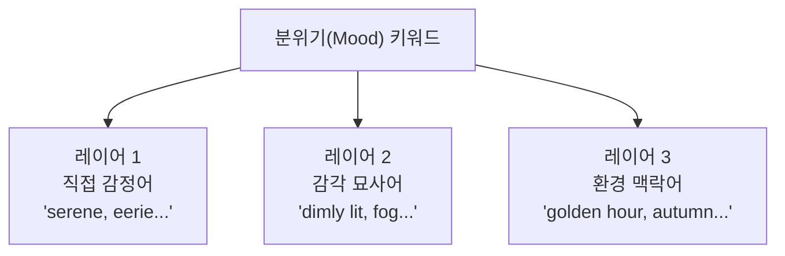

# 분위기와 감정 키워드 전략

> 프롬프트의 마지막 퍼즐 — 분위기 키워드로 이미지에 감정을 입히는 전략을 완성합니다.

## 개요

빈 카페 하나를 떠올려보세요:

```
an empty café interior, cozy, warm afternoon light, inviting atmosphere
```
→ 커피향이 느껴지는 편안한 공간

```
an empty café interior, eerie, abandoned, cold blue tones, dust floating in air
```
→ 으스스한 폐건물

주제, 구도, 조명이 모두 같아도 **분위기 키워드 하나가 이미지의 감정을 뒤바꿉니다**.

**학습 목표**:
- 분위기 키워드의 3가지 레이어를 이해한다
- 색상 팔레트 키워드로 감정을 정밀하게 제어한다
- 시간대/계절/날씨 키워드로 분위기를 간접 설정한다

## 분위기 키워드의 3가지 레이어

### 레이어 1 — 직접 감정어

가장 직관적이지만, AI 해석이 모호할 수 있어요.

| 감정 계열 | 키워드 |
|-----------|--------|
| 평화/안정 | `serene, peaceful, tranquil, calm` |
| 활기/에너지 | `vibrant, energetic, dynamic, lively` |
| 긴장/불안 | `tense, ominous, unsettling, eerie` |
| 슬픔/그리움 | `melancholic, wistful, somber, nostalgic` |
| 신비/경이 | `mystical, ethereal, otherworldly, dreamlike` |
| 따뜻함/친밀 | `cozy, intimate, warm, inviting` |

### 레이어 2 — 감각 묘사어 (더 정확!)

감정을 직접 말하지 않고 **물리적 상태를 묘사**하면 더 정확한 결과가 나와요.

**"mysterious" 대신:**
```
dimly lit ancient library, long shadows stretching across the floor, dust particles floating in a single beam of light, fog seeping under the door
```


**"joyful" 대신:**
```
a summer festival scene, bright sunlight, colorful paper lanterns and confetti in the air, golden warm tones, people laughing in the background
```


**"lonely" 대신:**
```
a single figure sitting on a bench in an empty park, overcast sky, muted desaturated colors, fallen leaves scattered around, distant fog
```


### 레이어 3 — 환경 맥락어

시간대, 날씨, 계절로 분위기를 **간접 설정**합니다.



> 🔥 **최고의 결과는 3레이어 조합!**

```
a fisherman's cottage by the sea, nostalgic mood, faded warm tones with soft film grain, late autumn afternoon, gentle mist rolling in from the ocean
```


## 색상 팔레트 키워드 — 감정의 과학

### 난색 vs 한색

**난색 — 에너지, 열정, 따뜻함:**
```
a bustling Indian spice market, warm orange and amber palette, golden sunlight, rich saturated colors, lively and energetic
```


**한색 — 평온, 신뢰, 외로움:**
```
an abandoned ship frozen in Arctic ice, cool blue and teal tones, pale light, vast empty landscape, isolated and still
```


**중성색 — 안정, 세련:**
```
a minimalist architect's workspace, muted earth tones, beige and warm gray palette, natural materials, desaturated, sophisticated
```


### 채도와 명도 효과

**높은 채도 — 활기:**
```
a tropical bird perched on a flower, vibrant saturated colors, lush green background, vivid reds and blues, lively and exotic
```


**낮은 채도 — 차분, 우울:**
```
an old woman looking through a rain-streaked window, desaturated muted tones, low contrast, soft focus, melancholic and quiet
```


### 색상 팔레트 지정하는 4가지 방법

**1. 직접 색상:**
```
a ballet dancer mid-leap, in shades of deep blue and gold, dark stage background, spotlight
```

**2. 색온도:**
```
a cozy reading nook, warm color palette, amber and cream tones, soft lighting
```

**3. 영화 색보정 용어:**
```
a spy walking through a rainy city, teal and orange color grading, cinematic mood, shallow depth of field
```


**4. 참조 기반:**
```
a pastel-colored hotel lobby, color palette inspired by Wes Anderson films, symmetrical composition, quirky and charming
```


## 시간대와 계절 — 자연이 만드는 분위기

### 시간대별 프롬프트

**새벽 — 시작, 희망:**
```
a hot air balloon rising over lavender fields, dawn, first light, soft pink and purple sky, fresh morning air, hopeful
```


**정오 — 에너지, 강렬함:**
```
a surfer riding a massive wave, high noon harsh sunlight, strong shadows, vivid turquoise water, high contrast, energetic
```


**블루 아워 — 신비, 사색:**
```
Venice canals at blue hour, deep blue and purple tones, gondola silhouettes, soft reflections on water, contemplative and quiet
```


**달빛 밤 — 비밀, 드라마:**
```
a masked ball in a Baroque palace garden, moonlit night, silver light on white marble, mysterious figures in shadow, dramatic and secretive
```


### 계절별 프롬프트

**봄 — 새로움, 설렘:**
```
a narrow street in a Korean village, spring cherry blossoms, petals falling like snow, soft pink and white, fresh green buds, gentle breeze
```


**가을 — 그리움, 성숙:**
```
a winding country road through a forest, autumn fall foliage, amber and burgundy leaves, golden afternoon light, nostalgic and bittersweet
```


**겨울 — 고요, 고독:**
```
a lone cabin with smoke rising from the chimney, winter snow-covered landscape, frost on trees, cold gray sky, quiet and isolated
```


### 날씨 키워드

```
a stone bridge over a river, foggy morning, thick mist obscuring the far bank, mysterious and dreamlike
```


```
a jazz club entrance on a rainy night, rain-soaked neon reflections on pavement, melancholic and atmospheric
```


```
a ship battling a stormy sea, thunderous dark clouds, lightning illuminating massive waves, dramatic and powerful
```


## 감정 → 물리 번역 전략

추상적 감정을 구체적 묘사로 변환하는 것이 핵심 스킬이에요.

| 원하는 감정 | 번역 결과 |
|------------|----------|
| "외로움" | `single figure, vast empty space, desaturated cool tones, overcast sky, long shadows` |
| "희망" | `warm golden light breaking through clouds, upward perspective, vibrant greens, dawn` |
| "긴장감" | `low angle, deep shadows, high contrast, narrow corridor, red accent lighting` |
| "편안함" | `soft diffused light, warm earth tones, shallow depth of field, cozy interior` |

**번역 실습 — "그리움":**
```
a faded photograph lying on an old wooden desk, late afternoon light streaming through dusty curtains, sepia-toned, a withered flower pressed in an open book, time standing still
```


**번역 실습 — "경외감":**
```
a tiny human figure standing at the base of an enormous ancient tree, volumetric god rays from above, mist at the roots, overwhelming scale, sacred and humbling
```


## 실습: 분위기 설계하기

### 활동 1: 감정 번역 워크시트

감정을 3레이어로 번역해보세요:

- **설렘**: 직접 감정어 + 감각 묘사 + 환경 맥락 → 완성 프롬프트
- **공포**: ?
- **고급스러움**: ?

### 활동 2: 동일 장면, 4가지 분위기

"도시 거리의 카페 테라스"로 4개의 프롬프트를 만들어보세요:

**로맨틱:**
```
café terrace on a Parisian street, golden hour, warm amber lighting, a couple sharing wine, rose petals on the table, romantic and intimate
```

**스릴러:**
```
café terrace on a dark city street, flickering neon sign, deep shadows, a lone figure watching from across the road, cold blue-green tones, tense and unsettling
```

**노스탤지어:**
```
café terrace on an old European street, 35mm film photography, faded warm tones, autumn leaves on empty chairs, vintage feel, wistful and bittersweet
```

**미래적:**
```
café terrace in a futuristic megacity, holographic menus, neon lighting, glass and chrome architecture, cyberpunk aesthetic, bustling and electric
```

### 활동 3: 프롬프트 강화

원본을 분위기 요소로 강화해보세요:

**원본:**
```
a lighthouse on a cliff
```

**강화된 버전 (예시):**
```
a weathered lighthouse on a dramatic sea cliff, stormy twilight, crashing waves below, a single warm light glowing in the tower, deep navy and amber tones, resilient and solitary, cinematic atmosphere
```


## 팁과 주의사항

> ⚠️ "mysterious" 한 단어로는 부족해요. AI는 수천 가지로 해석할 수 있거든요. **3레이어 조합**이 정확한 결과를 만듭니다.

> 🔥 **색상 이름은 구체적으로**: "blue"보다 `cerulean blue`, `steel blue`, `navy blue`가 훨씬 정확해요. `dusty rose and sage green` 같은 디자인 용어도 잘 먹힙니다.

> 💡 **플랫폼별 차이**: ChatGPT/Gemini에서는 서술형이 강력하고, Midjourney에서는 `nostalgic, faded film, rainy window, soft muted tones` 같은 키워드 나열이 효과적입니다.

## 핵심 정리

| 개념 | 설명 |
|------|------|
| **분위기 3레이어** | 직접 감정어 + 감각 묘사어 + 환경 맥락어 조합 |
| **감각 묘사어 우선** | 추상적 감정어보다 물리적 묘사가 더 정확 |
| **색상 팔레트** | 색온도, 채도, 명도로 감정을 제어 |
| **시간대/계절/날씨** | 환경 맥락 하나로 조명+색감+공기감 설정 |
| **감정→물리 번역** | 원하는 감정을 시각 요소로 변환하는 핵심 스킬 |

## 다음 세션 미리보기

6요소를 하나씩 모두 배웠습니다! 다음 세션에서는 이 6가지를 하나의 **재사용 가능한 프롬프트 템플릿**으로 통합합니다. 장르별 맞춤 템플릿과 프롬프트 라이브러리 관리법까지 — Ch2의 마무리 세션이에요.
