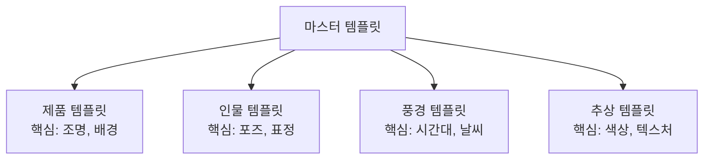

# 나만의 프롬프트 템플릿 만들기

> 6요소를 재사용 가능한 템플릿으로 통합하고, 장르별 맞춤 템플릿과 프롬프트 라이브러리를 완성합니다.

## 개요

매번 빈 텍스트 필드 앞에서 "뭘 써야 하지?" 하는 시간, 6요소 프레임워크를 **템플릿 시스템**으로 만들어두면 해결됩니다. 일관된 품질의 이미지를 빠르게 생성하는 비결이에요. Ch2의 마무리 세션입니다.

**학습 목표**:
- 6요소를 변수 슬롯으로 변환한 범용 템플릿을 설계한다
- 제품, 인물, 풍경, 추상 장르별 맞춤 템플릿을 구축한다
- 한국어와 영어 프롬프트의 플랫폼별 효과 차이를 이해한다

## 마스터 템플릿 — 빈칸 채우기로 프롬프트 완성

### 영어 마스터 템플릿

```
{Subject}, {Style}, {Composition}, {Lighting}, {Medium}, {Mood}
```

### 한국어 마스터 템플릿 (ChatGPT/Gemini용)

```
{주제 설명}, {스타일} 스타일, {구도} 구도, {조명} 조명, {매체} 느낌, {분위기} 분위기
```

**실제로 채워보면 — 제품:**
```
A sleek wireless headphone on a marble surface, minimalist product photography, centered eye-level angle, soft studio lighting with rim light, commercial photography 8K, clean premium sophisticated aesthetic
```


**실제로 채워보면 — 풍경:**
```
a misty mountain lake at dawn, Impressionist landscape painting, wide shot rule of thirds, golden hour with volumetric fog, oil on canvas with textured brushstrokes, serene contemplative peaceful mood
```


## 장르별 맞춤 템플릿



### 제품 템플릿

```
{Product} with {material/texture} finish, placed on {surface},
{composition}, {lighting setup},
{medium}, {mood} aesthetic
```

**예시 — 화장품:**
```
a luxury lipstick with matte rose gold casing, placed on a black velvet surface, centered composition with slight overhead angle, dramatic rim lighting with soft fill, commercial product photography 8K, elegant and luxurious aesthetic
```


**예시 — 전자제품:**
```
a pair of matte black wireless earbuds in their charging case, placed on a light gray concrete surface, eye-level angle with shallow depth of field, clean studio lighting, minimalist product photography, modern and sleek aesthetic
```


**예시 — 식품:**
```
an artisan sourdough bread with golden crust, placed on a rustic wooden cutting board with flour dust, high angle overhead shot, warm natural window light, food photography style, homemade and inviting aesthetic
```


### 인물 템플릿

```
{Person description}, {expression/emotion}, wearing {outfit},
{pose}, {camera angle and shot size},
{lighting}, {medium}, {mood}
```

**예시 — 다큐멘터리 인물:**
```
an elderly artisan with weathered hands, gentle knowing smile, wearing a linen apron, sitting at a pottery wheel shaping clay, medium shot from slightly low angle, Rembrandt lighting with warm fill, documentary photography, nostalgic and dignified mood
```


**예시 — 패션 에디토리얼:**
```
a confident young woman with short silver hair, fierce gaze, wearing an oversized structured blazer, standing with crossed arms, medium close-up eye level, dramatic side lighting, high fashion editorial photography, bold and empowering mood
```


**예시 — 감성 인물:**
```
a girl in her teens holding a sparkler at night, eyes full of wonder, wearing a cream knit sweater, close-up portrait, warm bokeh lights in background, 35mm film photography with natural grain, dreamy and magical mood
```


### 풍경 템플릿

```
{Location/terrain}, during {time/season/weather},
{foreground element} in foreground, {background element} in background,
{composition}, {lighting}, {medium}, {mood}
```

**예시 — 바다 풍경:**
```
a dramatic coastal cliff overlooking the Atlantic Ocean, during autumn sunset with scattered clouds, wild grass and wildflowers in foreground, a distant lighthouse in background, wide shot with leading lines toward the horizon, golden hour with volumetric light rays, landscape photography, majestic and contemplative
```


**예시 — 도시 풍경:**
```
a rooftop view of Seoul at blue hour, during early winter with light snow falling, rooftop railing and potted plants in foreground, Namsan Tower glowing in background, wide shot rule of thirds, city lights and blue-purple sky, cinematic photography, urban and poetic
```


### 추상 템플릿

```
Abstract {shapes/patterns}, {color palette},
{texture/material feel}, {movement/direction},
{medium}, {mood}
```

**예시:**
```
Abstract flowing organic shapes resembling ocean waves, deep indigo and coral palette with gold accents, smooth gradient textures with sharp geometric interruptions, dynamic diagonal movement, digital art mixed media, ethereal and energetic
```


```
Abstract concentric circles radiating outward, monochromatic midnight blue palette with silver highlights, metallic liquid texture, expanding outward motion, 3D render, calm and hypnotic
```


## 한국어 vs 영어 — 플랫폼별 언어 전략

| 플랫폼 | 한국어 지원 | 권장 전략 |
|--------|-----------|----------|
| **ChatGPT** | 우수 | 한국어로 자유롭게. 뉘앙스도 잘 이해 |
| **Gemini** | 양호 | 한국어 가능. 세밀한 스타일은 영어가 유리 |
| **Midjourney** | 미지원 | **반드시 영어**. 한국어 입력 시 엉뚱한 결과 |

**ChatGPT 한국어 프롬프트 예시:**
```
대리석 위에 놓인 매끈한 무선 헤드폰, 미니멀리스트 제품 사진 스타일, 중앙 정렬 눈높이 앵글, 부드러운 스튜디오 림라이트 조명, 8K 상업 사진 느낌, 깔끔하고 프리미엄한 분위기
```


```
안개 낀 새벽 호숫가, 인상주의 풍경화 스타일, 삼분법 구도로 호수가 오른쪽에, 황금빛 자연광, 유화 질감에 붓터치가 보이게, 고요하고 명상적인 분위기
```


> 🔥 **영어가 부담스러운 분을 위한 팁**: ChatGPT에게 한국어로 원하는 이미지를 설명한 뒤, "이 설명을 Midjourney용 영어 프롬프트로 변환해 줘"라고 요청하세요.

> ⚠️ **"영어가 무조건 좋다"는 미신**: ChatGPT에서는 "을씨년스러운 가을 골목길" 같은 한국어 표현이 영어보다 뉘앙스가 더 정확할 수 있어요.

## 플랫폼별 포맷 최적화

### ChatGPT용 (문장형, 한국어/영어)

```
대리석 위에 놓인 로즈골드 스마트워치 이미지를 만들어 줘. 미니멀리스트 제품 사진 스타일로, 중앙 정렬 눈높이 구도를 적용해 줘. 부드러운 스튜디오 림라이트를 사용해서 프리미엄한 분위기를 만들어 줘. 8K 상업 사진 느낌으로 렌더링해 줘.
```

### Gemini용 (구조화)

```
Generate a product photography image:
Subject: rose gold smartwatch on dark marble surface
Style: minimalist commercial photography
Composition: centered, eye-level angle
Lighting: soft three-point studio lighting with rim light
Mood: clean, premium, sophisticated
Quality: 8K sharp focus
```

### Midjourney용 (키워드 + 파라미터, 영어 필수)

```
rose gold smartwatch on dark marble surface, minimalist product photography, centered composition, soft studio rim lighting, commercial 8K, clean premium aesthetic --ar 4:3 --s 200
```

> 🔥 **변환 규칙**: 마스터 템플릿 하나를 만들고, "ChatGPT → 한국어 문장", "Midjourney → 영어 키워드 추출 + 파라미터" 규칙을 정해두면 같은 콘셉트를 여러 플랫폼에서 빠르게 테스트할 수 있어요.

## 프롬프트 라이브러리 구축

### 템플릿 카드 구조

| 항목 | 예시 |
|------|------|
| 이름 | "미니멀 제품 — 화이트" |
| 장르 | 제품 |
| 플랫폼 | Midjourney |
| 언어 | 영어 |
| 템플릿 | `{product}, white background, studio lighting...` |
| 성공 예시 | 잘 나온 프롬프트 + 결과 이미지 |
| 태그 | #미니멀 #화이트 #제품 |

### 관리 도구
- **Notion**: 데이터베이스 + 갤러리 뷰 (가장 인기)
- **Google Sheets**: 심플하게 시작
- **메모 앱**: Apple Notes 폴더 구조

### 운영 규칙 3가지
1. **주간 정리**: 좋았던 프롬프트 추가, 안 쓰는 건 아카이브
2. **버전 관리**: 수정 이력 남기기
3. **결과 이미지 첨부**: 베스트 결과를 꼭 함께 저장

## 실습: 나만의 템플릿 만들기

### 활동 1: 내 장르의 3개 변형 프롬프트

가장 자주 만드는 이미지 장르를 선택하고, 위 장르별 템플릿을 참고해서 **3개의 변형 프롬프트**를 만들어보세요.

**예시 — 제품 장르, 3가지 변형:**

```
a ceramic coffee mug with handmade texture, placed on a linen cloth, overhead angle, soft natural morning light, lifestyle photography, warm and homey
```

```
a ceramic coffee mug with handmade texture, placed on a dark slate surface, eye level with steam rising, dramatic side lighting, moody food photography, artisanal and refined
```

```
a ceramic coffee mug with handmade texture, floating in mid-air with coffee splashing out, white background, studio lighting, commercial action shot, dynamic and playful
```


### 활동 2: 장르 크로스오버 실험

**공통 주제**: "오래된 나무 탁자 위의 커피 한 잔"

이 주제를 4가지 관점으로 변환해보세요:

**제품 관점:**
```
a pour-over coffee in a clear glass server on an aged oak table, high angle flat lay, soft studio lighting, commercial food photography, clean and appetizing
```

**인물 관점:**
```
weathered hands of an elderly person wrapping around a warm coffee cup on an old wooden table, close-up, Rembrandt lighting, 35mm film photography, intimate and contemplative
```

**풍경 관점:**
```
a coffee cup on a rustic wooden table by a window overlooking a rainy autumn garden, wide shot, overcast natural light, watercolor style, peaceful and nostalgic
```

**추상 관점:**
```
abstract composition inspired by coffee — swirling amber and dark brown fluid shapes, cream-colored wisps of steam, warm earth tone palette, macro texture detail, digital art, sensual and meditative
```


## 팁과 주의사항

> ⚠️ "완벽한 템플릿 하나면 만능이다" — 아닙니다. 장르별 3~4개 템플릿이 만능 1개보다 훨씬 실용적이에요.

> 🔥 프로젝트 시작할 때 **15분 투자**해서 전용 템플릿 2~3개를 만들어두면, 수십 장을 만들 때 엄청난 시간 절약이에요.

> 💡 **앵커 키워드**: 어떤 슬롯을 바꿔도 항상 유지되는 고정 키워드를 넣어두세요. 제품 템플릿에 `8K, studio quality, professional`을 고정하면 품질이 보장됩니다.

> 💡 **프롬프트 순서**: 가장 중요한 요소(주제, 스타일)를 앞에, 세부 조정(분위기, 매체)을 뒤에 배치. AI는 앞쪽 키워드에 더 많은 가중치를 줍니다.

## 핵심 정리

| 개념 | 설명 |
|------|------|
| **마스터 템플릿** | 6요소를 빈칸(슬롯)으로 만든 범용 뼈대 |
| **장르별 템플릿** | 제품(질감+배경), 인물(포즈+표정), 풍경(시간대+레이어) 등 |
| **언어 전략** | ChatGPT 한국어 우수, Midjourney 영어 필수 |
| **플랫폼별 포맷** | ChatGPT(문장형), Gemini(구조화), Midjourney(키워드+파라미터) |
| **프롬프트 라이브러리** | 템플릿 + 성공 예시를 체계적으로 저장·분류 |

## 다음 챕터 미리보기

축하합니다! Ch2의 6개 세션을 모두 마쳤어요. 프롬프트의 6가지 요소를 배우고, 재사용 가능한 템플릿 시스템으로 통합했습니다.

다음 챕터 [Ch3. ChatGPT 이미지 생성 실전](03-ch3-chatgpt-이미지-생성-실전/01-01-gpt-4o-이미지-생성의-특징과-강점.md)에서는 이 템플릿을 들고 실전 무대에 올라갑니다. GPT-4o의 이미지 생성 특징, 대화형 수정 워크플로우, 텍스트가 포함된 디자인 제작까지 — 본격적인 실습이에요.
