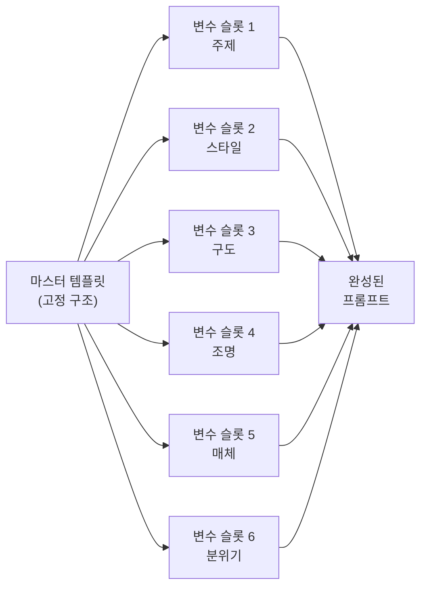
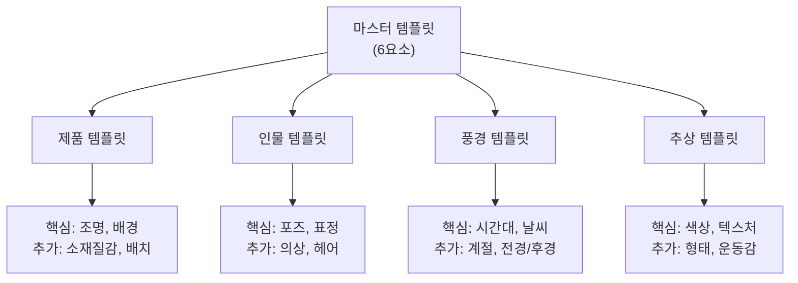
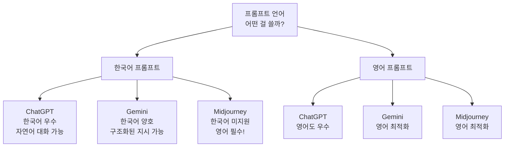
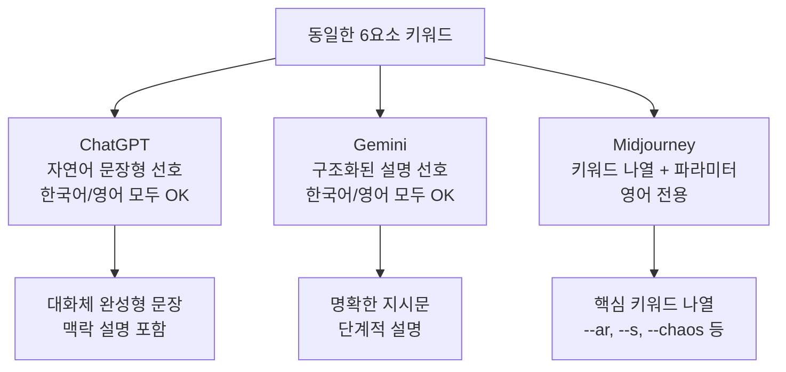
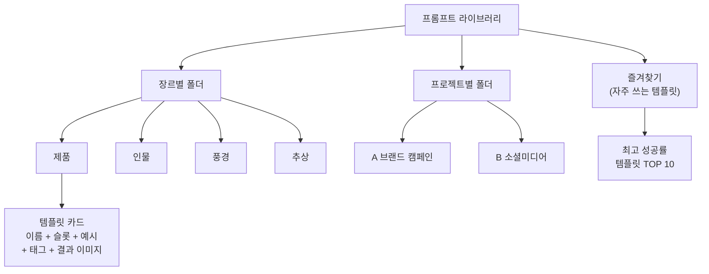
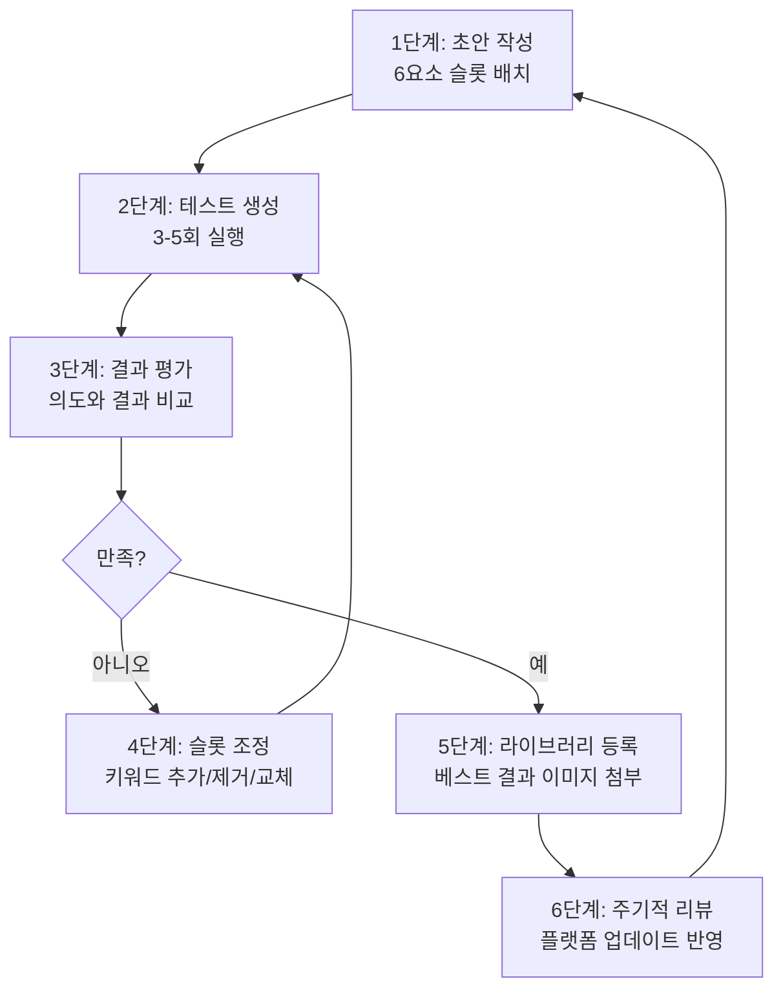

# 나만의 프롬프트 템플릿 만들기

> 6요소 프레임워크를 조합한 재사용 가능한 프롬프트 템플릿을 구축하고, 장르별 맞춤 템플릿과 체계적인 프롬프트 라이브러리를 완성합니다.

## 개요

이 섹션에서는 지금까지 배운 6요소 프레임워크(주제, 스타일, 구도, 조명, 매체, 분위기)를 하나의 **재사용 가능한 템플릿 시스템**으로 통합합니다. 매번 프롬프트를 처음부터 작성하는 대신, 변수 슬롯이 있는 템플릿을 만들어 두면 일관된 품질의 이미지를 빠르게 생성할 수 있습니다.

**선수 지식**: [프롬프트 해부학 — 6요소 프레임워크](02-ch2-프롬프트-구조-마스터/01-01-프롬프트-해부학-6요소-프레임워크.md)에서 배운 6가지 요소의 역할, [주제와 스타일](02-ch2-프롬프트-구조-마스터/02-02-주제와-스타일-무엇을-어떤-느낌으로.md)부터 [분위기와 감정 키워드 전략](02-ch2-프롬프트-구조-마스터/05-05-분위기와-감정-키워드-전략.md)까지 다룬 각 요소별 키워드 지식

**학습 목표**:
- 6요소를 변수 슬롯으로 변환한 범용 프롬프트 템플릿을 설계할 수 있다
- 제품, 인물, 풍경, 추상 장르별 맞춤 템플릿을 구축할 수 있다
- 한국어와 영어 프롬프트의 플랫폼별 효과 차이를 이해하고 적절히 선택할 수 있다
- 프롬프트 라이브러리를 체계적으로 관리하고 반복 활용할 수 있다

## 왜 알아야 할까?

요리사에게 레시피북이 있듯, 크리에이터에게는 **프롬프트 템플릿 라이브러리**가 있어야 합니다. 매번 빈 텍스트 필드 앞에서 "뭘 써야 하지?"라고 고민하는 시간을 떠올려 보세요. 프롬프트 5개를 작성하는 데 30분이 걸렸다면, 템플릿이 있으면 5분이면 됩니다.

실무에서 디자이너가 AI 이미지를 생성할 때 가장 큰 병목은 **프롬프트 작성 시간**이 아니라 **일관성 유지**입니다. 클라이언트에게 10장의 제품 이미지를 납품해야 할 때, 매번 다른 구조로 프롬프트를 쓰면 스타일이 들쭉날쭉해지죠. 템플릿은 이 문제를 근본적으로 해결합니다.

Ch2 전체를 관통하는 6요소 프레임워크의 최종 목적지가 바로 이 "나만의 템플릿"입니다. 개별 요소를 아무리 잘 알아도, 조합해서 빠르게 꺼내 쓸 수 있는 시스템이 없으면 실전에서 힘을 발휘하기 어렵거든요.

## 핵심 개념

### 개념 1: 변수 슬롯 시스템 — 빈칸 채우기로 프롬프트 완성하기

> 💡 **비유**: 우편 발송 시 사용하는 양식을 떠올려 보세요. "수신인: _____, 주소: _____, 내용: _____"처럼 빈칸만 채우면 편지가 완성됩니다. 프롬프트 템플릿도 똑같은 원리예요. 6요소를 빈칸(변수 슬롯)으로 만들어 두고, 상황에 따라 적절한 키워드를 끼워 넣는 거죠.

변수 슬롯 시스템이란 프롬프트의 고정 구조는 유지하면서, **바뀌는 부분만 교체**할 수 있도록 설계하는 방법입니다. 6요소 프레임워크를 그대로 슬롯으로 변환하면 됩니다.

**범용 마스터 템플릿:**

```
{주제} in the style of {스타일}, {구도} composition, {조명} lighting, {매체} medium, {분위기} mood
```

이 한 줄이 모든 AI 이미지 프롬프트의 뼈대입니다. 각 `{슬롯}`에 이전 섹션들에서 배운 키워드를 넣으면 완성이죠.

"잠깐, 영어로 써야 하나요?" 하고 궁금해하실 수 있는데요. 위 마스터 템플릿은 **영어 기준**으로 작성되어 있습니다. 영어가 부담스러운 분들도 걱정하지 마세요 — 뒤에서 플랫폼별로 한국어가 통하는 곳과 영어가 필수인 곳을 정리해 드릴 거예요. 일단 지금은 이 구조 자체에 집중해 주세요.

> 📊 **그림 1**: 변수 슬롯 시스템의 구조



실제로 슬롯을 채워보겠습니다:

| 슬롯 | 예시 A (제품) | 예시 B (풍경) |
|------|-------------|-------------|
| 주제 | A sleek wireless headphone on a marble surface | A misty mountain lake at dawn |
| 스타일 | minimalist product photography | impressionist landscape painting |
| 구도 | centered, eye-level angle | wide shot, rule of thirds |
| 조명 | soft studio lighting with rim light | golden hour, volumetric fog |
| 매체 | commercial photography, 8K | oil on canvas, textured brushstrokes |
| 분위기 | clean, premium, sophisticated | serene, contemplative, peaceful |

같은 구조에서 슬롯 값만 바꿨을 뿐인데, 완전히 다른 장르의 프롬프트가 완성됩니다. 이것이 템플릿의 힘이에요.

> ⚠️ **흔한 오해**: "템플릿을 쓰면 창의성이 제한된다"고 생각하는 분들이 많습니다. 하지만 현실은 정반대예요. 구조가 잡혀 있으면 오히려 각 슬롯 안에서 더 과감한 실험을 할 수 있습니다. 재즈 뮤지션이 코드 진행이라는 구조 안에서 자유롭게 즉흥 연주를 하는 것처럼요.

### 개념 2: 장르별 맞춤 템플릿 설계

> 💡 **비유**: 같은 밀가루 반죽이라도 피자, 빵, 파스타로 만들 때 레시피가 다르죠. 범용 마스터 템플릿도 장르에 따라 **강조하는 슬롯**과 **추가하는 슬롯**이 달라집니다.

장르마다 결과물의 품질을 결정짓는 **핵심 요소**가 다릅니다. 제품 사진은 조명과 배경이, 인물 사진은 포즈와 표정이, 풍경은 시간대와 날씨가, 추상은 색상과 텍스처가 핵심이거든요.

> 📊 **그림 2**: 장르별 핵심 슬롯 비중



#### 제품 템플릿

```
{제품명} with {소재/질감} finish, placed on {배경 표면},
{배치 구도}, {조명 설정},
{매체}, {분위기} aesthetic
```

**사용 예시**: "A rose gold smartwatch with brushed metal finish, placed on a dark slate surface, centered composition with slight overhead angle, three-point studio lighting with soft key light, commercial product photography 8K, clean minimal premium aesthetic"

핵심 포인트: 제품 템플릿에서는 **소재/질감**과 **배경 표면** 슬롯이 추가됩니다. "brushed metal", "matte ceramic", "glossy plastic" 같은 질감 키워드가 제품의 고급스러움을 결정하거든요.

#### 인물 템플릿

```
{인물 설명}, {표정/감정}, wearing {의상},
{포즈}, {카메라 앵글과 샷 사이즈},
{조명}, {매체}, {분위기}
```

**사용 예시**: "An elderly artisan with weathered hands, gentle knowing smile, wearing a linen apron, sitting at a pottery wheel, medium shot from slightly low angle, Rembrandt lighting with warm fill, documentary photography, nostalgic and dignified mood"

핵심 포인트: 인물 템플릿에서는 **표정/감정**과 **포즈** 슬롯이 결과물의 서사를 좌우합니다. [구도와 앵글](02-ch2-프롬프트-구조-마스터/03-03-구도와-앵글-시선을-이끄는-프레이밍.md)에서 배운 카메라 앵글이 여기서 진가를 발휘하죠.

#### 풍경 템플릿

```
{장소/지형}, during {시간대/계절/날씨},
{전경 요소} in foreground, {후경 요소} in background,
{구도}, {조명}, {매체}, {분위기}
```

**사용 예시**: "A coastal cliff overlooking the ocean, during autumn sunset with scattered clouds, wildflowers in foreground, lighthouse in background, wide shot with leading lines, golden hour with volumetric light rays, landscape photography, majestic and contemplative"

핵심 포인트: 풍경에서는 **전경/후경 레이어링**이 깊이감을 만듭니다. 단순히 "산 풍경"보다 전경·중경·후경을 명시하면 훨씬 입체적인 결과를 얻을 수 있어요.

#### 추상 템플릿

```
Abstract {형태/패턴}, {색상 팔레트},
{텍스처/재질감}, {운동감/방향성},
{매체}, {분위기}
```

**사용 예시**: "Abstract flowing organic shapes, deep indigo and coral palette with gold accents, smooth gradient textures with sharp geometric interruptions, dynamic diagonal movement, digital art mixed media, ethereal and energetic"

핵심 포인트: 추상 템플릿에서는 [분위기와 감정 키워드 전략](02-ch2-프롬프트-구조-마스터/05-05-분위기와-감정-키워드-전략.md)에서 배운 **색상 팔레트 지정법**이 핵심 무기가 됩니다. "warm earth tones", "monochromatic blue" 같은 팔레트 키워드가 추상 이미지의 정체성을 결정하거든요.

### 개념 3: 한국어 vs 영어 프롬프트 — 플랫폼별 언어 전략

> 💡 **비유**: 해외여행을 갈 때, 어떤 나라는 영어만 통하고, 어떤 나라는 현지어도 잘 통하죠. AI 이미지 플랫폼도 마찬가지예요. 어떤 플랫폼은 한국어를 척척 알아듣고, 어떤 플랫폼은 영어가 아니면 의사소통이 안 됩니다.

앞서 마스터 템플릿을 영어로 소개했는데요, "나는 영어가 어려운데 어떡하지?"라고 걱정하신 분들이 계실 거예요. 좋은 소식은, **플랫폼에 따라 한국어만으로도 충분히 좋은 결과를 얻을 수 있다**는 점입니다. 다만 플랫폼마다 언어 처리 방식이 다르기 때문에, 이 차이를 알고 있어야 합니다.

> 📊 **그림 3**: 플랫폼별 언어 지원 현황



#### 플랫폼별 언어 전략 비교

| 플랫폼 | 한국어 지원 | 영어 대비 품질 | 권장 전략 |
|--------|-----------|--------------|----------|
| **ChatGPT** | 우수 | 거의 동일 | 한국어로 자유롭게 작성. 복잡한 뉘앙스도 잘 이해함 |
| **Gemini** | 양호 | 약간 차이 | 한국어 기본 사용 가능. 세밀한 스타일 지정은 영어가 유리 |
| **Midjourney** | 미지원 | 영어만 가능 | **반드시 영어 사용**. 한국어 입력 시 의도와 다른 결과 |

**ChatGPT는 한국어의 강자입니다.** "안개 낀 새벽 호숫가, 인상주의 풍경화 스타일, 삼분법 구도, 황금빛 자연광, 유화 질감, 고요하고 명상적인 분위기"라고 한국어로 써도 영어 프롬프트와 거의 동일한 품질의 결과를 얻을 수 있어요. GPT-4o는 다국어 이해 능력이 뛰어나서, 한국어의 미묘한 뉘앙스("포근한" vs "따뜻한" vs "온화한")까지 잘 구분합니다.

**Midjourney는 영어가 필수입니다.** Midjourney의 이미지 모델은 영어 텍스트-이미지 데이터로 학습되었기 때문에, 한국어를 입력하면 글자를 제대로 해석하지 못하고 엉뚱한 결과가 나옵니다. "미니멀한 제품 사진"이라고 입력하면, 의도와 전혀 다른 이미지가 생성될 수 있어요.

> 🔥 **실무 팁**: 영어가 부담스러운 분들을 위한 **실전 워크플로우**가 있습니다. ChatGPT에게 한국어로 원하는 이미지를 설명한 뒤, "이 설명을 Midjourney용 영어 프롬프트로 변환해 줘"라고 요청하세요. ChatGPT가 6요소 구조에 맞는 영어 프롬프트를 만들어 줍니다. 이 방법이면 영어 실력에 관계없이 Midjourney의 뛰어난 미학적 품질을 활용할 수 있어요.

**한국어 마스터 템플릿 (ChatGPT/Gemini용):**

```
{주제 설명}, {스타일} 스타일, {구도} 구도, {조명} 조명, {매체} 느낌, {분위기} 분위기
```

**사용 예시**: "대리석 위에 놓인 매끈한 무선 헤드폰, 미니멀리스트 제품 사진 스타일, 중앙 정렬 눈높이 앵글 구도, 부드러운 스튜디오 림라이트 조명, 8K 상업 사진 느낌, 깔끔하고 프리미엄한 분위기"

영어 마스터 템플릿과 구조는 동일하되, 한국어의 자연스러운 어순에 맞춰 슬롯을 배치한 버전입니다. ChatGPT에서는 이 한국어 템플릿만으로도 충분히 훌륭한 결과를 얻을 수 있습니다.

> ⚠️ **흔한 오해**: "영어 프롬프트가 무조건 더 좋은 결과를 만든다"고 생각하는 분들이 많은데, ChatGPT와 Gemini에서는 그렇지 않습니다. 오히려 한국어로 더 정확하게 의도를 전달할 수 있는 경우도 많아요. "을씨년스러운 가을 골목길"처럼 한국어 특유의 감성 표현은 영어로 번역하면 뉘앙스가 살짝 달라지거든요. **자신이 더 정확하게 표현할 수 있는 언어가 최고의 프롬프트 언어**입니다.

### 개념 4: 플랫폼별 템플릿 포맷 최적화

> 💡 **비유**: 같은 이력서 내용이라도 LinkedIn, 사람인, 원티드에 올릴 때 포맷을 조금씩 다르게 하잖아요? AI 플랫폼도 마찬가지입니다. 같은 6요소라도 플랫폼의 특성에 맞게 포장을 달리해야 최고의 결과를 얻을 수 있어요.

언어 선택 외에도, 각 플랫폼이 선호하는 **프롬프트 포맷**이 다릅니다. [주요 플랫폼 비교](01-ch1-ai-이미지-생성-개론/02-02-주요-플랫폼-비교-chatgpt-vs-gemini-vs-midjourney.md)에서 이미 살펴봤지만, 템플릿 수준에서 다시 정리해 보겠습니다.

> 📊 **그림 4**: 플랫폼별 프롬프트 포맷 특성



**ChatGPT 최적화 템플릿:**

ChatGPT는 자연어 문장을 잘 이해하므로, 완성된 문장으로 프롬프트를 작성하는 게 효과적입니다. 한국어와 영어 모두 지원합니다.

```
(한국어) {주제 설명을 완성 문장으로} 이미지를 만들어 줘. 
{스타일} 스타일로, {구도} 프레이밍을 적용해 줘.
{조명}을 사용해서 {분위기} 분위기를 만들어 줘.
{매체} 느낌으로 렌더링해 줘.
```

```
(영어) Create an image of {주제 설명을 완성 문장으로}. 
The style should be {스타일}, with {구도} framing. 
Use {조명} to create a {분위기} atmosphere.
Render in {매체} style.
```

**Gemini 최적화 템플릿:**

Gemini는 구조화된 지시를 잘 따릅니다. 역할과 맥락을 명시하면 더 정확한 결과를 얻을 수 있어요.

```
Generate a {매체} image:
Subject: {주제}
Style: {스타일}  
Composition: {구도}
Lighting: {조명}
Mood: {분위기}
```

**Midjourney 최적화 템플릿 (영어 전용):**

Midjourney는 키워드 나열에 강하고, 전용 파라미터를 활용해야 합니다. **반드시 영어**로 작성해야 합니다.

```
{주제}, {스타일}, {구도 키워드}, {조명 키워드}, 
{매체}, {분위기} --ar {비율} --s {스타일라이즈 값}
```

| 특성 | ChatGPT | Gemini | Midjourney |
|------|---------|--------|------------|
| 프롬프트 형식 | 대화형 문장 | 구조화된 지시 | 키워드 나열 |
| 언어 | 한국어/영어 모두 우수 | 한국어/영어 모두 가능 | **영어 전용** |
| 강점 | 텍스트 포함 이미지, 반복 수정 | 스타일 전환, 멀티모달 | 미학적 품질, 파라미터 제어 |
| 템플릿 팁 | 맥락과 의도를 설명 | 명확한 항목 구분 | 핵심 키워드만 압축 |
| 길이 | 3-5문장 적정 | 항목별 2-3단어 | 20-50단어 + 파라미터 |

> 🔥 **실무 팁**: 하나의 마스터 템플릿을 만들고, 플랫폼별 "변환 규칙"을 정해 두면 편합니다. 예를 들어, "ChatGPT용은 한국어 문장으로 풀어 쓰기", "Midjourney용은 영어 키워드만 추출 + 파라미터 추가" 같은 변환 규칙이요. 이렇게 하면 같은 콘셉트를 여러 플랫폼에서 빠르게 테스트할 수 있습니다.

### 개념 5: 프롬프트 라이브러리 구축과 관리

> 💡 **비유**: 사진작가의 프리셋 라이브러리를 생각해 보세요. Lightroom에 "골든아워 풍경", "무드 있는 인물", "제품 화이트배경" 같은 프리셋을 저장해 두고 원클릭으로 적용하잖아요. 프롬프트 라이브러리는 AI 이미지 생성계의 프리셋 컬렉션입니다.

템플릿을 만들었으면, 이를 체계적으로 **저장·분류·검색·갱신**할 수 있는 시스템이 필요합니다. 아무리 좋은 프롬프트를 만들어도 찾을 수 없으면 소용없으니까요.

> 📊 **그림 5**: 프롬프트 라이브러리의 계층 구조



#### 라이브러리 구성 요소

효과적인 프롬프트 라이브러리에는 각 템플릿마다 다음 정보가 포함되어야 합니다:

**1. 템플릿 카드 구조**

| 항목 | 내용 | 예시 |
|------|------|------|
| 이름 | 직관적인 템플릿 이름 | "미니멀 제품 — 화이트" |
| 장르 | 제품/인물/풍경/추상 | 제품 |
| 플랫폼 | 최적화된 플랫폼 | Midjourney |
| 언어 | 한국어/영어 | 영어 (Midjourney용) |
| 템플릿 본문 | 슬롯이 포함된 프롬프트 | `{제품}, white background...` |
| 슬롯 가이드 | 각 슬롯에 넣을 수 있는 키워드 목록 | 조명: soft, dramatic, rim... |
| 성공 예시 | 실제 사용해서 좋았던 완성 프롬프트 | (이미지와 함께 저장) |
| 태그 | 검색용 키워드 | #미니멀 #화이트 #제품촬영 |
| 최종 수정일 | 마지막 업데이트 날짜 | 2026-03-01 |

**2. 관리 도구 선택**

프롬프트 라이브러리를 관리하는 도구는 본인의 워크플로우에 맞게 선택하면 됩니다:

- **Notion**: 데이터베이스 뷰로 태그 필터링, 갤러리 뷰로 결과 이미지 확인, 템플릿 속성으로 슬롯 관리. 크리에이터들 사이에서 가장 인기 있는 방식이에요.
- **Google Sheets / Excel**: 심플하게 시작하기 좋은 선택. 열(column)별로 슬롯을 나누고, 필터로 검색.
- **전용 앱**: Promptly, PromptBase 같은 프롬프트 관리 전문 서비스도 있습니다.
- **메모 앱**: Apple Notes, Bear 등에 폴더 구조로 정리. 간단하지만 검색이 약할 수 있어요.

**3. 라이브러리 운영 규칙**

템플릿을 그냥 모아두기만 하면 금방 혼란스러워집니다. 세 가지 운영 규칙을 지키세요:

- **주간 정리**: 한 주 동안 사용한 프롬프트 중 좋았던 것을 라이브러리에 추가. 잘 안 쓰는 건 아카이브.
- **버전 관리**: 템플릿을 수정할 때 이전 버전을 지우지 말고 이력을 남기기. "v1 → v2: 조명 슬롯 세분화" 같은 메모.
- **결과 이미지 첨부**: 템플릿만 저장하면 나중에 "이게 어떤 결과였지?" 하게 됩니다. 반드시 베스트 결과 이미지를 함께 저장하세요.

> 💡 **알고 계셨나요?**: 프롬프트 라이브러리라는 개념은 사실 소프트웨어 개발에서 온 것입니다. 개발자들이 코드 스니펫을 라이브러리로 관리하던 관행이 AI 시대에 프롬프트 관리로 확장된 거예요. 2023년부터 Notion 마켓플레이스에 프롬프트 라이브러리 전용 템플릿이 등장하기 시작했고, 2025년에는 30,000개 이상의 프롬프트를 큐레이션한 전문 플랫폼도 생겨났습니다.

### 개념 6: 반복과 진화 — 템플릿 고도화 전략

> 💡 **비유**: 셰프의 시그니처 레시피는 하루아침에 완성되지 않습니다. 수백 번의 시식과 조정을 거쳐 완성되죠. 프롬프트 템플릿도 마찬가지입니다. 처음 만든 템플릿은 "초안"일 뿐이고, 반복 사용과 결과 분석을 통해 점점 정교해져야 합니다.

템플릿은 한 번 만들면 끝이 아닙니다. **사용 → 결과 평가 → 수정 → 재사용**의 순환을 통해 점점 진화해야 합니다.

> 📊 **그림 6**: 템플릿 진화 사이클



**고도화 전략 3단계:**

**레벨 1 — 키워드 교체**: 슬롯 안의 키워드를 A/B 테스트합니다. "soft lighting" vs "diffused lighting" 같은 미세한 차이가 결과를 크게 바꿀 수 있어요.

**레벨 2 — 슬롯 세분화**: 하나의 슬롯을 더 세밀한 하위 슬롯으로 나눕니다. 예를 들어 "조명" 슬롯을 "주광원(key light) + 보조광(fill light) + 배경광(back light)"으로 분리하는 거죠.

**레벨 3 — 컨텍스트 프리셋**: 특정 프로젝트나 클라이언트를 위한 고정 값 세트를 만듭니다. "A 브랜드 프리셋: 스타일=미니멀, 분위기=premium, 색상=모노크롬" 같은 식으로요. 슬롯 중 일부를 미리 채워 둔 "반완성 템플릿"이 됩니다.

## 실습: 적용해보기

### 활동 1: 나만의 마스터 템플릿 설계

아래 워크시트를 채워 자신만의 범용 마스터 템플릿을 만들어 보세요.

**Step 1**: 가장 자주 만드는 이미지 장르를 선택하세요.
- [ ] 제품 사진
- [ ] 인물/초상화
- [ ] 풍경/배경
- [ ] 추상/패턴
- [ ] SNS 콘텐츠
- [ ] 기타: _____

**Step 2**: 주로 사용하는 플랫폼과 언어를 선택하세요.

| 플랫폼 | 사용 여부 | 프롬프트 언어 |
|--------|----------|-------------|
| ChatGPT | [ ] | 한국어 / 영어 |
| Gemini | [ ] | 한국어 / 영어 |
| Midjourney | [ ] | 영어 (필수) |

**Step 3**: 선택한 장르의 핵심 슬롯을 정의하세요.

| 슬롯 번호 | 슬롯 이름 | 자주 쓰는 키워드 3개 |
|-----------|----------|-------------------|
| 1 | 주제 | _____, _____, _____ |
| 2 | 스타일 | _____, _____, _____ |
| 3 | 구도 | _____, _____, _____ |
| 4 | 조명 | _____, _____, _____ |
| 5 | 매체 | _____, _____, _____ |
| 6 | 분위기 | _____, _____, _____ |
| 7 (추가) | _____ | _____, _____, _____ |

**Step 4**: 슬롯을 연결한 템플릿 문장을 작성하세요. (주 사용 플랫폼의 언어로)

```
나의 템플릿: ________________________________________
____________________________________________
____________________________________________
```

**Step 5**: 템플릿에 실제 키워드를 넣어 3개의 변형 프롬프트를 만들어 보세요.

### 활동 2: 장르 크로스오버 실험

같은 주제를 4개의 장르 템플릿에 각각 넣어 보는 실험입니다.

**공통 주제**: "오래된 나무 탁자 위의 커피 한 잔"

이 주제를 아래 관점에서 각각 프롬프트로 변환해 보세요:
1. **제품 관점**: 커피 제품을 돋보이게 하는 상업 사진
2. **인물 관점**: 커피를 마시는 사람의 이야기가 느껴지는 장면
3. **풍경 관점**: 커피가 놓인 공간과 창밖 풍경이 주인공
4. **추상 관점**: 커피의 색감, 증기, 질감에서 영감을 받은 추상 작품

각 변형을 실제로 AI 플랫폼에서 생성해보고, 같은 주제가 템플릿에 따라 얼마나 다른 결과물이 되는지 비교해 보세요.

### 활동 3: 프롬프트 라이브러리 초기 셋업

아래 표를 참고하여 최소 5개의 템플릿 카드를 작성하고, 자신이 선택한 관리 도구(Notion, Sheets 등)에 등록해 보세요.

| # | 템플릿 이름 | 장르 | 플랫폼 | 언어 | 핵심 키워드 3개 |
|---|-----------|------|--------|------|---------------|
| 1 | | | | | |
| 2 | | | | | |
| 3 | | | | | |
| 4 | | | | | |
| 5 | | | | | |

## 더 깊이 알아보기

### 템플릿 사고의 역사 — 크리스토퍼 알렉산더의 "패턴 언어"

프롬프트 템플릿이라는 개념의 뿌리는 의외의 곳에 있습니다. 1977년, 건축가 크리스토퍼 알렉산더(Christopher Alexander)는 *A Pattern Language*라는 책을 출간했어요. 이 책에서 그는 건축 설계의 반복되는 문제들을 "패턴"으로 정리하고, 이 패턴들을 조합해서 건물을 설계하는 방법론을 제안했습니다.

"빛이 두 방향에서 들어오는 방(Light on Two Sides)"이나 "사람들이 자연스럽게 모이는 광장(Activity Pockets)" 같은 패턴을 정의하고, 건축가가 상황에 맞는 패턴을 골라 조합하면 좋은 건물이 나온다는 거죠. 이 아이디어는 소프트웨어 공학의 "디자인 패턴"으로 이어졌고, 오늘날 AI 프롬프트 템플릿까지 그 DNA가 이어지고 있습니다.

우리가 만드는 6요소 프롬프트 템플릿도 본질적으로는 "시각적 패턴 언어"입니다. "골든아워 자연광 + 삼분법 구도 + 따뜻한 분위기"라는 패턴을 정의해 두면, 주제만 바꿔가며 일관된 품질의 이미지를 만들 수 있으니까요.

### 프롬프트 엔지니어링의 산업화

2023년까지만 해도 프롬프트는 개인의 "감"에 의존하는 영역이었습니다. 그런데 2024-2025년 사이에 프롬프트 관리가 하나의 전문 분야로 자리 잡았어요. PromptBase 같은 마켓플레이스에서는 검증된 프롬프트가 거래되기 시작했고, 기업들은 브랜드 프롬프트 가이드라인을 만들기 시작했습니다. 2026년 현재, God of Prompt 같은 플랫폼은 30,000개 이상의 큐레이션된 프롬프트를 제공하고 있습니다.

이런 흐름은 디자인 시스템(Design System)의 역사와 닮았습니다. 과거에는 디자이너마다 자기만의 버튼, 색상, 레이아웃을 만들었지만, 지금은 회사마다 통일된 디자인 시스템을 사용하죠. 프롬프트도 같은 길을 걷고 있는 겁니다.

## 흔한 오해와 팁

> ⚠️ **흔한 오해**: "완벽한 템플릿 하나만 있으면 모든 이미지를 만들 수 있다"고 기대하는 분들이 있습니다. 하지만 범용 템플릿으로 만든 이미지는 "괜찮은" 수준이지 "최고"가 되기 어렵습니다. 장르별 맞춤 템플릿을 3-4개 만들어 두는 것이 한 개의 만능 템플릿보다 훨씬 실용적이에요.

> ⚠️ **흔한 오해**: "영어 프롬프트가 무조건 더 좋은 결과를 만든다"는 것은 미신입니다. ChatGPT에서는 한국어 프롬프트로도 영어와 동등한 결과를 얻을 수 있어요. 다만 Midjourney는 영어가 필수이므로, **플랫폼을 먼저 정하고 언어를 결정**하는 순서가 맞습니다.

> 💡 **알고 계셨나요?**: 프롬프트의 단어 순서도 결과에 영향을 줍니다. 대부분의 AI 모델은 프롬프트 앞부분에 있는 키워드에 더 많은 가중치를 부여합니다. 그래서 가장 중요한 요소(보통 주제와 스타일)를 앞에, 세부 조정 요소(분위기, 매체)를 뒤에 배치하는 것이 템플릿 설계의 기본 원칙입니다.

> 🔥 **실무 팁**: 프로젝트를 시작할 때 "프롬프트 킥오프" 시간을 가져보세요. 15분 정도 투자해서 프로젝트 전용 템플릿 2-3개를 미리 만들어 두면, 이후 수십 장의 이미지를 만들 때 엄청난 시간을 절약할 수 있습니다. 특히 팀 프로젝트에서는 템플릿을 공유하면 스타일 일관성까지 자연스럽게 확보됩니다.

> 🔥 **실무 팁**: 템플릿에 "앵커 키워드"를 넣어 두세요. 앵커 키워드란 어떤 슬롯 값을 넣더라도 항상 유지되는 고정 키워드입니다. 예를 들어 제품 템플릿에 "8K, studio quality, professional"을 앵커로 고정해 두면, 나머지 슬롯을 어떻게 바꿔도 일정 수준 이상의 품질이 보장됩니다.

## 핵심 정리

| 개념 | 설명 |
|------|------|
| 변수 슬롯 시스템 | 6요소를 빈칸(슬롯)으로 변환하여, 고정 구조 + 교체 가능한 키워드로 프롬프트를 조합하는 방식 |
| 마스터 템플릿 | `{주제}, {스타일}, {구도}, {조명}, {매체}, {분위기}` — 모든 장르에 적용 가능한 범용 뼈대 |
| 장르별 맞춤 템플릿 | 제품(질감+배경), 인물(포즈+표정), 풍경(시간대+레이어), 추상(색상+텍스처) 등 핵심 슬롯을 추가한 특화 템플릿 |
| 한국어 vs 영어 전략 | ChatGPT는 한국어 우수, Gemini는 양호, Midjourney는 영어 필수. 플랫폼에 따라 언어를 선택 |
| 플랫폼별 포맷 최적화 | ChatGPT(문장형), Gemini(구조화), Midjourney(키워드+파라미터) — 같은 콘셉트를 플랫폼 특성에 맞게 변환 |
| 프롬프트 라이브러리 | 템플릿 카드(이름, 장르, 슬롯, 예시, 태그, 결과 이미지)를 체계적으로 저장·분류·검색하는 시스템 |
| 템플릿 진화 사이클 | 초안 → 테스트 → 평가 → 조정 → 등록 → 리뷰의 반복으로 템플릿 품질을 지속 개선 |

## 다음 섹션 미리보기

축하합니다! Ch2의 6개 섹션을 모두 마쳤습니다. 프롬프트의 6가지 요소를 개별적으로 깊이 파고들었고, 마지막으로 이를 재사용 가능한 템플릿 시스템으로 통합했습니다.

다음 챕터 [Ch3. ChatGPT 이미지 생성 실전](03-ch3-chatgpt-이미지-생성-실전/01-01-gpt-4o-이미지-생성의-특징과-강점.md)에서는 이 템플릿을 들고 ChatGPT라는 실전 무대에 올라갑니다. GPT-4o의 이미지 생성 특징과 강점을 파악하고, 대화형 인터페이스를 활용한 반복 수정 워크플로우를 익히게 됩니다. 이론에서 실전으로, 본격적인 출격이에요.

## 참고 자료

- [How to Write AI Image Prompts Like a Pro (Let's Enhance)](https://letsenhance.io/blog/article/ai-text-prompt-guide/) - 프롬프트 구조화와 플랫폼별 템플릿 작성법을 실용적으로 정리한 가이드
- [A Complete Guide to ChatGPT Image Generation (Superhuman AI)](https://www.superhuman.ai/c/a-complete-guide-to-chatgpt-image-generation-in-2025) - ChatGPT 이미지 생성의 프롬프트 공식과 용도별 접근법 정리
- [Midjourney Parameter Visual Guide & Cheat Sheet (Tory Barber)](https://torybarber.com/midjourney-parameter-visual-guide/) - Midjourney 파라미터를 시각적으로 정리한 치트시트로, 템플릿에 파라미터를 추가할 때 참고
- [Build an AI Prompt Library in 5 Steps (Ragan)](https://www.ragan.com/build-an-ai-prompt-library-in-5-steps/) - 프롬프트 라이브러리를 체계적으로 구축하는 5단계 가이드
- [AI Prompt Library Organizer Template (Notion)](https://www.notion.com/templates/ai-prompt-library-organizer) - Notion 기반 프롬프트 라이브러리 관리 템플릿

---
### 🔗 Related Sessions
- [6요소 프레임워크](02-ch2-프롬프트-구조-마스터/01-01-프롬프트-해부학-6요소-프레임워크.md) (prerequisite)
- [주제(subject)](02-ch2-프롬프트-구조-마스터/01-01-프롬프트-해부학-6요소-프레임워크.md) (prerequisite)
- [스타일(style)](02-ch2-프롬프트-구조-마스터/01-01-프롬프트-해부학-6요소-프레임워크.md) (prerequisite)
- [구도(composition)](02-ch2-프롬프트-구조-마스터/01-01-프롬프트-해부학-6요소-프레임워크.md) (prerequisite)
- [조명(lighting)](02-ch2-프롬프트-구조-마스터/01-01-프롬프트-해부학-6요소-프레임워크.md) (prerequisite)
- [매체(medium)](02-ch2-프롬프트-구조-마스터/01-01-프롬프트-해부학-6요소-프레임워크.md) (prerequisite)
- [분위기(mood)](02-ch2-프롬프트-구조-마스터/01-01-프롬프트-해부학-6요소-프레임워크.md) (prerequisite)
- [색상 팔레트 지정법](02-ch2-프롬프트-구조-마스터/05-05-분위기와-감정-키워드-전략.md) (prerequisite)
