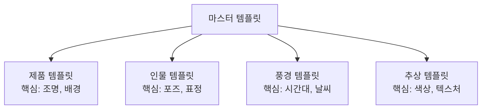

# 나만의 프롬프트 템플릿 만들기

> 6요소를 재사용 가능한 템플릿으로 통합하고, 장르별 맞춤 템플릿과 프롬프트 라이브러리를 완성합니다.

## 개요

매번 빈 텍스트 필드 앞에서 "뭘 써야 하지?" 하는 시간을 떠올려보세요. 6요소 프레임워크를 **템플릿 시스템**으로 만들어두면, 일관된 품질의 이미지를 빠르게 생성할 수 있어요. Ch2의 마무리 세션입니다.

**학습 목표**:
- 6요소를 변수 슬롯으로 변환한 범용 템플릿을 설계한다
- 제품, 인물, 풍경 장르별 맞춤 템플릿을 구축한다
- 한국어와 영어 프롬프트의 플랫폼별 효과 차이를 이해한다

## 마스터 템플릿 — 빈칸 채우기로 프롬프트 완성

우편 양식처럼 빈칸만 채우면 완성되는 구조예요.

### 영어 마스터 템플릿

```
{주제}, {스타일}, {구도} composition, {조명} lighting, {매체}, {분위기} mood
```

### 한국어 마스터 템플릿 (ChatGPT/Gemini용)

```
{주제 설명}, {스타일} 스타일, {구도} 구도, {조명} 조명, {매체} 느낌, {분위기} 분위기
```

**실제로 슬롯을 채워보면:**

| 슬롯 | 예시 A (제품) | 예시 B (풍경) |
|------|-------------|-------------|
| 주제 | 대리석 위에 놓인 무선 헤드폰 | 안개 낀 새벽 산 호수 |
| 스타일 | 미니멀리스트 제품 사진 | 인상주의 풍경화 |
| 구도 | 중앙 정렬, 눈높이 앵글 | 와이드 샷, 삼분법 |
| 조명 | 부드러운 스튜디오 림라이트 | 골든 아워, 볼류메트릭 안개 |
| 매체 | 8K 상업 사진 | 유화, 붓터치 텍스처 |
| 분위기 | 깔끔하고 프리미엄한 | 고요하고 명상적인 |

같은 구조에서 슬롯 값만 바꿨을 뿐인데 완전히 다른 이미지가 완성됩니다!


## 장르별 맞춤 템플릿

장르마다 결과물의 품질을 결정짓는 **핵심 요소**가 달라요.



### 제품 템플릿

```
{제품명} with {소재/질감} finish, placed on {배경 표면},
{배치 구도}, {조명 설정},
{매체}, {분위기} aesthetic
```

> **사용 예시**: `A rose gold smartwatch with brushed metal finish, placed on dark slate surface, centered composition, three-point studio lighting, commercial photography 8K, clean minimal premium aesthetic`

핵심: **소재/질감**(`brushed metal`, `matte ceramic`)과 **배경 표면**(`marble`, `dark slate`)이 추가됩니다.

### 인물 템플릿

```
{인물 설명}, {표정/감정}, wearing {의상},
{포즈}, {카메라 앵글과 샷 사이즈},
{조명}, {매체}, {분위기}
```

> **사용 예시**: `An elderly artisan with weathered hands, gentle knowing smile, wearing linen apron, sitting at a pottery wheel, medium shot slightly low angle, Rembrandt lighting, documentary photography, nostalgic and dignified mood`

핵심: **표정/감정**과 **포즈**가 이미지의 서사를 좌우합니다.

### 풍경 템플릿

```
{장소/지형}, during {시간대/계절/날씨},
{전경 요소} in foreground, {후경 요소} in background,
{구도}, {조명}, {매체}, {분위기}
```

> **사용 예시**: `Coastal cliff overlooking the ocean, during autumn sunset with scattered clouds, wildflowers in foreground, lighthouse in background, wide shot with leading lines, golden hour volumetric rays, landscape photography, majestic contemplative`

핵심: **전경/후경 레이어링**이 깊이감을 만듭니다.

### 추상 템플릿

```
Abstract {형태/패턴}, {색상 팔레트},
{텍스처/재질감}, {운동감/방향성},
{매체}, {분위기}
```

> **사용 예시**: `Abstract flowing organic shapes, deep indigo and coral palette with gold accents, smooth gradient textures, dynamic diagonal movement, digital art mixed media, ethereal and energetic`

핵심: **색상 팔레트**와 **텍스처**가 추상 이미지의 정체성을 결정합니다.

## 한국어 vs 영어 — 플랫폼별 언어 전략

"영어가 어려운데 어떡하지?" 걱정하지 마세요. 플랫폼에 따라 한국어만으로도 충분히 좋은 결과를 얻을 수 있어요.

| 플랫폼 | 한국어 지원 | 권장 전략 |
|--------|-----------|----------|
| **ChatGPT** | 우수 | 한국어로 자유롭게 작성. 복잡한 뉘앙스도 잘 이해 |
| **Gemini** | 양호 | 한국어 기본 사용 가능. 세밀한 스타일 지정은 영어가 유리 |
| **Midjourney** | 미지원 | **반드시 영어 사용**. 한국어 입력 시 엉뚱한 결과 |

> **ChatGPT 한국어 예시**: "안개 낀 새벽 호숫가, 인상주의 풍경화 스타일, 삼분법 구도, 황금빛 자연광, 유화 질감, 고요하고 명상적인 분위기"
→ 영어 프롬프트와 거의 동일한 품질!

> 🔥 **영어가 부담스러운 분을 위한 팁**: ChatGPT에게 한국어로 원하는 이미지를 설명한 뒤, "이 설명을 Midjourney용 영어 프롬프트로 변환해 줘"라고 요청하세요. 영어 실력에 관계없이 Midjourney의 뛰어난 퀄리티를 활용할 수 있어요.

> ⚠️ **흔한 오해**: "영어가 무조건 더 좋다" — ChatGPT에서는 그렇지 않아요. "을씨년스러운 가을 골목길"처럼 한국어 특유의 감성 표현은 영어로 번역하면 뉘앙스가 살짝 달라지거든요. **자신이 더 정확하게 표현할 수 있는 언어가 최고의 프롬프트 언어**입니다.

## 플랫폼별 포맷 최적화

같은 콘셉트라도 플랫폼 특성에 맞게 포맷을 바꿔야 해요.

### ChatGPT용 (문장형)

```
{주제를 완성 문장으로} 이미지를 만들어 줘.
{스타일} 스타일로, {구도} 프레이밍을 적용해 줘.
{조명}을 사용해서 {분위기} 분위기를 만들어 줘.
{매체} 느낌으로 렌더링해 줘.
```

### Gemini용 (구조화)

```
Generate a {매체} image:
Subject: {주제}
Style: {스타일}
Composition: {구도}
Lighting: {조명}
Mood: {분위기}
```

### Midjourney용 (키워드 + 파라미터, 영어 필수)

```
{주제}, {스타일}, {구도}, {조명}, {매체}, {분위기} --ar {비율} --s {스타일라이즈}
```

> 🔥 **실무 팁**: 하나의 마스터 템플릿을 만들고, "ChatGPT용은 한국어 문장으로 풀기", "Midjourney용은 영어 키워드 추출 + 파라미터" 같은 변환 규칙을 정해두면 편해요.

## 프롬프트 라이브러리 구축

템플릿을 만들었으면 체계적으로 **저장·분류·검색**할 수 있는 시스템이 필요해요.

### 템플릿 카드에 포함할 정보

| 항목 | 내용 | 예시 |
|------|------|------|
| 이름 | 직관적인 이름 | "미니멀 제품 — 화이트" |
| 장르 | 제품/인물/풍경/추상 | 제품 |
| 플랫폼 | 최적화된 플랫폼 | Midjourney |
| 언어 | 한국어/영어 | 영어 |
| 템플릿 본문 | 슬롯이 포함된 프롬프트 | `{제품}, white background...` |
| 성공 예시 | 잘 나온 완성 프롬프트 + 이미지 | (함께 저장) |
| 태그 | 검색용 | #미니멀 #화이트 #제품 |

### 관리 도구

- **Notion**: 데이터베이스 + 갤러리 뷰로 가장 인기 있는 방식
- **Google Sheets**: 심플하게 시작하기 좋은 선택
- **메모 앱**: Apple Notes 등에 폴더 구조로 정리

### 라이브러리 운영 규칙 3가지

1. **주간 정리**: 좋았던 프롬프트를 라이브러리에 추가, 안 쓰는 건 아카이브
2. **버전 관리**: 수정 이력 남기기 ("v2: 조명 슬롯 세분화")
3. **결과 이미지 첨부**: 템플릿만 저장하면 나중에 뭐였는지 모름. 베스트 결과 이미지를 꼭 함께 저장

## 실습: 나만의 템플릿 만들기

### 활동 1: 마스터 템플릿 설계

**Step 1**: 가장 자주 만드는 이미지 장르 선택
- [ ] 제품 사진  [ ] 인물  [ ] 풍경  [ ] 추상  [ ] SNS 콘텐츠

**Step 2**: 주로 사용하는 플랫폼과 언어 선택

**Step 3**: 핵심 슬롯 정의

| 슬롯 | 자주 쓰는 키워드 3개 |
|------|-------------------|
| 주제 | _____, _____, _____ |
| 스타일 | _____, _____, _____ |
| 구도 | _____, _____, _____ |
| 조명 | _____, _____, _____ |
| 매체 | _____, _____, _____ |
| 분위기 | _____, _____, _____ |

**Step 4**: 템플릿 완성

```
나의 템플릿: ________________________________________
```

**Step 5**: 실제 키워드를 넣어 3개의 변형 프롬프트를 만들어보세요.

### 활동 2: 장르 크로스오버 실험

**공통 주제**: "오래된 나무 탁자 위의 커피 한 잔"

이 주제를 4가지 관점으로 변환해보세요:
1. **제품 관점**: 커피 제품을 돋보이게 하는 상업 사진
2. **인물 관점**: 커피를 마시는 사람의 이야기
3. **풍경 관점**: 커피가 놓인 공간과 창밖 풍경이 주인공
4. **추상 관점**: 커피의 색감, 증기, 질감에서 영감을 받은 추상 작품

각 변형을 실제로 생성해보고, 같은 주제가 템플릿에 따라 얼마나 다른 결과가 되는지 비교하세요.

## 팁과 주의사항

> ⚠️ **흔한 오해**: "완벽한 템플릿 하나면 만능이다" — 아닙니다. 장르별 맞춤 템플릿 3~4개가 만능 템플릿 1개보다 훨씬 실용적이에요.

> 🔥 **실무 팁**: 프로젝트 시작할 때 **15분 투자**해서 전용 템플릿 2~3개를 만들어두면, 이후 수십 장을 만들 때 엄청난 시간을 절약해요. 팀 프로젝트에서는 템플릿 공유로 스타일 일관성도 자연스럽게 확보됩니다.

> 💡 **앵커 키워드**: 어떤 슬롯 값을 넣어도 항상 유지되는 고정 키워드를 넣어두세요. 제품 템플릿에 `8K, studio quality, professional`을 고정하면 일정 수준 이상의 품질이 보장돼요.

> 💡 **프롬프트 순서**: 가장 중요한 요소(주제, 스타일)를 앞에, 세부 조정(분위기, 매체)을 뒤에 배치하세요. 대부분의 AI는 앞쪽 키워드에 더 많은 가중치를 줍니다.

## 핵심 정리

| 개념 | 설명 |
|------|------|
| **마스터 템플릿** | 6요소를 빈칸(슬롯)으로 만든 범용 뼈대 |
| **장르별 템플릿** | 제품(질감+배경), 인물(포즈+표정), 풍경(시간대+레이어) 등 핵심 슬롯 추가 |
| **언어 전략** | ChatGPT 한국어 우수, Midjourney 영어 필수 |
| **플랫폼별 포맷** | ChatGPT(문장형), Gemini(구조화), Midjourney(키워드+파라미터) |
| **프롬프트 라이브러리** | 템플릿을 체계적으로 저장·분류·검색하는 시스템 |

## 다음 챕터 미리보기

축하합니다! Ch2의 6개 세션을 모두 마쳤어요. 프롬프트의 6가지 요소를 배우고, 재사용 가능한 템플릿 시스템으로 통합했습니다.

다음 챕터 **Ch3. ChatGPT 이미지 생성 실전**에서는 이 템플릿을 들고 실전 무대에 올라갑니다. GPT-4o의 이미지 생성 특징, 대화형 수정 워크플로우, 텍스트가 포함된 디자인 제작까지 — 본격적인 실습이에요.
