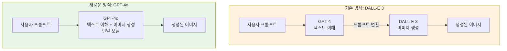
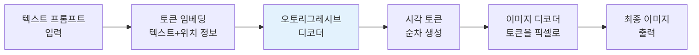
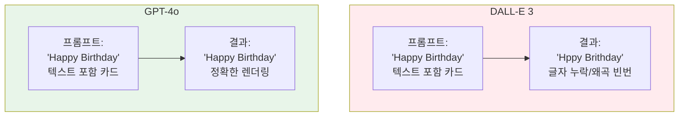
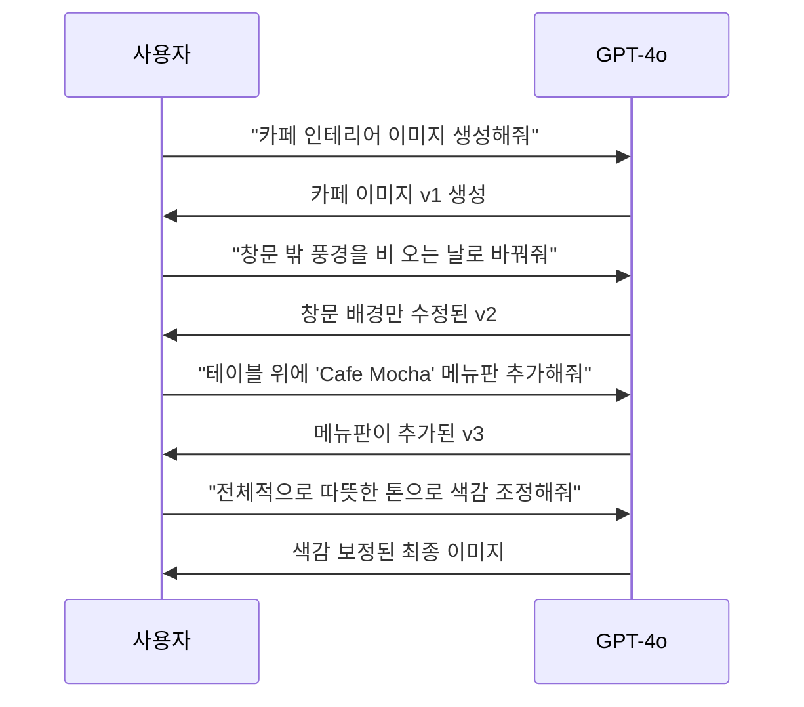
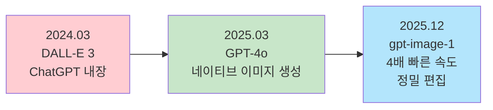

# GPT-4o 이미지 생성의 특징과 강점

> ChatGPT에 내장된 GPT-4o 이미지 생성의 차별점을 이해하고, 디자이너 워크플로우에 어떻게 활용할 수 있는지 알아봅니다.

## 개요

이 섹션에서는 ChatGPT의 네이티브 이미지 생성 기능이 어떤 원리로 작동하며, 기존 DALL-E 3와 무엇이 다른지 살펴봅니다. 텍스트 렌더링, 대화형 편집, 맥락 이해라는 세 가지 핵심 강점을 중심으로 GPT-4o 이미지 생성의 실전 가치를 파악합니다.

**선수 지식**: [프롬프트 해부학 — 6요소 프레임워크](02-ch2-프롬프트-구조-마스터/01-01-프롬프트-해부학-6요소-프레임워크.md)에서 배운 프롬프트 구성 요소, [주요 플랫폼 비교](01-ch1-ai-이미지-생성-개론/02-02-주요-플랫폼-비교-chatgpt-vs-gemini-vs-midjourney.md)에서 살펴본 각 플랫폼의 특성

**학습 목표**:
- GPT-4o 이미지 생성의 기술적 차별점(오토리그레시브 방식)을 설명할 수 있다
- DALL-E 3 대비 개선된 점과 남아있는 한계를 구분할 수 있다
- 텍스트 렌더링, 멀티턴 편집, 맥락 이해 기능의 실무 활용 시나리오를 설계할 수 있다

## 왜 알아야 할까?

여러분이 클라이언트에게 보여줄 포스터 시안을 만든다고 상상해보세요. AI로 멋진 이미지를 생성했는데, "Grand Opening" 텍스트가 "Grnad Oepnig"으로 엉망이 됩니다. 다시 생성하면 이미지 전체가 바뀌어서 마음에 들었던 배경과 구도가 사라집니다. 한 글자만 고치고 싶은데, 처음부터 다시 시작해야 하는 거죠.

GPT-4o 이미지 생성은 바로 이 문제를 해결합니다. 텍스트를 정확하게 렌더링하고, 대화를 통해 원하는 부분만 수정할 수 있거든요. 디자이너에게 이건 단순한 기술 업그레이드가 아니라, **작업 방식 자체의 전환**입니다. "생성 → 폐기 → 재생성"의 반복에서 "생성 → 대화 → 수정 → 완성"의 효율적인 워크플로우로 바뀌는 것이니까요.

## 핵심 개념

### 개념 1: 네이티브 통합 — "통역사 없이 직접 대화하기"

> 💡 **비유**: 이전의 DALL-E 3는 마치 통역사를 통해 외국인 화가에게 그림을 주문하는 것과 같았습니다. 여러분이 "빨간 모자를 쓴 고양이"라고 말하면, 통역사(GPT-4)가 이해한 뒤 화가(DALL-E)에게 전달했죠. 하지만 GPT-4o는 여러분의 말을 직접 알아듣고 직접 그리는 **다재다능한 화가**입니다. 오해가 줄고, 의도가 정확하게 반영됩니다.

기존 ChatGPT의 이미지 생성은 **두 개의 분리된 시스템**이 협업하는 구조였습니다. 언어 모델(GPT-4)이 사용자의 요청을 해석한 다음, 별도의 이미지 생성 모델(DALL-E 3)에게 명령을 전달하는 방식이었죠. 이 과정에서 미묘한 의도나 맥락이 손실되는 경우가 많았습니다.

2025년 3월, OpenAI는 이 구조를 근본적으로 바꿨습니다. GPT-4o는 텍스트 이해와 이미지 생성을 **하나의 모델 안에서** 처리합니다. 같은 두뇌가 여러분의 말을 이해하고, 그 이해를 바탕으로 이미지를 그리는 것이죠. 이것이 바로 "네이티브 통합"의 의미입니다.

> 📊 **그림 1**: DALL-E 3와 GPT-4o의 아키텍처 차이

이 통합이 가져오는 실질적인 차이는 무엇일까요?

| 항목 | DALL-E 3 (분리형) | GPT-4o (통합형) |
|------|------------------|----------------|
| 프롬프트 해석 | 언어 모델이 재해석 후 전달 | 동일 모델이 직접 이해 |
| 맥락 유지 | 이전 대화 맥락 제한적 반영 | 전체 대화 기록 참조 |
| 수정 방식 | 전체 재생성만 가능 | 부분 수정 가능 |
| 텍스트 렌더링 | 자주 깨짐 | 높은 정확도 |
| 지식 활용 | 이미지 생성 모델의 학습 데이터에 한정 | GPT-4o의 방대한 지식 베이스 활용 |

**사례 분석 — "일본 여행 포스터"**

같은 프롬프트를 두 시스템에 넣었다고 가정해봅시다: "벚꽃이 흩날리는 도쿄 타워 앞에서 기모노를 입은 여성, 'Spring in Tokyo' 텍스트 포함"

- **DALL-E 3**: 이미지는 아름답지만 텍스트가 "Sprng in Tkyo"로 깨질 확률이 높고, "기모노"의 디테일이 부정확할 수 있습니다.
- **GPT-4o**: 도쿄 타워의 정확한 형태, 기모노의 적절한 디테일, 그리고 정확한 "Spring in Tokyo" 텍스트가 렌더링됩니다. GPT-4o가 "도쿄 타워"와 "기모노"에 대한 지식을 이미 갖고 있기 때문이죠.

### 개념 2: 오토리그레시브 생성 — "한 획씩 그리는 화가"

> 💡 **비유**: 디퓨전 모델(DALL-E)은 마치 **즉석 사진 현상**과 같습니다. 뿌연 노이즈에서 전체 이미지가 동시에 서서히 떠오르죠. 반면 GPT-4o의 오토리그레시브 방식은 **숙련된 화가가 캔버스에 한 획씩 그리는 것**과 같습니다. 이미 그린 부분을 참고하면서 다음 부분을 그리기 때문에, 전체적인 일관성과 세밀함이 뛰어납니다.

GPT-4o는 이미지를 작은 조각(토큰)으로 나누어 **순차적으로** 생성합니다. 각 토큰을 생성할 때, 이전에 생성된 모든 토큰과 원래 프롬프트를 함께 참고하죠. 이 과정을 좀 더 자세히 살펴볼까요?

> 📊 **그림 2**: 오토리그레시브 이미지 생성 과정

**세 가지 핵심 단계:**

1. **토큰 표현**: 이미지를 약 16×16 픽셀 단위의 작은 패치로 분할합니다. 각 패치에는 행·열 위치 정보가 함께 임베딩됩니다.
2. **순차 생성**: 트랜스포머의 셀프 어텐션 메커니즘이 이미 생성된 토큰들과의 관계를 고려하며 다음 토큰을 생성합니다. 가까운 이웃 토큰으로 세밀한 디테일을, 먼 토큰으로 전체적 일관성을 유지합니다.
3. **이미지 디코딩**: 생성된 시각 토큰들을 실제 픽셀로 변환하여 최종 이미지를 만듭니다.

이 방식이 디자이너에게 주는 실질적 이점은 **프롬프트 충실도**입니다. 같은 모델이 프롬프트를 이해하고 이미지를 "계획"했기 때문에, "빨간 모자를 쓴 파란 재킷의 고양이가 노란 우산을 들고 있다"처럼 여러 속성이 뒤섞인 복잡한 요청도 정확하게 따릅니다. 기존 디퓨전 모델에서 흔하던 "속성 뒤바뀜"(빨간 재킷에 파란 모자가 되는 현상)이 크게 줄어든 거죠.

> ⚠️ **흔한 오해**: "오토리그레시브 방식이 더 빠르다"고 생각하기 쉽지만, 실제로는 디퓨전 방식보다 **생성 속도가 느립니다**. 토큰을 하나씩 순차적으로 만들어야 하니까요. 대신 품질과 정확도에서 큰 이점이 있습니다. OpenAI는 이후 2025년 12월 업데이트에서 속도를 4배 향상시켰습니다.

### 개념 3: 텍스트 렌더링 — "드디어 글자가 읽힌다"

> 💡 **비유**: 기존 AI 이미지 생성에서의 텍스트는 마치 **먼 나라 언어를 한 번도 본 적 없는 사람이 따라 쓰는 것**과 같았습니다. 모양은 비슷한데 자세히 보면 글자가 아니었죠. GPT-4o의 텍스트 렌더링은 **그 언어를 유창하게 아는 서예가**가 쓴 것과 같습니다. 글자의 의미를 이해하기 때문에 정확하게 쓸 수 있는 거죠.

텍스트 렌더링은 AI 이미지 생성의 아킬레스건이었습니다. 아무리 화려한 이미지를 만들어도 "Coffee Shop"이 "Coffe Shpo"으로 렌더링되면 실무에서 쓸 수 없었으니까요. GPT-4o가 이 문제를 해결할 수 있는 이유는 명확합니다 — 텍스트를 **이해하는** 모델이 이미지를 **생성하기** 때문입니다.

> 📊 **그림 3**: 텍스트 렌더링 정확도 비교

**GPT-4o 텍스트 렌더링이 강력한 영역:**

- **영문 텍스트**: 로고, 제목, 슬로건 등 영문 텍스트는 높은 정확도로 렌더링
- **복수 텍스트 요소**: 한 이미지 안에 제목, 부제, 본문 등 여러 텍스트를 동시에 배치 가능
- **다양한 타이포그래피**: 손글씨, 세리프, 산세리프 등 서체 스타일 지정 가능
- **밀집 텍스트**: 2025년 12월 업데이트에서 더 작고 밀집된 텍스트도 처리 가능하게 향상

**현실적인 한계:**

- 한국어, 중국어 등 비영어 텍스트는 아직 정확도가 떨어질 수 있음
- 매우 긴 문장이나 단락 수준의 텍스트는 오류 가능성 증가
- 특수 폰트나 복잡한 레이아웃은 기대와 다를 수 있음

**디자이너를 위한 실전 활용 시나리오:**

| 활용 사례 | 기대 정확도 | 팁 |
|----------|-----------|-----|
| 영문 로고 시안 | 높음 | 짧고 명확한 텍스트일수록 정확 |
| SNS 카드 제목 | 높음 | 2-5단어 수준이 최적 |
| 포스터 슬로건 | 높음 | 폰트 스타일도 함께 지정 |
| 한글 타이틀 | 중간 | 결과 확인 후 보정 필요할 수 있음 |
| 메뉴판/가격표 | 중간-낮음 | 여러 줄 숫자+텍스트는 검증 필수 |

### 개념 4: 멀티턴 편집 — "대화하면서 그림 다듬기"

> 💡 **비유**: DALL-E 3으로 이미지를 수정하는 건 마치 **완성된 유화를 버리고 새 캔버스에 다시 그리는 것**이었습니다. GPT-4o는 **디지털 레이어 위에서 수정하는 것**과 같아요. "이 부분만 바꿔주세요"라고 말하면, 나머지는 그대로 두고 해당 부분만 수정합니다.

GPT-4o의 가장 혁신적인 기능 중 하나는 **대화를 통한 반복 수정**입니다. 이미지를 생성한 후 자연어로 수정을 요청하면, 모델이 전체 대화 맥락을 기억하면서 해당 부분만 변경합니다.

> 📊 **그림 4**: 멀티턴 편집 워크플로우

이 워크플로우가 디자이너에게 왜 강력할까요?

1. **아이디어 탐색이 자유로워집니다**: "배경을 숲으로 바꿔봐" → "아니, 바다로" → "다시 숲으로, 근데 가을 숲으로" — 이런 탐색이 대화만으로 가능합니다.
2. **디테일을 점진적으로 쌓아갈 수 있습니다**: 전체 구도 → 세부 요소 추가 → 색감 조정 → 텍스트 삽입 순으로 단계적 완성이 가능합니다.
3. **클라이언트 피드백을 즉시 반영할 수 있습니다**: "로고를 왼쪽 위로 옮기고 좀 더 크게" 같은 수정을 실시간으로 적용할 수 있습니다.

2025년 12월, OpenAI는 이미지 생성 기능을 대폭 업데이트했습니다. OpenAI가 내부적으로 **`gpt-image-1`**이라는 API 모델명으로 공개한 이 업데이트는 ChatGPT 사용자에게는 "향상된 이미지 생성(improved image generation)" 기능으로 제공되었습니다. 조명, 구도, 인물의 외형 등을 수정 과정에서도 일관되게 유지하며, Select 도구를 통해 이미지의 특정 영역을 직접 선택하여 수정할 수 있게 되었습니다. 이 부분은 [이미지 업로드와 편집 — Select 도구 활용](03-ch3-chatgpt-이미지-생성-실전/04-04-이미지-업로드와-편집-select-도구-활용.md)에서 자세히 다루겠습니다.

> 💡 **알고 계셨나요?**: OpenAI의 이미지 생성 모델 명칭은 문맥에 따라 다르게 불립니다. 개발자용 API에서는 `gpt-image-1`이라는 모델 ID를 사용하고, ChatGPT 사용자 인터페이스에서는 별도 버전명 없이 "이미지 생성" 기능으로 통합 제공됩니다. 커뮤니티에서 편의상 "GPT Image 1" 등으로 부르기도 하지만, OpenAI 공식 명칭은 API 모델명 `gpt-image-1`입니다. 혼동을 피하려면 공식 API 문서를 기준으로 확인하세요.

> 📊 **그림 5**: GPT-4o 이미지 생성 기능의 진화 타임라인

## 실습: 적용해보기

### 활동 1: DALL-E vs GPT-4o 결과 비교 분석

아래 프롬프트를 ChatGPT에 입력하고, 결과를 분석해보세요.

**프롬프트**: "A minimalist book cover with the title 'The Art of Silence' in elegant serif font, dark navy background, single white feather floating in the center"

**분석 워크시트:**

| 평가 항목 | 관찰 내용 (직접 기록) |
|----------|---------------------|
| 텍스트 정확도 | "The Art of Silence"가 정확하게 렌더링되었는가? |
| 폰트 스타일 | 세리프 폰트가 적용되었는가? |
| 색상 정확도 | 다크 네이비 배경이 정확한가? |
| 구도 | 깃털이 중앙에 위치하는가? |
| 전체 품질 | 미니멀리스트 스타일이 반영되었는가? |

### 활동 2: 멀티턴 편집 실습 시나리오

위에서 생성한 북커버 이미지를 아래 순서로 수정해보세요. 각 단계에서 어떤 요소가 유지되고 어떤 요소가 변경되는지 기록합니다.

1. "배경색을 버건디 레드로 바꿔줘" → 기록: 텍스트, 깃털, 구도가 유지되었는가?
2. "부제 'A Journey Within'을 하단에 작은 산세리프 폰트로 추가해줘" → 기록: 기존 요소 + 새 텍스트의 조화
3. "깃털을 벚꽃 한 송이로 교체해줘" → 기록: 전체 분위기 일관성

### 토론 질문

1. 기존 디자인 작업에서 "텍스트가 포함된 시안"을 만들 때 가장 시간이 오래 걸리는 단계는 무엇이었나요? GPT-4o가 그 단계를 어떻게 단축시킬 수 있을까요?
2. 멀티턴 편집에서 "이전 맥락을 기억한다"는 것이 디자인 리비전(revision) 프로세스에 어떤 변화를 가져올 수 있을까요?

## 더 깊이 알아보기

### DALL-E에서 GPT-4o까지 — AI 이미지 생성의 진화 이야기

2021년 1월, OpenAI는 DALL-E를 처음 공개했습니다. 이름은 초현실주의 화가 살바도르 달리(Salvador Dalí)와 픽사의 로봇 캐릭터 월-E(WALL-E)를 합친 것으로, "예술적 창의성과 기술의 결합"을 상징했죠. 하지만 초기 DALL-E의 이미지 품질은 상당히 투박했습니다.

2022년 DALL-E 2가 출시되며 품질이 크게 향상되었고, 2023년 DALL-E 3가 ChatGPT에 통합되면서 대중적으로 널리 쓰이기 시작했습니다. 하지만 텍스트 렌더링 문제는 여전했고, "AI가 만든 이미지"임을 가장 쉽게 알아볼 수 있는 단서가 바로 깨진 글자였습니다.

그러던 2025년 3월, OpenAI는 근본적인 전환을 시도합니다. 별도의 이미지 생성 모델을 쓰는 대신, GPT-4o라는 멀티모달 모델 자체에 이미지 생성 능력을 통합한 것이죠. 놀랍게도 이 결정의 배경에는 "100명 이상의 전문 어노테이터"가 있었습니다. OpenAI는 이들에게 AI 생성 이미지의 오류 — 부자연스러운 손가락 배치, 얼굴 왜곡, 미묘한 비율 문제 — 를 지적하게 하고, 이 피드백으로 모델을 훈련시켰습니다(RLHF). 사람의 미적 감각을 AI에게 가르친 셈이죠.

### 왜 오토리그레시브 방식을 선택했을까?

OpenAI가 디퓨전 모델(DALL-E의 방식)을 버리고 오토리그레시브 방식을 택한 것은 의외의 결정이었습니다. 당시 업계의 주류는 디퓨전 모델이었거든요. 하지만 오토리그레시브 방식에는 결정적인 장점이 있었습니다 — **텍스트와 이미지를 동일한 프레임워크로 처리할 수 있다는 것**. GPT가 이미 텍스트를 토큰 단위로 순차 생성하고 있었으므로, 이미지도 같은 방식으로 처리하면 자연스러운 멀티모달 통합이 가능했던 겁니다.

## 흔한 오해와 팁

> ⚠️ **흔한 오해**: "GPT-4o가 DALL-E 3보다 모든 면에서 우수하다"고 생각하기 쉽지만, 그렇지 않습니다. DALL-E 3가 더 화려하고 미학적으로 극단적인 이미지를 생성하는 경우도 있습니다. GPT-4o는 **정확도와 제어 가능성**에서 강점을 보이고, 추상적이고 자유로운 예술적 표현에서는 때로 DALL-E 3가 더 다채로운 결과를 내기도 합니다.

> 💡 **알고 계셨나요?**: GPT-4o의 이미지 생성 기능이 출시된 2025년 3월, 이 기능은 48시간 만에 전 세계 트위터에서 가장 많이 언급된 AI 토픽이 되었습니다. 특히 "지브리 스타일 변환"이 입소문을 타면서 서버에 과부하가 걸릴 정도였고, OpenAI CEO 샘 알트만도 "GPU가 녹고 있다(our GPUs are melting)"고 표현했습니다.

> 🔥 **실무 팁**: GPT-4o로 텍스트가 포함된 이미지를 생성할 때, 텍스트를 **작은따옴표나 큰따옴표로 감싸서** 명시적으로 지정하세요. 예를 들어 `포스터에 "Grand Opening" 텍스트를 포함해줘`처럼요. 텍스트 내용을 명확히 구분해줄수록 렌더링 정확도가 높아집니다. 또한 영문 텍스트의 경우 대소문자도 정확히 지정하면 원하는 결과를 얻기 쉽습니다.

## 핵심 정리

| 개념 | 설명 |
|------|------|
| 네이티브 통합 | 텍스트 이해와 이미지 생성이 하나의 GPT-4o 모델에서 처리되어 맥락 손실 최소화 |
| 오토리그레시브 생성 | 이미지를 토큰 단위로 순차 생성하여 프롬프트 충실도와 내부 일관성 향상 |
| 텍스트 렌더링 | 영문 텍스트를 높은 정확도로 이미지 안에 렌더링, 비영어는 아직 한계 있음 |
| 멀티턴 편집 | 대화를 통해 기존 이미지의 특정 요소만 수정 가능, 전체 재생성 불필요 |
| RLHF 훈련 | 100명 이상의 어노테이터 피드백으로 손가락, 얼굴 등 인체 표현 정확도 향상 |
| gpt-image-1 (2025.12) | API 모델명 `gpt-image-1`로 공개된 업데이트. 4배 빠른 속도, 정밀 편집, Select 도구 지원 |

## 다음 섹션 미리보기

이제 GPT-4o 이미지 생성의 특징과 원리를 이해했으니, 다음 섹션 [대화형 이미지 생성 — 자연어로 그리기](03-ch3-chatgpt-이미지-생성-실전/02-02-대화형-이미지-생성-자연어로-그리기.md)에서는 실제로 ChatGPT에서 이미지를 생성하는 구체적인 방법을 실습합니다. 효과적인 프롬프트 작성법, 스타일 지정, 그리고 반복 수정을 통한 이미지 완성까지의 전체 워크플로우를 함께 경험해보겠습니다.

## 참고 자료

- [Introducing 4o Image Generation — OpenAI 공식 블로그](https://openai.com/index/introducing-4o-image-generation/) - GPT-4o 이미지 생성 기능의 공식 발표 및 핵심 특징 소개
- [The new ChatGPT Images is here — OpenAI](https://openai.com/index/new-chatgpt-images-is-here/) - 2025년 12월 이미지 생성 업데이트 공식 발표
- [Image Generation — OpenAI API Reference](https://platform.openai.com/docs/guides/image-generation) - `gpt-image-1` API 모델의 공식 개발자 문서
- [Creating Images in ChatGPT — OpenAI Help Center](https://help.openai.com/en/articles/8932459-dall-e-in-chatgpt) - ChatGPT 이미지 생성 기능의 공식 사용 가이드
- [A Complete Guide to ChatGPT Image Generation — Superhuman AI](https://www.superhuman.ai/c/a-complete-guide-to-chatgpt-image-generation-in-2025) - 2025년 ChatGPT 이미지 생성의 종합 가이드
- [ChatGPT Images: A Guide to OpenAI's New Image Editor — DataCamp](https://www.datacamp.com/blog/chatgpt-images) - ChatGPT Images 기능의 상세 튜토리얼과 활용법
- [GPT-4o vs DALL-E 3 — Opace](https://opace.agency/blog/chatgpt-image-generation-gpt-4o-vs-dall-e-3-and-others/) - GPT-4o와 DALL-E 3의 상세 비교 분석