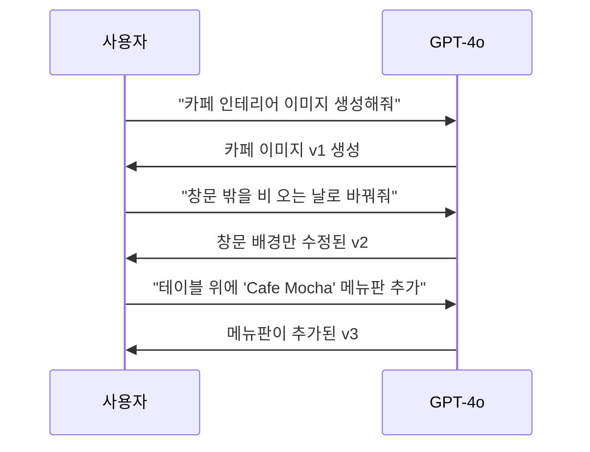
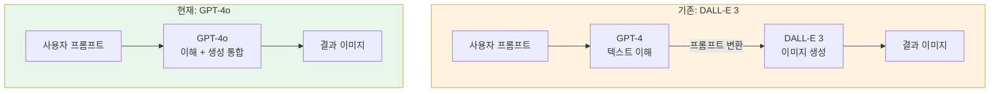

# GPT-4o 이미지 생성의 특징과 강점

> ChatGPT의 GPT-4o 이미지 생성이 기존 DALL-E 3와 무엇이 다른지, 실제 프롬프트로 확인해봅니다.

## 개요

2025년 3월, ChatGPT의 이미지 생성이 완전히 달라졌습니다. 기존에는 글을 이해하는 모델(GPT-4)과 그림을 그리는 모델(DALL-E 3)이 따로 작동했지만, GPT-4o는 **하나의 모델이 글도 이해하고 그림도 직접 그립니다**. 덕분에 텍스트가 정확하게 렌더링되고, 대화하며 수정하고, 복잡한 요청도 잘 따릅니다.

## GPT-4o의 3가지 핵심 강점

### 1. 텍스트 렌더링 — "드디어 글자가 읽힌다"

AI 이미지의 가장 큰 약점이었던 텍스트 문제가 해결되었습니다. GPT-4o는 글자의 의미를 이해하는 모델이 직접 이미지를 그리기 때문에, 텍스트를 정확하게 렌더링합니다.

> 🔥 **실무 팁**: 텍스트를 따옴표로 감싸면 정확도가 올라갑니다. 대소문자도 정확히 지정하세요.

**이렇게 해보세요 — 영문 로고 시안:**

```
A minimalist cafe logo on white background with the text "BREW & BLOOM" in elegant serif font, a small coffee cup icon above the text, earth tone colors
```


**이렇게 해보세요 — SNS 카드:**

```
Instagram post card, soft gradient background from peach to lavender, bold sans-serif text "Design Tips You Need in 2026", subtitle "Vol.03" in the corner, clean and modern layout
```


**현실적인 한계:**

- 한국어, 중국어 등 비영어 텍스트는 정확도가 떨어질 수 있음
- 매우 긴 문장이나 단락 수준의 텍스트는 오류 가능성 증가
- 특수 폰트나 복잡한 레이아웃은 기대와 다를 수 있음

### 2. 대화형 편집 — "대화하면서 그림 다듬기"

GPT-4o는 이미지를 생성한 뒤 대화로 부분 수정이 가능합니다. 전체를 다시 만들 필요 없이, 원하는 부분만 바꿀 수 있죠.



**이렇게 해보세요 — 3단계 수정 실습:**

1단계: 기본 이미지 생성

```
A cozy bookstore interior with warm lighting, wooden shelves filled with books, a reading nook by the window with a comfortable armchair
```


2단계: 요소 추가 요청

```
테이블 위에 "Book & Bean" 간판을 추가하고, 창밖에 비 오는 풍경을 넣어줘
```


3단계: 분위기 조정

```
전체적으로 따뜻한 오렌지톤 조명으로 바꾸고, 선반 사이에 작은 화분을 2-3개 배치해줘
```


> 💡 **포인트**: 수정할 때 "나머지는 그대로 두고"를 명시하면 의도치 않은 변경을 줄일 수 있습니다.

### 3. 맥락 이해 — "의도를 정확히 파악한다"

GPT-4o는 글의 의미를 이해하는 모델이 직접 그림을 그리기 때문에, 복잡한 요청도 정확히 따릅니다. "빨간 모자를 쓴 파란 재킷의 고양이가 노란 우산을 들고 있다"처럼 여러 속성이 뒤섞인 요청에서 색상이 뒤바뀌는 문제가 크게 줄었습니다.

> ⚠️ **참고**: GPT-4o는 이미지를 작은 조각 단위로 순서대로 생성합니다. 이미 그린 부분을 참고하면서 다음 부분을 그리기 때문에 전체적인 일관성이 뛰어납니다. 대신 한 번에 전체를 만드는 방식보다 속도는 느립니다.

**이렇게 해보세요 — 복잡한 속성 테스트:**

```
A red-haired woman wearing a blue denim jacket and green scarf, holding a yellow umbrella, standing in front of a purple food truck on a rainy street
```


## DALL-E 3 vs GPT-4o 비교



| 항목 | DALL-E 3 | GPT-4o |
|------|----------|--------|
| 텍스트 렌더링 | 자주 깨짐 | 높은 정확도 |
| 수정 방식 | 전체 재생성 | 부분 수정 가능 |
| 맥락 유지 | 제한적 | 전체 대화 기억 |
| 속도 | 빠름 | 상대적으로 느림 |
| 예술적 표현 | 화려하고 다채로움 | 정확하고 제어 가능 |

> ⚠️ **참고**: GPT-4o가 모든 면에서 우수한 건 아닙니다. 추상적이고 자유로운 예술적 표현에서는 DALL-E 3가 더 다채로운 결과를 내기도 합니다. 참고로 DALL-E 3는 2026년 5월 API 지원이 종료되며, OpenAI는 GPT 네이티브 이미지 생성(gpt-image-1.5)으로 전환하고 있습니다.

**이렇게 해보세요 — 같은 프롬프트로 차이 확인:**

```
A poster for a jazz night event with the text "MIDNIGHT JAZZ" in art deco style, a golden saxophone silhouette, dark background with warm spotlight effect
```


이 프롬프트로 GPT-4o가 "MIDNIGHT JAZZ" 텍스트를 정확히 렌더링하는지 확인하세요. DALL-E 3 시절이라면 "MIDNGHT JZAZ" 같은 결과가 나올 확률이 높았습니다.

**멀티턴 편집 차이를 체감하는 프롬프트:**

```
위 재즈 포스터에서 색상 테마를 골드에서 네온 블루로 바꾸고, 하단에 "Every Friday 9PM" 텍스트를 추가해줘
```


## 실습: 직접 해보기

### 실습 1: 텍스트 정확도 테스트

아래 프롬프트를 ChatGPT에 입력하고 텍스트가 정확한지 확인하세요.

```
A minimalist book cover with the title "The Art of Silence" in elegant serif font, dark navy background, single white feather floating in the center
```


**체크리스트:**
- [ ] "The Art of Silence" 철자가 정확한가?
- [ ] 세리프 폰트가 적용되었는가?
- [ ] 배경이 다크 네이비인가?
- [ ] 깃털이 중앙에 있는가?

### 실습 2: 3단계 멀티턴 편집

위 북커버를 아래 순서로 수정해보세요.

```
배경색을 버건디 레드로 바꿔줘. 나머지는 그대로 유지해줘.
```

```
하단에 부제 "A Journey Within"을 작은 산세리프 폰트로 추가해줘
```

```
깃털을 벚꽃 한 송이로 교체해줘
```


### 실습 3: 실무 시안 만들기

실제 작업에 가까운 프롬프트를 시도해보세요.

```
Mobile app onboarding screen, clean white background, illustration of a person holding a smartphone with colorful UI elements floating around, headline text "Welcome to Taskly" in bold sans-serif, subtitle "Organize your day, effortlessly" below, a blue CTA button with "Get Started" text at the bottom
```


## 팁과 주의사항

> 🔥 **텍스트 팁**: 텍스트를 따옴표로 감싸고, 폰트 스타일(serif, sans-serif, handwritten 등)과 위치(상단, 중앙, 하단)를 명시하면 정확도가 크게 올라갑니다.

> 💡 **수정 팁**: 한 번에 여러 가지를 바꾸기보다, 하나씩 수정하면 원치 않는 변경을 줄일 수 있습니다. "나머지는 그대로 유지"를 꼭 붙이세요.

> ⚠️ **한글 텍스트**: 한글은 아직 영문보다 정확도가 떨어집니다. 중요한 한글 텍스트는 생성 후 확인하고, 필요하면 편집 도구로 보정하세요.

> 💡 **속도**: GPT-4o 이미지 생성은 DALL-E 3보다 느릴 수 있습니다. 2025년 12월 업데이트로 4배 빨라졌지만, 복잡한 이미지는 시간이 걸립니다.

## 핵심 정리

| 강점 | 핵심 포인트 |
|------|------------|
| 텍스트 렌더링 | 영문 텍스트를 정확하게 이미지 안에 표현 |
| 대화형 편집 | 부분 수정 가능, 전체 재생성 불필요 |
| 맥락 이해 | 복잡한 속성도 뒤바뀜 없이 정확 반영 |
| 통합 모델 | 이해와 생성이 하나의 모델, 의도 손실 최소화 |

## 다음 섹션 미리보기

다음 섹션에서는 ChatGPT에서 실제로 이미지를 생성하는 구체적인 방법을 실습합니다. 효과적인 프롬프트 작성법부터 스타일 지정, 반복 수정을 통한 완성까지 전체 워크플로우를 다룹니다.
