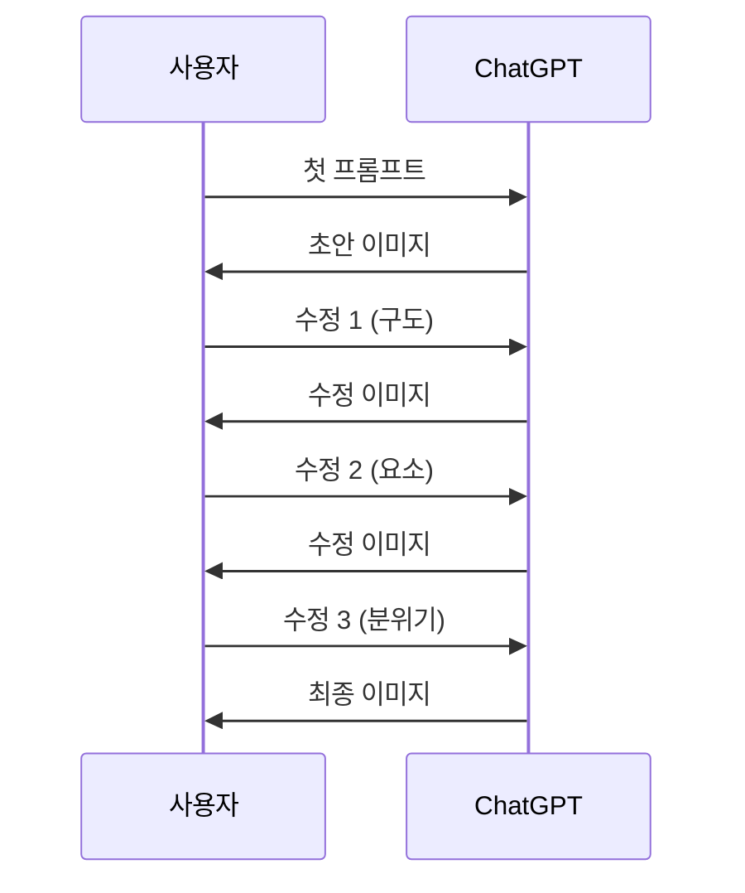
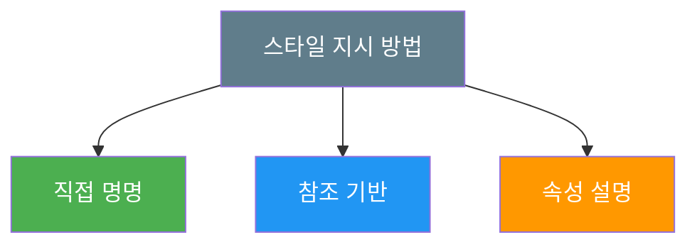
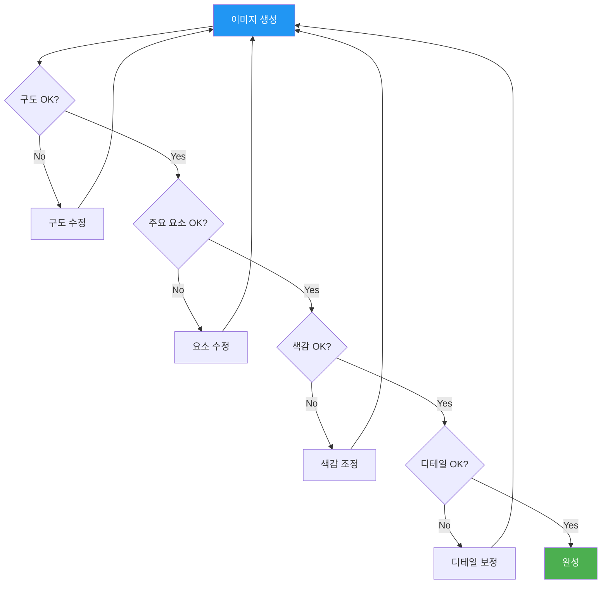

# 대화형 이미지 생성 — 자연어로 그리기

> ChatGPT에 말하듯 이미지를 만들고, 한마디씩 수정하며 완성도를 높이는 실전 워크플로우를 익힙니다.

## 개요

ChatGPT는 자연어로 말하면 이미지를 만들어줍니다. Photoshop처럼 도구를 배울 필요 없이, 동료에게 설명하듯 말하면 됩니다. 더 중요한 건 **대화의 맥락을 기억**한다는 점입니다. "배경을 바꿔줘"라고 하면 처음부터 다시 그리는 게 아니라 배경만 수정하죠. 이 섹션에서는 첫 프롬프트 작성부터 멀티턴 수정, 스타일 지시까지 실전 워크플로우를 다룹니다.

## 첫 프롬프트 작성법

첫 프롬프트에는 **3~5가지 핵심 요소**만 넣으세요. 나머지는 대화로 보완하는 게 훨씬 안정적입니다.


**약한 프롬프트** — "고양이 그려줘"라고만 하면 AI가 방향을 잡지 못합니다. 아래처럼 핵심 요소를 넣어주세요.

```
창가에 앉아 비 오는 거리를 내다보는 주황색 고양이,
로파이 애니메이션 스타일, 따뜻한 실내 조명
```


```
미니멀 플랫 일러스트로, 깔끔한 책상 위에 노트북과 커피잔이 있는 작업 공간,
밝은 자연광, 파스텔 블루와 화이트 색조
```


```
도쿄 골목길의 라멘 가게, 밤에 네온 간판 불빛이 젖은 바닥에 반사되는 장면,
시네마틱 분위기, 35mm 필름 느낌
```


> **팁**: 한 프롬프트에 요소가 너무 많으면 AI가 우선순위를 혼동합니다. 핵심만 넣고 나머지는 다음 턴에서 추가하세요.

## 멀티턴 대화 워크플로우

멀티턴 대화는 ChatGPT 이미지 생성의 가장 강력한 기능입니다. 아래처럼 한 단계씩 수정해 나갑니다.



**실전 대화 — 카페 일러스트 5턴 완성:**

**턴 1** (첫 프롬프트):
```
비 오는 날 창가 카페에 혼자 앉아 책을 읽는 여성,
수채화 일러스트, 따뜻한 실내 조명
```


**턴 2** (구도 수정):
```
시점을 약간 위에서 내려다보는 앵글로 바꿔줘.
테이블 위의 커피잔과 책이 잘 보이게.
```


**턴 3** (요소 추가):
```
창밖에 빗방울이 흐르는 효과를 추가하고,
테이블 위에 작은 꽃병도 하나 놓아줘.
```


**턴 4** (분위기 조정):
```
전체 색감을 더 따뜻한 오렌지-베이지 톤으로 바꿔줘.
창밖은 파란 빗줄기와 대비되게 유지해.
```


**턴 5** (마무리):
```
커피잔에서 김이 피어오르는 효과 넣고,
전체적으로 약간 빈티지한 질감을 추가해줘.
```


**수정 요청 팁:**

| 전략 | 비효과적 | 효과적 |
|------|---------|--------|
| 구체적 지시 | "좀 바꿔줘" | "배경을 파란색에서 주황색 석양으로 바꿔줘" |
| 유지할 것 명시 | "다시 만들어줘" | "인물은 그대로, 배경만 숲으로 변경해줘" |
| 단계적 요청 | "전부 바꿔줘" | "먼저 배경만 바꾸고, 그다음 조명을 조정할게" |

## 스타일 지시어 활용

스타일을 전달하는 세 가지 방법을 상황에 따라 골라 쓰세요.



**레벨 1 — 직접 명명** (스타일 이름 지정):
```
해질녘 해변을 걷는 커플, 수채화 일러스트 스타일
```


**레벨 2 — 참조 기반** (작품/브랜드 분위기 빌려오기):
```
숲속 오두막, 지브리 스튜디오 애니메이션 느낌,
부드러운 자연광과 초록 위주 색감
```


**레벨 3 — 속성 설명** (시각 요소를 하나씩 지정, 가장 정밀):
```
어린 소녀가 풍선을 들고 있는 장면.
파스텔 핑크와 민트 색상 위주, 부드러운 곡선, 두꺼운 윤곽선,
밝은 크림색 배경, 그림자 없이 플랫한 느낌
```


> **팁**: 레벨 3이 재현성이 가장 높습니다. 같은 스타일로 여러 이미지를 만들어야 할 때 유용합니다.

## 결과물 평가와 반복 전략

한 번에 완벽한 이미지는 드뭅니다. **큰 것에서 작은 것** 순서로 수정하세요.



1. **구도 먼저** — 레이아웃과 시점. 구도가 틀리면 디테일을 쌓아도 소용없음
2. **주요 요소** — 핵심 피사체 확인. "인물을 왼쪽으로, 시선을 오른쪽으로"
3. **색감/분위기** — 톤과 조명. "골든아워 조명으로 바꿔줘"
4. **세부 디테일** — 마지막 보정. "컵에서 김이 나는 효과 추가"

| 상황 | 전략 |
|------|------|
| 전체 방향이 잘못됨 | 새 대화 시작, 프롬프트 재설계 |
| 80% 이상 만족 | 멀티턴으로 미세 조정 |
| 특정 부분만 문제 | 해당 부분만 지목하여 수정 |

## ChatGPT 이미지 생성의 강점과 한계

| 강점 | 한계 |
|------|------|
| 텍스트 렌더링 — 글자 포함 이미지 업계 최고 | 초고해상도 인쇄용 출력 부족 |
| 멀티턴 대화로 점진적 수정 | 정밀 미적 제어 (Midjourney 대비 약함) |
| 프롬프트 지시 사항 정확 반영 | 손, 세부 해부학 가끔 부자연스러움 |
| 빠른 프로토타이핑 | 장기 시리즈 캐릭터 일관성 유지 어려움 |

## 실습

### 활동 1: 멀티턴 수정으로 프로필 이미지 만들기

아래 프롬프트를 순서대로 ChatGPT에 입력하고, 각 단계 결과를 비교하세요.

```
미니멀 플랫 일러스트 스타일로,
깔끔한 책상 위에 노트북과 커피잔이 있는 작업 공간.
밝은 자연광, 파스텔 블루와 화이트 색조.
```
```
시점을 45도 위에서 내려다보는 아이소메트릭 뷰로 바꿔줘
```
```
책상 위에 작은 화분 추가하고, 노트북 화면에 코드 에디터가 보이게 만들어줘
```
```
전체적으로 따뜻한 베이지톤으로 색감 바꾸고, 배경에 은은한 그라데이션 넣어줘
```

### 활동 2: 스타일 전환 실험

같은 주제로 스타일만 바꿔 3가지 이미지를 만들어보세요.

```
비 오는 도시의 밤거리, 네온사인이 빛나는 사이버펑크 스타일
```
```
비 오는 도시의 밤거리, 에드워드 호퍼 그림 같은 고독하고 서정적인 분위기
```
```
비 오는 도시의 밤거리, 어린이 그림책 일러스트, 밝고 동화적인 색감
```

스타일 지시어 하나가 얼마나 큰 차이를 만드는지 비교해보세요.

## 팁과 주의사항

- **프롬프트는 짧게 시작하세요.** 핵심 3~5요소로 시작하고 대화로 보완합니다.
- **마음에 드는 결과가 나왔을 때** 즉시 "이 스타일 유지하면서"를 붙여 수정하세요. 같은 프롬프트라도 매번 다른 결과가 나옵니다.
- **대화가 길어지면 새로 시작하세요.** 이미지를 다운로드 후 새 대화에서 업로드하면 깔끔한 맥락에서 이어갈 수 있습니다.
- **수정 범위를 한정하세요.** "배경만 바꿔줘, 인물은 그대로"처럼 유지할 부분을 명시하면 의도치 않은 변경을 막습니다.

## 핵심 정리

| 개념 | 설명 |
|------|------|
| 첫 프롬프트 전략 | 핵심 3~5요소(주제, 스타일, 분위기, 디테일)로 시작, 나머지는 대화로 보완 |
| 멀티턴 대화 | 맥락을 기억하여 기존 이미지의 일관성을 유지하며 부분 수정 |
| 스타일 지시 3레벨 | 직접 명명 → 참조 기반 → 속성 설명 (정밀도 순) |
| 4단계 반복 전략 | 구도 → 주요 요소 → 색감/분위기 → 세부 디테일 |
| 강점 | 텍스트 렌더링, 대화형 편집, 프롬프트 충실도, 빠른 프로토타이핑 |
| 한계 | 초고해상도, 정밀 미적 제어, 장기 캐릭터 일관성 |

## 다음 섹션 미리보기

자연어 대화로 이미지를 만들고 수정하는 워크플로우를 익혔으니, 다음 섹션에서는 ChatGPT의 강력한 무기인 **텍스트가 포함된 이미지 생성**을 다룹니다. 포스터, 카드, 로고 목업 등 실무에서 바로 쓸 수 있는 타이포그래피 이미지 제작법을 배웁니다.
