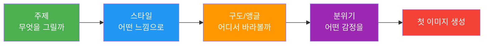
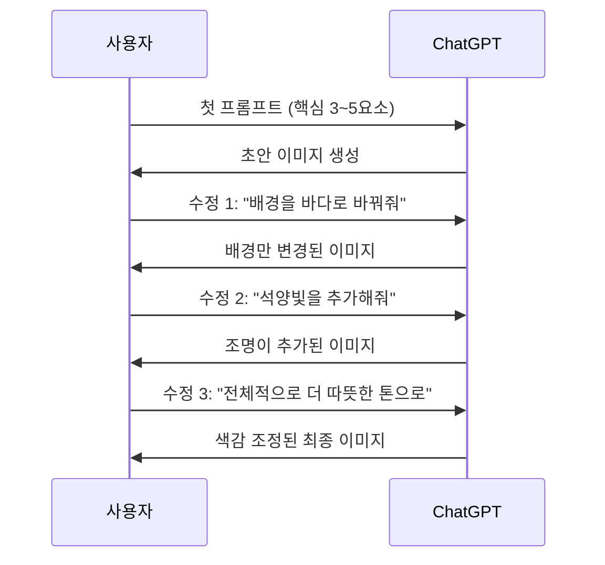
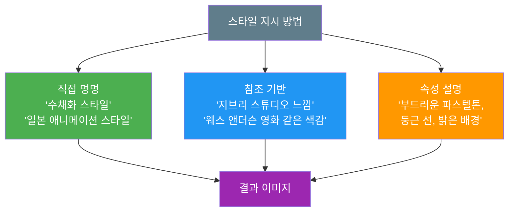
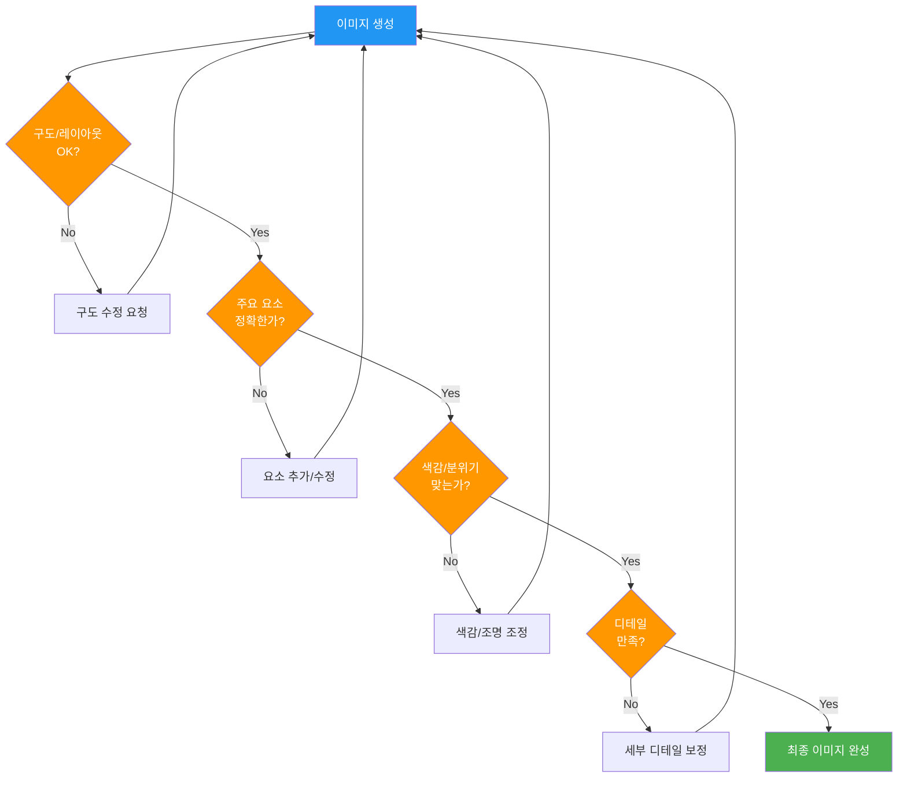
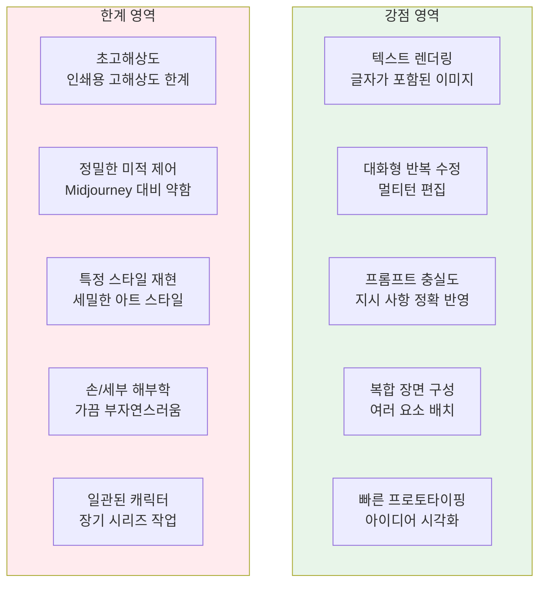
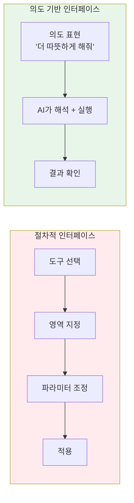

# 대화형 이미지 생성 — 자연어로 그리기

> ChatGPT와 대화하듯 이미지를 만들고, 한마디씩 덧붙이며 완성도를 높이는 워크플로우를 익힙니다.

## 개요

이 섹션에서는 ChatGPT의 GPT-4o 이미지 생성 기능을 활용하여 **자연어 대화만으로 이미지를 생성하고, 멀티턴 대화를 통해 점진적으로 수정하는 실전 워크플로우**를 배웁니다. 코드 한 줄 없이, 마치 동료 디자이너에게 설명하듯 말하면 이미지가 완성되는 과정을 체험합니다.

**선수 지식**: [GPT-4o 이미지 생성의 특징과 강점](03-ch3-chatgpt-이미지-생성-실전/01-01-gpt-4o-이미지-생성의-특징과-강점.md)에서 배운 네이티브 통합, 오토리그레시브 생성, 멀티턴 편집 개념

**학습 목표**:
- 효과적인 이미지 생성 프롬프트를 자연어로 구성할 수 있다
- 멀티턴 대화를 통해 이미지를 점진적으로 수정하는 워크플로우를 실행할 수 있다
- 스타일 지시어를 활용하여 원하는 시각적 분위기를 정확하게 전달할 수 있다
- 의도 기반 인터페이스의 개념을 이해하고, 전통적 디자인 도구와의 차이를 설명할 수 있다
- ChatGPT 이미지 생성의 강점과 한계를 파악하여 상황에 맞게 활용할 수 있다

## 왜 알아야 할까?

디자이너에게 "이런 느낌으로 만들어주세요"라고 설명하면, 상대방이 이해하고 초안을 보여주고, 피드백을 받아 수정하죠. ChatGPT의 이미지 생성이 바로 이 과정을 AI와 함께 하는 겁니다.

기존 AI 이미지 생성 도구들은 프롬프트를 한 번 넣으면 결과를 받고, 마음에 안 들면 처음부터 다시 써야 했어요. 하지만 ChatGPT는 **대화의 맥락을 기억**합니다. "배경을 좀 더 따뜻하게 바꿔줘"라고 말하면, 이전 이미지를 기반으로 배경만 수정하죠. 이 차이가 실무에서 엄청난 시간 절약으로 이어집니다.

이런 접근법을 **의도 기반 인터페이스(Intent-Based Interface)**라고 부릅니다. 기존 디자인 소프트웨어처럼 도구를 선택하고 파라미터를 조절하는 대신, 사용자가 **"무엇을 원하는지"만 자연어로 말하면 AI가 "어떻게 할지"를 알아서 처리**하는 방식이에요. Photoshop에서 색상을 바꾸려면 선택 도구 → 색조/채도 슬라이더를 조작해야 하지만, ChatGPT에서는 "좀 더 따뜻하게 해줘" 한마디면 충분합니다. 이것이 코딩이나 디자인 경험 없는 사람도 AI 이미지 생성을 자유자재로 활용할 수 있는 핵심 이유입니다.

특히 2025년 12월 GPT Image 1.5 업데이트 이후, 생성 속도가 4배 빨라지고 정밀 편집 기능이 추가되면서 대화형 이미지 생성의 실용성이 크게 높아졌습니다. 이제 마케팅 소셜 미디어 이미지, 프레젠테이션 비주얼, 컨셉 아트 초안까지 — 대화만으로 빠르게 만들어낼 수 있는 시대입니다.

## 핵심 개념

### 개념 1: 첫 프롬프트 설계 — 좋은 대화의 시작

> 💡 **비유**: 카페에서 커피를 주문한다고 생각해보세요. "커피 한 잔"이라고만 하면 아메리카노가 나올 수도, 라떼가 나올 수도 있죠. "아이스 바닐라 라떼, 샷 추가, 휘핑크림 올려주세요"라고 하면 정확히 원하는 걸 받을 수 있습니다. AI 이미지 생성도 마찬가지예요.

ChatGPT에서 이미지를 생성하는 첫 프롬프트는 **대화의 출발점**입니다. 완벽할 필요는 없지만, AI가 방향을 잡을 수 있도록 핵심 요소를 포함해야 합니다. [프롬프트 해부학 — 6요소 프레임워크](02-ch2-프롬프트-구조-마스터/01-01-프롬프트-해부학-6요소-프레임워크.md)에서 배운 6요소를 떠올려보세요.

다만 ChatGPT의 장점은 **한 번에 모든 걸 넣지 않아도 된다**는 점입니다. 핵심 3~5개 요소로 시작하고, 나머지는 대화로 보완하는 전략이 훨씬 효과적이거든요. 이것이 바로 의도 기반 인터페이스의 핵심이에요 — 처음부터 완벽한 명세서를 작성할 필요 없이, 의도를 전달하고 대화로 다듬어가면 됩니다.

> 📊 **그림 1**: 첫 프롬프트에서 포함할 핵심 요소

**효과적인 첫 프롬프트의 구성 요소:**

| 요소 | 설명 | 예시 |
|------|------|------|
| 주제(Subject) | 무엇을 그릴지 명확하게 | "도시 카페에 앉아 있는 젊은 여성" |
| 스타일(Style) | 시각적 표현 방식 | "수채화 일러스트", "미니멀 플랫 디자인" |
| 분위기(Mood) | 전달할 감정 | "따뜻하고 아늑한", "미래적이고 차가운" |
| 구체적 디테일 | 차별화 요소 1~2개 | "노란 우산을 들고", "네온 간판이 반사되는" |

**좋은 첫 프롬프트 예시:**

- **약한 프롬프트**: "고양이 그려줘" → AI가 어떤 고양이를 그려야 할지 모름
- **강한 프롬프트**: "창가에 앉아 비 오는 거리를 내다보는 주황색 고양이, 로파이 애니메이션 스타일, 따뜻한 실내 조명"

> 🔥 **실무 팁**: 첫 프롬프트에 3~5개 요소만 넣으세요. 너무 많은 디테일을 한 번에 넣으면 AI가 우선순위를 혼동할 수 있습니다. 나머지는 멀티턴 대화로 추가하는 것이 훨씬 안정적입니다.

---

### 개념 2: 멀티턴 대화 — 점진적 완성의 기술

> 💡 **비유**: 화가에게 초상화를 의뢰한다고 상상해보세요. 첫 스케치를 보고 "눈은 좋은데 배경이 좀 심심하네요. 뒤에 꽃을 추가해주세요"라고 하면, 화가는 얼굴은 그대로 두고 배경만 수정합니다. ChatGPT의 멀티턴 편집이 바로 이 과정이에요 — 매번 처음부터 새로 그리는 게 아니라, 기존 작업 위에 수정을 얹는 거죠.

멀티턴 대화(Multi-Turn Dialogue)는 ChatGPT 이미지 생성의 가장 강력한 무기입니다. GPT-4o는 **대화 전체의 맥락을 기억**하기 때문에, 이전에 생성한 이미지의 구도, 인물, 색감을 유지하면서 특정 부분만 바꿀 수 있습니다.

> 📊 **그림 2**: 멀티턴 대화 워크플로우

**멀티턴 수정 요청의 유형:**

1. **요소 추가**: "배경에 구름을 추가해줘", "왼쪽에 꽃병을 넣어줘"
2. **요소 제거**: "뒤에 있는 사람을 없애줘", "텍스트를 제거해줘"
3. **속성 변경**: "머리카락을 갈색으로 바꿔줘", "옷 색상을 빨간색으로"
4. **분위기 조절**: "전체적으로 더 밝게", "좀 더 몽환적인 느낌으로"
5. **구도 조정**: "좀 더 넓은 앵글로 보여줘", "인물을 중앙에 배치해줘"
6. **스타일 전환**: "같은 장면을 수채화 스타일로 바꿔줘"

> ⚠️ **흔한 오해**: "수정을 많이 하면 이미지 품질이 떨어진다"고 생각하는 분이 많은데, GPT-4o는 매번 이미지를 새로 생성합니다. 다만 대화 맥락을 참조하여 일관성을 유지하는 거예요. 그래서 10번을 수정해도 품질 저하가 없습니다. 단, 대화가 너무 길어지면 초기 맥락이 희석될 수 있으니, 중요한 변경점은 명시적으로 다시 언급해주는 게 좋아요.

**효과적인 수정 요청 작성법:**

| 전략 | 비효과적 | 효과적 |
|------|---------|--------|
| 구체적 지시 | "좀 바꿔줘" | "배경 색상을 파란색에서 주황색 석양으로 바꿔줘" |
| 유지할 것 명시 | "다시 만들어줘" | "인물은 그대로 유지하고, 배경만 숲으로 변경해줘" |
| 비교 참조 | "더 좋게" | "이전 버전보다 조명을 더 따뜻하게, 골든아워 느낌으로" |
| 단계적 요청 | "전부 바꿔줘" | "먼저 배경만 바꾸고, 그다음 조명을 조정할게" |

---

### 개념 3: 스타일 지시어 마스터하기

> 💡 **비유**: 음식 주문을 할 때 "매운맛"이라고만 하면 사람마다 다르게 해석하죠. "청양고추 2개 넣은 정도의 매운맛"이라고 하면 훨씬 정확합니다. 이미지 스타일도 마찬가지로, 추상적 단어 대신 **구체적인 참조점**을 제시하면 AI가 정확히 이해해요.

ChatGPT에서 스타일을 지시하는 방법은 여러 가지입니다. GPT-4o는 자연어를 깊이 이해하기 때문에 전문 용어 대신 일상적인 설명으로도 원하는 스타일을 얻을 수 있어요.

> 📊 **그림 3**: 스타일 지시의 세 가지 접근법

**스타일 지시의 세 가지 레벨:**

**레벨 1 — 직접 명명**: 이미 알려진 스타일 이름을 사용
- "수채화 일러스트레이션", "미니멀 플랫 디자인", "포토리얼리스틱"
- "레트로 80년대 팝아트", "일본 우키요에 스타일"
- 가장 간단하지만, AI의 해석에 따라 결과가 달라질 수 있음

**레벨 2 — 참조 기반**: 알려진 작품·작가·브랜드의 분위기를 참조
- "무지(MUJI) 카탈로그 같은 깔끔한 느낌"
- "봉준호 영화의 한 장면처럼 어둡고 긴장감 있는"
- AI가 해당 참조의 시각적 특성을 잘 반영하지만, 저작권 주의 필요

**레벨 3 — 속성 설명**: 구체적인 시각 요소를 하나씩 지정
- "파스텔 핑크와 민트 색상 위주, 부드러운 곡선, 두꺼운 윤곽선, 밝은 배경"
- 가장 정밀하고 재현성이 높지만, 프롬프트가 길어질 수 있음

2025년 12월 업데이트 이후 ChatGPT에는 **전용 Images 탭**이 추가되었는데요, 여기에 미리 만들어진 스타일 필터와 트렌드 기반 템플릿이 포함되어 있어요. 프롬프트를 직접 쓰지 않아도 원하는 스타일을 클릭만으로 선택할 수 있습니다.

> 💡 **알고 계셨나요?**: GPT Image 1.5에서는 "객체 색상 변경", "조명 정밀 조정", "객체 재배치", "사람이나 요소 지우기", "블러나 그림자 효과 추가" 같은 정밀 편집이 가능해졌어요. 이전 버전에서는 이런 세밀한 조정이 불가능하거나 불안정했는데, 이제는 대화 한 마디로 정확하게 수행됩니다.

---

### 개념 4: 결과물 평가와 반복 전략

> 💡 **비유**: 요리를 할 때 간을 맞추는 과정과 같아요. 한 번에 소금을 확 넣는 게 아니라, 조금 넣고 맛을 보고, 다시 조금 넣고 맛을 보는 거죠. 이미지 생성도 마찬가지 — 한 번에 완벽을 기대하기보다, 체계적인 반복 전략으로 완성도를 높여갑니다.

생성된 이미지를 평가하고 개선하는 **반복(Iteration) 전략**은 AI 이미지 생성의 핵심 스킬입니다. 무작정 수정을 반복하는 것이 아니라, 체계적인 순서로 접근해야 효율적이에요.

> 📊 **그림 4**: 이미지 평가 및 반복 전략 흐름

**4단계 반복 전략 (큰 것에서 작은 것으로):**

1. **구도 먼저**: 전체 레이아웃과 시점이 맞는지 확인 → 틀린 구도 위에 디테일을 쌓으면 나중에 전부 다시 해야 함
2. **주요 요소**: 핵심 피사체(인물, 사물)가 정확한지 확인 → "인물을 왼쪽으로 옮기고 시선 방향을 오른쪽으로"
3. **색감과 분위기**: 전체 톤, 조명, 분위기가 의도와 맞는지 → "전체적으로 골든아워 조명으로 바꿔줘"
4. **세부 디테일**: 마지막으로 작은 디테일 보정 → "손에 든 컵에서 김이 나는 효과 추가"

**만족스럽지 않을 때의 판단 기준:**

| 상황 | 전략 |
|------|------|
| 전체 방향이 잘못됨 | 새 대화를 시작하여 프롬프트를 재설계 |
| 80% 이상 만족 | 현재 대화에서 멀티턴으로 미세 조정 |
| 특정 부분만 문제 | 해당 부분만 구체적으로 지목하여 수정 |
| 스타일이 안 맞음 | 참조 이미지나 구체적 스타일 설명을 추가 |

---

### 개념 5: ChatGPT 이미지 생성의 강점과 한계

모든 도구에는 잘하는 것과 못하는 것이 있어요. ChatGPT 이미지 생성의 경계를 알아야 적재적소에 활용할 수 있겠죠.

> 📊 **그림 5**: ChatGPT 이미지 생성 — 강점과 한계 비교

**ChatGPT가 특히 빛나는 상황:**
- 텍스트가 포함된 포스터, 카드, 인포그래픽 — 텍스트 렌더링이 업계 최고 수준
- 빠른 컨셉 확인이 필요한 브레인스토밍 단계
- 비디자이너가 아이디어를 시각화할 때
- 대화하며 점진적으로 완성도를 높여야 할 때

**다른 도구를 고려해야 할 상황:**
- 극도로 세련된 미적 감각이 필요할 때 → [Midjourney](05-ch5-midjourney-기본과-파라미터-튜닝/01-01-midjourney-인터페이스와-기본-생성.md)
- 특정 구도나 포즈를 정밀 제어해야 할 때 → [ControlNet](07-ch7-controlnet과-참조-이미지-활용/01-01-controlnet-개요-참조-이미지로-제어하기.md)
- 생성 이미지의 결함을 전문적으로 보정할 때 → [Adobe Photoshop + Firefly](09-ch9-adobe-photoshop-firefly-리터치-워크플로우/01-01-adobe-firefly-웹앱-핵심-기능.md)

## 실습: 적용해보기

### 활동 1: 첫 프롬프트와 멀티턴 수정 실습

아래 시나리오를 따라 직접 ChatGPT에서 이미지를 생성하고 수정해보세요.

**시나리오**: 개인 브랜드용 SNS 프로필 이미지 만들기

1. **1단계 — 첫 프롬프트 작성**
   - 주제: 작업 공간에서 노트북과 커피를 앞에 두고 있는 모습
   - 스타일: 미니멀 일러스트
   - 분위기: 밝고 전문적인
   - 프롬프트 예시: "미니멀 플랫 일러스트 스타일로, 깔끔한 책상 위에 노트북과 커피잔이 있는 작업 공간, 밝은 자연광, 파스텔 블루와 화이트 색조"

2. **2단계 — 구도 확인 후 수정**
   - 생성된 이미지를 보고, 구도가 마음에 들지 않으면: "시점을 45도 위에서 내려다보는 아이소메트릭 뷰로 바꿔줘"

3. **3단계 — 요소 추가/수정**
   - "책상 위에 작은 화분 하나 추가해줘"
   - "노트북 화면에 코드 에디터가 보이는 것처럼 만들어줘"

4. **4단계 — 분위기 조정**
   - "전체적으로 따뜻한 베이지톤으로 색감을 바꿔줘"
   - "배경에 은은한 그라데이션 효과를 넣어줘"

5. **5단계 — 최종 확인**
   - 최종 이미지가 프로필 용도로 적절한지 점검 (너무 복잡하지 않은지, 축소해도 잘 보이는지)

### 활동 2: 스타일 전환 실험

하나의 주제를 정해 **동일한 주제, 다른 스타일**로 3가지 이미지를 만들어 비교해보세요.

| 시도 | 주제 | 스타일 지시어 | 기대 효과 |
|------|------|-------------|----------|
| A | 도시의 밤거리 | "네온사인이 빛나는 사이버펑크 스타일" | 강렬하고 미래적인 느낌 |
| B | 도시의 밤거리 | "에드워드 호퍼 그림 같은 고독한 분위기" | 적막하고 서정적인 느낌 |
| C | 도시의 밤거리 | "어린이 그림책 일러스트, 밝고 동화적인" | 친근하고 따뜻한 느낌 |

**비교 분석 질문:**
- 같은 주제인데 스타일 지시어 하나로 얼마나 다른 결과가 나오는가?
- 어떤 스타일이 ChatGPT에서 가장 잘 표현되었는가?
- 스타일 참조(레벨 2)와 속성 설명(레벨 3) 중 어떤 방식이 더 정확한 결과를 냈는가?

### 활동 3: 절차적 인터페이스 vs 의도 기반 인터페이스 비교 분석

다음 표를 채워보며, 전통적 디자인 도구와 ChatGPT의 의도 기반 접근법이 어떻게 다른지 직접 비교해보세요.

| 작업 | Photoshop (절차적) | ChatGPT (의도 기반) | 어떤 방식이 유리한가? |
|------|-------------------|--------------------|--------------------|
| 배경색 변경 | 선택 도구 → 색상 피커 → 채우기 | "배경을 파란색으로 바꿔줘" | ? |
| 인물 밝기 조정 | 레이어 마스크 → 곡선 조정 | "인물 얼굴을 더 밝게 해줘" | ? |
| 텍스트 추가 | 텍스트 도구 → 폰트/크기 설정 → 위치 조정 | "상단에 '안녕하세요'라고 써줘" | ? |
| 세밀한 경계 보정 | 펜 도구로 패스 작업 → 정밀 선택 | "머리카락 가장자리를 더 자연스럽게" | ? |

**토론 질문:**
- 의도 기반 인터페이스가 절차적 인터페이스를 완전히 대체할 수 있을까?
- 어떤 상황에서 절차적 인터페이스가 여전히 필수적인가?
- 두 접근법을 결합하면 어떤 워크플로우가 가능할까?

## 더 깊이 알아보기

### GPT-4o 이미지 생성의 탄생 이야기

2025년 3월 25일, OpenAI는 GPT-4o에 네이티브 이미지 생성 기능을 통합한다고 발표했습니다. 이전까지 ChatGPT의 이미지 생성은 별도의 DALL-E 모델을 호출하는 방식이었어요. 텍스트를 이해하는 모델과 이미지를 만드는 모델이 분리되어 있었기 때문에, "이 글자를 넣어줘"라는 요청이 종종 엉뚱한 결과를 내놓았죠.

GPT-4o의 혁신은 **텍스트와 이미지를 하나의 모델에서 처리**한다는 점이었습니다. 오토리그레시브 방식으로 이미지 토큰을 하나씩 생성하기 때문에, 마치 글을 쓰듯 이미지를 "서술"합니다. 이 접근법 덕분에 텍스트 렌더링 정확도가 획기적으로 개선되었고, 대화 맥락을 자연스럽게 이미지 생성에 반영할 수 있게 되었어요.

그리고 2025년 12월, OpenAI는 GPT Image 1.5를 공개합니다. 이 업데이트는 단순한 성능 개선이 아니었어요. 생성 속도가 4배 빨라졌고, "정밀 편집(Precise Editing)" 기능이 도입되어 얼굴 유사성, 조명, 구도를 일관되게 유지하며 편집할 수 있게 되었습니다. ChatGPT 내에 전용 Images 탭이 추가되고, 스타일 필터와 트렌드 기반 템플릿까지 제공되면서 — 프롬프트를 한 글자도 쓰지 않고도 이미지를 생성할 수 있는 시대가 열렸습니다.

### "대화"가 디자인 도구가 된 이유 — 의도 기반 인터페이스의 부상

전통적인 디자인 소프트웨어는 **절차적 인터페이스(Procedural Interface)**를 사용합니다. "도구를 선택하고 → 파라미터를 조정하고 → 적용"하는 방식이죠. Photoshop에서 색상을 바꾸려면 선택 도구로 영역을 잡고, 색조/채도 슬라이더를 조절해야 합니다. 이 방식은 정밀하지만, 사용법을 익히는 데 오랜 시간이 걸리고 도구의 언어(메뉴, 슬라이더, 레이어)를 먼저 배워야 해요.

반면 ChatGPT의 접근법은 **의도 기반 인터페이스(Intent-Based Interface)**입니다. 사용자가 **최종 결과에 대한 의도(intent)를 자연어로 표현**하면, 시스템이 그 의도를 해석하여 내부적으로 필요한 모든 기술적 조작을 수행하는 방식이에요. "좀 더 따뜻하게 해줘"라고 말하면, AI가 내부적으로 색온도를 올리고, 조명 방향을 조정하고, 채도를 미세하게 변경합니다.

> 📊 **그림 6**: 절차적 인터페이스 vs 의도 기반 인터페이스

핵심적인 차이는 이겁니다: 절차적 인터페이스에서는 사용자가 **"어떻게(How)"를 직접 지시**해야 하지만, 의도 기반 인터페이스에서는 **"무엇을(What)"만 말하면** 됩니다. "어떻게 할지"는 AI가 결정하죠.

이 패러다임 전환은 두 가지 중요한 결과를 가져왔어요:

1. **접근성의 민주화**: 디자인 도구 사용법을 모르는 사람도 전문적인 이미지를 만들 수 있게 되었습니다. 마케터, 기획자, 개발자 — 누구든 자연어만으로 시각 콘텐츠를 제작할 수 있어요.
2. **반복 속도의 혁신**: "선택 → 조정 → 적용 → 확인" 사이클이 "말하기 → 확인"으로 줄어들면서, 아이디어에서 시각화까지의 시간이 극적으로 단축되었습니다.

물론 의도 기반 인터페이스에도 한계는 있어요. 매우 세밀한 픽셀 단위 조정이나 정확한 수치 제어가 필요한 경우에는 여전히 절차적 도구가 유리합니다. 이상적인 워크플로우는 ChatGPT로 빠르게 컨셉을 잡고, 필요 시 Photoshop 같은 전문 도구로 정밀 보정하는 **하이브리드 접근법**이에요.

## 흔한 오해와 팁

> ⚠️ **흔한 오해**: "ChatGPT는 프롬프트가 길수록 좋은 이미지를 만든다." 사실은 반대인 경우가 많아요. 핵심 요소 3~5개로 시작해서 대화로 보완하는 것이 훨씬 안정적입니다. 한 프롬프트에 요소가 너무 많으면 AI가 우선순위를 혼동하여 어떤 요소는 무시될 수 있거든요.

> 💡 **알고 계셨나요?**: GPT Image 1.5부터는 API 가격이 20% 인하되어 저해상도 이미지 기준 $0.01까지 낮아졌어요. 그리고 ChatGPT 무료 사용자도 이미지 생성 기능을 사용할 수 있습니다. 다만 무료 계정은 일일 생성 횟수에 제한이 있으니, 중요한 프로젝트는 유료 플랜(Plus 이상)을 사용하는 것이 안정적이에요.

> 🔥 **실무 팁**: 멀티턴 대화가 10턴 이상 길어지면, 대화 초반의 맥락이 희석될 수 있어요. 이때는 현재 이미지를 다운로드한 후, **새 대화를 시작하면서 이미지를 업로드**하고 "이 이미지를 기반으로 수정해줘"라고 하면 깔끔한 맥락에서 다시 시작할 수 있습니다. 이 전략은 [이미지 업로드와 편집 — Select 도구 활용](03-ch3-chatgpt-이미지-생성-실전/04-04-이미지-업로드와-편집-select-도구-활용.md)에서 자세히 배울 거예요.

> 🔥 **실무 팁**: 같은 프롬프트라도 매번 다른 이미지가 나옵니다. 마음에 드는 방향의 이미지가 나왔을 때 바로 "이 스타일을 유지하면서"라는 문구를 붙여 수정 요청을 하세요. 기회를 놓치면 같은 느낌을 다시 얻기 어려울 수 있어요.

## 핵심 정리

| 개념 | 설명 |
|------|------|
| 첫 프롬프트 전략 | 핵심 3~5요소(주제, 스타일, 분위기, 디테일)로 시작, 나머지는 대화로 보완 |
| 멀티턴 대화 | GPT-4o가 대화 맥락을 기억하여 기존 이미지의 일관성을 유지하며 부분 수정 가능 |
| 스타일 지시 3레벨 | 직접 명명(수채화) → 참조 기반(지브리 느낌) → 속성 설명(파스텔톤, 곡선, 두꺼운 윤곽) |
| 4단계 반복 전략 | 구도 → 주요 요소 → 색감/분위기 → 세부 디테일 순서로 수정 |
| 의도 기반 인터페이스 | "무엇을 원하는지"만 자연어로 말하면 AI가 "어떻게 할지"를 결정하는 인터랙션 방식 |
| GPT Image 1.5 | 4배 빠른 속도, 정밀 편집, Images 탭, 스타일 필터/템플릿 (2025년 12월) |
| 강점 영역 | 텍스트 렌더링, 대화형 편집, 프롬프트 충실도, 빠른 프로토타이핑 |
| 한계 영역 | 초고해상도, 정밀 미적 제어(Midjourney 대비), 장기 캐릭터 일관성 |

## 다음 섹션 미리보기

이번 섹션에서 자연어 대화로 이미지를 생성하고 수정하는 워크플로우를 익혔다면, 다음 [텍스트 렌더링과 타이포그래피 이미지](03-ch3-chatgpt-이미지-생성-실전/03-03-텍스트-렌더링과-타이포그래피-이미지.md)에서는 ChatGPT의 가장 강력한 무기 중 하나인 **텍스트가 포함된 이미지 생성**을 집중적으로 다룹니다. 포스터, 카드, 로고 목업 등 실무에서 바로 쓸 수 있는 타이포그래피 이미지 제작법을 배워볼 거예요.

## 참고 자료

- [Introducing 4o Image Generation — OpenAI 공식 발표](https://openai.com/index/introducing-4o-image-generation/) - GPT-4o 네이티브 이미지 생성의 핵심 기능과 기술적 배경을 공식적으로 설명
- [The new ChatGPT Images is here — OpenAI](https://openai.com/index/new-chatgpt-images-is-here/) - GPT Image 1.5 업데이트의 새로운 기능(정밀 편집, Images 탭, 4배 속도)을 소개
- [A Complete Guide to ChatGPT Image Generation — Superhuman AI](https://www.superhuman.ai/c/a-complete-guide-to-chatgpt-image-generation-in-2025) - 프롬프트 작성법, 스타일 지시, 반복 수정 전략 등 실전 가이드
- [Text That Works: GPT-4o's Conversational Approach — Sidecar AI](https://sidecar.ai/blog/text-that-works-gpt-4os-conversational-approach-to-image-generation) - 멀티턴 대화의 실제 활용 사례와 워크플로우 분석
- [GPT-4o Image Generation: A Complete Guide + 12 Prompt Examples — Learn Prompting](https://learnprompting.org/blog/guide-openai-4o-image-generation) - 12가지 프롬프트 예시와 함께하는 종합 가이드
- [Ultimate Prompting Guide for ChatGPT Image 1.5 — Atlabs AI](https://www.atlabs.ai/blog/ultimate-prompting-guide-for-chatgpt-image-1.5-master-stunning-ai-generated-visuals-in-2025) - GPT Image 1.5 최적화 프롬프팅 전략과 팁

---
### 🔗 Related Sessions
- [네이티브_통합](03-ch3-chatgpt-이미지-생성-실전/01-01-gpt-4o-이미지-생성의-특징과-강점.md) (prerequisite)
- [오토리그레시브_이미지_생성](03-ch3-chatgpt-이미지-생성-실전/01-01-gpt-4o-이미지-생성의-특징과-강점.md) (prerequisite)
- [gpt_image_1.5](03-ch3-chatgpt-이미지-생성-실전/01-01-gpt-4o-이미지-생성의-특징과-강점.md) (prerequisite)
