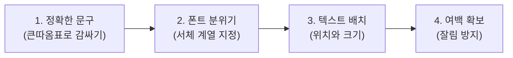
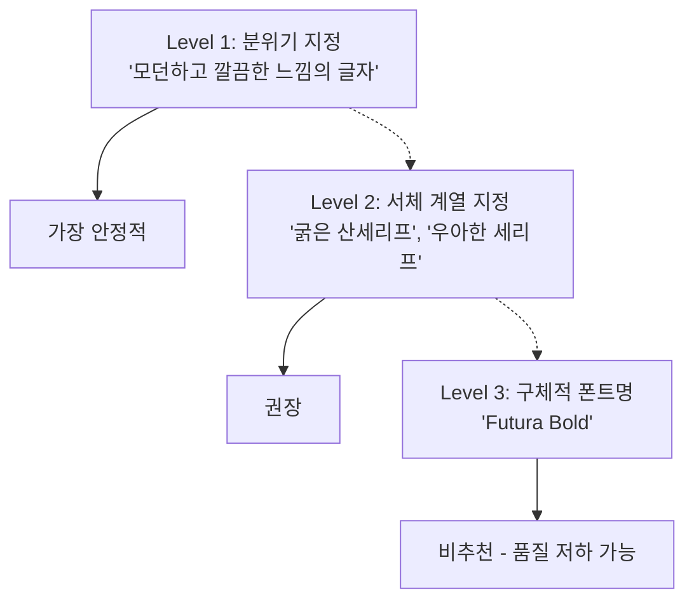

# 텍스트 렌더링과 타이포그래피 이미지

> 포스터, 초대장, SNS 카드, 로고 목업 — 글자가 포함된 이미지를 ChatGPT로 정확하게 만드는 프롬프트 실전 가이드

## 개요

GPT-4o는 글자의 뜻을 이해하면서 그리기 때문에 텍스트가 정확합니다. 이전 AI 도구들이 "COFFEE SHOP"을 "COFFE SHGP"으로 만들던 시대는 끝났습니다. 이 섹션에서는 텍스트 포함 이미지의 프롬프트를 유형별로 실습합니다.

## 텍스트 프롬프트 4대 요소

텍스트 이미지를 만들 때 반드시 챙겨야 할 네 가지입니다.



**1) 정확한 문구** — 이미지에 넣을 텍스트는 반드시 큰따옴표로 감쌉니다. GPT에게 문구 창작을 맡기면 의도와 다른 결과가 나옵니다.

**2) 폰트 분위기** — 구체적 폰트명("Helvetica")보다 분위기("굵고 모던한 산세리프")가 더 안정적입니다.

**3) 텍스트 배치** — "상단 중앙에 크게", "하단에 작은 글씨로" 등 위치를 명시합니다.

**4) 여백 확보** — "모든 텍스트가 잘리지 않도록 충분한 여백 확보"를 항상 추가하세요. 이 한 줄이 재생성 횟수를 크게 줄여줍니다.

**4대 요소 적용 예시:**

```
세로형 카페 포스터. 상단에 "Café Lumière"를 우아한 세리프 타이포그래피로 크게 배치.
중앙에 시그니처 메뉴 3종: "Espresso — ₩4,500", "Flat White — ₩5,500",
"Matcha Latte — ₩6,000"을 깔끔한 산세리프로 나열.
크림색 배경에 미니멀한 커피잔 일러스트. 요소 사이에 넉넉한 간격 유지.
```


## 포스터/배너 프롬프트

핵심 패턴: `[형식] + [제목 텍스트와 서체] + [시각 요소] + [정보 텍스트] + [색상/분위기] + [여백 지시]`

**예시 1 — 음악 페스티벌:**

```
세로형 음악 페스티벌 포스터.
상단에 "MIDNIGHT JAZZ"를 크고 우아한 세리프 타이포그래피로 배치.
중앙에 네온 빛이 감도는 색소폰 일러스트.
하단에 "Dec 20, 2026 / Blue Note Seoul"을 작고 깔끔한 산세리프로.
짙은 남색 배경에 골드 악센트. 모든 텍스트에 충분한 여백 확보.
```


**예시 2 — 할인 배너:**

```
가로형 온라인 쇼핑몰 세일 배너.
중앙에 "BLACK FRIDAY SALE"을 굵고 임팩트 있는 산세리프로 크게.
바로 아래 "UP TO 70% OFF"를 약간 작은 크기로.
하단에 "Nov 28 - Dec 1 | Free Shipping Over $50"을 가는 글씨로.
검정 배경에 네온 핑크와 전기 블루 그러데이션 악센트. 텍스트 주변 넉넉한 패딩.
```


**예시 3 — 워크숍 포스터:**

```
세로형 디자인 워크숍 포스터.
상단 1/3에 "DESIGN THINKING WORKSHOP"을 굵은 산세리프로.
중앙에 연필, 포스트잇, 화이트보드가 있는 미니멀 일러스트.
하단에 "2026.07.12 SAT 2PM", "서울 성수동 Studio B", "Register: designws.kr"을
깔끔한 작은 글씨로 각각 한 줄씩.
밝은 옐로우 배경에 차콜 텍스트. 모든 요소 사이 넉넉한 여백.
```


## 초대장/카드 프롬프트

핵심 패턴: `[카드 형식] + [메인 인사말과 서체] + [세부 정보] + [장식 요소] + [톤/분위기]`

**예시 1 — 결혼 초대장:**

```
가로형 결혼 초대장 디자인.
중앙에 "You Are Invited"를 우아한 필기체로 크게.
그 아래 "Sarah & Tom" 을 세리프로 중간 크기로.
하단에 "June 15, 2026 / 3:00 PM / Garden Hall"을 가는 세리프체로.
수채화 스타일 연한 꽃 장식이 테두리를 감싸는 디자인.
아이보리 배경에 올리브 그린과 더스티 로즈 색감.
```


**예시 2 — 생일 초대장:**

```
세로형 생일파티 초대장.
상단에 풍선과 색종이 일러스트.
중앙에 "IT'S PARTY TIME!"을 굵고 활기찬 산세리프로 크게.
아래에 "Jake's 30th Birthday", "Saturday, Aug 9 / 7PM",
"Rooftop Bar, Itaewon"을 각각 한 줄씩 깔끔한 산세리프로.
밝은 코랄 배경에 화이트 텍스트, 골드 악센트. 넉넉한 여백.
```


## SNS 카드 프롬프트

핵심 패턴: `[정사각형/비율] + [핵심 문구와 서체] + [브랜드 컬러] + [시각 요소] + [가독성 지시]`

**예시 1 — 팁 카드:**

```
정사각형 인스타그램 카드.
상단에 "5 MORNING HABITS"를 굵은 산세리프로 크게.
아래에 번호와 함께 나열:
"1. Wake up at 6AM"
"2. 10 min meditation"
"3. Cold shower"
"4. Journal 3 pages"
"5. No phone for 1 hour"
파스텔 민트 배경에 화이트 텍스트. 미니멀한 해 아이콘. 텍스트 가독성 확보.
```


**예시 2 — 명언 카드:**

```
정사각형 인스타그램 명언 카드.
중앙에 큰 따옴표 장식과 함께
"The best time to start is now."를 우아한 세리프로 크게 배치.
하단에 "— Unknown"을 작은 이탤릭 스타일로.
짙은 네이비 배경에 크림색 텍스트. 미니멀하고 고급스러운 느낌. 넉넉한 여백.
```


**예시 3 — 프로모션 카드:**

```
정사각형 인스타그램 홍보 카드.
상단에 "GRAND OPENING"을 굵은 산세리프로.
중앙에 "50% OFF ALL DRINKS"를 더 크고 임팩트 있게.
하단에 "This Weekend Only | @sunrise.cafe"를 작은 글씨로.
따뜻한 오렌지 그러데이션 배경. 화이트 텍스트. 커피잔 실루엣 장식. 여백 충분히.
```


## 로고 목업 프롬프트

핵심 패턴: `[브랜드명과 서체 분위기] + [심볼] + [적용 맥락] + [색상]`

**예시 1 — 카페 브랜드:**

```
커피 브랜드 로고 목업.
"DAWN BREW"를 기하학적이고 미니멀한 산세리프로.
간단한 해 뜨는 모양 심볼과 결합.
크래프트 종이 텍스처 배경 위에 로고를 배치한 목업.
따뜻한 브라운과 오렌지 톤.
```


**예시 2 — 스튜디오 브랜드:**

```
디자인 스튜디오 로고 목업.
"PIXEL STUDIO"를 모던하고 가는 산세리프로.
'P'자를 활용한 미니멀한 기하학적 심볼.
흰 벽 위에 검정 로고가 프린트된 사무실 간판 목업.
모노크롬 색상. 깔끔하고 전문적인 느낌.
```


## 폰트 스타일 지정 팁



- **Level 1** (분위기): "깔끔하고 전문적인 느낌" — 가장 안정적
- **Level 2** (서체 계열): "굵은 산세리프", "우아한 세리프", "자연스러운 필기체" — 의도 전달과 안정성의 최적 균형
- **Level 3** (폰트명): "Helvetica Bold" — 정확히 재현되지 않고, 오히려 텍스트에 번짐 발생 가능

> 특정 폰트 느낌을 원한다면 "Futura 스타일의 기하학적 산세리프"처럼 참조점으로만 활용하세요.

## 한글 텍스트 전략

한글은 자모 조합으로 11,172개의 완성형 글자가 만들어지기 때문에 영문(26자)보다 AI에게 훨씬 어렵습니다. 영문은 문단까지 정확하지만, 한글은 전략이 필요합니다.

**한글 정확도를 높이는 5가지 전략:**

1. **짧게 유지** — "봄 세일", "감사합니다"처럼 2~4글자 단위가 가장 안정적
2. **고딕 계열 지정** — 명조나 필기체보다 "깔끔한 고딕(산세리프) 스타일"이 오류가 적음
3. **글자 속성 명시** — "글씨는 또렷하게, 중앙에 크게 배치"
4. **확인과 재시도** — "한글이 뭉개졌어, 더 또렷하게 다시 생성해줘"
5. **후처리 합성** — 중요한 작업은 이미지를 GPT-4o로, 한글은 Canva/Photoshop으로 합성

**한글 포함 프롬프트 예시 (잘 되는 경우):**

```
세로형 카페 포스터. 상단에 "봄 세일"을 크고 또렷한 고딕 스타일로.
중앙에 벚꽃이 흩날리는 라떼 일러스트.
하단에 "SPRING SPECIAL — 30% OFF"를 깔끔한 산세리프로 작게.
파스텔 핑크 배경. 모든 글자가 또렷하고 읽기 쉽게. 충분한 여백.
```


**한글 포함 프롬프트 (피해야 할 경우):**

```
포스터에 "올해의 특별한 겨울맞이 프로모션 이벤트에 초대합니다"를
필기체 스타일로 넣어줘.
```

> 긴 한글 문장 + 필기체 = 높은 확률로 글자가 뭉개집니다. 한글은 짧게, 고딕으로!

## 실습: 나만의 텍스트 이미지 만들기

다음 시나리오 중 하나를 골라 프롬프트를 작성하고 ChatGPT에서 생성해보세요.

1. **생일 초대장** — 이름, 날짜, 장소, 드레스코드 포함
2. **가게 오픈 SNS 카드** — 정사각형, 가게명과 할인 정보
3. **플리마켓 포스터** — 제목, 날짜, 장소, 분위기

작성 체크리스트:
- [ ] 모든 텍스트를 큰따옴표로 정확히 명시했는가?
- [ ] 폰트 스타일을 Level 2(서체 계열) 수준으로 지정했는가?
- [ ] 텍스트 배치 위치를 지정했는가?
- [ ] 여백/패딩 지시를 포함했는가?
- [ ] 한글이 포함된다면 짧은 단어로 제한했는가?

생성 후 **멀티턴 수정**도 연습하세요:

```
제목을 좀 더 크게 해줘.
```

```
하단 텍스트와 그림 사이 간격을 넓혀줘.
```

```
배경 색을 한 톤 어둡게 바꿔줘.
```

```
이전과 동일한 레이아웃과 서체 스타일을 유지하면서 텍스트만
"WINTER MARKET"으로 변경해줘.
```

## 팁과 주의사항

> **폰트명 지정은 비추천**: "Helvetica"라고 지정해도 정확히 그 폰트가 나오지 않습니다. 서체 계열(세리프, 산세리프, 필기체)과 무게감(가늘다, 굵다)으로 지정하세요.

> **여백 지시는 필수**: 프롬프트 마지막에 "모든 텍스트 요소 주변에 넉넉한 여백 확보"를 항상 추가하세요.

> **시리즈 제작 팁**: 인스타 카드 10장 등 시리즈를 만들 때는 첫 이미지에서 스타일을 확정한 후 "이전과 동일한 스타일에서 텍스트만 변경"이라고 지시하세요. 같은 채팅 세션 내에서 작업하면 일관성이 높아집니다.

> **마크다운 활용**: 프롬프트에서 "제목: **SUMMER SALE** (크고 굵게), 부제: *Limited Time Only* (작고 가늘게)"처럼 볼드/이탤릭으로 의도를 강조하면 텍스트 위계를 더 잘 이해합니다.

## 핵심 정리

| 개념 | 설명 |
|------|------|
| 프롬프트 4대 요소 | 정확한 문구(큰따옴표), 폰트 분위기, 텍스트 배치, 여백 확보 |
| 폰트 지정 | Level 2(서체 계열)가 최적. 구체적 폰트명은 오히려 품질 저하 |
| 한글 전략 | 짧은 단어 + 고딕 계열 + 확인/재시도, 중요 작업은 후처리 합성 |
| 멀티턴 수정 | 크기/간격/색상/배치를 자연어로 수정, 같은 세션에서 시리즈 제작 |
| 여백 확보 | "충분한 여백/패딩" 지시를 항상 포함 |

## 다음 섹션 미리보기

텍스트 이미지를 **생성**하는 기술을 익혔다면, 다음은 이미 있는 이미지를 **편집**하는 차례입니다. 다음 섹션에서는 자신의 사진이나 기존 이미지를 ChatGPT에 업로드하고, Select 도구로 특정 영역을 선택하여 부분 편집하는 방법을 배웁니다.
