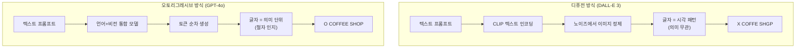
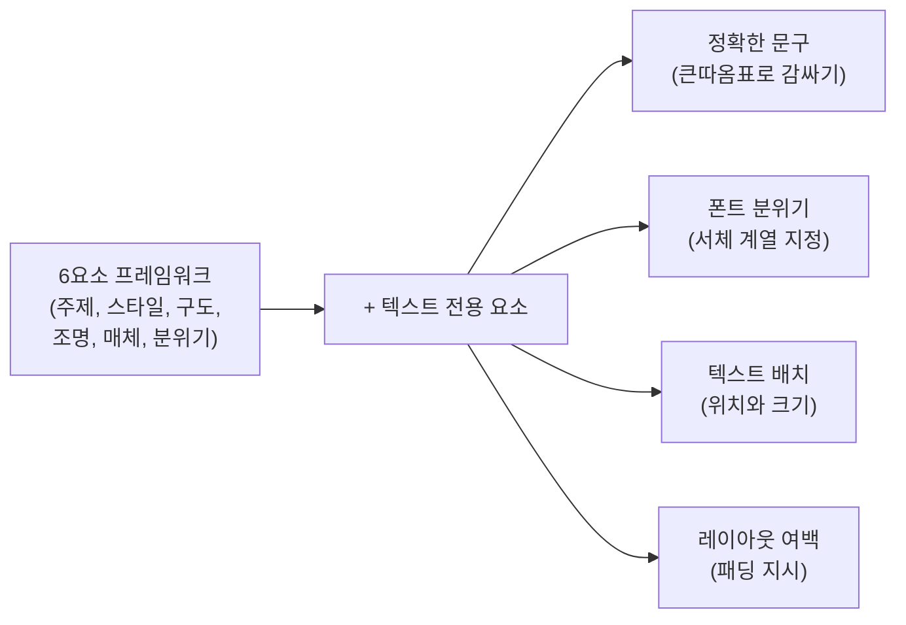
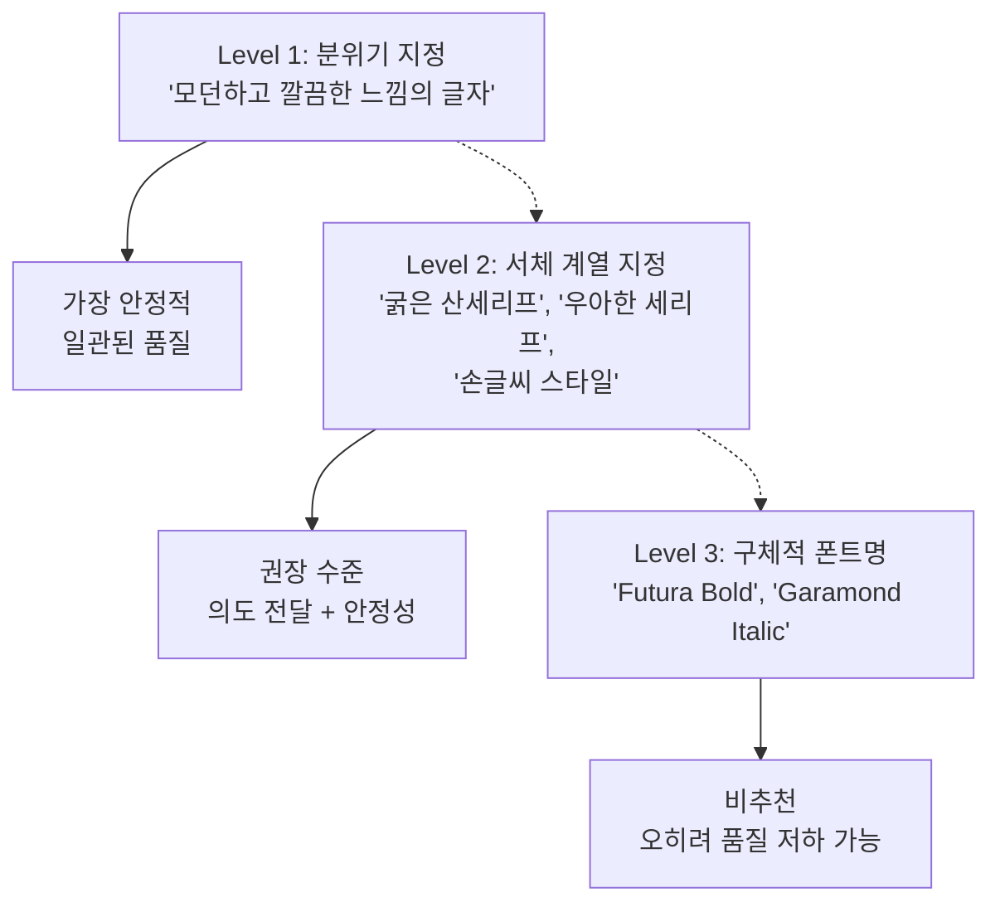
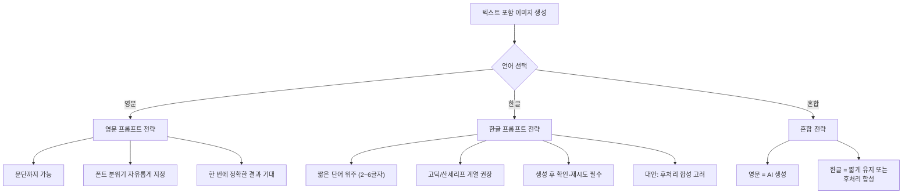
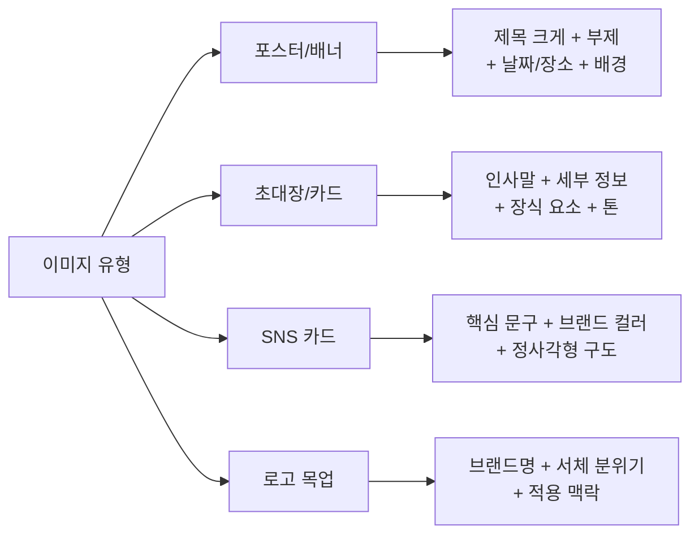

# 텍스트 렌더링과 타이포그래피 이미지

> ChatGPT의 텍스트 렌더링 강점을 활용하여 포스터, 초대장, SNS 카드 등 글자가 포함된 이미지를 정확하게 생성하는 전략을 배웁니다.

## 개요

이 섹션에서는 GPT-4o의 가장 차별화된 강점인 **텍스트 렌더링** 능력을 깊이 파고듭니다. AI 이미지 생성 도구들이 오랫동안 "읽을 수 있는 글자"를 제대로 만들지 못했던 한계를 GPT-4o가 어떻게 돌파했는지, 그리고 이를 실무에서 어떻게 활용하는지 단계별로 살펴보겠습니다.

**선수 지식**: [GPT-4o 이미지 생성의 특징과 강점](03-ch3-chatgpt-이미지-생성-실전/01-01-gpt-4o-이미지-생성의-특징과-강점.md)에서 배운 네이티브 통합과 오토리그레시브 생성 방식, [대화형 이미지 생성](03-ch3-chatgpt-이미지-생성-실전/02-02-대화형-이미지-생성-자연어로-그리기.md)에서 익힌 멀티턴 수정 전략

**학습 목표**:
- GPT-4o의 텍스트 렌더링이 왜 다른 AI 도구보다 정확한지 원리를 이해한다
- 포스터, 초대장, SNS 카드 등 텍스트 포함 이미지의 프롬프트 전략을 익힌다
- 폰트 스타일을 효과적으로 지정하는 3단계 접근법을 활용할 수 있다
- 한글과 영문 텍스트 렌더링의 차이를 이해하고 각각의 대응법을 안다

## 왜 알아야 할까?

디자이너의 일상을 생각해보세요. 클라이언트가 "내일까지 SNS 카드 10장 만들어주세요"라고 요청합니다. 각각 다른 문구가 들어가야 하고, 브랜드 톤에 맞는 타이포그래피도 필요하죠. 기존에는 Canva나 Photoshop에서 하나하나 작업해야 했습니다.

그런데 GPT-4o는 **텍스트가 정확하게 읽히는 이미지**를 자연어 대화만으로 생성할 수 있습니다. 이전 세대의 AI 이미지 도구들 — DALL-E 3, Midjourney, Stable Diffusion — 모두 텍스트 렌더링에서 처참한 결과를 보여줬거든요. "COFFEE SHOP"이라고 쓰라고 하면 "COFFE SHGP" 같은 결과가 나오던 시대였습니다.

2025년 3월 GPT-4o 이미지 생성 업데이트 이후, 한두 단어가 아니라 **문단 수준의 텍스트**까지 정확하게 렌더링할 수 있게 되면서, 디자이너에게는 완전히 새로운 워크플로우가 열렸습니다. 초안 작업, 목업 제작, 아이디어 시각화에서 텍스트 렌더링은 게임 체인저입니다.

## 핵심 개념

### 개념 1: GPT-4o 텍스트 렌더링의 원리 — 왜 글자가 정확할까?

> 💡 **비유**: 기존 AI가 글자를 그리는 방식은 마치 **외국어를 모르는 화가**에게 아랍어 간판을 그려달라고 하는 것과 비슷했습니다. 획의 모양을 흉내 내지만 실제 뜻은 모르죠. 반면 GPT-4o는 **그 언어를 아는 화가**입니다. 글자의 의미를 이해하면서 그리기 때문에 철자가 정확합니다.

DALL-E 3 같은 기존 모델은 **디퓨전(확산) 방식**으로 이미지를 생성합니다. 노이즈에서 시작해 점진적으로 이미지를 정제하는데, 이 과정에서 텍스트는 그저 "글자 모양의 패턴"으로 취급됩니다. 'B'와 'D'를 구별하는 건 모델에게 어려운 일이죠.

반면 GPT-4o는 [앞서 배운](03-ch3-chatgpt-이미지-생성-실전/01-01-gpt-4o-이미지-생성의-특징과-강점.md) **오토리그레시브 방식**으로 이미지 토큰을 순차적으로 생성합니다. 핵심은 텍스트를 이해하는 언어 모델과 이미지를 생성하는 비전 모델이 하나로 통합되어 있다는 점입니다. "이 위치에 'SALE'이라는 단어를 배치해야 한다"는 의도를 정확히 파악할 수 있는 것이죠. 이 **네이티브 통합** 구조 덕분에 — 즉, 토큰을 순차 생성하면서 각 토큰이 이전 토큰의 맥락을 반영하는 방식 덕분에 — 텍스트의 철자와 배치가 언어 모델의 지식과 직접 연결되어 정확도가 비약적으로 향상된 것입니다. 이는 Session 3.1에서 살펴본 "토큰을 순차 생성하여 내부 일관성이 높다"는 원리의 자연스러운 연장선에 있습니다.

> 📊 **그림 1**: 디퓨전 vs 오토리그레시브 방식의 텍스트 처리 차이

이 구조적 차이가 실무에서 의미하는 바는 명확합니다. 포스터에 들어갈 제목, 카드에 적힐 인사말, 메뉴판의 가격표까지 — GPT-4o는 텍스트를 "그리는" 게 아니라 "쓰는" 것에 가깝습니다.

### 개념 2: 텍스트 포함 이미지의 프롬프트 구조

> 💡 **비유**: 디자인 에이전시에 작업을 의뢰할 때를 떠올려보세요. "예쁜 포스터 만들어주세요"라고 하면 결과를 예측할 수 없지만, "A3 세로형, 상단 1/3에 제목 '봄맞이 세일', 본문은 중앙 정렬, 배경은 연한 파스텔 톤"이라고 하면 원하는 결과에 가까워지죠. GPT-4o에게도 마찬가지입니다.

텍스트 포함 이미지를 생성할 때는 일반적인 이미지 프롬프트와 다른 **추가 요소**를 명시해야 합니다. [프롬프트 해부학 6요소 프레임워크](02-ch2-프롬프트-구조-마스터/01-01-프롬프트-해부학-6요소-프레임워크.md)를 기반으로, 텍스트 전용 요소를 추가한 확장 프레임워크를 사용합니다.

> 📊 **그림 2**: 텍스트 포함 이미지의 프롬프트 확장 프레임워크

**텍스트 프롬프트의 4대 구성요소**를 하나씩 살펴보겠습니다.

**1) 정확한 문구 지정**: 이미지에 들어갈 텍스트는 반드시 **큰따옴표**로 감싸서 명시합니다. "Spring Sale — Up to 50% Off"처럼 정확한 문구를 제공하세요. ChatGPT가 알아서 적절한 문구를 만들어주길 기대하면, 의도와 다른 텍스트가 들어갈 수 있습니다.

**2) 폰트 분위기 지정**: 구체적인 폰트 이름(예: "Helvetica Bold")보다는 **분위기를 설명하는 방식**이 더 효과적입니다. "깔끔하고 모던한 산세리프 타이포그래피", "우아한 필기체 스타일", "굵고 임팩트 있는 볼드 타이틀" 같은 표현이 안정적인 결과를 만들어냅니다. 지나치게 구체적인 폰트 지정은 오히려 텍스트 품질을 떨어뜨리는 것으로 알려져 있습니다.

**3) 텍스트 배치**: "제목은 상단 중앙에 크게", "부제는 제목 아래 작은 크기로", "하단에 날짜와 장소 정보"처럼 레이아웃 내 텍스트 위치를 명확히 지시합니다.

**4) 여백 확보**: GPT-4o는 텍스트가 많을 때 이미지 하단이 잘리는 경향이 있습니다. 프롬프트에 "모든 텍스트가 잘리지 않도록 충분한 여백을 확보해주세요" 또는 "요소 사이에 넉넉한 간격을 유지해주세요"라는 지시를 추가하면 이 문제를 크게 줄일 수 있습니다.

#### 실전 프롬프트 예시 분석

**포스터 프롬프트 예시:**

> "세로형 이벤트 포스터를 만들어줘. 상단 1/3에 'SUMMER FESTIVAL 2026'이라는 제목을 굵고 임팩트 있는 산세리프 타이포그래피로 배치해줘. 중앙에는 야자수와 해변 석양 일러스트, 하단에 'July 15-17 / Haeundae Beach'를 깔끔한 작은 글씨로 넣어줘. 전체적으로 따뜻한 오렌지-핑크 그러데이션 배경, 모든 텍스트가 잘리지 않도록 넉넉한 여백 유지."

이 프롬프트가 효과적인 이유는 텍스트 내용(큰따옴표), 서체 분위기(산세리프, 임팩트), 배치(상단/하단), 여백 지시가 모두 포함되어 있기 때문입니다.

### 개념 3: 폰트 스타일 지정의 3단계 접근법

> 💡 **비유**: 커피숍에서 주문할 때 "아메리카노 한 잔"이라고 하면 기본 옵션이 나옵니다. "연하게, 얼음 적게, 큰 컵으로"라고 하면 좀 더 원하는 대로 나오죠. 하지만 "원두 로스팅 온도 197도, 추출 압력 9.2bar로"라고 하면... 바리스타가 오히려 당황합니다. GPT-4o의 폰트 지정도 이와 같습니다.

GPT-4o에게 폰트 스타일을 전달하는 3단계 접근법이 있습니다. 단계가 올라갈수록 구체적이지만, 무조건 구체적인 게 좋은 건 아닙니다.

> 📊 **그림 3**: 폰트 스타일 지정 3단계와 효과

**Level 1 — 분위기 지정** (가장 안정적): "깔끔하고 전문적인 느낌의 텍스트", "빈티지하고 따뜻한 느낌의 글자"처럼 추상적 분위기를 전달합니다.

**Level 2 — 서체 계열 지정** (권장): "굵은 산세리프(sans-serif) 타이포그래피", "우아한 세리프(serif) 스타일", "자연스러운 필기체(handwritten script)" 등 서체의 대분류를 지정합니다. 이 수준이 의도 전달과 결과 안정성의 균형이 가장 좋습니다.

**Level 3 — 구체적 폰트명** (주의 필요): "Helvetica Bold"나 "Playfair Display Italic"처럼 특정 폰트를 지정하는 방식입니다. 실제 테스트에서, 너무 구체적인 폰트 지정이 오히려 텍스트에 "번짐(smudge)"을 유발할 수 있다는 보고가 있습니다. 해당 폰트의 정확한 형태를 재현하려다 전체적인 텍스트 가독성이 떨어지는 것이죠.

> 🔥 **실무 팁**: 대부분의 경우 Level 2가 최적입니다. "굵은 고딕 계열", "우아한 명조 계열", "캐주얼한 손글씨 스타일"처럼 서체 계열을 지정하되, 구체적인 폰트명은 피하세요. 만약 특정 폰트 느낌을 원한다면 "Futura 스타일의 기하학적 산세리프"처럼 참조점으로만 활용하는 게 좋습니다.

### 개념 4: 한글 vs 영문 — 텍스트 렌더링의 현실적 차이

> 💡 **비유**: 영어는 26개의 알파벳 조합이지만, 한글은 자음 14개 + 모음 10개가 **초성·중성·종성**으로 조합되어 11,172개의 완성형 글자를 만듭니다. 레고 블록 26개로 집을 짓는 것과 11,000개 이상의 복잡한 블록을 다루는 것의 차이라고 볼 수 있죠. AI에게도 이 복잡성은 큰 도전입니다.

**영문 텍스트**: GPT-4o는 영문 텍스트에서 놀라운 정확도를 보여줍니다. 단어 하나가 아니라 문단 수준의 텍스트까지 또렷하게 렌더링하며, 대소문자 구분, 구두점, 특수문자까지 안정적으로 처리합니다. 포스터 제목, 메뉴판, 라벨 등 대부분의 영문 타이포그래피 작업에 실용적으로 활용할 수 있습니다.

**한글 텍스트**: 2025년 GPT-4o 업데이트 이후 한글 렌더링도 상당히 개선되었지만, 영문 대비 여전히 도전적인 영역입니다. 짧은 단어(2~4글자)는 비교적 정확하지만, 긴 문장이나 복잡한 글자 조합에서 획이 뭉개지거나 글자가 변형되는 현상이 발생할 수 있습니다. 특히 받침이 복잡한 글자('읽', '값', '넓')에서 오류가 더 자주 나타납니다.

> 📊 **그림 4**: 한글 vs 영문 텍스트 렌더링 전략 비교

#### 한글 텍스트 정확도를 높이는 실전 전략

1. **짧게 유지하기**: 한글 텍스트는 가능한 한 짧은 단어나 구문으로 제한합니다. "봄 세일", "감사합니다", "카페 라떼"처럼 2~4글자 단위가 가장 안정적입니다.

2. **고딕 계열 서체 지정**: 한글에서 세리프(명조)나 필기체는 렌더링 오류 가능성이 높습니다. "깔끔한 고딕(산세리프) 스타일"을 지정하면 안정적인 결과를 얻을 수 있습니다.

3. **글자 속성 명시**: "글씨는 또렷하게, 중앙에 크게 배치"처럼 텍스트의 시각적 속성을 명확히 지시합니다. "Noto Sans KR 스타일의 깔끔한 한글"처럼 잘 알려진 한글 폰트를 참조점으로 활용하는 것도 효과적입니다.

4. **확인과 재시도**: 한글 텍스트는 첫 번째 생성에서 완벽하지 않을 수 있습니다. 결과를 확인하고 "한글 텍스트가 약간 뭉개졌어. 글자를 더 또렷하게 다시 생성해줘"라고 요청하세요.

5. **후처리 합성**: 중요한 작업에서 한글 정확도가 아쉬울 때는, 이미지는 GPT-4o로 생성하고 한글 텍스트는 Canva나 Photoshop에서 별도로 합성하는 **하이브리드 워크플로우**가 실무에서 가장 안정적입니다.

> ⚠️ **흔한 오해**: "GPT-4o가 텍스트를 잘 만든다니까 한글도 완벽하겠지?"라고 생각하기 쉽지만, 현재 시점에서 한글은 영문 대비 정확도 격차가 분명합니다. 한글의 조합형 구조 자체가 AI에게 훨씬 더 복잡한 과제이기 때문인데요, 이는 GPT-4o만의 문제가 아니라 모든 AI 이미지 생성 모델에 공통된 도전입니다. 개선이 빠르게 이루어지고 있지만, 당분간은 한글 텍스트에 대해 현실적인 기대치를 가지는 것이 좋습니다.

### 개념 5: 유형별 텍스트 이미지 프롬프트 패턴

디자이너가 실무에서 자주 만드는 텍스트 포함 이미지 유형별로, 효과적인 프롬프트 패턴을 정리해보겠습니다.

> 📊 **그림 5**: 유형별 프롬프트 패턴 구조

**1) 이벤트 포스터/배너**

핵심 패턴: `[형식] + [제목 텍스트와 서체] + [시각 요소] + [정보 텍스트] + [색상/분위기] + [여백 지시]`

> 예시: "세로형 음악 페스티벌 포스터. 상단에 'MIDNIGHT JAZZ'를 크고 우아한 세리프 타이포그래피로 배치. 중앙에 네온 빛이 감도는 색소폰 일러스트. 하단에 'Dec 20, 2026 / Blue Note Seoul'을 작고 깔끔한 산세리프로. 짙은 남색 배경에 골드 악센트. 모든 텍스트에 충분한 여백 확보."

**2) 초대장/인사 카드**

핵심 패턴: `[카드 형식] + [메인 인사말과 서체] + [세부 정보] + [장식 요소] + [톤/분위기]`

> 예시: "가로형 결혼 초대장 디자인. 중앙에 'You Are Invited'를 우아한 필기체로 크게. 그 아래 'Sarah & Tom / June 15, 2026 / 3:00 PM'을 가는 세리프체로. 수채화 스타일의 연한 꽃 장식이 테두리를 감싸는 디자인. 아이보리 배경에 올리브 그린과 더스티 로즈 색감."

**3) SNS 카드 (인스타그램, X 등)**

핵심 패턴: `[정사각형/비율] + [핵심 문구와 서체] + [브랜드 컬러] + [시각 요소] + [가독성 지시]`

> 예시: "정사각형 인스타그램 카드. 중앙에 '5 Tips for Better Sleep'을 굵고 모던한 산세리프로 크게 배치. 각 팁을 번호와 함께 아래에 나열. 파스텔 라벤더 배경에 미니멀한 달과 별 아이콘. 텍스트는 흰색으로 가독성 확보."

**4) 로고 목업/브랜드 시안**

핵심 패턴: `[브랜드명과 서체 분위기] + [적용 맥락] + [색상 시스템] + [미니멀 지시]`

> 예시: "커피 브랜드 로고 목업. 'DAWN BREW'라는 텍스트를 기하학적이고 미니멀한 산세리프로. 간단한 해 뜨는 모양 심볼과 결합. 크래프트 종이 텍스처 배경에 로고를 배치한 목업. 따뜻한 브라운과 오렌지 톤."

## 실습: 적용해보기

### 활동 1: 프롬프트 분석 워크시트

아래 두 프롬프트를 비교 분석해보세요.

**프롬프트 A**: "예쁜 카페 포스터 만들어줘. 카페 이름이랑 메뉴 넣어줘."

**프롬프트 B**: "세로형 카페 메뉴 포스터. 상단에 'Café Lumière'를 우아한 세리프 타이포그래피로 크게 배치. 중앙에 세 가지 시그니처 메뉴를 나열: 'Espresso — ₩4,500', 'Flat White — ₩5,500', 'Matcha Latte — ₩6,000'. 메뉴 텍스트는 깔끔한 산세리프, 가격은 오른쪽 정렬. 크림색 배경에 미니멀한 커피잔 일러스트를 장식으로. 요소 사이에 넉넉한 간격 유지."

| 분석 항목 | 프롬프트 A | 프롬프트 B |
|----------|-----------|-----------|
| 정확한 텍스트 명시 | ? | ? |
| 폰트 스타일 지정 | ? | ? |
| 레이아웃/배치 지정 | ? | ? |
| 여백 지시 | ? | ? |
| 예상 결과 일관성 | ? | ? |

각 항목에 O/X를 기입하고, 프롬프트 A를 프롬프트 B 수준으로 개선해보세요.

### 활동 2: 나만의 텍스트 이미지 생성

다음 시나리오 중 하나를 선택하여, 이 섹션에서 배운 프롬프트 구조로 작성해보세요.

1. **개인 생일 초대장**: 친구의 생일파티 초대장 (이름, 날짜, 장소, 드레스코드 포함)
2. **소규모 비즈니스 SNS 카드**: 신규 오픈한 가게의 인스타그램 홍보 카드
3. **이벤트 포스터**: 동네 플리마켓 또는 워크숍 홍보 포스터

작성 체크리스트:
- [ ] 모든 텍스트를 큰따옴표로 정확히 명시했는가?
- [ ] 폰트 스타일을 Level 2(서체 계열) 수준으로 지정했는가?
- [ ] 텍스트 배치 위치를 지정했는가?
- [ ] 여백/패딩 지시를 포함했는가?
- [ ] 한글이 포함된다면 짧은 단어로 제한했는가?

### 활동 3: 한글/영문 혼합 전략 토론

"서울 플리마켓" 포스터를 만든다고 가정합니다. 메인 제목은 'SEOUL FLEA MARKET', 부제는 '매주 토요일 열리는 특별한 장터'입니다.

- 영문 제목과 한글 부제를 한 번에 프롬프트로 요청하는 게 좋을까요?
- 아니면 영문만 AI로 생성하고, 한글은 후처리로 합성하는 게 좋을까요?
- 각 접근법의 장단점을 정리해보세요.

## 더 깊이 알아보기

### AI와 타이포그래피의 역사 — 글자를 읽는 기계의 꿈

AI가 이미지 속에 "글자를 정확하게 쓰는" 것은 사실 오래된 도전이었습니다. 2022년 DALL-E 2가 처음 공개되었을 때, 사람들은 놀라운 이미지 생성 능력에 감탄하면서도 "왜 글자를 제대로 못 쓰지?"라고 의아해했죠.

이유는 디퓨전 모델의 구조에 있었습니다. 이미지는 픽셀 단위로 처리되는데, 'R'이라는 글자를 구성하는 픽셀 패턴은 'P'나 'B'와 매우 유사합니다. 모델 입장에서는 "거의 비슷한 패턴 중 어떤 걸 선택해야 하는가"의 문제인데, 글자의 **의미**를 모르기 때문에 확률적으로 자주 틀리는 것이죠.

이 문제를 해결하기 위해 다양한 시도가 있었습니다. DALL-E 3(2023년)는 텍스트 인코더를 대폭 개선했고, Ideogram이라는 스타트업은 텍스트 렌더링을 특화한 모델로 주목받았습니다. 하지만 진정한 돌파구는 2025년 GPT-4o에서 나왔습니다. 텍스트 이해(언어 모델)와 이미지 생성(비전 모델)을 **하나의 모델로 통합**함으로써, 글자의 의미를 알면서 이미지를 그리는 최초의 실용적 시스템이 탄생한 것입니다.

> 💡 **알고 계셨나요?**: GPT-4o의 이미지 생성이 처음 공개된 2025년 3월, 가장 바이럴된 사용 사례 중 하나가 바로 "텍스트가 정확하게 렌더링된 밈(meme) 이미지"였습니다. 그동안 AI 이미지에서 깨진 글자는 "AI가 만든 이미지"의 대표적 식별 표지였는데, GPT-4o가 이 한계를 넘어서면서 "AI 이미지인지 아닌지 구분이 더 어려워졌다"는 논의가 뜨겁게 일었죠.

### 반복 수정(Iterative Refinement)의 힘

텍스트 이미지에서 멀티턴 대화의 위력은 특히 빛납니다. 첫 생성 결과에서 텍스트 크기가 마음에 들지 않거나, 배치가 어색하거나, 전체 균형이 안 맞을 때 — "제목을 좀 더 크게", "하단 텍스트와 그림 사이 간격을 넓혀줘", "배경 색을 한 톤 어둡게"처럼 자연어로 수정을 요청하면 됩니다. [이전 섹션](03-ch3-chatgpt-이미지-생성-실전/02-02-대화형-이미지-생성-자연어로-그리기.md)에서 배운 4단계 반복 전략(구도→요소→색감→디테일)이 여기서도 그대로 적용됩니다.

텍스트 이미지에서 특히 유용한 반복 수정 패턴:
- "텍스트를 더 크게/작게 해줘"
- "제목과 본문 사이 간격을 늘려줘"
- "글자 색을 배경과 더 대비되게 바꿔줘"
- "이전과 동일한 스타일로 텍스트만 변경해줘" (시리즈 제작 시)

## 흔한 오해와 팁

> ⚠️ **흔한 오해**: "프롬프트에 정확한 폰트명을 넣으면 그 폰트로 렌더링해줄 것이다." 실제로는 GPT-4o가 특정 폰트를 정확히 재현하지 않습니다. "Helvetica"라고 지정해도 Helvetica와 비슷한 산세리프가 나올 뿐이며, 너무 구체적인 폰트 지정은 오히려 텍스트 품질을 떨어뜨릴 수 있습니다. 서체 **계열**(세리프, 산세리프, 필기체)과 **무게감**(가늘다, 보통, 굵다)으로 지정하는 것이 최선입니다.

> 💡 **알고 계셨나요?**: 마크다운 포맷팅을 프롬프트에 활용하면 텍스트 계층 구조를 전달하는 데 도움이 됩니다. 예를 들어 프롬프트 안에서 "제목: **SUMMER SALE** (크고 굵게), 부제: *Limited Time Only* (작고 가늘게)"처럼 볼드/이탤릭으로 의도를 강조하면, GPT-4o가 텍스트 간의 시각적 위계를 더 잘 이해합니다.

> 🔥 **실무 팁**: 시리즈물 제작 시(예: 인스타그램 카드 10장) 일관된 스타일을 유지하려면, 첫 번째 이미지에서 스타일을 확정한 후 "이전과 동일한 레이아웃과 서체 스타일을 유지하면서 텍스트만 변경"이라고 지시하세요. 같은 채팅 세션 내에서 작업하면 스타일 일관성이 훨씬 높아집니다. 그리고 성공적인 프롬프트는 반드시 따로 저장해두세요 — 다음 프로젝트의 템플릿이 됩니다.

> 🔥 **실무 팁**: 텍스트가 하단에서 잘리는 문제를 예방하려면, 프롬프트 마지막에 항상 "include generous padding around all text elements" 또는 "모든 텍스트 요소 주변에 넉넉한 여백을 확보"를 추가하세요. 이 한 줄이 재생성 횟수를 크게 줄여줍니다.

## 핵심 정리

| 개념 | 설명 |
|------|------|
| 텍스트 렌더링 원리 | GPT-4o의 오토리그레시브 + 네이티브 통합 방식이 텍스트의 의미를 이해하면서 이미지를 생성하여 정확도가 높음 |
| 프롬프트 4대 요소 | 정확한 문구(큰따옴표), 폰트 분위기, 텍스트 배치, 여백 확보를 모두 명시 |
| 폰트 지정 3단계 | Level 1(분위기) → Level 2(서체 계열, 권장) → Level 3(구체적 폰트명, 비추천) |
| 한글 vs 영문 | 영문은 문단까지 안정적, 한글은 짧은 단어 위주 + 고딕 계열 + 후처리 합성 고려 |
| 반복 수정 전략 | 첫 생성 후 크기/간격/색상/배치를 자연어로 수정, 같은 세션에서 시리즈 제작 |
| 여백 확보 | 하단 잘림 방지를 위해 "충분한 여백/패딩" 지시를 항상 포함 |

## 다음 섹션 미리보기

텍스트 렌더링으로 이미지를 **생성**하는 기술을 익혔다면, 다음은 이미 있는 이미지를 **편집**하는 차례입니다. [이미지 업로드와 편집 — Select 도구 활용](03-ch3-chatgpt-이미지-생성-실전/04-04-이미지-업로드와-편집-select-도구-활용.md)에서는 자신의 사진이나 기존 이미지를 ChatGPT에 업로드하고, Select 도구로 특정 영역을 선택하여 부분 편집(인페인팅)하는 방법을 배웁니다. 이번 섹션에서 만든 포스터의 특정 부분만 수정하고 싶다면? 바로 다음 섹션의 기술이 필요합니다.

## 참고 자료

- [Introducing 4o Image Generation — OpenAI](https://openai.com/index/introducing-4o-image-generation/) - GPT-4o 이미지 생성의 공식 발표, 텍스트 렌더링 개선에 대한 핵심 정보
- [ChatGPT Image Generation in 2025: A Complete Guide — Superhuman AI](https://www.superhuman.ai/c/a-complete-guide-to-chatgpt-image-generation-in-2025) - 텍스트 포함 이미지 생성의 종합 가이드
- [Finally! ChatGPT Can Create Text-Heavy Graphics That Actually Work — Alitu](https://alitu.com/creator/tool/chatgpt-image-generation/) - 텍스트 중심 그래픽 생성의 실전 팁과 한계 분석
- [GPT-4o Image Generation: A Complete Guide + 12 Prompt Examples — Learn Prompting](https://learnprompting.org/blog/guide-openai-4o-image-generation) - 포스터, 카드 등 유형별 프롬프트 예시 모음
- [GPT로 '정확한 한글'이 포함된 썸네일 이미지 생성 — brunch](https://brunch.co.kr/@marketing-adam/38) - 한글 텍스트 렌더링 정확도를 높이는 한국어 실전 가이드

---

---
### 🔗 Related Sessions
- [네이티브_통합](03-ch3-chatgpt-이미지-생성-실전/01-01-gpt-4o-이미지-생성의-특징과-강점.md) (prerequisite)
- [오토리그레시브_이미지_생성](03-ch3-chatgpt-이미지-생성-실전/01-01-gpt-4o-이미지-생성의-특징과-강점.md) (prerequisite)
- [멀티턴_이미지_편집](03-ch3-chatgpt-이미지-생성-실전/02-02-대화형-이미지-생성-자연어로-그리기.md) (prerequisite)
- [스타일_지시_3레벨](03-ch3-chatgpt-이미지-생성-실전/02-02-대화형-이미지-생성-자연어로-그리기.md) (prerequisite)
