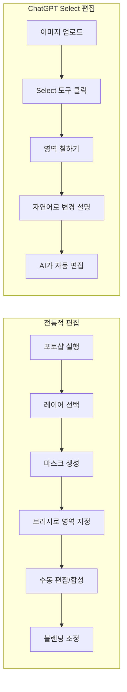
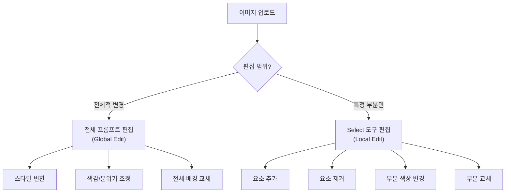
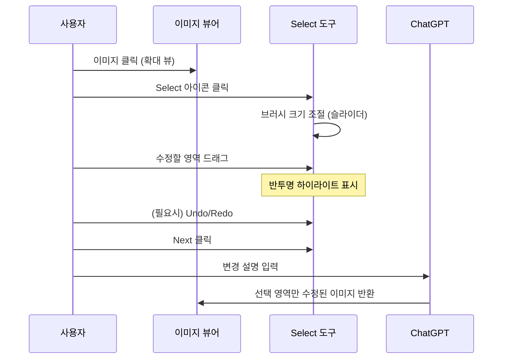
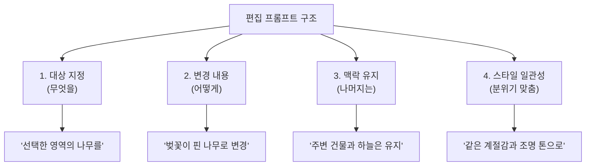
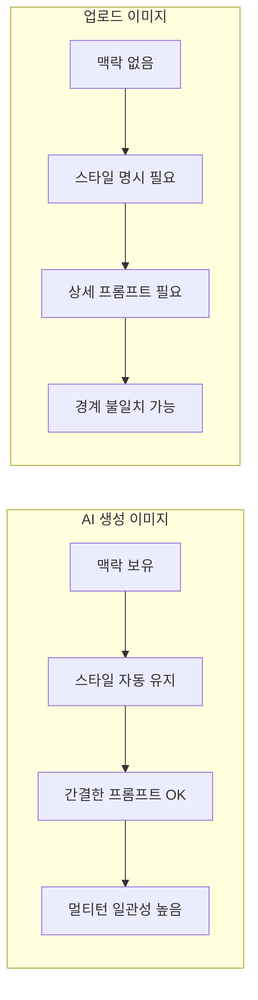
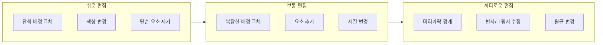

# 이미지 업로드와 편집 — Select 도구 활용

> 기존 이미지를 ChatGPT에 업로드하고, Select 도구로 원하는 부분만 골라 수정하는 정밀 편집 워크플로우를 익힙니다.

## 개요

지금까지 우리는 ChatGPT에서 텍스트만으로 이미지를 만들고, 멀티턴 대화로 수정하고, 텍스트가 포함된 이미지까지 생성해봤습니다. 하지만 실무에서는 **이미 있는 이미지를 수정**해야 하는 상황이 훨씬 많죠. 클라이언트가 보내온 제품 사진의 배경을 바꿔야 하거나, 포트폴리오 이미지에서 한 요소만 교체하고 싶을 때 — 이럴 때 처음부터 새로 만드는 건 비효율적입니다.

이 섹션에서는 ChatGPT의 **이미지 업로드 + Select 도구**를 활용해 기존 이미지의 특정 부분만 정밀하게 수정하는 기법을 배웁니다. Select 도구를 통한 부분 편집은 사실 AI 이미지 분야에서 **인페인팅(Inpainting)**이라 불리는 기법의 ChatGPT 버전인데요, [Ch6. 인페인팅과 아웃페인팅](06-ch6-인페인팅과-아웃페인팅/01-01-인페인팅의-개념과-원리.md)에서 Midjourney, Stable Diffusion 등 다양한 플랫폼의 인페인팅 기법을 비교하며 더 깊이 다루게 됩니다.

**선수 지식**: [대화형 이미지 생성](03-ch3-chatgpt-이미지-생성-실전/02-02-대화형-이미지-생성-자연어로-그리기.md)에서 배운 멀티턴 수정 워크플로우, [텍스트 렌더링](03-ch3-chatgpt-이미지-생성-실전/03-03-텍스트-렌더링과-타이포그래피-이미지.md)에서 익힌 프롬프트 전략

**학습 목표**:
- ChatGPT에 이미지를 업로드하고 자연어로 편집을 요청할 수 있다
- Select 도구의 인터페이스 요소(브러시 크기, Undo/Redo)를 이해하고 활용할 수 있다
- 배경 변경, 요소 추가/제거, 스타일 변환 등 주요 편집 시나리오를 수행할 수 있다
- 업로드 편집과 생성 후 편집의 차이를 이해하고 상황에 맞게 선택할 수 있다

## 왜 알아야 할까?

디자이너의 실제 업무를 떠올려 보세요. 순수하게 "백지에서 새로 만드는" 작업보다 "기존 시안을 수정하는" 작업이 압도적으로 많습니다. 클라이언트 피드백 반영, 시즌별 비주얼 업데이트, A/B 테스트용 변형 제작 — 이 모든 작업의 핵심은 **"나머지는 그대로 두고, 이 부분만 바꿔주세요"**입니다.

ChatGPT의 Select 도구는 바로 이 니즈를 해결합니다. 포토샵을 열지 않고도, 자연어 한 줄로 이미지의 특정 영역만 수정할 수 있거든요. 특히 코딩이나 전문 소프트웨어 경험이 없는 분들에게는 진입 장벽이 거의 없는 편집 도구입니다.

> 📊 **그림 1**: 전통적 이미지 편집 vs ChatGPT Select 도구 편집 워크플로우 비교

전통적 방식은 6단계 이상의 전문 기술이 필요하지만, ChatGPT Select 도구는 5단계로 단순화되고 자연어로 지시할 수 있다는 것이 핵심 차이입니다.

## 핵심 개념

### 개념 1: 이미지 업로드 편집의 두 가지 경로

> 💡 **비유**: 미술 수업에서 선생님에게 그림을 보여주는 두 가지 상황을 생각해 보세요. 하나는 "이 그림에서 하늘 색만 바꿔주세요"라고 전체 맥락을 설명하는 것이고, 다른 하나는 "여기 이 부분"이라고 손가락으로 정확히 짚어주는 것입니다. ChatGPT의 이미지 편집도 이 두 가지 방식이 있습니다.

ChatGPT에서 이미지를 편집하는 경로는 크게 **두 가지**입니다.

**경로 1: 전체 프롬프트 편집 (Global Edit)**
이미지를 업로드하고 자연어로 변경 사항을 설명합니다. ChatGPT가 이미지 전체를 이해한 뒤 요청에 맞게 수정하는 방식이에요. 이미지의 분위기, 스타일, 색감 같은 전반적인 속성을 바꿀 때 유용합니다.

- "이 사진의 배경을 석양으로 바꿔주세요"
- "이 이미지를 수채화 스타일로 변환해주세요"
- "이미지의 색감을 더 따뜻하게 만들어주세요"

**경로 2: Select 도구 편집 (Local Edit / 인페인팅)**
이미지를 클릭하고 Select 도구로 수정할 영역을 직접 칠한 뒤, 해당 영역에 대한 변경을 자연어로 설명합니다.

- 배경은 그대로 두고 인물의 옷 색상만 변경
- 테이블 위의 특정 물건만 제거
- 빈 벽면에 액자 추가

> 📊 **그림 2**: 이미지 편집의 두 가지 경로 — 전체 편집 vs 부분 편집

**어떤 경로를 선택할까?** 이미지의 전반적인 분위기나 스타일을 바꾸고 싶다면 Global Edit, 나머지를 최대한 보존하면서 특정 부분만 수정하고 싶다면 Select 도구가 적합합니다.

#### 실습 활동: 편집 경로 판단하기

아래 시나리오를 읽고 Global Edit과 Select 도구 중 어떤 경로가 적합할지 판단해 보세요.

| 시나리오 | 적합한 경로 | 이유 |
|----------|-------------|------|
| 제품 사진의 배경을 흰색 스튜디오로 변경 | Global Edit | 배경 전체가 변경 대상 |
| 인물 사진에서 안경만 추가 | Select 도구 | 얼굴의 특정 영역만 수정 |
| 일러스트를 유화 스타일로 변환 | Global Edit | 이미지 전체의 스타일 변경 |
| 포스터에서 특정 텍스트만 수정 | Select 도구 | 텍스트가 있는 영역만 수정 |
| 사진의 전체 색온도를 따뜻하게 | Global Edit | 이미지 전반의 색감 조정 |

### 개념 2: Select 도구 인터페이스 완전 정복

> 💡 **비유**: Select 도구는 마치 **형광펜**과 같습니다. 책에서 중요한 문장에 형광펜을 칠하듯, 이미지에서 수정하고 싶은 부분에 브러시를 칠하는 거예요. 형광펜의 굵기를 조절하듯 브러시 크기도 조절할 수 있고, 잘못 칠했으면 지우개로 지우듯 Undo 버튼을 누르면 됩니다.

Select 도구의 인터페이스를 단계별로 살펴보겠습니다.

**Step 1: 이미지 열기**
생성된 이미지든, 업로드한 이미지든 클릭하면 확대 뷰가 열립니다.

**Step 2: Select 도구 활성화**
확대 뷰의 **우측 상단**에 있는 Select(편집) 아이콘을 클릭합니다. 이 아이콘을 누르면 편집 모드로 전환됩니다.

**Step 3: 브러시 크기 조절**
화면 **좌측**에 슬라이더가 나타납니다. 위로 올리면 브러시가 커지고, 아래로 내리면 작아집니다. 섬세한 편집에는 작은 브러시, 넓은 영역 편집에는 큰 브러시를 사용하세요.

**Step 4: 영역 칠하기**
수정하고 싶은 부분 위를 마우스로 드래그하여 칠합니다. 칠해진 영역은 반투명한 하이라이트로 표시됩니다.

**Step 5: Undo/Redo 활용**
화면 **하단**에 Undo(되돌리기)와 Redo(다시 실행) 버튼이 있습니다. 잘못 칠했다면 Undo를 눌러 이전 상태로 돌아가세요.

**Step 6: Next → 프롬프트 작성**
영역 선택이 끝나면 **우측 상단의 Next**를 클릭합니다. 대화창에 변경 사항을 자연어로 설명하면 AI가 해당 영역만 수정합니다.

> 📊 **그림 3**: Select 도구 편집 워크플로우 — 6단계 순서도

> 🔥 **실무 팁**: 브러시로 영역을 칠할 때는 **수정 대상보다 약간 넓게** 칠하는 것이 좋습니다. 너무 빡빡하게 칠하면 경계가 부자연스러울 수 있고, AI가 맥락을 파악할 여유가 부족해지거든요. 다만 너무 넓게 칠하면 의도하지 않은 부분까지 변경될 수 있으니, 대상보다 10~20% 정도 여유를 두는 것이 적당합니다.

### 개념 3: 편집 시나리오별 프롬프트 전략

> 💡 **비유**: 인테리어 디자이너에게 리모델링을 요청할 때를 생각해 보세요. "거실을 바꿔주세요"라고 하면 디자이너가 곤란하겠지만, "이 소파를 모던한 가죽 소파로, 벽 색은 그대로 유지해주세요"라고 하면 정확히 원하는 결과를 얻을 수 있죠. Select 도구의 프롬프트도 마찬가지입니다 — **무엇을 바꾸고, 무엇을 유지할지** 명확히 알려주는 것이 핵심입니다.

주요 편집 시나리오별 프롬프트 전략을 살펴보겠습니다.

#### 시나리오 1: 배경 변경

배경을 바꿀 때는 인물/제품의 조명 방향과 분위기를 일치시키는 것이 중요합니다.

| 프롬프트 품질 | 예시 | 결과 예측 |
|--------------|------|-----------|
| 나쁜 예 | "배경 바꿔" | 맥락 없이 임의 배경 |
| 보통 | "배경을 해변으로 바꿔주세요" | 해변이지만 조명 불일치 가능 |
| 좋은 예 | "배경을 석양빛이 비치는 해변으로 바꿔주세요. 인물의 왼쪽에서 따뜻한 빛이 들어오는 방향을 유지해주세요" | 조명 일관성 높음 |

#### 시나리오 2: 요소 제거

불필요한 요소를 제거할 때는 제거 후 **채울 내용**까지 지정하면 더 자연스럽습니다.

- 기본: "이 부분의 전선을 제거해주세요"
- 개선: "이 부분의 전선을 제거하고 맑은 하늘로 자연스럽게 채워주세요"

#### 시나리오 3: 요소 추가

새 요소를 추가할 때는 **크기, 위치, 스타일**을 구체적으로 지정합니다.

- 기본: "여기에 꽃을 추가해주세요"
- 개선: "선택한 영역에 작은 라벤더 꽃다발을 추가해주세요. 주변 조명과 같은 따뜻한 톤으로, 기존 이미지의 사실적인 스타일에 맞춰주세요"

#### 시나리오 4: 스타일 부분 변환

특정 영역의 스타일만 바꾸고 싶을 때는 Global Edit 대신 Select 도구로 해당 영역만 지정합니다.

- "선택한 옷을 빈티지 데님 재킷으로 바꿔주세요. 나머지 인물과 배경은 그대로 유지"

> 📊 **그림 4**: 편집 시나리오별 프롬프트 구조

핵심은 **4요소 구조**: 대상(무엇을) + 변경(어떻게) + 유지(나머지는) + 일관성(분위기) 입니다.

### 개념 4: 업로드 이미지 vs AI 생성 이미지 — 편집 차이점

> 💡 **비유**: 찰흙으로 직접 빚은 조각상(AI 생성)은 다시 주무르기가 쉽지만, 대리석 조각상(업로드 사진)은 수정하려면 더 섬세한 기술이 필요하죠. ChatGPT에서도 이 차이가 있습니다.

ChatGPT에서 편집하는 이미지의 **출처**에 따라 결과 품질과 주의사항이 달라집니다.

**AI 생성 이미지 편집 (같은 대화 내)**
- ChatGPT가 이미지의 생성 맥락(프롬프트, 스타일, 구성)을 이미 알고 있음
- 수정 시 원본의 스타일과 분위기를 자동으로 유지
- "이전에 만든 이미지에서 모자만 빨간색으로 바꿔줘" 같은 간결한 지시 가능
- 멀티턴 편집에 최적화 — 여러 번 수정해도 일관성 유지

**업로드 이미지 편집**
- ChatGPT가 이미지를 처음 보기 때문에 맥락 정보가 없음
- 스타일, 조명, 분위기를 프롬프트에 명시적으로 설명해야 함
- 사진의 세밀한 디테일(피부 질감, 머리카락 등)이 편집 후 변할 수 있음
- 편집된 부분과 원본 부분의 경계가 눈에 띌 수 있음

> 📊 **그림 5**: AI 생성 이미지 vs 업로드 이미지 편집 특성 비교

**업로드 이미지 편집 시 품질을 높이는 전략:**
1. 첫 메시지에서 이미지의 스타일을 설명하세요: "이 사진은 자연광 아래 촬영된 제품 사진이에요"
2. 편집 프롬프트에 조명과 톤을 함께 지정하세요: "같은 자연광 톤을 유지하면서..."
3. 한 번에 너무 많은 변경을 요청하지 마세요 — 한 가지씩 단계적으로 수정
4. 결과가 만족스럽지 않으면 다른 표현으로 재시도하세요

### 개념 5: Select 도구 편집의 한계와 대처법

> 💡 **비유**: 아무리 좋은 지우개라도 한계는 있죠. 연필로 쓴 글씨는 깔끔하게 지워지지만, 볼펜 자국은 완전히 없애기 어렵습니다. Select 도구도 마찬가지로 잘 되는 편집과 까다로운 편집이 있습니다.

Select 도구가 강력한 기능이긴 하지만, 모든 편집에 만능은 아닙니다. 한계를 미리 알아두면 시행착오를 줄일 수 있어요.

**잘 되는 편집:**
- 단순한 배경 교체 (하늘, 벽면, 단색 배경)
- 색상 변경 (옷, 소품의 색)
- 단순 형태의 요소 추가/제거
- 텍스처/재질 변경 (나무 → 대리석)

**까다로운 편집:**
- 복잡한 경계를 가진 요소 (머리카락, 레이스, 나뭇잎 사이)
- 반사/그림자가 복잡하게 얽힌 장면
- 원근감을 크게 바꿔야 하는 수정
- 매우 세밀한 텍스트 수정 (1~2글자 단위)

**대처 전략:**

까다로운 편집을 만났을 때는 다음 방법을 시도해 보세요.

1. **영역을 더 넓게 잡기**: 복잡한 경계 주변을 넉넉하게 선택하면 AI가 자연스러운 전환을 만들 여유가 생깁니다
2. **단계 분할**: 한 번에 큰 변경 대신, 2~3단계로 나눠서 점진적으로 수정
3. **맥락 설명 추가**: "이 부분은 유리 재질이라 반사가 있어요" 같은 맥락 정보를 프롬프트에 포함
4. **Global Edit 병행**: Select 도구로 핵심 요소를 수정한 뒤, Global Edit으로 전체 분위기를 통일

> 📊 **그림 6**: Select 도구 편집 난이도 스펙트럼

## 실습: 적용해보기

### 활동 1: Select 도구 편집 시뮬레이션

아래 시나리오를 읽고, Select 도구를 사용한다고 가정했을 때 **어디를 칠할지**와 **어떤 프롬프트를 쓸지** 작성해 보세요.

**시나리오**: 카페 인테리어 사진이 있습니다. 테이블 위에 커피잔이 놓여 있고, 배경에 식물이 있으며, 전체적으로 따뜻한 톤입니다. 클라이언트가 다음 변경을 요청했습니다.

| 요청 | Select 영역 | 프롬프트 예시 |
|------|-------------|-------------|
| 커피잔을 차(tea)잔으로 변경 | 커피잔과 주변 여백 | "선택한 커피잔을 우아한 찻잔과 소서로 변경해주세요. 따뜻한 차가 담겨있고, 기존의 따뜻한 조명 톤을 유지해주세요" |
| 배경 식물 제거 | 식물 영역 | "선택한 식물을 제거하고 뒤의 벽면으로 자연스럽게 채워주세요. 벽의 질감과 색상을 주변과 일치시켜주세요" |
| 테이블 질감을 대리석으로 변경 | 테이블 표면 | 여러분이 직접 작성해 보세요! |
| 창밖 풍경을 비 오는 날로 변경 | 창문 영역 | 여러분이 직접 작성해 보세요! |

### 활동 2: 편집 순서 설계하기

한 이미지에 여러 편집을 적용해야 할 때, **순서**가 중요합니다. 아래 편집 요청들을 가장 효율적인 순서로 배치해 보세요.

편집 요청 목록:
- (A) 인물의 셔츠 색상을 파란색에서 흰색으로 변경
- (B) 배경 전체를 오피스 환경에서 야외 공원으로 변경
- (C) 인물 손에 있는 서류를 태블릿으로 교체
- (D) 전체 이미지의 색감을 더 밝고 선명하게 조정

**추천 순서**: B → A → C → D

**이유**: 배경과 같은 큰 변경부터 하고(B), 중간 크기 요소를 수정한 뒤(A, C), 마지막에 전체 색감을 조정(D)하는 것이 가장 효율적입니다. 색감 조정을 먼저 하면 이후 편집에서 다시 틀어질 수 있기 때문입니다.

### 활동 3: 토론 질문

1. Select 도구의 브러시로 영역을 너무 좁게 칠했을 때와 너무 넓게 칠했을 때 각각 어떤 문제가 발생할까요?
2. 업로드한 사진에서 인물의 표정을 바꾸는 것과, AI가 생성한 인물의 표정을 바꾸는 것 — 어느 쪽이 더 자연스러운 결과를 줄까요? 그 이유는 무엇일까요?
3. 클라이언트가 제품 사진 10장의 배경을 모두 통일해달라고 요청했을 때, 가장 효율적인 작업 전략은 무엇일까요?

## 더 깊이 알아보기

### 인페인팅의 역사 — 르네상스에서 AI까지

"인페인팅(Inpainting)"이라는 개념은 사실 AI보다 훨씬 오래된 것입니다. 원래 이 용어는 **미술 복원** 분야에서 왔습니다. 르네상스 시대부터 손상된 프레스코화나 유화를 복원할 때, 화가들이 빠진 부분을 주변 색감과 질감에 맞춰 채워 넣는 작업을 "inpainting"이라 불렀습니다.

디지털 시대로 넘어오면서 인페인팅은 이미지 처리 알고리즘의 영역이 되었습니다. 2000년대 초반 Adobe Photoshop에 "Content-Aware Fill"이 도입되면서 일반 사용자도 이 기술을 접할 수 있게 되었죠. 하지만 이 시절의 인페인팅은 주변 픽셀을 복사해서 붙이는 수준이었기 때문에, 복잡한 패턴이나 의미 있는 객체를 새로 만들어 넣지는 못했습니다.

AI 인페인팅의 진짜 혁명은 **2022년 DALL-E 2**와 함께 시작되었습니다. OpenAI는 DALL-E 2에서 처음으로 텍스트 기반 인페인팅을 선보였는데, 마스크 영역에 "무엇을 그려 넣을지"를 텍스트로 지시할 수 있었습니다. 이후 2023년 DALL-E 3가 ChatGPT에 통합되었고, 2025년 3월 GPT-4o의 네이티브 이미지 생성이 DALL-E를 대체하면서 현재의 Select 도구가 탄생했습니다.

흥미로운 점은 GPT-4o의 인페인팅이 기존 디퓨전 모델 방식과 근본적으로 다르다는 것입니다. 디퓨전 모델은 노이즈를 점진적으로 제거하며 이미지를 만들지만, GPT-4o는 오토리그레시브 방식으로 토큰을 순차 생성합니다. 이 덕분에 주변 맥락을 더 정확히 이해하고, 편집된 부분이 원본과 더 자연스럽게 어우러질 수 있게 된 거죠.

ChatGPT의 Select 도구는 인페인팅의 가장 대중화된 형태이지만, Midjourney의 Vary (Region), Stable Diffusion의 마스크 기반 인페인팅 등 각 플랫폼마다 고유한 인페인팅 구현이 있습니다. 이들의 상세한 비교와 플랫폼별 장단점은 [Ch6. 인페인팅과 아웃페인팅](06-ch6-인페인팅과-아웃페인팅/01-01-인페인팅의-개념과-원리.md)에서 다양한 플랫폼의 인페인팅 기법을 비교하며 자세히 살펴봅니다.

> 💡 **알고 계셨나요?**: OpenAI의 엔지니어들이 Select 도구를 설계할 때 가장 많이 참고한 것이 바로 포토샵의 "Quick Mask 모드"였다고 합니다. 전문가용 도구의 개념을 가져오되, 마스크 후 처리를 AI가 자동으로 해주는 것이 핵심 아이디어였습니다. 미술 복원사가 수년간 훈련해야 했던 기술을, 이제는 자연어 한 줄로 실현할 수 있는 시대가 된 것입니다.

## 흔한 오해와 팁

> ⚠️ **흔한 오해**: "Select 도구로 칠한 영역만 정확히 바뀐다"
> 사실 ChatGPT의 편집은 선택 영역 밖으로도 약간 영향을 미칠 수 있습니다. 특히 조명이나 그림자 같은 요소는 선택 영역 너머까지 자연스럽게 변경되는 경우가 있습니다. 이것은 오히려 장점이 될 수 있지만 — "이 부분'만' 바뀌겠지"라고 100% 확신하지는 마세요. 편집 후 반드시 전체 이미지를 확인하는 습관이 필요합니다.

> ⚠️ **흔한 오해**: "업로드한 사진은 AI 생성 이미지만큼 자유롭게 편집된다"
> 실제로는 업로드 이미지 편집이 더 제한적입니다. AI가 생성한 이미지는 내부적으로 생성 맥락을 기억하고 있어 수정이 매끄럽지만, 외부 이미지는 맥락 없이 시각 정보만으로 판단해야 하기 때문에 피부 질감이나 미세한 디테일이 달라질 수 있습니다.

> 💡 **알고 계셨나요?**: ChatGPT에 이미지를 업로드하면, 이미지 편집뿐만 아니라 이미지 **분석**도 동시에 가능합니다. "이 이미지의 색상 팔레트를 분석해줘"라고 먼저 요청한 뒤, 그 분석 결과를 바탕으로 편집을 지시하면 더 정확한 결과를 얻을 수 있습니다.

> 🔥 **실무 팁**: 복잡한 편집은 한 번에 하지 말고 **단계적으로** 진행하세요. 예를 들어 "배경을 바꾸고 인물 옷도 바꾸고 소품도 추가해줘"보다는, 배경 변경 → 확인 → 옷 변경 → 확인 → 소품 추가 순서로 한 가지씩 편집하면 각 단계의 결과를 확인하고, 문제가 생겼을 때 돌아갈 수 있습니다. 이것은 [대화형 이미지 생성](03-ch3-chatgpt-이미지-생성-실전/02-02-대화형-이미지-생성-자연어로-그리기.md)에서 배운 4단계 반복 전략과 같은 원리입니다.

> 🔥 **실무 팁**: 업로드 이미지의 해상도가 편집 품질에 영향을 미칩니다. 너무 작은 이미지(500px 이하)는 편집 후 품질 저하가 눈에 띌 수 있습니다. 가능하면 **1024px 이상**의 이미지를 업로드하세요.

## 핵심 정리

| 개념 | 설명 |
|------|------|
| Global Edit (전체 편집) | 이미지 업로드 후 자연어로 전체적인 변경 요청. 스타일 변환, 색감 조정에 적합 |
| Select 도구 (부분 편집) | 브러시로 특정 영역을 선택 후 해당 부분만 수정. 요소 추가/제거/교체에 적합 |
| 브러시 크기 조절 | 좌측 슬라이더로 조절. 섬세한 편집은 작게, 넓은 영역은 크게 |
| Undo/Redo | 하단 버튼으로 선택 영역 되돌리기/다시 실행 |
| 편집 프롬프트 4요소 | 대상(무엇을) + 변경(어떻게) + 유지(나머지는) + 일관성(분위기 맞춤) |
| 편집 순서 | 큰 변경(배경) → 중간 요소 → 작은 디테일 → 전체 색감 순서가 효율적 |
| AI 생성 vs 업로드 | AI 생성 이미지는 맥락 보유로 편집 자연스러움, 업로드는 상세 프롬프트 필요 |
| 인페인팅 | 선택 영역만 AI로 새롭게 생성/수정하는 기법. Select 도구의 핵심 원리 |
| 편집 한계 | 복잡한 경계, 반사/그림자, 원근 변경은 까다로움. 단계 분할로 대처 |

## 다음 섹션 미리보기

지금까지 ChatGPT의 이미지 생성과 편집 기능을 하나씩 배워왔습니다 — [GPT-4o의 특징](03-ch3-chatgpt-이미지-생성-실전/01-01-gpt-4o-이미지-생성의-특징과-강점.md), [대화형 생성](03-ch3-chatgpt-이미지-생성-실전/02-02-대화형-이미지-생성-자연어로-그리기.md), [텍스트 렌더링](03-ch3-chatgpt-이미지-생성-실전/03-03-텍스트-렌더링과-타이포그래피-이미지.md), 그리고 이번 섹션의 Select 도구까지. 다음 섹션 [ChatGPT 이미지 생성 실무 프로젝트](03-ch3-chatgpt-이미지-생성-실전/05-05-chatgpt-이미지-생성-실무-프로젝트.md)에서는 이 모든 기술을 종합하여 실제 클라이언트 브리프 기반의 프로젝트를 처음부터 끝까지 완성해봅니다. SNS 카드 세트, 제품 목업, 이벤트 포스터 등 실무에서 바로 활용할 수 있는 결과물을 만들어 보겠습니다.

## 참고 자료

- [Editing your images with ChatGPT Images — OpenAI Help Center](https://help.openai.com/en/articles/9055440-editing-your-images-with-chatgpt-images) - Select 도구의 공식 사용법과 인터페이스 설명
- [Creating images in ChatGPT — OpenAI Help Center](https://help.openai.com/en/articles/8932459-creating-images-in-chatgpt) - ChatGPT 이미지 생성/편집 전반의 공식 가이드
- [A Complete Guide to ChatGPT Image Generation in 2025 — Superhuman AI](https://www.superhuman.ai/c/a-complete-guide-to-chatgpt-image-generation-in-2025) - 이미지 업로드 편집을 포함한 종합 가이드
- [The new ChatGPT Images is here — OpenAI](https://openai.com/index/new-chatgpt-images-is-here/) - GPT-4o 네이티브 이미지 생성 기능 소개
- [ChatGPT Images: A Guide to OpenAI's New Image Editor — DataCamp](https://www.datacamp.com/blog/chatgpt-images) - Select 도구를 포함한 이미지 에디터 상세 가이드

---
### 🔗 Related Sessions
- [네이티브_통합](03-ch3-chatgpt-이미지-생성-실전/01-01-gpt-4o-이미지-생성의-특징과-강점.md) (prerequisite)
- [오토리그레시브_이미지_생성](03-ch3-chatgpt-이미지-생성-실전/01-01-gpt-4o-이미지-생성의-특징과-강점.md) (prerequisite)
- [멀티턴_이미지_편집](03-ch3-chatgpt-이미지-생성-실전/02-02-대화형-이미지-생성-자연어로-그리기.md) (prerequisite)
- [4단계_반복_전략](03-ch3-chatgpt-이미지-생성-실전/02-02-대화형-이미지-생성-자연어로-그리기.md) (prerequisite)
