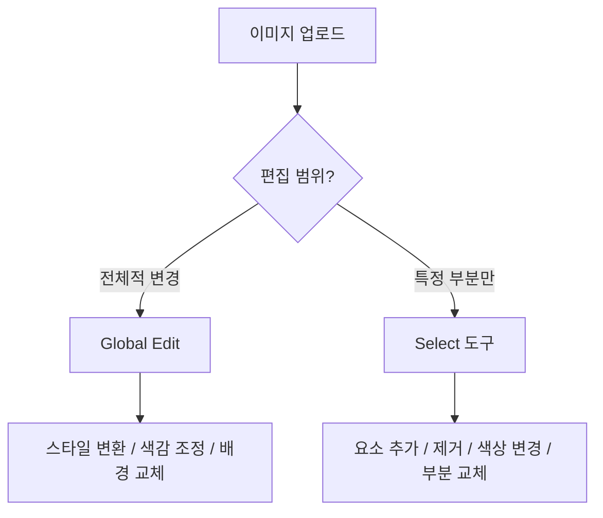
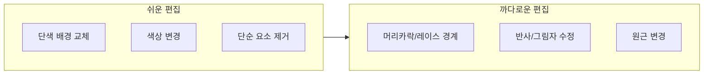

# 이미지 업로드와 편집 — Select 도구 활용

> 기존 이미지를 ChatGPT에 업로드하고, Select 도구로 원하는 부분만 정밀 편집하는 실전 워크플로우를 익힙니다.

## 개요

실무에서는 이미 있는 이미지를 수정하는 작업이 대부분입니다. 배경 교체, 요소 제거, 색상 변경 — 이런 작업을 포토샵 없이 자연어 한 줄로 해결할 수 있는 것이 ChatGPT의 **이미지 업로드 + Select 도구**입니다. 이 섹션에서는 실제 프롬프트 예시와 함께 편집 시나리오별 실전 기법을 배웁니다.

## 두 가지 편집 경로

ChatGPT에서 이미지를 편집하는 경로는 두 가지입니다.

**경로 1: Global Edit (전체 편집)**
이미지를 업로드하고 자연어로 변경을 설명합니다. 분위기, 스타일, 색감 등 전반적인 속성을 바꿀 때 적합합니다.

**경로 2: Select 도구 (부분 편집)**
브러시로 수정할 영역을 직접 칠한 뒤, 해당 영역만 변경합니다. 나머지를 보존하면서 특정 부분만 수정할 때 적합합니다.



| 시나리오 | 적합한 경로 |
|----------|-------------|
| 제품 사진 배경을 흰색으로 변경 | Global Edit |
| 인물 사진에서 안경만 추가 | Select 도구 |
| 일러스트를 유화 스타일로 변환 | Global Edit |
| 포스터에서 특정 텍스트만 수정 | Select 도구 |

## Select 도구 사용법

**Step 1**: 이미지 클릭 → 확대 뷰 열기
**Step 2**: 우측 상단 Select 아이콘 클릭 → 편집 모드 전환
**Step 3**: 좌측 슬라이더로 브러시 크기 조절
**Step 4**: 수정할 부분을 마우스 드래그로 칠하기 (반투명 하이라이트 표시)
**Step 5**: 잘못 칠했으면 하단 Undo 버튼으로 되돌리기
**Step 6**: 우측 상단 Next 클릭 → 대화창에 변경 사항 입력

> **팁**: 브러시는 대상보다 **10~20% 넓게** 칠하세요. 너무 빡빡하면 경계가 부자연스럽고, 너무 넓으면 의도하지 않은 부분까지 변경됩니다.

## 편집 시나리오별 프롬프트

좋은 편집 프롬프트는 **4요소**를 포함합니다: 대상(무엇을) + 변경(어떻게) + 유지(나머지는) + 일관성(분위기 맞춤)

### 배경 변경

배경을 Select 도구로 칠한 뒤, 아래와 같은 프롬프트를 입력합니다.

```
배경을 석양빛이 비치는 해변으로 바꿔주세요.
인물의 왼쪽에서 따뜻한 빛이 들어오는 조명 방향을 유지해주세요.
```


```
배경을 깔끔한 흰색 스튜디오로 교체해주세요.
제품에 부드러운 그림자가 자연스럽게 남도록 해주세요.
```


```
배경을 비 오는 도쿄 골목길로 바꿔주세요.
네온 간판 빛이 젖은 바닥에 반사되는 분위기로,
인물의 현재 조명 톤과 자연스럽게 어울리게 해주세요.
```


### 요소 제거

제거할 대상을 Select 도구로 칠한 뒤 프롬프트를 입력합니다. **제거 후 채울 내용**까지 지정하면 더 자연스럽습니다.

```
선택한 영역의 전선을 제거하고 맑은 파란 하늘로 자연스럽게 채워주세요.
주변 하늘의 그라데이션과 일치시켜주세요.
```


```
테이블 위의 컵을 제거하고 나무 테이블 질감으로 자연스럽게 채워주세요.
컵의 그림자도 함께 제거해주세요.
```


### 요소 추가

빈 영역을 Select 도구로 칠한 뒤, **크기, 스타일, 분위기**를 구체적으로 지정합니다.

```
선택한 빈 벽면에 모던한 검은색 프레임의 추상화 액자를 추가해주세요.
액자 크기는 벽면의 1/3 정도로, 주변 인테리어와 어울리는 톤으로 해주세요.
```


```
선택한 영역에 작은 라벤더 꽃다발을 추가해주세요.
기존 이미지의 따뜻한 자연광 톤에 맞추고, 사실적인 스타일을 유지해주세요.
```


### 색상 변경

색상을 바꿀 대상을 Select 도구로 칠합니다.

```
선택한 빨간색 자동차를 무광 네이비 블루로 바꿔주세요.
차체의 반사광과 그림자는 새로운 색상에 맞게 자연스럽게 조정해주세요.
```


```
선택한 파란색 셔츠를 따뜻한 베이지색으로 변경해주세요.
옷의 주름과 질감은 그대로 유지해주세요.
```


### 스타일 변환

특정 영역의 스타일만 바꾸고 싶을 때 Select 도구로 해당 영역을 지정합니다.

```
선택한 가죽 소파를 미드센추리 모던 스타일의 패브릭 소파로 바꿔주세요.
주변 가구와 바닥은 그대로 유지하고, 같은 조명 톤을 유지해주세요.
```


```
선택한 나무 테이블 표면을 흰색 대리석 질감으로 바꿔주세요.
대리석의 자연스러운 결이 보이도록 하고, 위에 놓인 물건들의 반사는 새 재질에 맞게 조정해주세요.
```


## 업로드 이미지 vs AI 생성 이미지 편집

| 구분 | AI 생성 이미지 | 업로드 이미지 |
|------|---------------|--------------|
| 맥락 | 생성 맥락을 기억 | 맥락 없음 |
| 프롬프트 | 간결해도 OK | 스타일/조명 명시 필요 |
| 일관성 | 멀티턴 수정에 강함 | 경계 불일치 가능 |
| 디테일 | 자연스러운 유지 | 피부/머리카락 등 변할 수 있음 |

**업로드 이미지 편집 품질을 높이려면:**
1. 첫 메시지에서 이미지 스타일을 설명: "자연광 아래 촬영된 제품 사진이에요"
2. 편집 프롬프트에 조명/톤 지정: "같은 자연광 톤을 유지하면서..."
3. 한 번에 하나씩 단계적으로 수정
4. **1024px 이상** 해상도의 이미지 사용

## 편집 한계와 대처법



까다로운 편집을 만났을 때의 대처법:
1. **영역을 넓게 잡기** — 복잡한 경계 주변을 넉넉하게 선택
2. **단계 분할** — 한 번에 큰 변경 대신 2~3단계로 나눠서 수정
3. **맥락 설명** — "유리 재질이라 반사가 있어요" 같은 정보를 프롬프트에 포함
4. **Global Edit 병행** — Select로 핵심 수정 후, Global Edit으로 전체 분위기 통일

## 실습

### 카페 사진 편집 프로젝트

카페 인테리어 사진(테이블 위 커피잔, 배경에 식물, 따뜻한 톤)을 단계별로 편집해봅니다.

**Step 1**: 커피잔을 Select 도구로 칠하고:

```
선택한 커피잔을 우아한 찻잔과 소서로 변경해주세요.
따뜻한 차가 담겨있고, 기존 따뜻한 조명 톤을 유지해주세요.
```

**Step 2**: 배경 식물을 Select 도구로 칠하고:

```
선택한 식물을 제거하고 뒤의 벽면으로 자연스럽게 채워주세요.
벽의 질감과 색상을 주변과 일치시켜주세요.
```

**Step 3**: 테이블 표면을 Select 도구로 칠하고:

```
선택한 나무 테이블을 따뜻한 톤의 대리석 질감으로 바꿔주세요.
위에 놓인 찻잔의 그림자가 자연스럽게 유지되도록 해주세요.
```

> **편집 순서 원칙**: 큰 변경(배경) → 중간 요소(가구/소품) → 작은 디테일 → 전체 색감 조정. 색감을 먼저 조정하면 이후 편집에서 다시 틀어질 수 있습니다.

## 팁과 주의사항

> **주의**: Select 도구로 칠한 영역 **밖**으로도 약간 영향이 미칠 수 있습니다. 특히 조명이나 그림자는 선택 영역 너머까지 변경되는 경우가 있으니, 편집 후 반드시 전체 이미지를 확인하세요.

> **팁**: 이미지를 업로드한 뒤 "이 이미지의 색상 팔레트를 분석해줘"라고 먼저 요청하고, 그 분석 결과를 바탕으로 편집을 지시하면 더 정확한 결과를 얻을 수 있습니다.

> **팁**: 복잡한 편집은 한 번에 하지 말고 **한 가지씩** 진행하세요. 배경 변경 → 확인 → 옷 변경 → 확인 → 소품 추가. 각 단계의 결과를 확인하고, 문제가 생기면 돌아갈 수 있습니다.

## 핵심 정리

| 개념 | 설명 |
|------|------|
| Global Edit | 이미지 전체 스타일/색감/배경 변경에 적합 |
| Select 도구 | 브러시로 특정 영역 선택 후 부분 수정. 요소 추가/제거/교체에 적합 |
| 편집 프롬프트 4요소 | 대상 + 변경 + 유지 + 일관성 |
| 편집 순서 | 큰 변경 → 중간 요소 → 작은 디테일 → 전체 색감 |
| AI 생성 vs 업로드 | AI 생성은 맥락 보유로 자연스러움, 업로드는 상세 프롬프트 필요 |

## 다음 섹션 미리보기

다음 섹션 [ChatGPT 이미지 생성 실무 프로젝트](03-ch3-chatgpt-이미지-생성-실전/05-05-chatgpt-이미지-생성-실무-프로젝트.md)에서는 지금까지 배운 모든 기술을 종합하여 실제 클라이언트 브리프 기반의 프로젝트를 처음부터 끝까지 완성합니다. SNS 카드 세트, 제품 목업, 이벤트 포스터 등 실무에서 바로 활용할 수 있는 결과물을 만들어 봅니다.
