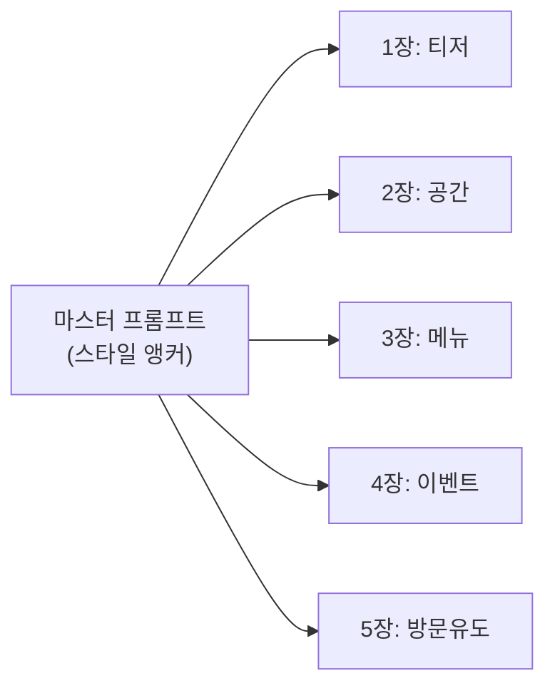

# ChatGPT 이미지 생성 실무 프로젝트

> 클라이언트 브리프부터 최종 납품까지 — SNS 콘텐츠 시리즈 5장을 ChatGPT만으로 완성하는 실전 워크플로우

## 개요

이 세션에서는 Ch3의 모든 기술을 하나의 실전 프로젝트로 통합합니다. SNS 콘텐츠 시리즈는 빠른 제작 속도, 시리즈 일관성, 텍스트 오버레이를 동시에 요구하는데, 이 세 가지가 GPT-4o의 핵심 강점입니다.

**가상 브리프: "블룸 카페(Bloom Cafe)"**

| 항목 | 내용 |
|------|------|
| **브랜드** | 블룸 카페(Bloom Cafe) — 식물 인테리어 카페 |
| **캠페인 목표** | "일상에 초록을 더하세요" 봄 시즌 프로모션, 방문 유도 |
| **타겟** | 20~30대, 카페/식물 관심층 |
| **브랜드 컬러** | 세이지 그린(#9CAF88), 크림 화이트(#FFF8E7), 테라코타(#C67C4E) |
| **납품물** | 인스타그램 피드 정사각형(1:1) 이미지 **5장** 시리즈 |
| **톤앤매너** | 따뜻하고 편안한, 자연 친화적 라이프스타일 |

## 마스터 프롬프트 설계

시리즈 일관성의 핵심은 마스터 프롬프트입니다. 영화의 룩북처럼, 3개 레이어로 구성합니다:

- **스타일 앵커** (모든 이미지 공통) — 색상, 조명, 촬영 스타일, 분위기
- **콘텐츠 변수** (이미지마다 교체) — 주제, 핵심 요소, 포커스 오브젝트
- **텍스트 오버레이** (필요한 이미지만) — 문구, 폰트 분위기, 배치, 여백



블룸 카페의 마스터 프롬프트:

```
[스타일 앵커 — 모든 이미지 첫 줄에 복사]

Style: editorial lifestyle photography, slightly desaturated with film grain.
Lighting: warm natural morning light, soft shadows.
Color palette: sage green (#9CAF88) dominant, cream white (#FFF8E7) background,
terracotta (#C67C4E) accent.
Mood: cozy, inviting, organic.
Format: square 1:1 ratio, Instagram feed post.
```

## 5장 시리즈 제작

### 콘텐츠 맵

| 순서 | 주제 | 핵심 비주얼 | 텍스트 오버레이 |
|------|------|-----------|----------------|
| 1장 | 티저 | 안개 낀 식물 클로즈업 | "Something Green is Coming" |
| 2장 | 공간 소개 | 카페 전경, 식물 가득 | "Bloom Cafe Open" |
| 3장 | 메뉴 하이라이트 | 녹차 라떼 + 테라코타 컵 | "Spring Menu" |
| 4장 | 이벤트 안내 | 미니 화분 만들기 | "Plant Workshop 3/22" |
| 5장 | 방문 유도 | 웃는 바리스타 + 식물 | "Visit Bloom" |

### 1장: 티저 — "Something Green is Coming"

첫 이미지가 시리즈 기준점이므로 스타일 앵커와 함께 가장 상세하게 작성합니다.

```
나는 식물 인테리어 카페 'Bloom Cafe'의 인스타그램 캠페인 이미지 5장을 만들 거야.
전체 시리즈 스타일을 먼저 알려줄게:

- 스타일: editorial lifestyle photography, slightly desaturated, subtle film grain
- 조명: warm natural morning light, soft diffused shadows
- 컬러 팔레트: sage green(#9CAF88) 주조색, cream white(#FFF8E7) 배경,
  terracotta(#C67C4E) 포인트
- 분위기: cozy, inviting, organic
- 비율: 정사각형 1:1

첫 번째 이미지를 만들어줘:
이른 아침, monstera 잎의 클로즈업. 잎 사이로 부드러운 아침 햇살이 필터링되고,
배경에 살짝 안개 효과. 하단 중앙에 'Something Green is Coming' 텍스트를
크림 화이트 색상의 우아한 세리프 폰트로 배치. 텍스트 아래 충분한 여백.
```


**수정 프롬프트 예시:**

```
텍스트가 잎에 가려져서 읽기 어려워. 하단 1/4에 반투명 크림색 배경 띠를
깔고 그 위에 텍스트를 올려줘. 폰트 크기도 좀 더 키워줘.
```

```
색감이 너무 차가워. golden hour 느낌으로 더 따뜻하게. 안개는 절반으로.
```

### 2장: 공간 소개 — "Bloom Cafe Open"

```
같은 스타일을 유지하면서 두 번째 이미지를 만들어줘.

밝은 낮 시간의 카페 내부 전경. 천장에서 매달린 행잉 플랜트들,
창가 선반 위의 다육식물들, 원목 테이블과 라탄 의자.
크림 화이트 벽과 세이지 그린 식물이 대비되는 구도.
상단 중앙에 'Bloom Cafe Open'을 모던한 산세리프 폰트로,
세이지 그린 색상으로 배치.
```


**수정 프롬프트 예시:**

```
식물이 좀 더 풍성했으면 좋겠어. 왼쪽 코너에 큰 몬스테라 화분을 추가하고,
천장 행잉 플랜트도 2-3개 더 넣어줘. 나머지 스타일은 그대로 유지해.
```

### 3장: 메뉴 하이라이트 — "Spring Menu"

```
세 번째 이미지. 첫 번째 이미지의 따뜻한 톤을 다시 참고해줘.

테라코타 색상의 세라믹 컵에 담긴 녹차 라떼, 위에 라떼 아트.
컵 옆에 작은 다육식물 화분과 민트 잎 장식.
원목 테이블 위, 위에서 45도 각도로 촬영한 플랫레이 스타일.
'Spring Menu'를 우측 상단에 필기체 느낌의 폰트로,
테라코타 색상으로 배치.
```


**수정 프롬프트 예시:**

```
라떼 아트가 잘 안 보여. 컵 각도를 살짝 위에서 보이게 하고,
나뭇잎 모양 라떼 아트를 선명하게. 배경에 메뉴판과 시나몬 스틱 소품 추가.
```

### 4장: 이벤트 안내 — "Plant Workshop 3/22"

```
네 번째 이미지. 시리즈 톤 유지해줘.
밝은 작업 테이블 위에 미니 테라코타 화분, 흙, 다육식물 묘목,
정원 가위, 물뿌리개. 준비 단계의 정물 구도, 따뜻한 자연광.
하단에 'Plant Workshop 3/22'를 크림 화이트 반투명 띠 위에 세이지 그린 산세리프로.
```


**수정:** `'3/22'가 '3/2'로 잘못 나왔어. 텍스트 영역만 선택해서 정확하게 다시 렌더링해줘.`

### 5장: 방문 유도 — "Visit Bloom"

```
마지막 이미지. 시리즈 마무리 느낌으로.
카페 입구 앞 바리스타(앞치마, 밝은 표정). 입구 양쪽 큰 화분,
문 위 작은 간판. 환영하는 분위기, eye-level 앵글.
'Visit Bloom' 큰 세리프 크림 화이트로. 아래 작게 'bloomcafe.kr'.
```


**수정:** `바리스타 표정이 어색해. 자연스러운 미소로, 살짝 고개 기울인 포즈. 배경 유지.`

## 시리즈 일관성 유지 팁

GPT-4o는 같은 대화에서 이전 이미지 스타일을 기억하지만, 대화가 길어지면 톤 드리프트가 생깁니다.

- **첫 이미지에 공을 들이세요** — 시리즈의 기준점
- **같은 대화를 유지** — 새 대화 = 비주얼 메모리 리셋
- **3~4장마다 리마인드** — "첫 번째 이미지의 톤을 다시 참고해줘"
- **한도 도달 시** — 이전 시리즈 이미지를 새 대화에 업로드 후 "이 스타일 유지해줘"

## 브랜드 컬러 적용법

| 접근법 | 예시 | 정확도 |
|--------|------|--------|
| HEX 코드 직접 지정 | "dominant color #9CAF88" | 중간 |
| 색상명 + 수식어 | "muted sage green" | 높음 |
| 참조 이미지 업로드 | 브랜드 가이드 이미지 업로드 | 가장 높음 |

가장 효과적인 방법은 세 가지 조합입니다. 브랜드 컬러 스와치 이미지를 업로드한 뒤 "이 팔레트를 기반으로 생성해줘"라고 요청하세요.

## SNS 플랫폼별 규격

| 플랫폼 | 용도 | 권장 비율 | ChatGPT 요청 방식 |
|--------|------|----------|-------------------|
| Instagram 피드 | 정사각형 포스트 | 1:1 | 기본값 (1024x1024) |
| Instagram 스토리/릴스 | 세로형 콘텐츠 | 9:16 | "세로형 이미지, portrait orientation" |
| LinkedIn/Facebook | 포스트 이미지 | 1.91:1 | "가로형 이미지, wide landscape" |
| Pinterest | 핀 이미지 | 2:3 | "세로로 긴 이미지, 2:3 ratio" |
| X(Twitter) | 포스트 이미지 | 16:9 | "가로형 이미지, cinematic wide" |

## 실습: 다른 브랜드로 시리즈 만들기

**브리프**: "문라이트 요가(Moonlight Yoga)" — 야간 요가 스튜디오, 30~40대 직장인 타겟. 컬러: 미드나이트 블루(#191970), 라벤더(#E6E6FA), 골드(#FFD700). 톤: 고요하고 신비로운.

**1장 — 스타일 앵커 + 티저:**

```
야간 요가 스튜디오 'Moonlight Yoga' 인스타그램 캠페인 5장 시리즈.
- 스타일: moody atmospheric photography, cinematic quality
- 조명: soft moonlight blue, subtle golden candlelight accents
- 컬러: midnight blue(#191970), lavender(#E6E6FA), gold(#FFD700)
- 분위기: serene, mystical, meditative / 비율: 1:1

첫 번째 이미지: 어두운 스튜디오, 캔들 불빛.
요가 매트 위 라벤더 꽃잎, 천장 별 모양 조명.
하단에 'Under the Moonlight' 라벤더 세리프.
```


**2장~5장:**

```
두 번째: 달빛 큰 창문 앞 요가 실루엣(나무 자세). 보름달, 골드 캔들 3개.
상단에 'Moonlight Yoga' 골드 산세리프.
```

```
세 번째: 위에서 내려다본 구도. 원형 매트 4장, 중앙에 향초와 싱잉볼.
'Night Class Open' 중앙에 라벤더 세리프.
```

```
네 번째: 허브티 세트, 아로마 오일, 라벤더 꽃다발의 웰컴 코너.
'Free Trial Night 4/5' 하단 골드, 반투명 블루 배경 띠.
```

```
다섯 번째: 스튜디오 입구, 골드 랜턴, 달 모양 간판.
'Find Your Calm' 중앙 라벤더 세리프. 아래 작게 'moonlightyoga.kr'.
```


## 팁과 주의사항

- 클라이언트에게 AI 초안을 보여줄 때는 "방향성 제안"임을 명시하세요
- 투명 배경이 필요하면 "투명 배경으로 만들어줘"라고 요청 (로고/스티커에 유용)
- 유료 플랜은 상업 사용 가능하지만, 브랜드/캐릭터 모방 이미지는 법적 검토 필요
- 파일명을 체계적으로: `bloom-cafe-ig-01-teaser.png` 형식 추천

## 핵심 정리

| 개념 | 설명 |
|------|------|
| 마스터 프롬프트 | 스타일 앵커(공통) + 콘텐츠 변수(개별) + 텍스트 오버레이의 3레이어 시스템 |
| 비주얼 메모리 | GPT-4o가 같은 대화에서 이전 이미지 스타일을 기억. 3~4장마다 리마인드 필요 |
| 브랜드 컬러 | 참조 이미지 업로드 + 색상명 수식어 + HEX 코드 조합이 가장 정확 |
| 톤 드리프트 교정 | 색감이 벗어날 때 첫 이미지를 기준점으로 재참조 |
| 수정 프롬프트 | 구체적 영역 + 원하는 변화 + "나머지 유지" 패턴으로 요청 |
| 출력 규격 | 기본 1024x1024(PNG). 플랫폼별 비율을 생성 시 지정 |

## 다음 챕터 미리보기

Ch3에서 ChatGPT 이미지 생성의 전 과정을 마스터했습니다. 다음 챕터 [Ch4. Gemini 이미지 생성 실전](04-ch4-gemini-이미지-생성-실전/01-01-gemini-이미지-생성의-특징과-접근법.md)에서는 Google Gemini의 이미지 생성 기능을 탐구합니다. 두 플랫폼을 비교하며 상황별 최적 도구를 선택하는 눈을 키워보겠습니다.
