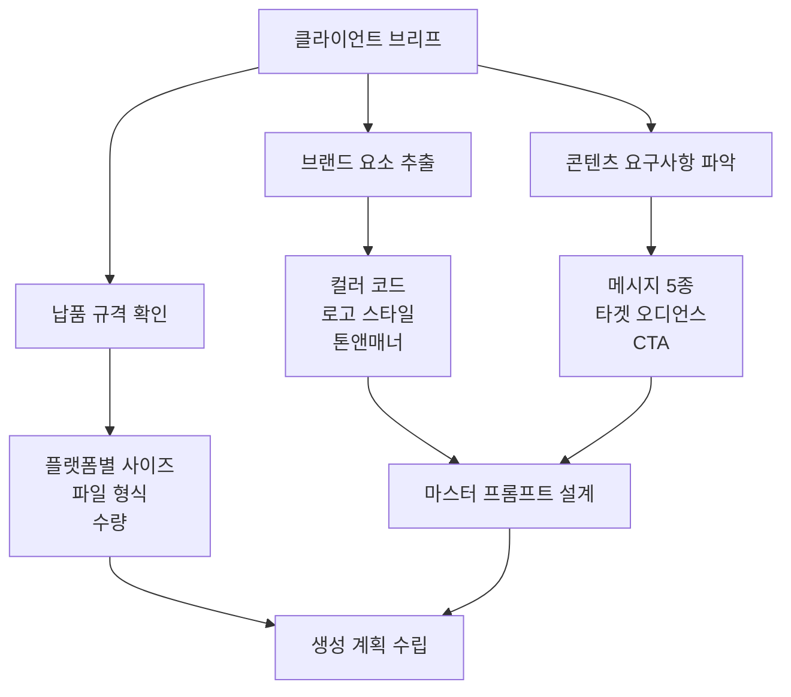
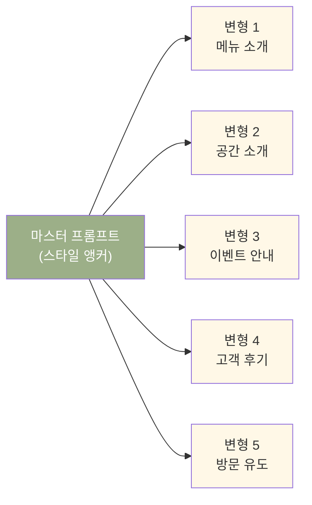
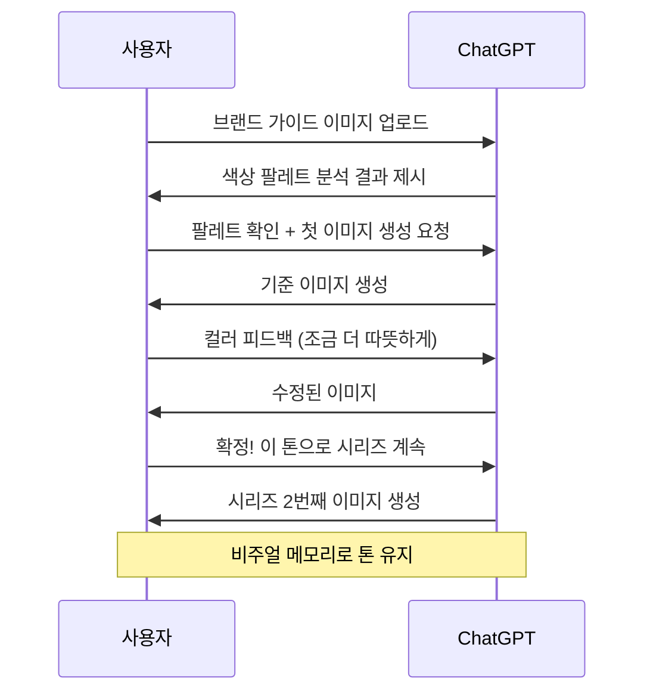
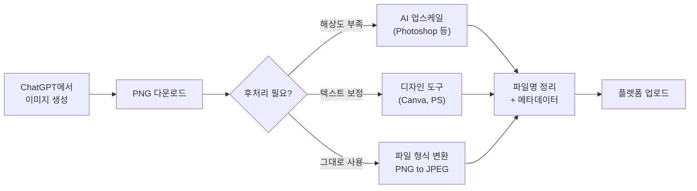
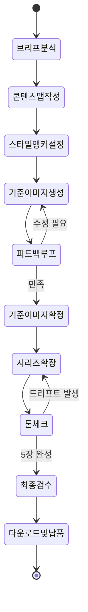

# ChatGPT 이미지 생성 실무 프로젝트

> 클라이언트 브리프부터 최종 납품까지 — SNS 콘텐츠 시리즈를 ChatGPT만으로 완성하는 실전 워크플로우

## 개요

이 섹션에서는 Ch3에서 배운 모든 기술을 하나의 실전 프로젝트로 통합합니다. 가상 브랜드의 클라이언트 브리프를 받아, SNS 콘텐츠 시리즈 5장을 기획부터 최종 다운로드까지 완성하는 전 과정을 경험합니다.

**이번 프로젝트의 가상 브리프**:

| 항목 | 내용 |
|------|------|
| **브랜드** | 블룸 카페(Bloom Café) — 식물 인테리어 카페 |
| **캠페인 목표** | "일상에 초록을 더하세요" 봄 시즌 프로모션, 방문 유도 |
| **타겟** | 20~30대, 카페·식물 관심층 |
| **브랜드 컬러** | 세이지 그린(#9CAF88) · 크림 화이트(#FFF8E7) · 테라코타(#C67C4E) |
| **납품물** | 인스타그램 피드 정사각형(1:1) 이미지 **5장** 시리즈 |
| **톤앤매너** | 따뜻하고 편안한, 자연 친화적 라이프스타일 |

이 브리프를 기반으로, 브리프 분석 → 마스터 프롬프트 설계 → 시리즈 제작 → 후처리 → 납품까지의 전체 워크플로우를 단계별로 진행합니다.

**선수 지식**: [GPT-4o 이미지 생성의 특징과 강점](03-ch3-chatgpt-이미지-생성-실전/01-01-gpt-4o-이미지-생성의-특징과-강점.md)의 네이티브 통합 개념, [대화형 이미지 생성](03-ch3-chatgpt-이미지-생성-실전/02-02-대화형-이미지-생성-자연어로-그리기.md)의 멀티턴 편집 전략, [텍스트 렌더링](03-ch3-chatgpt-이미지-생성-실전/03-03-텍스트-렌더링과-타이포그래피-이미지.md)의 4대 요소, [Select 도구](03-ch3-chatgpt-이미지-생성-실전/04-04-이미지-업로드와-편집-select-도구-활용.md)의 부분 편집 기법

**학습 목표**:
- 클라이언트 브리프를 분석하여 이미지 생성 계획을 수립할 수 있다
- 브랜드 컬러와 스타일 가이드를 ChatGPT 프롬프트에 체계적으로 반영할 수 있다
- 5장 이상의 시리즈 이미지에서 시각적 일관성을 유지할 수 있다
- 생성된 이미지를 SNS 플랫폼 규격에 맞춰 최적화하고 다운로드할 수 있다

## 왜 알아야 할까?

디자이너가 AI 이미지 생성 도구를 배우는 이유는 결국 **실무에서 쓰기 위해서**입니다. 아무리 프롬프트를 잘 쓰고, Select 도구를 능숙하게 다뤄도, 실제 프로젝트에서 이 기술들을 조합하지 못하면 의미가 없죠.

특히 SNS 콘텐츠 제작은 AI 이미지 생성이 가장 빛나는 영역입니다. 왜일까요? SNS 콘텐츠는 **빠른 제작 속도**, **시리즈 일관성**, **텍스트 오버레이**라는 세 가지 요구를 동시에 충족해야 하는데, 이 세 가지가 정확히 GPT-4o가 강점을 보이는 영역이기 때문입니다.

전통적인 워크플로우에서 SNS 카드 5장을 만들려면 디자이너가 포토샵이나 일러스트레이터에서 템플릿을 만들고, 스톡 이미지를 찾고, 합성하고, 텍스트를 배치하는 데 반나절 이상 걸렸습니다. ChatGPT를 활용하면 이 과정을 **1~2시간으로 단축**할 수 있습니다. 물론 최종 마감 품질을 위해 추가 리터치가 필요할 수 있지만, 초안 제작과 컨셉 확정의 속도가 비약적으로 빨라지는 것이죠.

## 핵심 개념

### 개념 1: 브리프 분석과 비주얼 전략 수립

> 💡 **비유**: 요리사가 레시피를 받으면 바로 불을 켜지 않습니다. 먼저 재료를 확인하고, 조리 순서를 정하고, 플레이팅 구상을 하죠. AI 이미지 생성도 마찬가지입니다. 클라이언트 브리프는 레시피이고, 프롬프트 전략 수립이 바로 "준비 작업(Mise en place)"입니다.

실무 프로젝트의 첫 단계는 클라이언트 브리프를 **AI 프롬프트 관점으로 번역**하는 것입니다. 브리프에는 브랜드 가이드라인, 타겟 오디언스, 캠페인 메시지, 납품 규격 등이 담겨 있는데, 이 요소들을 ChatGPT가 이해할 수 있는 시각 언어로 변환해야 합니다.

> 📊 **그림 1**: 브리프에서 프롬프트까지의 변환 프로세스

브리프를 분석할 때 체크해야 할 핵심 항목은 다음과 같습니다:

| 분석 항목 | 추출할 정보 | 프롬프트 반영 방식 |
|-----------|------------|-------------------|
| 브랜드 컬러 | HEX/RGB 값 또는 컬러명 | "dominant color: coral pink (#FF6B6B)" |
| 톤앤매너 | 전문적/캐주얼/럭셔리 등 | 스타일 지시어로 변환 |
| 타겟 오디언스 | 연령대, 관심사 | 분위기와 요소 선택에 반영 |
| 핵심 메시지 | 캠페인 슬로건, CTA | 텍스트 렌더링 계획 수립 |
| 납품 규격 | 플랫폼, 사이즈, 수량 | 생성 해상도와 비율 결정 |

**실전 사례: "블룸 카페" 브리프 분석**

개요에서 소개한 "블룸 카페(Bloom Café)" 브리프를 AI 프롬프트 관점으로 번역해봅시다:

- **브랜드**: 식물 인테리어 카페, 20~30대 타겟
- **브랜드 컬러**: 세이지 그린(#9CAF88), 크림 화이트(#FFF8E7), 테라코타(#C67C4E)
- **톤앤매너**: 따뜻하고 편안한, 자연 친화적
- **캠페인**: "일상에 초록을 더하세요" 봄 시즌 프로모션
- **납품**: 인스타그램 피드용 정사각형 5장 시리즈

이 브리프에서 마스터 프롬프트의 뼈대를 추출하면: "warm, cozy café interior with lush green plants, sage green and cream white color palette, natural lighting, Instagram-ready lifestyle photography style" — 이것이 모든 시리즈 이미지에 공통으로 들어갈 **스타일 앵커(Style Anchor)**가 됩니다.

### 개념 2: 마스터 프롬프트와 시리즈 일관성 전략

> 💡 **비유**: 영화 촬영에서 "룩북(Look Book)"이라는 게 있습니다. 촬영 전에 전체 영화의 색감, 조명 방향, 카메라 무브먼트의 기준을 정해놓는 문서인데요. 마스터 프롬프트가 바로 AI 이미지 시리즈의 룩북 역할을 합니다.

시리즈 일관성을 유지하는 핵심은 **마스터 프롬프트 시스템**입니다. 이 방법은 [나만의 프롬프트 템플릿 만들기](02-ch2-프롬프트-구조-마스터/06-06-나만의-프롬프트-템플릿-만들기.md)에서 배운 템플릿 구축의 실전 적용이기도 합니다.

> 📊 **그림 2**: 마스터 프롬프트 시스템의 구조

마스터 프롬프트 시스템은 3개 레이어로 구성됩니다:

**레이어 1 — 스타일 앵커 (모든 이미지 공통)**
시리즈 전체에 적용되는 시각 기준입니다. 색상 팔레트, 조명 방향, 촬영 스타일, 전체 분위기를 고정합니다. ChatGPT 대화의 첫 메시지에서 이 스타일 앵커를 명확히 설정하면, GPT-4o의 **비주얼 메모리** 기능 덕분에 이후 이미지들도 같은 톤을 유지합니다.

**레이어 2 — 콘텐츠 변수 (이미지마다 다름)**
각 이미지의 주제, 핵심 요소, 포커스 오브젝트가 달라지는 부분입니다. "메뉴 클로즈업" → "카페 전경" → "이벤트 포스터" 식으로 변수만 교체합니다.

**레이어 3 — 텍스트 오버레이 (필요한 이미지만)**
[텍스트 렌더링과 타이포그래피 이미지](03-ch3-chatgpt-이미지-생성-실전/03-03-텍스트-렌더링과-타이포그래피-이미지.md)에서 배운 4대 요소(정확한 문구, 폰트 분위기, 배치, 여백)를 적용합니다.

**GPT-4o의 비주얼 메모리 활용법**

GPT-4o는 같은 대화 안에서 이전에 생성한 이미지의 스타일을 기억합니다. 이 비주얼 메모리를 최대로 활용하려면:

1. **첫 이미지에 공을 들이세요** — 시리즈의 "기준점"이 될 첫 이미지를 가장 상세하게 묘사합니다
2. **같은 대화를 유지하세요** — 새 대화를 시작하면 비주얼 메모리가 리셋됩니다
3. **명시적으로 참조하세요** — "방금 만든 이미지와 동일한 색감과 조명으로"라고 직접 언급합니다
4. **벗어났을 때 즉시 교정** — "컬러가 너무 차가워졌어. 첫 번째 이미지의 따뜻한 톤으로 돌아가줘"

> ⚠️ **흔한 오해**: "한 번 스타일을 설정하면 알아서 유지된다"고 생각하기 쉽지만, 대화가 길어지면 GPT-4o도 점차 드리프트(drift)가 생깁니다. 3~4장마다 "첫 번째 이미지의 스타일을 기준으로"라고 리마인드해주는 것이 좋습니다.

### 개념 3: 브랜드 컬러 적용 전략

> 💡 **비유**: 화가가 팔레트에 물감을 짜놓는 것처럼, ChatGPT에게 정확한 "컬러 팔레트"를 먼저 알려줘야 합니다. "초록색"이라고 말하면 어떤 초록인지 모르지만, "sage green, muted and dusty tone"이라고 말하면 정확한 색감을 찾아줍니다.

ChatGPT에서 브랜드 컬러를 정확하게 적용하는 것은 시리즈 일관성의 핵심입니다. 하지만 AI 이미지 생성에서 색상을 "픽셀 퍼펙트"하게 제어하는 것은 아직 한계가 있습니다. 그래서 **근사치 전략**이 필요합니다.

**브랜드 컬러 지정의 3가지 접근법**:

| 접근법 | 프롬프트 예시 | 정확도 | 추천 상황 |
|--------|-------------|--------|----------|
| HEX 코드 직접 지정 | "dominant color #9CAF88" | 중간 | API 사용 시 |
| 색상명 + 수식어 | "muted sage green" | 높음 | ChatGPT 대화 시 |
| 참조 이미지 업로드 | 브랜드 가이드 이미지 업로드 | 가장 높음 | 정확한 매칭 필요 시 |

가장 효과적인 방법은 **세 가지를 조합**하는 것입니다:

1. 먼저 브랜드 가이드라인 이미지(컬러 스와치가 포함된)를 업로드합니다
2. "이 이미지의 색상 팔레트를 분석해줘"라고 요청합니다
3. ChatGPT가 인식한 색상을 확인한 후 "이 팔레트를 기반으로 이미지를 생성해줘"라고 지시합니다

이 방식을 쓰면 GPT-4o가 업로드된 이미지의 색상을 직접 분석하고 참고하기 때문에, 텍스트로만 설명할 때보다 훨씬 정확한 컬러 매칭이 가능합니다.

> 📊 **그림 3**: 브랜드 컬러 적용 워크플로우

### 개념 4: SNS 플랫폼별 최적화와 다운로드

> 💡 **비유**: 같은 음식이라도 접시에 담는 방법이 다르듯, 같은 콘텐츠라도 인스타그램, 링크드인, 페이스북에 올릴 때 각각 다른 "그릇"이 필요합니다. 이미지 크기와 비율이 바로 그 그릇이죠.

GPT-4o는 기본적으로 **1024×1024 픽셀** 정사각형 이미지를 생성합니다. 하지만 가로형(1792×1024)이나 세로형(1024×1792)도 요청할 수 있습니다. SNS 플랫폼마다 최적 규격이 다르므로, 생성 단계에서부터 올바른 비율을 지정하는 것이 중요합니다.

**주요 플랫폼별 권장 규격**:

| 플랫폼 | 용도 | 권장 비율 | ChatGPT 요청 방식 |
|--------|------|----------|-------------------|
| Instagram 피드 | 정사각형 포스트 | 1:1 | 기본값 (1024×1024) |
| Instagram 스토리/릴스 | 세로형 콘텐츠 | 9:16 | "세로형 이미지, portrait orientation" |
| LinkedIn | 포스트 이미지 | 1.91:1 | "가로형 이미지, wide landscape" |
| Facebook | 공유 이미지 | 1.91:1 | "가로형 이미지, wide landscape" |
| Pinterest | 핀 이미지 | 2:3 | "세로로 긴 이미지, 2:3 ratio" |
| X(Twitter) | 포스트 이미지 | 16:9 | "가로형 이미지, cinematic wide" |

**다운로드와 후처리 워크플로우**:

ChatGPT에서 생성된 이미지는 **PNG 형식**으로 다운로드됩니다. 이미지 위에 마우스를 올리면 다운로드 아이콘이 나타나고, 클릭하면 로컬에 저장됩니다. 하지만 실무에서는 다운로드 이후 몇 가지 추가 작업이 필요한 경우가 많습니다:

1. **해상도 업스케일**: GPT-4o의 기본 출력은 1024px 기반입니다. 인쇄용이나 고해상도 디스플레이용으로는 외부 도구(Photoshop, 또는 AI 업스케일러)로 확대가 필요합니다
2. **파일 형식 변환**: SNS 업로드에는 JPEG가 더 가벼워 적합한 경우가 많습니다. PNG → JPEG 변환 시 배경 투명도가 사라지므로 주의하세요
3. **파일명 정리**: 체계적인 파일명(예: bloom-cafe-ig-01-menu.png)으로 관리하면 시리즈가 늘어나도 혼란이 없습니다

> 📊 **그림 4**: 생성부터 납품까지의 후처리 파이프라인

> 🔥 **실무 팁**: ChatGPT 대화 중에 "이 이미지를 투명 배경으로 만들어줘"라고 요청하면 배경이 제거된 PNG를 받을 수 있습니다. 로고나 스티커 형태의 에셋을 만들 때 유용합니다.

### 개념 5: 실전 제작 — 5장 시리즈 완성 워크플로우

> 💡 **비유**: 오케스트라의 지휘자는 악보 전체를 머릿속에 넣고 각 파트의 연주를 조율합니다. 시리즈 제작도 마찬가지로, 5장 전체의 "악보"를 먼저 짜고, 한 장씩 "연주"하면서 전체 조화를 맞춰가는 과정입니다.

"블룸 카페" 프로젝트의 실전 제작 과정을 단계별로 살펴봅시다.

**Step 1: 시리즈 콘텐츠 맵 작성**

5장의 시리즈가 인스타그램 피드에서 어떤 순서로 보일지 먼저 기획합니다:

| 순서 | 주제 | 핵심 비주얼 | 텍스트 오버레이 |
|------|------|-----------|----------------|
| 1장 | 티저 | 안개 낀 식물 클로즈업 | "Something Green is Coming" |
| 2장 | 공간 소개 | 카페 전경, 식물 가득 | "Bloom Café Open" |
| 3장 | 메뉴 하이라이트 | 녹차 라떼 + 테라코타 컵 | "Spring Menu" |
| 4장 | 이벤트 안내 | 미니 화분 만들기 | "Plant Workshop 3/22" |
| 5장 | 방문 유도 | 웃는 바리스타 + 식물 | "Visit Bloom" |

**Step 2: ChatGPT 대화 시작 — 스타일 앵커 설정**

첫 번째 메시지에서 전체 시리즈의 톤을 확립합니다:

> "나는 식물 인테리어 카페 'Bloom Café'의 인스타그램 캠페인을 만들고 있어. 5장의 정사각형 이미지 시리즈를 만들 거야. 전체 톤: warm, cozy, natural lighting, soft focus. 컬러 팔레트: sage green(#9CAF88), cream white(#FFF8E7), terracotta(#C67C4E). 스타일: editorial lifestyle photography, slightly desaturated, film grain texture. 첫 번째 이미지는 — 이른 아침 안개 속의 monstera 잎 클로즈업, soft morning light filtering through the leaves, 하단에 'Something Green is Coming'이라는 텍스트를 세리프 폰트로 배치해줘."

**Step 3: 기준 이미지 확정 → 시리즈 확장**

첫 이미지가 만족스러우면, [4단계 반복 전략](03-ch3-chatgpt-이미지-생성-실전/02-02-대화형-이미지-생성-자연어로-그리기.md)(구도→요소→색감→디테일)으로 미세 조정합니다. 확정 후 "이 스타일을 유지하면서 두 번째 이미지를 만들어줘"로 진행합니다.

**Step 4: 문제 발생 시 대처**

시리즈 제작 중 흔히 발생하는 문제와 해결법:

- **톤 드리프트**: 3장째부터 색감이 달라짐 → "1번째 이미지의 톤을 다시 참고해줘"
- **텍스트 오류**: 철자가 틀림 → Select 도구로 텍스트 영역 선택 후 재생성
- **구도 불일치**: 앵글이 갑자기 변함 → "eye-level angle, same as previous images"로 재지정

**Step 5: 최종 검수와 다운로드**

5장 모두 완성되면 시리즈 전체를 나란히 놓고 최종 검수합니다. 체크 항목: 컬러 일관성, 텍스트 가독성, 브랜드 톤 매칭, 해상도 적합성.

> 📊 **그림 5**: 5장 시리즈 제작의 전체 워크플로우

## 실습: 적용해보기

### 실습 1: 나만의 브랜드 브리프 분석

아래 가상 브리프를 분석하여 마스터 프롬프트를 설계해보세요.

**브리프: "문라이트 요가 스튜디오"**
- 브랜드: 야간 요가 전문 스튜디오
- 타겟: 30~40대 직장인, 스트레스 해소 목적
- 브랜드 컬러: 미드나이트 블루(#191970), 라벤더(#E6E6FA), 골드(#FFD700)
- 캠페인: "밤하늘 아래 나를 만나다" — 인스타그램 5장 시리즈
- 톤앤매너: 고요하고 신비로운, 명상적인

**워크시트**:
1. 스타일 앵커 프롬프트를 작성하세요 (조명, 색상, 촬영 스타일, 분위기 포함)
2. 5장의 콘텐츠 맵을 작성하세요 (순서, 주제, 핵심 비주얼, 텍스트 유무)
3. 첫 번째 이미지의 전체 프롬프트를 완성하세요
4. 텍스트가 들어가는 이미지는 몇 장이 적절한지, 그 이유와 함께 결정하세요

### 실습 2: 시리즈 일관성 진단

아래 상황에서 어떻게 대처할지 작성해보세요:

- **상황 A**: 3번째 이미지에서 갑자기 색감이 차갑게 변했다
- **상황 B**: 4번째 이미지의 텍스트 "Workshop"이 "Workshopp"으로 렌더링됐다
- **상황 C**: 5번째 이미지를 만들려는데 ChatGPT가 "이미지 생성 한도에 도달했습니다"라고 한다

### 토론 질문

1. AI로 생성한 SNS 콘텐츠에 "AI 생성"이라고 표기해야 할까요? 각 플랫폼의 정책과 윤리적 관점에서 논의해보세요.
2. 클라이언트가 "이 이미지를 좀 더 고급스럽게 해달라"고 피드백했을 때, 어떤 프롬프트 수정 전략을 쓸 수 있을까요?

## 더 깊이 알아보기

### GPT-4o 이미지 생성의 탄생과 "비주얼 메모리" 이야기

2025년 3월 25일, OpenAI는 GPT-4o에 네이티브 이미지 생성 기능을 통합하여 공개했습니다. 이전의 DALL-E 3가 텍스트 모델과 이미지 모델이 분리된 "파이프라인" 방식이었다면, GPT-4o는 텍스트와 이미지를 하나의 모델 안에서 처리하는 진정한 멀티모달 통합을 이루었죠.

흥미로운 점은 이 기능이 공개되자마자 전 세계적으로 폭발적인 사용량이 몰렸다는 것입니다. OpenAI의 CEO 샘 알트만은 출시 직후 "우리의 GPU가 녹아내리고 있다(Our GPUs are melting)"고 유머러스하게 표현했을 정도였습니다. 특히 지브리 스타일 이미지와 액션 피규어 스타일 이미지가 SNS에서 바이럴되면서, AI 이미지 생성이 전문 디자이너뿐 아니라 일반 사용자에게도 대중화되는 전환점이 되었습니다.

2025년 12월에는 GPT Image 1.5 업데이트가 이루어져 생성 속도가 4배 빨라지고, 정밀 편집 능력이 크게 향상되었습니다. 이 업데이트로 시리즈 콘텐츠 제작의 실용성이 비약적으로 높아졌는데, 이전에는 한 장 생성에 30초 이상 걸리던 것이 10초 이내로 단축되어, 5장 시리즈를 하나의 작업 세션에서 끊김 없이 완성할 수 있게 되었습니다.

### 브랜드와 AI의 관계 — 실무 트렌드

2025년 이후 마케팅 업계에서는 AI 생성 이미지를 "초안(Draft)" 또는 "컨셉 프루프(Concept Proof)"로 활용하고, 최종 에셋은 디자이너가 보정하는 **하이브리드 워크플로우**가 표준으로 자리잡고 있습니다. AI가 디자이너를 대체하는 것이 아니라, 디자이너의 아이디에이션 속도를 높이는 도구로 자리매김한 것이죠.

## 흔한 오해와 팁

> ⚠️ **흔한 오해**: "ChatGPT로 만든 이미지는 바로 상업적으로 사용할 수 있다"라고 생각하기 쉽지만, OpenAI의 이용약관을 확인해야 합니다. 유료 플랜(ChatGPT Plus/Team/Enterprise) 사용자는 생성 이미지를 상업적으로 사용할 수 있지만, 무료 플랜 사용자는 제한이 있을 수 있습니다. 또한 기존 브랜드, 유명인, 저작권이 있는 캐릭터를 모방한 이미지는 별도의 법적 검토가 필요합니다. 이 주제는 [AI 비주얼의 저작권·윤리·상업적 활용](12-ch12-실전-포트폴리오-프로젝트/04-04-ai-비주얼의-저작권윤리상업적-활용.md)에서 더 자세히 다룹니다.

> 💡 **알고 계셨나요?**: GPT-4o의 이미지 생성은 DALL-E와 달리 **오토리그레시브(autoregressive)** 방식으로 작동합니다. 이는 텍스트를 생성하는 것과 동일한 원리로 이미지의 토큰을 하나씩 순차적으로 생성한다는 뜻입니다. 이 방식 덕분에 텍스트 렌더링 정확도가 높고, 같은 대화 맥락 안에서 이전 이미지의 스타일을 "기억"할 수 있는 것입니다.

> 🔥 **실무 팁**: 시리즈 작업 중간에 ChatGPT가 이미지 생성 한도에 도달하면, 새 대화를 시작해야 합니다. 이때 일관성을 유지하려면 **이전 시리즈에서 가장 잘 된 이미지를 새 대화에 업로드**하고 "이 스타일을 그대로 유지해줘"라고 요청하세요. 완벽하지는 않지만, 텍스트만으로 스타일을 설명하는 것보다 훨씬 높은 일관성을 얻을 수 있습니다.

> 🔥 **실무 팁**: 클라이언트에게 AI 생성 초안을 보여줄 때는 반드시 "초안(Draft)" 또는 "방향성 제안"임을 명시하세요. AI 이미지를 최종 완성물로 오인하면 기대치 관리가 어려워집니다. 초안 승인 후 Photoshop에서 마감 리터치를 거치는 워크플로우를 [Adobe Photoshop + Firefly 리터치 워크플로우](09-ch9-adobe-photoshop-firefly-리터치-워크플로우/01-01-adobe-firefly-웹앱-핵심-기능.md) 챕터에서 다룹니다.

## 핵심 정리

| 개념 | 설명 |
|------|------|
| 브리프 분석 | 브랜드 요소, 콘텐츠 요구사항, 납품 규격을 추출하여 프롬프트 전략으로 변환 |
| 마스터 프롬프트 | 스타일 앵커(공통) + 콘텐츠 변수(개별) + 텍스트 오버레이의 3레이어 시스템 |
| 비주얼 메모리 | GPT-4o가 같은 대화 내에서 이전 이미지의 스타일을 기억하는 기능. 3~4장마다 리마인드 필요 |
| 브랜드 컬러 적용 | 참조 이미지 업로드 + 색상명 수식어 + HEX 코드의 조합이 가장 정확 |
| 톤 드리프트 교정 | 시리즈 중 색감/스타일이 벗어날 때 첫 이미지를 기준점으로 재참조 |
| 출력 규격 | 기본 1024×1024(PNG). 플랫폼별 비율을 생성 시 지정. 고해상도는 외부 업스케일 필요 |
| 후처리 파이프라인 | 다운로드 → 업스케일/보정(필요 시) → 형식 변환 → 파일명 정리 → 업로드 |

## 다음 섹션 미리보기

Ch3에서 ChatGPT를 활용한 이미지 생성의 전 과정을 마스터했습니다. 다음 챕터 [Gemini 이미지 생성의 특징과 접근법](04-ch4-gemini-이미지-생성-실전/01-01-gemini-이미지-생성의-특징과-접근법.md)에서는 Google의 Gemini가 제공하는 이미지 생성 기능을 탐구합니다. Gemini는 ChatGPT와는 다른 강점을 가지고 있는데, 특히 사실적 이미지 품질과 Google 생태계와의 연동에서 차별점이 있습니다. 두 플랫폼을 비교하며 상황에 따라 최적의 도구를 선택하는 눈을 키워보겠습니다.

## 참고 자료

- [Introducing 4o Image Generation — OpenAI](https://openai.com/index/introducing-4o-image-generation/) - GPT-4o 이미지 생성 기능의 공식 소개 및 기술 사양
- [A Complete Guide to ChatGPT Image Generation in 2025 — Superhuman AI](https://www.superhuman.ai/c/a-complete-guide-to-chatgpt-image-generation-in-2025) - ChatGPT 이미지 생성의 실전 활용 가이드
- [ChatGPT GPT-4o Image Generator: Complete 2025 Review & Guide — MyMeet AI](https://mymeet.ai/blog/chatgpt-gpt4o-image-generator) - GPT-4o 이미지 생성의 브랜드 일관성 및 비주얼 메모리 활용법
- [ChatGPT Image Generation Capabilities: Styles, Dimensions, Editing — DataStudios](https://www.datastudios.org/post/chatgpt-image-generation-capabilities-styles-dimensions-editing-and-api-access-with-gpt-4o) - 출력 해상도, 비율, 형식 등 기술 규격 상세 정리
- [ChatGPT's New GPT-4o Image Gen: 5 Best Business Use Cases — Your Everyday AI](https://www.youreverydayai.com/ep-499-chatgpts-new-gpt-4o-image-gen-5-best-business-use-cases/) - 비즈니스 활용 사례와 브랜드 콘텐츠 제작 전략

---
### 🔗 Related Sessions
- [네이티브_통합](03-ch3-chatgpt-이미지-생성-실전/01-01-gpt-4o-이미지-생성의-특징과-강점.md) (prerequisite)
- [오토리그레시브_이미지_생성](03-ch3-chatgpt-이미지-생성-실전/01-01-gpt-4o-이미지-생성의-특징과-강점.md) (prerequisite)
- [멀티턴_이미지_편집](03-ch3-chatgpt-이미지-생성-실전/02-02-대화형-이미지-생성-자연어로-그리기.md) (prerequisite)
- [스타일_지시_3레벨](03-ch3-chatgpt-이미지-생성-실전/02-02-대화형-이미지-생성-자연어로-그리기.md) (prerequisite)
- [4단계_반복_전략](03-ch3-chatgpt-이미지-생성-실전/02-02-대화형-이미지-생성-자연어로-그리기.md) (prerequisite)
- [텍스트_프롬프트_4요소](03-ch3-chatgpt-이미지-생성-실전/03-03-텍스트-렌더링과-타이포그래피-이미지.md) (prerequisite)
- [폰트_지정_3단계](03-ch3-chatgpt-이미지-생성-실전/03-03-텍스트-렌더링과-타이포그래피-이미지.md) (prerequisite)
- [select_도구](03-ch3-chatgpt-이미지-생성-실전/04-04-이미지-업로드와-편집-select-도구-활용.md) (prerequisite)
- [global_edit](03-ch3-chatgpt-이미지-생성-실전/04-04-이미지-업로드와-편집-select-도구-활용.md) (prerequisite)
- [local_edit](03-ch3-chatgpt-이미지-생성-실전/04-04-이미지-업로드와-편집-select-도구-활용.md) (prerequisite)
- [편집_프롬프트_4요소](03-ch3-chatgpt-이미지-생성-실전/04-04-이미지-업로드와-편집-select-도구-활용.md) (prerequisite)
