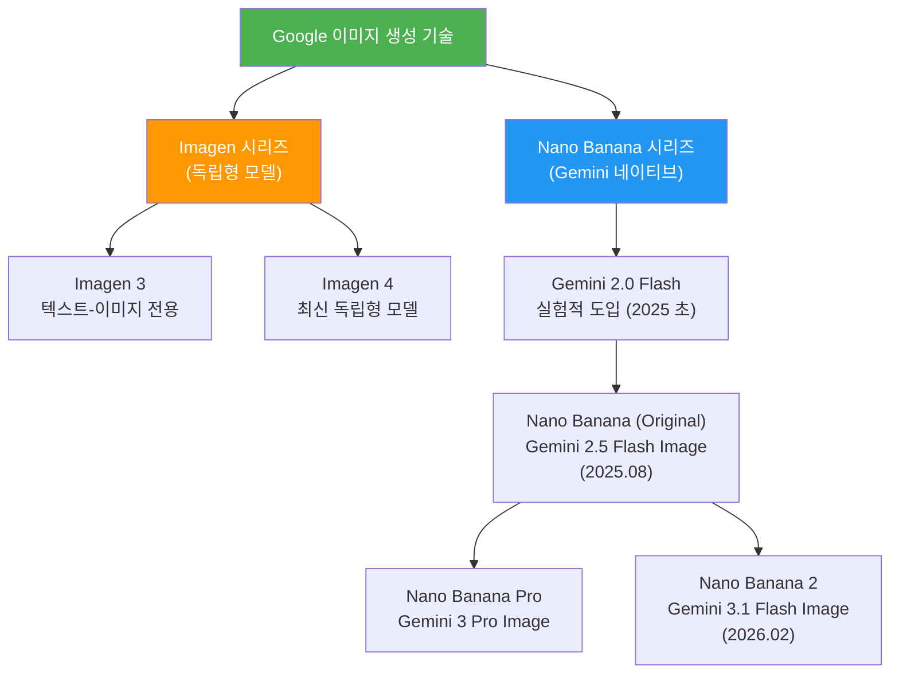
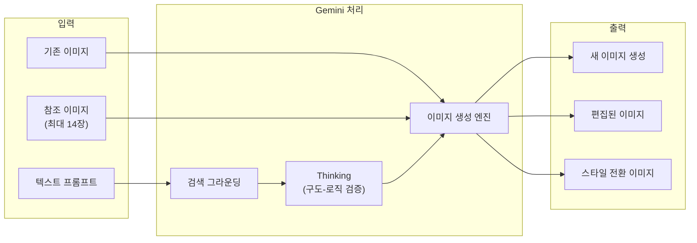
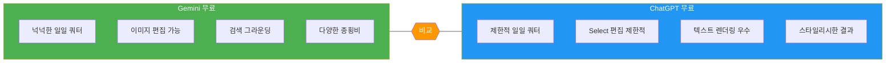
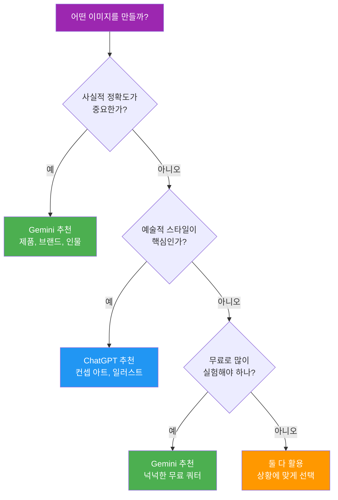

# Gemini 이미지 생성의 특징과 접근법

> Google Gemini의 네이티브 이미지 생성 — 검색 지식과 멀티모달이 만나는 새로운 크리에이티브 도구

## 개요

이 섹션에서는 Google Gemini의 이미지 생성 기능이 어떻게 작동하는지, 어떤 모델이 있는지, 그리고 무료로 어디까지 사용할 수 있는지를 살펴봅니다. 앞서 [주요 플랫폼 비교](01-ch1-ai-이미지-생성-개론/02-02-주요-플랫폼-비교-chatgpt-vs-gemini-vs-midjourney.md)에서 Gemini를 간략히 만나봤다면, 이번에는 본격적으로 Gemini의 이미지 생성 세계에 입문합니다.

**선수 지식**: Ch2에서 다룬 [프롬프트 6요소 프레임워크](02-ch2-프롬프트-구조-마스터/01-01-프롬프트-해부학-6요소-프레임워크.md), Ch3에서 경험한 [ChatGPT 이미지 생성](03-ch3-chatgpt-이미지-생성-실전/01-01-gpt-4o-이미지-생성의-특징과-강점.md) 실습 경험

**학습 목표**:
- Gemini 이미지 생성 모델(Nano Banana 시리즈)의 종류와 특성을 이해한다
- 텍스트→이미지, 이미지 편집, 스타일 전환 기능의 범위를 파악한다
- 무료/유료 사용 범위와 제한을 구분할 수 있다
- ChatGPT 대비 Gemini만의 차별화된 강점을 설명할 수 있다

## 왜 알아야 할까?

Ch3에서 ChatGPT의 이미지 생성을 배웠는데, 왜 또 다른 플랫폼을 배워야 할까요? 비유하자면, 디자이너의 도구 상자에 연필만 있으면 안 되는 것과 같습니다. 연필(ChatGPT)은 자유로운 스케치에 최고지만, 때로는 정밀한 자(Gemini)가 필요한 순간이 있거든요.

Gemini는 Google의 방대한 검색 지식을 기반으로 이미지를 생성합니다. "2024년 파리 올림픽 마스코트 스타일로"라고 요청하면, 실시간 검색 데이터를 활용해 정확한 맥락을 이해할 수 있죠. 이건 다른 이미지 생성 도구에서는 쉽게 만나기 어려운 강점입니다.

또한 Gemini는 무료 사용자에게도 ChatGPT 무료 플랜 대비 훨씬 넉넉한 이미지 생성 쿼터를 제공합니다(2025년 기준). 실험과 학습을 위한 진입 장벽이 상당히 낮은 편이죠. 코딩 경험 없는 디자이너에게 비용 부담 없이 다양한 시도를 할 수 있는 환경은 매우 중요하거든요. 다만 무료 쿼터는 수시로 변동될 수 있으니, 최신 한도는 [Google AI 공식 문서](https://ai.google.dev/gemini-api/docs/image-generation)에서 확인하세요.

## 핵심 개념

### 개념 1: Gemini 이미지 생성 모델의 계보 — Imagen에서 Nano Banana 시리즈까지

> 💡 **비유**: Google의 이미지 생성 모델 진화를 레스토랑에 비유해볼까요? 처음에는 "Imagen"이라는 유명 셰프가 주방에서 혼자 요리했습니다(독립형 모델). 그런데 손님들이 "대화하면서 주문을 수정하고 싶다"고 요청하자, 셰프를 홀(Gemini)로 불러내서 손님과 직접 소통하며 요리하게 만든 거죠. 이것이 바로 "네이티브 이미지 생성"입니다.

Google의 이미지 생성 기술은 크게 두 갈래로 발전해왔습니다.

**첫 번째 갈래: Imagen 시리즈** — 텍스트→이미지 전용 모델입니다. Imagen 3를 거쳐 현재 Imagen 4까지 발전했으며, 순수하게 프롬프트를 입력하면 이미지를 출력하는 방식입니다. 품질은 뛰어나지만, 대화형 수정이나 맥락 이해 능력은 제한적이었습니다.

**두 번째 갈래: Nano Banana 시리즈** — Gemini 모델에 이미지 생성을 "내장"한 네이티브 방식입니다. 2025년 초 Gemini 2.0 Flash에서 처음 실험적으로 시작되었고, 같은 해 8월 Gemini 2.5 Flash Image로 본격화되었습니다. "Nano Banana"는 이 네이티브 이미지 생성 모델군의 총칭이며, 현재 세 가지 개별 모델이 있습니다:

> ⚠️ **참고**: 아래 모델명과 코드명은 2025년 8월 기준 정보입니다. Google은 모델명과 기능을 수시로 업데이트하므로, 최신 정보는 [Google AI 공식 문서](https://ai.google.dev/gemini-api/docs/image-generation)에서 반드시 확인하세요.

| 모델 | 코드명 (2025년 8월 기준) | 특징 | 해상도 |
|------|--------------------------|------|--------|
| Nano Banana (Original) | Gemini 2.5 Flash Image | 시리즈 첫 정식 모델, 균형 잡힌 성능과 안정성 | 1K ~ 4K |
| Nano Banana Pro | Gemini 3 Pro Image | 전문 에셋 제작에 최적화, 고급 추론과 Thinking 모드 지원 | 1K ~ 4K |
| Nano Banana 2 | Gemini 3.1 Flash Image | 속도 최적화, 대량 생성에 유리, 이미지 검색 그라운딩 지원 | 512px ~ 4K |

> 📊 **그림 1**: Google 이미지 생성 모델의 진화 계보

핵심 차이를 한마디로 정리하면, Imagen은 "사진관에 사진을 맡기는 것"이고, Nano Banana 시리즈는 "옆에 앉은 화가와 대화하며 그림을 완성하는 것"입니다. Nano Banana 시리즈의 모델들은 Gemini의 언어 이해력과 세계 지식을 그대로 활용하기 때문에, 복잡한 맥락을 이해하고 대화를 통해 이미지를 반복 수정할 수 있습니다.

### 개념 2: Gemini의 핵심 이미지 생성 기능 — 세 가지 축

> 💡 **비유**: Gemini의 이미지 기능을 미술 수업에 비유하면 이렇습니다. "텍스트→이미지"는 백지에 새로 그리기, "이미지 편집"은 기존 그림을 수정하기, "스타일 전환"은 같은 그림을 수채화에서 유화로 바꾸기입니다.

**1) 텍스트→이미지 생성 (Text-to-Image)**

프롬프트를 입력하면 이미지를 생성합니다. 여기까지는 ChatGPT와 같은데요, Gemini만의 차이점이 있습니다. 바로 **Google 검색 그라운딩(Search Grounding)**입니다. Gemini는 이미지를 생성하기 전에 Google 검색을 통해 실시간 정보를 확인할 수 있습니다. "테슬라 사이버트럭이 서울 강남대로를 달리는 장면"이라고 요청하면, 사이버트럭의 실제 외형과 강남대로의 특징을 검색으로 확인한 뒤 이미지를 생성하는 거죠.

**2) 이미지 편집 (Image Editing)**

기존 이미지를 업로드한 후 자연어로 수정을 요청할 수 있습니다. "배경을 흐리게 해줘", "왼쪽 물체를 제거해줘", "색감을 따뜻하게 바꿔줘" 같은 지시가 가능합니다. ChatGPT의 Select 도구와 비슷하지만, Gemini는 영역을 직접 선택하지 않아도 자연어만으로 편집 대상을 이해합니다.

**3) 스타일 전환 (Style Transfer)**

같은 이미지의 스타일을 완전히 다르게 바꿀 수 있습니다. 사진을 수채화로, 일러스트를 3D 렌더링으로 전환하는 식이죠. 특히 Gemini는 **캐릭터 일관성(Character Consistency)** 기능을 지원하여, 스타일을 바꾸더라도 인물의 특징을 유지할 수 있습니다.

> 📊 **그림 2**: Gemini 이미지 생성의 세 가지 핵심 축

특히 주목할 점은 **Thinking 모드**입니다. Nano Banana Pro 모델은 최종 이미지를 만들기 전에, 내부적으로 최대 2장의 중간 이미지를 먼저 만들어서 구도와 논리를 검증합니다. 마치 화가가 스케치를 먼저 여러 장 그려본 뒤 최종 작품을 완성하는 것과 같죠.

### 개념 3: 무료/유료 사용 범위 — 디자이너를 위한 현실적 가이드

> 💡 **비유**: Gemini의 요금 체계를 뷔페 레스토랑에 비유해볼게요. 무료 뷔페(Free Tier)에서도 꽤 다양한 음식을 맛볼 수 있지만, 프리미엄 코스(AI Pro/Ultra)를 주문하면 셰프의 특별 요리까지 즐길 수 있는 구조입니다.

> ⚠️ **주의**: 아래 수치는 2025년 기준이며, Google은 쿼터와 가격을 수시로 변경합니다. 실제 사용 전 [Google AI 공식 가격 페이지](https://ai.google.dev/pricing)에서 최신 정보를 확인하세요.

**Gemini 앱(gemini.google.com) 기준 (2025년 기준):**

| 등급 | 이미지 쿼터 | 사용 가능 모델 | 비고 |
|------|------------|---------------|------|
| 무료 | 넉넉한 일일 쿼터 | Nano Banana (Original) | 기본 해상도 |
| AI Pro | 더 많은 쿼터 | Nano Banana (Original) + Nano Banana Pro | 고해상도 지원 |
| AI Ultra | 최대 쿼터 | 전체 Nano Banana 시리즈 | 4K, Thinking 모드 |

**API(개발자) 기준:**
- 무료 티어: 일일 요청 제한 있음 (API 및 AI Studio 웹)
- 유료: 이미지 1장당 약 $0.039 수준 (2025년 기준, 변동 가능)

> 📊 **그림 3**: Gemini vs ChatGPT 무료 사용 비교

디자이너 입장에서 이것이 의미하는 바는 명확합니다. **학습과 실험 단계에서는 Gemini의 무료 티어가 상당히 유리합니다.** ChatGPT 무료 플랜 대비 훨씬 많은 이미지를 생성할 수 있어, 프롬프트를 다양하게 실험하고 비교해볼 여유가 충분하거든요.

### 개념 4: ChatGPT 대비 Gemini의 차별적 강점

> 💡 **비유**: ChatGPT와 Gemini의 차이를 카메라에 비유하면, ChatGPT는 감성적인 필름 카메라(스타일리시하고 예술적), Gemini는 기능이 풍부한 디지털 카메라(정확하고 다재다능)입니다. 둘 다 훌륭한 사진을 찍지만, 목적에 따라 선택이 달라지죠.

**Gemini가 앞서는 영역:**

1. **검색 기반 맥락 이해** — "최신 아이폰 디자인 스타일로"라고 하면 실제 최신 모델을 검색해서 반영합니다
2. **사실적이고 일관된 결과** — 얼굴, 제품, 브랜드 소재처럼 정확성이 중요한 작업에 강합니다
3. **생성 속도** — 동일한 프롬프트 기준 ChatGPT보다 눈에 띄게 빠릅니다
4. **넉넉한 무료 쿼터** — ChatGPT 무료 대비 훨씬 여유로운 일일 생성량으로 실험의 자유도가 높습니다
5. **다양한 해상도** — 512px부터 4K까지 용도에 맞는 해상도를 선택할 수 있습니다
6. **참조 이미지 활용** — 최대 14장의 참조 이미지를 조합하여 결과물을 제어할 수 있습니다

**ChatGPT가 앞서는 영역:**

1. **예술적 스타일** — 판타지, 일러스트, 컨셉 아트 등 창의적 표현에서 더 매력적인 결과
2. **텍스트 렌더링** — 이미지 내 글자 품질이 상대적으로 안정적(다만 Gemini도 빠르게 개선 중)
3. **스타일 다양성** — 지브리풍, 픽셀아트 등 특정 아트 스타일 재현에 능숙

> 📊 **그림 4**: 작업 유형별 플랫폼 선택 가이드

> ⚠️ **흔한 오해**: "Gemini는 사람 이미지를 못 만든다"고 알고 계신 분이 많은데요, 이건 2024년 초의 일시적 제한이었습니다. 현재 Nano Banana 2 모델부터는 인물 이미지 생성이 다시 지원됩니다. 다만 유명인이나 실존 인물의 초상은 여전히 제한될 수 있습니다.

## 실습: 적용해보기

### 활동 1: Gemini 앱에서 첫 이미지 생성하기

아래 단계를 따라 Gemini에서 이미지를 직접 생성해보세요.

1. **[gemini.google.com](https://gemini.google.com)** 에 접속하여 Google 계정으로 로그인합니다
2. 채팅창에 다음 프롬프트를 입력합니다: *"A cozy café interior with warm morning light streaming through large windows, watercolor illustration style"*
3. 생성된 이미지를 관찰하며 아래 질문에 답해보세요:
   - 조명의 방향이 프롬프트에서 요청한 대로인가요?
   - 수채화 스타일이 잘 반영되었나요?
   - 전체적인 분위기가 "아늑한" 느낌을 전달하나요?

4. 같은 프롬프트 뒤에 **"change the style to Japanese anime"**를 추가로 입력하여 스타일 전환을 체험합니다
5. 두 결과의 차이를 노트에 기록합니다

### 활동 2: ChatGPT vs Gemini 비교 워크시트

아래 프롬프트를 **ChatGPT와 Gemini 모두에** 입력하고, 결과를 비교해보세요.

| 비교 항목 | 프롬프트 | ChatGPT 결과 | Gemini 결과 |
|-----------|----------|-------------|-------------|
| 사실적 장면 | "서울 남산타워가 보이는 야경, 사진 스타일" | (기록) | (기록) |
| 텍스트 포함 | "OPEN이라고 쓰인 카페 간판, 네온사인" | (기록) | (기록) |
| 추상적 컨셉 | "희망의 감정을 표현한 추상화" | (기록) | (기록) |

**분석 질문:**
- 어떤 유형의 프롬프트에서 각 플랫폼이 더 나은 결과를 보였나요?
- 생성 속도에 차이가 있었나요?
- 같은 프롬프트인데 해석이 다른 부분이 있었다면, 왜 그런 차이가 생겼을까요?

### 토론 질문

- Gemini의 검색 그라운딩 기능이 "정확한 정보를 반영한 이미지"를 만들어주는 것은 장점이지만, 반대로 **창의적 자유도를 제한**할 수 있을까요? 어떤 경우에 검색 기반 맥락 이해가 오히려 방해가 될 수 있을지 생각해보세요.

## 더 깊이 알아보기

### Gemini 이미지 생성의 탄생 스토리 — "실패에서 배운 교훈"

2024년 2월, Google은 Gemini(당시 Bard)의 이미지 생성 기능으로 큰 논란을 겪었습니다. 역사적 인물을 생성할 때 과도한 다양성 보정이 적용되어, 역사적 사실과 맞지 않는 이미지가 대량으로 생성된 거죠. 예를 들어, 미국 건국의 아버지를 생성하면 역사적 맥락과 동떨어진 결과물이 나왔습니다.

Google은 이 사건 이후 인물 이미지 생성을 일시 중단하고, 안전 시스템을 전면 재설계했습니다. 이 "실패의 경험"이 오히려 Gemini의 이미지 생성을 더 신중하고 정교하게 만든 계기가 되었는데요, 현재의 **SynthID 워터마크** 시스템과 **콘텐츠 안전 필터**는 이 시기의 교훈에서 비롯된 것입니다.

### "Nano Banana"라는 이름의 유래

Google의 이미지 생성 모델이 "Nano Banana"라는 재미있는 코드명을 갖게 된 배경도 흥미롭습니다. Google AI 팀은 내부 프로젝트에 과일 이름을 붙이는 전통이 있었는데, 이미지 생성 모델이 "작지만(Nano) 눈에 띄는(Banana)" 결과를 만든다는 의미에서 이 이름이 붙었다고 합니다. 이 코드명은 나중에 공식 API 문서에도 그대로 사용되면서, Google의 유쾌한 네이밍 문화를 보여주는 사례가 되었죠.

> 💡 **알고 계셨나요?**: Gemini가 생성하는 모든 이미지에는 **SynthID**라는 보이지 않는 디지털 워터마크가 삽입됩니다. 육안으로는 전혀 보이지 않지만, Google의 도구로 스캔하면 AI가 생성한 이미지인지 확인할 수 있습니다. 이는 AI 생성 콘텐츠의 투명성을 위한 Google의 노력 중 하나입니다.

## 흔한 오해와 팁

> ⚠️ **흔한 오해**: "Gemini는 Imagen과 같은 모델이다" — 아닙니다. Imagen은 텍스트→이미지 전용 독립 모델이고, Gemini의 Nano Banana 시리즈는 대화형 AI에 이미지 생성이 내장된 완전히 다른 아키텍처입니다. API에서 둘 다 사용할 수 있지만, 대화형 편집과 맥락 이해는 Nano Banana 시리즈만 가능합니다.

> 💡 **알고 계셨나요?**: Nano Banana 2(Gemini 3.1 Flash Image, 2025년 8월 기준)는 **이미지 검색 그라운딩(Image Search Grounding)** 기능을 지원합니다. 텍스트뿐 아니라 Google 이미지 검색 결과를 참조하여 이미지를 생성할 수 있다는 뜻이죠. 다만 이 기능 사용 시 원본 이미지 출처를 표기해야 합니다.

> 🔥 **실무 팁**: Gemini에서 이미지를 생성할 때 **한 번에 완벽한 결과를 기대하지 마세요.** Gemini의 진짜 강점은 대화형 수정입니다. 먼저 대략적인 프롬프트로 이미지를 생성한 뒤, "배경을 좀 더 밝게", "인물의 표정을 웃는 얼굴로", "전체적으로 따뜻한 톤으로" 같은 후속 지시로 점진적으로 완성도를 높이세요. 이런 반복 수정(iteration)이 가능한 것이 Gemini의 핵심 장점입니다.

> 🔥 **실무 팁**: Gemini에서 참조 이미지를 활용할 때, **최대 14장까지** 첨부할 수 있습니다 (Flash 모델 기준 객체 10장 + 캐릭터 4장). 무드보드의 여러 이미지를 한꺼번에 업로드하고 "이 이미지들의 색감과 분위기를 조합해서 새 이미지를 만들어줘"라고 요청하면, 놀라울 정도로 잘 조합된 결과를 얻을 수 있습니다.

## 핵심 정리

| 개념 | 설명 |
|------|------|
| Nano Banana 시리즈 | Gemini에 내장된 네이티브 이미지 생성 모델군의 총칭. Original(균형), Pro(품질), 2(속도) 세 모델로 구성 |
| Nano Banana (Original) | 시리즈 첫 정식 모델(Gemini 2.5 Flash Image). 균형 잡힌 성능, 2025년 8월 출시 |
| Nano Banana Pro | 전문 에셋과 고급 추론에 최적화된 모델(Gemini 3 Pro Image). Thinking 모드 지원 |
| Nano Banana 2 | 속도와 대량 생성에 최적화된 모델(Gemini 3.1 Flash Image). 이미지 검색 그라운딩 지원 |
| 검색 그라운딩 | Google 검색을 통해 실시간 정보를 확인한 뒤 이미지를 생성하는 Gemini만의 기능 |
| Thinking 모드 | 최종 이미지 전에 중간 이미지를 생성하여 구도와 논리를 검증하는 추론 과정 |
| 무료 쿼터 | Gemini 앱 기준 ChatGPT 무료 대비 훨씬 넉넉한 일일 생성 쿼터 (정확한 수치는 수시 변동) |
| 참조 이미지 | 최대 14장의 이미지를 조합하여 결과물을 제어 가능 |
| SynthID 워터마크 | 모든 생성 이미지에 삽입되는 보이지 않는 디지털 워터마크 |
| Gemini 강점 | 사실적 정확도, 빠른 속도, 넉넉한 무료 쿼터, 대화형 편집 |
| ChatGPT 강점 | 예술적 스타일, 텍스트 렌더링, 창의적 표현력 |

## 다음 섹션 미리보기

Gemini의 전체적인 특징과 접근법을 이해했으니, 다음 섹션 [고품질 이미지 생성과 스타일 전환](04-ch4-gemini-이미지-생성-실전/02-02-고품질-이미지-생성과-스타일-전환.md)에서는 실제로 Gemini를 사용하여 고해상도 이미지를 생성하고, 다양한 스타일 사이를 자유롭게 넘나드는 테크닉을 본격적으로 다룹니다. 해상도 선택 전략부터 참조 이미지를 활용한 스타일 컨트롤까지, 실무에 바로 적용할 수 있는 기법들을 익혀볼 거예요.

## 참고 자료

- [Google Gemini API — Image Generation (공식 문서)](https://ai.google.dev/gemini-api/docs/image-generation) - Nano Banana 시리즈의 최신 모델명, 기능, 해상도, API 사용법을 포함한 공식 기술 문서. 모델명 변경 시 이 문서에서 확인하세요.
- [Introducing Gemini 2.5 Flash Image (Google Developers Blog)](https://developers.googleblog.com/introducing-gemini-2-5-flash-image/) - Nano Banana (Original) 모델의 출시 배경과 핵심 기능을 소개하는 공식 블로그 포스트
- [ChatGPT vs Gemini Native Image Generation (Beebom)](https://beebom.com/chatgpt-vs-gemini-native-image-generation/) - ChatGPT와 Gemini의 이미지 생성 기능을 실제 비교 테스트한 상세 리뷰
- [Gemini Image Generation Free Limits 2026 (LaoZhang AI)](https://blog.laozhang.ai/en/posts/gemini-image-generation-free-limit-2026/) - 모델별, 티어별 무료 사용 한도를 정리한 실용적 가이드
- [AI Image Creation: ChatGPT vs Gemini vs DALL·E vs Grok (DEV Community)](https://dev.to/dkechag/ai-image-creation-chatgpt-vs-gemini-vs-dalle-vs-grok-558e) - 주요 AI 이미지 생성 플랫폼의 강점과 약점을 비교 분석한 개발자 커뮤니티 글

---
### 🔗 Related Sessions
- [txt2img](01-ch1-ai-이미지-생성-개론/01-01-생성형-ai가-바꾸는-디자인-워크플로우.md) (prerequisite)
