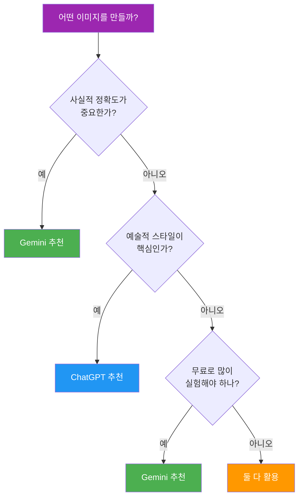

# Gemini 이미지 생성의 특징과 접근법

> 검색 지식 + 빠른 속도 + 참조 이미지 — Gemini로 실전 이미지 만들기

## 개요

Google Gemini는 검색 엔진의 실시간 지식을 이미지 생성에 직접 활용하는 유일한 플랫폼입니다. Ch3에서 ChatGPT의 이미지 생성을 익혔다면, 이번에는 Gemini만의 차별화된 강점을 프롬프트와 함께 체험합니다. 두 도구를 상황에 맞게 쓸 수 있어야 실무 대응력이 높아집니다.

## Gemini의 3가지 핵심 강점

### 1. 검색 그라운딩 — 실시간 정보를 반영한 이미지

Gemini는 이미지를 생성하기 전에 Google 검색으로 실시간 정보를 확인합니다. "최신 아이폰 디자인"처럼 시점에 따라 달라지는 주제도 정확하게 반영할 수 있죠.

```
테슬라 사이버트럭이 서울 강남대로를 달리는 장면, 야간, 네온 불빛 반사, 사진 스타일
```


```
2024년 파리 올림픽 마스코트 캐릭터가 에펠탑 앞에서 포즈를 취하는 일러스트
```


ChatGPT는 학습 데이터에 의존하지만, Gemini는 검색을 거치기 때문에 최신 제품, 트렌드, 실존 장소의 정확도가 높습니다.

### 2. 빠른 생성 속도

동일한 프롬프트 기준, Gemini는 ChatGPT보다 체감상 2~3배 빠릅니다. 여러 변형을 빠르게 비교해야 할 때 큰 장점이죠.

```
미니멀한 카페 로고, 커피잔 아이콘, 흰 배경, 벡터 스타일
```


빠른 속도 덕분에 "프롬프트를 조금씩 바꿔가며 10개 만들어보기" 같은 실험이 부담 없습니다.

### 3. 참조 이미지 활용

Gemini는 최대 14장의 참조 이미지를 업로드하여 스타일, 색감, 구도를 제어할 수 있습니다.

```
[이미지 첨부 후]
이 무드보드 이미지들의 색감과 분위기를 조합해서, 숲속 오두막의 저녁 풍경을 만들어줘. 따뜻한 조명, 수채화 스타일.
```


```
[인물 사진 첨부 후]
이 인물의 특징을 유지하면서 스튜디오 지브리 애니메이션 스타일로 바꿔줘
```


## Gemini에서 첫 이미지 만들기

[gemini.google.com](https://gemini.google.com)에 접속하여 바로 시작할 수 있습니다.

**Step 1: 기본 이미지 생성**

```
A cozy café interior with warm morning light streaming through large windows, watercolor illustration style
```


**Step 2: 대화형 수정 (Gemini의 핵심 강점)**

생성된 이미지가 마음에 안 드는 부분이 있다면, 바로 이어서 수정을 요청하세요.

```
배경을 좀 더 밝게 해주고, 창밖에 비 오는 장면을 추가해줘
```


**Step 3: 스타일 전환**

```
같은 장면을 일본 애니메이션 스타일로 다시 그려줘
```


**Step 4: 검색 그라운딩 활용**

```
이 카페를 서울 성수동의 실제 카페 인테리어 트렌드에 맞춰 리디자인해줘
```


> 💡 한 번에 완벽한 결과를 기대하지 마세요. Gemini의 진짜 강점은 이런 **대화형 반복 수정**입니다.

## ChatGPT vs Gemini 비교

### 강점 비교표

| 영역 | Gemini | ChatGPT |
|------|--------|---------|
| 사실적 정확도 | 검색 그라운딩으로 최신 정보 반영 | 학습 데이터 기반 |
| 생성 속도 | 빠름 | 상대적으로 느림 |
| 무료 쿼터 | 넉넉함 | 제한적 |
| 참조 이미지 | 최대 14장 조합 | 1장 참조 |
| 예술적 스타일 | 보통 | 컨셉 아트, 일러스트에 강함 |
| 텍스트 렌더링 | 개선 중 | 상대적으로 안정적 |

### 같은 프롬프트, 다른 결과

아래 프롬프트를 양쪽에 모두 입력해서 차이를 직접 확인해보세요.

**비교 1: 사실적 장면**
```
서울 남산타워가 보이는 야경, 한강 위 다리 포함, 시네마틱 사진 스타일
```

**비교 2: 텍스트 포함 이미지**
```
"OPEN"이라고 쓰인 빈티지 카페 간판, 네온사인, 밤 배경
```

**비교 3: 추상적 컨셉**
```
희망과 새로운 시작을 표현한 추상화, 파스텔 컬러, 캔버스 텍스처
```

> 일반적으로 비교 1은 Gemini가, 비교 3은 ChatGPT가 더 나은 결과를 보여줍니다. 비교 2는 양쪽 다 시도해볼 가치가 있습니다.

### 플랫폼 선택 플로차트



## 실습

아래 프롬프트를 Gemini에서 순서대로 실행하고, 각 단계의 결과를 저장하세요.

**과제 1: 검색 그라운딩 체험**

```
최신 맥북 프로가 나무 책상 위에 놓여 있고, 화면에 코드가 보이는 장면, 자연광, 미니멀 인테리어
```

생성 후 이어서:

```
책상 위에 커피잔과 에어팟을 추가해줘
```

**과제 2: 스타일 연속 전환**

```
숲속 오솔길, 가을 단풍, 사진 스타일
```

생성 후 차례로 스타일을 전환해보세요:

```
같은 장면을 유화 스타일로 바꿔줘
```

```
이번에는 픽셀아트 스타일로 바꿔줘
```

세 결과를 나란히 비교하며, 어떤 요소가 유지되고 어떤 요소가 달라지는지 기록하세요.

## 팁과 주의사항

> 🔥 **대화형 수정을 적극 활용하세요.** 처음부터 완벽한 프롬프트를 쓰려고 하지 말고, 간단하게 시작한 뒤 "배경을 밝게", "톤을 따뜻하게" 같은 후속 지시로 다듬는 것이 Gemini에서 가장 효율적인 워크플로우입니다.

> 🔥 **참조 이미지는 무드보드처럼 활용하세요.** 색감, 구도, 분위기를 각각 다른 이미지로 업로드하고 "이 이미지들의 느낌을 조합해서"라고 요청하면 효과적입니다.

> ⚠️ **유명인/실존 인물 초상은 제한될 수 있습니다.** 일반 인물 이미지는 생성 가능하지만, 특정 인물은 안전 필터에 의해 거부될 수 있습니다.

> ⚠️ **무료 쿼터는 수시로 변동됩니다.** 최신 한도는 [Google AI 공식 문서](https://ai.google.dev/gemini-api/docs/image-generation)에서 확인하세요.

## 핵심 정리

| 개념 | 핵심 |
|------|------|
| 검색 그라운딩 | Google 검색으로 실시간 정보를 확인한 뒤 이미지 생성 |
| 대화형 편집 | 자연어로 후속 수정 지시 가능 — Gemini의 핵심 워크플로우 |
| 참조 이미지 | 최대 14장 업로드하여 스타일/색감/구도 제어 |
| Gemini 강점 | 사실적 정확도, 빠른 속도, 넉넉한 무료 쿼터 |
| ChatGPT 강점 | 예술적 스타일, 텍스트 렌더링, 창의적 표현 |
| 사용 전략 | 정확도/속도 중심이면 Gemini, 아트 스타일 중심이면 ChatGPT |

## 다음 섹션 미리보기

Gemini의 특징과 기본 사용법을 익혔으니, 다음 섹션 [고품질 이미지 생성과 스타일 전환](04-ch4-gemini-이미지-생성-실전/02-02-고품질-이미지-생성과-스타일-전환.md)에서는 해상도 선택 전략부터 참조 이미지를 활용한 고급 스타일 컨트롤까지, 실무에 바로 적용할 수 있는 테크닉을 다룹니다.
