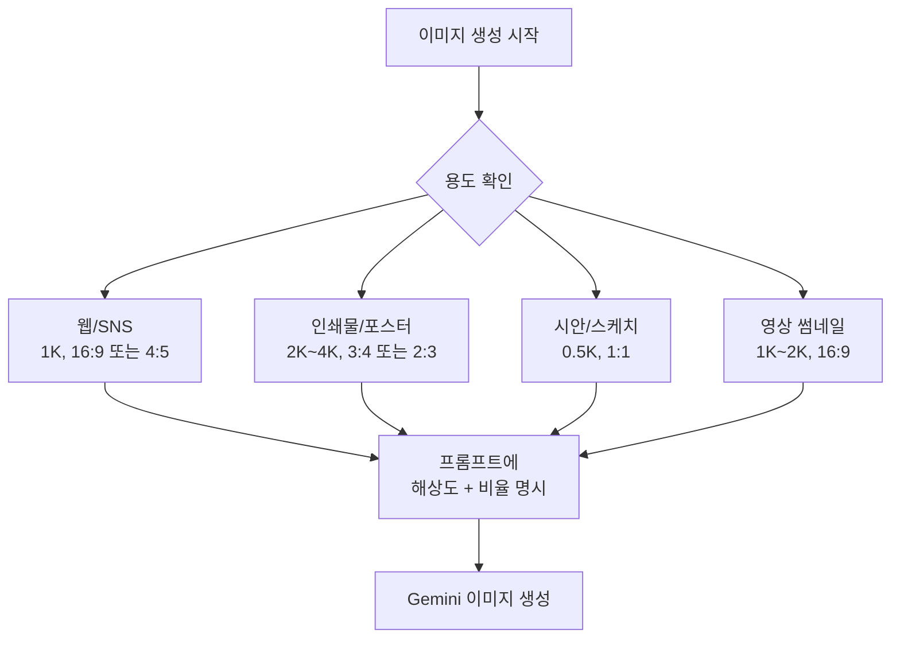
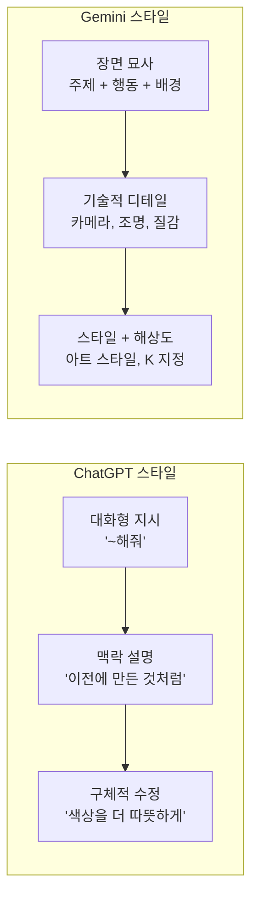
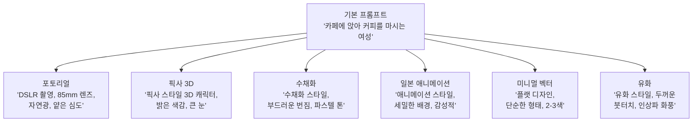
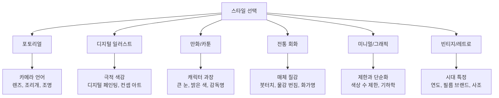
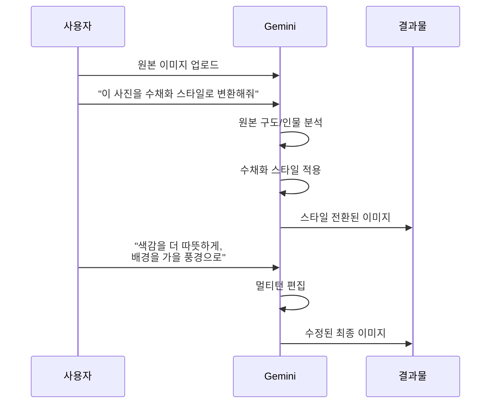
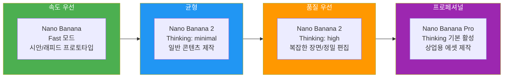

# 고품질 이미지 생성과 스타일 전환

> Gemini의 Nano Banana 모델로 고해상도 이미지를 만들고, 포토리얼에서 만화까지 자유자재로 스타일을 전환하는 실전 기법을 익힙니다.

## 개요

이 섹션에서는 Gemini의 이미지 생성 품질을 극대화하는 프롬프트 전략과, 하나의 주제를 다양한 아트 스타일로 변환하는 테크닉을 배웁니다. 같은 장면이라도 "어떻게 묘사하느냐"에 따라 사진 같은 결과물부터 픽사 스타일 캐릭터까지 완전히 다른 비주얼이 탄생하거든요.

**선수 지식**: [Gemini 이미지 생성의 특징과 접근법](04-ch4-gemini-이미지-생성-실전/01-01-gemini-이미지-생성의-특징과-접근법.md)에서 배운 Nano Banana 모델 종류, Thinking 모드, 검색 그라운딩 개념
**학습 목표**:
- Gemini에서 해상도와 종횡비를 제어하여 고품질 이미지를 생성할 수 있다
- 포토리얼, 일러스트, 만화, 수채화 등 주요 스타일별 프롬프트 패턴을 구사할 수 있다
- 참조 이미지를 활용한 스타일 전환 워크플로우를 실행할 수 있다
- [ChatGPT의 스타일 표현](03-ch3-chatgpt-이미지-생성-실전/03-03-스타일-표현과-고급-프롬프트-기법.md)과 Gemini의 스타일 표현력 차이를 비교 분석할 수 있다

## 왜 알아야 할까?

디자이너에게 "스타일 전환"은 일상입니다. 클라이언트가 "이 제품 사진을 수채화 느낌 일러스트로 바꿔주세요"라고 요청하거나, 같은 캐릭터를 포스터용 포토리얼 버전과 SNS용 만화 버전으로 만들어야 하는 상황이 수시로 생기죠. 예전에는 각 스타일마다 전문 아티스트를 섭외하거나 직접 수십 시간을 투자해야 했지만, Gemini를 활용하면 프롬프트 몇 줄만으로 스타일을 자유롭게 전환할 수 있습니다.

특히 Gemini의 Nano Banana 2는 최대 4K 해상도를 지원하면서도 빠른 생성 속도를 유지합니다. 무료 사용자도 고품질 이미지를 충분히 활용할 수 있다는 점에서, 프리랜서 디자이너나 1인 크리에이터에게 특히 강력한 도구인데요. [프롬프트 해부학 — 6요소 프레임워크](02-ch2-프롬프트-구조-마스터/01-01-프롬프트-해부학-6요소-프레임워크.md)에서 배운 구조화 전략을 Gemini에 최적화하는 방법을 함께 알아보겠습니다. 또한 [Ch3에서 익힌 ChatGPT의 스타일 표현 기법](03-ch3-chatgpt-이미지-생성-실전/03-03-스타일-표현과-고급-프롬프트-기법.md)과 비교하면, 두 도구의 장단점을 더 명확히 파악할 수 있습니다.

## 핵심 개념

### 개념 1: 해상도와 종횡비 제어 — 품질의 첫 번째 열쇠

> 💡 **비유**: 해상도는 캔버스의 "촘촘한 정도"와 같습니다. 같은 크기의 캔버스에 100개의 점을 찍는 것과 10,000개의 점을 찍는 것 — 당연히 점이 많을수록 디테일이 살아나죠. Gemini의 해상도 설정은 이 점의 밀도를 결정하는 다이얼입니다.

Gemini의 Nano Banana 모델들은 다양한 해상도를 지원합니다. 기본값은 1K이지만, 용도에 따라 적절한 해상도를 선택하는 것이 중요합니다.

| 해상도 | 용도 | 지원 모델 |
|--------|------|-----------|
| 512px (0.5K) | 빠른 시안 확인, 썸네일 | Nano Banana 2 전용 |
| 1K | 웹용 이미지, SNS 콘텐츠 | 전 모델 |
| 2K | 인쇄물, 프레젠테이션 | 전 모델 |
| 4K | 대형 포스터, 고품질 인쇄 | 전 모델 |

해상도를 프롬프트에서 지정할 때는 "1K", "2K", "4K" 등으로 표기하면 됩니다. Gemini는 자연어 모델이므로 대소문자 표기("1K"든 "1k"든)에 크게 민감하지 않지만, 관례적으로 "K"를 대문자로 쓰는 것이 일반적입니다.

종횡비도 풍부하게 지원됩니다. 인스타그램 피드용 4:5, 유튜브 썸네일용 16:9, 핀터레스트용 2:3, 시네마틱 와이드 21:9까지 — 플랫폼별 최적 비율을 바로 적용할 수 있습니다.

> 📊 **그림 1**: Gemini 해상도와 종횡비 선택 플로우

**프롬프트 작성 패턴**: 해상도와 종횡비는 프롬프트 끝부분에 자연스럽게 포함시킵니다.

예시: *"도쿄 네온 거리의 야경, 비에 젖은 아스팔트에 반사되는 불빛, 시네마틱 와이드 구도, 21:9 비율, 4K 해상도로 생성해줘"*

> ⚠️ **흔한 오해**: "해상도가 높을수록 무조건 좋다"고 생각하기 쉽지만, SNS용 이미지를 4K로 생성하면 생성 시간만 길어질 뿐 업로드 시 플랫폼이 자동 압축합니다. 용도에 맞는 해상도를 선택하는 것이 효율적이에요.

### 개념 2: 프롬프트 구조 최적화 — Gemini가 좋아하는 말하기 방식

> 💡 **비유**: Gemini에게 프롬프트를 주는 건, 영화 감독이 촬영팀에게 씬을 설명하는 것과 비슷합니다. "예쁜 풍경 찍어줘"보다 "해질녘 바닷가, 황금빛 역광, 파도가 부서지는 순간, 와이드 앵글로"라고 말해야 원하는 장면이 나오듯, Gemini도 구체적 묘사에 훨씬 잘 반응합니다.

Google 공식 문서에서 권장하는 Gemini 프롬프트의 핵심 공식은 이것입니다:

**`<주제> <행동/상태> <장면/배경>` → 세부 디테일 확장**

[6요소 프레임워크](02-ch2-프롬프트-구조-마스터/01-01-프롬프트-해부학-6요소-프레임워크.md)를 Gemini에 맞게 적용하면 더욱 강력해지는데요. Gemini는 키워드 나열보다 **자연어 서술**에 강하다는 점이 ChatGPT와의 가장 큰 차이입니다. [ChatGPT의 스타일 표현과 고급 프롬프트 기법](03-ch3-chatgpt-이미지-생성-실전/03-03-스타일-표현과-고급-프롬프트-기법.md)에서 배웠듯 ChatGPT는 대화형 수정에 강한 반면, Gemini는 첫 프롬프트의 장면 묘사 완성도가 결과물 품질을 크게 좌우합니다.

> 📊 **그림 2**: ChatGPT vs Gemini 프롬프트 스타일 비교

Gemini에서 특히 효과적인 프롬프트 전략 세 가지를 정리하면:

**1) 장면 묘사형**: 키워드를 나열하지 말고, 하나의 장면을 글로 그리세요.
- 약한 프롬프트: *"고양이, 창문, 햇빛, 아늑한"*
- 강한 프롬프트: *"오후의 따뜻한 햇빛이 나무 창틀을 통해 쏟아지는 방 안에서, 털이 복슬복슬한 주황색 고양이가 쿠션 위에 웅크려 낮잠을 자고 있다"*

**2) 카메라 언어 활용**: 포토리얼 결과물을 원한다면 사진 전문 용어를 섞으세요.
- *"35mm 렌즈, f/1.4 얕은 심도, 골든아워 자연광, 약간의 필름 그레인"*

**3) 검색 그라운딩 활용**: Gemini만의 강점! 실제 장소, 인물, 이벤트를 언급하면 검색 기반으로 더 정확한 이미지를 생성합니다.
- *"2025년 도쿄 시부야 스크램블 교차로의 야경"* → Gemini가 실제 위치 정보를 참고하여 현실적인 결과물 생성

### 개념 3: 스타일 키워드 마스터 — 한마디로 분위기를 바꾸는 마법

> 💡 **비유**: 스타일 키워드는 사진 앱의 "필터"와 비슷하지만, 훨씬 더 강력합니다. 인스타그램 필터가 색감만 바꾼다면, Gemini의 스타일 키워드는 사진을 완전히 다른 매체 — 유화, 수채화, 만화, 3D 렌더링 — 로 변환시킵니다.

Gemini에서 효과적으로 작동하는 주요 스타일 카테고리와 핵심 키워드를 정리했습니다:

> 📊 **그림 3**: 하나의 주제, 여섯 가지 스타일 전환 구조

이제 각 스타일 카테고리를 실전 프롬프트 예시와 함께 하나씩 살펴보겠습니다.

---

#### 스타일 1: 포토리얼리즘 — 실제 사진과 구분 불가

**핵심 키워드**: "사진처럼 사실적인", "DSLR로 촬영한", "하이퍼리얼리스틱", "포토그래피"

포토리얼은 카메라 언어가 핵심입니다. 렌즈 종류, 조리개값, 조명 조건을 구체적으로 묘사할수록 결과물이 실제 사진에 가까워집니다.

**실전 프롬프트 예시**:
*"카페 창가에 앉아 라떼를 마시는 30대 여성, Canon EOS R5로 촬영, 85mm 인물 렌즈, f/1.8 얕은 심도, 오후 3시 창을 통해 들어오는 따뜻한 자연광, 배경 보케가 아름다운 사진, 4K"*

**포인트**: 카메라 모델명(Canon, Sony 등), 구체적 렌즈 초점거리, 조리개 수치를 포함하면 Gemini가 해당 카메라 특유의 색감과 심도를 반영합니다.

---

#### 스타일 2: 디지털 일러스트 — 게임/영화 컨셉 아트

**핵심 키워드**: "디지털 아트", "컨셉 아트 스타일", "세밀한 일러스트", "디지털 페인팅"

디지털 일러스트는 포토리얼보다 약간 과장되고 드라마틱한 분위기가 특징입니다. 색감이 더 선명하고, 조명과 그림자가 극적으로 표현되죠.

**실전 프롬프트 예시**:
*"카페 창가에 앉아 라떼를 마시는 여성, 디지털 컨셉 아트 스타일, 따뜻한 조명이 인물을 감싸고 배경은 차가운 블루 톤으로 대비, 세밀한 디테일의 디지털 페인팅, ArtStation 트렌딩 스타일, 2K"*

**포인트**: "ArtStation 스타일", "컨셉 아트"라는 키워드가 고품질 디지털 일러스트의 느낌을 잡아줍니다.

---

#### 스타일 3: 만화/카툰 — 귀엽고 친근한 캐릭터

**핵심 키워드**: "픽사 스타일 3D", "일본 애니메이션 스타일", "카툰 일러스트", "치비 캐릭터"

만화 스타일은 인물의 특징을 어떻게 과장할지 명시하는 것이 중요합니다. 픽사 3D, 일본 애니, 미국 카툰 등 하위 장르에 따라 표현이 크게 달라집니다.

**실전 프롬프트 예시 — 픽사 3D**:
*"카페에서 라떼를 마시는 여성 캐릭터, 픽사 스타일 3D 애니메이션, 큰 반짝이는 눈, 과장된 표정, 부드러운 피부 질감, 밝고 채도 높은 색감, 디즈니 느낌의 따뜻한 조명, 2K"*

**실전 프롬프트 예시 — 일본 애니메이션**:
*"카페 창가에 앉아 라떼를 마시는 여성, 일본 애니메이션 스타일, 섬세한 눈동자 표현, 바람에 살짝 흩날리는 머리카락, 배경은 수채화처럼 부드럽게 처리, 감성적인 오후 분위기, 마코토 신카이 풍"*

**포인트**: 특정 감독이나 스튜디오 이름(픽사, 지브리, 신카이)을 언급하면 해당 스타일의 특징을 정확하게 반영합니다.

---

#### 스타일 4: 전통 회화 — 고전 미술의 질감과 깊이

**핵심 키워드**: "유화 스타일", "수채화", "인상파 화풍", "르네상스 화풍", "동양화"

전통 회화 스타일에서는 매체(유화, 수채화, 먹)의 물리적 특성을 묘사하면 효과적입니다. 붓터치의 방향, 물감의 질감, 캔버스의 재질감까지 포함해보세요.

**실전 프롬프트 예시 — 유화**:
*"카페에 앉아 커피를 마시는 여성, 유화 스타일로 그린 초상화, 두껍고 질감이 느껴지는 임파스토 기법의 붓터치, 렘브란트식 명암 대비, 따뜻한 갈색과 황금빛 색조, 캔버스 질감이 느껴지는, 2K"*

**실전 프롬프트 예시 — 수채화**:
*"카페 창가의 여성, 수채화 스타일, 물감이 종이 위에서 자연스럽게 번지는 느낌, 여백의 미를 살린 구도, 파스텔 톤의 부드러운 색감, 연필 스케치 선이 살짝 비치는"*

**포인트**: 화가 이름(모네, 렘브란트, 고흐)이나 기법 용어(임파스토, 점묘법, 글레이징)를 사용하면 해당 스타일의 특성이 더 뚜렷하게 나타납니다.

---

#### 스타일 5: 미니멀/그래픽 — 깔끔한 디자인

**핵심 키워드**: "플랫 디자인", "미니멀리스트", "벡터 일러스트", "그래픽 디자인"

미니멀 스타일은 "빼는 것"이 핵심입니다. 사용할 색상의 수, 형태의 단순함을 명시적으로 지정하세요.

**실전 프롬프트 예시**:
*"카페에서 커피를 마시는 여성의 실루엣, 미니멀리스트 플랫 디자인, 3가지 색상만 사용(코랄 핑크, 크림 화이트, 차콜 그레이), 기하학적으로 단순화된 형태, 그림자 없이 깔끔한 벡터 스타일, 로고나 앱 아이콘에 어울리는"*

**포인트**: 색상 수를 제한하고("2-3색만 사용"), 구체적 색상명을 지정하면 정말 미니멀한 결과물을 얻을 수 있습니다. "벡터", "SVG 스타일" 같은 키워드도 효과적입니다.

---

#### 스타일 6: 빈티지/레트로 — 시대적 감성

**핵심 키워드**: "1970년대 필름 사진", "레트로 포스터", "아르데코", "빈티지 일러스트"

빈티지 스타일에서는 **특정 시대**를 명시하는 것이 비결입니다. "레트로"라고만 쓰면 모호하지만, "1960년대 미국 다이너"라고 쓰면 색감, 타이포그래피, 분위기가 한꺼번에 결정됩니다.

**실전 프롬프트 예시 — 빈티지 필름 사진**:
*"카페에서 커피를 마시는 여성, 1970년대 코닥 필름으로 촬영한 듯한 빈티지 사진, 따뜻한 황변 색조, 약간의 필름 그레인과 빛 바랜 느낌, 가장자리가 살짝 비네팅된, 추억 속 한 장면 같은"*

**실전 프롬프트 예시 — 레트로 포스터**:
*"카페에서 커피를 마시는 여성, 1950년대 미국 핀업 스타일 광고 포스터, 굵은 윤곽선, 채도 높은 원색, 레트로 타이포그래피가 포함된 구도, 빈티지 질감의 종이 텍스처"*

**포인트**: 특정 연도, 필름 브랜드(코닥, 후지필름), 시대적 디자인 사조(아르데코, 아르누보, 팝아트)를 조합하면 시대 고증이 정확한 빈티지 결과물을 얻을 수 있습니다.

---

> 📊 **그림 4**: 6가지 스타일별 핵심 키워드와 프롬프트 전략 맵

스타일 키워드는 프롬프트의 **앞부분 또는 뒷부분**에 배치할 수 있는데, Gemini에서는 뒷부분에 넣는 것이 더 안정적인 결과를 보여줍니다.

**스타일 전환 프롬프트 패턴**:
*"[장면 묘사], [스타일 키워드], [기술적 디테일], [해상도]"*

예시: *"비가 내리는 도쿄 골목길에서 우산을 쓴 사람이 걸어가고 있다, 우키요에 목판화 스타일, 선명한 윤곽선과 평면적 색채, 전통적인 일본 미술 느낌, 2K"*

### 개념 4: 참조 이미지를 활용한 스타일 전환

> 💡 **비유**: 참조 이미지는 미술 수업에서 선생님이 "이런 느낌으로 그려봐"라고 보여주는 샘플 작품과 같습니다. 말로 설명하기 어려운 특정 색감, 질감, 분위기를 이미지 하나로 정확하게 전달할 수 있죠.

Gemini는 텍스트 프롬프트만으로도 강력하지만, **참조 이미지와 텍스트를 결합**하면 스타일 전환의 정밀도가 크게 올라갑니다. [이전 섹션](04-ch4-gemini-이미지-생성-실전/01-01-gemini-이미지-생성의-특징과-접근법.md)에서 배웠듯, Nano Banana 2는 최대 14개의 참조 이미지(객체 10개 + 캐릭터 4~5개)를 동시에 처리할 수 있습니다.

> 📊 **그림 5**: 참조 이미지 기반 스타일 전환 워크플로우

**참조 이미지 활용 시나리오**:

**시나리오 A — 내 사진을 아트워크로**: 자신의 사진을 업로드하고 "이 사진을 스튜디오 지브리 애니메이션 스타일로 변환해줘. 배경은 유지하되, 인물은 애니메이션 캐릭터처럼 표현해줘"

**시나리오 B — 스타일 레퍼런스 전달**: 좋아하는 아티스트의 작품을 참조로 올리고 "이 그림의 색감과 붓터치 스타일로 [새로운 장면]을 그려줘"

**시나리오 C — 분할 비교 이미지**: "왼쪽은 사실적 사진, 오른쪽은 픽사 스타일 3D 캐릭터로 같은 인물을 나란히 보여줘" — Nano Banana 2에서 큰 인기를 끌고 있는 트렌드

> 🔥 **실무 팁**: 참조 이미지의 스타일만 가져오고 내용은 완전히 다르게 하고 싶다면, "이 이미지의 색감과 텍스처 느낌만 참조하여 [완전히 다른 장면]을 그려줘"처럼 명시적으로 구분해주세요. 그렇지 않으면 Gemini가 참조 이미지의 내용까지 재현하려 할 수 있습니다.

### 개념 5: Thinking 모드와 모델 선택 — 품질 극대화 전략

> 💡 **비유**: 모델 선택은 레스토랑에서 코스를 고르는 것과 비슷합니다. 패스트푸드(Nano Banana — 빠르고 가벼움), 캐주얼 다이닝(Nano Banana 2 — 속도와 품질의 균형), 파인 다이닝(Nano Banana Pro — 최고 품질, 시간 투자) 중 상황에 맞게 선택하면 됩니다.

Gemini는 세 가지 모델과 Thinking 모드 조합으로 품질을 세밀하게 제어할 수 있습니다.

> 📊 **그림 6**: 모델 + Thinking 모드 조합에 따른 품질-속도 스펙트럼

**Thinking 모드의 효과**: Thinking 모드를 활성화하면 Gemini가 이미지를 생성하기 전에 "생각하는 과정"을 거칩니다. 복잡한 구도, 여러 인물이 등장하는 장면, 정확한 텍스트 렌더링이 필요할 때 Thinking 모드를 켜면 품질이 눈에 띄게 향상됩니다.

**실전 모델 선택 가이드**:

| 상황 | 추천 모델 | Thinking | 이유 |
|------|----------|----------|------|
| 아이디어 빠르게 시각화 | Nano Banana | 끄기 | 속도 최우선 |
| SNS 콘텐츠 제작 | Nano Banana 2 | minimal | 충분한 품질 + 빠른 속도 |
| 텍스트가 포함된 포스터 | Nano Banana Pro | 켜기 | 정확한 텍스트 렌더링 |
| 클라이언트 프레젠테이션용 | Nano Banana 2 | high | 높은 품질 + 합리적 속도 |
| 인쇄용 상업 에셋 | Nano Banana Pro | 켜기 | 최고 품질 + 4K |

## 실습: 적용해보기

### 활동 1: 스타일 릴레이 — 하나의 장면, 여섯 가지 변신

다음 기본 프롬프트를 6가지 스타일 카테고리 모두로 변환해보세요:

**기본 장면**: *"비 오는 날 파리의 카페 테라스에서 책을 읽는 사람"*

1. **포토리얼**: 위 장면에 카메라 설정(렌즈, 조리개, 조명)을 추가하여 프롬프트 작성
2. **디지털 일러스트**: 극적인 색감 대비, 컨셉 아트 느낌의 키워드 추가
3. **만화/카툰**: 픽사 3D 또는 일본 애니메이션 스타일로 캐릭터 묘사 추가
4. **전통 회화**: 유화 또는 수채화 매체의 질감 키워드 추가
5. **미니멀/그래픽**: 색상 수를 제한하고 기하학적 단순화 지시 추가
6. **빈티지/레트로**: 특정 시대(1950년대, 1970년대 등)와 필름 느낌 추가

각 결과물을 비교하며, 어떤 키워드가 스타일 변환에 가장 큰 영향을 미쳤는지 분석해보세요.

### 활동 2: 해상도 비교 실험

같은 프롬프트를 0.5K, 1K, 2K, 4K로 각각 생성하고 아래 항목을 비교해보세요:

| 비교 항목 | 0.5K | 1K | 2K | 4K |
|-----------|------|----|----|-----|
| 생성 소요 시간 | | | | |
| 인물 얼굴 디테일 | | | | |
| 배경 텍스처 선명도 | | | | |
| 텍스트 가독성 (있을 경우) | | | | |
| 파일 용량 | | | | |

### 활동 3: ChatGPT vs Gemini 동일 프롬프트 비교

같은 프롬프트를 ChatGPT와 Gemini 양쪽에 입력하고, 결과물의 차이를 분석하세요. [ChatGPT의 대화형 이미지 생성](03-ch3-chatgpt-이미지-생성-실전/02-02-대화형-이미지-생성-자연어로-그리기.md)에서 배운 ChatGPT의 강점, 그리고 [ChatGPT의 스타일 표현과 고급 프롬프트 기법](03-ch3-chatgpt-이미지-생성-실전/03-03-스타일-표현과-고급-프롬프트-기법.md)에서 익힌 스타일 전환 방법과 비교해보면 흥미로운 차이를 발견할 수 있습니다.

**비교 분석 체크리스트**:
- 색감과 전체 톤의 차이는?
- 디테일의 정밀도는 어느 쪽이 우세한가?
- 스타일 키워드에 대한 반응 정확도는?
- 인물 표현(얼굴, 손, 자세)의 자연스러움은?
- 같은 프롬프트를 여러 번 실행했을 때 결과의 일관성은?

## 더 깊이 알아보기

### Nano Banana라는 이름의 유래

"Nano Banana"라는 이름이 궁금하셨을 텐데요. Google DeepMind 팀의 내부 코드명이 그대로 대중에게 알려진 사례입니다. AI 연구팀들은 프로젝트에 재미있는 코드명을 붙이는 전통이 있는데, Google의 이미지 생성 모델 팀은 과일 이름 시리즈를 사용했다고 합니다. "Nano"는 모델의 경량화된 특성을, "Banana"는 팀 내부의 유머 코드였는데, 2025년 8월 공개 후 이 이름이 너무 인기를 끌어 공식 브랜드처럼 자리 잡았습니다.

사실 AI 업계에서 코드명이 공식 이름이 된 경우는 꽤 있습니다. OpenAI의 "GPT"도 원래는 내부 프로젝트명이었고, Meta의 "LLaMA"도 "Large Language Model Meta AI"의 약자이지만 귀여운 동물 이름처럼 들리도록 의도한 것이죠.

### 스타일 전환의 미술사적 뿌리

AI의 스타일 전환 기술은 사실 미술사에서 오래된 전통과 맞닿아 있습니다. 19세기 인상파 화가들이 같은 건초더미를 다른 빛과 계절로 반복 그린 모네의 연작, 20세기 팝아트의 앤디 워홀이 마릴린 먼로의 초상을 수십 가지 색상 조합으로 변주한 작업 — 이 모든 것이 "같은 주제, 다른 스타일"의 예술적 실험이었습니다. AI 이미지 생성은 이런 예술적 변주를 누구나 몇 초 만에 실험할 수 있게 만든 셈이죠.

## 흔한 오해와 팁

> ⚠️ **흔한 오해**: "Gemini에서 스타일을 지정하면 항상 그 스타일대로 나온다." 실제로는 프롬프트의 나머지 요소(장면 묘사, 조명 등)가 스타일 키워드와 충돌하면 예상과 다른 결과가 나올 수 있습니다. 예를 들어 "수채화 스타일"인데 "8K 초고해상도, 피부 모공까지 선명하게"라고 쓰면 포토리얼과 수채화가 뒤섞인 어중간한 결과가 나옵니다. 스타일 키워드와 기술적 디테일의 방향성을 일치시키세요.

> 💡 **알고 계셨나요?**: Gemini의 Nano Banana 2(Thinking 모드 활성화)는 텍스트-투-이미지 벤치마크에서 가장 높은 Elo 점수를 기록했습니다. 특히 복잡한 장면의 텍스트 렌더링과 공간 관계 표현에서 두각을 나타내는데, 이는 Thinking 모드가 이미지 생성 전에 "생각하는 이미지"(thought images)를 내부적으로 먼저 만들고 이를 정제하는 과정을 거치기 때문입니다.

> 🔥 **실무 팁**: 스타일 전환 작업을 할 때, 한 번에 완벽한 결과를 기대하지 마세요. Gemini의 **멀티턴 편집**을 적극 활용하세요. 첫 번째 생성 → "배경을 좀 더 따뜻한 톤으로" → "인물의 표정을 더 밝게" → "전체적으로 빈티지 필름 느낌 추가" 식으로 대화하며 점진적으로 완성도를 높이는 것이 훨씬 효율적입니다. Gemini는 이전 대화 맥락을 기억하므로, 매번 전체 프롬프트를 다시 쓸 필요가 없습니다.

> 🔥 **실무 팁**: 작은 얼굴, 정확한 철자, 미세한 디테일은 아직 Gemini가 어려워하는 영역입니다. 여러 인물이 멀리 있는 장면에서 얼굴이 뭉개질 수 있으니, 인물 수를 줄이거나 클로즈업 구도를 활용하세요. 텍스트가 포함된 이미지는 반드시 Nano Banana Pro + Thinking 모드 조합을 사용하세요.

## 핵심 정리

| 개념 | 설명 |
|------|------|
| 해상도 제어 | 0.5K~4K 중 용도에 맞게 선택 |
| 종횡비 | 14가지 비율 지원. 플랫폼별 최적 비율 적용 |
| 프롬프트 공식 | 주제 + 행동 + 장면 → 디테일 확장. 키워드 나열보다 장면 묘사 |
| 6대 스타일 카테고리 | 포토리얼, 디지털 일러스트, 만화/카툰, 전통 회화, 미니멀/그래픽, 빈티지/레트로 |
| 스타일 키워드 | 프롬프트 뒷부분에 스타일 지정. 기술적 디테일과 방향성 일치 필수 |
| 참조 이미지 | 최대 14개 참조 가능. 스타일만 가져올 때 명시적 지시 필요 |
| 모델 선택 | 용도별 Nano Banana / NB2 / NB Pro 선택. Thinking 모드로 품질 향상 |
| 멀티턴 편집 | 한 번에 완성하지 말고 대화하며 점진적으로 정제 |

## 다음 섹션 미리보기

이제 Gemini로 고품질 이미지를 "생성"하는 법을 익혔으니, 다음 섹션 [Gemini 이미지 편집과 변환](04-ch4-gemini-이미지-생성-실전/03-03-gemini-이미지-편집과-변환.md)에서는 이미 만든 이미지를 "편집"하는 기술을 배웁니다. 배경 교체, 특정 요소 추가/제거, 색감 조정 등 Gemini의 멀티턴 편집 기능을 본격적으로 활용하여, 생성부터 편집까지 이어지는 완전한 워크플로우를 완성해보겠습니다.

## 참고 자료

- [Nano Banana Image Generation — Gemini API 공식 문서](https://ai.google.dev/gemini-api/docs/image-generation) - 해상도, 종횡비, 모델별 기능 등 가장 정확한 기술 레퍼런스
- [Gemini 3.1 Flash Image — Nano Banana 2 (Google DeepMind)](https://deepmind.google/models/gemini-image/flash/) - Nano Banana 2의 성능 벤치마크와 기능 상세 스펙
- [How to Write AI Image Prompts Like a Pro (Let's Enhance)](https://letsenhance.io/blog/article/ai-text-prompt-guide/) - 범용 AI 이미지 프롬프트 작성 전략과 예시 모음
- [Nano Banana 2 — Gemini AI Image Generator & Photo Editor](https://gemini.google/overview/image-generation/) - 스타일 전환, 편집, 텍스트 삽입 등 사용자 가이드
- [Awesome Nano Banana — 커뮤니티 프롬프트 갤러리 (GitHub)](https://github.com/JimmyLv/awesome-nano-banana) - Gemini로 생성된 다양한 스타일의 이미지와 프롬프트 예시 큐레이션

---
### 🔗 Related Sessions
- [thinking 모드](04-ch4-gemini-이미지-생성-실전/01-01-gemini-이미지-생성의-특징과-접근법.md) (prerequisite)
- [synthid](04-ch4-gemini-이미지-생성-실전/01-01-gemini-이미지-생성의-특징과-접근법.md) (prerequisite)
- [6요소 프레임워크](02-ch2-프롬프트-구조-마스터/01-01-프롬프트-해부학-6요소-프레임워크.md) (prerequisite)
