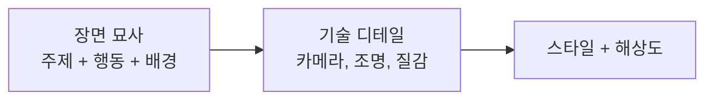
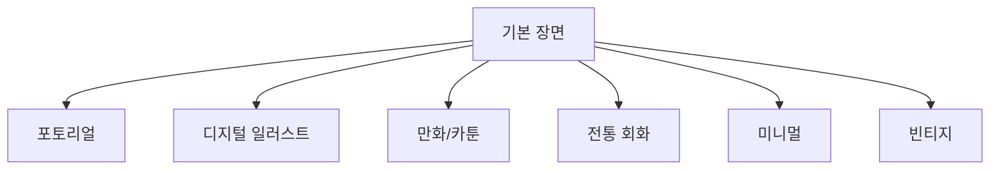
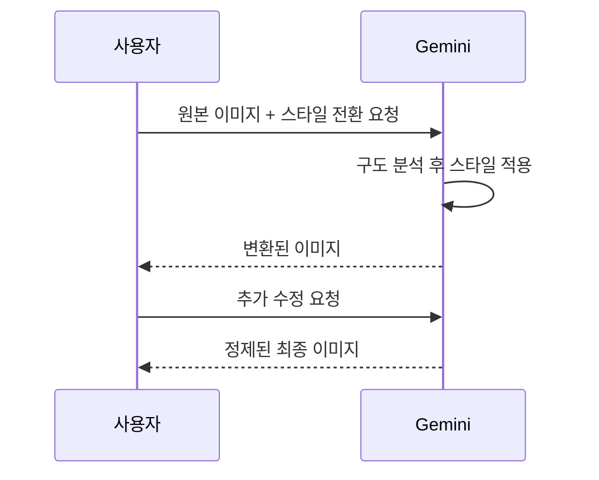

# 고품질 이미지 생성과 스타일 전환

> 프롬프트 몇 줄로 포토리얼에서 수채화까지 — Gemini 스타일 전환 실전 가이드

## 개요

같은 장면도 프롬프트에 따라 DSLR 사진부터 픽사 캐릭터까지 완전히 다른 결과물이 나옵니다. 해상도/종횡비 제어, Gemini 최적화 프롬프트 구조, 6가지 스타일별 프롬프트, 참조 이미지 활용법을 다룹니다.

## 해상도와 종횡비

| 해상도 | 용도 | 종횡비 예시 |
|--------|------|------------|
| 0.5K | 빠른 시안 | 1:1 |
| 1K | 웹/SNS | 4:5, 16:9 |
| 2K | 인쇄물 | 3:4, 2:3 |
| 4K | 대형 포스터 | 21:9, 16:9 |

해상도와 종횡비는 프롬프트 끝에 자연스럽게 포함시킵니다.

```
도쿄 네온 거리의 야경, 비에 젖은 아스팔트에 반사되는 불빛, 시네마틱 와이드 구도, 21:9 비율, 4K
```


```
손글씨 감성의 인스타그램 카드, 따뜻한 베이지 배경에 한글 캘리그래피, 4:5 비율, 1K
```


> **팁**: SNS용을 4K로 생성하면 시간만 길어지고 플랫폼이 자동 압축합니다. 용도에 맞는 해상도를 선택하세요.

## Gemini 프롬프트 작성법

Gemini는 키워드 나열보다 **장면 묘사형 서술**에 강합니다.



**장면 묘사형** (강한 프롬프트):
```
오후의 따뜻한 햇빛이 나무 창틀을 통해 쏟아지는 방 안에서, 복슬복슬한 주황색 고양이가 쿠션 위에 웅크려 낮잠을 자고 있다
```

**키워드 나열형** (약한 프롬프트):
```
고양이, 창문, 햇빛, 아늑한
```

카메라 언어를 섞으면 포토리얼 품질이 올라갑니다. 검색 그라운딩(실제 장소/이벤트 언급)은 Gemini만의 강점입니다.

## 6가지 스타일별 프롬프트 모음



---

### 1. 포토리얼리즘

**핵심 키워드**: "DSLR로 촬영한", "하이퍼리얼리스틱", "포토그래피"

```
카페 창가에 앉아 라떼를 마시는 30대 여성, Canon EOS R5, 85mm 렌즈, f/1.8 얕은 심도, 오후 자연광, 배경 보케, 4K
```


```
새벽 안개 낀 산속 호수, 수면에 소나무 숲 반사, Sony A7R V, 24mm 광각, f/8, 골든아워 직전 푸른 빛, 4K
```


---

### 2. 디지털 일러스트

**핵심 키워드**: "디지털 컨셉 아트", "디지털 페인팅", "ArtStation 스타일"

```
하늘 위에 떠 있는 거대한 고래, 구름 사이로 빛줄기가 내려오는 판타지 장면, 디지털 페인팅, 극적인 역광, 세밀한 비늘 질감, 2K
```


```
황혼의 사이버펑크 도시 스카이라인, 홀로그램 광고판이 빛나는 거리, 네온 핑크와 시안, 컨셉 아트 스타일, 4K
```


---

### 3. 만화/카툰

**핵심 키워드**: "픽사 스타일 3D", "일본 애니메이션", "카툰 일러스트"

```
카페에서 라떼를 마시는 여성, 픽사 스타일 3D, 큰 반짝이는 눈, 과장된 표정, 밝고 채도 높은 색감, 디즈니 따뜻한 조명, 2K
```


```
우주 비행사 헬멧을 쓴 고양이, 일본 애니메이션 스타일, 별이 가득한 우주 배경, 반짝이는 눈동자, 마코토 신카이 풍 색감, 2K
```


---

### 4. 전통 회화

**핵심 키워드**: "유화 스타일", "수채화", "인상파 화풍", "동양화"

```
카페에 앉아 커피를 마시는 여성, 유화 스타일, 임파스토 붓터치, 렘브란트식 명암 대비, 따뜻한 갈색과 황금빛 색조, 캔버스 질감, 2K
```


```
안개 낀 대나무 숲, 동양화 수묵 스타일, 먹의 농담 변화, 여백을 살린 구도, 전통 화선지 질감, 2K
```


---

### 5. 미니멀/그래픽

**핵심 키워드**: "플랫 디자인", "미니멀리스트", "벡터 일러스트", "2-3색"

```
카페에서 커피를 마시는 여성 실루엣, 미니멀리스트 플랫 디자인, 3색(코랄 핑크, 크림 화이트, 차콜 그레이), 기하학적 단순화, 벡터 스타일
```


```
산과 호수 풍경, 레이어드 페이퍼컷 스타일, 4색(네이비, 스카이블루, 민트, 화이트), 깊이감 있는 레이어, 포스터용, 2K
```


---

### 6. 빈티지/레트로

**핵심 키워드**: "1970년대 필름 사진", "레트로 포스터", "아르데코"

```
카페에서 커피를 마시는 여성, 1970년대 코닥 필름 빈티지 사진, 따뜻한 황변 색조, 필름 그레인, 빛 바랜 느낌, 비네팅, 2K
```


```
아르데코 스타일 재즈 클럽 포스터, 1920년대 뉴욕, 금색과 검정의 기하학적 패턴, 우아한 타이포그래피, 대칭 구도, 2K
```


---

## 참조 이미지 활용 스타일 전환

텍스트만으로 전달하기 어려운 색감이나 질감은 참조 이미지를 함께 올리면 정밀도가 크게 올라갑니다.



**내 사진을 아트워크로**:
```
이 사진을 스튜디오 지브리 애니메이션 스타일로 변환해줘. 배경은 유지하되, 인물은 애니메이션 캐릭터처럼 표현해줘
```

**스타일 레퍼런스 전달**:
```
이 그림의 색감과 붓터치 스타일을 참조해서 비 오는 서울 북촌 한옥마을 골목길을 그려줘. 내용은 다르게 하되 분위기만 가져와줘
```

**분할 비교 이미지**:
```
왼쪽은 사실적 사진, 오른쪽은 수채화 스타일로 같은 장면을 나란히 보여줘. 벚꽃 흩날리는 공원 벤치에 앉은 노부부
```

> **팁**: 스타일만 가져오려면 "이 이미지의 색감과 텍스처 느낌만 참조하여"라고 명시하세요. 그렇지 않으면 내용까지 재현하려 할 수 있습니다.

## 실습

### 스타일 릴레이 — 하나의 장면, 여섯 가지 변신

**기본 장면**: *"비 오는 날 파리의 카페 테라스에서 책을 읽는 사람"*

이 장면을 6가지 스타일로 각각 변환해보세요:

1. **포토리얼**: 카메라 설정(렌즈, 조리개, 조명) 추가
2. **디지털 일러스트**: 극적 색감 대비, 컨셉 아트 키워드
3. **만화/카툰**: 픽사 3D 또는 애니메이션 스타일
4. **전통 회화**: 유화/수채화 매체 질감 키워드
5. **미니멀**: 색상 수 제한, 기하학적 단순화
6. **빈티지**: 특정 시대와 필름 느낌

각 결과물을 비교하며, 어떤 키워드가 스타일에 가장 큰 영향을 미쳤는지 분석해보세요.

## 팁과 주의사항

> **스타일-디테일 방향성 일치**: "수채화 스타일"에 "8K, 피부 모공까지 선명하게"를 쓰면 스타일이 뒤섞입니다. 스타일 키워드와 기술적 디테일의 방향을 맞추세요.

> **멀티턴 편집 활용**: 한 번에 완벽을 기대하지 마세요. "배경을 더 따뜻하게" → "표정을 더 밝게" → "빈티지 느낌 추가" 식으로 점진적으로 정제하세요.

> **인물 표현 한계**: 작은 얼굴, 정확한 철자는 아직 어려운 영역입니다. 인물 수를 줄이거나 클로즈업 구도를 활용하세요. 텍스트 포함 이미지는 Thinking 모드를 켜세요.

> **모델 선택**: 빠른 시안 → 기본 모델. SNS → Thinking minimal. 상업 에셋 → Thinking high 또는 Pro.

## 핵심 정리

| 개념 | 핵심 |
|------|------|
| 해상도 | 0.5K~4K, 용도에 맞게 선택 |
| 종횡비 | 플랫폼별 최적 비율 (4:5, 16:9, 21:9 등) |
| 프롬프트 구조 | 장면 묘사 → 스타일 → 기술 디테일 → 해상도 |
| 6대 스타일 | 포토리얼, 디지털 일러스트, 만화, 전통 회화, 미니멀, 빈티지 |
| 참조 이미지 | 스타일만 가져올 때 명시적 지시 필요 |
| 멀티턴 편집 | 대화하며 점진적으로 정제 |

## 다음 섹션 미리보기

다음 섹션에서는 이미 만든 이미지를 "편집"하는 기술을 배웁니다. 배경 교체, 요소 추가/제거, 색감 조정 등 Gemini의 멀티턴 편집 기능을 활용하여 생성부터 편집까지 이어지는 워크플로우를 완성합니다.
