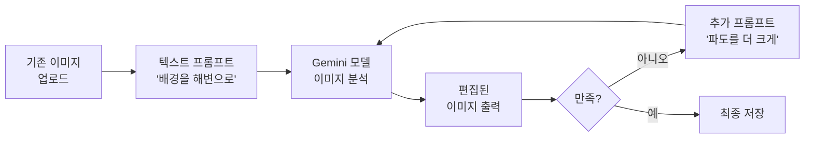
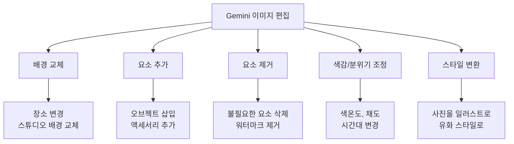
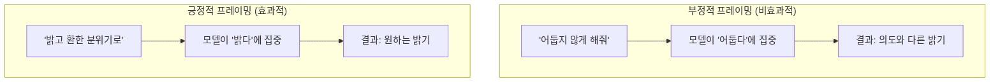
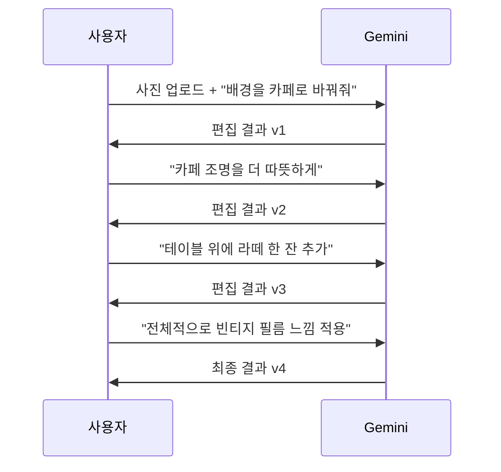
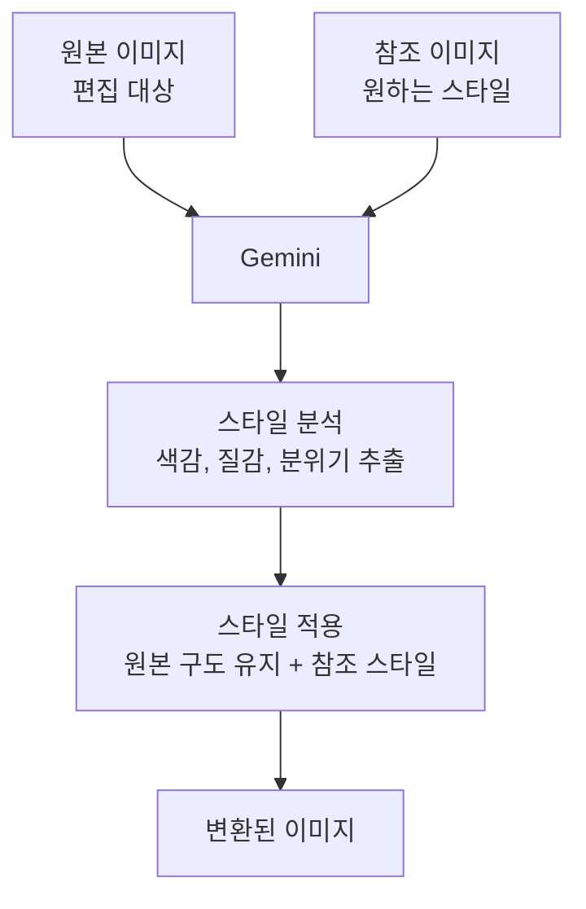
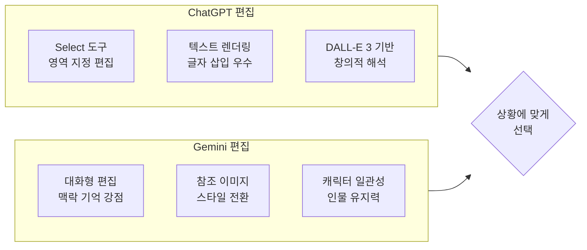

# Gemini 이미지 편집과 변환

> 이미 있는 이미지를 업로드하고, 대화하듯 수정하는 Gemini 편집 워크플로우를 익힙니다.

## 개요

이 섹션에서는 Gemini에 기존 이미지를 업로드한 뒤 텍스트 명령만으로 배경을 바꾸고, 요소를 추가하거나 제거하고, 사진을 일러스트로 변환하는 방법을 배웁니다. "새로 생성"이 아닌 "기존 이미지를 고치는" 능력은 실무 디자이너에게 가장 자주 필요한 기능이거든요.

이 섹션은 **Gemini 플랫폼에서의 실전 편집 조작법**에 집중합니다. 배경 교체, 요소 추가/제거 등의 편집 기법이 내부적으로 어떤 원리(인페인팅, 아웃페인팅, img2img 등)로 동작하는지는 [이미지 편집 기법 — img2img·인페인팅·아웃페인팅](06-ch6-이미지-편집-기법-img2img-인페인팅-아웃페인팅/01-01-img2img-원리와-활용-이미지에서-이미지로.md)에서 범용적 관점으로 깊이 다룹니다. 여기서는 "Gemini에서 이렇게 하면 된다"는 **실전 조작법과 프롬프트 패턴**에 집중하겠습니다.

**선수 지식**: [Gemini 이미지 생성의 특징과 접근법](04-ch4-gemini-이미지-생성-실전/01-01-gemini-이미지-생성의-특징과-접근법.md)에서 배운 모델 종류와 Thinking 모드, [고품질 이미지 생성과 스타일 전환](04-ch4-gemini-이미지-생성-실전/02-02-고품질-이미지-생성과-스타일-전환.md)에서 다룬 스타일 키워드와 프롬프트 구조

**학습 목표**:
- Gemini에 이미지를 업로드하고 텍스트로 정밀하게 편집할 수 있다
- 배경 교체, 요소 추가/제거, 색감 조정 등 핵심 편집 기법을 구분하고 적용할 수 있다
- 사진을 일러스트·회화 등 다른 스타일로 변환하는 워크플로우를 실행할 수 있다
- 멀티턴 대화로 점진적 수정을 진행하는 반복 편집 전략을 이해한다

## 왜 알아야 할까?

디자이너의 일상을 떠올려 보세요. 클라이언트가 "이 제품 사진 배경을 해변으로 바꿔주세요", "로고 옆에 꽃 장식을 추가해 주세요"라고 요청합니다. 예전이라면 Photoshop을 열고 누끼를 따고, 소스 이미지를 찾아 합성하는 데 30분~1시간이 걸렸죠. Gemini의 이미지 편집 기능을 사용하면, 사진을 업로드하고 한 줄 프롬프트를 입력하는 것만으로 같은 작업을 1분 안에 처리할 수 있습니다.

특히 Gemini의 편집은 **대화형**이라는 점이 핵심입니다. 한 번에 완벽한 결과를 얻지 못해도 "조금 더 밝게", "꽃을 왼쪽으로 옮겨줘"처럼 자연어로 계속 수정할 수 있어요. 마치 옆에 앉은 어시스턴트에게 지시하듯, 이미지를 점진적으로 다듬어 가는 워크플로우가 가능합니다.

## 핵심 개념

### 개념 1: 이미지 업로드와 편집의 기본 구조

> 💡 **비유**: 레스토랑에서 음식 사진을 보여주며 "여기서 파슬리 빼고, 소스를 좀 더 올려주세요"라고 말하는 것과 같습니다. 메뉴판(프롬프트)으로 새 요리를 시키는 게 아니라, 이미 나온 요리(기존 이미지)를 보여주면서 수정을 요청하는 거죠.

Gemini의 이미지 편집은 **텍스트+이미지 → 이미지** 방식으로 동작합니다. 사용자가 편집할 이미지를 업로드하고, 텍스트 프롬프트로 원하는 변경사항을 설명하면, Gemini가 원본을 이해한 뒤 수정된 이미지를 생성합니다.

편집에 사용할 수 있는 주요 모델은 세 가지입니다:

| 모델 | 특징 | 편집 적합도 |
|------|------|------------|
| Gemini 2.5 Flash Image (Nano Banana) | 빠른 속도, 무료 쿼터 넉넉 | 빠른 반복 편집에 최적 |
| Gemini 3 Pro Image | 전문 에셋 품질, 텍스트 렌더링 우수 | 고품질 최종 결과물 |
| Gemini 3.1 Flash Image | 최신 속도 최적화 | 대량 편집 작업 |

> 📊 **그림 1**: Gemini 이미지 편집의 기본 흐름

편집 프롬프트를 작성할 때 가장 중요한 원칙은 **"장면을 묘사하라, 키워드를 나열하지 마라"**입니다. Google 공식 가이드에서도 서술형 문장이 단어 나열보다 훨씬 좋은 결과를 만든다고 강조하고 있어요.

**효과적인 편집 프롬프트 구조**:
- **대상 지정**: "이 사진에서 배경을..."
- **변경 내용 서술**: "...열대 해변으로 바꿔줘"
- **통합 디테일**: "자연스러운 그림자와 따뜻한 오후 조명을 유지해줘"

> ⚠️ **흔한 오해**: "편집이니까 프롬프트를 짧게 써도 된다"고 생각하기 쉽지만, 오히려 편집 프롬프트에서 디테일이 부족하면 Gemini가 원하지 않는 부분까지 변경하는 경우가 많습니다. **바꾸고 싶은 것**과 **유지하고 싶은 것** 모두 명시하는 게 핵심이에요.

---

### 개념 2: 5가지 핵심 편집 기법

> 💡 **비유**: 이미지 편집 기법은 요리의 기본 조리법과 같습니다. 볶기, 굽기, 찌기, 튀기기처럼 — 각각의 기법을 알면 어떤 재료(이미지)든 원하는 요리(결과물)로 만들 수 있죠.

Gemini에서 가장 자주 사용하는 편집 기법 다섯 가지를 하나씩 살펴보겠습니다. 이 기법들은 내부적으로 인페인팅(부분 재생성)이나 img2img(이미지 변환) 같은 기술을 사용하는데, 그 **원리와 이론**은 [Ch6. 이미지 편집 기법](06-ch6-이미지-편집-기법-img2img-인페인팅-아웃페인팅/01-01-img2img-원리와-활용-이미지에서-이미지로.md)에서 본격적으로 다룹니다. 여기서는 Gemini 안에서 **어떻게 프롬프트를 써야 하는지**에 집중하겠습니다.

> 📊 **그림 2**: Gemini 5가지 핵심 편집 기법 분류

#### 기법 1: 배경 교체

제품 사진의 배경을 바꾸거나, 인물 사진의 장소를 변경할 때 사용합니다. Gemini는 피사체(인물이나 제품)의 윤곽을 자동으로 인식하고, 배경 영역만 새로운 장면으로 대체합니다.

**프롬프트 패턴**: "이 이미지에서 배경을 [새 배경]으로 변경해줘. 인물/제품은 그대로 유지하고, [조명/그림자] 조건을 맞춰줘."

**Before → After 예시**:

| Before | 프롬프트 | After 기대 결과 |
|--------|---------|----------------|
| 흰 배경의 운동화 제품 사진 | "이 운동화 사진의 배경을 도시 스케이트파크로 바꿔줘. 오후 햇살 아래 콘크리트 바닥에 자연스러운 그림자가 생기도록 해줘" | 스케이트파크 배경 위에 그림자가 드리워진 운동화 |
| 실내에서 찍은 인물 사진 | "이 인물 사진의 배경을 벚꽃이 만개한 공원으로 바꿔줘. 원래 사진의 부드러운 조명 느낌을 유지해줘" | 벚꽃 공원 배경의 인물 (표정·의상 유지) |
| 잡다한 배경의 제품 사진 | "이 제품 사진의 배경을 깨끗한 흰색 스튜디오 배경으로 바꿔줘. 제품의 그림자는 자연스럽게 유지해줘" | 클린한 흰 배경의 제품 사진 |

> 🔥 **실무 팁**: 배경 교체 시 **조명 일관성**이 가장 중요합니다. 원본이 실내 조명인데 야외 해변 배경을 넣으면 부자연스럽죠. "원본의 조명 방향과 강도를 유지하면서"라는 문구를 추가하면 결과가 크게 개선됩니다.

#### 기법 2: 요소 추가

이미지에 새로운 오브젝트, 텍스트, 장식 요소를 삽입합니다.

**프롬프트 패턴**: "이 사진에 [추가할 요소]를 추가해줘. [위치]에 배치하고, 기존 이미지의 [조명/스타일]과 어울리게 해줘."

핵심은 추가할 요소가 기존 이미지에 **자연스럽게 녹아드는** 느낌을 만드는 것입니다. Google의 공식 가이드에 따르면, 추가할 요소의 "부드러운 조명과 어울리게(match the soft lighting)" 같은 통합 디테일을 명시하면 결과 품질이 크게 향상됩니다.

**Before → After 예시**:

| Before | 프롬프트 | After 기대 결과 |
|--------|---------|----------------|
| 빈 나무 테이블 사진 | "이 테이블 위에 김이 모락모락 나는 라떼 한 잔과 크로아상을 올려줘. 아침 햇살이 비치는 카페 분위기에 맞춰줘" | 음식이 자연스럽게 놓인 카페 테이블 |
| 손목시계를 찬 손 클로즈업 | "손목 주변에 작은 꽃 팔찌를 추가해줘. 시계의 금속 질감과 어울리는 섬세한 꽃 디자인으로" | 시계 옆에 꽃 팔찌가 있는 손목 |
| 평범한 제품 진열 사진 | "제품 주변에 유칼립투스 잎과 작은 조약돌을 자연스럽게 배치해줘. 미니멀한 라이프스타일 촬영 느낌으로" | 소품이 배치된 스타일링 사진 |

> ⚠️ **흔한 오해**: 요소를 추가할 때 "왼쪽 위에", "오른쪽 아래에"처럼 정확한 좌표를 지정할 수 있다고 생각하기 쉽지만, Gemini는 픽셀 단위 위치 지정보다 **맥락적 배치**에 강합니다. "테이블 위에", "인물 옆에"처럼 맥락으로 위치를 설명하는 것이 더 자연스러운 결과를 만들어요.

#### 기법 3: 요소 제거

사진에서 불필요한 요소를 깔끔하게 지우는 기법입니다. Gemini는 제거할 영역 주변의 패턴을 분석해서 자연스럽게 채워 넣습니다.

**프롬프트 패턴**: "[제거 대상]만 제거해줘. 나머지는 전부 그대로 유지해줘(Keep everything else unchanged)."

**Before → After 예시**:

| Before | 프롬프트 | After 기대 결과 |
|--------|---------|----------------|
| 옷에 얼룩이 있는 인물 사진 | "이 사진에서 티셔츠의 얼룩만 제거해줘. 나머지는 전부 그대로 유지해줘" | 깨끗한 티셔츠의 인물 사진 |
| 풍경 사진에 전봇대가 보임 | "이 풍경 사진에서 전봇대와 전선을 제거해줘. 빈 공간은 주변 하늘 패턴으로 자연스럽게 채워줘" | 전봇대 없는 깔끔한 풍경 |
| 워터마크가 있는 이미지 | "이 이미지에서 오른쪽 하단의 워터마크 텍스트를 제거해줘. 워터마크 아래의 원래 이미지가 자연스럽게 복원되도록 해줘" | 워터마크가 제거된 깨끗한 이미지 |

> 🔥 **실무 팁**: 요소 제거 시 "나머지는 전부 그대로 유지해줘"를 반드시 추가하세요. 이 문구가 없으면 Gemini가 주변 영역까지 불필요하게 수정하는 경우가 있습니다. 또한 복잡한 패턴(격자무늬 배경 위의 물체 등) 위의 요소를 제거할 때는 "주변 패턴을 자연스럽게 이어붙여줘"를 추가하면 결과가 개선됩니다.

#### 기법 4: 색감과 분위기 조정

사진의 전체 색온도, 채도, 밝기를 조절하거나, 시간대를 바꾸는 편집입니다. 이 기법은 사진의 구성 요소는 건드리지 않으면서 **분위기만 변환**하는 것이 핵심입니다.

**프롬프트 패턴**: "이 사진의 분위기를 [원하는 분위기]로 바꿔줘. 구도와 피사체는 그대로 유지하되, [색감/조명 조건]을 적용해줘."

**Before → After 예시**:

| Before | 프롬프트 | After 기대 결과 |
|--------|---------|----------------|
| 한낮 도시 풍경 사진 | "이 도시 풍경을 밤 시간대로 변환해줘. 건물 창문에서 따뜻한 불빛이 새어나오고, 거리에 네온사인 빛이 반사되는 느낌으로" | 야경으로 변환된 같은 도시 풍경 |
| 밝은 조명의 실내 사진 | "이 사진을 따뜻한 골든아워 조명으로 바꿔줘. 창문으로 들어오는 주황빛 햇살이 방 안을 비추는 느낌" | 골든아워 분위기의 실내 사진 |
| 선명한 컬러의 여행 사진 | "채도를 낮추고 필름 그레인을 추가해서 빈티지한 분위기를 만들어줘. 1970년대 필름 카메라로 촬영한 느낌으로" | 빈티지 필름 톤의 여행 사진 |

**색감 조정에 유용한 표현들**:
- **시간대 변환**: "새벽", "골든아워", "블루아워", "한밤중"
- **색온도**: "따뜻한(warm)", "차가운(cool)", "중성적인(neutral)"
- **분위기**: "몽환적인", "드라마틱한", "고요한", "에너지 넘치는"
- **필름 스타일**: "코닥 포트라 400 느낌", "후지 벨비아 느낌", "흑백 필름"

#### 기법 5: 스타일 변환

사진을 완전히 다른 예술 스타일로 변환하는 기법입니다. 이전 섹션 [고품질 이미지 생성과 스타일 전환](04-ch4-gemini-이미지-생성-실전/02-02-고품질-이미지-생성과-스타일-전환.md)에서 배운 스타일 키워드를 여기에 그대로 활용할 수 있습니다.

**프롬프트 패턴**: "이 사진을 [스타일]로 변환해줘. 원본의 구도와 주요 요소는 유지하되, [스타일 특징]을 적용해줘."

**Before → After 예시**:

| Before | 프롬프트 | After 기대 결과 |
|--------|---------|----------------|
| 반려견 산책 사진 | "이 사진을 수채화 스타일 일러스트로 변환해줘. 원래 사진의 구도와 강아지의 모습은 유지하되, 부드러운 수채 번짐과 파스텔 톤을 적용해줘" | 수채화풍 반려견 일러스트 |
| 산 풍경 사진 | "이 풍경 사진을 소용돌이치는 임파스토 붓터치와 드라마틱한 팔레트의 유화풍으로 바꿔줘" | 반 고흐풍 유화 스타일의 풍경 |
| 가족 사진 | "이 가족 사진을 스튜디오 지브리 애니메이션 스타일로 변환해줘. 부드러운 선과 따뜻한 색감의 2D 애니메이션 느낌으로, 가족 구성원 각각의 특징은 살려줘" | 지브리풍 애니메이션 가족 일러스트 |

**스타일 변환 강도 조절 팁**: 스타일 변환의 "강도"를 조절하고 싶다면 프롬프트에 힌트를 줄 수 있어요. "약간의 수채화 터치를 입혀줘"(약한 변환) vs "완전히 수채화 일러스트로 변환해줘"(강한 변환)처럼 표현의 강도로 결과가 달라집니다.

---

### 개념 3: 긍정적 프레이밍과 효과적인 편집 프롬프트 전략

> 💡 **비유**: 네비게이션에게 "이 길로 가지 마"라고 말하면 혼란스럽죠. "저 길로 가줘"라고 말하는 게 훨씬 명확합니다. AI 이미지 편집도 마찬가지예요.

편집 프롬프트에서 결과 품질을 크게 좌우하는 원칙이 바로 **긍정적 프레이밍(Positive Framing)**입니다. 이 개념은 [고품질 프롬프트 작성법](03-ch3-chatgpt-이미지-생성-실전/02-02-고품질-이미지를-위한-프롬프트-엔지니어링.md)에서도 다뤘는데, 편집 상황에서는 특히 더 중요해집니다.

긍정적 프레이밍이란, **"~하지 마"(부정형)** 대신 **"~해줘"(긍정형)**으로 원하는 결과를 묘사하는 방식입니다. AI 모델은 "~하지 마"라는 지시를 처리할 때 오히려 그 요소에 주의를 기울여 버리는 경향이 있거든요.

> 📊 **그림 3**: 긍정적 프레이밍 vs 부정적 프레이밍 비교

**실전 변환 예시**:

| 부정적 프레이밍 (비효과적) | 긍정적 프레이밍 (효과적) |
|--------------------------|------------------------|
| "흐릿하지 않게" | "선명하고 또렷하게" |
| "차갑지 않은 분위기로" | "따뜻한 색온도의 분위기로" |
| "사람이 없는 풍경으로" | "넓고 고요한 자연 풍경으로" |
| "너무 화려하지 않게" | "미니멀하고 절제된 톤으로" |
| "배경이 복잡하지 않게" | "깔끔한 단색 배경으로" |

이 원칙은 [프롬프트 엔지니어링 기초](03-ch3-chatgpt-이미지-생성-실전/02-02-고품질-이미지를-위한-프롬프트-엔지니어링.md)에서 배운 것과 동일하지만, 편집에서는 **유지 조건**을 함께 명시해야 한다는 차이가 있습니다. "밝고 환한 분위기로 바꿔줘. **단, 인물의 얼굴색은 자연스럽게 유지해줘**"처럼요.

---

### 개념 4: 멀티턴 대화 편집 — 점진적 완성의 기술

> 💡 **비유**: 미용실에서 머리를 자를 때를 생각해 보세요. "2cm만 더 잘라주세요", "앞머리를 좀 더 옆으로", "볼륨을 살짝 더" — 한 번에 완벽한 결과를 요구하기보다 대화를 통해 점진적으로 원하는 모습에 가까워지죠. Gemini의 멀티턴 편집도 정확히 이런 방식입니다.

멀티턴 편집이란, 하나의 대화 세션 안에서 이미지를 여러 번 수정해 나가는 방식입니다. Gemini는 대화 맥락을 기억하기 때문에, "아까 그 이미지에서 하늘을 더 파랗게 해줘"라고 하면 이전 결과를 기반으로 수정합니다.

> 📊 **그림 4**: 멀티턴 편집의 대화 흐름

**멀티턴 편집의 핵심 전략**:

| 전략 | 설명 | 예시 |
|------|------|------|
| 큰 변경 먼저 | 구조적 변경(배경, 구도)을 먼저 처리 | 1단계: 배경 교체 → 2단계: 디테일 추가 |
| 한 번에 하나씩 | 여러 수정을 동시에 요청하면 품질 저하 | "배경 바꾸고 색감도 바꿔줘" (X) → 각각 따로 (O) |
| 긍정적 프레이밍 | "~하지 마"보다 "~해줘"가 효과적 | "어둡지 않게" (X) → "밝고 환하게" (O) |
| 유지 요소 명시 | 바꾸지 말아야 할 부분을 꼭 언급 | "인물의 표정과 포즈는 그대로 유지" |

**멀티턴에서 흔한 실수와 해결법**:

멀티턴 편집을 진행하다 보면, 4~5번째 턴에서 이전 수정 사항이 "되돌려지는" 현상을 겪을 수 있어요. 이는 대화가 길어지면서 모델이 초기 맥락을 덜 참조하게 되기 때문입니다. 이때는 **중간 결과물을 다운로드한 뒤 새 대화에서 다시 업로드**하여 이어가는 것이 효과적입니다. 중간 저장점을 만드는 셈이죠.

> 💡 **알고 계셨나요?**: Gemini 3 모델부터는 복잡한 편집 요청에 대해 **Thinking 모드**가 자동으로 활성화됩니다. 모델이 내부적으로 중간 테스트 이미지를 생성하고 검토한 뒤 최종 결과를 내놓기 때문에, 복잡한 편집일수록 결과 품질이 더 좋아지는 경향이 있어요.

---

### 개념 5: 참조 이미지 기반 스타일 전환

> 💡 **비유**: 인테리어 디자이너에게 "이 잡지 사진 스타일로 우리 거실을 꾸며주세요"라고 요청하는 것과 같습니다. Gemini에게 스타일 참조 이미지를 보여주면, 그 스타일의 특성(색감, 질감, 분위기)을 추출해서 다른 이미지에 적용해 줍니다.

이전 섹션에서 스타일 **키워드**로 변환하는 방법을 배웠다면, 여기서는 **참조 이미지** 자체를 활용하는 고급 기법을 다룹니다.

> 📊 **그림 5**: 참조 이미지 기반 스타일 전환 프로세스

**워크플로우**:

1. **원본 이미지 업로드**: 변환하고 싶은 사진
2. **참조 이미지 업로드**: 적용하고 싶은 스타일의 예시 이미지
3. **프롬프트 작성**: "첫 번째 사진을 두 번째 사진의 스타일로 변환해줘. 원본의 구도와 인물 배치는 유지하되, 참조 이미지의 색감과 붓터치 느낌을 적용해줘"

이 기법이 강력한 이유는 스타일을 **말로 설명하기 어려운 경우**에 빛나기 때문입니다. "이 느낌으로 해줘"라는 감각적 요청을 이미지로 전달할 수 있거든요.

**스타일 전환 시 자주 쓰는 프롬프트 보강 표현**:

- "원래 사진의 선(lines)과 윤곽은 유지하되 렌더링 스타일만 변경해줘"
- "참조 이미지의 색상 팔레트와 질감을 적용해줘"
- "두 이미지의 조명 방향을 맞춰줘"

---

### 개념 6: ChatGPT 편집 vs Gemini 편집 — 어떤 상황에서 무엇을 쓸까?

[GPT-4o 이미지 생성의 특징과 강점](03-ch3-chatgpt-이미지-생성-실전/01-01-gpt-4o-이미지-생성의-특징과-강점.md)에서 배운 ChatGPT의 이미지 편집과 Gemini의 편집을 비교해 봅시다. 두 플랫폼 모두 "이미지 업로드 + 텍스트 편집"을 지원하지만, 강점이 다릅니다.

> 📊 **그림 6**: ChatGPT vs Gemini 이미지 편집 비교

| 비교 항목 | ChatGPT | Gemini |
|-----------|---------|--------|
| 편집 방식 | Select 도구로 영역 지정 가능 | 텍스트 프롬프트로만 편집 |
| 인물 유지력 | 보통 (얼굴 왜곡 가능) | 우수 (캐릭터 일관성 강화) |
| 스타일 전환 | 키워드 기반 | 키워드 + 참조 이미지 |
| 텍스트 렌더링 | 우수 | 보통 (Gemini 3 Pro에서 개선) |
| 무료 쿼터 | 제한적 | 넉넉한 무료 사용량 |
| 멀티턴 편집 | 지원 | 더 자연스러운 맥락 유지 |
| 배경 제거/교체 | 좋음 | 매우 좋음 |

**선택 가이드**:
- **영역을 직접 지정해서 수정**하고 싶다면 → ChatGPT의 Select 도구
- **인물 사진 편집**(얼굴 일관성이 중요)이라면 → Gemini
- **참조 이미지 스타일 적용**이 필요하다면 → Gemini
- **이미지에 텍스트를 넣어야** 한다면 → ChatGPT
- **빠른 반복 편집**(무료 쿼터 내)이라면 → Gemini

## 실습: 적용해보기

### 활동 1: 편집 기법 매칭 워크시트

아래 클라이언트 요청을 읽고, 어떤 편집 기법을 사용하고 어떤 프롬프트를 작성할지 계획해 보세요.

| 클라이언트 요청 | 사용할 기법 | 프롬프트 초안 |
|----------------|------------|-------------|
| "이 카페 인테리어 사진의 벽 색상을 민트그린으로 바꿔주세요" | ? | ? |
| "제품 사진에서 워터마크를 지워주세요" | ? | ? |
| "이 사진을 스튜디오 지브리 애니메이션 스타일로 바꿔주세요" | ? | ? |
| "이 빈 테이블 위에 커피잔과 노트북을 자연스럽게 놓아주세요" | ? | ? |
| "이 야외 사진을 황혼 시간대의 분위기로 바꿔주세요" | ? | ? |

### 활동 2: 멀티턴 편집 시나리오 설계

아래 시나리오에 대해 **4단계 멀티턴 편집 계획**을 세워 보세요.

**시나리오**: 당신은 소규모 커피 브랜드의 인스타그램을 담당하고 있습니다. 직접 찍은 커피잔 사진 한 장으로 다양한 시즌 콘텐츠를 만들어야 합니다.

- **봄 버전**: 벚꽃 배경 + 파스텔 톤 + 꽃잎 요소 추가
- **여름 버전**: 해변 배경 + 시원한 색감 + 얼음 요소 추가
- **가을 버전**: 낙엽 배경 + 따뜻한 색감 + 아늑한 분위기
- **겨울 버전**: 눈 내리는 창가 + 따뜻한 조명 + 김이 나는 효과

각 시즌에 대해:
1. 1단계 프롬프트 (큰 변경): ?
2. 2단계 프롬프트 (디테일): ?
3. 3단계 프롬프트 (분위기): ?
4. 4단계 프롬프트 (최종 조정): ?

### 활동 3: 토론 질문

- Gemini의 텍스트 기반 편집과 Photoshop의 수동 편집 중, 어떤 작업에서는 여전히 Photoshop이 필요할까요? 그 이유는 무엇인가요?
- 인물 사진을 편집할 때 "캐릭터 일관성"이 왜 중요하며, 일관성이 깨지면 어떤 문제가 발생할 수 있을까요?
- 클라이언트에게 AI로 편집한 이미지를 전달할 때, 어디까지가 "편집"이고 어디서부터가 "생성"인가요? 윤리적 경계는 어디에 있을까요?

## 더 깊이 알아보기

### Nano Banana의 탄생 — 왜 "바나나"일까?

Google DeepMind가 2025년 8월에 발표한 이미지 편집 모델의 코드네임이 **Nano Banana**입니다. AI 업계에서 프로젝트 코드네임은 종종 과일이나 동물에서 따오는 전통이 있는데, Google의 이미지 생성 팀은 바나나를 선택했죠. 2026년 초에는 **Nano Banana 2**가 출시되어, Nano Banana Pro의 고급 편집 능력과 Flash 모델의 속도를 결합했습니다.

Nano Banana 시리즈의 가장 큰 기술적 돌파구는 **캐릭터 일관성(character consistency)** 기능이었습니다. 이전까지 AI 이미지 편집의 가장 큰 불만 중 하나가 "사진 속 인물의 얼굴이 편집 후 달라진다"는 것이었거든요. Google 팀은 인물의 유사성을 유지하는 데 집중적으로 투자하여, 친구, 가족, 심지어 반려동물까지 편집 전후로 "같은 존재"로 보이도록 만들었습니다.

### "대화형 편집"의 뿌리 — 포토샵 역사와의 연결

이미지 편집 소프트웨어의 역사를 돌아보면 흥미로운 패턴이 보입니다. 1990년 Adobe Photoshop 1.0은 모든 편집을 마우스 클릭으로 수행했습니다. 2010년대에는 "비파괴 편집(non-destructive editing)"이라는 혁신이 나타나, 원본을 보존하면서 레이어로 수정할 수 있게 됐죠. 그리고 2020년대 중반, Gemini와 같은 AI 도구는 "자연어로 편집 지시"라는 새로운 패러다임을 열었습니다.

사실 "말로 이미지를 수정한다"는 아이디어는 1960년대 Ivan Sutherland의 Sketchpad까지 거슬러 올라갑니다. Sutherland는 컴퓨터와 인간이 직관적으로 소통하며 그래픽을 만드는 미래를 상상했는데, 60년이 지난 지금 Gemini의 대화형 편집이 그 비전에 가장 가까운 형태라고 할 수 있겠죠.

## 흔한 오해와 팁

> ⚠️ **흔한 오해**: "Gemini 편집은 원본 이미지를 직접 수정한다." 사실 Gemini는 원본을 수정하는 것이 아니라, 원본을 분석한 뒤 **새로운 이미지를 생성**합니다. 그래서 편집 결과의 해상도가 원본과 다를 수 있고, 원본의 미세한 디테일(배경의 작은 글씨 등)이 달라질 수 있어요. 이 점을 이해하면 결과에 대한 기대를 적절히 조절할 수 있습니다.

> 💡 **알고 계셨나요?**: Google은 Gemini가 생성하거나 편집한 모든 이미지에 **SynthID 워터마크**를 삽입합니다. 이 워터마크는 사람 눈에는 보이지 않지만, 기계가 감지할 수 있어서 AI 생성 이미지인지 아닌지를 나중에 확인할 수 있어요. [Gemini 이미지 생성의 특징과 접근법](04-ch4-gemini-이미지-생성-실전/01-01-gemini-이미지-생성의-특징과-접근법.md)에서 소개했던 이 기술이 편집 이미지에도 동일하게 적용됩니다.

> 🔥 **실무 팁**: 복잡한 편집을 할 때는 **Thinking 모드를 명시적으로 활성화**하세요. "Think carefully about this edit"을 프롬프트 앞에 추가하면, 모델이 내부적으로 중간 결과를 검토하는 과정을 거치기 때문에 복잡한 합성이나 스타일 전환의 품질이 눈에 띄게 향상됩니다.

> 🔥 **실무 팁**: 편집 결과가 마음에 들지 않을 때 같은 프롬프트를 반복하지 마세요. Gemini는 동일한 프롬프트에 대해 비슷한 결과를 내놓을 가능성이 높습니다. 대신 **표현을 바꾸거나 구체적인 조건을 추가**하세요. "더 밝게"가 안 되면 "아침 10시의 자연광처럼"으로 바꿔보는 식이에요.

## 핵심 정리

| 개념 | 설명 |
|------|------|
| 이미지 편집 기본 구조 | 이미지 업로드 + 텍스트 프롬프트 → 수정된 이미지 출력 |
| 5가지 편집 기법 | 배경 교체, 요소 추가, 요소 제거, 색감 조정, 스타일 변환 |
| 긍정적 프레이밍 | "~하지 마"(부정형) 대신 "~해줘"(긍정형)으로 원하는 결과를 묘사하는 프롬프트 전략 |
| 멀티턴 편집 | 대화 맥락을 유지하며 점진적으로 이미지를 수정하는 전략 |
| 참조 이미지 스타일 전환 | 참조 이미지의 스타일을 추출하여 원본에 적용 |
| 편집 프롬프트 핵심 원칙 | 변경할 것 + 유지할 것을 모두 명시, 서술형 문장 사용 |
| ChatGPT vs Gemini 편집 | ChatGPT는 영역 지정/텍스트 렌더링, Gemini는 인물 유지/참조 스타일에 강점 |
| Ch4 vs Ch6 범위 | Ch4는 Gemini 플랫폼 실전 조작법, Ch6는 편집 기법의 범용 원리와 이론 |

## 다음 섹션 미리보기

지금까지 ChatGPT(Ch3)와 Gemini(Ch4)를 각각 깊이 탐험했습니다. 다음 섹션 [ChatGPT vs Gemini 실전 비교와 조합 전략](04-ch4-gemini-이미지-생성-실전/04-04-chatgpt-vs-gemini-실전-비교와-조합-전략.md)에서는 두 플랫폼을 동일한 프로젝트에 나란히 적용하며 **실전 비교 테스트**를 진행합니다. "이 작업은 어디서 하는 게 나을까?"에 대한 명확한 판단 기준과, 두 플랫폼을 조합하여 최고의 결과를 만드는 **하이브리드 워크플로우**를 완성합니다.

## 참고 자료

- [Gemini API 이미지 생성 공식 문서](https://ai.google.dev/gemini-api/docs/image-generation) - 이미지 편집 API의 기술 명세와 지원 기능 목록을 확인할 수 있는 공식 레퍼런스
- [How to Prompt Gemini 2.5 Flash Image Generation (Google Developers Blog)](https://developers.googleblog.com/en/how-to-prompt-gemini-2-5-flash-image-generation-for-the-best-results/) - Google이 직접 공개한 편집 프롬프트 작성 모범 사례와 실전 팁
- [Nano Banana 2: Google's Latest AI Image Generation Model (Google Blog)](https://blog.google/innovation-and-ai/technology/ai/nano-banana-2/) - Nano Banana 2의 출시 배경과 캐릭터 일관성 등 핵심 개선사항
- [Image Editing in Gemini Gets a Major Upgrade (Google Blog)](https://blog.google/products-and-platforms/products/gemini/updated-image-editing-model/) - Nano Banana 모델의 첫 공개와 편집 기능 소개
- [ChatGPT Image Generation Complete Guide (Superhuman AI)](https://www.superhuman.ai/c/a-complete-guide-to-chatgpt-image-generation-in-2025) - ChatGPT와 비교 분석 시 참고할 수 있는 종합 가이드

---
### 🔗 Related Sessions
- [thinking 모드](04-ch4-gemini-이미지-생성-실전/01-01-gemini-이미지-생성의-특징과-접근법.md) (prerequisite)
- [synthid](04-ch4-gemini-이미지-생성-실전/01-01-gemini-이미지-생성의-특징과-접근법.md) (prerequisite)
- [nano banana 시리즈](04-ch4-gemini-이미지-생성-실전/01-01-gemini-이미지-생성의-특징과-접근법.md) (prerequisite)
