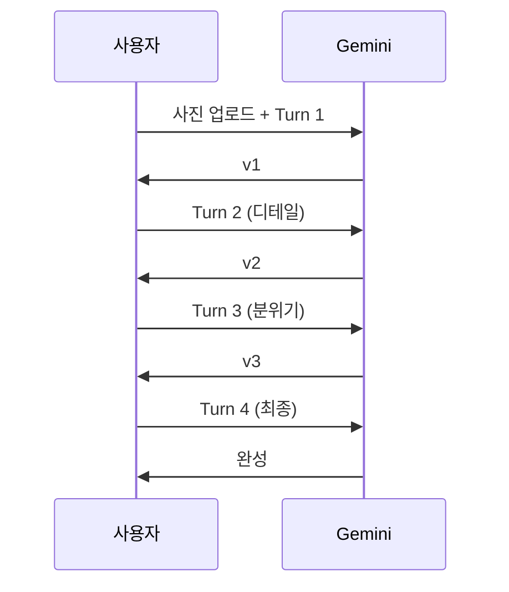

# Gemini 이미지 편집과 변환

> 이미지를 업로드하고, 대화하듯 수정하는 Gemini 편집 워크플로우를 실전 프롬프트와 함께 익힙니다.

## 개요

Gemini의 이미지 편집은 **이미지 업로드 + 텍스트 프롬프트 → 수정된 이미지** 방식입니다. Photoshop으로 30분 걸리던 배경 교체를 프롬프트 한 줄로 처리하고, 대화형으로 점진적 수정까지 가능합니다.

## 편집 프롬프트 핵심 원칙

**원칙 1 — 변경 + 유지를 모두 명시**: 디테일이 부족하면 원하지 않는 부분까지 변경됩니다.

```
(나쁜 예) 배경을 해변으로 바꿔줘
(좋은 예) 이 사진에서 배경을 열대 해변으로 바꿔줘.
인물의 표정, 포즈, 의상은 그대로 유지하고,
원본의 조명 방향과 강도를 맞춰서 자연스러운 그림자를 만들어줘.
```

**원칙 2 — 긍정적 프레이밍**: "~하지 마" 대신 "~해줘"로 묘사하세요.

| 부정적 (비효과적) | 긍정적 (효과적) |
|------------------|----------------|
| "흐릿하지 않게" | "선명하고 또렷하게" |
| "차갑지 않은 분위기로" | "따뜻한 색온도의 분위기로" |
| "사람이 없는 풍경으로" | "넓고 고요한 자연 풍경으로" |
| "너무 화려하지 않게" | "미니멀하고 절제된 톤으로" |

## 5가지 편집 기법


### 기법 1: 배경 교체

```
이 운동화 사진의 배경을 도시 스케이트파크로 바꿔줘.
오후 햇살 아래 콘크리트 바닥에 자연스러운 그림자가 생기도록.
운동화의 색감과 디테일은 그대로 유지해줘.
```


```
이 인물 사진의 배경을 벚꽃이 만개한 공원으로 바꿔줘.
원래 사진의 부드러운 조명 느낌을 유지하고, 인물의 얼굴, 표정, 의상은 전혀 변경하지 마.
```


```
이 제품 사진의 배경을 깨끗한 흰색 스튜디오 배경으로 교체해줘.
제품의 자연스러운 그림자는 유지하고, 색상과 질감은 원본 그대로.
```


> 팁: "원본의 조명 방향과 강도를 유지하면서"를 추가하면 합성 품질이 크게 개선됩니다.

### 기법 2: 요소 추가

"왼쪽 위에"보다 "테이블 위에"처럼 **맥락으로** 위치를 설명하세요.

```
이 빈 나무 테이블 위에 김이 모락모락 나는 라떼 한 잔과 갓 구운 크로아상을 올려줘.
아침 햇살이 비치는 카페 분위기에 맞는 조명으로. 테이블의 나무 질감은 그대로 유지.
```


```
이 제품 주변에 유칼립투스 잎과 작은 조약돌을 자연스럽게 배치해줘.
미니멀한 라이프스타일 촬영 느낌으로. 제품 자체는 전혀 변경하지 않고 소품만 추가.
```


```
이 인물 사진에서 머리 위에 들꽃 느낌의 파스텔 톤 꽃 화관을 자연스럽게 씌워줘.
원본 사진의 부드러운 조명과 어울리게. 인물의 표정과 헤어스타일은 유지.
```


### 기법 3: 요소 제거

**"나머지는 전부 그대로 유지해줘"**를 반드시 추가하세요.

```
이 풍경 사진에서 전봇대와 전선을 제거해줘.
빈 공간은 주변 하늘 패턴으로 자연스럽게 채우고, 나머지는 전부 그대로 유지해줘.
```


```
이 사진에서 티셔츠의 얼룩만 제거해줘.
티셔츠의 원래 색상과 질감을 유지하고, 인물과 배경은 전부 그대로.
```


```
이 이미지에서 오른쪽 하단의 워터마크 텍스트를 제거해줘.
워터마크 아래의 원래 이미지가 자연스럽게 복원되도록. 나머지 영역은 일절 변경하지 마.
```


### 기법 4: 색감/분위기 조정

```
이 도시 풍경을 밤 시간대로 변환해줘. 건물 창문에서 따뜻한 불빛이 새어나오고,
거리에 네온사인 빛이 반사되는 느낌. 건물의 형태와 구도는 그대로 유지.
```


```
이 사진의 채도를 낮추고 필름 그레인을 추가해서 빈티지한 분위기로 만들어줘.
1970년대 코닥 포트라 필름으로 촬영한 느낌. 구도와 피사체는 그대로 유지.
```


```
이 실내 사진을 따뜻한 골든아워 조명으로 바꿔줘.
창문으로 들어오는 주황빛 햇살이 방 안을 비추는 느낌. 가구 배치와 소품은 동일하게 유지.
```


유용한 표현: "새벽 / 골든아워 / 블루아워", "따뜻한 / 차가운", "코닥 포트라 400 / 후지 벨비아 / 흑백 필름"

### 기법 5: 스타일 변환

"약간의 수채화 터치를 입혀줘"(약) vs "완전히 수채화로 변환해줘"(강)으로 강도를 조절하세요.

```
이 반려견 산책 사진을 수채화 스타일 일러스트로 변환해줘.
원래 사진의 구도와 강아지의 모습은 유지하되, 부드러운 수채 번짐과 파스텔 톤을 적용.
```


```
이 산 풍경 사진을 소용돌이치는 임파스토 붓터치와
드라마틱한 팔레트의 유화풍으로 변환해줘. 산의 능선과 하늘의 구도는 유지.
```


```
이 가족 사진을 스튜디오 지브리 애니메이션 스타일로 변환해줘.
부드러운 선과 따뜻한 색감의 2D 애니메이션 느낌으로, 가족 구성원 각각의 특징은 살려줘.
```


## 멀티턴 편집 워크플로우

**큰 변경 → 디테일 → 분위기 → 최종 조정** 순서로 점진적 수정합니다.



커피 머그 제품 사진 → 라이프스타일 콘텐츠 변환 예시:

**Turn 1** — 배경 교체:
```
이 흰 배경의 커피 머그 제품 사진 배경을 따뜻한 분위기의 원목 카페 테이블로 바꿔줘.
머그의 색상, 로고, 형태는 완벽히 유지하고, 테이블 위에 자연스러운 그림자가 생기도록.
```


**Turn 2** — 소품 추가:
```
머그 옆에 작은 접시 위의 시나몬 롤과 유칼립투스 가지를 자연스럽게 배치해줘.
카페 테이블의 조명과 어울리게. 머그는 현재 그대로 유지.
```


**Turn 3** — 분위기:
```
전체적으로 따뜻한 골든아워 색감을 입혀줘. 창문에서 들어오는 부드러운 오후 햇살 느낌.
음식과 소품의 배치는 전혀 건드리지 마.
```


**Turn 4** — 최종:
```
머그에서 김이 살짝 올라오는 효과를 추가해줘. 자연스러운 수증기 느낌으로.
나머지는 전부 그대로 유지.
```


> 4~5턴 넘어가면 이전 수정이 되돌려질 수 있습니다. 중간 결과를 다운로드 후 새 대화에서 이어가세요.

## 참조 이미지 스타일 전환

스타일을 말로 설명하기 어려울 때, 원본 + 참조 이미지를 함께 업로드합니다.

```
첫 번째 사진(카페 인테리어)을 두 번째 사진의 스타일로 변환해줘.
원본의 공간 구도와 가구 배치는 유지하되, 참조 이미지의 색상 팔레트와 질감을 적용해줘.
```


```
첫 번째 사진(인물)에 두 번째 사진의 일러스트 스타일을 적용해줘.
원래 사진의 선과 윤곽은 유지하되 렌더링 스타일만 변경. 조명 방향도 맞춰줘.
```


## 실습: 시즌별 콘텐츠 프로젝트

커피잔 사진 한 장으로 봄/여름/가을/겨울 콘텐츠를 만들어 보세요.

**봄**:
```
이 커피잔 사진의 배경을 벚꽃이 만개한 공원의 야외 테이블로 바꿔줘.
커피잔은 그대로 유지. 테이블 위에 분홍 꽃잎이 흩어져 있도록. 파스텔 핑크 톤의 봄 분위기.
```


**여름**:
```
이 커피잔을 아이스 커피로 바꾸고, 배경을 해변가 나무 데크 테이블로 변경해줘.
잔에 물방울이 맺혀 있고, 옆에 선글라스 배치. 밝고 시원한 블루 톤. 브랜드 로고는 유지.
```


**가을**:
```
배경을 낙엽이 쌓인 공원 벤치로 바꿔줘. 빨간색, 주황색 단풍잎을 흩어놓고,
따뜻한 앰버 톤의 오후 햇살. 커피잔은 원본 그대로, 니트 코스터 위에 올려진 느낌.
```


**겨울**:
```
배경을 눈 내리는 창가로 바꿔줘. 창밖으로 하얀 눈이 보이고, 커피잔에서 김이 올라오는 효과.
따뜻한 실내 조명과 차가운 창밖 대비. 커피잔 옆에 작은 진저브레드 쿠키 배치.
```


## 팁과 주의사항

- Gemini는 원본을 수정하는 것이 아니라 **새 이미지를 생성**합니다. 해상도나 미세한 디테일이 달라질 수 있습니다.
- 복잡한 편집 시 "Think carefully about this edit"을 프롬프트 앞에 추가하면 Thinking 모드가 활성화됩니다.
- 결과가 마음에 안 들 때 같은 프롬프트를 반복하지 마세요. "더 밝게" 대신 "아침 10시의 자연광처럼"으로 바꿔보세요.

## 핵심 정리

| 개념 | 설명 |
|------|------|
| 편집 프롬프트 핵심 | 변경할 것 + 유지할 것을 모두 명시, 긍정적 프레이밍 |
| 5가지 편집 기법 | 배경 교체, 요소 추가, 요소 제거, 색감 조정, 스타일 변환 |
| 멀티턴 편집 | 큰 변경 → 디테일 → 분위기 → 최종 조정 순서로 점진적 수정 |
| 참조 이미지 활용 | 참조 이미지의 스타일을 추출하여 원본에 적용 |
| 중간 저장 | 4~5턴 넘어가면 다운로드 후 새 대화에서 이어가기 |

## 다음 섹션 미리보기

다음 섹션 [ChatGPT vs Gemini 실전 비교와 조합 전략](04-ch4-gemini-이미지-생성-실전/04-04-chatgpt-vs-gemini-실전-비교와-조합-전략.md)에서는 두 플랫폼을 동일한 프로젝트에 나란히 적용하며 실전 비교 테스트를 진행합니다.
