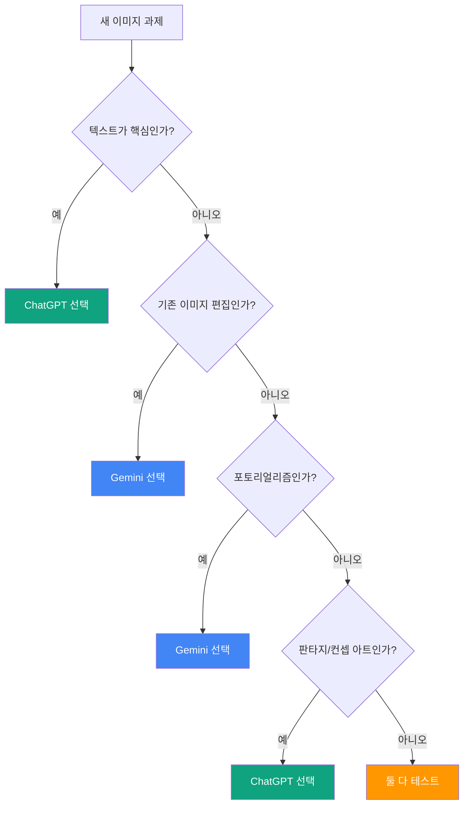

# ChatGPT vs Gemini 실전 비교와 조합 전략

> 같은 프롬프트, 다른 결과. 각 플랫폼의 강점을 조합하면 혼자서는 불가능한 퀄리티를 만들 수 있습니다.

## 개요

ChatGPT는 텍스트 렌더링과 창의적 해석에 강하고, Gemini는 포토리얼리즘과 편집 속도에 강합니다. 이 세션에서는 동일 프롬프트로 차이를 확인하고, 두 플랫폼을 하나의 파이프라인으로 엮는 하이브리드 워크플로우를 실전 프롬프트와 함께 익힙니다.

## 플랫폼 선택 가이드

작업의 핵심 요구사항 하나만 파악하면 플랫폼 선택의 80%가 결정됩니다.



| 영역 | ChatGPT 강점 | Gemini 강점 |
|------|-------------|------------|
| 텍스트 렌더링 | 긴 텍스트도 정확하게 표현 | 짧은 텍스트는 가능, 길면 오류 |
| 포토리얼리즘 | 약간 스타일라이즈됨 | 피부 질감, 조명 디테일 우수 |
| 창의적 해석 | 프롬프트를 확장 해석, 과감한 시안 | 프롬프트에 충실한 결과 |
| 편집 일관성 | 편집마다 전체가 바뀌는 경향 | 멀티턴으로 점진 수정, 원본 유지 |
| 속도 | 30~60초 | 3~5초 |
| 비용 | Plus $20/월 (일 ~30장) | Advanced $20/월 (더 넉넉한 쿼터, API 단가 절반) |

## 비교 프롬프트 실험

같은 프롬프트를 양쪽에 넣고 결과를 비교해봅시다. 각 프롬프트 아래에 예상되는 차이점을 정리했습니다.

### 실험 1: 텍스트가 포함된 포스터

```
Minimal poster design with bold text: 'DESIGN CONFERENCE 2026'
Subtitle: 'Seoul · March 15-17'
Modern typography, dark gradient background, geometric accents
```

- **ChatGPT 예상 결과**: 텍스트가 정확하게 렌더링되고, 타이포그래피 레이아웃이 실제 포스터처럼 완성도 있게 나옴
- **Gemini 예상 결과**: 전체 분위기와 색감은 좋지만, 날짜나 부제목 글자가 뒤섞이거나 철자 오류 발생 가능


### 실험 2: 포토리얼 제품 사진

```
Product photo: white ceramic coffee mug on a marble table
Soft natural window light from the left, shallow depth of field
Clean minimal background, 85mm lens look
```

- **ChatGPT 예상 결과**: 깔끔하지만 약간 CG 느낌, 조명이 균일하게 처리됨
- **Gemini 예상 결과**: 실제 카메라로 촬영한 듯한 자연스러운 빛 번짐과 보케 효과


### 실험 3: 판타지 컨셉 아트

```
Ancient dragon perched on a crumbling Gothic cathedral
Moonlit sky with aurora borealis, cinematic lighting
Epic fantasy concept art style, wide angle
```

- **ChatGPT 예상 결과**: 드라마틱한 구도와 디테일, 영화 포스터급 완성도. 용의 질감과 건축 디테일이 풍부
- **Gemini 예상 결과**: 전체 분위기는 좋지만 디테일이 단순화되는 경향. 사실적인 톤으로 해석


### 실험 4: 감성 카페 인테리어

```
A cozy Italian cafe interior, warm afternoon light streaming through windows
Vintage wooden furniture, espresso machine on counter
35mm film photography aesthetic, warm color grading
```

- **ChatGPT 예상 결과**: 필름 감성의 색감은 잘 잡지만, 때로 과도하게 연출된 느낌
- **Gemini 예상 결과**: 자연스러운 조명 처리, 실제 공간에 있는 듯한 현장감


### 실험 5: 수채화 스타일

```
Watercolor painting of a Japanese garden in autumn
Soft wet-on-wet brushstrokes, muted warm palette
Red maple leaves floating on a stone pond
```

- **ChatGPT 예상 결과**: 수채화 "스타일"을 적극 해석해서 과감한 번짐과 색 혼합 표현
- **Gemini 예상 결과**: 깔끔하고 정돈된 수채화, 실제 종이 질감 재현이 자연스러움


## 하이브리드 워크플로우 3패턴

### 패턴 A: 창작(ChatGPT) + 편집(Gemini)

가장 범용적인 조합입니다. ChatGPT의 창의력으로 초안을 뽑고, Gemini의 편집 안정성으로 다듬습니다.

**Step 1 — ChatGPT에서 컨셉 생성:**
```
A futuristic rooftop garden cafe in Seoul, sunset golden hour
A woman in linen clothes doing yoga, cinematic lighting
Lush green plants and modern glass architecture
```

**Step 2 — 결과 이미지를 Gemini에 업로드 후 편집:**
```
배경 건물의 색을 따뜻한 테라코타 톤으로 바꿔줘.
인물은 그대로 유지하고 배경만 수정해.
```

**Step 3 — Gemini에서 추가 조정:**
```
하늘의 석양 빛을 더 강렬하게 만들어줘.
전체적으로 필름 그레인을 살짝 추가해줘.
```


### 패턴 B: 텍스트(ChatGPT) + 비주얼(Gemini) 분리

텍스트가 포함된 디자인에서 가장 효과적입니다.

**Step 1 — Gemini에서 배경 비주얼 생성:**
```
Overhead flat lay photo of coffee beans, dried flowers,
and a ceramic plate on a rustic wooden table
Natural soft lighting, warm tones, no text
```

**Step 2 — ChatGPT에서 텍스트 오버레이 생성:**
```
Design a text overlay on transparent-style background:
Title: 'Autumn Blend'
Subtitle: 'Single Origin Ethiopia'
Elegant serif typography, cream and brown color scheme
```

**Step 3 — Photoshop/Canva에서 두 레이어를 합성**


### 패턴 C: A/B 테스트 — 동시 생성 후 비교 선택

방향이 불확실할 때 유용합니다. 동일 프롬프트를 양쪽에 던지고 클라이언트에게 2개 시안을 제시합니다.

```
Instagram story image for a yoga studio grand opening
Serene morning atmosphere, minimalist design
Include the text: 'NOW OPEN' in clean sans-serif font
Soft pastel color palette
```

- **ChatGPT 시안**: 텍스트가 정확하고, 그래픽 디자인 완성도 높음
- **Gemini 시안**: 사진 같은 자연스러움, 텍스트는 불안정할 수 있지만 분위기 우수

Gemini는 3~5초면 나오니 시간 부담 없이 양쪽 모두 시도할 수 있습니다.

## 실전 프로젝트: 카페 SNS 콘텐츠 3종 세트

클라이언트 요청: "인스타그램용 이미지 3장 — (1) 매장 감성 사진, (2) 시즌 메뉴 포스터, (3) 할인 이벤트 카드"

### 이미지 1: 매장 감성 사진 → Gemini

포토리얼리즘이 핵심이므로 Gemini를 선택합니다.

```
Cozy corner of a modern Korean cafe, warm afternoon sunlight
A latte art coffee on a wooden table next to a small succulent plant
Soft bokeh background showing bookshelves, 50mm portrait lens
Film photography color grading
```


### 이미지 2: 시즌 메뉴 포스터 → ChatGPT

텍스트 정확도가 핵심이므로 ChatGPT를 선택합니다.

```
Seasonal menu poster for a cafe, vertical format
Title: 'Autumn Special Menu'
Items listed:
- Maple Latte ₩5,500
- Chestnut Brownie ₩4,800
- Pumpkin Scone ₩3,900
Warm autumn colors, hand-drawn illustration style border
Clean readable typography
```


### 이미지 3: 할인 이벤트 카드 → ChatGPT + Gemini 하이브리드

텍스트와 비주얼 모두 중요하므로 패턴 B를 적용합니다.

**Gemini로 배경:**
```
Flat lay photo of autumn leaves, cinnamon sticks, and a coffee cup
on a cream linen fabric, soft warm lighting, no text
```

**ChatGPT로 텍스트 요소:**
```
Event announcement card design:
Big text: '30% OFF'
Subtitle: 'Grand Opening Week · Oct 7-13'
Bold modern typography, transparent background style
```

**합성 후 최종 결과:**


## 실습

아래 프롬프트를 ChatGPT와 Gemini 양쪽에서 실행하고, 결과를 비교해보세요.

**과제 1**: 위 비교 프롬프트 실험 5개 중 3개를 골라 직접 실행하고, 각 항목(프롬프트 충실도, 시각 품질, 텍스트 정확도, 속도)을 1~5점으로 평가해보세요.

**과제 2**: 본인의 실제 프로젝트 하나를 골라, 어떤 패턴(A/B/C)으로 조합할지 계획을 세우고 실행해보세요. 플랫폼 간 이미지를 넘길 때는 PNG 형식을 사용하세요.

## 팁과 주의사항

> **이미지 전달 형식**: 하이브리드 워크플로우에서 플랫폼 간 이미지를 넘길 때는 항상 **PNG 형식**을 사용하세요. JPEG 압축 아티팩트가 편집 품질을 떨어뜨립니다.

> **프롬프트 언어**: 두 플랫폼 모두 **영어 프롬프트**가 더 정밀한 결과를 만듭니다. 특히 Gemini는 영어와 한국어 프롬프트 간 품질 차이가 큽니다.

> **유료 = 최고가 아님**: 무료 Gemini가 포토리얼리즘에서 유료 ChatGPT를 앞서는 경우가 흔합니다. 과제 유형이 품질을 결정하지, 가격이 결정하지 않습니다.

> **탐색은 Gemini, 마감은 ChatGPT**: 아이디어 스케치 단계에서는 빠르고 무료 쿼터가 넉넉한 Gemini로 실험하고, 최종 시안에서 텍스트 정밀도가 필요한 부분만 ChatGPT 쿼터를 투자하세요.

## 핵심 정리

| 항목 | 요약 |
|------|------|
| 텍스트 렌더링 | ChatGPT 압도적 우위 |
| 포토리얼리즘 | Gemini 우위 |
| 편집 일관성 | Gemini 우위 (멀티턴 점진 수정) |
| 창의적 해석 | ChatGPT 우위 (판타지, 컨셉 아트) |
| 속도/비용 | Gemini 우위 (3~5초, API 단가 절반) |
| 패턴 A | ChatGPT 창작 + Gemini 편집 |
| 패턴 B | Gemini 비주얼 + ChatGPT 텍스트 + 합성 |
| 패턴 C | 양쪽 동시 생성 + A/B 비교 선택 |

## 다음 챕터 미리보기

두 플랫폼을 자유자재로 오갈 수 있게 되었습니다. 다음 챕터 [Ch5. Midjourney 기본과 파라미터 튜닝](05-ch5-midjourney-기본과-파라미터-튜닝/01-01-midjourney-인터페이스와-기본-생성.md)에서는 세 번째 주력 도구인 Midjourney의 세계로 들어갑니다. `--ar`, `--stylize` 같은 파라미터 시스템과 ChatGPT/Gemini와는 또 다른 차원의 미학적 표현력을 경험하게 됩니다.
