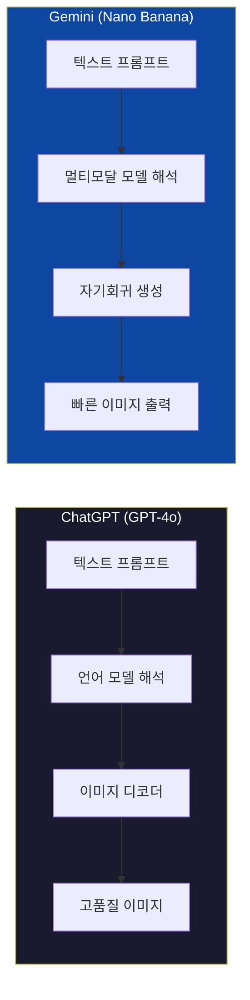
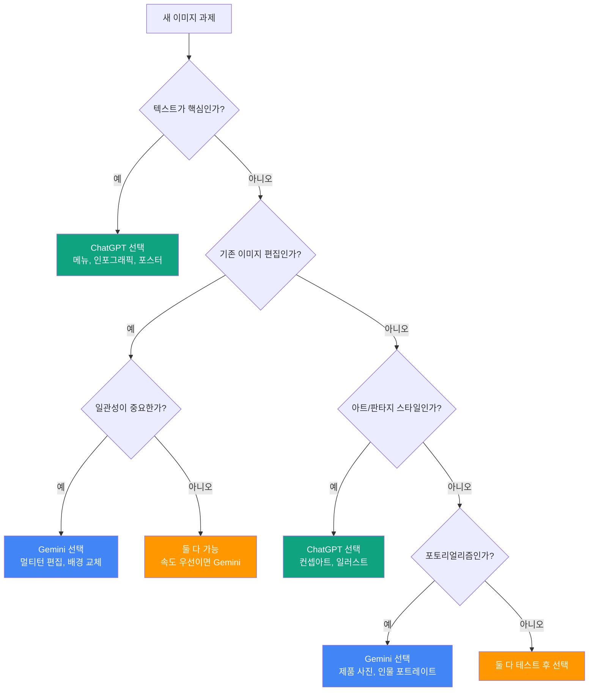
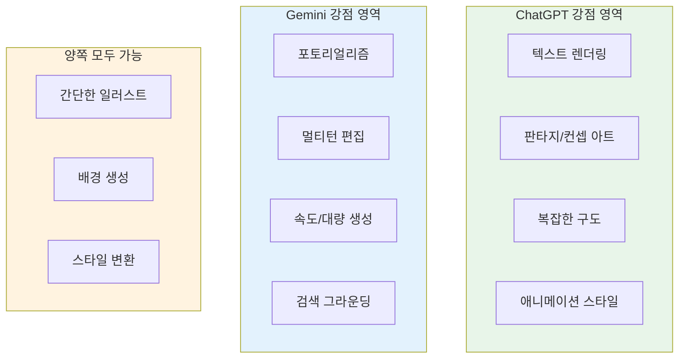
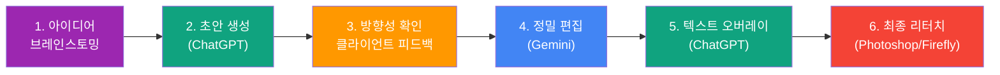
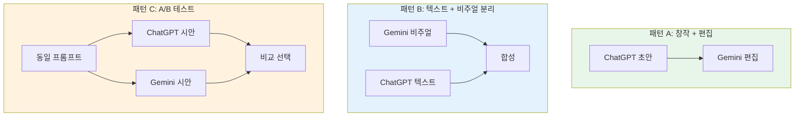
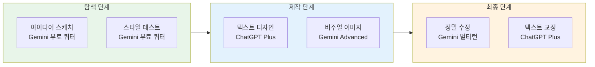

# ChatGPT vs Gemini 실전 비교와 조합 전략

> 동일한 프롬프트를 두 플랫폼에 던졌을 때 어떤 차이가 나타날까? 각자의 강점을 조합하면 어떤 워크플로우가 가능할까?

## 개요

이 섹션에서는 지금까지 개별적으로 다뤘던 ChatGPT와 Gemini를 **동일한 과제 위에 나란히 놓고** 실전 비교합니다. 같은 프롬프트인데 결과물이 전혀 달라지는 순간을 직접 확인하고, 각 플랫폼이 빛나는 시나리오를 정리한 뒤, 두 플랫폼을 하나의 파이프라인으로 엮는 **하이브리드 워크플로우**까지 설계해봅니다.

**선수 지식**: [ChatGPT 이미지 생성의 특징과 강점](03-ch3-chatgpt-이미지-생성-실전/01-01-gpt-4o-이미지-생성의-특징과-강점.md)과 [Gemini 이미지 생성의 특징과 접근법](04-ch4-gemini-이미지-생성-실전/01-01-gemini-이미지-생성의-특징과-접근법.md), 그리고 각 플랫폼의 편집 기능을 다룬 [이미지 업로드와 편집—Select 도구 활용](03-ch3-chatgpt-이미지-생성-실전/04-04-이미지-업로드와-편집-select-도구-활용.md)과 [Gemini 이미지 편집과 변환](04-ch4-gemini-이미지-생성-실전/03-03-gemini-이미지-편집과-변환.md)의 내용을 숙지하고 있어야 합니다.

**학습 목표**:
- 동일 프롬프트에서 두 플랫폼의 결과 차이를 구체적으로 분석할 수 있다
- 시나리오별로 최적의 플랫폼을 즉시 선택할 수 있다
- 두 플랫폼을 조합한 하이브리드 워크플로우를 설계하고 적용할 수 있다

## 왜 알아야 할까?

요리사가 칼을 하나만 쓰지 않듯, 크리에이터도 도구를 하나만 고집할 이유가 없습니다. ChatGPT는 "상상력의 폭발"에 강하고, Gemini는 "현실감과 일관성"에 강하죠. 문제는 **언제 어떤 칼을 꺼내야 하는지** 아는 것입니다.

실무에서 흔히 벌어지는 상황을 떠올려보세요. 클라이언트가 "SNS 카드뉴스 시안 3장, 내일까지"라고 합니다. 텍스트가 많은 인포그래픽 카드는 ChatGPT로, 제품 사진 위에 배경을 바꾸는 카드는 Gemini로 만들면 어떨까요? 이렇게 **상황 판단력**이 곧 작업 속도와 품질을 좌우합니다. 이번 섹션은 그 판단력을 갖추기 위한 최종 비교 실습입니다.

## 핵심 개념

### 개념 1: 동일 프롬프트, 다른 결과 — 왜 차이가 날까?

> 💡 **비유**: 같은 레시피를 두 셰프에게 주면 요리가 다르듯, AI 모델도 아키텍처(요리 방식)가 다르면 결과물이 달라집니다. 한 셰프는 프렌치 정찬 스타일로, 다른 셰프는 가정식 스타일로 해석하는 것과 같죠.

ChatGPT(GPT-4o)와 Gemini(Nano Banana 시리즈)는 이미지를 만드는 **내부 방식** 자체가 다릅니다. GPT-4o의 구체적인 이미지 생성 아키텍처는 공개되지 않았지만, 결과물의 특성 — 정교한 텍스트 렌더링, 높은 디테일 충실도 — 으로 미루어 **디퓨전 기반에 가까운 접근법**을 활용하는 것으로 추정됩니다. 반면 Gemini의 Nano Banana 모델은 자기회귀(auto-regressive) 방식으로 이미지를 토큰 단위로 생성하기 때문에 **속도**와 **편집 시 일관성 유지**에 유리하거든요.

> 📊 **그림 1**: 두 플랫폼의 이미지 생성 방식 비교

이 아키텍처 차이가 실제 결과에서 어떻게 드러나는지 구체적으로 살펴보겠습니다.

**텍스트 렌더링 차이**: "카페 메뉴판을 손글씨 스타일로" 같은 프롬프트를 던지면, ChatGPT는 글자 하나하나가 정확하게 읽히는 메뉴판을 만들어냅니다. 반면 Gemini는 정보량이 많아지면 글자가 뒤엉키거나 철자가 틀리는 경향이 있어요. 이건 결함이 아니라 모델 아키텍처의 특성이에요 — 자기회귀 방식은 토큰 단위로 이미지를 예측하기 때문에 긴 텍스트 시퀀스에서 정확도가 떨어질 수 있습니다.

**사실적 표현 차이**: 반대로 "골든아워에 호숫가에 앉아 있는 여성의 포트레이트"를 요청하면, Gemini가 피부 질감, 빛의 반사, 머리카락 디테일에서 한층 사실적인 결과를 내놓는 경우가 많습니다. ChatGPT는 오히려 약간 스타일라이즈된 — 영화 포스터 같은 — 결과를 만드는 편이죠.

**속도 차이**: Gemini는 대부분의 이미지를 3~5초 안에 생성합니다. ChatGPT는 동일한 프롬프트에 30~60초 이상 걸리는 경우도 흔하고요. 마감이 촉박할 때 이 차이는 결정적입니다.

> ⚠️ **흔한 오해**: "한 플랫폼이 모든 면에서 더 낫다"고 생각하기 쉽지만, 실제로는 과제 유형에 따라 승자가 달라집니다. 텍스트 렌더링은 ChatGPT, 포토리얼리즘은 Gemini, 속도도 Gemini — 만능 도구는 없습니다.

### 개념 2: 시나리오별 플랫폼 선택 매트릭스

> 💡 **비유**: 병원의 트리아지(triage) 시스템을 떠올려보세요. 환자(= 과제)의 증상(= 요구사항)에 따라 어느 진료과(= 플랫폼)로 보낼지 즉시 판단하는 거예요. "텍스트가 많다 → ChatGPT", "기존 사진 편집이다 → Gemini"처럼요.

수많은 비교 테스트 결과를 종합하면, 과제의 핵심 요구사항에 따라 플랫폼 선택이 명확하게 갈립니다.

> 📊 **그림 2**: 시나리오별 플랫폼 선택 플로차트

좀 더 구체적으로 정리하면 이렇습니다.

**ChatGPT가 우위인 시나리오**:
- **텍스트가 포함된 디자인**: 메뉴판, 인포그래픽, 타이포그래피 포스터, 배너 — ChatGPT만이 긴 텍스트를 정확히 렌더링합니다
- **판타지·컨셉 아트**: 독창적이고 과감한 시각적 해석이 필요할 때, ChatGPT는 프롬프트를 "확장 해석"하여 예상 이상의 창의적 결과를 만들어냅니다
- **애니메이션·만화 스타일**: Gemini보다 다양한 일러스트 스타일을 안정적으로 구현합니다
- **복잡한 구도 지시**: "왼쪽에 A, 오른쪽에 B, 배경에 C"처럼 공간 배치가 까다로운 프롬프트를 더 정확하게 해석합니다

**Gemini가 우위인 시나리오**:
- **포토리얼리즘**: 제품 사진, 인물 포트레이트, 풍경 등 "진짜 사진 같은" 결과가 필요할 때
- **기존 이미지 편집**: 배경 교체, 요소 추가·제거, 색감 조정 등 멀티턴 대화로 점진적 수정할 때
- **캐릭터 일관성**: 동일 캐릭터를 다른 장면에 반복 배치할 때, 편집 간 일관성이 더 안정적
- **대량·빠른 생성**: 무료 쿼터가 넉넉하고(일일 수십 장), 생성 속도도 3~5초로 빠릅니다
- **검색 그라운딩**: 최신 트렌드나 실존하는 장소·제품에 기반한 이미지를 만들 때

> 📊 **그림 3**: 플랫폼별 강점 영역 매핑

> 🔥 **실무 팁**: 프로젝트 시작 전에 "이 작업의 핵심 요구사항이 뭐지?"를 먼저 자문하세요. 텍스트 정확도? 사실감? 속도? 편집 반복? 이 한 가지 질문으로 플랫폼 선택이 80% 결정됩니다.

### 개념 3: 하이브리드 워크플로우 — 두 플랫폼 조합 전략

> 💡 **비유**: 축구에서 공격수와 수비수의 역할이 다르듯, ChatGPT는 "창작 공격수", Gemini는 "편집 미드필더"로 배치하는 전략입니다. 한 선수에게 모든 걸 맡기는 게 아니라, 각자의 포지션에서 최고의 퍼포먼스를 끌어내는 거죠.

실무에서 가장 효율적인 접근법은 **한 플랫폼만 고집하지 않는 것**입니다. 두 플랫폼의 강점을 이어붙이면, 단독으로는 불가능했던 퀄리티와 속도를 동시에 확보할 수 있어요.

> 📊 **그림 4**: 하이브리드 워크플로우 파이프라인

이 파이프라인의 각 단계를 살펴볼게요.

**패턴 A: 창작 → 편집 파이프라인**

가장 일반적인 조합입니다. ChatGPT로 창의적인 초안을 만들고, 그 이미지를 Gemini에 업로드해서 세밀하게 다듬는 방식이에요.

1. **ChatGPT에서 컨셉 이미지 생성**: "미래 도시의 옥상 정원에서 요가하는 여성, 시네마틱 조명" → 독창적인 시안 확보
2. **결과 이미지를 Gemini에 업로드**: "배경의 건물 색을 따뜻한 테라코타 톤으로 바꿔줘" → 색감 조정
3. **추가 편집 요청**: "하늘에 석양 빛을 더 강하게" → 멀티턴으로 점진 수정

이 패턴은 ChatGPT의 **상상력**과 Gemini의 **편집 정밀도**를 모두 활용합니다.

**패턴 B: 텍스트 + 비주얼 분리 생산**

텍스트가 포함된 디자인에서 특히 효과적입니다.

1. **Gemini에서 배경·비주얼 요소 생성**: 포토리얼한 배경 이미지, 제품 사진 등
2. **ChatGPT에서 텍스트 오버레이 이미지 생성**: 타이포그래피, 로고 텍스트, 캡션이 정확하게 들어간 레이어
3. **Photoshop에서 합성**: 두 결과물을 레이어로 합쳐 최종 디자인 완성

**패턴 C: A/B 테스트 — 양쪽 결과물 비교 후 선택**

방향성이 불확실할 때 유용합니다. 동일 프롬프트를 양쪽에 동시에 던지고, 클라이언트에게 두 가지 시안을 제시하는 거죠. 실제로 많은 프리랜서 디자이너들이 이 방식을 쓰고 있어요. Gemini의 빠른 속도 덕분에 시간 부담도 크지 않습니다.

> 📊 **그림 5**: 세 가지 하이브리드 패턴 비교

### 개념 4: 비용과 쿼터 — 현실적인 운영 전략

> 💡 **비유**: 휴대폰 요금제를 두 개 쓸 때처럼, 어떤 작업에 어느 요금제(플랫폼)의 무료 쿼터를 쓸지 전략적으로 배분하는 것이 핵심입니다.

비용 구조를 이해하면 워크플로우가 더 현실적이 됩니다.

| 항목 | ChatGPT | Gemini |
|------|---------|--------|
| **무료 쿼터** | 일 2~3장 | 일 수십 장 (넉넉) |
| **유료 플랜** | Plus $20/월 (일 30~33장) | Advanced $19.99/월 (더 많은 쿼터) |
| **API 단가** | $0.04~$0.167/장 | $0.02~$0.06/장 |
| **생성 속도** | 30~60초 | 3~5초 |
| **최대 해상도** | 1024x1024 (기본) | 최대 4K |

이 숫자들이 의미하는 바는 명확합니다. **탐색·실험 단계**에서는 무료 쿼터가 넉넉하고 빠른 Gemini를 아이디어 스케치 용도로 활용하고, **최종 시안 제작**에서 ChatGPT의 정밀함이 필요한 부분에만 Plus 쿼터를 투자하는 전략이 가장 경제적이에요.

> 📊 **그림 6**: 프로젝트 단계별 쿼터 배분 전략

> 💡 **알고 계셨나요?**: Google API 기준으로 Gemini의 이미지 생성 단가는 ChatGPT의 절반 이하입니다. 월 5만 장 이상 대량 생성하는 마케팅 에이전시라면 이 차이가 수백만 원의 비용 절감으로 이어질 수 있죠.

## 실습: 적용해보기

### 활동 1: 동일 프롬프트 비교 실험

아래 5가지 프롬프트를 ChatGPT와 Gemini 양쪽에서 실행하고, 결과를 비교 분석표에 기록해보세요.

**프롬프트 세트**:

| # | 프롬프트 | 핵심 평가 포인트 |
|---|---------|----------------|
| 1 | "A cozy Italian cafe interior, warm afternoon light, vintage decor, 35mm film photography" | 분위기, 사실감, 디테일 |
| 2 | "Minimal poster design with text: 'Design Conference 2026', modern typography, gradient background" | 텍스트 정확도, 레이아웃 |
| 3 | "A golden retriever wearing a tiny chef hat, cooking pasta in a professional kitchen" | 창의적 해석, 유머, 구도 |
| 4 | "Product photo: white ceramic mug on marble table, natural light, clean background" | 제품 사진 퀄리티, 사실감 |
| 5 | "Watercolor painting of a Japanese garden in autumn, soft brushstrokes" | 예술 스타일 재현, 질감 |

**비교 분석 워크시트**:

각 프롬프트에 대해 다음 항목을 1~5점으로 평가하세요.

| 평가 항목 | ChatGPT | Gemini | 비고 |
|-----------|---------|--------|------|
| 프롬프트 충실도 | /5 | /5 | 요청한 요소가 모두 반영되었나? |
| 시각적 품질 | /5 | /5 | 해상도, 디테일, 일관성 |
| 텍스트 정확도 | /5 | /5 | 글자가 정확히 읽히는가? |
| 생성 속도 | /5 | /5 | 체감 대기 시간 |
| 수정 용이성 | /5 | /5 | 후속 편집이 쉬운가? |

### 활동 2: 하이브리드 워크플로우 실전 연습

**시나리오**: 당신은 프리랜서 디자이너입니다. 로컬 카페 클라이언트가 다음을 요청했습니다.

> "인스타그램용 이미지 3장이 필요해요. (1) 매장 분위기를 보여주는 감성 사진, (2) 이번 달 시즌 메뉴 포스터, (3) 할인 이벤트 안내 카드"

**과제**: 각 이미지를 어떤 플랫폼으로 만들지, 그리고 왜 그 선택을 했는지 아래 표에 적어보세요.

| 이미지 | 선택 플랫폼 | 선택 이유 | 작업 순서 |
|--------|-----------|-----------|-----------|
| (1) 매장 감성 사진 | ? | ? | ? |
| (2) 시즌 메뉴 포스터 | ? | ? | ? |
| (3) 할인 이벤트 카드 | ? | ? | ? |

**힌트**: (1)은 포토리얼리즘이 핵심, (2)는 메뉴 텍스트 정확도가 핵심, (3)은 "30% OFF" 같은 텍스트 + 시각 요소 조합이 핵심입니다.

### 활동 3: 토론 질문

1. 두 플랫폼의 무료 쿼터만으로 소규모 프로젝트를 완수할 수 있을까요? 한계는 어디에 있을까요?
2. 클라이언트에게 "AI로 만들었다"고 알려야 할까요? AI 생성 이미지의 SynthID 워터마크와 메타데이터를 어떻게 관리해야 할까요?
3. 만약 Midjourney까지 추가한다면 3자 워크플로우는 어떻게 구성할 수 있을까요?

## 더 깊이 알아보기

### 두 모델은 왜 이렇게 다른 결과를 만들까?

2025년은 AI 이미지 생성의 "네이티브 멀티모달" 시대가 열린 해였습니다. 그 전까지 ChatGPT는 DALL·E라는 별도의 이미지 생성 모델을 호출하는 방식이었어요. 텍스트를 이해하는 뇌와 이미지를 만드는 뇌가 분리되어 있던 셈이죠. 그런데 2025년 3월, OpenAI가 GPT-4o에 이미지 생성 기능을 직접 내장하면서 판도가 바뀌었습니다. 텍스트와 이미지를 **하나의 모델**이 동시에 이해하고 만들어내는 시대가 온 거예요.

구글도 비슷한 시기에 움직였습니다. Gemini 2.0 Flash에 이미지 생성 기능을 탑재한 뒤, 2025년 하반기에 Nano Banana라는 코드명으로 본격적인 이미지 생성 모델 시리즈를 출시했죠. 그리고 2026년 2월에는 Nano Banana 2(Gemini 3.1 Flash Image)까지 공개하며 속도와 텍스트 렌더링을 크게 개선했습니다.

흥미로운 점은 두 회사가 **다른 기술적 경로**를 선택했다는 것입니다. OpenAI는 GPT-4o의 내부 이미지 디코더 구조를 공개하지 않았지만, 결과물의 높은 텍스트 충실도와 프롬프트 해석 정밀도로 미루어 디퓨전 기반 요소를 포함한 접근법을 취한 것으로 추정됩니다. Google은 자기회귀 방식으로 이미지를 토큰 단위로 생성하는 방향을 명시적으로 택했어요. 마치 같은 목적지를 향해 다른 길을 걷는 두 탐험가처럼 — 이 기술적 분기가 오늘날 우리가 경험하는 결과물의 차이를 만들어내고 있는 거죠.

### "벤치마크의 함정"

온라인에서 "ChatGPT vs Gemini 이미지 비교"를 검색하면 수없이 많은 벤치마크 글이 나옵니다. 그런데 주의해야 할 점이 있어요. 이런 비교들은 대부분 **특정 시점의 특정 버전**에서 테스트한 결과입니다. 두 플랫폼 모두 거의 매달 업데이트되고 있기 때문에, 3개월 전의 비교 결과가 지금은 뒤집혀 있을 수 있습니다. 예를 들어, Gemini의 초기 이미지 생성은 텍스트 렌더링이 상당히 부족했지만, Nano Banana 2에서 눈에 띄게 개선되었거든요. 따라서 **남이 한 비교를 맹신하기보다, 직접 비교 실험을 주기적으로 해보는 습관**이 훨씬 중요합니다.

## 흔한 오해와 팁

> ⚠️ **흔한 오해**: "ChatGPT가 유료니까 무조건 Gemini보다 좋겠지." 실제로는 무료 Gemini가 포토리얼리즘과 편집 일관성에서 유료 ChatGPT를 앞서는 경우가 흔합니다. 가격과 품질은 비례하지 않아요 — 과제 유형이 결정적입니다.

> 💡 **알고 계셨나요?**: ChatGPT와 Gemini 모두 생성 과정에서 이미지를 자체 평가하는 메커니즘을 갖고 있습니다. ChatGPT는 여러 후보 이미지를 내부적으로 만든 뒤 최선을 골라서 보여주는 "자기 평가(self-evaluation)" 방식을 사용하는 것으로 알려져 있어요. 이것이 속도가 느린 대신 품질이 높은 이유 중 하나입니다.

> 🔥 **실무 팁**: 하이브리드 워크플로우에서 **이미지를 플랫폼 간에 넘길 때는 항상 PNG 형식을 사용**하세요. JPEG 압축 아티팩트가 두 번째 플랫폼의 편집 품질을 떨어뜨릴 수 있습니다. 또한 Gemini에 이미지를 업로드할 때는 가능하면 최대 해상도로 전달하는 것이 편집 결과가 좋습니다.

> 🔥 **실무 팁**: 프롬프트를 두 플랫폼에 동시에 테스트할 때, Gemini에는 **영어 프롬프트**를 사용하는 것이 결과 품질이 더 좋습니다. 한국어도 지원하지만, 영어 프롬프트가 더 정밀한 해석을 이끌어내는 경우가 많거든요. ChatGPT는 한국어 프롬프트도 상대적으로 잘 처리합니다.

## 핵심 정리

| 개념 | 설명 |
|------|------|
| 아키텍처 차이 | ChatGPT는 내부 구조 비공개(결과물 특성상 디퓨전 계열 추정, 정밀 + 느림), Gemini는 자기회귀 기반(빠름 + 일관성) |
| 텍스트 렌더링 | ChatGPT 압도적 우위 — 메뉴판, 포스터, 인포그래픽에 필수 선택 |
| 포토리얼리즘 | Gemini 우위 — 제품 사진, 인물 포트레이트, 풍경에 적합 |
| 편집 일관성 | Gemini 우위 — 멀티턴 대화로 점진 수정 시 원본 유지력이 높음 |
| 창의적 해석 | ChatGPT 우위 — 판타지, 컨셉 아트, 애니메이션 스타일에 강점 |
| 속도·비용 | Gemini 우위 — 3~5초 생성, 무료 쿼터 넉넉, API 단가 절반 이하 |
| 하이브리드 패턴 A | ChatGPT 창작 → Gemini 편집 (가장 범용적인 조합) |
| 하이브리드 패턴 B | Gemini 비주얼 + ChatGPT 텍스트 → 합성 (텍스트 포함 디자인에 최적) |
| 하이브리드 패턴 C | 양쪽 동시 생성 → A/B 비교 선택 (방향 불확실할 때) |

## 다음 섹션 미리보기

이제 ChatGPT와 Gemini라는 두 개의 강력한 도구를 자유자재로 오갈 수 있게 되었습니다. 다음 챕터 [Midjourney 인터페이스와 기본 생성](05-ch5-midjourney-기본과-파라미터-튜닝/01-01-midjourney-인터페이스와-기본-생성.md)에서는 세 번째 주력 도구인 **Midjourney**의 세계로 들어갑니다. Discord 기반의 독특한 인터페이스, `--ar`, `--stylize` 같은 파라미터 시스템, 그리고 ChatGPT·Gemini와는 또 다른 차원의 미학적 표현력을 경험하게 될 거예요. 세 플랫폼을 모두 손에 넣으면, [실무 시나리오별 플랫폼 선택 가이드](01-ch1-ai-이미지-생성-개론/05-05-실무-시나리오별-플랫폼-선택-가이드.md)에서 봤던 선택 기준이 완전히 새로운 의미로 다가올 겁니다.

## 참고 자료

- [Introducing 4o Image Generation — OpenAI](https://openai.com/index/introducing-4o-image-generation/) - GPT-4o 네이티브 이미지 생성 기능의 공식 발표와 기술 개요
- [Nano Banana Image Generation — Google Gemini API](https://ai.google.dev/gemini-api/docs/image-generation) - Gemini 이미지 생성 모델의 공식 문서, 지원 해상도·모델별 기능 비교
- [ChatGPT vs Gemini Image Generation — God of Prompt](https://www.godofprompt.ai/blog/chatgpt-vs-gemini-image-generation) - 두 플랫폼의 강점·약점·가격·워크플로우를 상세 비교한 실전 가이드
- [ChatGPT vs Gemini Native Image Generation: Who Does It Better? — Beebom](https://beebom.com/chatgpt-vs-gemini-native-image-generation/) - 동일 프롬프트 기반 텍스트 렌더링, 포토리얼리즘, 속도 비교 테스트 결과
- [Introducing Gemini 2.5 Flash Image — Google Developers Blog](https://developers.googleblog.com/introducing-gemini-2-5-flash-image/) - Nano Banana 모델 시리즈의 기술적 배경과 발전 과정

---
### 🔗 Related Sessions
- [nano banana 시리즈](04-ch4-gemini-이미지-생성-실전/01-01-gemini-이미지-생성의-특징과-접근법.md) (prerequisite)
