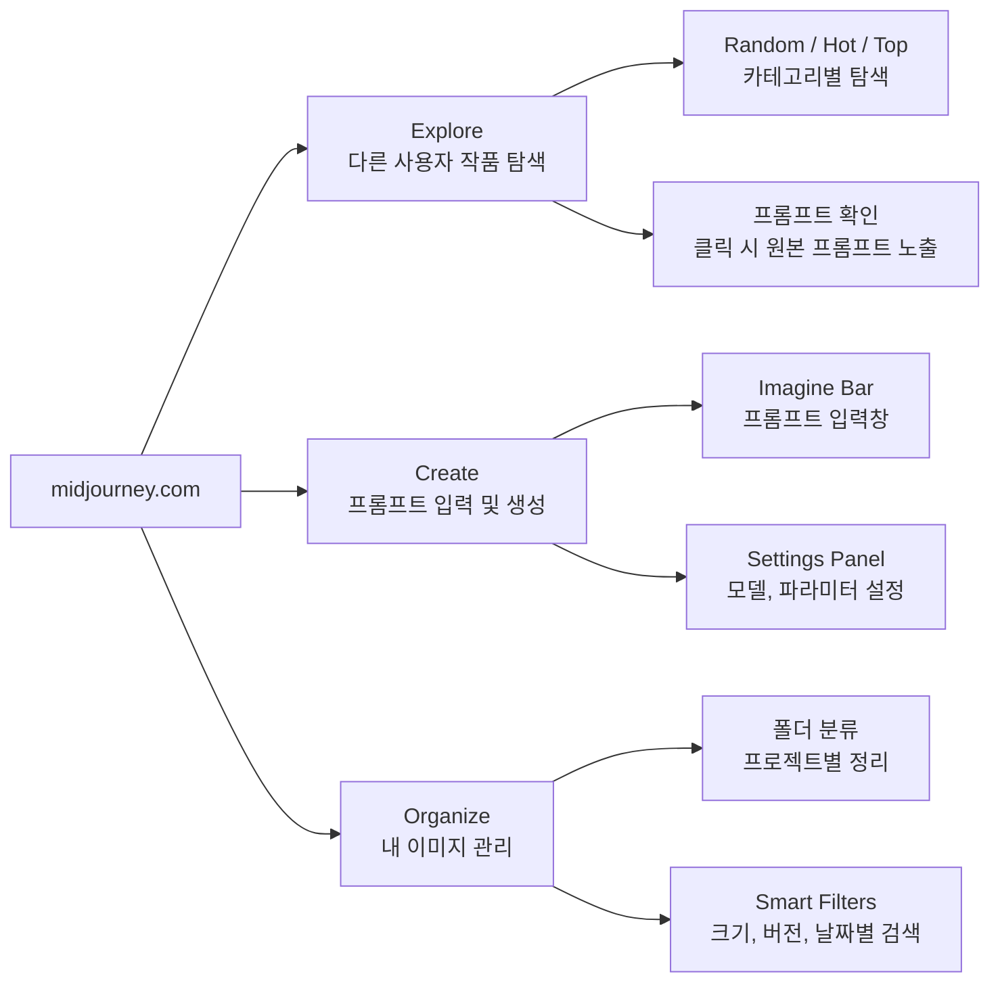
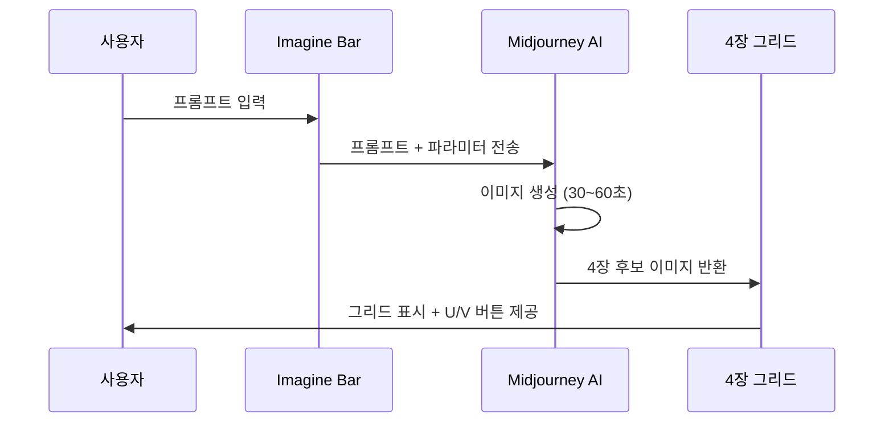
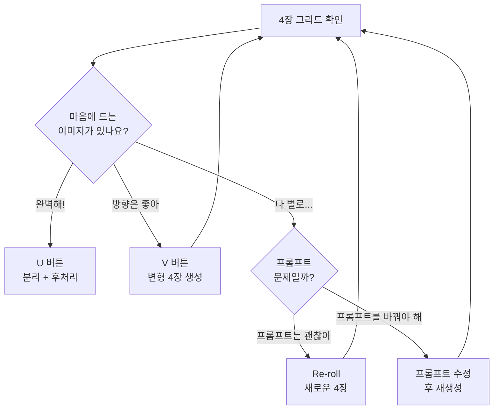

# Midjourney 인터페이스와 기본 생성

> *Midjourney 웹 인터페이스를 탐색하고, 첫 이미지를 생성하며, 그리드에서 원하는 결과를 선택하는 워크플로우를 익힙니다.*

## 개요

Midjourney는 심미적 완성도가 결과물의 가치를 좌우하는 작업 — 광고 비주얼, 컨셉 아트, 브랜드 에셋 — 에서 독보적인 강점을 보이는 이미지 생성 도구입니다. 이 섹션에서는 웹 인터페이스의 세 가지 핵심 영역(Explore, Create, Organize)을 살펴보고, Imagine Bar에 프롬프트를 입력해 4장 그리드를 생성한 뒤 U/V 버튼으로 원하는 이미지를 골라내는 전체 흐름을 다룹니다. Vary Region을 활용한 부분 수정과 Draft Mode를 활용한 효율적 실험까지 익히면, 이후 배울 파라미터 튜닝을 자신 있게 적용할 수 있습니다.

## 웹 인터페이스 3대 영역

midjourney.com 웹 앱은 **Explore**, **Create**, **Organize** 세 영역으로 구성됩니다.



**Explore 탭**에서는 Hot/Top/Random 카테고리로 다른 사용자의 작품을 탐색합니다. 이미지를 클릭하면 원본 프롬프트, 파라미터, 모델 버전이 모두 표시되어 프롬프트 영감을 얻기에 최적입니다. 마음에 드는 프롬프트를 복사해서 키워드만 바꿔 Create에 붙여넣으면 빠르게 원하는 스타일에 접근할 수 있습니다.

**Create 탭**은 실제 이미지를 만드는 작업 공간입니다. 상단의 Imagine Bar, 좌측의 Settings Panel, 중앙의 생성 히스토리로 구성됩니다.

**Organize 탭**에서는 생성한 이미지를 폴더로 분류하고, Smart Filters(크기, 모델 버전, 날짜, 유형)로 필터링하며, 일괄 다운로드나 삭제를 수행합니다.

## Imagine Bar와 프롬프트 입력

Imagine Bar는 Create 탭 상단의 프롬프트 입력창입니다. 텍스트를 입력하고 Enter를 누르면 약 30~60초 후 4장의 이미지 그리드가 생성됩니다.



간단한 프롬프트부터 시작해봅시다.

```
a cozy cafe in Paris, watercolor style, warm afternoon light --ar 16:9
```


Midjourney 프롬프트의 기본 원칙은 간단합니다:

- **영어 프롬프트** 권장 — 한국어도 동작하지만 영어가 더 정확한 결과를 냅니다
- **짧고 핵심적인 키워드** 조합이 효과적 — 3~4줄의 장문보다 핵심 키워드 15~25개가 더 일관된 결과를 만듭니다
- **파라미터는 프롬프트 맨 뒤**에 붙입니다: `--ar 16:9 --stylize 200`
- **인라인 파라미터가 Settings Panel을 덮어씁니다** — Settings에서 stylize 100을 설정해도 프롬프트에 `--stylize 500`을 쓰면 500이 적용됩니다

### 참조 이미지 활용

Imagine Bar 좌측 아이콘을 통해 다양한 참조 자료를 함께 전달할 수 있습니다:

- **Image Reference**: 참조 이미지를 업로드하여 구도, 색감, 분위기를 가이드로 제공
- **Style Reference (--sref)**: 특정 이미지의 "스타일만" 추출하여 새로운 주제에 적용
- **Character Reference (--cref)**: 특정 캐릭터의 외모를 일관되게 유지하며 새로운 장면 생성

## 4장 그리드와 U/V 버튼

프롬프트를 입력하면 Midjourney는 항상 4장의 이미지를 한 세트로 생성합니다. 번호는 **좌상(1) → 우상(2) → 좌하(3) → 우하(4)** 순서이며, 이 번호가 U/V 버튼과 대응합니다.

| 버튼 | 기능 | 결과 |
|------|------|------|
| U1~U4 | **Upscale** — 선택 이미지를 분리하여 후처리 옵션 제공 | 단일 이미지 + 후처리 |
| V1~V4 | **Variation** — 선택 이미지 기반으로 4장 변형 생성 | 새로운 4장 그리드 |
| Re-roll | 같은 프롬프트로 완전히 새로운 4장 생성 | 새로운 4장 그리드 |



직접 실험해봅시다. 같은 장면을 두 가지 스타일로 생성해보세요:

```
a fluffy orange tabby cat sitting on a wooden windowsill, looking outside at a rainy garden, soft warm lighting, cozy atmosphere
```


```
a fluffy orange tabby cat sitting on a wooden windowsill, looking outside at a rainy garden, watercolor painting style, soft warm lighting
```


## Upscale 후 후처리 기능

U 버튼으로 이미지를 분리하면 여러 후처리 옵션이 나타납니다:

- **Vary (Subtle)**: 전체 구도를 유지하면서 세부 사항만 미세 조정
- **Vary (Strong)**: 큰 틀은 유지하되 구도나 요소가 눈에 띄게 변경
- **Vary (Region)**: 특정 영역만 선택하여 부분 수정 (인페인팅)
- **Zoom Out (1.5x/2x)**: 이미지 프레임을 넓혀 주변 배경 확장
- **Upscale (2x/4x)**: 해상도를 물리적으로 높여 인쇄용 이미지 확보

### Vary Region 실전 예시

Vary Region은 Midjourney의 인페인팅 기능입니다. 수정하고 싶은 영역을 브러시나 사각형 도구로 선택한 뒤, 해당 부분만 새로 생성합니다.

예를 들어 위에서 생성한 고양이 이미지의 배경을 바꿔봅시다:

1. U 버튼으로 이미지를 분리합니다
2. Vary (Region)을 클릭합니다
3. 창문 바깥 배경 영역을 브러시로 선택합니다
4. 새 프롬프트를 입력합니다:

```
cherry blossom trees outside the window, spring, pink petals falling
```


다른 활용 예시도 시도해보세요:

```
snowy mountain landscape visible through the window
```


## Draft Mode — 빠른 실험

Settings Panel에서 토글하거나 프롬프트에 `--draft`를 추가하면 활성화됩니다.

| 항목 | 일반 모드 | Draft Mode |
|------|-----------|------------|
| 생성 속도 | 30~60초 | 약 5~10초 |
| 크레딧 소모 | 1x | 약 0.5x |
| 이미지 품질 | 최종 품질 | 약간 낮은 해상도 |
| 용도 | 최종 결과물 | 프롬프트 실험 |

Draft Mode로 방향을 잡고, 확정되면 일반 모드로 최종 이미지를 생성하는 것이 크레딧을 가장 효율적으로 쓰는 전략입니다.

## 실습

### 워크플로우 실전: 도쿄 네온 거리

"빗속의 도쿄 거리, 네온사인 빛이 젖은 도로에 반사되는 장면"을 만드는 전체 과정입니다.

**Step 1**: Draft Mode를 켜고 방향 탐색

```
rainy Tokyo street at night, neon signs reflecting on wet road, cinematic --ar 16:9 --draft
```


**Step 2**: 4장 그리드에서 방향이 좋은 이미지에 V 버튼을 눌러 변형 탐색

**Step 3**: 방향이 확정되면 Draft Mode를 끄고 같은 프롬프트로 고품질 재생성

```
rainy Tokyo street at night, neon signs reflecting on wet road, cinematic photography, shallow depth of field --ar 16:9
```


**Step 4**: U 버튼으로 분리 후 필요하면 Vary Region으로 부분 수정

### 스타일 변형 실험

같은 주제를 다양한 스타일 키워드로 실험해보세요:

```
ancient temple in the mountains, misty morning, digital art --ar 16:9
```


```
ancient temple in the mountains, misty morning, traditional ink wash painting --ar 16:9
```


```
ancient temple in the mountains, misty morning, studio ghibli style, anime --ar 16:9
```


### 인물 + 장면 생성

```
a street photographer taking photos in Shibuya crossing, golden hour, 35mm film grain --ar 3:2
```


```
portrait of an elderly craftsman in a traditional workshop, dramatic side lighting, photorealistic --ar 4:5
```


## 팁과 주의사항

- **프롬프트는 짧게**: Midjourney는 긴 문장보다 핵심 키워드 15~25개 조합에 최적화되어 있습니다. ChatGPT처럼 대화하듯 쓸 필요가 없습니다
- **Draft로 방향 잡고 Normal로 마무리**: 실험 단계에서는 Draft Mode를 켜서 크레딧을 절약하고, 방향이 확정된 뒤 일반 모드로 최종 이미지를 생성하세요
- **V 버튼 vs Re-roll 구분**: "이 방향은 좋은데 조금만 달랐으면" → V 버튼, "완전히 다른 해석을 보고 싶어" → Re-roll
- **Vary Region 영역은 넉넉하게**: 수정 영역을 너무 작게 잡으면 주변과 자연스럽게 블렌딩되지 않습니다. 수정하려는 부분보다 약간 넓게 선택하세요
- **U 버튼은 단순 확대가 아닙니다**: V7에서 Upscale은 이미지를 그리드에서 분리하고 Vary, Zoom Out 등 후처리 옵션을 제공하는 관문입니다
- **Explore 탭 활용**: 마음에 드는 이미지의 프롬프트를 복사해서 키워드만 바꿔 실험하면 빠르게 원하는 스타일에 접근할 수 있습니다

## 핵심 정리

| 개념 | 설명 |
|------|------|
| **웹 인터페이스 3대 영역** | Explore(탐색), Create(생성), Organize(관리) |
| **Imagine Bar** | Create 탭 상단의 프롬프트 입력창. 텍스트, Image/Style/Character Reference 지원 |
| **Settings Panel** | 모델 버전, 이미지 크기, Stylize 등을 GUI로 설정. 인라인 파라미터가 우선 |
| **4장 그리드** | 하나의 프롬프트에서 생성되는 4장 후보 이미지 세트 |
| **U 버튼 (Upscale)** | 이미지를 그리드에서 분리하고 후처리 옵션(Vary, Zoom Out 등) 제공 |
| **V 버튼 (Variation)** | 선택한 이미지 기반으로 새로운 4장 변형 생성 |
| **Vary (Region)** | 이미지의 특정 영역만 선택하여 부분 수정 (인페인팅) |
| **Draft Mode** | 절반 비용, 10배 속도의 빠른 실험 모드. `--draft` 파라미터로 활성화 |

## 다음 섹션 미리보기

다음 섹션에서는 첫 번째 핵심 파라미터인 `--ar`(Aspect Ratio)를 배웁니다. 인스타그램 피드용, 유튜브 썸네일용, 포스터용 등 용도에 맞는 정확한 비율의 이미지를 바로 생성할 수 있게 됩니다.
