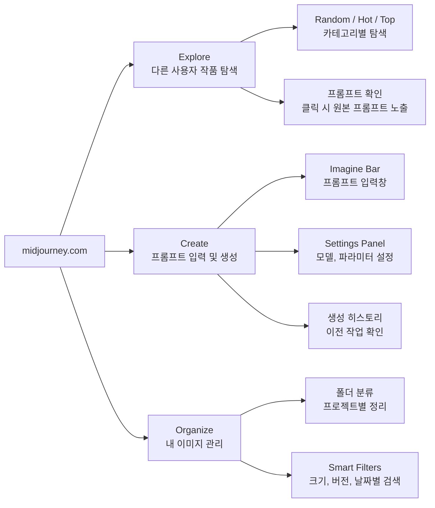
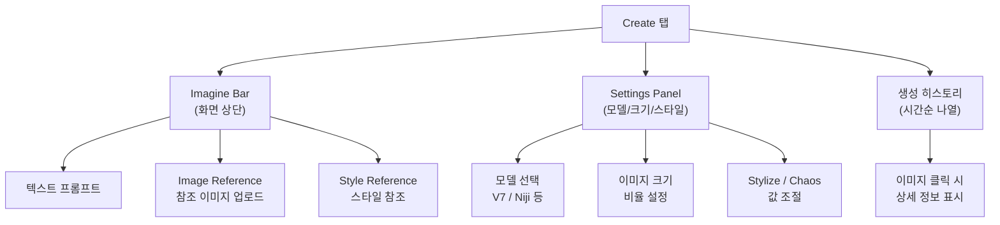
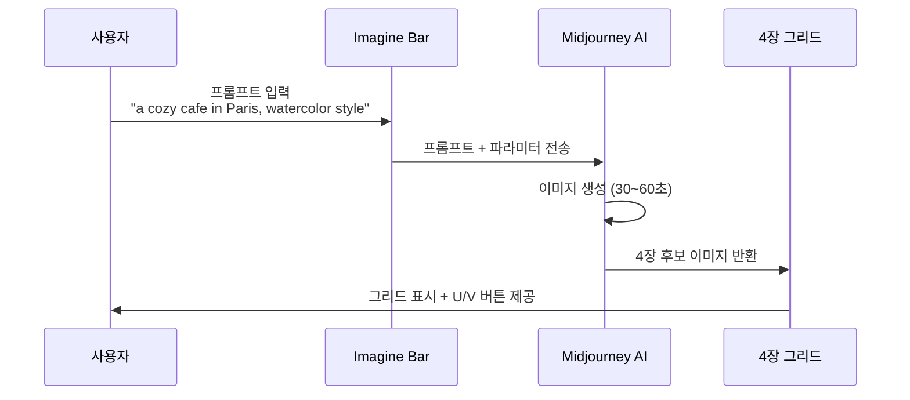
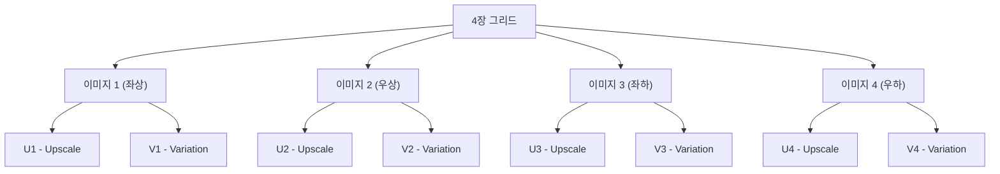
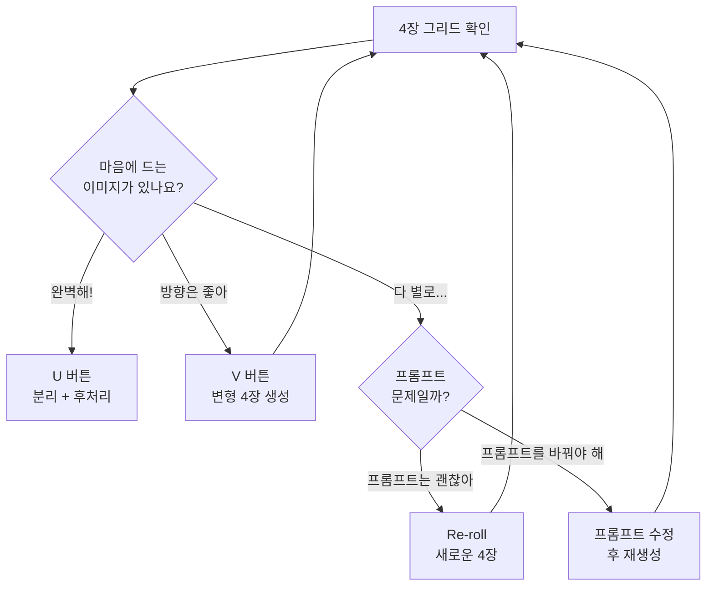
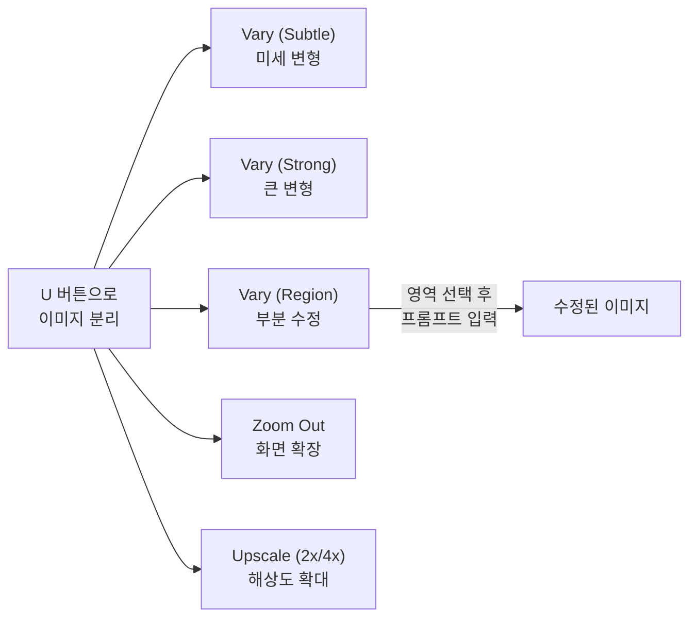
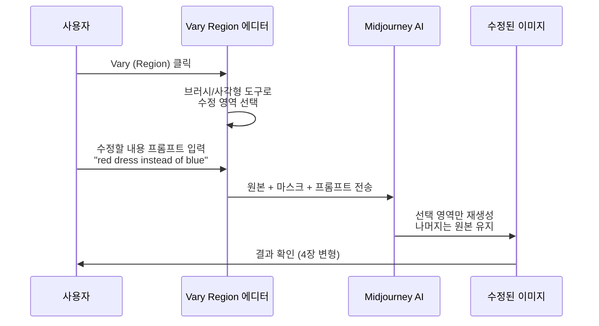
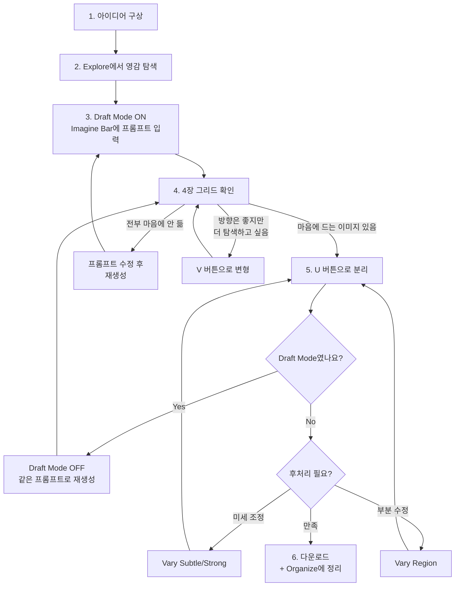

# Midjourney 인터페이스와 기본 생성

> Midjourney 웹 인터페이스를 탐색하고, 첫 이미지를 생성하며, 그리드에서 원하는 결과를 선택하는 기본 워크플로우를 익힙니다.

## 개요

이 섹션에서는 Midjourney의 웹 인터페이스를 처음부터 끝까지 탐색하고, 프롬프트를 입력해 이미지를 생성하는 전체 흐름을 배웁니다. 4장 그리드에서 마음에 드는 이미지를 골라 Upscale하고, Variation으로 변형하는 기본 조작까지 다룹니다.

**선수 지식**: [프롬프트 해부학 — 6요소 프레임워크](02-ch2-프롬프트-구조-마스터/01-01-프롬프트-해부학-6요소-프레임워크.md)에서 배운 프롬프트 구성 원리, [주요 플랫폼 비교](01-ch1-ai-이미지-생성-개론/02-02-주요-플랫폼-비교-chatgpt-vs-gemini-vs-midjourney.md)에서 살펴본 Midjourney의 특징

**학습 목표**:
- Midjourney 웹 인터페이스의 주요 화면(Create, Explore, Organize)을 이해한다
- Imagine Bar의 다양한 입력 방식(텍스트, 이미지 참조, 설정 패널)을 활용할 수 있다
- 4장 그리드에서 U(Upscale)와 V(Variation) 버튼의 역할을 구분하고 사용할 수 있다
- Vary Region을 활용한 부분 수정과 Draft Mode를 활용한 효율적 실험을 이해한다
- 기본적인 이미지 생성 → 선택 → 확대/변형의 전체 워크플로우를 수행할 수 있다

## 왜 알아야 할까?

ChatGPT나 Gemini에서도 이미지를 생성할 수 있는데, 왜 굳이 Midjourney를 별도로 배워야 할까요?

간단히 말해, **Midjourney는 "미학적 품질"에서 독보적인 도구**이기 때문입니다. ChatGPT가 "무엇이든 그려주는 만능 도우미"라면, Midjourney는 "비주얼 전문가가 옆에 앉아 함께 작업하는 스튜디오"에 가깝습니다. 광고 비주얼, 컨셉 아트, 브랜드 에셋처럼 **심미적 완성도가 결과물의 가치를 좌우하는 작업**에서 Midjourney의 강점이 빛납니다.

하지만 이 강력한 도구도 인터페이스를 모르면 제대로 활용할 수 없죠. 마치 전문 카메라를 사면서 메뉴 버튼 하나 눌러보지 않고 Auto 모드만 쓰는 것과 같습니다. 이 섹션에서 인터페이스를 확실히 익혀두면, 이후 배울 파라미터 튜닝(--ar, --stylize, --chaos 등)을 자신 있게 적용할 수 있습니다.

## 핵심 개념

### 개념 1: Midjourney 웹 인터페이스 구조

> 💡 **비유**: Midjourney의 웹 인터페이스를 **디지털 아트 갤러리**로 생각해보세요. 입구(Explore)에서는 다른 사람들의 작품을 구경하고, 작업실(Create)에서는 직접 그림을 그리며, 수장고(Organize)에서는 내 작품을 정리합니다.

2024년까지 Midjourney는 Discord 채팅방에서만 사용할 수 있었습니다. `/imagine` 명령어를 타이핑하고, 채팅 로그 속에서 내 이미지를 찾아야 했죠. 하지만 지금은 **midjourney.com 웹 앱**이 주 인터페이스입니다. Discord 경험이 전혀 없어도 괜찮습니다.

웹 인터페이스는 크게 세 가지 영역으로 구성됩니다:

> 📊 **그림 1**: Midjourney 웹 인터페이스의 3대 영역

#### Explore 탭 — 영감의 보물창고

첫 화면에서 볼 수 있는 갤러리입니다. 상단 필터를 통해 다양한 방식으로 다른 사용자의 작품을 탐색할 수 있습니다:

- **Random**: 무작위로 작품을 보여줍니다. 예상 밖의 스타일을 발견하기 좋습니다
- **Hot**: 최근 인기를 얻고 있는 작품입니다. 트렌드를 파악할 때 유용합니다
- **Top**: 역대 가장 높은 평가를 받은 작품들입니다. 프롬프트 작성의 교과서 역할을 합니다
- **Likes**: 내가 좋아요를 누른 작품 모음입니다

마음에 드는 이미지를 클릭하면 해당 이미지의 **원본 프롬프트**, 사용된 **파라미터**(--ar, --stylize 등), **모델 버전** 정보가 모두 표시됩니다. 우측 하단의 복사 버튼을 누르면 프롬프트를 그대로 가져올 수 있어, 프롬프트 영감을 얻기에 최고의 장소죠.

#### Create 탭 — 실제 작업 공간

이미지를 생성하는 핵심 공간입니다. 화면 구성을 위에서 아래로 살펴보면:

- **Imagine Bar** (화면 상단): "What will you imagine?"이라고 적힌 프롬프트 입력창. 텍스트 프롬프트를 입력하고 Enter를 누르면 생성이 시작됩니다
- **Settings Panel** (Imagine Bar 좌측 또는 하단): 모델 버전(V7, Niji 등), 이미지 크기, Stylize 값 등을 GUI로 조절할 수 있는 설정 패널. 파라미터를 직접 타이핑하지 않아도 여기서 클릭으로 설정 가능합니다
- **생성 히스토리** (화면 중앙~하단): 이전에 생성한 이미지들이 시간순으로 나열됩니다. 이미지를 클릭하면 오른쪽에 프롬프트, 파라미터, 시드 값, Job ID 등 상세 정보가 표시됩니다

> 📊 **그림 2**: Create 탭의 화면 구성

#### Organize 탭 — 체계적 이미지 관리

생성한 이미지를 폴더로 분류하고 관리하는 공간입니다. 수백, 수천 장의 이미지가 쌓이면 이 탭이 필수적입니다:

- **폴더 생성**: 프로젝트별, 클라이언트별, 스타일별로 폴더를 만들어 분류
- **Smart Filters**: 이미지 크기, 생성 모델 버전, 날짜 범위, 유형(grid/upscale) 등으로 필터링
- **일괄 작업**: 여러 이미지를 선택하여 한 번에 폴더 이동, 다운로드, 삭제 가능
- **검색**: 프롬프트 내 키워드로 이미지를 검색할 수 있어서, "cat"으로 검색하면 고양이 관련 이미지만 추려볼 수 있습니다

> 🔥 **실무 팁**: Explore 탭에서 마음에 드는 이미지의 프롬프트를 복사한 뒤, 키워드 몇 개만 바꿔서 Create에 붙여넣으면 빠르게 원하는 스타일에 접근할 수 있습니다. 이것을 "프롬프트 리버스 엔지니어링"이라고 부르기도 합니다.

### 개념 2: Imagine Bar와 프롬프트 입력

> 💡 **비유**: Imagine Bar는 **검색 엔진의 검색창**과 비슷합니다. Google에 검색어를 넣으면 관련 웹페이지가 나오듯, Imagine Bar에 원하는 이미지를 설명하면 AI가 4장의 후보 이미지를 보여줍니다. 차이점은 "찾는 것"이 아니라 "만드는 것"이라는 점이죠.

Imagine Bar는 Create 탭 상단에 위치한 프롬프트 입력창입니다. 단순한 텍스트 입력창처럼 보이지만, 실제로는 여러 가지 입력 방식을 지원합니다.

#### 기본 사용 흐름

1. **프롬프트 입력**: 원하는 이미지를 영어로 설명합니다
2. **파라미터 추가** (선택): 프롬프트 뒤에 `--ar 16:9` 같은 파라미터를 붙입니다
3. **Enter 또는 생성 버튼 클릭**: AI가 이미지 생성을 시작합니다
4. **약 30~60초 후**: 4장의 이미지 그리드가 완성됩니다

> 📊 **그림 3**: 프롬프트 입력에서 그리드 생성까지의 흐름

#### Imagine Bar의 고급 입력 방식

Imagine Bar는 텍스트만 받는 것이 아닙니다. 좌측의 아이콘들을 통해 다양한 참조 자료를 함께 전달할 수 있습니다:

- **Image Reference (이미지 참조)**: 참조할 이미지를 드래그 앤 드롭하거나 업로드합니다. "이 느낌으로 만들어줘"라고 시각적 가이드를 제공하는 것과 같습니다. 구도, 색감, 전체적 분위기를 참조하여 생성합니다
- **Style Reference (스타일 참조, --sref)**: 특정 이미지의 "스타일만" 추출하여 새로운 주제에 적용합니다. 예를 들어 반 고흐 그림을 스타일 참조로 넣고 "도시 풍경"을 프롬프트로 입력하면, 반 고흐 화풍의 도시 풍경이 만들어집니다
- **Character Reference (캐릭터 참조, --cref)**: 특정 캐릭터의 외모를 일관되게 유지하며 새로운 장면을 생성합니다. 캐릭터 디자인의 일관성이 중요한 작업에 유용합니다

#### 프롬프트 작성의 기본 원칙

이전 챕터에서 배운 6요소 프레임워크(주제, 스타일, 구도, 조명, 매체, 분위기)를 그대로 적용합니다. 다만 Midjourney에서는 몇 가지 특성을 알아두면 좋습니다:

- **영어 프롬프트**를 권장합니다. 한국어도 동작하지만, 영어가 더 정확한 결과를 냅니다
- **짧고 핵심적인 프롬프트**가 효과적입니다. ChatGPT처럼 긴 문장으로 대화할 필요 없이, 키워드 나열만으로도 훌륭한 결과를 얻을 수 있습니다
- **파라미터는 프롬프트 맨 뒤**에 붙입니다. `--ar 16:9 --stylize 200` 처럼요
- **Settings Panel과 인라인 파라미터**: 같은 설정을 두 곳에서 모두 제어할 수 있는데, 인라인 파라미터(프롬프트에 직접 타이핑)가 Settings Panel 설정을 덮어씁니다. 즉, Settings에서 --stylize를 100으로 설정해두어도 프롬프트에 `--stylize 500`을 쓰면 500이 적용됩니다

> ⚠️ **흔한 오해**: "Midjourney에서 프롬프트는 길수록 좋다"고 생각하는 분이 많습니다. 사실은 반대입니다. Midjourney는 짧고 명확한 키워드 조합에 최적화되어 있어요. 3~4줄의 장문보다 핵심 키워드 15~25개가 더 일관된 결과를 만들어냅니다.

### 개념 3: 4장 그리드와 이미지 선택

> 💡 **비유**: 4장 그리드는 **사진관에서 여러 포즈로 찍은 증명사진 시트**와 같습니다. 같은 주제를 4가지 다른 해석으로 보여주고, 그중 마음에 드는 컷을 골라 확대하거나 변형할 수 있습니다.

프롬프트를 입력하면 Midjourney는 항상 **4장의 이미지를 한 세트**로 생성합니다. 이 4장은 같은 프롬프트에서 나왔지만, 구도, 색감, 세부 표현이 조금씩 다릅니다. AI가 프롬프트를 해석하는 방식에 약간의 랜덤성이 있기 때문이죠.

#### 그리드 레이아웃과 번호 체계

그리드에서 이미지 번호는 왼쪽 위부터 시계 방향이 아니라, **좌상(1) → 우상(2) → 좌하(3) → 우하(4)** 순서입니다. 이 번호가 U/V 버튼의 숫자와 대응합니다.

> 📊 **그림 4**: 4장 그리드 레이아웃과 버튼 배치

#### U/V 버튼과 Re-roll

그리드 아래에는 각 이미지에 대한 조작 버튼이 제공됩니다:

| 버튼 | 기능 | 결과 |
|------|------|------|
| U1~U4 | **Upscale** — 선택한 이미지를 그리드에서 분리하여 고해상도로 확대 | 단일 이미지 + 후처리 옵션 |
| V1~V4 | **Variation** — 선택한 이미지를 기반으로 4장의 변형 이미지 생성 | 새로운 4장 그리드 |
| 🔄 | **Re-roll** — 같은 프롬프트로 완전히 새로운 4장 생성 | 새로운 4장 그리드 |

U 버튼과 V 버튼은 언제 쓰는 것이 좋을까요?

- **"이거다!"** 싶은 이미지가 있다면 → **U 버튼**으로 분리하고 후처리로 진행
- **"방향은 좋은데 좀 더 탐색하고 싶다"**면 → **V 버튼**으로 해당 이미지 기반 변형
- **"전부 마음에 안 든다"**면 → **Re-roll(🔄)**로 완전히 새로운 4장을 시도하거나, 프롬프트 자체를 수정

> 📊 **그림 5**: U/V/Re-roll 의사결정 트리

> ⚠️ **흔한 오해**: "U 버튼을 누르면 이미지 해상도만 올라간다"고 생각하기 쉽지만, V7에서 Upscale은 단순 확대가 아닙니다. 이미지를 그리드에서 **분리**하고, 이후 Vary(Strong/Subtle), Vary(Region), Zoom Out 등 **다양한 후처리 옵션을 제공하는 관문** 역할을 합니다.

### 개념 4: Upscale 후 사용 가능한 후처리 기능

> 💡 **비유**: U 버튼으로 이미지를 분리하면, 마치 사진을 **편집실로 가져온 것**과 같습니다. 이제 확대도 하고, 일부를 수정하고, 프레임을 넓힐 수도 있습니다.

이미지를 Upscale(U 버튼)하면 단일 이미지 뷰로 전환되며, 여러 후처리 옵션이 나타납니다:

> 📊 **그림 6**: Upscale 이후 사용 가능한 후처리 옵션

**Vary (Subtle)**: 원본의 전체적인 구도와 느낌을 유지하면서 세부 사항만 살짝 바꿉니다. "거의 완벽한데 뭔가 아쉬운" 이미지를 미세 조정할 때 좋습니다. 색조가 약간 달라지거나, 배경 디테일이 바뀌는 정도입니다.

**Vary (Strong)**: 원본의 큰 틀은 유지하되, 구도나 요소가 눈에 띄게 달라집니다. 같은 컨셉을 다른 각도에서 탐색하고 싶을 때 사용합니다. V 버튼과 비슷하지만, 이미 Upscale된 이미지 기반이라 좀 더 정제된 변형을 얻을 수 있습니다.

**Vary (Region)** — Midjourney의 인페인팅: 이미지에서 수정하고 싶은 영역을 직접 선택(브러시 또는 사각형 도구로 드래그)한 뒤, 프롬프트를 입력하면 해당 부분만 새로 생성합니다. 나머지 영역은 원본 그대로 유지됩니다.

> 📊 **그림 7**: Vary Region 작업 흐름

Vary Region의 활용 사례를 살펴볼까요?

- 배경은 유지하면서 인물의 **옷 색상만 변경**: 옷 부분을 선택 → "wearing a red jacket" 입력
- 인물은 유지하면서 **배경만 교체**: 배경 영역을 선택 → "snowy mountain landscape" 입력
- 이미지 한쪽에 **요소 추가**: 빈 공간을 선택 → "a small cat sitting" 입력

**Zoom Out**: 현재 이미지의 프레임을 넓혀서 주변 배경을 확장합니다. 아웃페인팅(Outpainting)과 유사한 기능으로, 1.5x 또는 2x 비율로 확장할 수 있습니다. 기존 이미지의 구도가 좁게 느껴질 때 유용합니다.

**Upscale (2x/4x)**: 이미지의 해상도를 물리적으로 높입니다. 인쇄용이나 대형 디스플레이용 이미지가 필요할 때 사용합니다. 4x 업스케일은 시간이 더 걸리지만 포스터 인쇄 등에 필요한 고해상도를 확보할 수 있습니다.

### 개념 5: Draft Mode — 빠른 실험의 비밀 무기

> 💡 **비유**: Draft Mode는 **연필 스케치**와 같습니다. 유화로 완성작을 그리기 전에, 빠르게 연필로 여러 구도를 스케치해보고 마음에 드는 것을 고르는 과정이죠. 스케치는 빠르고 부담이 없습니다.

Midjourney V7에는 "Draft Mode"라는 빠른 생성 모드가 있습니다. Settings Panel에서 토글하거나, 프롬프트에 `--draft` 파라미터를 추가하여 활성화합니다.

| 항목 | 일반 모드 | Draft Mode |
|------|-----------|------------|
| **생성 속도** | 30~60초 | 약 5~10초 |
| **크레딧 소모** | 1x (표준) | 약 0.5x (절반) |
| **이미지 품질** | 최종 품질 | 약간 낮은 해상도 |
| **용도** | 최종 결과물 | 프롬프트 실험, 방향 탐색 |

Draft Mode로 빠르게 여러 프롬프트를 실험하고, 방향이 확정되면 일반 모드로 최종 고품질 이미지를 생성하는 것이 **구독 크레딧을 가장 효율적으로 사용하는 전략**입니다. 프로 크리에이터들 사이에서는 "Draft로 방향 잡고, Normal로 마무리"가 기본 루틴으로 자리 잡았습니다.

### 개념 6: 이미지 생성의 전체 워크플로우

지금까지 배운 내용을 하나의 흐름으로 정리해봅시다. Midjourney에서 최종 결과물을 얻기까지의 전형적인 워크플로우입니다:

> 📊 **그림 8**: Midjourney 이미지 생성 전체 워크플로우

이 워크플로우에서 가장 중요한 것은 **"한 번에 완벽한 이미지를 얻으려 하지 않는다"**는 마인드셋입니다. 프로 크리에이터들도 보통 3~5번의 생성-선택-변형 사이클을 거칩니다. 처음부터 완벽을 기대하기보다는, V 버튼과 프롬프트 수정을 반복하며 점진적으로 원하는 결과에 다가가는 것이 Midjourney를 잘 쓰는 방법입니다.

## 실습: 적용해보기

### 활동 1: 인터페이스 탐색 체크리스트

Midjourney 웹 앱에 접속하여 아래 항목을 하나씩 체크해보세요:

- [ ] **Explore 탭** 진입 → Hot 카테고리에서 이미지 3개 클릭 → 각각의 프롬프트 읽어보기
- [ ] **Create 탭** 전환 → Imagine Bar 위치 확인 → Settings Panel 열어서 모델 버전 확인
- [ ] **Organize 탭** 확인 → 필터 옵션 탐색 (아직 이미지가 없어도 UI 확인만)
- [ ] 마음에 든 Explore 이미지의 프롬프트를 메모장에 복사해두기
- [ ] Settings Panel에서 Draft Mode 토글 위치를 찾아보기

### 활동 2: 첫 이미지 생성 실습

아래 3가지 프롬프트를 순서대로 Imagine Bar에 입력하고, 결과를 비교 분석해보세요:

**프롬프트 A** (단순): `a cat sitting on a windowsill`

**프롬프트 B** (스타일 추가): `a cat sitting on a windowsill, watercolor painting style, soft warm lighting`

**프롬프트 C** (상세 묘사): `a fluffy orange tabby cat sitting on a wooden windowsill, looking outside at a rainy garden, watercolor painting style, soft warm lighting, cozy atmosphere`

**분석 질문**:
1. 프롬프트 A → B → C로 갈수록 결과물이 어떻게 달라지나요?
2. 4장 그리드 중 가장 마음에 드는 이미지는 몇 번인가요? 이유는?
3. 마음에 드는 이미지에 U 버튼을 눌러본 후, Vary (Subtle)과 Vary (Strong)의 차이를 관찰해보세요

### 활동 3: Vary Region 실전 연습

**미션**: 활동 2에서 Upscale한 이미지 하나를 선택하여 Vary (Region)을 사용해보세요.

1. Upscale된 이미지에서 **Vary (Region)** 클릭
2. 브러시 도구로 **배경의 일부 영역** 선택
3. 해당 영역에 대한 새로운 프롬프트 입력 (예: "cherry blossom trees outside the window")
4. 결과물에서 선택한 영역만 바뀌고 나머지는 유지되었는지 확인

**기록할 것**: 어떤 영역을 얼마나 넓게 선택했는지, 프롬프트를 어떻게 작성했는지, 결과가 자연스러웠는지를 메모하세요.

### 활동 4: 워크플로우 실전 연습

**미션**: "빗속의 도쿄 거리 풍경, 네온사인 빛이 젖은 도로에 반사되는 장면"을 만들어보세요.

1. Draft Mode를 켜고 첫 프롬프트를 영어로 작성합니다
2. 4장 그리드에서 방향이 좋은 이미지를 V 버튼으로 변형합니다
3. 방향이 확정되면 Draft Mode를 끄고 같은 프롬프트로 재생성합니다
4. 마음에 드는 결과가 나오면 U 버튼으로 분리합니다
5. 필요하다면 Vary (Region)으로 부분 수정합니다
6. 최종 결과를 다운로드하고 Organize에 저장합니다

이 과정에서 **몇 번의 생성 사이클**이 필요했는지, Draft Mode에서 절약한 크레딧은 얼마인지, 어느 단계에서 가장 큰 변화가 있었는지 기록해보세요.

## 더 깊이 알아보기

### Midjourney의 탄생 — 확산 모델 논문 한 편에서 시작된 이야기

Midjourney의 창립자 **David Holz**는 원래 이미지 생성 AI와는 전혀 다른 분야에 있었습니다. 그는 **Leap Motion**이라는 회사를 공동 창업해 손동작으로 컴퓨터를 조작하는 제스처 기술을 개발했죠. Andreessen Horowitz 같은 유명 벤처캐피탈에서 투자를 받을 정도로 주목받았지만, 사용자 유지율 문제로 결국 2019년 UltraHaptics에 3,000만 달러에 인수됩니다.

전환점은 **코넬 대학교의 'Denoising Diffusion Probabilistic Models' 논문**이었습니다. Holz는 이 논문을 읽고 확산 모델이 이미지 생성에 혁명을 일으킬 잠재력을 직감했습니다. OpenAI의 DALL·E 모델 공개가 그의 비전을 확인시켜 주었고, 2021년 8월 샌프란시스코에서 **단 10명의 엔지니어**와 함께 Midjourney Inc.를 설립합니다.

놀라운 점은, Midjourney가 **벤처캐피탈 투자 없이** 자체 수익만으로 운영되는 독립 연구소라는 것입니다. 2022년 7월 Discord 봇 형태로 오픈 베타를 시작한 지 불과 몇 개월 만에 흑자를 달성했고, 이후 빠르게 성장하여 현재의 웹 앱 중심 플랫폼으로 발전했습니다.

Discord에서 시작한 이유도 흥미롭습니다. 당시 소규모 팀으로는 별도의 웹 앱을 구축할 여력이 없었기 때문에, 이미 수억 명이 사용하는 Discord의 인프라를 빌려 빠르게 서비스를 런칭한 것입니다. 결과적으로 Discord 커뮤니티 특유의 공유 문화가 Midjourney를 바이럴하게 확산시키는 데 큰 역할을 했죠.

### 왜 4장일까?

Midjourney가 항상 4장을 한 세트로 생성하는 것에도 이유가 있습니다. 확산 모델(Diffusion Model)은 랜덤 노이즈에서 시작해 점진적으로 이미지를 정제하는데, 시작점이 되는 노이즈가 다르면 결과도 달라집니다. 4장은 **다양성과 선택지를 제공하면서도 생성 비용과 대기 시간의 균형**을 맞춘 숫자입니다. 1장만 주면 선택권이 없고, 9장을 주면 너무 오래 걸리니까요.

## 흔한 오해와 팁

> ⚠️ **흔한 오해**: "Midjourney는 Discord에서만 쓸 수 있다"고 아직도 많은 분들이 생각합니다. 2024년 말부터 웹 앱(midjourney.com)이 주요 인터페이스가 되었고, 2025년에는 iOS/Android 앱도 출시되었습니다. Discord 봇도 여전히 작동하지만, 웹 앱이 훨씬 직관적이고 편리합니다.

> 💡 **알고 계셨나요?**: Midjourney V7은 2025년 4월에 출시되어 6월부터 기본 모델이 되었습니다. V7은 텍스트 렌더링 능력이 크게 향상되어 이미지 안에 글씨를 넣는 것이 훨씬 자연스러워졌고, 손가락이나 신체 비율 같은 고질적인 문제도 대폭 개선되었습니다.

> 🔥 **실무 팁**: 프롬프트를 실험하는 단계에서는 **Draft Mode**를 적극 활용하세요. 일반 생성의 절반 비용에 10배 빠른 속도로 결과를 확인할 수 있습니다. 방향이 확정되면 그때 일반 모드로 최종 고품질 이미지를 생성하면 구독 크레딧을 효율적으로 사용할 수 있습니다.

> 🔥 **실무 팁**: V 버튼(Variation)과 Re-roll(🔄)의 차이를 정확히 구분하세요. V 버튼은 선택한 이미지의 **구도와 스타일을 유지**하면서 변형하고, Re-roll은 같은 프롬프트로 **완전히 새로운 4장**을 생성합니다. "이 방향은 좋은데 조금만 달랐으면" → V 버튼, "완전히 다른 해석을 보고 싶어" → Re-roll입니다.

> 🔥 **실무 팁**: Vary Region을 사용할 때, 수정 영역을 **너무 작게** 잡으면 주변과 자연스럽게 블렌딩되지 않을 수 있습니다. 수정하려는 부분보다 약간 넓게 선택하는 것이 경계면이 자연스러운 결과를 만드는 비결입니다.

## 핵심 정리

| 개념 | 설명 |
|------|------|
| **웹 인터페이스 3대 영역** | Explore(탐색), Create(생성), Organize(관리) |
| **Explore 탭** | Random/Hot/Top/Likes로 분류된 커뮤니티 갤러리. 프롬프트 확인 가능 |
| **Create 탭** | Imagine Bar + Settings Panel + 생성 히스토리로 구성된 작업 공간 |
| **Organize 탭** | 폴더 분류, Smart Filters, 일괄 작업을 지원하는 이미지 관리 공간 |
| **Imagine Bar** | Create 탭 상단의 프롬프트 입력창. 텍스트, Image/Style/Character Reference 지원 |
| **Settings Panel** | 모델 버전, 이미지 크기, Stylize 등을 GUI로 설정. 인라인 파라미터가 우선 |
| **4장 그리드** | 하나의 프롬프트에서 생성되는 4장 후보 이미지 세트 |
| **U 버튼 (Upscale)** | 이미지를 그리드에서 분리하고 후처리 옵션 제공 |
| **V 버튼 (Variation)** | 선택한 이미지 기반으로 새로운 4장 변형 생성 |
| **Vary (Subtle/Strong)** | Upscale 후 미세/큰 변형 생성 |
| **Vary (Region)** | 이미지의 특정 영역만 선택하여 부분 수정 (인페인팅) |
| **Zoom Out** | 이미지 프레임을 1.5x/2x로 확장 (아웃페인팅) |
| **Draft Mode** | 절반 비용, 10배 속도의 빠른 실험 모드. `--draft` 파라미터로 활성화 |
| **Re-roll (🔄)** | 같은 프롬프트로 완전히 새로운 4장 생성 |

## 다음 섹션 미리보기

이제 Midjourney의 기본 인터페이스와 생성 워크플로우를 익혔으니, 다음 섹션 [종횡비 --ar와 구도 제어](05-ch5-midjourney-기본과-파라미터-튜닝/02-02-종횡비--ar와-구도-제어.md)에서는 첫 번째 핵심 파라미터인 `--ar`(Aspect Ratio)를 배웁니다. 가로형, 세로형, 정사각형 등 이미지의 비율을 제어하는 방법을 익히면, 인스타그램 피드용, 유튜브 썸네일용, 포스터용 등 용도에 맞는 정확한 규격의 이미지를 바로 생성할 수 있게 됩니다.

## 참고 자료

- [Midjourney Getting Started Guide](https://docs.midjourney.com/hc/en-us/articles/33329261836941-Getting-Started-Guide) - 공식 시작 가이드. 계정 생성부터 첫 이미지 생성까지의 공식 안내
- [Midjourney Parameter List](https://docs.midjourney.com/hc/en-us/articles/32859204029709-Parameter-List) - 모든 파라미터의 공식 레퍼런스. 이후 섹션에서 깊이 다룰 파라미터 목록
- [Midjourney Variations 공식 문서](https://docs.midjourney.com/hc/en-us/articles/32692978437005-Variations) - Variation, Vary(Strong/Subtle), Vary(Region) 기능의 공식 설명
- [Midjourney Remix 공식 문서](https://docs.midjourney.com/hc/en-us/articles/32799074515213-Remix) - Remix 모드의 활성화 및 활용 방법
- [Midjourney for Beginners Guide (God of Prompt)](https://www.godofprompt.ai/blog/midjourney-for-beginners-easy-guide-for-2024) - 초보자를 위한 단계별 가이드, 스크린샷 포함
- [How to Use Midjourney (DataCamp)](https://www.datacamp.com/tutorial/how-to-use-midjourney-a-comprehensive-guide-to-ai-generated-artwork-creation) - 종합적인 Midjourney 활용 튜토리얼