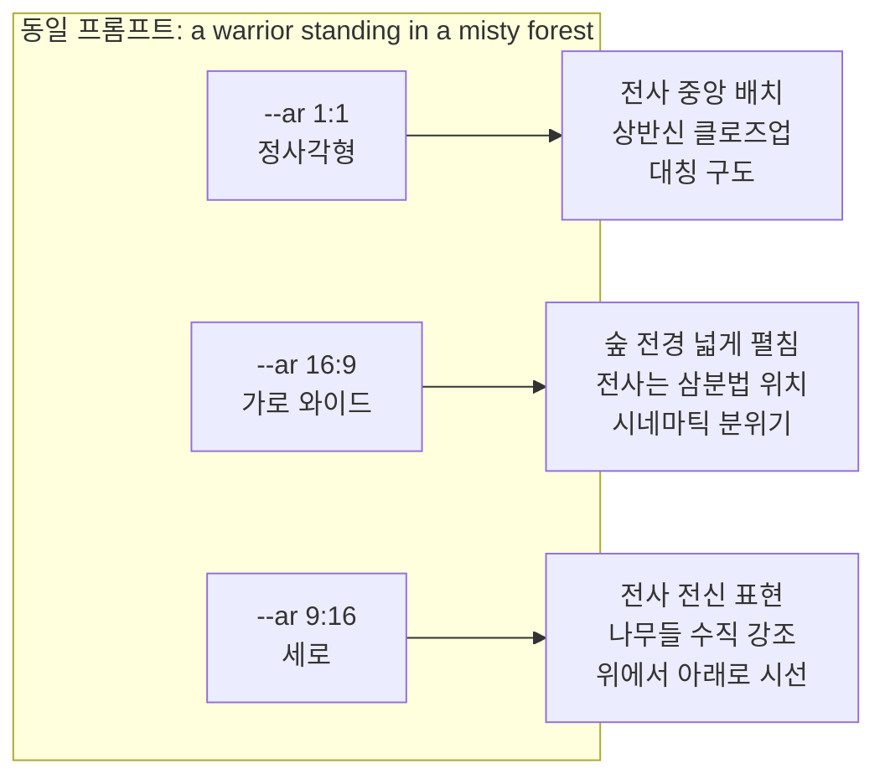
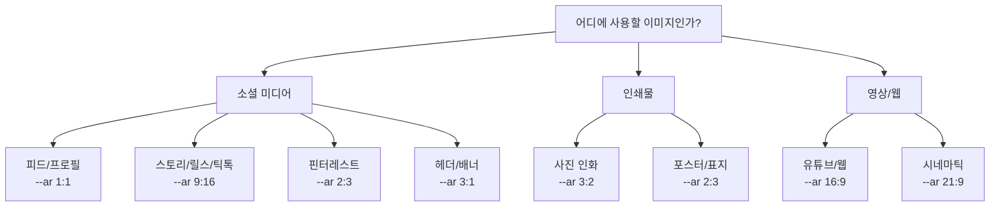

# 종횡비(--ar)와 구도 제어

> Midjourney의 `--ar` 파라미터로 이미지 비율을 제어하고, 구도와 피사체 배치까지 바꿔봅니다.

## 개요

`--ar`은 Midjourney에서 가장 자주 쓰는 파라미터입니다. 같은 프롬프트라도 종횡비를 바꾸면 AI가 구도를 완전히 다르게 해석합니다. 1:1이면 피사체를 중앙에 꽉 채우고, 16:9면 배경을 넓게 펼치며, 9:16이면 수직 요소를 강조하죠. 목적에 맞는 종횡비 선택이 프로페셔널한 결과물의 시작입니다. 이 섹션에서는 `--ar`의 문법부터 용도별 최적 비율, 그리고 구도에 미치는 실질적 영향까지 실습 중심으로 다룹니다.

## --ar 파라미터 기본 문법

프롬프트 **끝에** `--ar 가로:세로` 형식으로 추가합니다. 반드시 정수만 사용하고, 기본값은 1:1입니다.

**기본 규칙**:
- 소수점 불가 — `--ar 1.39:1` 대신 `--ar 139:100`
- 프롬프트와 `--` 사이에 반드시 공백
- 약분된 형태(16:9)가 큰 숫자(1600:900)보다 AI 해석에 유리

**버전별 지원 범위**:

| Midjourney 버전 | 지원 범위 | 비고 |
|----------------|----------|------|
| V5 / V5.2 | 1:2 ~ 2:1 | 범위 밖은 자동 클램핑 |
| V6 / V6.1 | 1:3 ~ 3:1 | 파노라마/긴 세로 가능 |
| V7 (최신) | 1:4 ~ 4:1 이상 | 극단 비율에서도 구도 품질 유지 |

기본부터 확인해봅시다. 같은 장면을 기본값과 와이드로 비교합니다:

```
a serene mountain lake surrounded by pine trees, morning mist
```

 - 호수가 정사각형으로 꽉 참")

```
a serene mountain lake surrounded by pine trees, morning mist --ar 16:9
```


```
a serene mountain lake surrounded by pine trees, morning mist --ar 9:16
```


세 이미지 모두 같은 프롬프트지만, AI가 비율에 따라 구도를 완전히 다르게 잡는 걸 확인할 수 있습니다.

## 종횡비가 구도에 미치는 영향

Midjourney는 종횡비를 단순한 캔버스 크기가 아니라 **구도 힌트**로 해석합니다. 비율을 바꾸면 이미지를 자르는 게 아니라 처음부터 새로 생성합니다.



**가로 비율(16:9, 21:9, 3:1)**:
- 수평선 강조, 풍경/파노라마에 적합
- 피사체가 삼분법 교차점에 배치되는 경향
- 여백이 많아 시네마틱 분위기

**세로 비율(9:16, 2:3, 1:3)**:
- 수직 요소(건물, 전신, 나무) 강조
- 포트레이트, 패션, 건축에 강력

**정사각형(1:1)**:
- 피사체 중앙 배치, 대칭적이고 안정감 있는 구도

이 특성을 활용해서 구도 키워드와 `--ar`을 결합하면 효과가 극대화됩니다:

```
a warrior standing in a misty forest, wide angle, cinematic composition --ar 21:9
```


```
a warrior standing in a misty forest, full body portrait, dramatic lighting --ar 2:3
```


## 용도별 최적 종횡비



**소셜 미디어 플랫폼별 최적 비율**:

| 플랫폼 | 콘텐츠 유형 | 최적 종횡비 |
|--------|-----------|-----------|
| 인스타그램 | 피드 포스트 | `--ar 1:1` 또는 `--ar 4:5` |
| 인스타그램 | 스토리/릴스 | `--ar 9:16` |
| 유튜브 | 썸네일 | `--ar 16:9` |
| 틱톡 | 비디오 커버 | `--ar 9:16` |
| 핀터레스트 | 핀 이미지 | `--ar 2:3` |
| 트위터(X) | 헤더 배너 | `--ar 3:1` |
| 링크드인 | 배너 | `--ar 4:1` |

**인쇄물 및 영상**:

| 용도 | 최적 종횡비 | 비고 |
|------|-----------|------|
| 사진 인화 (4x6) | `--ar 3:2` | 가장 보편적 사진 비율 |
| 책 표지 / 영화 포스터 | `--ar 2:3` | 세로 직사각형 |
| A4 문서 | `--ar 100:141` | 보고서, 전단지 |
| 명함 | `--ar 9:5` | 한국 표준 명함 |
| HD 영상 / 유튜브 | `--ar 16:9` | 1920x1080 |
| 시네마스코프 | `--ar 21:9` | 극장 느낌 |

실제 매체별 프롬프트를 비교해봅시다:

```
a freshly baked croissant on a marble counter, soft morning light, centered composition --ar 1:1
```

 - 크루아상이 중앙에 배치")

```
a freshly baked croissant on a marble counter, soft morning light, vertical composition --ar 9:16
```

 - 세로 화면에 맞춘 구도")

```
a freshly baked croissant on a marble counter, soft morning light, wide angle --ar 16:9
```

 - 카운터 전경이 넓게 보임")

## 비표준 비율과 극단적 비율

소수점 비율이 필요하면 양변에 100을 곱해서 정수로 만듭니다. 다만 `--ar 16:9`와 `--ar 1600:900`은 동일한 결과이므로, 항상 약분된 형태를 쓰세요.

| 상황 | 비율 | 설명 |
|------|------|------|
| 페이스북 커버 | `--ar 205:78` | 820x312px 근사 |
| 황금비 | `--ar 162:100` | 1.618:1 근사 |
| 극단 파노라마 (V7) | `--ar 3:1` | 드라마틱한 풍경 |
| 극단 세로 (V7) | `--ar 1:3` | 탑, 폭포, 초고층 빌딩 |

극단적 비율을 쓸 때는 구도 힌트를 함께 주면 효과적입니다:

```
a vast desert highway stretching to the horizon, panoramic landscape, golden hour --ar 3:1
```


```
a towering Gothic cathedral interior, looking up, dramatic vertical perspective --ar 1:3
```


## 실습

아래 프롬프트를 5가지 비율로 생성하고 결과를 비교해보세요:

**기본 프롬프트**: `a cozy coffee shop interior with warm lighting and wooden furniture`

| 실험 | 파라미터 | 관찰 포인트 |
|------|---------|------------|
| 1 | (생략 - 기본 1:1) | 가구 배치, 공간감 |
| 2 | `--ar 16:9` | 카페 전경이 얼마나 넓게 보이는지 |
| 3 | `--ar 9:16` | 천장/바닥이 더 보이는지 |
| 4 | `--ar 2:3` | 세로 구도에서 어떤 요소가 강조되는지 |
| 5 | `--ar 21:9` | 울트라와이드에서 공간의 서사감 |

각 결과에서 AI가 "주인공"으로 삼은 피사체가 무엇인지, 배경 대 피사체 비율이 어떻게 달라졌는지 관찰해보세요.

## 팁과 주의사항

- **비율 변경 = 완전 재생성**: `--ar`을 바꾸면 Midjourney가 처음부터 다시 그립니다. 기존 이미지의 비율만 바꾸려면 Zoom Out이나 Vary Region을 사용하세요.
- **와이드 퍼스트 전략**: 여러 매체용 이미지가 필요하면 가장 넓은 비율(16:9, 21:9)로 먼저 생성한 후 세로/정사각 버전을 파생시키는 게 효율적입니다.
- **극단적 비율에는 구도 키워드 필수**: `--ar 3:1`에 "panoramic landscape"를, `--ar 1:3`에 "vertical perspective"를 추가하면 어색한 여백을 줄일 수 있습니다.
- **Draft Mode로 비율 테스트**: Draft Mode를 켜고 여러 비율을 빠르게 돌려본 후, 최적 비율을 찾으면 끄고 최종 생성하면 크레딧을 절약할 수 있습니다.
- **시드 고정으로 일관성 유지**: 같은 프롬프트에 `--seed` 값을 고정하고 `--ar`만 바꾸면, 비슷한 색감과 분위기를 유지하면서 각 비율에 맞는 구도를 얻을 수 있습니다.

## 핵심 정리

| 개념 | 설명 |
|------|------|
| **--ar 기본 문법** | 프롬프트 끝에 `--ar 가로:세로` 추가. 정수만 사용, 기본값 1:1 |
| **버전별 지원 범위** | V5: 1:2~2:1 / V6: 1:3~3:1 / V7(현재 기본): 1:4~4:1 이상 |
| **소수점 비율** | 양변에 100을 곱해 정수로 변환 (1.39:1 -> 139:100) |
| **구도 영향** | AI가 비율을 구도 힌트로 해석 - 가로는 파노라마, 세로는 포트레이트 |
| **소셜 미디어** | 피드 1:1, 스토리 9:16, 핀터레스트 2:3, 배너 3:1~4:1 |
| **인쇄물** | 사진 3:2, 포스터/표지 2:3, A4 약 100:141, 명함 9:5 |
| **비율 변경 시** | 이미지를 처음부터 다시 생성 (자르기가 아님) |
| **멀티 매체 전략** | 와이드 퍼스트로 생성 후 파생, 시드 고정으로 일관성 유지 |

## 다음 섹션 미리보기

종횡비로 이미지의 "틀"을 잡았으니, 다음에는 틀 안의 미학을 제어합니다. 스타일라이즈(--stylize) 파라미터로 AI의 미학적 해석 강도를 조절하는 방법을 알아봅니다.
