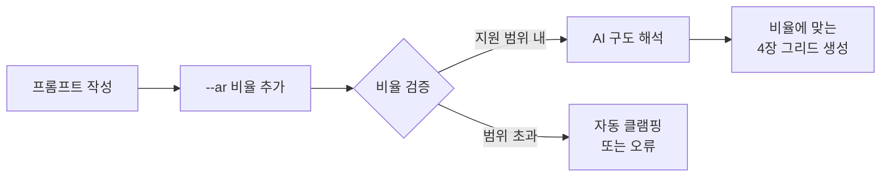
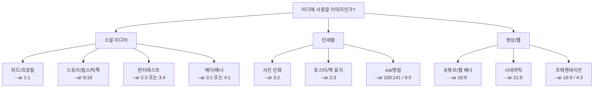
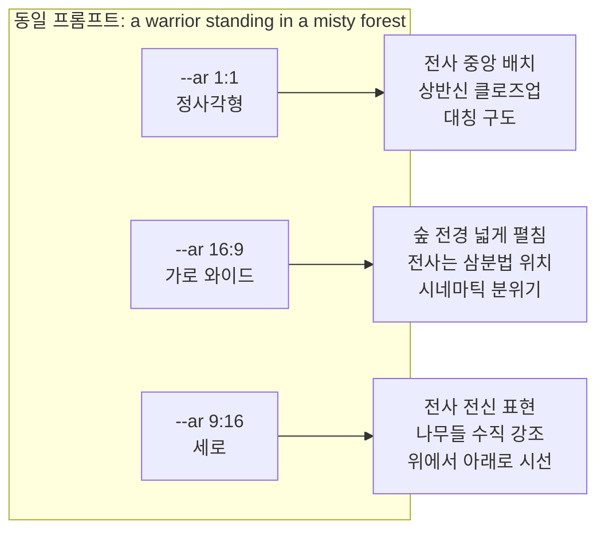
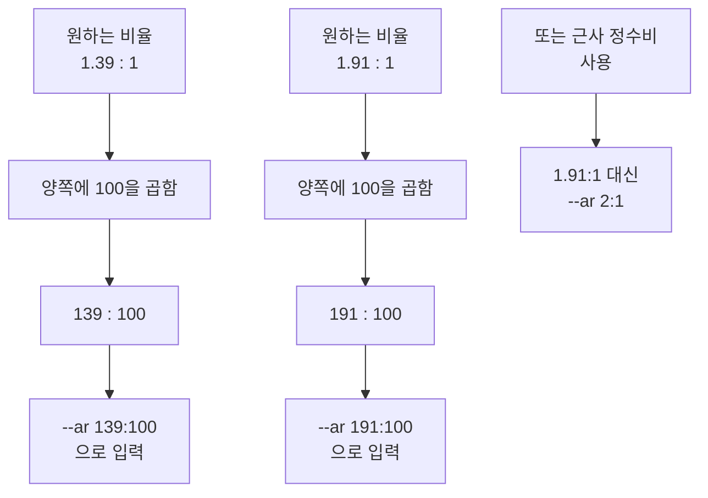
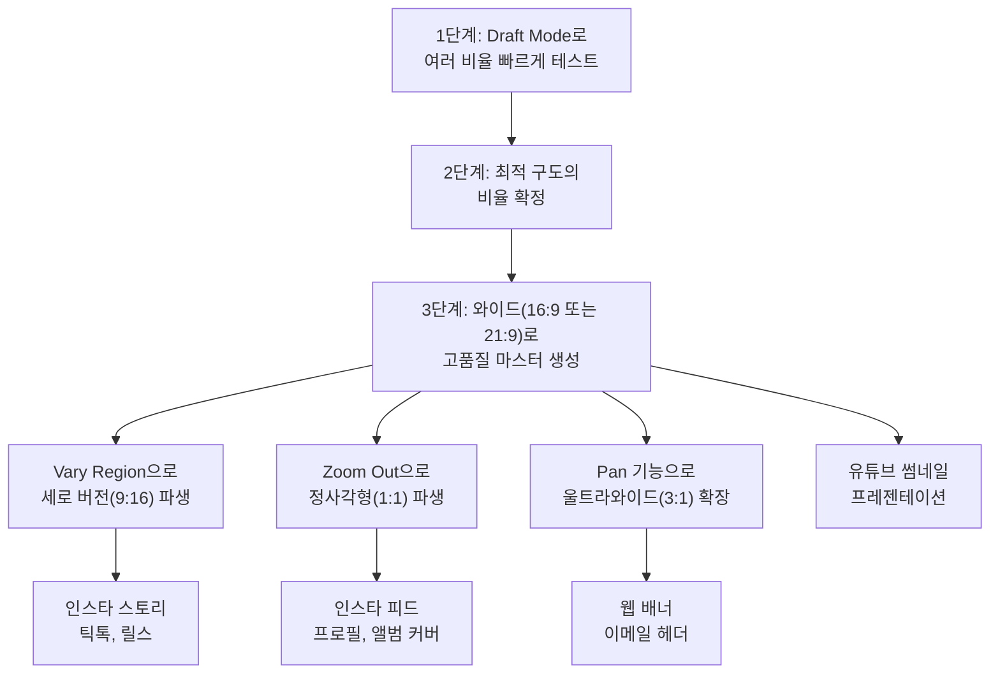

# 종횡비(--ar)와 구도 제어

> Midjourney의 `--ar` 파라미터로 이미지 비율을 제어하고, 종횡비가 구도와 피사체 배치에 미치는 영향을 이해합니다.

## 개요

이 섹션에서는 Midjourney에서 가장 자주 사용하는 파라미터인 `--ar`(Aspect Ratio)를 깊이 있게 다룹니다. 종횡비는 단순한 이미지 크기 설정이 아니라, AI가 구도를 해석하고 피사체를 배치하는 방식 자체를 바꾸는 강력한 도구입니다.

**선수 지식**: [이전 섹션](05-ch5-midjourney-기본과-파라미터-튜닝/01-01-midjourney-인터페이스와-기본-생성.md)에서 배운 Imagine Bar 사용법, 4장 그리드, U/V 버튼 등 기본 인터페이스 조작법
**학습 목표**:
- `--ar` 파라미터의 문법과 기본 규칙을 이해한다
- 용도별 최적 종횡비(1:1, 16:9, 9:16, 2:3 등)를 선택할 수 있다
- 종횡비 변화가 AI의 구도 해석과 피사체 배치에 미치는 영향을 파악한다
- 소셜 미디어, 인쇄물, 영상 등 실무 매체에 맞는 비율을 즉시 적용할 수 있다

## 왜 알아야 할까?

같은 프롬프트라도 종횡비를 바꾸면 **완전히 다른 이미지**가 나옵니다. "a cat sitting on a windowsill"이라는 동일한 프롬프트를 1:1로 생성하면 고양이가 화면 중앙에 정사각형으로 꽉 차게 나오지만, 16:9로 생성하면 창밖 풍경이 넓게 펼쳐지며 고양이가 한쪽에 배치되는 시네마틱한 구도가 됩니다. 9:16으로 바꾸면? 스마트폰 화면에 딱 맞는 세로 구도로 고양이의 전신이 길게 담기죠.

실무에서 이건 매우 중요합니다. 인스타그램 피드용 이미지를 만들었는데 16:9로 생성했다면? 피드에서 잘려 나가거나 레터박스가 생깁니다. 유튜브 썸네일을 만드는데 1:1로 생성했다면? 양옆이 비어 보이죠. **목적에 맞는 종횡비 선택이 곧 프로페셔널한 결과물의 시작**입니다.

## 핵심 개념

### 개념 1: --ar 파라미터의 기본 문법

> 💡 **비유**: 종횡비는 **액자를 고르는 것**과 같습니다. 같은 그림이라도 정사각형 액자에 넣으면 안정감 있고, 가로로 긴 파노라마 액자에 넣으면 드라마틱하며, 세로로 긴 액자에 넣으면 우아한 느낌이 나죠. Midjourney의 `--ar`은 AI에게 "이 액자에 맞게 그려줘"라고 지시하는 것입니다.

`--ar` 파라미터는 프롬프트 **끝에** 추가합니다. 형식은 `--ar 가로:세로`이며, 반드시 정수만 사용할 수 있습니다.

**기본 규칙**:
- 기본값은 **1:1** (정사각형)
- 소수점 사용 불가 — `--ar 1.39:1` 대신 `--ar 139:100` 사용
- 쉼표나 마침표 같은 구두점 사용 금지
- 프롬프트 텍스트와 `--` 사이에 반드시 **공백** 필요

**버전별 지원 범위**:

| Midjourney 버전 | 지원 범위 | 비고 |
|----------------|----------|------|
| V5 / V5.2 | 1:2 ~ 2:1 | 이 범위 밖은 자동 클램핑 |
| V6 / V6.1 | **1:3 ~ 3:1** | 더 극단적인 파노라마/세로 비율 가능 |
| V7 (최신) | **1:4 ~ 4:1** 이상 | 가장 넓은 범위 지원. 극단 비율에서도 구도 품질 유지 |

> ⚠️ **흔한 오해**: 많은 가이드에서 "--ar 지원 범위는 1:2~2:1"이라고 소개하는데, 이는 V5 기준의 정보입니다. **V6 이후로는 훨씬 넓은 범위**를 지원하므로 `--ar 3:1` 같은 울트라와이드 파노라마나 `--ar 1:3` 같은 긴 세로 이미지도 생성할 수 있습니다. 최신 지원 범위는 [Midjourney 공식 Aspect Ratio 문서](https://docs.midjourney.com/hc/en-us/articles/31894244298125-Aspect-Ratio)에서 확인하세요.

**프롬프트 작성 예시**:

| 목적 | 프롬프트 예시 |
|------|-------------|
| 기본 정사각형 | `a serene mountain lake` (--ar 생략 시 1:1) |
| 와이드스크린 | `a serene mountain lake --ar 16:9` |
| 세로 모바일 | `a serene mountain lake --ar 9:16` |
| 인쇄 사진 | `a serene mountain lake --ar 2:3` |
| 울트라 파노라마 (V6+) | `a serene mountain lake --ar 3:1` |
| 긴 세로 스크롤 (V6+) | `a serene mountain lake --ar 1:3` |

> 📊 **그림 1**: --ar 파라미터 적용 흐름

중요한 점은 Midjourney가 종횡비를 단순히 "자르기"로 처리하지 않는다는 것입니다. AI는 지정된 비율을 **이해하고**, 그에 맞는 구도를 **처음부터 새롭게 설계**합니다. 16:9를 지정하면 AI는 "이건 파노라마 느낌이니 넓은 풍경이나 시네마틱 구도로 가자"라고 해석하는 거죠. 3:1 같은 극단적 가로 비율을 주면 드라마틱한 파노라마 풍경이나 영화 시퀀스 느낌의 연출을 시도합니다.

### 개념 2: 용도별 최적 종횡비 가이드

> 💡 **비유**: 종횡비 선택은 **옷장에서 TPO(Time, Place, Occasion)에 맞는 옷을 고르는 것**과 같습니다. 출근할 때, 운동할 때, 파티에 갈 때 입는 옷이 다르듯, 인스타그램 피드, 유튜브 썸네일, 명함 인쇄에 맞는 비율도 다릅니다.

각 매체와 용도에 최적화된 종횡비를 정리하면 다음과 같습니다:

**소셜 미디어 플랫폼별 최적 비율**:

| 플랫폼 | 콘텐츠 유형 | 최적 종횡비 | 프롬프트 예시 |
|--------|-----------|-----------|-------------|
| 인스타그램 | 피드 포스트 | `--ar 1:1` 또는 `--ar 4:5` | 정사각형 또는 약간 세로 |
| 인스타그램 | 스토리/릴스 | `--ar 9:16` | 풀스크린 세로 |
| 유튜브 | 썸네일 | `--ar 16:9` | 와이드 가로 |
| 틱톡 | 비디오 커버 | `--ar 9:16` | 풀스크린 세로 |
| 핀터레스트 | 핀 이미지 | `--ar 2:3` | 세로 직사각형 |
| 트위터(X) | 피드 이미지 | `--ar 16:9` | 타임라인 최적화 |
| 트위터(X) | 헤더 배너 | `--ar 3:1` | 와이드 배너 |
| 링크드인 | 배너 | `--ar 4:1` | 울트라와이드 |
| 페이스북 | 커버 | `--ar 205:78` 또는 `--ar 8:3` | 근사값 활용 |

**인쇄물 및 출판 최적 비율**:

| 용도 | 최적 종횡비 | 실제 규격 | 비고 |
|------|-----------|----------|------|
| 사진 인화 (4×6) | `--ar 3:2` | 102×152mm | 가장 보편적 사진 비율 |
| 사진 인화 (5×7) | `--ar 7:5` | 127×178mm | 약간 정사각에 가까움 |
| A4 문서 | `--ar 100:141` | 210×297mm | 보고서, 전단지 |
| 명함 | `--ar 9:5` | 90×50mm | 한국 표준 명함 |
| 책 표지 | `--ar 2:3` | 다양 | 일반 단행본 |
| 영화 포스터 | `--ar 2:3` | 610×914mm | 전통적 원시트 |
| 정사각 포스터 | `--ar 1:1` | 다양 | 앨범 아트, 전시 |

**영상 및 디지털 최적 비율**:

| 용도 | 최적 종횡비 | 해상도 참고 | 비고 |
|------|-----------|-----------|------|
| HD 영상 프레임 | `--ar 16:9` | 1920×1080 | 유튜브, 웹 |
| 울트라와이드 모니터 | `--ar 21:9` | 2560×1080 | 시네마틱 |
| 영화 (시네마스코프) | `--ar 21:9` | 2.35:1 근사 | 극장 느낌 |
| 웹사이트 히어로 | `--ar 16:9` 또는 `--ar 3:1` | 반응형 | 상단 배너 |
| 이메일 헤더 | `--ar 5:2` 또는 `--ar 3:1` | 600px 폭 기준 | 뉴스레터 |
| 프레젠테이션 | `--ar 16:9` | 1920×1080 | 와이드 슬라이드 |
| iPad/태블릿 | `--ar 4:3` | 2048×1536 | 클래식 태블릿 비율 |

> 📊 **그림 2**: 용도별 종횡비 선택 가이드

**인쇄 시 해상도 참고**: Midjourney의 기본 출력은 약 2048×2048px(1:1 기준)입니다. 300 DPI 기준으로 약 6.8인치×6.8인치(약 17cm×17cm) 크기의 선명한 인쇄가 가능합니다. 더 큰 인쇄물이 필요하면 Upscale 기능을 활용하세요 — 이는 [이전 섹션](05-ch5-midjourney-기본과-파라미터-튜닝/01-01-midjourney-인터페이스와-기본-생성.md)에서 배운 U 버튼으로 할 수 있습니다.

### 개념 3: 종횡비가 구도와 피사체 배치에 미치는 영향

> 💡 **비유**: 카메라를 가로로 잡느냐, 세로로 잡느냐에 따라 사진사의 시선과 구도가 달라지는 것처럼, Midjourney도 종횡비에 따라 **전혀 다른 구도 전략**을 사용합니다. AI가 가로 화면이라면 "배경을 넓게 보여주자", 세로 화면이라면 "인물을 길게 담자"라고 판단하는 거죠.

이것은 `--ar` 파라미터의 가장 강력하면서도 많은 분들이 모르는 특성입니다. Midjourney는 종횡비를 단순한 "캔버스 크기"가 아니라 **구도 힌트**로 해석합니다.

**가로 비율(16:9, 21:9, 3:1)의 구도 특성**:
- 수평선이 강조되어 풍경, 파노라마에 적합
- 피사체가 삼분법의 교차점에 배치되는 경향
- 여백이 많아져 "공간감"과 "서사"가 생김
- 영화 스틸컷 같은 시네마틱 느낌
- 3:1 이상의 극단적 와이드에서는 여러 피사체를 나란히 배치하는 "시퀀스" 구도가 나오기도 함

**세로 비율(9:16, 2:3, 1:3)의 구도 특성**:
- 수직적 요소(건물, 인물 전신, 나무)가 강조
- 피사체가 화면 중앙-하단에 배치되는 경향
- 위아래로 시선이 흐르는 구도
- 포트레이트, 패션, 건축에 강력
- 1:3 같은 극단적 세로에서는 탑, 폭포, 초고층 빌딩 등 수직성이 극대화

**정사각형(1:1)의 구도 특성**:
- 피사체가 중앙에 배치
- 대칭적이고 안정감 있는 구도
- 배경보다 주제에 집중하는 효과

> 📊 **그림 3**: 동일 프롬프트, 다른 종횡비에 따른 AI의 구도 해석 차이

이 차이를 잘 활용하면, [프롬프트 구조 마스터](02-ch2-프롬프트-구조-마스터/03-03-구도와-앵글-시선을-이끄는-프레이밍.md)에서 배운 구도 키워드와 결합하여 더욱 정밀한 이미지를 만들 수 있습니다. 예를 들어, `--ar 16:9`에 "wide angle, cinematic composition"을 결합하면 AI가 와이드 비율의 특성을 극대화합니다.

### 개념 4: 비표준 비율의 창의적 활용

> 💡 **비유**: 기성복(1:1, 16:9)이 대부분의 상황에 맞지만, 때로는 **맞춤 정장**처럼 특수한 비율이 필요한 순간이 있습니다. Midjourney는 `--ar 139:100` 같은 세밀한 비율도 지원하므로, 정확한 매체 규격에 맞출 수 있죠.

Midjourney V6 이후 버전은 **거의 모든 정수 비율**을 폭넓게 지원합니다. 이를 활용하면 특수한 매체에 정확히 맞는 이미지를 생성할 수 있습니다.

**비표준 비율 활용 사례**:

| 상황 | 비율 | 설명 |
|------|------|------|
| 트위터(X) 헤더 | `--ar 3:1` | 1500×500px 규격에 맞춤 |
| 링크드인 배너 | `--ar 4:1` | 1584×396px 규격에 근사 |
| A4 용지 | `--ar 100:141` | A4(210×297mm) 비율 근사 |
| 명함 | `--ar 9:5` | 명함(90×50mm) 비율 근사 |
| 영화 포스터 | `--ar 2:3` | 전통적 영화 포스터 비율 |
| 황금비 | `--ar 162:100` | 1.618:1 근사, 클래식한 미감 |
| 페이스북 커버 | `--ar 205:78` | 820×312px 규격에 근사 |

> 📊 **그림 4**: 소수점 비율을 정수로 변환하는 방법

소수점 비율이 필요할 때는 양변에 같은 수를 곱하여 정수로 만들면 됩니다. 다만, 너무 큰 숫자의 비율(예: 1920:1080)보다는 **약분된 형태**(16:9)를 사용하는 것이 AI가 더 잘 해석합니다.

> ⚠️ **흔한 오해**: "비율 숫자가 클수록 해상도가 높아진다"고 생각하는 분이 있는데, `--ar 16:9`와 `--ar 1600:900`은 **동일한 결과**를 만듭니다. 종횡비 파라미터는 비율만 지정하며, 실제 해상도(픽셀 수)는 Midjourney가 자동으로 결정합니다.

### 개념 5: 멀티 매체 워크플로우 — 하나의 프롬프트로 여러 매체 커버하기

> 💡 **비유**: 요리사가 같은 반죽으로 피자, 포카치아, 브레드스틱을 만들듯, 하나의 핵심 프롬프트에서 다양한 비율의 결과물을 **체계적으로 파생**시키는 워크플로우가 있습니다.

실무에서는 하나의 캠페인이나 프로젝트에서 여러 플랫폼용 이미지를 동시에 만들어야 하는 경우가 대부분이죠. 이때 매번 처음부터 각 비율로 생성하면 일관성이 깨지기 쉽습니다. 전략적인 접근이 필요합니다.

**전략 1: 와이드 퍼스트(Wide-First) 접근법**

가장 넓은 비율부터 시작해서 점차 좁혀가는 방법입니다.

> 📊 **그림 5**: 와이드 퍼스트 멀티 매체 워크플로우

이 접근법의 핵심은 **와이드 버전에 가장 많은 정보**가 담겨 있다는 점입니다. 넓은 이미지에서 좁은 이미지로 크롭하거나 파생시키는 것이 그 반대보다 훨씬 자연스럽습니다.

**전략 2: 시드(Seed) 고정 접근법**

같은 프롬프트에 `--seed` 값을 고정하고 `--ar`만 바꿔가며 생성하면, 완전히 같진 않지만 **비슷한 색감과 분위기의 변형**을 얻을 수 있습니다. 브랜드 일관성을 어느 정도 유지하면서도 각 비율에 최적화된 구도를 AI가 잡아주는 절충안이죠.

**전략 3: 매체별 프롬프트 미세 조정**

같은 핵심 프롬프트를 유지하되, 비율에 따라 구도 키워드를 미세하게 조정하는 방법입니다.

| 매체 | 비율 | 추가 구도 키워드 |
|------|------|----------------|
| 유튜브 썸네일 | `--ar 16:9` | `close-up face, bold text space on right` |
| 인스타 스토리 | `--ar 9:16` | `full body, vertical composition, top text space` |
| 인스타 피드 | `--ar 1:1` | `centered subject, clean background` |
| 웹 배너 | `--ar 3:1` | `panoramic, subject on left third, negative space` |

이렇게 하면 AI가 각 비율에서 최적의 구도를 잡으면서도, 핵심 프롬프트가 같기 때문에 전반적인 스타일 일관성을 유지할 수 있습니다.

## 실습: 적용해보기

### 활동 1: 동일 프롬프트, 5가지 비율 비교 실험

아래 프롬프트를 5가지 다른 종횡비로 생성해보고, 결과를 비교 분석해봅시다.

**기본 프롬프트**: `a cozy coffee shop interior with warm lighting and wooden furniture`

| 실험 | 파라미터 | 관찰 포인트 |
|------|---------|------------|
| 실험 1 | (생략 — 기본 1:1) | 가구 배치, 공간감 |
| 실험 2 | `--ar 16:9` | 카페 전경이 얼마나 넓게 보이는지 |
| 실험 3 | `--ar 9:16` | 천장이나 바닥이 더 보이는지 |
| 실험 4 | `--ar 2:3` | 세로 구도에서 어떤 요소가 강조되는지 |
| 실험 5 | `--ar 21:9` | 울트라와이드에서 공간의 서사감 |

**분석 워크시트**:
1. 각 비율에서 AI가 "주인공"으로 삼은 피사체는 무엇인가?
2. 배경 대 피사체의 비율은 어떻게 달라졌는가?
3. 전체적인 "분위기"가 어떻게 바뀌었는가?
4. 이 중 인스타그램 피드에 가장 적합한 비율은? 카페 웹사이트 히어로 이미지로는?

### 활동 2: 실무 시나리오별 최적 비율 선정

아래 각 시나리오에 가장 적합한 종횡비를 선택하고, 그 이유를 적어보세요.

| 시나리오 | 당신의 선택 | 선택 이유 |
|---------|-----------|----------|
| 유튜브 채널 썸네일 | ? | |
| 인스타그램 릴스 커버 | ? | |
| 회사 브로슈어 전면 사진 | ? | |
| 웹사이트 상단 배너 | ? | |
| 핀터레스트 핀 이미지 | ? | |
| 이메일 뉴스레터 헤더 | ? | |
| 트위터(X) 프로필 배너 | ? | |
| A4 전단지 배경 이미지 | ? | |

### 활동 3: 멀티 매체 워크플로우 실습

하나의 브랜드 이미지를 3개 플랫폼에 맞게 제작하는 과정을 따라해 봅시다.

**시나리오**: 새로 오픈하는 베이커리 "Morning Bloom"의 마케팅 이미지가 필요합니다.

1. **핵심 프롬프트 작성**: 베이커리의 분위기를 담은 프롬프트를 하나 만드세요
2. **와이드 마스터 생성**: `--ar 16:9`로 고품질 마스터 이미지를 생성하세요
3. **파생 이미지 제작**:
   - 인스타 피드용(`--ar 1:1`): 같은 프롬프트 + `centered composition`
   - 인스타 스토리용(`--ar 9:16`): 같은 프롬프트 + `vertical, full display view`
4. **비교 분석**: 세 이미지가 같은 브랜드로 느껴지는지, 각 플랫폼에 적합한지 평가하세요

### 토론 질문

"같은 브랜드의 마케팅 캠페인에서 인스타 피드(1:1), 스토리(9:16), 유튜브 썸네일(16:9)을 모두 만들어야 한다면, 프롬프트를 어떻게 조정해야 각 비율에서 **일관된 브랜드 느낌**을 유지할 수 있을까요?"

이 질문은 나중에 [캐릭터·브랜드 스타일 일관성 유지](08-ch8-캐릭터브랜드-스타일-일관성-유지/03-03-브랜드-스타일-가이드-구축.md)에서 더 깊이 다룹니다.

## 더 깊이 알아보기

### 종횡비의 역사: 영화에서 소셜 미디어까지

종횡비라는 개념은 **영화 산업**에서 시작되었습니다. 1890년대 토마스 에디슨의 연구소에서 일하던 윌리엄 딕슨이 35mm 필름을 채택하면서 자연스럽게 **4:3(1.33:1)** 비율이 표준이 되었는데요. 사실 이 비율에 특별한 미학적 이유가 있었던 건 아닙니다 — 단지 35mm 필름에 사운드 트랙을 넣고 남은 공간의 비율이 그랬을 뿐이죠.

1950년대에 TV가 보급되면서 재미있는 일이 벌어집니다. TV가 영화와 같은 4:3 비율을 채택하자, 영화 산업은 "TV와 차별화해야 한다"며 다양한 와이드스크린 포맷을 실험하기 시작합니다. 시네마스코프(2.35:1), 비스타비전(1.85:1) 등이 이때 탄생했죠. **"경쟁이 혁신을 낳은"** 대표적인 사례입니다.

그리고 2007년, 스티브 잡스가 아이폰을 발표하면서 또 한 번의 혁명이 일어납니다. 사람들이 세로로 핸드폰을 들고 콘텐츠를 소비하면서 **9:16**이라는 새로운 비율이 주류가 됩니다. 100년 넘게 가로 중심이었던 시각 미디어의 역사가 뒤집힌 것이죠. 인스타그램 스토리(2016), 틱톡(2017)이 이 세로 혁명을 가속화했습니다.

지금 Midjourney에서 `--ar 9:16`을 입력할 때, 여러분은 100년이 넘는 시각 미디어 역사의 최신 장(chapter)을 쓰고 있는 셈입니다.

> 💡 **알고 계셨나요?**: 황금비(1.618:1)는 고대 그리스부터 "가장 아름다운 비율"로 여겨졌습니다. Midjourney에서 `--ar 162:100`으로 근사할 수 있는데, 실제로 이 비율로 생성하면 자연스럽고 안정감 있는 구도가 나오는 경우가 많습니다. 르네상스 회화부터 현대 사진까지 수많은 걸작이 이 비율 근처에서 만들어졌거든요.

## 흔한 오해와 팁

> ⚠️ **흔한 오해**: "--ar을 나중에 바꿔도 같은 이미지가 비율만 달라진다." 이건 틀렸습니다! `--ar`을 바꾸면 Midjourney는 **처음부터 다시 생성**합니다. 같은 프롬프트 + 같은 시드(seed)라도 비율이 다르면 구도, 피사체 배치, 심지어 전체 분위기가 달라질 수 있습니다. 이미 생성된 이미지의 비율을 바꾸고 싶다면 Zoom Out이나 Vary Region 같은 후처리 기능을 활용하세요.

> 🔥 **실무 팁**: 여러 매체용 이미지를 한 번에 만들어야 할 때, **가장 넓은 비율(16:9나 21:9)로 먼저 생성**한 후 Vary Region이나 Zoom Out으로 세로 버전을 파생하는 것이 효율적입니다. 처음부터 1:1로 만들면 나중에 와이드 버전을 만들 때 양쪽 배경을 새로 생성해야 하니까요.

> 🔥 **실무 팁**: Draft Mode와 `--ar`을 조합하면 빠른 비율 테스트가 가능합니다. [이전 섹션](05-ch5-midjourney-기본과-파라미터-튜닝/01-01-midjourney-인터페이스와-기본-생성.md)에서 배운 Draft Mode를 켜고 여러 비율을 빠르게 돌려보세요. 마음에 드는 비율을 찾은 후 Draft Mode를 끄고 최종 생성하면 크레딧을 아낄 수 있습니다.

> 🔥 **실무 팁**: V6+에서 **극단적 비율(3:1, 1:3 등)**을 사용할 때는 프롬프트에 구도 힌트를 함께 주는 것이 좋습니다. 예를 들어 `--ar 3:1`에 "panoramic landscape, horizon line"을 추가하면 AI가 넓은 캔버스를 더 효과적으로 채웁니다. 구도 키워드 없이 극단적 비율만 쓰면 어색한 여백이 생길 수 있어요.

## 핵심 정리

| 개념 | 설명 |
|------|------|
| **--ar 기본 문법** | 프롬프트 끝에 `--ar 가로:세로` 추가. 정수만 사용, 기본값 1:1 |
| **버전별 지원 범위** | V5: 1:2~2:1 / V6: 1:3~3:1 / V7: 1:4~4:1 이상. 최신 버전일수록 넓은 범위 지원 |
| **소수점 비율** | 양변에 100을 곱해 정수로 변환 (1.39:1 → 139:100) |
| **구도 영향** | AI가 비율을 구도 힌트로 해석 — 가로는 파노라마, 세로는 포트레이트 성향 |
| **소셜 미디어** | 피드 1:1, 스토리/릴스 9:16, 핀터레스트 2:3, 배너 3:1~4:1 |
| **영상/웹** | 유튜브/배너 16:9, 시네마틱 21:9, 프레젠테이션 16:9 |
| **인쇄물** | 사진 3:2, 포스터/표지 2:3, A4 약 100:141, 명함 9:5 |
| **비율 변경 시** | 이미지를 처음부터 다시 생성 (자르기가 아님) |
| **멀티 매체 전략** | 와이드 퍼스트 → 파생, 시드 고정, 구도 키워드 미세 조정 |

## 다음 섹션 미리보기

종횡비로 이미지의 "틀"을 제어하는 법을 배웠으니, 다음에는 **틀 안의 미학**을 제어할 차례입니다. [스타일라이즈(--stylize)와 미학 제어](05-ch5-midjourney-기본과-파라미터-튜닝/03-03-스타일라이즈--stylize와-미학-제어.md)에서는 AI의 미학적 해석 강도를 조절하여, 프롬프트에 충실한 결과물부터 AI가 자유롭게 해석한 예술적 결과물까지 스펙트럼을 다루게 됩니다.

## 참고 자료

- [Aspect Ratio — Midjourney 공식 문서](https://docs.midjourney.com/hc/en-us/articles/31894244298125-Aspect-Ratio) - --ar 파라미터의 공식 레퍼런스. 버전별 지원 범위, 규칙, 최신 업데이트를 확인할 수 있습니다
- [Parameter List — Midjourney 공식 문서](https://docs.midjourney.com/hc/en-us/articles/32859204029709-Parameter-List) - 모든 파라미터의 전체 목록과 기본값. --ar 외에도 다른 파라미터와의 조합을 살펴볼 수 있습니다
- [Image Size & Resolution — Midjourney 공식 문서](https://docs.midjourney.com/hc/en-us/articles/33329374594957-Image-Size-Resolution) - 종횡비에 따른 실제 출력 해상도와 인쇄 품질 기준을 확인할 수 있습니다
- [Mastering Aspect Ratios in Midjourney — Run The Prompts](https://runtheprompts.com/resources/midjourney-info/aspect-ratios-in-midjourney-ar-parameter/) - 다양한 비율의 실제 결과 예시와 용도별 추천을 정리한 실용적 가이드
- [Midjourney Aspect Ratio Guide — Aspect Ratio Tool](https://aspectratiotool.com/midjourney-aspect-ratio) - 소셜 미디어 플랫폼별 최적 비율을 한눈에 비교할 수 있는 참조 도구

---

---
### 🔗 Related Sessions
- [imagine bar](05-ch5-midjourney-기본과-파라미터-튜닝/01-01-midjourney-인터페이스와-기본-생성.md) (prerequisite)
- [4장 그리드](05-ch5-midjourney-기본과-파라미터-튜닝/01-01-midjourney-인터페이스와-기본-생성.md) (prerequisite)
- [u 버튼(upscale)](05-ch5-midjourney-기본과-파라미터-튜닝/01-01-midjourney-인터페이스와-기본-생성.md) (prerequisite)
- [draft mode](05-ch5-midjourney-기본과-파라미터-튜닝/01-01-midjourney-인터페이스와-기본-생성.md) (prerequisite)
