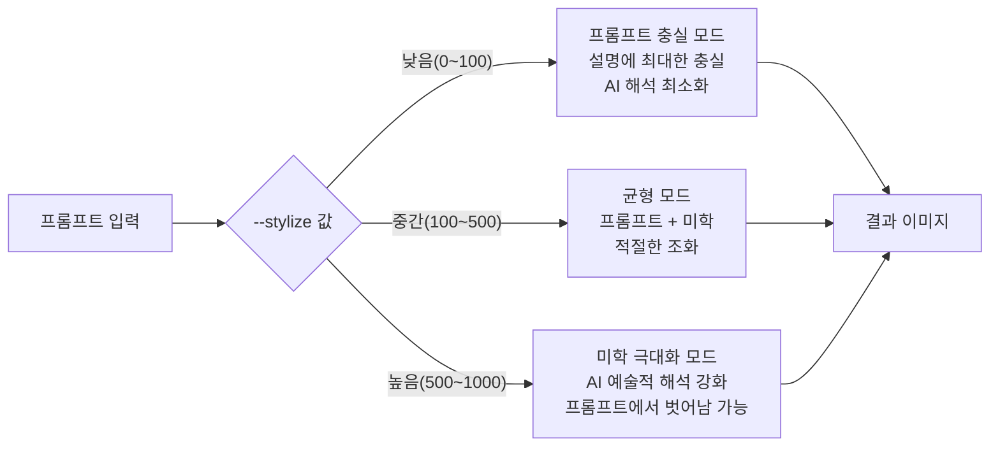
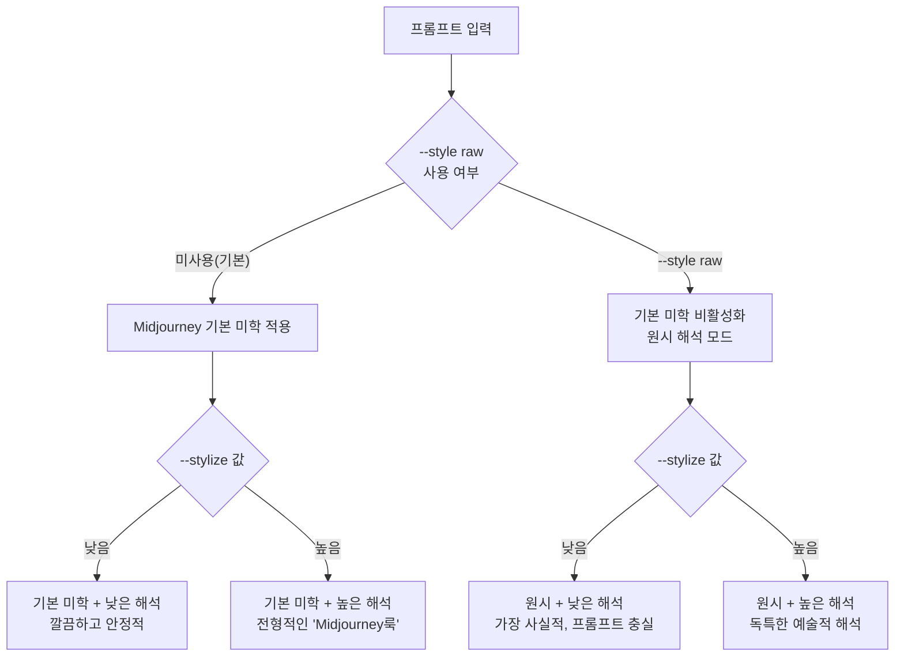
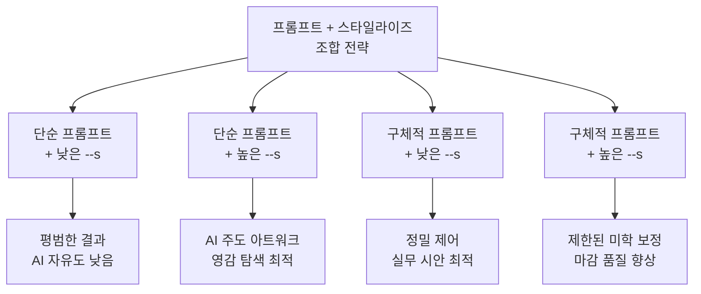

# 스타일라이즈(--stylize)와 미학 제어

> --stylize 파라미터로 AI의 미학적 해석 강도를 조절하고, 프롬프트 충실도와 예술성 사이의 균형을 찾는 법을 배웁니다.

## 개요

같은 프롬프트를 입력해도 결과물의 분위기가 완전히 달라지는 핵심 요인이 바로 `--stylize`(줄여서 `--s`) 파라미터입니다. 이 파라미터는 Midjourney가 이미지를 생성할 때 자체적인 미학적 판단을 얼마나 강하게 적용할지를 0~1000 범위로 제어합니다. 클라이언트 작업에서는 정확한 묘사가, 개인 창작에서는 AI의 예술적 해석이 중요하기 때문에 상황에 따라 이 값을 조절하는 것이 실무의 핵심 스킬입니다. 기본값은 100이며(V4~V7 동일), 프롬프트 끝에 `--s 250`처럼 추가하면 됩니다.

## --stylize의 작동 원리

`--stylize` 값이 높아질수록 AI는 색상 조화, 구도, 조명, 디테일에 자신의 미학적 판단을 더 강하게 적용합니다. 낮을수록 프롬프트 텍스트에 충실하게 이미지를 구성합니다.



기본 문법은 간단합니다:

```
a cozy coffee shop in autumn rain --s 250
```


## 값별 결과 비교

동일한 프롬프트로 `--stylize` 값만 바꾸면 결과가 어떻게 달라지는지 확인해봅시다.

```
a lighthouse on a cliff during sunset --s 0
```


```
a lighthouse on a cliff during sunset --s 100
```


```
a lighthouse on a cliff during sunset --s 500
```


```
a lighthouse on a cliff during sunset --s 1000
```


| 항목 | --s 0 | --s 100 | --s 250 | --s 500 | --s 1000 |
|------|-------|---------|---------|---------|----------|
| 프롬프트 충실도 | 매우 높음 | 높음 | 중간 | 낮음 | 매우 낮음 |
| 색감 풍부도 | 단조로움 | 자연스러움 | 풍부 | 매우 풍부 | AI 주도 |
| 구도 연출 | 없음 | 기본 규칙 | 적극 적용 | 영화적 | 과감한 해석 |
| 조명 극적 정도 | 평이 | 보통 | 강조됨 | 드라마틱 | 최대 극대화 |
| 글리치 위험 | 있음 | 낮음 | 매우 낮음 | 매우 낮음 | 낮음 |
| 예측 가능성 | 높음 | 높음 | 중간 | 낮음 | 매우 낮음 |

## --style raw와의 차이

`--stylize`가 미학 적용의 **강도**(볼륨)를 조절한다면, `--style raw`는 미학의 **종류**(이퀄라이저 프리셋)를 전환하는 것입니다. `--style raw`를 켜면 Midjourney의 기본 미화 필터가 비활성화되어 색감이 덜 포화되고, 프롬프트를 더 문자 그대로 해석합니다.

| 구분 | `--stylize` (--s) | `--style raw` |
|------|-------------------|---------------|
| 조절 대상 | 미학 적용의 **강도** (양) | 미학의 **종류** (질) |
| 값 형식 | 0~1000 숫자 | on/off (키워드) |
| 기본 상태 | 100 | 비활성 |
| 결과 경향 | 값에 따라 점진적 변화 | 더 사진적, 리터럴한 해석 |



같은 프롬프트로 `--style raw` 유무를 비교해봅시다:

```
a Japanese garden in morning mist, koi pond, stone lantern --s 250
```


```
a Japanese garden in morning mist, koi pond, stone lantern --s 250 --style raw
```


```
a Japanese garden in morning mist, koi pond, stone lantern --s 50 --style raw
```


## 프롬프트 복잡도와의 상호작용

프롬프트가 간결할수록 `--stylize`의 체감 효과가 커지고, 구체적일수록 효과가 줄어듭니다. AI에게 해석의 여지가 많을수록 스타일라이즈가 그 여지를 채우기 때문입니다.

```
a forest --s 750
```


```
a misty pine forest with golden morning light filtering through, moss-covered rocks, mushrooms on forest floor --s 750
```


```
a misty pine forest with golden morning light filtering through, moss-covered rocks --s 25
```


## 용도별 최적값 가이드

| 작업 유형 | 추천 범위 | --style raw | 이유 |
|-----------|----------|:-----------:|------|
| 제품/패키지 목업 | `--s 0~50` | O | 정확한 묘사 우선 |
| 기술 일러스트 | `--s 25~75` | O | 명확한 전달이 중요 |
| SNS 마케팅 이미지 | `--s 75~200` | - | 시선을 끌면서 메시지 전달 |
| 블로그/에디토리얼 | `--s 100~250` | O | 자연스러운 사진적 느낌 |
| 컨셉 아트/일러스트 | `--s 300~750` | - | 예술적 표현이 중요 |
| 앨범 커버/포스터 | `--s 500~1000` | - | 강렬한 비주얼 임팩트 |



## 실습

### 스타일라이즈 스펙트럼 체험

아래 프롬프트를 동일하게 유지하면서 `--stylize` 값만 바꿔 생성하고, 결과를 비교해보세요:

```
a small bookshop on a rainy street corner --ar 4:3 --s 0
```

```
a small bookshop on a rainy street corner --ar 4:3 --s 100
```

```
a small bookshop on a rainy street corner --ar 4:3 --s 500
```

```
a small bookshop on a rainy street corner --ar 4:3 --s 1000
```

### --style raw 비교 실험

동일한 프롬프트로 raw 유무와 스타일라이즈 값을 조합해 비교해보세요:

```
a woman reading in a sunlit cafe, warm afternoon light --s 100
```

```
a woman reading in a sunlit cafe, warm afternoon light --s 100 --style raw
```

```
a woman reading in a sunlit cafe, warm afternoon light --s 500
```

```
a woman reading in a sunlit cafe, warm afternoon light --s 500 --style raw
```

## 팁과 주의사항

- `--s 0`은 글리치나 아티팩트가 발생하기 쉽습니다. 프롬프트 충실도를 원한다면 `--s 25~75` 범위가 더 안정적입니다.
- `--stylize`와 `--style raw`는 완전히 다른 기능입니다. 전자는 미학의 강도, 후자는 미학의 종류를 바꿉니다. 둘을 함께 사용할 수 있습니다.
- 클라이언트가 "너무 AI스럽다"고 피드백하면, `--stylize`를 낮추기 전에 `--style raw`를 먼저 시도해보세요. Midjourney 기본 미학 자체가 강한 필터 역할을 합니다.
- 작업 시작 시 **3단계 접근법**을 추천합니다: `--s 100`(기본값)으로 시작 -> `--s 50`과 `--s 300` 두 방향으로 테스트 -> 최적 범위를 파악. GPU 시간을 절약하면서 빠르게 원하는 결과에 도달할 수 있습니다.
- V6/V7에서 많은 경험 있는 유저들이 **55~100 범위**를 "스위트 스팟"으로 꼽습니다. 기본값 100도 이미 충분히 예술적입니다.
- `--chaos`와 함께 사용하면 시너지가 강합니다. `--chaos`는 결과의 다양성, `--stylize`는 각 결과의 예술적 해석 강도를 결정합니다.

## 핵심 정리

| 개념 | 설명 |
|------|------|
| `--stylize` / `--s` | AI의 미학적 해석 강도를 0~1000 범위로 제어하는 파라미터 |
| 기본값 | 100 (V4~V7 전 버전 동일) |
| 낮은 값 (0~100) | 프롬프트에 충실, 예술적 해석 최소화. 0은 글리치 주의 |
| 중간 값 (100~500) | 충실도와 미학의 균형. 대부분의 실무에 적합 |
| 높은 값 (500~1000) | AI 예술적 해석 극대화. 프롬프트에서 벗어날 수 있음 |
| `--style raw` | 미학의 종류를 전환. stylize와 별개로 작동하며 병행 가능 |
| 프롬프트와의 관계 | 프롬프트가 구체적일수록 스타일라이즈의 체감 효과 감소 |
| 실무 스위트 스팟 | V6/V7 기준 55~100 범위 |

## 다음 섹션 미리보기

이번 섹션에서 `--stylize`로 AI의 미학적 해석 강도를 조절하는 법을 배웠다면, 다음 섹션 [04. 카오스(--chaos)와 다양성 탐색](05-ch5-midjourney-기본과-파라미터-튜닝/04-04-카오스--chaos와-다양성-탐색.md)에서는 결과물의 다양성과 예측 불가능성을 제어하는 `--chaos` 파라미터를 다룹니다. 두 파라미터를 조합하면 정밀한 크리에이티브 제어가 가능해집니다.
