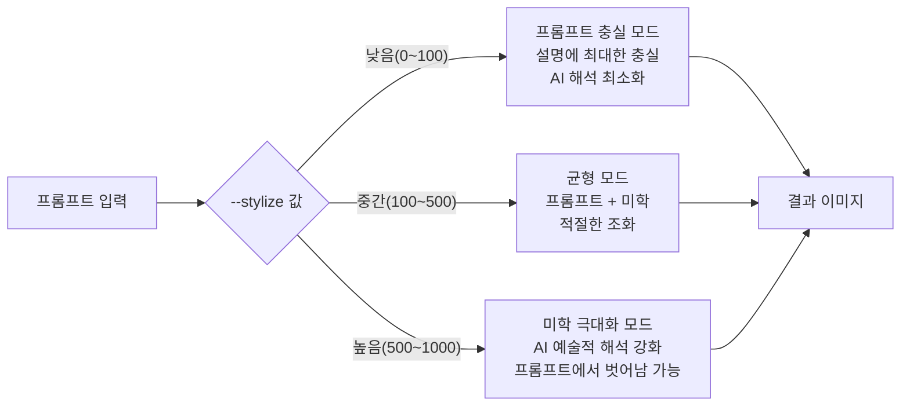
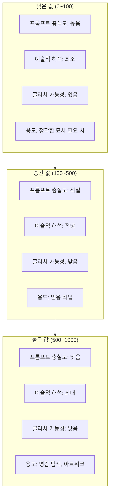
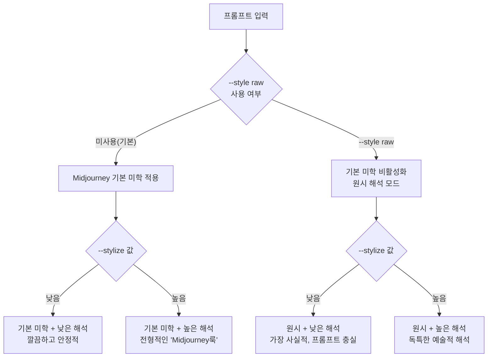
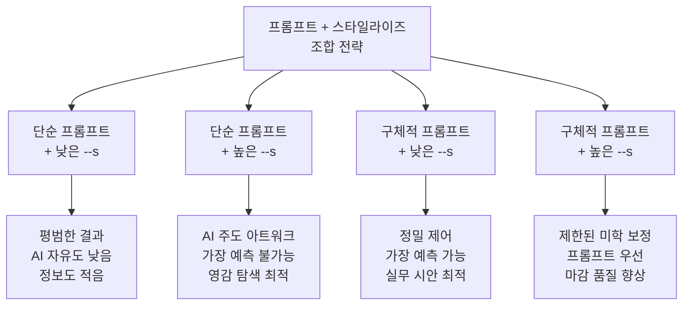
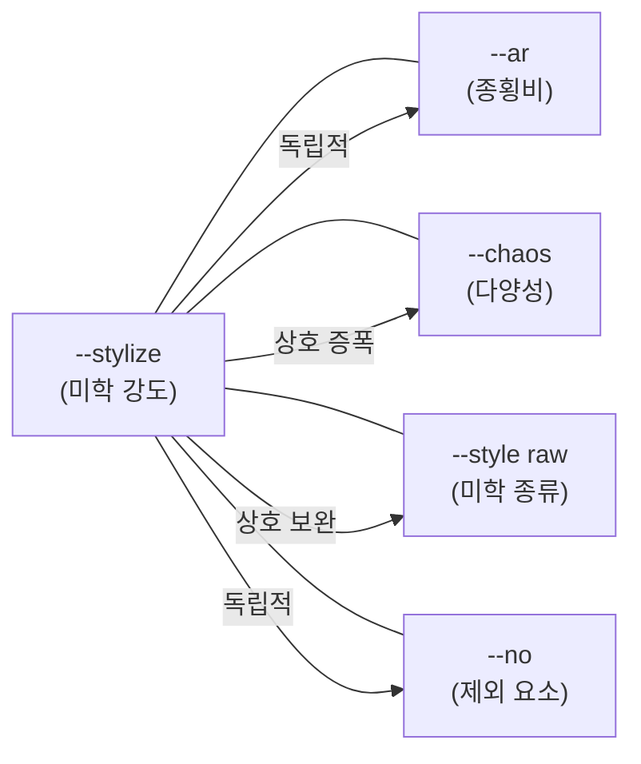
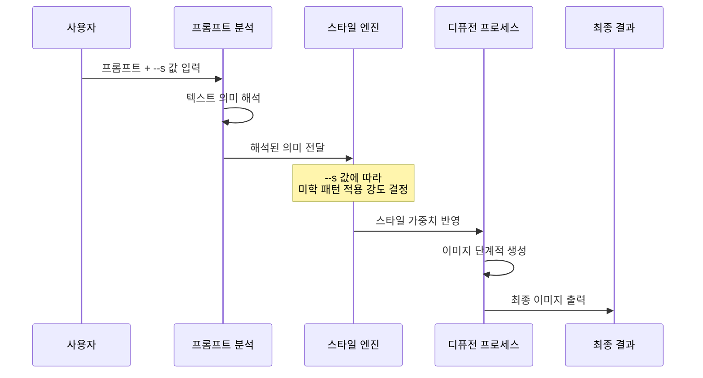

# 스타일라이즈(--stylize)와 미학 제어

> Midjourney의 --stylize 파라미터로 AI의 미학적 해석 강도를 조절하고, 프롬프트 충실도와 예술성 사이의 최적 균형을 찾는 법을 배웁니다.

## 개요

이 섹션에서는 Midjourney의 핵심 파라미터 중 하나인 `--stylize`(줄여서 `--s`)를 깊이 있게 다룹니다. 이 파라미터는 **AI가 여러분의 프롬프트를 얼마나 자유롭게 해석할 수 있는지**를 결정하는 일종의 "예술적 자유도 다이얼"인데요. 앞서 [02. 종횡비(--ar)와 구도 제어](05-ch5-midjourney-기본과-파라미터-튜닝/02-02-종횡비--ar와-구도-제어.md)에서 이미지의 물리적 형태를 제어하는 법을 배웠다면, 이번에는 이미지의 **미학적 느낌** 자체를 제어하는 법을 익힙니다.

**선수 지식**: [01. Midjourney 인터페이스와 기본 생성](05-ch5-midjourney-기본과-파라미터-튜닝/01-01-midjourney-인터페이스와-기본-생성.md)에서 배운 Imagine Bar 사용법과 파라미터 입력 방법

**학습 목표**:
- `--stylize` 파라미터의 작동 원리와 값 범위(0~1000)를 이해한다
- 낮은 값과 높은 값이 결과물에 미치는 차이를 예측할 수 있다
- `--style raw`와 `--stylize`의 차이를 구분하고 적절히 조합할 수 있다
- 프로젝트 목적에 따라 최적의 스타일라이즈 값을 선택하는 전략을 세울 수 있다

## 왜 알아야 할까?

같은 프롬프트를 입력해도 어떤 결과물은 프롬프트에 딱 맞는 "설명 그대로"의 이미지가 나오고, 어떤 결과물은 예상 밖의 멋진 예술적 해석이 담긴 이미지가 나옵니다. 이 차이를 만드는 핵심이 바로 `--stylize`입니다.

디자이너에게 이 파라미터가 중요한 이유는 명확합니다. **클라이언트 작업**에서는 요청한 내용이 정확히 반영되어야 하고, **개인 창작**에서는 AI의 예술적 해석이 오히려 영감을 줄 수 있거든요. 상황에 따라 이 다이얼을 조절할 줄 아는 것이 **프로 크리에이터와 초보자의 차이**입니다.

[프롬프트 해부학: 6요소 프레임워크](02-ch2-프롬프트-구조-마스터/01-01-프롬프트-해부학-6요소-프레임워크.md)에서 배운 정교한 프롬프트를 작성해도, `--stylize` 값에 따라 결과물이 180도 달라질 수 있습니다. 즉, 프롬프트 기술과 파라미터 제어는 **양쪽 날개**처럼 함께 작동해야 하는 거죠.

## 핵심 개념

### 개념 1: --stylize란 무엇인가 — "감독의 개입도" 다이얼

> 💡 **비유**: 영화를 찍는다고 상상해보세요. 시나리오(프롬프트)가 "카페에서 커피를 마시는 여자"라고 적혀 있을 때, **다큐멘터리 감독**은 있는 그대로를 담을 것이고, **웨스 앤더슨 감독**은 대칭 구도에 파스텔 색감, 빈티지 소품으로 장면을 완전히 재해석할 겁니다. `--stylize`는 바로 이 **"감독의 개입 정도"**를 조절하는 다이얼입니다. 0에 가까울수록 다큐멘터리 감독, 1000에 가까울수록 웨스 앤더슨 감독이 되는 거죠.

`--stylize`(약어 `--s`)는 Midjourney가 이미지를 생성할 때 **자체적인 미학적 판단을 얼마나 강하게 적용할지**를 결정하는 파라미터입니다. 구체적으로 다음 요소에 영향을 미칩니다:

- **색상 조화**: 높을수록 AI가 더 조화로운 색 팔레트를 선택
- **구도와 프레이밍**: 높을수록 전통적인 "좋은 구도" 규칙을 더 적극적으로 적용
- **조명과 분위기**: 높을수록 드라마틱하고 영화적인 라이팅 연출
- **디테일과 질감**: 높을수록 풍부한 텍스처와 세밀한 묘사

> 📊 **그림 1**: --stylize 파라미터의 작동 원리



**기본 문법**은 간단합니다. 프롬프트 끝에 추가하기만 하면 됩니다:

```
a cozy coffee shop in autumn rain --s 250
```

- **값 범위**: 0 ~ 1000 (정수)
- **기본값**: 100 (V4 이후 모든 버전 — V5, V6, V7 포함 — 에서 동일. 미지정 시 자동 적용)
- **약어**: `--stylize 250` = `--s 250`

> 💡 **알고 계셨나요?**: 초기 Midjourney(V1~V3)에서는 `--stylize`의 범위가 625~60000이었고 기본값이 2500이었습니다. V4에서 0~1000 범위로 대폭 단순화되고 기본값이 100으로 낮아졌는데, 이 체계가 V5 → V6 → V7까지 그대로 유지되고 있습니다. Midjourney 공식 문서에서도 현재 기본값을 **100**으로 명시하고 있어요.

### 개념 2: 값별 결과 비교 — 0에서 1000까지의 스펙트럼

> 💡 **비유**: 요리사에게 "파스타를 만들어줘"라고 했을 때를 떠올려보세요. `--s 0`은 "레시피 그대로만 해"이고, `--s 500`은 "네 스타일대로 좀 변형해도 돼", `--s 1000`은 "자유롭게 창작해!"와 같습니다. 낮은 값에서는 재료 목록 그대로 나오고, 높은 값에서는 감동적인 요리가 나올 수도 있지만 원래 주문과 다를 수도 있는 거죠.

동일한 프롬프트 `a lighthouse on a cliff during sunset`으로 각 값별 경향을 살펴보겠습니다:

**`--s 0` (최소 스타일라이즈)**
- 프롬프트에 가장 충실하지만 "날것" 같은 느낌
- 색감이 단조롭고, 구도가 평범
- 배경 디테일이 부족하거나 글리치(artifacts)가 발생할 수 있음
- 마치 초안(draft)처럼 보이는 경우가 많음

**`--s 100` (기본값)**
- 프롬프트 충실도와 미학의 균형점
- 대부분의 작업에 적합한 "안전한" 선택
- 자연스러운 색감과 기본적인 구도 규칙 적용

**`--s 250` (중간)**
- 약간의 예술적 터치가 가미
- 조명이 더 극적으로 변하고 색 대비가 풍부해짐
- 프롬프트 핵심 요소는 여전히 유지

**`--s 500` (높음)**
- AI의 미학적 판단이 눈에 띄게 작동
- 영화적 구도, 드라마틱한 색감
- 프롬프트에 없던 요소(구름 질감, 파도 패턴 등)가 추가될 수 있음

**`--s 1000` (최대)**
- AI가 가장 "예술적"이라고 판단하는 방향으로 최대한 해석
- 때로는 놀라운 걸작이, 때로는 프롬프트와 동떨어진 결과가 나옴
- 색감, 조명, 구도 모두 AI의 미학 기준에 의해 결정

아래 표로 핵심 차이를 한눈에 비교해보세요:

| 항목 | --s 0 | --s 100 | --s 250 | --s 500 | --s 1000 |
|------|-------|---------|---------|---------|----------|
| 프롬프트 충실도 | 매우 높음 | 높음 | 중간 | 낮음 | 매우 낮음 |
| 색감 풍부도 | 단조로움 | 자연스러움 | 풍부 | 매우 풍부 | AI 주도 |
| 구도 연출 | 없음 | 기본 규칙 | 적극 적용 | 영화적 | 과감한 해석 |
| 조명 극적 정도 | 평이 | 보통 | 강조됨 | 드라마틱 | 최대 극대화 |
| 글리치 위험 | 있음 | 낮음 | 매우 낮음 | 매우 낮음 | 낮음 |
| 예측 가능성 | 높음 | 높음 | 중간 | 낮음 | 매우 낮음 |

> 📊 **그림 2**: 스타일라이즈 값에 따른 결과 변화 스펙트럼



> ⚠️ **흔한 오해**: "스타일라이즈 값이 높을수록 무조건 좋은 이미지가 나온다"고 생각하기 쉬운데, 사실이 아닙니다. 높은 값은 **더 예술적인** 이미지를 만들 뿐, **더 좋은** 이미지를 만드는 것은 아닙니다. 제품 사진이나 기술 일러스트처럼 정확성이 중요한 작업에서는 낮은 값이 오히려 "더 좋은" 결과입니다.

### 개념 3: --style raw — 미학의 "종류"를 바꾸는 스위치

> 💡 **비유**: `--stylize`가 스피커의 **볼륨 다이얼**이라면, `--style raw`는 **이퀄라이저 프리셋**을 바꾸는 것과 같습니다. 볼륨(stylize)은 음량의 크기를 바꾸지만, 이퀄라이저(style raw)는 소리의 성격 자체를 바꾸죠. "팝" 프리셋에서 "클래식" 프리셋으로 전환하는 것처럼, `--style raw`는 Midjourney의 기본 미학 필터를 걷어내고 더 원시적인(raw) 스타일로 전환합니다.

`--stylize`와 자주 혼동되지만 전혀 다른 기능을 하는 파라미터가 바로 `--style raw`입니다. 이 둘의 차이를 명확히 이해하는 것이 중요합니다:

| 구분 | `--stylize` (--s) | `--style raw` |
|------|-------------------|---------------|
| 조절 대상 | 미학 적용의 **강도** (양) | 미학의 **종류** (질) |
| 값 형식 | 0~1000 숫자 | on/off (키워드) |
| 기본 상태 | 100 | 비활성 (기본 스타일 적용) |
| 효과 | AI 해석 강도 조절 | Midjourney 기본 "예쁘게 만들기" 비활성화 |
| 결과 경향 | 값에 따라 점진적 변화 | 더 사진적, 리터럴한 해석 |

**`--style raw`의 핵심 효과**:
- Midjourney의 기본 미화(beautification) 필터가 비활성화됨
- 색감이 덜 포화되고, 조명이 덜 드라마틱해짐
- 프롬프트를 더 문자 그대로(literally) 해석
- 사실적인 사진이나 다큐멘터리 느낌에 적합

> 📊 **그림 3**: --stylize와 --style raw의 관계



**조합 전략**:
- `--style raw --s 50`: 가장 사실적이고 프롬프트에 충실한 결과. 제품 사진, 기술 문서용 이미지에 최적
- `--style raw --s 250`: Midjourney 특유의 "과하게 예쁜" 느낌 없이 적당한 예술성. 편집 사진, 저널리즘 스타일
- `--style raw --s 750`: Midjourney 기본 미학과 다른 독특한 예술적 해석. 실험적 아트워크

> 🔥 **실무 팁**: 클라이언트가 "너무 AI스럽다", "너무 뽀샵 느낌이다"라고 피드백할 때, `--stylize` 값을 낮추기 전에 `--style raw`를 먼저 시도해보세요. Midjourney의 기본 미학 자체가 꽤 강한 "필터" 역할을 하기 때문에, raw 모드로 전환하면 한층 자연스러운 결과를 얻을 수 있습니다.

### 개념 4: 프롬프트 복잡도와 스타일라이즈의 상호작용

> 💡 **비유**: 네비게이션에 목적지를 입력하는 것과 비슷합니다. "서울"이라고만 입력하면(단순 프롬프트) 네비게이션이 알아서 최적 경로를 고르듯, 높은 스타일라이즈에서 AI가 더 자유롭게 해석합니다. 반면 "서울시 강남구 역삼동 123번지, 골목길 우회, 고속도로 제외"라고 세세하게 입력하면(복잡한 프롬프트) 네비게이션의 자유도가 줄어들듯, 스타일라이즈 효과도 제한됩니다.

프롬프트의 **길이와 구체성**에 따라 `--stylize`의 체감 효과가 달라지는데요. 이것은 실무에서 매우 중요한 포인트입니다:

**간결한 프롬프트 + 높은 스타일라이즈**
- 프롬프트: `a forest --s 750`
- AI에게 해석의 여지가 많아서 스타일라이즈의 효과가 극대화됨
- 영감 탐색, 무드보드 초안 제작에 적합

**구체적인 프롬프트 + 높은 스타일라이즈**
- 프롬프트: `a misty pine forest with golden morning light filtering through, birds flying, mushrooms on forest floor, moss-covered rocks --s 750`
- 프롬프트 자체가 이미 많은 것을 지정하므로 AI의 추가 해석 여지가 제한됨
- 스타일라이즈의 체감 효과가 상대적으로 줄어듦

**구체적인 프롬프트 + 낮은 스타일라이즈**
- 프롬프트: `a misty pine forest with golden morning light filtering through --s 25`
- 프롬프트가 구체적이고 AI 해석도 최소 → 가장 예측 가능한 결과
- 정확한 디자인 시안 제작에 적합

> 📊 **그림 4**: 프롬프트 복잡도와 스타일라이즈의 상호작용 매트릭스



### 개념 5: 용도별 최적 스타일라이즈 전략

여기서 핵심은 **"정답은 없고, 최적의 범위만 있다"**는 겁니다. 프로젝트 성격에 따라 접근법이 달라져야 합니다.

| 작업 유형 | 추천 범위 | --style raw 병행 | 이유 |
|-----------|----------|:---:|------|
| 제품/패키지 목업 | `--s 0~50` | O | 정확한 묘사 우선, 창의적 왜곡 최소화 |
| 기술 일러스트/다이어그램 | `--s 25~75` | O | 명확한 전달이 중요, 과한 연출 불필요 |
| SNS 마케팅 이미지 | `--s 75~200` | - | 시선을 끌면서도 메시지 전달 필요 |
| 블로그/에디토리얼 사진 | `--s 100~250` | O | 자연스러운 사진적 느낌과 적당한 분위기 |
| 무드보드 초안 | `--s 250~500` | - | 다양한 분위기 탐색이 목적 |
| 컨셉 아트/일러스트 | `--s 300~750` | - | 예술적 표현이 중요한 작업 |
| 앨범 커버/포스터 아트 | `--s 500~1000` | - | 강렬한 비주얼 임팩트 필요 |
| 영감 탐색/실험 | `--s 500~1000` | 선택 | AI의 해석에서 아이디어 발견 |

> 🔥 **실무 팁**: 많은 경험 있는 Midjourney 유저들이 V6/V7에서 **55~100 범위**를 "스위트 스팟"으로 꼽습니다. 기본값 100도 이미 충분히 예술적이에요. 처음에는 기본값에서 시작해서 위아래로 조절해가는 것이 가장 효율적인 접근법입니다.

### 개념 6: 스타일라이즈와 다른 파라미터의 시너지

`--stylize`는 단독으로도 강력하지만, 다른 파라미터와 조합하면 훨씬 정밀한 제어가 가능합니다. 특히 다음 섹션에서 배울 `--chaos`와의 관계를 미리 이해해두면 좋습니다.

> 📊 **그림 5**: --stylize와 주요 파라미터의 조합 관계



**`--stylize` + `--ar`**: 독립적으로 작동하지만, 종횡비가 바뀌면 AI의 구도 해석도 달라지기 때문에 스타일라이즈의 **체감 효과**가 간접적으로 변합니다. 예를 들어 `--ar 16:9`의 파노라마 구도에서는 `--s 500`의 영화적 연출이 더 극적으로 느껴집니다.

**`--stylize` + `--chaos`**: 시너지가 강한 조합입니다. `--chaos`가 "얼마나 다양한 결과를 생성할지"를 결정하고, `--stylize`가 "각 결과의 예술적 해석 강도"를 결정합니다. 둘 다 높이면 매번 전혀 다른 예술 작품이 나옵니다.

**`--stylize` + `--style raw`**: 상호 보완적인 조합입니다. `--style raw`로 Midjourney 기본 미학을 걷어낸 상태에서 `--stylize`를 조절하면, Midjourney 특유의 "과한 예쁨" 없이도 예술적 해석 강도를 세밀하게 제어할 수 있습니다.

**`--stylize` + `--no`**: 독립적으로 작동합니다. `--no`는 특정 요소를 제외하고, `--stylize`는 남은 요소들의 미학적 처리를 담당합니다.

**대표적인 파라미터 조합 레시피**:

| 목표 | 조합 예시 | 설명 |
|------|----------|------|
| 영화적 스틸컷 | `--ar 21:9 --s 500` | 시네마 비율 + 높은 미학으로 극적인 장면 |
| 자연스러운 제품 사진 | `--ar 1:1 --s 25 --style raw` | 정방형 + 최소 해석 + raw로 과한 연출 제거 |
| 창의적 탐색 | `--s 750 --chaos 50` | 높은 미학 + 높은 다양성으로 예측 불가능한 영감 |
| 편집 사진풍 | `--ar 3:2 --s 150 --style raw` | 사진 비율 + 적당한 해석 + raw로 리얼리즘 유지 |
| 안정적 아트워크 | `--s 400 --chaos 10` | 높은 미학이지만 결과의 일관성 유지 |

## 실습: 적용해보기

### 활동 1: 스타일라이즈 스펙트럼 체험

아래 프롬프트를 **동일하게** 유지하면서 `--stylize` 값만 바꿔 5번 생성해보세요:

**기본 프롬프트**: `a small bookshop on a rainy street corner --ar 4:3`

1. `--s 0`으로 생성
2. `--s 100`으로 생성 (기본값)
3. `--s 250`으로 생성
4. `--s 500`으로 생성
5. `--s 1000`으로 생성

**관찰 포인트** (결과를 비교하면서 아래를 기록해보세요):

| 관찰 항목 | --s 0 | --s 100 | --s 250 | --s 500 | --s 1000 |
|-----------|-------|---------|---------|---------|----------|
| 색감의 풍부함 | | | | | |
| 조명의 극적 정도 | | | | | |
| 프롬프트 요소 반영 정도 | | | | | |
| 배경 디테일 수준 | | | | | |
| 전체적인 "예술적 느낌" | | | | | |

### 활동 2: --style raw 비교 실험

동일한 프롬프트로 `--style raw`의 유무를 비교해보세요:

**프롬프트**: `a woman reading in a sunlit cafe, warm afternoon light`

| 조합 | 예상 결과 | 적합한 용도 |
|------|----------|------------|
| `--s 100` (기본) | ____ | ____ |
| `--s 100 --style raw` | ____ | ____ |
| `--s 500` | ____ | ____ |
| `--s 500 --style raw` | ____ | ____ |

먼저 예상을 적은 뒤, 실제로 생성해서 비교해보세요. 예상과 얼마나 달랐나요?

### 활동 3: 프로젝트 시나리오별 최적값 찾기

다음 세 가지 시나리오에 대해, 가장 적합한 `--stylize` 범위와 `--style raw` 사용 여부를 선택하고 그 이유를 적어보세요:

**시나리오 A**: 온라인 쇼핑몰의 가방 제품 사진 배경으로 사용할 미니멀한 스튜디오 이미지
- 추천 `--s` 값: ____
- `--style raw` 사용 여부: ____
- 이유: ____

**시나리오 B**: 인디 밴드의 앨범 커버 아트. "몽환적이고 초현실적인 숲" 컨셉
- 추천 `--s` 값: ____
- `--style raw` 사용 여부: ____
- 이유: ____

**시나리오 C**: 여행 블로그에 올릴 "파리의 봄" 분위기 사진
- 추천 `--s` 값: ____
- `--style raw` 사용 여부: ____
- 이유: ____

### 활동 4: 토론 질문

> "스타일라이즈 값이 높을수록 더 '좋은' 이미지인가, 아니면 더 '다른' 이미지인가?"

이 질문에 대해 자신의 입장을 정리해보세요. "좋은 이미지"의 기준은 누가, 어떤 목적으로 정하느냐에 따라 달라집니다. 상업 디자인과 순수 예술에서 "좋음"의 기준이 어떻게 다른지 생각해보세요.

## 더 깊이 알아보기

### --stylize의 탄생 — Midjourney의 미학 철학

`--stylize` 파라미터의 역사를 거슬러 올라가면, Midjourney 팀의 흥미로운 철학이 드러납니다. Midjourney의 창업자 **데이비드 홀츠(David Holz)**는 원래 Leap Motion이라는 손 추적 기술 회사의 공동창업자였는데요. 그가 AI 이미지 생성 도구를 만들 때 핵심적으로 고민한 것이 바로 **"AI는 도구인가, 아티스트인가"**라는 질문이었습니다.

초기 Midjourney(V1~V3 시절)에서 `--stylize`의 범위는 625~60000이라는 훨씬 넓은 범위였습니다. 기본값도 2500이었죠. 이 시절에는 AI의 미학적 개입이 기본적으로 매우 강했습니다. 그러다 V4에서 범위가 0~1000으로 재조정되고 기본값이 100으로 낮아졌는데, 이는 **사용자에게 더 많은 제어권을 돌려주겠다**는 Midjourney 팀의 방향 전환을 보여줍니다.

V7(2025년 4월 출시)에서도 이 0~1000 범위와 기본값 100은 유지되고 있지만, 전체적인 모델 아키텍처가 개선되면서 같은 `--s 500`이라도 이전 버전보다 더 세련되고 일관된 결과물을 보여주는 경향이 있습니다. 즉 버전이 올라갈수록 Midjourney의 "기본 미학 수준" 자체가 높아지고 있는 셈이죠.

### 숫자 뒤의 과학: AI는 "예쁨"을 어떻게 아는가

`--stylize`가 높을 때 AI가 더 "예술적인" 이미지를 만든다는 건, AI가 **미학적 판단 기준**을 가지고 있다는 뜻입니다. 이 기준은 어디서 올까요?

Midjourney 같은 디퓨전 모델은 수억 장의 이미지로 학습됩니다. 이 과정에서 AI는 "사람들이 좋아하는 이미지"의 패턴을 학습하게 되는데요 — 황금비 구도, 보색 대비, 림 라이팅(rim lighting) 같은 전통적인 미학 원칙들이 통계적으로 높은 선호도를 보이기 때문에, AI가 이런 패턴을 강하게 적용할수록 "예술적"으로 느껴지는 결과가 나오는 겁니다.

`--stylize` 값은 바로 이 **학습된 미학 패턴의 적용 강도**를 조절합니다. 0에 가까우면 학습된 미학을 거의 적용하지 않고 프롬프트의 텍스트 정보만으로 이미지를 구성하고, 1000에 가까우면 학습된 미학 패턴을 최대한 강하게 적용하는 것이죠.

> 📊 **그림 6**: 스타일라이즈 값과 AI 내부 처리의 관계



## 흔한 오해와 팁

> ⚠️ **흔한 오해**: "--stylize 0이 가장 정확한 이미지를 만든다"고 생각하기 쉽지만, `--s 0`은 종종 **글리치나 아티팩트**가 발생하고 배경이 허전해지는 경우가 많습니다. 프롬프트 충실도를 원한다면 `--s 0`보다는 **`--s 25~75`** 범위가 더 안정적이고 실용적입니다.

> ⚠️ **흔한 오해**: "`--stylize`와 `--style raw`는 같은 기능이다"라고 생각하는 분들이 많은데, 완전히 다릅니다. `--stylize`는 미학 해석의 **강도**(볼륨)를 조절하고, `--style raw`는 미학의 **종류**(이퀄라이저 프리셋)를 전환합니다. 둘을 함께 사용할 수도 있고, 각각 독립적인 효과를 냅니다.

> 💡 **알고 계셨나요?**: V4 이전의 초기 Midjourney에서는 `--stylize`의 기본값이 2500이었고 범위가 625~60000이었습니다. 현재의 0~1000, 기본값 100 체계는 V4에서 도입되어 V5, V6, V7까지 일관되게 유지되고 있습니다. Midjourney 공식 문서에서도 이를 확인할 수 있어요.

> 🔥 **실무 팁**: 작업을 시작할 때 **3단계 접근법**을 추천합니다. 먼저 `--s 100`(기본값)으로 프롬프트가 잘 작동하는지 확인하고, 프롬프트가 만족스러우면 `--s 50`과 `--s 300` 두 방향으로 테스트하여 해당 프롬프트의 최적 범위를 파악하세요. 이렇게 하면 무작정 여러 값을 돌려보는 것보다 **GPU 시간을 절약**하면서 빠르게 원하는 결과에 도달할 수 있습니다.

## 핵심 정리

| 개념 | 설명 |
|------|------|
| `--stylize` / `--s` | AI의 미학적 해석 강도를 0~1000 범위로 제어하는 파라미터 |
| 기본값 | 100 (V4~V7 전 버전 동일. 미지정 시 자동 적용) |
| 낮은 값 (0~100) | 프롬프트에 충실, 예술적 해석 최소화. 단 0은 글리치 주의 |
| 중간 값 (100~500) | 프롬프트 충실도와 미학의 균형. 대부분의 실무에 적합 |
| 높은 값 (500~1000) | AI 예술적 해석 극대화. 프롬프트에서 벗어날 수 있음 |
| `--style raw` | 미학의 종류를 전환. stylize와 별개로 작동하며 병행 사용 가능 |
| 프롬프트와의 관계 | 프롬프트가 구체적일수록 스타일라이즈의 체감 효과가 감소 |
| 실무 스위트 스팟 | V6/V7 기준 55~100 범위가 범용적으로 추천됨 |
| 다른 파라미터와 조합 | `--chaos`와 시너지 효과, `--ar`과는 간접적 상호작용, `--style raw`와 상호 보완 |

## 다음 섹션 미리보기

이번 섹션에서 `--stylize`로 AI의 **미학적 해석 강도**를 조절하는 법을 배웠다면, 다음 섹션 [04. 카오스(--chaos)와 다양성 탐색](05-ch5-midjourney-기본과-파라미터-튜닝/04-04-카오스--chaos와-다양성-탐색.md)에서는 **결과물의 다양성과 예측 불가능성**을 제어하는 `--chaos` 파라미터를 다룹니다. `--stylize`가 "얼마나 예술적으로?"라면, `--chaos`는 "얼마나 다양하게?"를 결정하는 파라미터죠. 두 파라미터를 조합하면 정밀한 크리에이티브 제어가 가능해집니다.

## 참고 자료

- [Stylize – Midjourney 공식 문서](https://docs.midjourney.com/hc/en-us/articles/32196176868109-Stylize) - `--stylize` 파라미터의 공식 설명과 범위, 기본값 정보
- [Style Raw – Midjourney 공식 문서](https://docs.midjourney.com/hc/en-us/articles/32196177447309-Style-Raw) - `--style raw` 파라미터의 공식 설명과 `--stylize`와의 차이점
- [Midjourney Parameter List – 공식 파라미터 목록](https://docs.midjourney.com/hc/en-us/articles/32859204029709-Parameter-List) - 모든 파라미터의 최신 범위와 문법을 한눈에 확인
- [Midjourney V6 In-Depth Review Part 3: Parameters (Midlibrary)](https://midlibrary.io/midguide/midjourney-v6-in-depth-review-part-3-parameters) - Stylize, Chaos, Weird 등 파라미터별 심층 비교와 실전 예제
- [Midjourney Stylize Parameter Guide (Easy AI Beginner)](https://easyaibeginner.com/midjourneys-stylize-parameter/) - 초보자 친화적인 스타일라이즈 가이드와 값별 시각적 비교

---
### 🔗 Related Sessions
- [imagine bar](05-ch5-midjourney-기본과-파라미터-튜닝/01-01-midjourney-인터페이스와-기본-생성.md) (prerequisite)
- [4장 그리드](05-ch5-midjourney-기본과-파라미터-튜닝/01-01-midjourney-인터페이스와-기본-생성.md) (prerequisite)
- [프롬프트](01-ch1-ai-이미지-생성-개론/01-01-생성형-ai가-바꾸는-디자인-워크플로우.md) (prerequisite)
- [6요소 프레임워크](02-ch2-프롬프트-구조-마스터/01-01-프롬프트-해부학-6요소-프레임워크.md) (prerequisite)
- [--ar(aspect ratio)](05-ch5-midjourney-기본과-파라미터-튜닝/02-02-종횡비--ar와-구도-제어.md) (prerequisite)
