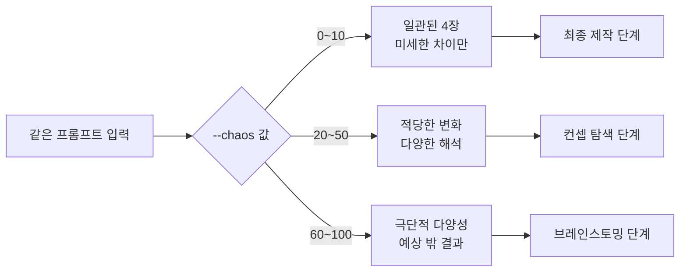
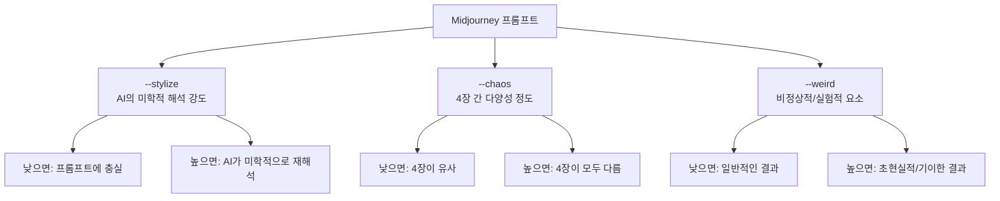
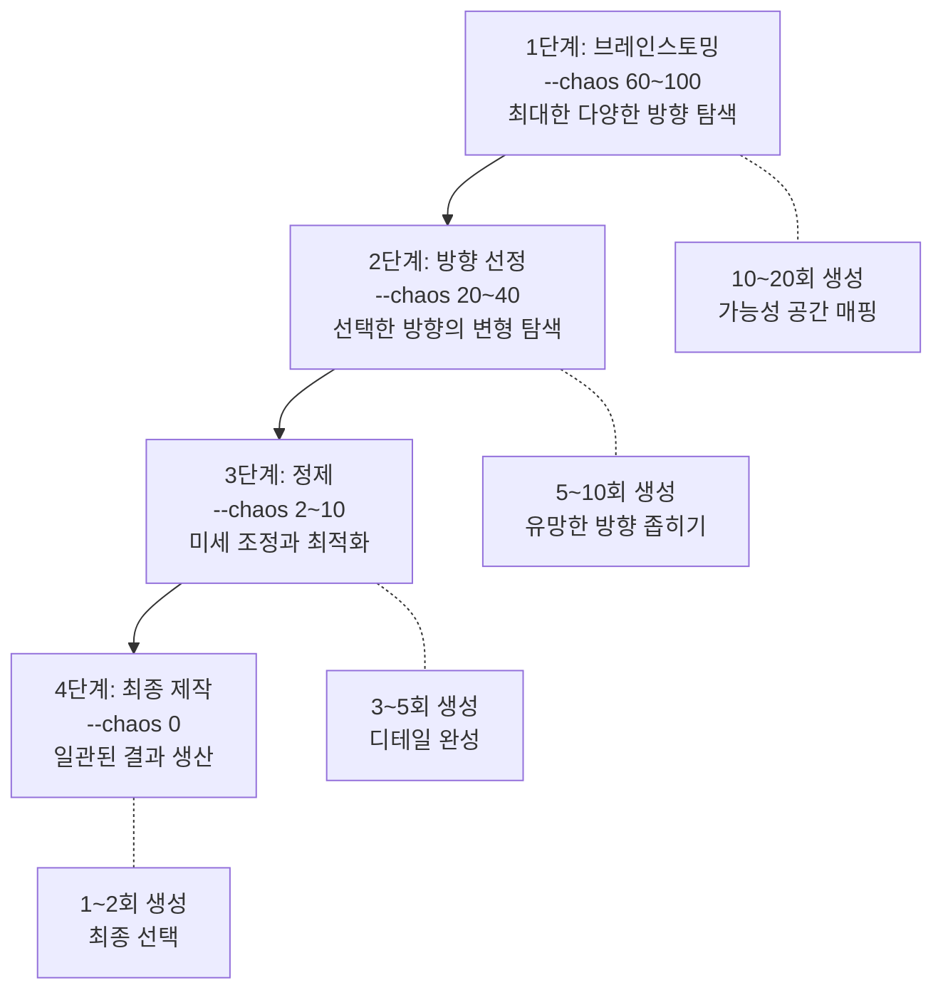

# 카오스(--chaos)와 다양성 탐색

> --chaos 파라미터로 Midjourney 결과물의 다양성을 제어하고, 아이디어 탐색부터 최종 제작까지 단계별 활용 전략을 마스터합니다.

## 개요

`--chaos`(또는 `--c`)는 Midjourney가 4장의 이미지를 생성할 때 **각 이미지 간의 다양성**을 제어하는 파라미터입니다. 값 범위는 **0~100**(기본값 0)이며, 웹 인터페이스에서는 "Variety"라는 이름으로도 표시됩니다. 탐색 단계에서는 높은 chaos로 예상 밖의 영감을 발견하고, 최종 제작에서는 낮은 chaos로 일관된 결과를 얻는 것이 핵심입니다. 이 전략을 모르면 탐색이 필요할 때 비슷한 결과만 반복하거나, 최종 단계에서 결과가 들쑥날쑥해지는 문제에 빠지게 됩니다.



## 핵심 개념

### --chaos 값 구간별 효과

chaos는 이미지의 "품질"이 아니라, 4장 이미지가 서로 **얼마나 다르게** 나오느냐를 제어합니다. 구도, 색상, 시점, 분위기 등 모든 요소가 chaos 값에 따라 통일되거나 갈라집니다.

| chaos 구간 | 다양성 수준 | 프롬프트 충실도 | 주요 용도 |
|-----------|-----------|--------------|---------|
| 0 | 최소 | 매우 높음 | 최종 시안, 일관성 필요 시 |
| 2~10 | 미세~낮음 | 높음 | 미세 조정, 변형 비교 |
| 20~50 | 중간 | 보통 | 컨셉 탐색, 방향 탐색 |
| 60~100 | 높음~극단 | 낮음 | 브레인스토밍, 영감 발견 |

낮은 값에서도 눈에 띄는 변화가 나타납니다. "a little chaos goes a long way"라는 표현이 있을 정도로, 2~10 구간을 "스위트 스팟"으로 꼽는 전문 사용자가 많습니다.

**chaos 0 -- 일관된 결과:**

```
a cozy reading nook with natural light, watercolor style --ar 3:4 --c 0
```


**chaos 25 -- 적당한 변형:**

```
a cozy reading nook with natural light, watercolor style --ar 3:4 --c 25
```


**chaos 75 -- 높은 다양성:**

```
a cozy reading nook with natural light, watercolor style --ar 3:4 --c 75
```


### --chaos vs --stylize vs --weird

세 파라미터를 명확히 구분하는 것이 중요합니다.



- **--stylize**: 모든 4장의 미학적 품질을 **균일하게** 올리거나 내림. "얼마나 예쁘게?"
- **--chaos**: 4장 **사이의 차이**를 제어. "얼마나 다르게?"
- **--weird**: 모든 4장을 **균일하게** 기이한 방향으로 밀어냄. "얼마나 이상하게?"

### 깔때기(Funnel) 전략

실무에서 가장 중요한 것은 **프로젝트 단계에 따라 chaos를 전략적으로 조절**하는 것입니다. 넓은 입구에서 시작해 점점 좁혀 나가는 4단계 구조입니다.



**깔때기 전략 실전 예시 -- "카페 인테리어 포스터" 프로젝트:**

**1단계 -- 브레인스토밍 (chaos 80):**

```
warm cozy cafe interior, afternoon sunlight, poster design --ar 16:9 --c 80
```


12장(3회 x 4장)에서 흥미로운 방향을 발견합니다. 예: "빈티지 유럽풍", "미니멀 일본풍", "식물 가득한 보태니컬" 등.

**2단계 -- 방향 선정 (chaos 30):**

```
warm cozy cafe interior, vintage European style, exposed brick, afternoon sunlight --ar 16:9 --c 30
```


**3단계 -- 정제 (chaos 5):**

```
warm cozy cafe interior, vintage European style, exposed brick, leather armchairs, afternoon golden light --ar 16:9 --c 5
```


**4단계 -- 최종 제작 (chaos 0):**

```
warm cozy cafe interior, vintage European style, exposed brick, leather armchairs, afternoon golden light, poster composition --ar 16:9 --c 0
```


### Chaos Bracketing

같은 프롬프트를 chaos 값만 바꿔 3회 생성하여 **적정 chaos 범위를 빠르게 파악**하는 기법입니다. 추천 조합은 `--c 0`, `--c 25`, `--c 75`입니다.

**Bracketing 실전 예시:**

```
a mysterious ancient temple hidden in a jungle, cinematic lighting --ar 16:9 --c 0
```


```
a mysterious ancient temple hidden in a jungle, cinematic lighting --ar 16:9 --c 25
```


```
a mysterious ancient temple hidden in a jungle, cinematic lighting --ar 16:9 --c 75
```


12장을 비교하면 이 프롬프트에 어느 chaos 구간이 가장 효과적인지 한눈에 파악할 수 있습니다. 구체적인 프롬프트는 낮은 chaos에서도 충분한 변형이 나오고, 추상적인 프롬프트는 높은 chaos에서 더 흥미로운 결과가 나옵니다.

### --chaos와 --stylize 조합

| 조합 | stylize | chaos | 결과 성격 | 활용 사례 |
|------|---------|-------|---------|---------|
| 정밀 제작 | 낮음 (0~50) | 낮음 (0~10) | 프롬프트에 충실, 일관적 | 제품 목업, 기술 일러스트 |
| 아트 제작 | 높음 (300~600) | 낮음 (0~10) | 미학적이고 일관적 | 최종 아트워크, 포스터 |
| 컨셉 탐색 | 낮음 (0~50) | 높음 (50~100) | 다양하지만 담백한 | 레이아웃/구도 실험 |
| 예술 탐색 | 높음 (300~600) | 높음 (50~100) | 다양하고 화려한 | 무드보드, 영감 수집 |

**조합 비교 프롬프트 예시:**

```
futuristic cityscape at sunset --ar 16:9 --s 50 --c 0
```


```
futuristic cityscape at sunset --ar 16:9 --s 500 --c 0
```


```
futuristic cityscape at sunset --ar 16:9 --s 50 --c 80
```


```
futuristic cityscape at sunset --ar 16:9 --s 500 --c 80
```


## 팁과 주의사항

- **chaos는 품질이 아니라 다양성이다**: chaos 100에서도 개별 이미지 품질은 동일합니다. "원하지 않는 결과"가 나올 확률이 높아질 뿐입니다.
- **스위트 스팟은 2~10**: 많은 전문 사용자가 이 구간을 추천합니다. 작은 값으로도 의미 있는 변화가 나타나며 일관성도 유지됩니다.
- **프롬프트 구체성과 chaos의 관계**: 상세한 프롬프트는 chaos를 높여도 변형 폭이 작고, 짧고 추상적인 프롬프트(`dream`)는 chaos 25만으로도 극적 차이가 납니다.
- **--seed와 함께 쓰면 정밀 비교 가능**: `--seed 12345 --c 0`과 `--seed 12345 --c 50`을 비교하면 chaos의 순수한 영향을 파악할 수 있습니다.
- **Settings에서 기본값 설정**: 탐색 세션 시작 시 Variety를 높여두고, 정제 단계에서 낮추면 매번 파라미터를 타이핑하는 수고를 줄일 수 있습니다.
- **깔때기 전략의 효율화**: 각 단계에서 평가 기준을 다르게 가져가세요. 1단계는 "분위기", 2단계는 "구도", 3단계는 "색감과 디테일".

## 핵심 정리

| 개념 | 설명 |
|------|------|
| --chaos (--c) | 4장 그리드의 이미지 간 다양성을 제어하는 파라미터 |
| 값 범위 | 0~100 (기본값 0) |
| 웹 명칭 | Variety (Settings 패널에서 설정 가능) |
| 낮은 값 (0~10) | 일관된 결과, 미세 변형, 최종 제작에 적합 |
| 중간 값 (20~50) | 적당한 다양성, 컨셉 탐색에 적합 |
| 높은 값 (60~100) | 극단적 다양성, 브레인스토밍에 적합 |
| --chaos vs --stylize | chaos는 "이미지 간 차이", stylize는 "미학 강도" |
| --chaos vs --weird | chaos는 "다양성", weird는 "기이함" |
| 깔때기 전략 | 높은 chaos로 탐색 -> 점진적으로 낮춰 정제 (4단계) |
| Chaos Bracketing | --c 0/25/75로 3회 생성, 12장에서 적정 범위 탐색 |
| 조합 매트릭스 | stylize x chaos 4분면으로 결과 성격 예측 |

## 다음 섹션 미리보기

다음 섹션 [05. 네거티브 프롬프트(--no)와 품질 제어](05-ch5-midjourney-기본과-파라미터-튜닝/05-05-네거티브-프롬프트--no와-품질-제어.md)에서는 원하지 않는 요소를 결과에서 제거하는 `--no` 파라미터를 학습합니다. chaos로 다양한 방향을 탐색한 뒤, 네거티브 프롬프트로 불필요한 요소를 걸러내면 원하는 결과에 더 빠르게 도달할 수 있습니다.
