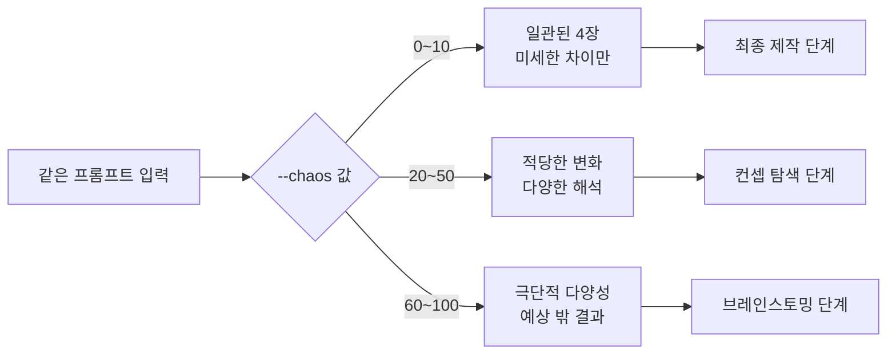
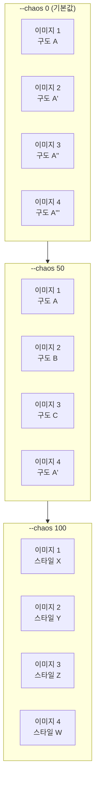
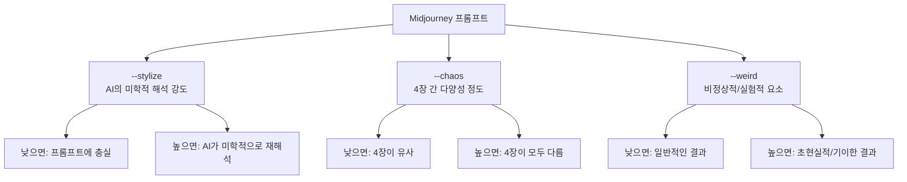
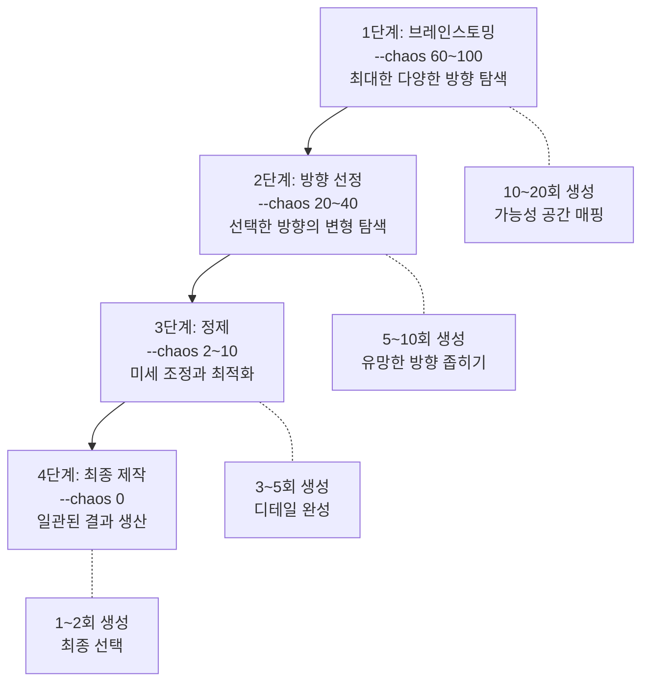
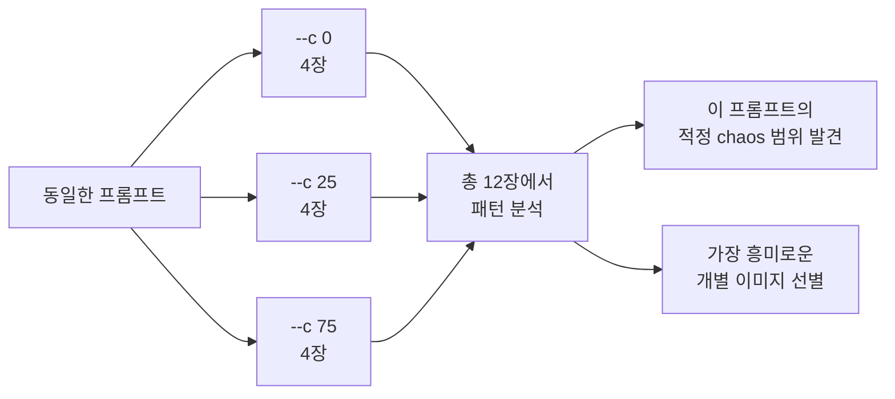
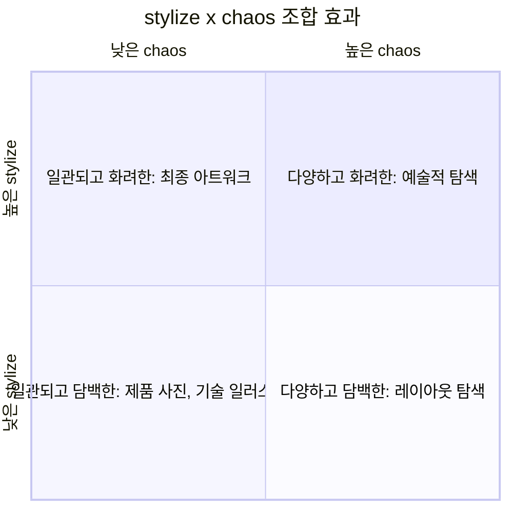

# 카오스(--chaos)와 다양성 탐색

> --chaos 파라미터로 Midjourney 결과물의 다양성을 제어하고, 아이디어 탐색부터 최종 제작까지 단계별 활용 전략을 마스터합니다.

## 개요

이 섹션에서는 Midjourney의 `--chaos` 파라미터가 4장 그리드의 다양성을 어떻게 제어하는지 학습합니다. 낮은 chaos에서 일관된 결과를 얻는 법, 높은 chaos로 예상 밖의 영감을 발견하는 법, 그리고 프로젝트 단계에 따라 chaos 값을 전략적으로 조절하는 법을 다룹니다.

**선수 지식**: [01. Midjourney 인터페이스와 기본 생성](05-ch5-midjourney-기본과-파라미터-튜닝/01-01-midjourney-인터페이스와-기본-생성.md)에서 배운 4장 그리드와 Imagine Bar 사용법, [03. 스타일라이즈(--stylize)와 미학 제어](05-ch5-midjourney-기본과-파라미터-튜닝/03-03-스타일라이즈--stylize와-미학-제어.md)에서 배운 --stylize 파라미터의 개념

**학습 목표**:
- `--chaos` 파라미터의 작동 원리와 값 범위(0~100)를 이해할 수 있다
- 낮은/중간/높은 chaos 값이 생성 결과에 미치는 구체적 차이를 구분할 수 있다
- 프로젝트 단계(탐색 vs 정제)에 맞는 chaos 전략을 수립할 수 있다
- `--stylize`와 `--chaos`를 조합하여 원하는 결과를 효율적으로 도출할 수 있다

## 왜 알아야 할까?

디자이너가 새로운 프로젝트를 시작할 때 가장 먼저 하는 일이 뭘까요? 바로 **아이디어 탐색**입니다. 스케치북을 펼치고, 핀터레스트를 돌아다니고, 온갖 레퍼런스를 모으죠. 이 탐색 단계에서는 다양하고 예상 밖의 시각적 방향이 필요합니다. 하지만 최종 시안을 만들 때는요? 정해진 방향 안에서 미세한 변형만 원하게 됩니다.

`--chaos` 파라미터는 바로 이 **"탐색의 폭"**을 제어하는 다이얼입니다. 같은 프롬프트를 넣어도 chaos 값에 따라 4장의 결과가 거의 비슷할 수도 있고, 완전히 다른 세계의 이미지가 나올 수도 있거든요. 이걸 모르면 Midjourney를 쓸 때 두 가지 문제에 빠집니다. 탐색이 필요할 때 너무 비슷한 결과만 돌리면서 시간을 낭비하거나, 반대로 최종 제작 단계에서 결과가 너무 들쑥날쑥해서 원하는 방향을 잡지 못하는 거죠.

> 📊 **그림 1**: chaos 파라미터의 역할 — 탐색과 정제 사이의 다이얼

## 핵심 개념

### --chaos란 무엇인가: 주사위의 면 수를 바꾸는 파라미터

> 💡 **비유**: 카페에서 커피를 주문한다고 상상해보세요. `--chaos 0`은 "늘 마시던 아메리카노 주세요"와 같습니다. 매번 거의 같은 맛이 나오죠. `--chaos 50`은 "오늘의 추천 커피 주세요"입니다. 기대와 다를 수 있지만 크게 벗어나진 않아요. `--chaos 100`은 "바리스타님이 마음대로 만들어주세요"입니다. 에스프레소 토닉이 나올 수도 있고, 아포가토가 나올 수도 있는 거죠.

`--chaos`(또는 줄여서 `--c`)는 Midjourney가 4장의 이미지를 생성할 때 **각 이미지 간의 다양성**을 제어하는 파라미터입니다. 웹 인터페이스에서는 "Variety"라는 이름으로도 표시되는데요, 본질적으로 같은 기능입니다.

**기본 문법:**
- `--chaos 50` 또는 `--c 50`
- 값 범위: **0 ~ 100** (정수)
- 기본값: **0** (Midjourney 공식 Parameter List 기준)

> 💡 **알고 계셨나요?**: `--chaos`의 기본값은 Midjourney 공식 [Parameter List 문서](https://docs.midjourney.com/hc/en-us/articles/32859204029709-Parameter-List)에 **0**으로 명시되어 있습니다. 다만 Midjourney는 버전 업데이트가 빈번하고, 웹 인터페이스의 Variety 슬라이더 기본 위치가 모델 버전에 따라 달라질 수 있으므로, 정확한 기본 동작을 확인하고 싶다면 `/settings` 명령어나 Settings 패널에서 현재 기본값을 직접 확인하는 것이 가장 확실합니다.

기본값이 0이라는 점이 중요합니다. 아무 설정 없이 프롬프트를 넣으면 Midjourney는 가장 일관된 결과를 보여주려 합니다. chaos 값을 올릴수록 4장 그리드 안에서 이미지들이 서로 다른 방향으로 갈라지기 시작하죠.

> 📊 **그림 2**: --chaos 값에 따른 4장 그리드의 다양성 변화

여기서 핵심은 **chaos가 바꾸는 것이 무엇인가**입니다. chaos는 이미지의 "품질"이나 "미학 수준"을 바꾸지 않습니다. 4장 이미지가 서로 **얼마나 다르게** 나오느냐만 제어합니다. 구도, 색상 팔레트, 시점, 피사체 해석, 심지어 전체 분위기까지 — 이 모든 요소가 chaos 값에 따라 통일되거나 갈라집니다.

### 값 구간별 효과: 0에서 100까지 무슨 일이 일어나는가

> 💡 **비유**: chaos 값은 오케스트라의 지휘 방식에 비유할 수 있습니다. chaos 0은 지휘자가 악보를 정확히 따르게 하는 것이고, chaos 50은 "이 테마를 각자 해석해보세요"라고 하는 것, chaos 100은 "자유 즉흥 연주!"와 같습니다.

실제로 각 구간에서 어떤 변화가 일어나는지 구체적으로 살펴보겠습니다.

**--chaos 0 (기본값)**: 4장의 이미지가 매우 유사합니다. 구도, 색감, 피사체 배치, 시점이 거의 동일한 범위 안에 머무릅니다. 같은 프롬프트를 여러 번 돌려도 비슷한 결과가 나오므로 **재현성이 높습니다.**

**--chaos 2~10 (미세 변형)**: 흥미롭게도, 이 낮은 범위에서도 눈에 띄는 변화가 나타납니다. "a little chaos goes a long way"라는 표현이 있을 정도인데요, 값 2~10만으로도 구도나 색상에 의미 있는 변형이 생깁니다. 많은 전문 사용자들이 이 구간을 "스위트 스팟"으로 꼽습니다.

**--chaos 20~50 (탐색 구간)**: 4장의 이미지가 같은 주제를 공유하되, 접근 방식이 눈에 띄게 달라집니다. 한 장은 클로즈업, 다른 한 장은 전경 뷰, 또 다른 한 장은 다른 색상 팔레트를 적용하는 식이죠. 컨셉 탐색에 가장 실용적인 구간입니다.

**--chaos 60~100 (브레인스토밍 구간)**: 구도, 스타일, 분위기가 극적으로 달라집니다. 때로는 프롬프트를 꽤 자유롭게 해석하여 예상치 못한 결과를 내놓기도 합니다. 완전히 새로운 방향의 영감이 필요할 때 강력하지만, 원하는 방향을 잡기는 어려워집니다.

| chaos 구간 | 다양성 수준 | 프롬프트 충실도 | 주요 용도 |
|-----------|-----------|--------------|---------|
| 0 | 최소 | 매우 높음 | 최종 시안, 일관성 필요 시 |
| 2~10 | 미세~낮음 | 높음 | 미세 조정, 변형 비교 |
| 20~50 | 중간 | 보통 | 컨셉 탐색, 방향 탐색 |
| 60~100 | 높음~극단 | 낮음 | 브레인스토밍, 영감 발견 |

> ⚠️ **흔한 오해**: "--chaos를 높이면 이미지 품질이 떨어진다"고 생각하는 분이 많은데, 이는 사실이 아닙니다. chaos는 품질이 아니라 **다양성**을 제어합니다. chaos 100에서도 개별 이미지의 품질은 동일하게 유지됩니다. 다만 프롬프트에서 벗어난 해석이 나올 수 있어 "원하지 않는 결과"가 나올 확률이 높아지는 것이죠.

### --chaos vs --stylize vs --weird: 세 파라미터의 차이

Midjourney에는 결과물에 영향을 미치는 비슷해 보이는 파라미터가 여러 개 있어서 혼동하기 쉽습니다. 특히 `--chaos`, `--stylize`, `--weird`를 명확히 구분하는 것이 중요합니다.

> 📊 **그림 3**: 세 파라미터가 제어하는 영역 비교

핵심 차이를 정리하면 이렇습니다:

- **--stylize**: 모든 4장의 미학적 품질을 **균일하게** 올리거나 내림. "얼마나 예쁘게?" 
- **--chaos**: 4장 **사이의 차이**를 제어. "얼마나 다르게?"
- **--weird**: 모든 4장을 **균일하게** 기이하고 비정상적인 방향으로 밀어냄. "얼마나 이상하게?"

`--stylize`가 모든 이미지를 같은 방향으로 움직이는 "볼륨 다이얼"이라면, `--chaos`는 이미지들이 **서로 다른 방향으로 흩어지는 정도**를 조절하는 "분산 다이얼"인 셈입니다. 앞 섹션에서 배운 [--stylize](05-ch5-midjourney-기본과-파라미터-튜닝/03-03-스타일라이즈--stylize와-미학-제어.md)와 함께 사용하면 매우 강력한 조합이 됩니다.

### 프로젝트 단계별 chaos 전략: 깔때기(Funnel) 모델

> 💡 **비유**: 금을 찾는 과정을 떠올려보세요. 처음에는 넓은 지역을 탐사하며 금맥이 있을 만한 곳을 찾습니다(높은 chaos). 유망한 지점을 발견하면 그 주변을 집중적으로 파들어 가죠(중간 chaos). 마지막으로 발견한 금맥을 정밀하게 채굴합니다(낮은 chaos). AI 이미지 생성의 워크플로우도 정확히 이 흐름을 따릅니다.

실무에서 가장 중요한 것은 **프로젝트 단계에 따라 chaos를 전략적으로 조절**하는 것입니다. 이를 **"깔때기(Funnel) 전략"**이라고 부르는데, 넓은 입구에서 시작해 점점 좁혀 나가는 구조를 말합니다.

> 📊 **그림 4**: 프로젝트 진행에 따른 chaos 전략 — 깔때기 모델

이 깔때기의 핵심은 **각 단계에서 의사결정을 하고 다음 단계로 넘어간다**는 점입니다. 뒤로 돌아가는 것도 가능하지만, 일반적으로 단계를 내려갈수록 생성 횟수가 줄어들고 효율이 올라갑니다.

**1단계 — 브레인스토밍 (chaos 60~100)**

프로젝트 초기에 아무 방향도 정해지지 않았을 때, 높은 chaos로 Midjourney가 프롬프트를 자유롭게 해석하도록 합니다. 이 단계의 목표는 "좋은 이미지"가 아니라 "예상 밖의 방향 발견"입니다. 4장 중 3장이 마음에 안 들어도, 1장에서 새로운 가능성을 발견하면 성공입니다.

이 단계에서는 **10~20회 정도 생성**하면서 가능한 한 넓은 가능성 공간을 매핑합니다. 생성된 이미지들을 분류하면서 어떤 방향들이 나왔는지 정리하세요.

**2단계 — 방향 선정 (chaos 20~40)**

1단계에서 흥미로운 방향을 2~3개 발견했으면, 그 방향의 키워드를 프롬프트에 반영하고 중간 chaos로 변형을 탐색합니다. 이 구간에서는 같은 주제의 다양한 접근법을 비교할 수 있어요. 방향별로 **5~10회 생성**하면서 가장 유망한 1~2개 방향을 확정합니다.

**3단계 — 정제 (chaos 2~10)**

방향이 확정되면, 낮은 chaos로 미세한 변형만 만들어 가장 완성도 높은 버전을 찾습니다. 이 단계에서는 구도나 색감의 아주 작은 차이를 비교하게 됩니다. **3~5회 생성**이면 충분한 경우가 많습니다.

**4단계 — 최종 제작 (chaos 0)**

최종 결과물을 생산할 때는 chaos를 0으로 두고 일관된 품질의 이미지를 만듭니다. 시리즈 콘텐츠처럼 여러 장을 만들 때 특히 중요하죠. **1~2회 생성**으로 최종 선택을 완료합니다.

> 🔥 **실무 팁**: 깔때기 전략의 효율을 극대화하려면, 각 단계에서 **결정 기준을 미리 정해두세요.** 예를 들어 1단계에서는 "전체 분위기와 무드", 2단계에서는 "구도와 구성", 3단계에서는 "색감과 디테일"처럼 단계별로 평가 기준을 다르게 가져가면, 의사결정이 훨씬 빨라집니다.

### Chaos Bracketing: 최적 chaos 값을 빠르게 찾는 기법

사진 촬영에서 "노출 브래킷팅(Exposure Bracketing)"이라는 기법이 있습니다. 같은 장면을 노출만 바꿔가며 여러 장 찍어서 최적의 노출을 찾는 방법이죠. **Chaos Bracketing**은 이 아이디어를 Midjourney에 적용한 것입니다.

> 📊 **그림 5**: Chaos Bracketing — 같은 프롬프트, 다른 chaos 값

**Chaos Bracketing 실행 방법:**

같은 프롬프트를 chaos 값만 바꿔 3회 생성합니다. 추천 조합은 `--c 0`, `--c 25`, `--c 75`입니다.

**왜 이 세 값인가?**
- `--c 0`: 기준선(baseline). Midjourney가 가장 "안전하게" 해석한 결과
- `--c 25`: 적당한 변형. 프롬프트 의도를 유지하면서 다양한 접근
- `--c 75`: 높은 다양성. 예상 밖의 해석과 새로운 가능성

12장의 이미지를 놓고 비교하면, 해당 프롬프트에 **어느 chaos 구간이 가장 효과적인지** 한눈에 파악할 수 있습니다. 프롬프트가 이미 구체적이라면(detailed prompt) 낮은 chaos에서도 충분한 변형이 나올 것이고, 추상적인 프롬프트라면 높은 chaos에서 더 흥미로운 결과가 나올 수 있습니다.

**Chaos Bracketing이 특히 유용한 상황:**
- 새로운 프롬프트를 처음 테스트할 때
- 클라이언트에게 다양성 범위를 보여줘야 할 때
- 프롬프트의 "chaos 감도"를 파악하고 싶을 때 (어떤 프롬프트는 chaos 변화에 민감하고, 어떤 프롬프트는 둔감합니다)

### --chaos와 --stylize의 조합 매트릭스

두 파라미터를 함께 사용하면 결과물의 성격이 크게 달라집니다. 이 조합을 이해하면 상황에 맞는 최적의 세팅을 빠르게 잡을 수 있습니다.

> 📊 **그림 6**: --stylize x --chaos 조합 매트릭스

| 조합 | stylize | chaos | 결과 성격 | 활용 사례 |
|------|---------|-------|---------|---------|
| 정밀 제작 | 낮음 (0~50) | 낮음 (0~10) | 프롬프트에 충실, 일관적 | 제품 목업, 기술 일러스트 |
| 아트 제작 | 높음 (300~600) | 낮음 (0~10) | 미학적이고 일관적 | 최종 아트워크, 포스터 |
| 컨셉 탐색 | 낮음 (0~50) | 높음 (50~100) | 다양하지만 담백한 | 레이아웃/구도 실험 |
| 예술 탐색 | 높음 (300~600) | 높음 (50~100) | 다양하고 화려한 | 무드보드, 영감 수집 |

각 조합의 특성을 조금 더 풀어볼까요?

**정밀 제작 (낮은 stylize + 낮은 chaos)**: 프롬프트에 적힌 대로 충실하게, 4장이 거의 같은 결과를 냅니다. 제품 사진처럼 정확한 재현이 필요하거나, 기술 일러스트처럼 프롬프트의 내용이 정확히 반영되어야 할 때 최적입니다.

**아트 제작 (높은 stylize + 낮은 chaos)**: AI가 미학적으로 적극 해석하되, 4장이 같은 방향으로 갑니다. 최종 아트워크, 포스터, 앨범 커버처럼 높은 완성도의 일관된 결과가 필요할 때 사용합니다.

**컨셉 탐색 (낮은 stylize + 높은 chaos)**: AI의 미학적 개입은 최소화하면서 다양한 구도와 레이아웃을 볼 수 있습니다. "어떤 구성이 좋을까?"를 탐색하는 초기 단계에 적합합니다.

**예술 탐색 (높은 stylize + 높은 chaos)**: AI가 미학적으로도 적극 해석하고, 방향도 모두 다르게 갑니다. 가장 예측 불가능하지만 가장 영감을 주는 조합이에요. 무드보드를 만들거나, 전혀 새로운 비주얼 방향을 찾을 때 강력합니다.

> 🔥 **실무 팁**: 많은 프로 사용자들이 추천하는 "골든 세팅"이 있습니다. 탐색 단계에서는 `--s 250 --c 30`, 정제 단계에서는 `--s 100 --c 5`를 시작점으로 삼아보세요. 물론 프로젝트 성격에 따라 조정이 필요하지만, 좋은 출발점이 됩니다.

## 실습: 적용해보기

### 활동 1: chaos 값 비교 실험

아래 프롬프트를 동일하게 유지하면서 chaos 값만 바꿔 생성해보세요. 4장 그리드에서 이미지 간 차이가 어떻게 달라지는지 관찰합니다.

**기본 프롬프트**: `a cozy reading nook with natural light, watercolor style --ar 3:4`

| 실험 | 파라미터 | 관찰 포인트 |
|------|---------|-----------|
| 실험 1 | `--c 0` | 4장이 얼마나 비슷한가? 구도, 색상, 시점 비교 |
| 실험 2 | `--c 10` | 기본값 대비 어떤 요소가 달라졌나? |
| 실험 3 | `--c 50` | 4장 중 가장 마음에 드는 것과 가장 예상 밖인 것은? |
| 실험 4 | `--c 100` | 프롬프트의 어떤 부분이 가장 자유롭게 해석되었나? |

**기록 워크시트**:
- 각 실험에서 4장의 **공통점**은 무엇이었나요?
- 각 실험에서 4장의 **차이점**은 무엇이었나요?
- 어느 chaos 값에서 가장 흥미로운 발견이 있었나요?
- 이 프롬프트의 경우, 적정 chaos 값은 얼마라고 생각하나요?

### 활동 2: Chaos Bracketing 실습

Chaos Bracketing 기법을 직접 체험해봅시다.

**프롬프트**: `a mysterious ancient temple hidden in a jungle, cinematic lighting --ar 16:9`

**Step 1 — 브래킷 생성** (3회)
- `--c 0`으로 1회 생성 → 4장 저장
- `--c 25`로 1회 생성 → 4장 저장
- `--c 75`로 1회 생성 → 4장 저장

**Step 2 — 분석표 작성**

| 항목 | --c 0 | --c 25 | --c 75 |
|------|-------|--------|--------|
| 구도 유사도 (1~5) | | | |
| 색상 팔레트 유사도 (1~5) | | | |
| 시점/앵글 유사도 (1~5) | | | |
| 가장 마음에 드는 이미지 번호 | | | |
| 가장 예상 밖인 이미지 번호 | | | |

**Step 3 — 결론 도출**
- 이 프롬프트에 최적인 chaos 범위는 어디인가요?
- chaos 25와 75 사이에서 "의미 있는 전환점"이 느껴지나요?
- 다음에 이 프롬프트를 다시 사용한다면 어떤 chaos 값으로 시작하시겠습니까?

### 활동 3: 프로젝트 시뮬레이션 — 카페 인테리어 포스터

가상의 의뢰를 수행해봅시다. "따뜻하고 아늑한 분위기의 카페 인테리어 포스터"를 만들어야 합니다.

**Step 1 — 브레인스토밍** (3회 생성)
- 프롬프트: `warm cozy cafe interior, afternoon sunlight --ar 16:9 --c 80`
- 12장(3회 x 4장)에서 흥미로운 방향 3개를 선택하세요.

**Step 2 — 방향 탐색** (선택한 방향별 2회씩)
- 선택한 방향의 키워드를 프롬프트에 추가하고 `--c 30`으로 변경
- 각 방향에서 가장 좋은 1장을 선택하세요.

**Step 3 — 정제** (최종 후보별 2회씩)
- `--c 5`로 미세 변형을 만들어 최종 1장을 선택하세요.

**토론 질문**:
- 각 단계에서 chaos 값을 바꿨을 때 작업 효율이 어떻게 달라졌나요?
- 만약 처음부터 chaos 0으로만 작업했다면 최종 결과가 달라졌을까요?
- 같은 프로젝트에서 다른 사람은 어떤 방향을 선택했을까요?

### 활동 4: --stylize와 --chaos 조합 비교

같은 프롬프트에 아래 4가지 조합을 적용하고, 각 결과의 성격을 분석해보세요.

**프롬프트**: `futuristic cityscape at sunset --ar 16:9`

| 조합 | 세팅 | 예상되는 결과 | 실제 결과 (메모) |
|------|------|-------------|----------------|
| A | `--s 50 --c 0` | 담백하고 일관적 | |
| B | `--s 500 --c 0` | 화려하고 일관적 | |
| C | `--s 50 --c 80` | 담백하고 다양한 | |
| D | `--s 500 --c 80` | 화려하고 다양한 | |

**분석 질문**:
- 조합 A와 B의 차이가 큰가요? stylize만 바꿨을 때 어떤 요소가 변했나요?
- 조합 A와 C의 차이가 큰가요? chaos만 바꿨을 때 어떤 요소가 변했나요?
- 조합 D에서 가장 예상 밖의 결과가 나왔다면, 그것이 영감을 주는 수준인가요, 아니면 그냥 혼란스러운 수준인가요?
- 이 프롬프트에 가장 적합한 조합은 어느 것이라고 생각하나요?

## 더 깊이 알아보기

### "Chaos"라는 이름의 유래

Midjourney가 이 파라미터에 "chaos"라는 이름을 붙인 것은 단순한 작명이 아닙니다. 수학과 과학의 **카오스 이론(Chaos Theory)**에서 영감을 받은 이름이죠. 1960년대 기상학자 에드워드 로렌츠(Edward Lorenz)가 기상 예측 시뮬레이션을 돌리다가 초기값의 아주 작은 차이가 완전히 다른 기상 패턴을 만들어낸다는 것을 발견했습니다. 이것이 유명한 "나비 효과(Butterfly Effect)"의 시작입니다.

Midjourney의 `--chaos` 파라미터도 비슷한 원리로 작동합니다. AI 이미지 생성은 랜덤 노이즈에서 시작하는데, chaos 값을 높이면 이 초기 시작점들이 더 넓게 분산됩니다. 마치 로렌츠의 기상 모델에서 초기값을 조금씩 바꿨을 때 완전히 다른 날씨가 나오듯, 시작점이 조금만 달라져도 최종 이미지가 크게 달라지는 거죠.

흥미로운 것은, Midjourney가 웹 인터페이스에서는 같은 기능을 "Variety"라는 훨씬 직관적인 이름으로 표기한다는 점입니다. Discord에서 시작된 `--chaos`라는 원래 이름과, 일반 사용자를 위한 "Variety"라는 이름이 공존하고 있는데, 커뮤니티에서는 여전히 "chaos"라는 이름을 더 많이 사용합니다.

### 디퓨전 모델에서의 초기 노이즈

기술적으로 조금 더 들어가볼까요? [생성형 AI가 바꾸는 디자인 워크플로우](01-ch1-ai-이미지-생성-개론/01-01-생성형-ai가-바꾸는-디자인-워크플로우.md)에서 배운 디퓨전 모델의 원리를 떠올려보면, AI는 **랜덤 노이즈**에서 출발하여 점진적으로 노이즈를 제거하면서 이미지를 만들어냅니다. 4장의 이미지를 생성할 때, 각각 다른 랜덤 시드에서 출발하는데, chaos는 이 시드들이 **얼마나 다른 공간에서 출발하느냐**를 결정합니다. chaos 0이면 비슷한 공간에서 출발하므로 비슷한 결과에 수렴하고, chaos 100이면 아주 먼 공간에서 출발하므로 완전히 다른 결과가 나오는 겁니다.

## 흔한 오해와 팁

> ⚠️ **흔한 오해**: "chaos 값은 높을수록 창의적이다"라고 생각하기 쉽지만, 실제로는 **수확 체감의 법칙**이 적용됩니다. 많은 전문 사용자들이 chaos 2~10이 "sweet spot"이라고 보고하는데, 이 작은 값만으로도 의미 있는 변화가 나타나며 결과물의 일관성도 유지되기 때문입니다. chaos 100은 완전히 새로운 방향이 필요할 때만 사용하세요.

> 💡 **알고 계셨나요?**: Midjourney 설정(Settings) 패널에서 기본 Variety(chaos) 값을 미리 설정할 수 있습니다. Imagine Bar 옆의 설정 버튼을 클릭하면 되는데요, 이 설정은 이후 모든 프롬프트에 자동 적용됩니다. 탐색 세션을 시작할 때 미리 높여두고, 정제 단계에서 낮추는 습관을 들이면 매번 파라미터를 타이핑하는 수고를 덜 수 있습니다.

> 🔥 **실무 팁**: `--chaos`와 `--seed`를 함께 사용하면 재현 가능한 실험이 가능합니다. 특정 시드에서 chaos 값만 바꿔가며 비교하면, chaos가 순수하게 다양성에만 어떤 영향을 미치는지 정확히 파악할 수 있습니다. 예를 들어 `--seed 12345 --c 0`과 `--seed 12345 --c 50`을 비교해보세요.

> 🔥 **실무 팁**: 프롬프트의 구체성과 chaos의 관계도 기억하세요. 프롬프트가 매우 상세하면(`a red Victorian house with white trim, front porch, oak tree, autumn leaves, golden hour, wide angle`), chaos를 높여도 변형 폭이 상대적으로 작습니다. 반면 짧고 추상적인 프롬프트(`dream`)에서는 chaos 25만으로도 극적인 차이가 나타납니다. 프롬프트 길이와 chaos 값은 함께 고려해야 합니다.

## 핵심 정리

| 개념 | 설명 |
|------|------|
| --chaos (--c) | 4장 그리드의 이미지 간 다양성을 제어하는 파라미터 |
| 값 범위 | 0~100 (기본값 0, 공식 Parameter List 기준) |
| 웹 명칭 | Variety (Settings 패널에서 설정 가능) |
| 낮은 값 (0~10) | 일관된 결과, 미세 변형, 최종 제작에 적합 |
| 중간 값 (20~50) | 적당한 다양성, 컨셉 탐색에 적합 |
| 높은 값 (60~100) | 극단적 다양성, 브레인스토밍에 적합 |
| --chaos vs --stylize | chaos는 "이미지 간 차이", stylize는 "미학 강도" |
| --chaos vs --weird | chaos는 "다양성", weird는 "기이함" |
| 깔때기 전략 | 높은 chaos로 탐색 → 점진적으로 낮춰 정제 (4단계) |
| Chaos Bracketing | --c 0/25/75로 3회 생성, 12장에서 적정 범위 탐색 |
| 스위트 스팟 | 2~10에서도 의미 있는 변화, 수확 체감 존재 |
| 조합 매트릭스 | stylize x chaos 4분면으로 결과 성격 예측 |

## 다음 섹션 미리보기

다음 섹션 [05. 네거티브 프롬프트(--no)와 품질 제어](05-ch5-midjourney-기본과-파라미터-튜닝/05-05-네거티브-프롬프트--no와-품질-제어.md)에서는 원하지 않는 요소를 결과에서 제거하는 `--no` 파라미터를 학습합니다. chaos로 다양한 방향을 탐색한 뒤, 네거티브 프롬프트로 불필요한 요소를 걸러내면 원하는 결과에 더 빠르게 도달할 수 있습니다. --chaos와 --no를 함께 활용하는 전략도 다루겠습니다.

## 참고 자료

- [Chaos / Variety – Midjourney 공식 문서](https://docs.midjourney.com/hc/en-us/articles/32099348346765-Chaos-Variety) - --chaos 파라미터의 공식 설명과 기본 사용법
- [Midjourney Parameter List – 공식 파라미터 전체 목록](https://docs.midjourney.com/hc/en-us/articles/32859204029709-Parameter-List) - 모든 파라미터의 범위와 기본값을 한눈에 확인
- [Guide to Midjourney's --chaos: Introduce More Randomness (Aituts)](https://aituts.com/midjourney-chaos/) - chaos 값 구간별 상세 비교와 실전 팁
- [Midjourney --chaos Explained (Midlibrary)](https://midlibrary.io/midguide/midjourney-ai-chaos-explained) - chaos 파라미터의 심층 분석과 다른 파라미터와의 차이 설명
- [Midjourney Parameter Visual Guide (Tory Barber)](https://torybarber.com/midjourney-parameter-visual-guide/) - 파라미터별 시각적 비교 가이드

---
### 🔗 Related Sessions
- [imagine bar](05-ch5-midjourney-기본과-파라미터-튜닝/01-01-midjourney-인터페이스와-기본-생성.md) (prerequisite)
- [4장 그리드](05-ch5-midjourney-기본과-파라미터-튜닝/01-01-midjourney-인터페이스와-기본-생성.md) (prerequisite)
- [디퓨전 모델](01-ch1-ai-이미지-생성-개론/01-01-생성형-ai가-바꾸는-디자인-워크플로우.md) (prerequisite)
- [--stylize(--s)](05-ch5-midjourney-기본과-파라미터-튜닝/03-03-스타일라이즈--stylize와-미학-제어.md) (prerequisite)
